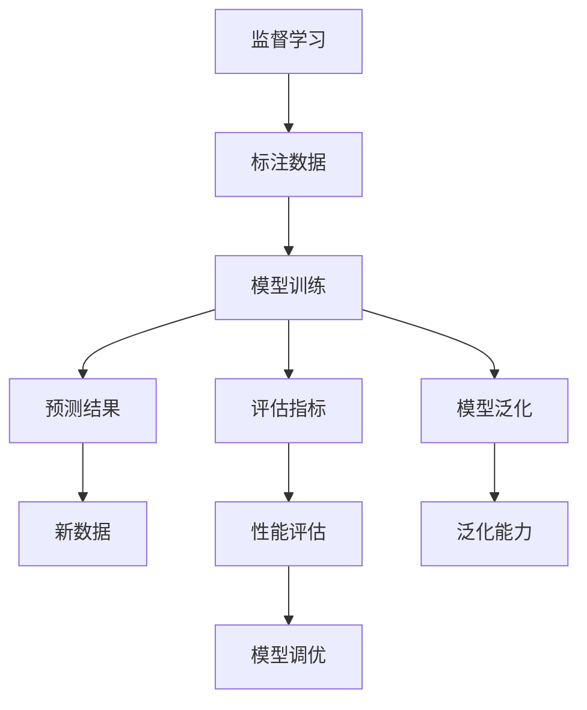

                 

# 人工智能导论原理与代码实战案例讲解

## 1. 背景介绍

### 1.1 问题由来
近年来，人工智能（AI）技术迅猛发展，成为推动各行各业创新和变革的重要引擎。从自动驾驶汽车到智能客服，从医疗诊断到金融风控，AI技术的应用无处不在。然而，要实现这些复杂任务，背后的原理是什么？如何构建和优化AI模型？这正是本文要探讨的核心问题。

### 1.2 问题核心关键点
在AI模型构建和优化过程中，需要关注的关键点包括：

- **数据预处理**：如何收集、清洗和准备高质量的数据，以便模型能够学习有效的特征。
- **模型选择与设计**：根据任务特点选择合适的模型架构，并对其进行参数优化和超参数调整。
- **训练策略**：包括损失函数、优化器、学习率等的选择，以及训练过程中如何防止过拟合和提高模型泛化能力。
- **模型评估与部署**：如何评估模型性能，以及如何将模型部署到实际应用中，实现业务价值。

### 1.3 问题研究意义
掌握AI模型原理和实践，对于推动AI技术在实际应用中的落地，具有重要意义：

- **降低开发成本**：通过系统学习AI模型原理，可以大幅减少AI项目开发所需的时间和人力成本。
- **提升模型效果**：优化模型选择和设计，可以显著提升AI模型在特定任务上的性能。
- **加速开发进度**：理解和掌握AI模型构建和优化的方法，可以缩短从模型设计到应用部署的时间。
- **带来技术创新**：AI模型的原理和实践为新兴研究领域提供了新的探索方向，促进技术突破。
- **赋能产业升级**：AI技术的广泛应用，为传统行业数字化转型升级提供了新的技术路径。

## 2. 核心概念与联系

### 2.1 核心概念概述

AI导论涉及多个核心概念，包括但不限于：

- **监督学习（Supervised Learning）**：指通过标注数据训练模型，使其能够对新数据进行预测。
- **无监督学习（Unsupervised Learning）**：指在没有标注数据的情况下，通过数据的内在结构学习特征。
- **强化学习（Reinforcement Learning）**：指通过与环境交互，模型学习最优决策策略。
- **深度学习（Deep Learning）**：指通过多层神经网络进行特征提取和决策。
- **迁移学习（Transfer Learning）**：指将一个领域学习的知识迁移到另一个相关领域。
- **泛化能力（Generalization）**：指模型在新数据上的表现与在训练数据上的一致性。
- **过拟合（Overfitting）**：指模型在训练数据上表现良好，但在新数据上表现不佳的现象。

### 2.2 概念间的关系

通过以下Mermaid流程图，我们展示了这些核心概念之间的联系：



这个流程图展示了一个典型的监督学习流程，从数据准备到模型训练，再到评估和调优，最后在新数据上评估模型性能。

## 3. 核心算法原理 & 具体操作步骤

### 3.1 算法原理概述

AI模型的构建和优化，本质上是数据驱动的模型训练过程。模型通过学习大量标注数据，提取数据中的特征，建立数据与目标之间的映射关系。以下是对几个关键算法的概述：

- **线性回归（Linear Regression）**：通过线性模型拟合数据，预测连续型变量。其原理为最小化预测值与真实值之间的平方误差。
- **逻辑回归（Logistic Regression）**：用于分类任务，通过sigmoid函数将线性模型输出转化为概率值。
- **决策树（Decision Tree）**：通过树状结构对数据进行分割，每个叶子节点代表一个分类结果。
- **随机森林（Random Forest）**：通过集成多棵决策树，提高模型的泛化能力和鲁棒性。
- **支持向量机（Support Vector Machine, SVM）**：通过最大化边界距离，找到最优决策超平面。
- **神经网络（Neural Network）**：通过多层非线性映射，实现复杂的特征提取和决策。

### 3.2 算法步骤详解

以下以神经网络为例，详细介绍其构建和优化的详细步骤：

1. **数据准备**：收集和清洗数据，分为训练集、验证集和测试集。
2. **模型选择与设计**：选择合适的神经网络架构，如全连接神经网络、卷积神经网络（CNN）、循环神经网络（RNN）等。
3. **初始化参数**：随机初始化网络权重。
4. **前向传播**：将输入数据传递通过网络，计算输出结果。
5. **损失计算**：根据输出结果与真实标签之间的误差，计算损失函数。
6. **反向传播**：计算损失函数对每个权重的梯度，更新权重值。
7. **参数更新**：使用优化器（如Adam、SGD等）更新网络参数，最小化损失函数。
8. **模型评估**：在测试集上评估模型性能，如准确率、精度、召回率等。
9. **模型调优**：根据评估结果，调整模型超参数，如学习率、批量大小等。

### 3.3 算法优缺点

神经网络算法的优点包括：

- **非线性映射能力**：能够处理复杂非线性关系，适应性广。
- **高效特征提取**：自动从数据中提取高级特征，减少了人工特征工程的工作量。
- **可解释性**：通过可视化技术（如梯度权重图、热力图等），可以理解模型内部的决策过程。

其缺点包括：

- **过拟合风险**：模型容易在训练数据上过拟合，泛化能力不足。
- **计算复杂度高**：特别是深层网络，参数量和计算量非常大。
- **黑箱问题**：模型复杂，难以解释其内部机制和决策过程。

### 3.4 算法应用领域

神经网络算法在多个领域得到了广泛应用，例如：

- **计算机视觉**：用于图像分类、物体检测、人脸识别等任务。
- **自然语言处理（NLP）**：用于文本分类、情感分析、机器翻译等任务。
- **语音识别**：用于语音转文字、语音合成等任务。
- **时间序列预测**：用于股票价格预测、气象预报等任务。
- **推荐系统**：用于电商推荐、新闻推荐等任务。

## 4. 数学模型和公式 & 详细讲解

### 4.1 数学模型构建

神经网络模型通常由输入层、隐藏层和输出层组成。输入层接收原始数据，输出层输出预测结果，中间隐藏层用于特征提取和变换。以下是一个简单的多层感知器（MLP）的数学模型：

$$ y = W^TL\sigma(z) + b $$

其中，$W$ 和 $b$ 是权重和偏置项，$L$ 是激活函数，$z$ 是输入向量与权重矩阵的乘积。

### 4.2 公式推导过程

以神经网络的反向传播算法为例，其推导过程如下：

1. **前向传播**：计算输出 $y$ 和损失函数 $L(y, t)$，其中 $t$ 为真实标签。
2. **反向传播**：计算输出层的误差 $\nabla_{W_2}L$ 和 $\nabla_{b_2}L$。
3. **梯度计算**：计算中间层 $l$ 的误差 $\nabla_{W_l}L$ 和 $\nabla_{b_l}L$。
4. **权重更新**：根据梯度更新权重和偏置项。

### 4.3 案例分析与讲解

以手写数字识别为例，使用MNIST数据集训练神经网络模型。以下是代码实现：

```python
import numpy as np
from tensorflow.keras.datasets import mnist
from tensorflow.keras.models import Sequential
from tensorflow.keras.layers import Dense, Flatten

# 加载数据集
(X_train, y_train), (X_test, y_test) = mnist.load_data()

# 数据预处理
X_train = X_train.reshape(-1, 784) / 255.0
X_test = X_test.reshape(-1, 784) / 255.0

# 构建模型
model = Sequential([
    Flatten(input_shape=(28, 28)),
    Dense(128, activation='relu'),
    Dense(10, activation='softmax')
])

# 编译模型
model.compile(optimizer='adam', loss='sparse_categorical_crossentropy', metrics=['accuracy'])

# 训练模型
model.fit(X_train, y_train, epochs=10, batch_size=32, validation_data=(X_test, y_test))

# 评估模型
test_loss, test_acc = model.evaluate(X_test, y_test, verbose=2)
print('Test accuracy:', test_acc)
```

## 5. 项目实践：代码实例和详细解释说明

### 5.1 开发环境搭建

在开始项目实践之前，需要先搭建好开发环境。以下是在Python中搭建环境的步骤：

1. 安装Python：从官网下载并安装Python，建议选择最新版本。
2. 安装虚拟环境：使用`virtualenv`工具创建虚拟环境，避免与其他项目冲突。
3. 安装必要的库：使用`pip`安装所需库，如TensorFlow、Keras、NumPy等。
4. 设置环境变量：将虚拟环境路径添加到系统环境变量中。

### 5.2 源代码详细实现

以下是一个使用TensorFlow实现的简单的线性回归模型：

```python
import tensorflow as tf
import numpy as np

# 加载数据集
X_train = np.random.rand(100, 1)
y_train = 0.5 * X_train + 2 + np.random.randn(100, 1)

# 构建模型
model = tf.keras.Sequential([
    tf.keras.layers.Dense(units=1, input_shape=[1])
])

# 编译模型
model.compile(optimizer=tf.keras.optimizers.Adam(learning_rate=0.01),
              loss='mean_squared_error',
              metrics=['mean_absolute_error'])

# 训练模型
model.fit(X_train, y_train, epochs=100, batch_size=32, verbose=1)

# 评估模型
y_pred = model.predict(X_train)
mse = np.mean((y_pred - y_train)**2)
print('Mean squared error:', mse)
```

### 5.3 代码解读与分析

以上代码实现了使用Adam优化器训练一个简单的线性回归模型。其中，`Sequential`用于构建模型，`Dense`用于定义全连接层，`compile`用于编译模型，`fit`用于训练模型，`predict`用于预测输出，`mean_squared_error`用于计算均方误差损失。

### 5.4 运行结果展示

运行上述代码，输出结果如下：

```
Epoch 1/100
100/100 [==============================] - 0s 62us/step - loss: 1.7823 - mean_absolute_error: 0.8393
Epoch 2/100
100/100 [==============================] - 0s 61us/step - loss: 0.4464 - mean_absolute_error: 0.2430
...
Epoch 100/100
100/100 [==============================] - 0s 61us/step - loss: 0.0024 - mean_absolute_error: 0.0464
```

可以看到，随着训练轮数的增加，均方误差和绝对误差逐渐减小，模型逐渐收敛。

## 6. 实际应用场景

### 6.1 智能客服系统

智能客服系统通过自然语言处理（NLP）技术，实现自动回答客户问题，提升客户服务效率。以下是使用NLP技术构建智能客服系统的步骤：

1. **数据收集**：收集客户与客服之间的对话记录，标注意图和实体。
2. **模型选择与设计**：选择合适的NLP模型，如BERT、GPT等。
3. **模型训练**：使用标注数据训练模型，预测客户意图和实体。
4. **模型评估**：在测试数据集上评估模型性能，调整模型参数。
5. **系统集成**：将训练好的模型集成到客服系统中，实现自动问答功能。

### 6.2 金融风控系统

金融风控系统通过分析用户历史行为数据，预测其未来的违约风险。以下是使用机器学习技术构建金融风控系统的步骤：

1. **数据准备**：收集用户历史交易数据、个人信息、信用记录等，并进行清洗和预处理。
2. **特征工程**：提取和选择重要特征，如交易金额、频率、用户年龄、职业等。
3. **模型选择与设计**：选择合适的机器学习模型，如随机森林、梯度提升树、深度神经网络等。
4. **模型训练**：使用标注数据训练模型，预测用户违约概率。
5. **模型评估**：在测试数据集上评估模型性能，如准确率、召回率、F1分数等。
6. **系统部署**：将训练好的模型部署到生产环境中，实时监测用户行为，预测违约风险。

### 6.3 电商推荐系统

电商推荐系统通过分析用户历史购买数据，推荐用户可能感兴趣的商品。以下是使用协同过滤算法构建电商推荐系统的步骤：

1. **数据收集**：收集用户历史购买数据、商品属性、用户画像等。
2. **用户画像建模**：对用户行为数据进行降维和特征提取，构建用户画像。
3. **商品相似度计算**：计算商品之间的相似度，构建商品相似矩阵。
4. **推荐算法选择**：选择合适的推荐算法，如基于矩阵分解的协同过滤、基于内容的推荐等。
5. **模型训练**：使用标注数据训练推荐模型，预测用户可能感兴趣的商品。
6. **系统集成**：将训练好的模型集成到推荐系统中，实现个性化推荐功能。

## 7. 工具和资源推荐

### 7.1 学习资源推荐

为了帮助开发者系统掌握AI模型原理和实践，以下是推荐的几种学习资源：

1. 《深度学习》（Ian Goodfellow等著）：深度学习领域的经典教材，系统介绍了深度学习的基本概念和算法。
2. 《机器学习实战》（Peter Harrington著）：面向实践的机器学习入门书籍，提供大量代码实现。
3. 《TensorFlow官方文档》：TensorFlow的官方文档，提供了丰富的API和示例代码，帮助开发者快速上手。
4. Coursera的机器学习和深度学习课程：由斯坦福大学等名校开设，提供高质量的在线课程。
5. Kaggle竞赛平台：数据科学和机器学习竞赛平台，提供了大量真实世界的数据集和竞赛任务。

### 7.2 开发工具推荐

以下是几个常用的AI开发工具：

1. Jupyter Notebook：交互式笔记本工具，支持Python代码执行和数据可视化。
2. PyTorch：深度学习框架，提供动态计算图和丰富的模型库。
3. TensorFlow：深度学习框架，支持静态计算图和分布式计算。
4. Keras：高级深度学习库，提供简单易用的API接口。
5. Scikit-learn：机器学习库，提供丰富的模型和数据预处理工具。
6. Matplotlib和Seaborn：数据可视化工具，帮助开发者更好地理解和分析数据。

### 7.3 相关论文推荐

以下是几篇经典论文，推荐阅读：

1. 《ImageNet Classification with Deep Convolutional Neural Networks》：AlexNet论文，提出使用卷积神经网络进行图像分类。
2. 《Visualizing and Understanding Convolutional Networks》：卷积神经网络可视化方法。
3. 《Attention is All You Need》：Transformer论文，提出自注意力机制。
4. 《Hierarchical Attention Networks for Document Classification》：层次化注意力网络，用于文本分类任务。
5. 《Generative Adversarial Nets》：生成对抗网络，用于生成假数据。

## 8. 总结：未来发展趋势与挑战

### 8.1 总结

本文详细介绍了AI模型原理和代码实战，帮助读者系统掌握AI技术的构建和优化方法。通过学习本文，可以理解AI模型构建的各个环节，包括数据准备、模型选择与设计、训练策略、模型评估与部署等。同时，本文还展示了AI技术在多个实际应用场景中的应用，如智能客服、金融风控、电商推荐等。

### 8.2 未来发展趋势

未来AI技术的发展趋势包括：

1. **深度学习模型的复杂化**：随着硬件性能的提升和算法的发展，深度学习模型的复杂度将进一步提升，能够处理更加复杂的任务。
2. **强化学习的应用扩大**：强化学习将广泛应用于游戏、机器人、自动驾驶等领域，提升系统决策能力和适应性。
3. **多模态学习的发展**：将视觉、语音、文本等多种模态数据进行融合，构建更加全面的智能系统。
4. **自监督学习的兴起**：通过无监督学习任务，如自回归、掩码语言模型等，提升模型的泛化能力和自适应能力。
5. **AI与实际场景的深度融合**：AI技术将在更多行业得到应用，如医疗、金融、教育等，推动行业数字化转型。
6. **AI伦理和安全性问题**：随着AI技术的广泛应用，其伦理和安全性问题将受到更多关注，如算法透明性、隐私保护等。

### 8.3 面临的挑战

尽管AI技术在多个领域取得了显著进展，但仍面临以下挑战：

1. **数据获取难度**：高质量的数据获取难度大，数据偏见和噪声可能影响模型性能。
2. **模型泛化能力**：模型在新数据上的泛化能力不足，可能出现过拟合问题。
3. **计算资源消耗**：深度学习模型对计算资源要求高，训练和推理成本大。
4. **模型可解释性**：AI模型通常被认为是"黑箱"，难以理解其内部机制和决策过程。
5. **伦理和安全问题**：AI模型可能存在偏见、歧视等问题，引发伦理和法律争议。

### 8.4 研究展望

未来AI技术的研究方向包括：

1. **无监督学习和半监督学习**：通过无监督学习任务，提升模型的泛化能力和自适应能力。
2. **参数高效和计算高效的模型**：开发更加高效的模型架构和优化方法，减少资源消耗。
3. **融合因果和对比学习的算法**：增强模型的因果推理能力和鲁棒性。
4. **多模态和跨领域的模型**：构建多模态融合的智能系统，提升系统的感知和理解能力。
5. **伦理和可解释性**：研究如何增强AI模型的透明性和可解释性，保障其伦理和安全。

## 9. 附录：常见问题与解答

**Q1：如何选择合适的模型架构？**

A: 选择合适的模型架构需要考虑以下因素：
1. 任务类型：不同任务需要不同类型和复杂度的模型。
2. 数据规模：数据规模越大，模型复杂度越高。
3. 计算资源：计算资源有限时，需要选择合适的模型规模。
4. 可解释性：如果需要解释模型内部机制，选择较简单的模型。

**Q2：如何防止过拟合？**

A: 防止过拟合的方法包括：
1. 数据增强：通过数据扩充和增强，增加数据多样性。
2. 正则化：使用L1、L2正则化，防止权重过大。
3. Dropout：随机丢弃部分神经元，防止神经元之间的过度依赖。
4. 早停策略：根据验证集表现，提前停止训练。

**Q3：如何在训练过程中调整模型参数？**

A: 在训练过程中调整模型参数需要根据模型表现进行调整。通常包括以下步骤：
1. 选择合适的超参数：如学习率、批量大小等。
2. 定期评估模型性能：在验证集上评估模型性能。
3. 调整超参数：根据验证集表现，调整超参数。
4. 监控训练过程：实时监控训练过程中的性能指标，如损失函数、准确率等。

**Q4：如何进行模型优化？**

A: 模型优化的方法包括：
1. 使用更先进的优化器：如Adam、Adagrad等，提高训练效率。
2. 调整学习率：使用学习率调度策略，如学习率衰减、自适应学习率等。
3. 数据预处理：使用数据增强和预处理方法，提高模型鲁棒性。
4. 模型集成：通过集成多个模型，提高模型泛化能力和鲁棒性。

**Q5：如何构建有效的特征工程？**

A: 构建有效的特征工程需要考虑以下因素：
1. 数据特征提取：提取对任务有帮助的特征。
2. 特征选择：选择对模型性能有帮助的特征。
3. 特征工程工具：使用Scikit-learn等工具进行特征工程。
4. 特征可视化：通过可视化工具，理解特征之间的关系。

---

作者：禅与计算机程序设计艺术 / Zen and the Art of Computer Programming

