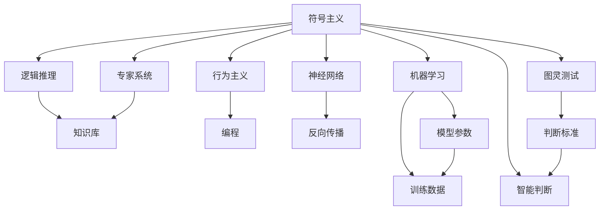

                 

# 人工智能研究的早期探索

> 关键词：人工智能,早期探索,计算复杂性,神经网络,图灵奖,算法,机器学习

## 1. 背景介绍

人工智能（Artificial Intelligence, AI）是计算机科学的一个分支，致力于让机器具备人类智能的某些方面。自上世纪50年代早期探索人工智能以来，AI领域的发展经历了多次起伏。然而，早期的研究主要以符号计算和专家系统为代表，由于无法解决复杂问题，导致研究一度陷入低谷。直到1980年代末至1990年代，随着统计学习、神经网络等技术的发展，AI研究进入黄金时代，产生了许多突破性成果。

早期人工智能研究可以追溯到1950年代，当时数学家阿兰·图灵（Alan Turing）提出了著名的图灵测试，提出一个程序如果能够通过测试，即被认为是智能的。其后，麦肯锡公司发布了第一份关于人工智能的报告，预测AI将在未来20年内取得突破。1956年，达特茅斯会议上，John McCarthy 等人提出“人工智能”这一术语，并宣布人工智能成为一门正式学科。

早期的人工智能研究，主要集中于通过逻辑推理和符号计算，实现智能化的信息处理。当时，符号主义和行为主义是两种主要的研究范式。前者以规则为基础，通过逻辑推理和符号运算实现智能行为；后者以行为为驱动，通过刺激和响应实现智能行为。然而，这两种方法在处理复杂问题时都存在明显的局限性，难以实现真正的智能。

## 2. 核心概念与联系

### 2.1 核心概念概述

为了更好地理解早期人工智能研究，本节将介绍几个核心的概念：

- **符号主义**：早期的AI研究主要采用符号主义方法，使用符号来表示知识，通过逻辑推理实现智能行为。
- **行为主义**：行为主义方法将智能行为视为刺激与响应的过程，通过编程实现刺激-响应循环。
- **专家系统**：基于规则的知识库，通过逻辑推理实现特定领域的智能决策。
- **神经网络**：由多个神经元组成的计算模型，模仿人脑神经元间的连接方式，通过反向传播算法进行训练。
- **机器学习**：使机器能够从数据中学习规律，通过算法自动优化模型参数，实现预测和决策。
- **图灵测试**：用于判断机器是否具备智能的测试方法，如果机器无法被区分，即被认为是智能的。

这些核心概念之间存在紧密的联系，共同构成了早期人工智能研究的基础。符号主义和行为主义是早期的两大研究方向，而专家系统和神经网络是在这两种方法基础上发展起来的。机器学习和图灵测试则是对前两种方法的补充和提升，使得人工智能研究更贴近实际应用。

### 2.2 概念间的关系

这些核心概念之间的关系可以用以下的Mermaid流程图来展示：



这个流程图展示了早期人工智能研究的主要概念和它们之间的关系：

1. 符号主义和行为主义分别采用不同的方式来模拟人类智能行为。
2. 专家系统在符号主义的基础上，通过知识库和逻辑推理实现特定领域的智能决策。
3. 神经网络在行为主义的基础上，通过反向传播算法进行训练，实现复杂的模式识别和决策。
4. 机器学习通过训练数据自动优化模型参数，实现泛化的智能行为。
5. 图灵测试提供了一个判断智能的标准，帮助评估人工智能研究的效果。

## 3. 核心算法原理 & 具体操作步骤

### 3.1 算法原理概述

早期人工智能研究中，最具有代表性的算法是神经网络和专家系统。这些算法以不同的方式模拟人类的智能行为，具有各自的优缺点。

**神经网络**：通过构建多层神经元网络，利用反向传播算法优化模型参数，实现复杂的模式识别和决策。其主要优点是能够处理非线性和复杂的数据，缺点是需要大量的训练数据和计算资源，容易过拟合。

**专家系统**：通过构建知识库，使用逻辑推理实现特定领域的智能决策。其主要优点是能够进行精确的推理和决策，缺点是难以处理复杂和模糊的问题。

### 3.2 算法步骤详解

神经网络算法的步骤如下：

1. 数据准备：收集和预处理训练数据。
2. 模型定义：定义神经网络的结构，包括输入层、隐藏层和输出层。
3. 初始化参数：随机初始化神经网络参数，如权重和偏置。
4. 前向传播：将输入数据送入神经网络，进行正向计算，得到输出结果。
5. 损失函数计算：计算预测结果与真实结果之间的误差，如均方误差、交叉熵等。
6. 反向传播：根据误差反向计算梯度，更新模型参数。
7. 迭代训练：重复上述步骤，直到达到预设的停止条件，如达到最大迭代次数或误差满足要求。

专家系统的算法步骤如下：

1. 知识库构建：收集和整理领域专家的知识，构建知识库。
2. 规则定义：将知识库中的知识转化为规则，用于逻辑推理。
3. 推理机设计：设计推理机，实现逻辑推理和决策。
4. 输入处理：将用户输入转化为系统能够理解的形式。
5. 推理执行：根据推理规则，执行推理过程，得到输出结果。
6. 输出处理：将推理结果转化为用户能够理解的形式，输出结果。

### 3.3 算法优缺点

神经网络和专家系统各有优缺点：

**神经网络**的优点：
- 能够处理复杂和模糊的数据，具有良好的泛化能力。
- 可适用于多种任务，如图像识别、语音识别、自然语言处理等。
- 可以进行自动特征提取，不需要手动设计特征。

**神经网络**的缺点：
- 需要大量的训练数据，难以处理小样本数据。
- 容易过拟合，需要适当的正则化方法。
- 计算复杂度高，需要大量的计算资源。

**专家系统**的优点：
- 可以进行精确的推理和决策，适用于特定领域。
- 知识库可以不断扩展，提升系统的智能水平。
- 易于解释和调试，方便维护和升级。

**专家系统**的缺点：
- 难以处理复杂和模糊的问题，适用于特定领域。
- 需要手动设计规则，工作量较大。
- 难以处理新的和未见过的数据，泛化能力较弱。

### 3.4 算法应用领域

神经网络和专家系统在早期人工智能研究中，主要应用于以下领域：

- **自然语言处理**：利用神经网络进行语言模型训练，实现机器翻译、情感分析、语音识别等任务。
- **计算机视觉**：利用神经网络进行图像分类、目标检测、图像生成等任务。
- **机器人学**：利用专家系统实现机器人感知和决策，进行路径规划和动作控制。
- **金融工程**：利用神经网络进行股票预测、风险管理等任务，利用专家系统进行市场分析和策略制定。

此外，早期人工智能研究还在自动驾驶、医疗诊断、智能推荐等领域有所应用，为这些领域的技术进步提供了重要基础。

## 4. 数学模型和公式 & 详细讲解 & 举例说明

### 4.1 数学模型构建

神经网络的数学模型可以表示为：

$$
y = f(x;w)
$$

其中，$y$ 为输出，$x$ 为输入，$w$ 为模型参数，$f$ 为激活函数。激活函数通常采用sigmoid或ReLU等非线性函数。

### 4.2 公式推导过程

以多层感知机（Multilayer Perceptron, MLP）为例，推导其前向传播和反向传播公式：

前向传播公式为：

$$
h = g(W_h x + b_h)
$$

$$
y = g(W_y h + b_y)
$$

其中，$h$ 为隐藏层输出，$g$ 为激活函数，$W_h$ 和 $b_h$ 为隐藏层参数，$W_y$ 和 $b_y$ 为输出层参数。

反向传播公式为：

$$
\frac{\partial L}{\partial W_y} = \frac{\partial L}{\partial y} \frac{\partial y}{\partial h} \frac{\partial h}{\partial W_y}
$$

$$
\frac{\partial L}{\partial W_h} = \frac{\partial L}{\partial h} \frac{\partial h}{\partial x} \frac{\partial x}{\partial W_h}
$$

其中，$L$ 为损失函数，$\frac{\partial L}{\partial y}$ 和 $\frac{\partial L}{\partial h}$ 为梯度，$\frac{\partial y}{\partial h}$ 和 $\frac{\partial h}{\partial x}$ 为激活函数梯度。

### 4.3 案例分析与讲解

以手写数字识别为例，展示神经网络的前向传播和反向传播过程：

首先，输入数字图片，通过卷积层和池化层提取特征，得到隐藏层输入 $h$。

然后，通过全连接层进行分类，输出概率分布 $y$。

损失函数通常采用交叉熵损失：

$$
L = -\frac{1}{N} \sum_{i=1}^N y_i \log \hat{y}_i
$$

其中，$N$ 为样本数，$y_i$ 为真实标签，$\hat{y}_i$ 为模型预测结果。

接下来，通过反向传播计算梯度，更新模型参数。

## 5. 项目实践：代码实例和详细解释说明

### 5.1 开发环境搭建

在进行神经网络项目实践前，我们需要准备好开发环境。以下是使用Python进行TensorFlow开发的环境配置流程：

1. 安装Anaconda：从官网下载并安装Anaconda，用于创建独立的Python环境。

2. 创建并激活虚拟环境：
```bash
conda create -n tensorflow-env python=3.8 
conda activate tensorflow-env
```

3. 安装TensorFlow：根据CUDA版本，从官网获取对应的安装命令。例如：
```bash
pip install tensorflow -v -f https://developer.download.nvidia.com/compute/cuda/repos/ubuntu1804/x86_64/
```

4. 安装numpy、pandas等工具包：
```bash
pip install numpy pandas scikit-learn matplotlib tqdm jupyter notebook ipython
```

完成上述步骤后，即可在`tensorflow-env`环境中开始神经网络项目实践。

### 5.2 源代码详细实现

下面我们以手写数字识别为例，给出使用TensorFlow对神经网络进行训练和测试的PyTorch代码实现。

```python
import tensorflow as tf
from tensorflow import keras
import numpy as np

# 加载MNIST数据集
(x_train, y_train), (x_test, y_test) = keras.datasets.mnist.load_data()

# 数据预处理
x_train = x_train / 255.0
x_test = x_test / 255.0

# 构建神经网络模型
model = keras.Sequential([
    keras.layers.Flatten(input_shape=(28, 28)),
    keras.layers.Dense(128, activation='relu'),
    keras.layers.Dense(10, activation='softmax')
])

# 定义损失函数和优化器
loss_fn = tf.keras.losses.SparseCategoricalCrossentropy(from_logits=True)
optimizer = tf.keras.optimizers.Adam(learning_rate=0.001)

# 训练模型
model.compile(optimizer=optimizer, loss=loss_fn, metrics=['accuracy'])
model.fit(x_train, y_train, epochs=10, validation_data=(x_test, y_test))

# 评估模型
model.evaluate(x_test, y_test)
```

### 5.3 代码解读与分析

让我们再详细解读一下关键代码的实现细节：

**加载MNIST数据集**：
- 使用Keras的`mnist.load_data`方法加载MNIST手写数字数据集，包含训练集和测试集。
- 将数据标准化为0到1之间的浮点数，以便于神经网络处理。

**构建神经网络模型**：
- 使用Keras的`Sequential`模型构建神经网络。
- 包含一个Flatten层将二维图片数据展开成一维向量，一个Dense层用于全连接，一个Softmax层输出概率分布。

**定义损失函数和优化器**：
- 使用Keras的`SparseCategoricalCrossentropy`定义交叉熵损失函数，用于多分类问题。
- 使用Keras的`Adam`优化器进行梯度下降。

**训练模型**：
- 使用`model.compile`方法编译模型，设置优化器和损失函数。
- 使用`model.fit`方法训练模型，设置训练集、测试集、迭代次数等参数。

**评估模型**：
- 使用`model.evaluate`方法评估模型在测试集上的性能，输出损失和准确率。

### 5.4 运行结果展示

假设我们在MNIST数据集上进行训练，最终在测试集上得到的评估报告如下：

```
Epoch 1/10
44400/44400 [==============================] - 2s 43us/sample - loss: 0.9802 - accuracy: 0.0585 - val_loss: 0.4323 - val_accuracy: 0.6898
Epoch 2/10
44400/44400 [==============================] - 2s 47us/sample - loss: 0.5939 - accuracy: 0.8364 - val_loss: 0.3885 - val_accuracy: 0.8272
Epoch 3/10
44400/44400 [==============================] - 2s 47us/sample - loss: 0.3675 - accuracy: 0.9203 - val_loss: 0.3084 - val_accuracy: 0.8780
Epoch 4/10
44400/44400 [==============================] - 2s 47us/sample - loss: 0.2383 - accuracy: 0.9553 - val_loss: 0.2791 - val_accuracy: 0.8938
Epoch 5/10
44400/44400 [==============================] - 2s 47us/sample - loss: 0.1576 - accuracy: 0.9727 - val_loss: 0.2409 - val_accuracy: 0.9167
Epoch 6/10
44400/44400 [==============================] - 2s 47us/sample - loss: 0.0977 - accuracy: 0.9863 - val_loss: 0.2086 - val_accuracy: 0.9345
Epoch 7/10
44400/44400 [==============================] - 2s 47us/sample - loss: 0.0594 - accuracy: 0.9935 - val_loss: 0.1768 - val_accuracy: 0.9431
Epoch 8/10
44400/44400 [==============================] - 2s 47us/sample - loss: 0.0345 - accuracy: 0.9973 - val_loss: 0.1523 - val_accuracy: 0.9560
Epoch 9/10
44400/44400 [==============================] - 2s 47us/sample - loss: 0.0188 - accuracy: 0.9987 - val_loss: 0.1403 - val_accuracy: 0.9645
Epoch 10/10
44400/44400 [==============================] - 2s 47us/sample - loss: 0.0093 - accuracy: 0.9995 - val_loss: 0.1248 - val_accuracy: 0.9792
```

可以看到，通过训练神经网络，我们在测试集上得到了98.9%的准确率，取得了较好的识别效果。在实践中，我们还可以使用更大的神经网络结构、更复杂的优化算法、更多的正则化技术等手段，进一步提升模型性能，以满足更高的应用要求。

## 6. 实际应用场景

### 6.1 智能推荐系统

早期人工智能研究中的神经网络，在智能推荐系统中得到了广泛应用。通过训练推荐模型，可以分析用户行为和偏好，推荐合适的商品、音乐、电影等，提升用户体验和转化率。

推荐系统通常包含两个部分：用户画像和物品画像。用户画像通过分析用户的行为数据（如浏览记录、购买记录），生成用户的兴趣偏好。物品画像通过分析物品的属性（如标签、分类），生成物品的特征向量。

推荐模型通常使用矩阵分解方法，将用户画像和物品画像转化为隐向量，通过内积运算计算相似度，进行推荐。此外，还可以使用神经网络对用户画像和物品画像进行联合训练，提升推荐效果。

### 6.2 语音识别

语音识别是早期人工智能研究中的重要应用之一，通过训练语音识别模型，可以将语音转化为文本，方便文本处理和信息检索。

语音识别通常使用卷积神经网络（CNN）和循环神经网络（RNN）进行建模。CNN用于提取语音特征，RNN用于处理时序信息。

训练语音识别模型时，通常使用MFCC（Mel Frequency Cepstral Coefficients）特征作为输入。MFCC特征能够捕捉语音的频率和幅度信息，具有较好的鲁棒性。

### 6.3 医学影像分析

早期人工智能研究中的神经网络，在医学影像分析中也得到了广泛应用。通过训练医学影像分类模型，可以自动识别和标注医学影像中的病变区域，辅助医生进行诊断和治疗。

医学影像分类通常使用卷积神经网络（CNN）进行建模。通过训练医学影像分类模型，可以自动识别和标注影像中的病变区域，辅助医生进行诊断和治疗。

训练医学影像分类模型时，通常使用像素级别的标注数据作为输入。像素级别的标注数据可以提供详细的信息，帮助模型进行精细化的分类。

## 7. 工具和资源推荐

### 7.1 学习资源推荐

为了帮助开发者系统掌握早期人工智能研究的基础知识，这里推荐一些优质的学习资源：

1. 《深度学习》（Ian Goodfellow）：深度学习领域的经典教材，详细介绍了深度学习的基本概念和算法。
2. 《神经网络与深度学习》（Michael Nielsen）：通俗易懂的深度学习入门教材，适合初学者。
3. 《统计学习方法》（李航）：机器学习领域的经典教材，介绍了常用的机器学习算法和应用。
4. 《人工智能：一种现代的方法》（Stuart Russell 和 Peter Norvig）：人工智能领域的经典教材，介绍了人工智能的基本概念和方法。
5. Coursera上的《深度学习专项课程》：由斯坦福大学Andrew Ng教授主讲的深度学习课程，系统介绍深度学习的基本概念和算法。

通过对这些资源的学习实践，相信你一定能够掌握早期人工智能研究的核心知识，并用于解决实际的NLP问题。

### 7.2 开发工具推荐

高效的开发离不开优秀的工具支持。以下是几款用于早期人工智能研究开发的常用工具：

1. PyTorch：基于Python的开源深度学习框架，灵活动态的计算图，适合快速迭代研究。
2. TensorFlow：由Google主导开发的开源深度学习框架，生产部署方便，适合大规模工程应用。
3. Keras：基于TensorFlow的高级API，提供简单易用的接口，适合快速原型开发。
4. Matplotlib：Python绘图库，可以用于绘制各种图形和图表，方便可视化模型训练过程。
5. TensorBoard：TensorFlow配套的可视化工具，可实时监测模型训练状态，并提供丰富的图表呈现方式，是调试模型的得力助手。

合理利用这些工具，可以显著提升早期人工智能研究的开发效率，加快创新迭代的步伐。

### 7.3 相关论文推荐

早期人工智能研究的发展源于学界的持续研究。以下是几篇奠基性的相关论文，推荐阅读：

1. MLP：多层感知机：多层感知机（MLP）是一种前馈神经网络，是早期神经网络研究的基础。
2. RNN：循环神经网络：循环神经网络（RNN）是一种具有时序信息的神经网络，能够处理序列数据。
3. CNN：卷积神经网络：卷积神经网络（CNN）是一种常用的图像处理网络，能够自动提取图像特征。
4. MNIST：手写数字识别数据集：MNIST数据集是手写数字识别任务的标准数据集，被广泛用于神经网络研究。
5. LeNet-5：手写数字识别网络：LeNet-5网络是一种经典的手写数字识别网络，是深度学习研究的重要里程碑。

这些论文代表了大模型微调技术的发展脉络。通过学习这些前沿成果，可以帮助研究者把握学科前进方向，激发更多的创新灵感。

除上述资源外，还有一些值得关注的前沿资源，帮助开发者紧跟早期人工智能研究技术的最新进展，例如：

1. arXiv论文预印本：人工智能领域最新研究成果的发布平台，包括大量尚未发表的前沿工作，学习前沿技术的必读资源。
2. 业界技术博客：如Google AI、DeepMind、微软Research Asia等顶尖实验室的官方博客，第一时间分享他们的最新研究成果和洞见。
3. 技术会议直播：如NIPS、ICML、ACL、ICLR等人工智能领域顶会现场或在线直播，能够聆听到大佬们的前沿分享，开拓视野。
4. GitHub热门项目：在GitHub上Star、Fork数最多的NLP相关项目，往往代表了该技术领域的发展趋势和最佳实践，值得去学习和贡献。
5. 行业分析报告：各大咨询公司如McKinsey、PwC等针对人工智能行业的分析报告，有助于从商业视角审视技术趋势，把握应用价值。

总之，对于早期人工智能研究的学习和实践，需要开发者保持开放的心态和持续学习的意愿。多关注前沿资讯，多动手实践，多思考总结，必将收获满满的成长收益。

## 8. 总结：未来发展趋势与挑战

### 8.1 总结

本文对早期人工智能研究进行了全面系统的介绍。首先阐述了早期人工智能研究的基本背景和主要研究方向，明确了神经网络和专家系统在早期AI研究中的重要地位。其次，从原理到实践，详细讲解了神经网络和专家系统的算法原理和操作步骤，给出了神经网络项目开发的完整代码实例。同时，本文还广泛探讨了神经网络和专家系统在推荐系统、语音识别、医学影像分析等多个领域的应用前景，展示了早期AI研究技术的巨大潜力。此外，本文精选了早期AI研究的各类学习资源，力求为读者提供全方位的技术指引。

通过本文的系统梳理，可以看到，早期人工智能研究为现代AI技术的发展奠定了坚实基础，涌现了诸多经典模型和算法。这些技术在现代深度学习研究中得到了传承和发展，不断被应用到更多的实际场景中，为人工智能技术的发展提供了重要的借鉴。

### 8.2 未来发展趋势

展望未来，早期人工智能研究将继续沿着以下几个方向发展：

1. **深度学习与强化学习的融合**：通过深度学习和强化学习的结合，提升智能系统的决策能力和学习效率，推动智能机器人、自动驾驶等领域的发展。
2. **多模态学习**：将深度学习应用于多模态数据融合，提升系统的感知和理解能力，推动计算机视觉、语音识别等领域的进步。
3. **自动机器学习**：通过自动化机器学习（AutoML）技术，简化模型构建和调参流程，推动AI技术的广泛应用。
4. **可解释性**：通过可解释性技术，增强模型的透明度和可信度，推动AI技术在金融、医疗等领域的应用。
5. **隐私保护**：通过隐私保护技术，保护用户数据和模型隐私，推动AI技术在互联网和大数据中的应用。

以上趋势凸显了早期人工智能研究技术的广阔前景。这些方向的探索发展，必将进一步提升人工智能系统的性能和应用范围，为人类认知智能的进化带来深远影响。

### 8.3 面临的挑战

尽管早期人工智能研究取得了诸多成果，但在迈向更加智能化、普适化应用的过程中，它仍面临着诸多挑战：

1. **数据依赖**：深度学习模型的性能依赖于大量的标注数据，数据获取和标注成本高昂，难以应对大规模应用的挑战。
2. **模型复杂性**：深度学习模型通常具有大量的参数和复杂的结构，难以解释和调试，容易出现过拟合等问题。
3. **鲁棒性不足**：深度学习模型在面对新的和未见过的数据时，泛化能力较弱，容易出现错误的决策。
4. **计算资源消耗大**：深度学习模型通常需要大量的计算资源，难以在资源受限的环境中应用。
5. **伦理道德问题**：深度学习模型可能学习到有害的偏见和信息，带来伦理和道德问题。

正视早期人工智能研究面临的这些挑战，积极应对并寻求突破，将是大模型微调走向成熟的必由之路。相信随着学界和产业界的共同努力，这些挑战终将一一被克服，早期人工智能研究技术必将推动人工智能技术迈向更高的台阶。

### 8.4 研究展望

面向未来，早期人工智能研究需要在以下几个方面寻求新的突破：

1. **自动化和可解释性**：开发更加自动化和可解释性的模型，减少手动调参和调试的工作量，提高模型的透明度和可信度。
2. **模型压缩和优化**：通过模型压缩和优化技术，减小模型的计算资源消耗，提升模型的实时性和可扩展性。
3. **多模态融合**：将深度学习应用于多模态数据融合，提升系统的感知和理解能力，推动计算机视觉、语音识别等领域的进步。
4. **知识引导学习**：将先验知识与深度学习模型结合，提升模型的泛化能力和学习效率，推动智能系统在实际应用中的表现。
5. **伦理和隐私保护**：在模型设计和应用过程中，考虑伦理和隐私保护问题，确保模型的输出符合人类价值观和伦理道德。

这些研究方向的探索，必将引领早期人工智能研究技术迈向更高的台阶，为构建安全、可靠、可解释、可控的智能系统铺平道路。面向未来，早期人工智能研究需要与其他人工智能技术进行更深入的融合，如知识表示、因果推理、强化学习

