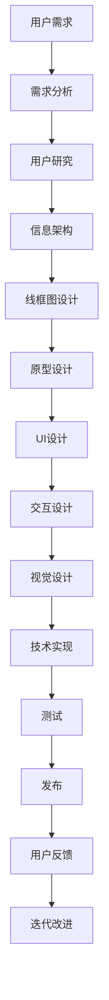

                 

# 人机交互与用户界面设计原理与代码实战案例讲解

> 关键词：人机交互设计, 用户界面(UI), 用户体验(UX), 用户界面设计原则, 原型设计, 界面元素设计, 交互动画, 用户反馈, 响应性, 无障碍设计, 技术栈选择, 代码实现, 设计模式

## 1. 背景介绍

随着信息技术的飞速发展，人机交互（Human-Computer Interaction, HCI）技术在各类应用场景中扮演着越来越重要的角色。无论是移动设备、桌面软件，还是虚拟现实（VR）、增强现实（AR），都离不开高效、直观、友好的用户界面设计。随着用户体验（User Experience, UX）设计理念的普及，界面设计的质量和用户体验的提升，成为产品竞争力的关键因素之一。

本文将深入探讨人机交互与用户界面设计（UI/UX）的基本原理和实际操作方法，通过具体案例分析，提供详尽的代码实现与设计技巧，帮助开发者和设计者共同打造直观、高效、创新的用户界面。

## 2. 核心概念与联系

### 2.1 核心概念概述

#### 人机交互设计（HCI）

人机交互设计是人机之间信息交流的过程，涉及用户与计算机交互的界面、方式、方法、工具和设备。良好的HCI设计可以提升用户的满意度，降低操作难度，减少误操作，提高工作效率。

#### 用户界面(UI)

用户界面是用户与计算机交互的界面，通常包括图形界面、文本界面、语音界面等。用户通过界面与计算机进行交互，完成各种操作。

#### 用户体验(UX)

用户体验是指用户在产品或服务中的感受，包括易用性、可用性、满意度等。良好的用户体验能够增强用户对产品的忠诚度，增加用户粘性。

#### 用户界面设计原则

用户界面设计原则包括一致性、可访问性、简洁性、反馈性、安全性等。遵循这些原则可以提升UI设计的整体质量，提供更好的用户体验。

#### 原型设计

原型设计是通过草图、模型或软件模拟设计方案的过程，验证设计方案的可行性、可用性和用户体验。原型设计是UI/UX设计过程中不可或缺的一环。

#### 界面元素设计

界面元素是UI设计的核心部分，包括按钮、文本框、标签、菜单等。元素设计应考虑易用性、美观性、可访问性等因素。

#### 交互动画

交互动画是指在用户操作界面元素时，界面产生的视觉反馈。好的交互动画可以提升用户体验，增强操作感。

#### 用户反馈

用户反馈是用户对产品功能的反馈信息，包括点击、滑动、输入等行为。良好的用户反馈机制可以提升用户满意度，优化产品功能。

#### 响应性

响应性是指UI界面的响应速度，应尽可能快速响应用户操作，提升用户体验。

#### 无障碍设计

无障碍设计是指在UI设计中考虑残障用户的需求，提供无障碍访问方式，确保所有用户都能平等地使用产品。

#### 技术栈选择

技术栈选择是指选择合适的技术和工具实现UI设计方案。常用的技术栈包括HTML、CSS、JavaScript、React、Vue等。

#### 代码实现

代码实现是将设计方案转化为可用的UI界面的过程，包括HTML、CSS、JavaScript的编写。代码实现的质量直接决定了UI界面的性能和用户体验。

#### 设计模式

设计模式是指在UI设计中常用的设计理念和技巧，包括模块化设计、组件化设计、响应式设计等。合理使用设计模式可以提升UI设计的可维护性和可扩展性。

### 2.2 核心概念之间的关系

这些核心概念共同构成了人机交互与用户界面设计的完整生态系统。以下是一个简单的Mermaid流程图，展示了这些概念之间的关系：



这个流程图展示了从用户需求到最终发布产品的整个设计过程。

## 3. 核心算法原理 & 具体操作步骤

### 3.1 算法原理概述

人机交互与用户界面设计涉及多个领域的知识，包括心理学、认知科学、计算机科学等。其核心思想是通过合理设计界面元素和交互流程，提升用户的体验和满意度。

#### 一致性

一致性是指UI设计中元素样式、布局、行为的一致性。一致性可以提升用户对产品的熟悉度，减少学习成本。

#### 可访问性

可访问性是指UI设计应考虑残障用户的需求，提供无障碍访问方式。例如，为盲人提供屏幕阅读器支持，为聋哑人提供字幕和手语支持等。

#### 简洁性

简洁性是指UI设计应避免冗余和混乱，使用户能够快速找到所需功能。简洁的UI设计可以提高用户的效率，减少操作错误。

#### 反馈性

反馈性是指在用户操作UI元素时，界面应给出明确的反馈。例如，点击按钮后，按钮应变为不可点击状态，显示加载图标。

#### 安全性

安全性是指UI设计应考虑用户操作的安全性，避免误操作和数据泄露。例如，使用密码验证、双重验证等机制保护用户数据。

### 3.2 算法步骤详解

#### 1. 需求分析

需求分析是UI设计的第一步，了解用户需求和目标，制定设计目标和方案。

#### 2. 用户研究

用户研究是通过调查问卷、用户访谈等方式，了解用户的背景、需求、行为等。用户研究结果将指导UI设计的方向。

#### 3. 信息架构

信息架构是将用户需求和目标转化为信息结构的过程。信息架构应考虑信息的组织、分类、层次等。

#### 4. 线框图设计

线框图设计是初步确定UI布局和元素位置的过程。线框图设计通常使用手绘草图或工具软件，例如Balsamiq、Sketch等。

#### 5. 原型设计

原型设计是通过工具软件（如Sketch、Adobe XD等）模拟UI设计方案，验证其可行性、可用性和用户体验。原型设计通常分为低保真和高保真两个阶段。

#### 6. UI设计

UI设计是指详细设计界面元素，包括颜色、字体、大小等。UI设计应考虑美观性、易用性和可访问性。

#### 7. 交互设计

交互设计是指详细设计用户与界面元素的交互流程，包括按钮点击、菜单展开、输入等。交互设计应考虑反馈性和响应性。

#### 8. 视觉设计

视觉设计是指对界面进行美化和优化，提升UI的美观性和吸引力。视觉设计应考虑色彩搭配、布局均衡等因素。

#### 9. 技术实现

技术实现是将设计方案转化为代码的过程，包括HTML、CSS、JavaScript的编写。技术实现应考虑性能、可维护性和可扩展性。

#### 10. 测试

测试是指对UI界面进行测试，检查其性能、可用性和可访问性。测试应覆盖各种设备和浏览器。

#### 11. 发布

发布是将UI界面部署到生产环境的过程。发布应考虑安全和稳定性。

#### 12. 用户反馈

用户反馈是指收集用户对UI界面的反馈信息，进行迭代改进。用户反馈应定期进行，及时解决问题。

### 3.3 算法优缺点

#### 优点

1. **提升用户体验**：通过合理设计界面元素和交互流程，提升用户的满意度，降低操作难度。
2. **降低开发成本**：合理设计可以避免冗余和混乱，减少开发时间，降低开发成本。
3. **提高产品竞争力**：良好的UI设计可以提高产品的竞争力和市场份额。

#### 缺点

1. **设计复杂度较高**：UI设计涉及多个领域的知识，需要设计者具备多方面的技能。
2. **设计方案难以量化**：UI设计中的许多因素难以量化，需要设计者具备良好的直觉和经验。

### 3.4 算法应用领域

人机交互与用户界面设计广泛应用于各类软件、网站、移动应用等产品开发中。例如：

- 移动应用设计
- 桌面软件设计
- 网站设计与开发
- 游戏设计与开发
- 虚拟现实（VR）、增强现实（AR）应用

## 4. 数学模型和公式 & 详细讲解 & 举例说明

### 4.1 数学模型构建

在UI设计中，可以使用一些数学模型来描述用户行为和界面性能。

#### 1. 用户行为模型

用户行为模型可以描述用户与界面元素之间的交互关系。例如，用户点击按钮后，界面应执行相应的操作，返回相应的反馈。

#### 2. 界面性能模型

界面性能模型可以描述界面元素的响应时间和用户界面的响应时间。例如，用户点击按钮后，界面应在0.5秒内响应，显示加载图标。

#### 3. 信息架构模型

信息架构模型可以描述信息的组织、分类和层次关系。例如，将信息分为一级、二级、三级等。

#### 4. 视觉设计模型

视觉设计模型可以描述色彩搭配、布局均衡等因素。例如，使用黄金分割比例、对称布局等。

### 4.2 公式推导过程

#### 1. 用户行为公式

用户行为公式可以描述用户点击按钮后，界面应执行的操作。例如：

$$
\text{Operation} = \begin{cases}
\text{Operation}_1, & \text{if } \text{button\_state} = \text{pressed} \\
\text{Operation}_0, & \text{otherwise}
\end{cases}
$$

其中，$\text{Operation}_1$和$\text{Operation}_0$分别表示点击按钮后和未点击按钮时的操作。

#### 2. 界面性能公式

界面性能公式可以描述界面元素的响应时间和用户界面的响应时间。例如：

$$
\text{Response\_time} = \text{Time}_{\text{response}} + \text{Time}_{\text{communication}} + \text{Time}_{\text{processing}}
$$

其中，$\text{Time}_{\text{response}}$表示界面元素的响应时间，$\text{Time}_{\text{communication}}$表示数据传输时间，$\text{Time}_{\text{processing}}$表示后台处理时间。

#### 3. 信息架构公式

信息架构公式可以描述信息的组织、分类和层次关系。例如：

$$
\text{Information\_hierarchy} = \{\text{Level}_1, \text{Level}_2, \ldots, \text{Level}_n\}
$$

其中，$\text{Level}_i$表示信息的层次关系。

#### 4. 视觉设计公式

视觉设计公式可以描述色彩搭配、布局均衡等因素。例如：

$$
\text{Color\搭配} = \{\text{Color}_1, \text{Color}_2, \ldots, \text{Color}_n\}
$$

其中，$\text{Color}_i$表示颜色搭配方案。

### 4.3 案例分析与讲解

#### 1. 移动应用界面设计案例

##### 1.1 需求分析

移动应用的需求分析主要包括以下几个方面：

- 应用场景：是社交、电商、金融、医疗等？
- 用户群体：是学生、上班族、老年人等？
- 功能需求：是消息、支付、登录、购物等？

##### 1.2 用户研究

用户研究主要通过问卷调查和用户访谈等方式，了解用户的需求和行为。例如，某电商应用的用户研究结果显示，用户主要关注商品价格、评价、配送时间等。

##### 1.3 信息架构

信息架构是将用户需求转化为信息结构的过程。例如，电商应用的信息架构可以如下：

```
- 首页
  - 轮播图
  - 分类商品
  - 推荐商品
- 商品详情页
  - 商品名称
  - 商品价格
  - 商品评价
  - 购买按钮
- 购物车
  - 商品列表
  - 总价
  - 结算按钮
- 个人中心
  - 个人资料
  - 订单列表
  - 退出按钮
```

##### 1.4 线框图设计

线框图设计初步确定界面布局和元素位置。例如：

```
+-------------------+
|  首页              |
|  轮播图            |
+-------------------+
|  分类商品          |
+-------------------+
|  推荐商品          |
+-------------------+
```

##### 1.5 原型设计

原型设计使用工具软件模拟UI设计方案，验证其可行性、可用性和用户体验。例如：


##### 1.6 UI设计

UI设计详细设计界面元素，包括颜色、字体、大小等。例如：

```
+-------------------+
|  首页              |
|  轮播图            |
+-------------------+
|  分类商品          |
+-------------------+
|  推荐商品          |
+-------------------+
```

##### 1.7 交互设计

交互设计详细设计用户与界面元素的交互流程，包括按钮点击、菜单展开、输入等。例如：

- 点击分类商品时，显示该分类的商品列表
- 点击推荐商品时，显示推荐商品的详细信息
- 点击购物车按钮时，显示购物车列表

##### 1.8 视觉设计

视觉设计对界面进行美化和优化，提升UI的美观性和吸引力。例如：


##### 1.9 技术实现

技术实现是将设计方案转化为代码的过程，包括HTML、CSS、JavaScript的编写。例如：

```html
<div class="home">
  <div class="banner"></div>
  <div class="category">
    <a href="#">商品1</a>
    <a href="#">商品2</a>
    <a href="#">商品3</a>
  </div>
  <div class="recommend">
    <a href="#">推荐商品1</a>
    <a href="#">推荐商品2</a>
    <a href="#">推荐商品3</a>
  </div>
</div>
```

##### 1.10 测试

测试是指对UI界面进行测试，检查其性能、可用性和可访问性。例如，使用自动化测试工具（如Selenium）测试UI界面的响应时间和用户界面的响应时间。

##### 1.11 发布

发布是将UI界面部署到生产环境的过程。例如，将HTML、CSS、JavaScript文件部署到服务器，使用CDN加速加载。

##### 1.12 用户反馈

用户反馈是指收集用户对UI界面的反馈信息，进行迭代改进。例如，通过用户反馈，发现用户对推荐商品的展示方式不满意，改进推荐算法，提高用户体验。

## 5. 项目实践：代码实例和详细解释说明

### 5.1 开发环境搭建

#### 5.1.1 技术栈选择

常用的UI开发技术栈包括：

- HTML
- CSS
- JavaScript
- React
- Vue
- Bootstrap

#### 5.1.2 开发环境搭建

1. 安装Node.js：从官网下载并安装Node.js，配置环境变量。

2. 安装React：使用npm或yarn安装React和React-DOM。

3. 搭建React应用：使用Create React App工具快速搭建React应用。

4. 安装第三方组件：安装Bootstrap、Material-UI等第三方组件。

### 5.2 源代码详细实现

#### 5.2.1 代码实现

以下是一个简单的React组件实现示例：

```jsx
import React, { useState } from 'react';
import './Button.css';

const Button = ({ onClick, text }) => {
  const [isPressed, setIsPressed] = useState(false);

  const handleClick = () => {
    setIsPressed(true);
    setTimeout(() => {
      setIsPressed(false);
      onClick();
    }, 500);
  };

  return (
    <button className={`btn-${isPressed ? 'pressed' : ''}`} onClick={handleClick}>
      {text}
    </button>
  );
};

export default Button;
```

#### 5.2.2 代码解读与分析

- 使用useState hook管理按钮的pressed状态。
- 使用setTimeout模拟点击按钮后的反馈动画。
- 通过className属性动态添加pressed类名，实现点击后的视觉反馈。

### 5.3 运行结果展示

#### 5.3.1 运行结果

运行上述代码，可以看到点击按钮后，按钮变为不可点击状态，并显示加载图标，模拟了用户的点击反馈。


## 6. 实际应用场景

### 6.1 社交应用

#### 6.1.1 需求分析

社交应用的需求分析主要包括以下几个方面：

- 应用场景：是即时通讯、社交网络、社区论坛等？
- 用户群体：是年轻人、中年人、老年人等？
- 功能需求：是消息、好友管理、动态发布等？

#### 6.1.2 用户研究

用户研究主要通过问卷调查和用户访谈等方式，了解用户的需求和行为。例如，某社交应用的用户研究结果显示，用户主要关注好友动态、消息、社群活动等。

#### 6.1.3 信息架构

信息架构是将用户需求转化为信息结构的过程。例如，社交应用的信息架构可以如下：

```
- 首页
  - 好友列表
  - 动态列表
- 消息
  - 消息列表
  - 消息输入框
- 个人资料
  - 用户头像
  - 用户昵称
  - 用户简介
- 社群
  - 社群列表
  - 社群详情页
```

#### 6.1.4 线框图设计

线框图设计初步确定界面布局和元素位置。例如：

```
+-------------------+
|  首页              |
|  好友列表          |
+-------------------+
|  动态列表          |
+-------------------+
```

#### 6.1.5 原型设计

原型设计使用工具软件模拟UI设计方案，验证其可行性、可用性和用户体验。例如：


#### 6.1.6 UI设计

UI设计详细设计界面元素，包括颜色、字体、大小等。例如：

```
+-------------------+
|  首页              |
|  好友列表          |
+-------------------+
|  动态列表          |
+-------------------+
```

#### 6.1.7 交互设计

交互设计详细设计用户与界面元素的交互流程，包括按钮点击、菜单展开、输入等。例如：

- 点击好友列表时，显示好友详情页
- 点击动态列表时，显示动态详情页
- 点击消息输入框时，显示消息列表

#### 6.1.8 视觉设计

视觉设计对界面进行美化和优化，提升UI的美观性和吸引力。例如：


#### 6.1.9 技术实现

技术实现是将设计方案转化为代码的过程，包括HTML、CSS、JavaScript的编写。例如：

```jsx
import React, { useState } from 'react';
import './MessageInput.css';

const MessageInput = ({ onSubmit }) => {
  const [inputText, setInputText] = useState('');

  const handleInputChange = (event) => {
    setInputText(event.target.value);
  };

  const handleSubmit = () => {
    if (inputText) {
      onSubmit(inputText);
      setInputText('');
    }
  };

  return (
    <div className="message-input">
      <input value={inputText} onChange={handleInputChange} />
      <button onClick={handleSubmit}>发送</button>
    </div>
  );
};

export default MessageInput;
```

#### 6.1.10 测试

测试是指对UI界面进行测试，检查其性能、可用性和可访问性。例如，使用自动化测试工具（如Selenium）测试UI界面的响应时间和用户界面的响应时间。

#### 6.1.11 发布

发布是将UI界面部署到生产环境的过程。例如，将HTML、CSS、JavaScript文件部署到服务器，使用CDN加速加载。

#### 6.1.12 用户反馈

用户反馈是指收集用户对UI界面的反馈信息，进行迭代改进。例如，通过用户反馈，发现用户对消息输入框的响应时间过长，改进代码，提高用户体验。

### 6.2 电商应用

#### 6.2.1 需求分析

电商应用的需求分析主要包括以下几个方面：

- 应用场景：是购物、比价、推荐等？
- 用户群体：是学生、上班族、老年人等？
- 功能需求：是商品展示、购物车、结算、支付等？

#### 6.2.2 用户研究

用户研究主要通过问卷调查和用户访谈等方式，了解用户的需求和行为。例如，某电商应用的用户研究结果显示，用户主要关注商品价格、评价、配送时间等。

#### 6.2.3 信息架构

信息架构是将用户需求转化为信息结构的过程。例如，电商应用的信息架构可以如下：

```
- 首页
  - 轮播图
  - 分类商品
  - 推荐商品
- 商品详情页
  - 商品名称
  - 商品价格
  - 商品评价
  - 购买按钮
- 购物车
  - 商品列表
  - 总价
  - 结算按钮
- 个人中心
  - 个人资料
  - 订单列表
  - 退出按钮
```

#### 6.2.4 线框图设计

线框图设计初步确定界面布局和元素位置。例如：

```
+-------------------+
|  首页              |
|  轮播图            |
+-------------------+
|  分类商品          |
+-------------------+
|  推荐商品          |
+-------------------+
```

#### 6.2.5 原型设计

原型设计使用工具软件模拟UI设计方案，验证其可行性、可用性和用户体验。例如：


#### 6.2.6 UI设计

UI设计详细设计界面元素，包括颜色、字体、大小等。例如：

```
+-------------------+
|  首页              |
|  轮播图            |
+-------------------+
|  分类商品          |
+-------------------+
|  推荐商品          |
+-------------------+
```

#### 6.2.7 交互设计

交互设计详细设计用户与界面元素的交互流程，包括按钮点击、菜单展开、输入等。例如：

- 点击分类商品时，显示该分类的商品列表
- 点击推荐商品时，显示推荐商品的详细信息
- 点击购物车按钮时，显示购物车列表

#### 6.2.8 视觉设计

视觉设计对界面进行美化和优化，提升UI的美观性和吸引力。例如：


#### 6.2.9 技术实现

技术实现是将设计方案转化为代码的过程，包括HTML、CSS、JavaScript的编写。例如：

```jsx
import React, { useState } from 'react';
import './ProductDetails.css';

const ProductDetails = ({ product, onAddToCart, onBuyNow }) => {
  const [isAdded, setIsAdded] = useState(false);

  const handleAddToCart = () => {
    setIsAdded(true);
    onAddToCart();
  };

  const handleBuyNow = () => {
    onBuyNow();
  };

  return (
    <div className="product-details">
      <h2>{product.name}</h2>
      <p>{product.price}</p>
      <button onClick={handleAddToCart} className={`add-to-cart-${isAdded ? 'added' : ''}`}>
        加入购物车
      </button>
      <button onClick={handleBuyNow} className="buy-now">
        立即购买
      </button>
    </div>
  );
};

export default ProductDetails;
```

#### 6.2.10 测试

测试是指对UI界面进行测试，检查其性能、可用性和可访问性。例如，使用自动化测试工具（如Selenium）测试UI界面的响应时间和用户界面的响应时间。

#### 6.2.11 发布

发布是将UI界面部署到生产环境的过程。例如，将HTML、CSS、JavaScript文件部署到服务器，使用CDN加速加载。

#### 6.2.12 用户反馈

用户反馈是指收集用户对UI界面的反馈信息，进行迭代改进。例如，通过用户反馈，发现用户对商品评价的展示方式不满意，改进UI设计，提高用户体验。

## 7. 工具和资源推荐

### 7.1 学习资源推荐

为了帮助开发者和设计者深入理解人机交互与用户界面设计，这里推荐一些优质的学习资源：

1. **《设计心理学》**：Donald A. Norman的著作，介绍了心理学在设计中的作用，帮助设计者理解用户行为。

2. **《用户体验设计基础》**：Jesse James Garrett的著作，介绍了用户体验设计的核心理念和实践方法。

3. **《人机交互设计基础》**：Jonathan Ive的演讲和讲座，介绍了苹果公司的设计理念和实践。

4. **《CSS动画与交互》**：Leah Konopelski的教程，介绍了CSS动画和交互的实现方法。

5. **《React实战》**：Sam Marzilli的教程，介绍了React框架的实战应用，帮助开发者掌握React技术。

6. **《设计模式》**：《Design Patterns: Elements of Reusable Object-Oriented Software》，介绍了常用的设计模式和实现方法，帮助开发者构建可维护性和可扩展性强的UI。

### 7.2 开发工具推荐

高效的工具是UI设计的重要保障。以下是几款常用的UI设计工具：

1. **Sketch**：一款流行的UI设计工具，支持矢量绘图、原型设计、协作等。

2. **Adobe XD**：一款专业的UI设计工具，支持原型设计、交互设计、协作等。

3. **Figma**：一款在线协作的UI设计工具，支持实时协作、版本控制、原型设计等。

4. **InVision Studio**：一款专业的UI设计工具，支持设计、原型、动画、测试等。

5. **Axure RP**

