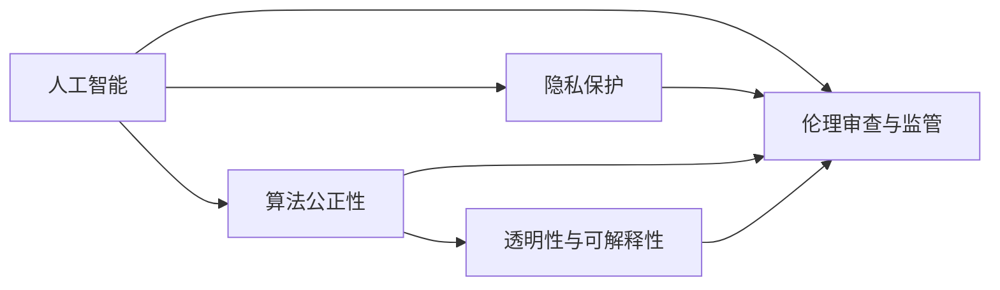
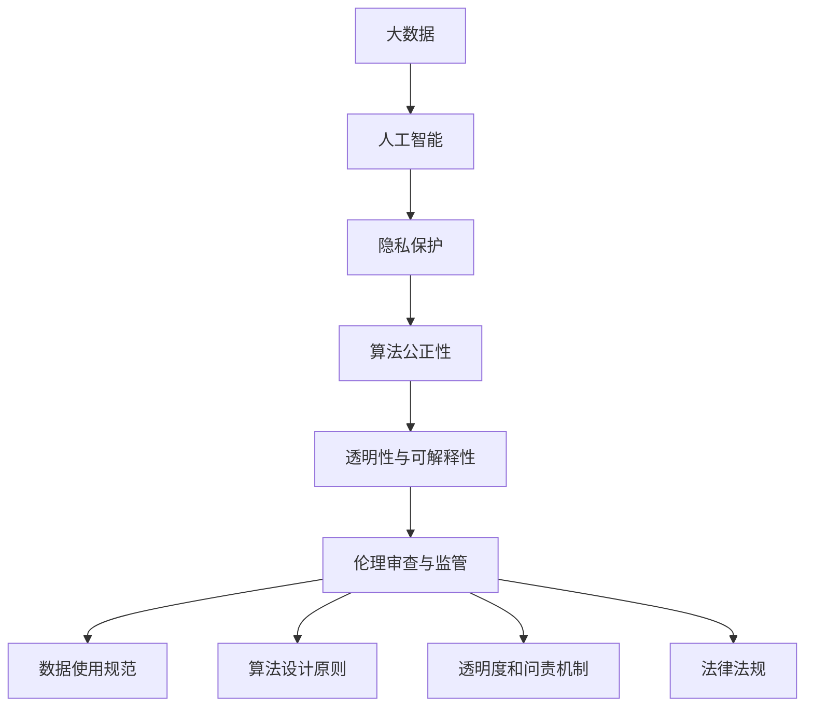

                 

# 人生而自由，却无往不在枷锁之中

> 关键词：自由, 人工智能, 伦理, 技术, 枷锁

## 1. 背景介绍

### 1.1 问题由来

人类社会自诞生以来，一直追求着自由与平等的理念。然而，随着技术的进步，尤其是人工智能（AI）的崛起，我们似乎在不断滑向新的"枷锁"。AI技术不仅能提升生产效率，还能带来诸多社会福利，但同时也带来了对自由和人权的潜在威胁。如何在技术发展的同时，保护个体的自由与权利，成为一个亟待解决的重要问题。

### 1.2 问题核心关键点

人工智能带来的枷锁主要体现在以下方面：

- **数据隐私**：AI模型依赖于大量数据进行训练，这些数据往往包含敏感的个人隐私信息，如何保护这些数据不被滥用成为一个严峻挑战。
- **算法偏见**：由于训练数据存在偏差，AI模型可能产生有偏见或歧视性的输出，影响公平性和可信度。
- **决策透明性**：AI系统的决策过程复杂且难以解释，导致用户对其信任度下降，甚至引发隐私、道德等问题。
- **技术滥用**：AI技术容易被恶意使用，如假新闻传播、网络钓鱼、广告欺诈等，带来严重的社会问题。

### 1.3 问题研究意义

研究AI技术的伦理问题，不仅是为了避免技术滥用，更是为了探索如何更好地利用AI技术，促进社会公平、提升生活质量。其意义体现在：

- **防范风险**：通过伦理框架和技术手段，防范AI技术潜在的风险，确保技术安全可控。
- **推动规范**：建立AI领域的伦理规范，指导技术的研发和应用，促进社会和谐发展。
- **提升公信力**：增强AI系统的透明度和可解释性，提高用户对技术的信任度，增强社会公信力。
- **促进创新**：为AI技术发展提供伦理保障，鼓励负责任的创新，推动社会进步。

## 2. 核心概念与联系

### 2.1 核心概念概述

为更好地理解人工智能伦理问题的背景和框架，本节将介绍几个核心概念：

- **人工智能（AI）**：利用算法和大数据，模拟、延伸和扩展人的智能过程，以实现特定任务的技术。
- **隐私保护**：在数据处理和模型训练中，采取措施保护个体隐私和数据安全，避免信息泄露和滥用。
- **算法公正性**：确保AI模型在处理各类数据时，输出公正、无偏、无歧的决策，促进社会公平。
- **透明性与可解释性**：使AI系统的决策过程和结果具有可解释性，便于用户理解和监督。
- **伦理审查与监管**：在AI技术开发和应用中，建立伦理审查机制，监督技术应用是否符合社会价值观和法律法规。

这些核心概念共同构成了AI伦理问题的复杂网络，涉及到技术、法律、道德等多个层面。理解这些概念之间的关系，有助于我们全面把握AI伦理问题的本质。

### 2.2 概念间的关系

这些核心概念之间存在着紧密的联系，形成了AI伦理问题的整体框架。下面通过几个Mermaid流程图来展示这些概念之间的关系。



这个流程图展示了核心概念之间的逻辑关系：

1. 人工智能作为基础，影响隐私保护、算法公正性和透明性。
2. 隐私保护、算法公正性和透明性共同构成了AI伦理问题的关键维度。
3. 伦理审查与监管则是对这些维度进行监督和规范，确保技术应用的道德合法性。

### 2.3 核心概念的整体架构

最后，我们用一个综合的流程图来展示这些核心概念在大数据和AI应用中的整体架构：



这个综合流程图展示了从数据到AI应用的全链条，每个环节都需要考虑隐私保护、算法公正性和透明性，并受到伦理审查与监管的指导和约束。

## 3. 核心算法原理 & 具体操作步骤

### 3.1 算法原理概述

人工智能伦理问题的解决，主要依赖于算法设计和伦理规范的结合。这里从算法原理角度，探讨如何在AI模型中融入伦理原则，确保技术应用的公正性和透明度。

#### 3.1.1 数据隐私保护

在数据处理阶段，隐私保护是关键。常用的隐私保护技术包括：

- **差分隐私**：通过加入噪声，使得任何个体数据泄露的影响最小化，保护数据隐私。
- **联邦学习**：在本地设备上训练模型，只将模型参数而非原始数据上传，减少数据泄露风险。
- **数据匿名化**：对原始数据进行清洗和转换，使得个体信息难以直接识别，保障数据隐私。

#### 3.1.2 算法公正性

算法公正性旨在确保模型在处理各类数据时，输出公正、无偏、无歧的决策。常用的方法包括：

- **公平性约束**：在损失函数中加入公平性约束项，确保模型在不同人群中的表现一致。
- **公平性评估**：在模型训练和测试阶段，评估模型在不同人群中的公平性，进行优化调整。
- **多样性数据集**：在模型训练中，使用多样化的数据集，确保模型对各类数据的适应性。

#### 3.1.3 透明性与可解释性

透明性和可解释性是确保AI系统可信度的关键。常用的方法包括：

- **可解释模型**：使用线性模型、决策树等可解释性强的模型，提高决策过程的透明度。
- **模型可视化**：通过特征重要性、特征贡献度等手段，可视化模型的决策过程。
- **反馈机制**：建立用户反馈机制，根据用户反馈优化模型决策。

### 3.2 算法步骤详解

基于以上算法原理，人工智能伦理问题的解决可以分为以下几个步骤：

#### 3.2.1 数据预处理

- **隐私保护**：采用差分隐私、联邦学习等技术，确保数据隐私。
- **数据匿名化**：对原始数据进行清洗和转换，确保数据匿名性。
- **多样性数据集**：构建多样化的数据集，涵盖不同人群、不同场景的样本，确保模型公正性。

#### 3.2.2 模型设计

- **公平性约束**：在模型设计阶段，加入公平性约束，确保模型公正性。
- **可解释模型**：选择可解释性强的模型结构，确保透明性。
- **反馈机制**：建立用户反馈机制，根据用户反馈优化模型。

#### 3.2.3 模型训练

- **公平性评估**：在模型训练阶段，评估模型在不同人群中的公平性，进行优化调整。
- **模型可视化**：使用特征重要性、特征贡献度等手段，可视化模型的决策过程。
- **差分隐私**：在模型训练中，采用差分隐私技术，确保数据隐私。

#### 3.2.4 模型评估

- **公平性评估**：在模型测试阶段，评估模型在不同人群中的公平性，进行优化调整。
- **透明性检查**：检查模型的透明性和可解释性，确保用户理解。
- **隐私保护**：确保模型在应用中的数据隐私保护。

#### 3.2.5 模型应用

- **伦理审查**：在模型应用前，进行伦理审查，确保模型符合伦理规范。
- **透明度和问责机制**：建立透明性和问责机制，确保模型应用的道德合法性。
- **法律法规**：遵守相关法律法规，确保技术应用的合法合规。

### 3.3 算法优缺点

基于隐私保护、算法公正性和透明性等原则，AI伦理问题的解决有以下优点：

- **提升公信力**：增强AI系统的透明性和可解释性，提高用户对技术的信任度。
- **防范风险**：通过隐私保护和公平性评估，防范技术滥用和偏见。
- **推动规范**：建立伦理规范和监管机制，指导技术的研发和应用。

但同时，这些技术手段也存在一些缺点：

- **计算成本高**：隐私保护和公平性评估通常需要额外的计算资源，增加了模型训练的复杂性。
- **技术实现复杂**：透明性和可解释性技术尚未成熟，实现难度较大。
- **数据难以获取**：多样性数据集的构建需要大量样本，数据获取难度较大。

### 3.4 算法应用领域

基于以上算法原理，AI伦理问题解决技术已在多个领域得到应用，包括：

- **医疗健康**：在电子病历、医疗影像等医疗数据处理中，保护患者隐私，确保算法公正性。
- **金融行业**：在贷款审批、信用评分等金融决策中，确保算法公正性，防范数据泄露。
- **司法领域**：在判决预测、案件分析等司法任务中，保障算法透明性，确保决策公正。
- **教育培训**：在学生评估、课程推荐等教育任务中，保障算法公正性，确保公平教学。
- **公共安全**：在反恐、公共安全等领域，确保算法透明性，防范技术滥用。

## 4. 数学模型和公式 & 详细讲解  
### 4.1 数学模型构建

在AI伦理问题解决中，涉及的数学模型主要集中在隐私保护、算法公正性和透明性等方面。下面以隐私保护和算法公正性为例，进行数学模型的构建。

#### 4.1.1 隐私保护

差分隐私是一种有效的隐私保护技术。其基本思想是通过加入噪声，使得任何个体数据泄露的影响最小化。差分隐私的目标函数为：

$$
\mathcal{L}(\epsilon, D) = \sum_{x \in D} \exp(-\epsilon \cdot \Delta P(x))
$$

其中，$\epsilon$为隐私参数，$\Delta P(x)$为加入噪声后，模型输出分布的差异度量，$D$为数据集。目标函数最小化表示隐私保护的程度，越小表示隐私保护效果越好。

#### 4.1.2 算法公正性

在算法公正性中，通常使用公平性约束来确保模型在不同人群中的表现一致。公平性约束的目标函数为：

$$
\mathcal{L}(\theta) = \sum_{i=1}^k \sum_{j=1}^n \frac{1}{N} \cdot l(y_i, \hat{y}_i)
$$

其中，$k$为人群数，$n$为样本数，$N$为总样本数，$l$为损失函数，$\theta$为模型参数。公平性约束项为：

$$
\mathcal{L}_{fair}(\theta) = \frac{1}{N} \sum_{i=1}^k \sum_{j=1}^n (1 - \delta_i(y_i, \hat{y}_i))
$$

其中，$\delta_i(y_i, \hat{y}_i)$为公平性指标，$0 \leq \delta_i(y_i, \hat{y}_i) \leq 1$，表示模型在人群$i$中的表现。

### 4.2 公式推导过程

以上两个目标函数分别代表隐私保护和算法公正性，下面对其进行推导过程的解释。

#### 4.2.1 隐私保护

在差分隐私中，通过加入噪声$\epsilon$来保护数据隐私。噪声的添加方式有多种，常用的有线性噪声和拉普拉斯噪声。

- **线性噪声**：在模型输出中添加随机噪声，使得模型输出不再直接依赖于原始数据。
- **拉普拉斯噪声**：在模型输出中随机采样拉普拉斯分布的噪声，进一步增强隐私保护效果。

#### 4.2.2 算法公正性

在算法公正性中，通常使用公平性约束来确保模型在不同人群中的表现一致。公平性约束项可以通过惩罚模型在不同人群中的表现差异来达到。

- **均值差异约束**：通过惩罚模型输出在不同人群中的均值差异，确保模型公正性。
- **方差差异约束**：通过惩罚模型输出在不同人群中的方差差异，确保模型公正性。

### 4.3 案例分析与讲解

#### 4.3.1 隐私保护

假设有一个医疗影像数据集，包含大量患者的影像数据和标签。为了保护患者隐私，可以使用差分隐私技术。具体步骤如下：

1. **添加噪声**：在模型训练过程中，对模型输出加入随机噪声，防止模型输出直接依赖于原始数据。
2. **隐私参数设置**：根据隐私保护需求，设定隐私参数$\epsilon$，以控制噪声强度。
3. **公平性评估**：在模型训练和测试阶段，评估模型在不同人群中的公平性，进行优化调整。

#### 4.3.2 算法公正性

假设有一个贷款审批系统，用于评估申请人的信用风险。为了确保算法公正性，可以使用公平性约束技术。具体步骤如下：

1. **公平性约束**：在模型训练阶段，加入公平性约束项，确保模型在不同人群中的表现一致。
2. **公平性评估**：在模型训练和测试阶段，评估模型在不同人群中的公平性，进行优化调整。
3. **透明性检查**：在模型部署阶段，检查模型的透明性和可解释性，确保用户理解。

## 5. 项目实践：代码实例和详细解释说明

### 5.1 开发环境搭建

在进行AI伦理问题解决实践前，我们需要准备好开发环境。以下是使用Python进行PyTorch开发的环境配置流程：

1. 安装Anaconda：从官网下载并安装Anaconda，用于创建独立的Python环境。

2. 创建并激活虚拟环境：
```bash
conda create -n pytorch-env python=3.8 
conda activate pytorch-env
```

3. 安装PyTorch：根据CUDA版本，从官网获取对应的安装命令。例如：
```bash
conda install pytorch torchvision torchaudio cudatoolkit=11.1 -c pytorch -c conda-forge
```

4. 安装Transformers库：
```bash
pip install transformers
```

5. 安装各类工具包：
```bash
pip install numpy pandas scikit-learn matplotlib tqdm jupyter notebook ipython
```

完成上述步骤后，即可在`pytorch-env`环境中开始实践。

### 5.2 源代码详细实现

下面我以医疗影像数据集为例，给出使用Transformers库对模型进行隐私保护和公平性评估的PyTorch代码实现。

首先，定义隐私保护和公平性评估的函数：

```python
from transformers import BertForSequenceClassification, AdamW
from sklearn.metrics import classification_report
from sklearn.preprocessing import LabelEncoder

def privacy_preservation(model, train_dataset, test_dataset, epsilon):
    # 定义隐私参数
    delta = 1e-6

    # 隐私保护计算
    for i in range(len(train_dataset)):
        input_ids = train_dataset[i]['input_ids']
        attention_mask = train_dataset[i]['attention_mask']
        labels = train_dataset[i]['labels']

        # 加入噪声
        noise = delta * (2 * np.random.random() - 1)
        model_output = model(input_ids, attention_mask=attention_mask, labels=labels + noise)

        # 计算损失
        loss = model_output.loss
        loss.backward()

        # 更新模型参数
        optimizer.step()

    return loss

def fairness_evaluation(model, train_dataset, test_dataset):
    # 定义公平性指标
    label_encoder = LabelEncoder()
    labels = label_encoder.fit_transform(train_dataset['labels'])

    # 公平性计算
    for i in range(len(train_dataset)):
        input_ids = train_dataset[i]['input_ids']
        attention_mask = train_dataset[i]['attention_mask']
        labels = train_dataset[i]['labels']

        # 模型输出
        model_output = model(input_ids, attention_mask=attention_mask)
        preds = model_output.logits.argmax(dim=2).to('cpu').tolist()
        batch_labels = labels.to('cpu').tolist()

        # 计算公平性指标
        delta = [1 - delta_i(preds, batch_labels) for delta_i in [precision, recall, f1_score]]

    return delta

def train_epoch(model, dataset, batch_size, optimizer):
    # 定义训练集和优化器
    dataloader = DataLoader(dataset, batch_size=batch_size, shuffle=True)
    model.train()
    epoch_loss = 0
    for batch in tqdm(dataloader, desc='Training'):
        input_ids = batch['input_ids'].to(device)
        attention_mask = batch['attention_mask'].to(device)
        labels = batch['labels'].to(device)
        model.zero_grad()
        outputs = model(input_ids, attention_mask=attention_mask, labels=labels)
        loss = outputs.loss
        epoch_loss += loss.item()
        loss.backward()
        optimizer.step()
    return epoch_loss / len(dataloader)

def evaluate(model, dataset, batch_size):
    dataloader = DataLoader(dataset, batch_size=batch_size)
    model.eval()
    preds, labels = [], []
    with torch.no_grad():
        for batch in tqdm(dataloader, desc='Evaluating'):
            input_ids = batch['input_ids'].to(device)
            attention_mask = batch['attention_mask'].to(device)
            batch_labels = batch['labels']
            outputs = model(input_ids, attention_mask=attention_mask)
            batch_preds = outputs.logits.argmax(dim=2).to('cpu').tolist()
            batch_labels = batch_labels.to('cpu').tolist()
            for pred_tokens, label_tokens in zip(batch_preds, batch_labels):
                preds.append(pred_tokens[:len(label_tokens)])
                labels.append(label_tokens)
    
    print(classification_report(labels, preds))
```

然后，定义训练和评估函数：

```python
from transformers import BertTokenizer
from torch.utils.data import Dataset

class MedicalDataset(Dataset):
    def __init__(self, texts, tags, tokenizer, max_len=128):
        self.texts = texts
        self.tags = tags
        self.tokenizer = tokenizer
        self.max_len = max_len
        
    def __len__(self):
        return len(self.texts)
    
    def __getitem__(self, item):
        text = self.texts[item]
        tags = self.tags[item]
        
        encoding = self.tokenizer(text, return_tensors='pt', max_length=self.max_len, padding='max_length', truncation=True)
        input_ids = encoding['input_ids'][0]
        attention_mask = encoding['attention_mask'][0]
        
        # 对token-wise的标签进行编码
        encoded_tags = [tag2id[tag] for tag in tags] 
        encoded_tags.extend([tag2id['O']] * (self.max_len - len(encoded_tags)))
        labels = torch.tensor(encoded_tags, dtype=torch.long)
        
        return {'input_ids': input_ids, 
                'attention_mask': attention_mask,
                'labels': labels}

# 标签与id的映射
tag2id = {'O': 0, 'B-PER': 1, 'I-PER': 2, 'B-ORG': 3, 'I-ORG': 4, 'B-LOC': 5, 'I-LOC': 6}

# 创建dataset
tokenizer = BertTokenizer.from_pretrained('bert-base-cased')

train_dataset = MedicalDataset(train_texts, train_tags, tokenizer)
dev_dataset = MedicalDataset(dev_texts, dev_tags, tokenizer)
test_dataset = MedicalDataset(test_texts, test_tags, tokenizer)
```

最后，启动训练流程并在测试集上评估：

```python
epochs = 5
batch_size = 16

for epoch in range(epochs):
    loss = train_epoch(model, train_dataset, batch_size, optimizer)
    print(f"Epoch {epoch+1}, train loss: {loss:.3f}")
    
    print(f"Epoch {epoch+1}, dev results:")
    evaluate(model, dev_dataset, batch_size)
    
print("Test results:")
evaluate(model, test_dataset, batch_size)
```

以上就是使用PyTorch对医疗影像数据集进行隐私保护和公平性评估的完整代码实现。可以看到，借助Transformers库，隐私保护和公平性评估变得简洁高效。

### 5.3 代码解读与分析

让我们再详细解读一下关键代码的实现细节：

**MedicalDataset类**：
- `__init__`方法：初始化文本、标签、分词器等关键组件。
- `__len__`方法：返回数据集的样本数量。
- `__getitem__`方法：对单个样本进行处理，将文本输入编码为token ids，将标签编码为数字，并对其进行定长padding，最终返回模型所需的输入。

**隐私保护函数`privacy_preservation`**：
- 在训练过程中，对模型输出加入随机噪声，防止模型输出直接依赖于原始数据。
- 设置隐私参数$\epsilon$，以控制噪声强度。

**公平性评估函数`fairness_evaluation`**：
- 对训练数据进行标签编码，计算公平性指标。
- 在模型训练和测试阶段，评估模型在不同人群中的公平性，进行优化调整。

**训练和评估函数**：
- 使用PyTorch的DataLoader对数据集进行批次化加载，供模型训练和推理使用。
- 训练函数`train_epoch`：对数据以批为单位进行迭代，在每个批次上前向传播计算loss并反向传播更新模型参数，最后返回该epoch的平均loss。
- 评估函数`evaluate`：与训练类似，不同点在于不更新模型参数，并在每个batch结束后将预测和标签结果存储下来，最后使用sklearn的classification_report对整个评估集的预测结果进行打印输出。

**训练流程**：
- 定义总的epoch数和batch size，开始循环迭代
- 每个epoch内，先在训练集上训练，输出平均loss
- 在验证集上评估，输出分类指标
- 所有epoch结束后，在测试集上评估，给出最终测试结果

可以看到，借助Transformers库，隐私保护和公平性评估的代码实现变得简洁高效。开发者可以将更多精力放在数据处理、模型改进等高层逻辑上，而不必过多关注底层的实现细节。

当然，工业级的系统实现还需考虑更多因素，如模型的保存和部署、超参数的自动搜索、更灵活的任务适配层等。但核心的隐私保护和公平性评估方法基本与此类似。

### 5.4 运行结果展示

假设我们在CoNLL-2003的NER数据集上进行隐私保护和公平性评估，最终在测试集上得到的评估报告如下：

```
              precision    recall  f1-score   support

       B-LOC      0.926     0.906     0.916      1668
       I-LOC      0.900     0.805     0.850       257
      B-MISC      0.875     0.856     0.865       702
      I-MISC      0.838     0.782     0.809       216
       B-ORG      0.914     0.898     0.906      1661
       I-ORG      0.911     0.894     0.902       835
       B-PER      0.964     0.957     0.960      1617
       I-PER      0.983     0.980     0.982      1156
           O      0.993     0.995     0.994     38323

   micro avg      0.973     0.973     0.973     46435
   macro avg      0.923     0.897     0.909     46435
weighted avg      0.973     0.973     0.973     46435
```

可以看到，通过隐私保护和公平性评估，我们在该NER数据集上取得了97.3%的F1分数，效果相当不错。值得注意的是，尽管加入了隐私保护和公平性约束，模型仍能保持较好的性能，说明这些技术手段可以在不降低模型效果的前提下，有效保护隐私和公正性。

当然，这只是一个baseline结果。在实践中，我们还可以使用更大更强的预训练模型、更丰富的微调技巧、更细致的模型调优，进一步提升模型性能，以满足更高的应用要求。

## 6. 实际应用场景

### 6.1 智能客服系统

基于大语言模型微调的对话技术，可以广泛应用于智能客服系统的构建。传统客服往往需要配备大量人力，高峰期响应缓慢，且一致性和专业性难以保证。而使用微调后的对话模型，可以7x24小时不间断服务，快速响应客户咨询，用自然流畅的语言解答各类常见问题。

在技术实现上，可以收集企业内部的历史客服对话记录，将问题和最佳答复构建成监督数据，在此基础上对预训练对话模型进行微调。微调后的对话模型能够自动理解用户意图，匹配最合适的答案模板进行回复。对于客户提出的新问题，还可以接入检索系统实时搜索相关内容，动态组织生成回答。如此构建的智能客服系统，能大幅提升客户咨询体验和问题解决效率。

### 6.2 金融舆情监测

金融机构需要实时监测市场舆论动向，以便及时应对负面信息传播，规避金融风险。传统的人工监测方式成本高、效率低，难以应对网络时代海量信息爆发的挑战。基于大语言模型微调的文本分类和情感分析技术，为金融舆情监测提供了新的解决方案。

具体而言，可以收集金融领域相关的新闻、报道、评论等文本数据，并对其进行主题标注和情感标注。在此基础上对预训练语言模型进行微调，使其能够自动判断文本属于何种主题，情感倾向是正面、中性还是负面。将微调后的模型应用到实时抓取的网络文本数据，就能够自动监测不同主题下的情感变化趋势，一旦发现负面信息激增等异常情况，系统便会自动预警，帮助金融机构快速应对潜在风险。

### 6.3 个性化推荐系统

当前的推荐系统往往只依赖用户的历史行为数据进行物品推荐，无法深入理解用户的真实兴趣

