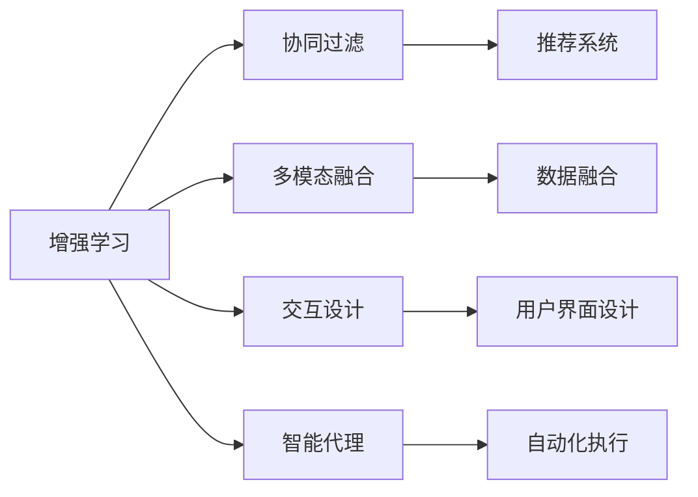
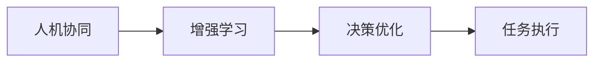
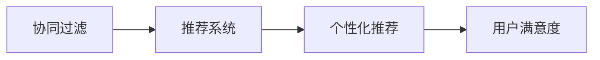
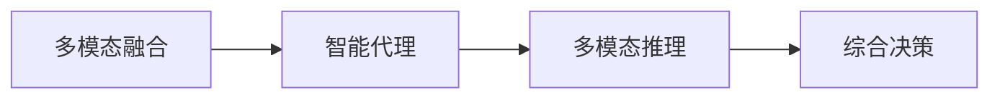
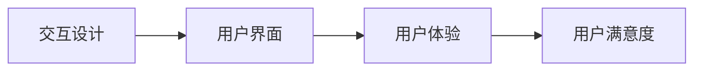
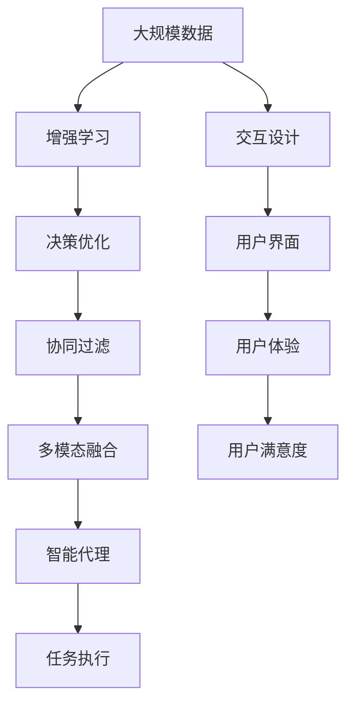

                 

# 人类-AI协作：增强人类智慧与AI能力的融合发展趋势预测

在人工智能（AI）迅速发展的今天，人类与AI的协作已成为推动社会进步的重要力量。未来，AI不仅将成为人类智慧的强大延伸，还将与人类智慧深度融合，形成协同创新的新模式。本文将详细探讨人类-AI协作的融合发展趋势，从核心概念、核心算法原理到实际应用场景，全面剖析这一趋势对未来社会的影响。

## 1. 背景介绍

### 1.1 问题由来

当前，AI技术的快速发展已经渗透到社会的各个领域，从医疗、教育到金融、制造，AI的应用无所不在。然而，单纯依靠AI的决策和执行，往往缺乏人类的情感理解和创造力。因此，人类与AI的协作成为了提升AI系统智能化水平和用户体验的重要途径。

### 1.2 问题核心关键点

人类-AI协作的本质在于将人类的智慧与AI的能力结合起来，实现优势互补。具体而言，关键点包括：
- **人机协同：**通过增强学习、协同过滤等技术，让人类与AI共同参与决策和执行，提升系统效果。
- **知识融合：**将人类的知识、经验、直觉与AI的数据驱动和模式识别能力结合起来，实现更全面、准确的推理和预测。
- **用户交互：**在用户体验设计上，注重人机交互的友好性和人性化，使AI更好地服务于人类。

### 1.3 问题研究意义

人类-AI协作不仅是AI技术发展的必然趋势，也是未来社会智能化、普适化、安全化的重要基础。通过探索人机协同的深度融合，我们可以：
1. **提升决策质量：**AI强大的数据处理能力和学习能力，结合人类的智慧和经验，能够提供更准确、高效的决策支持。
2. **优化用户体验：**通过人机交互设计的创新，提升系统的易用性和用户满意度。
3. **促进创新发展：**人机协同能够激发更多创意和创新，推动各行各业的智能化转型。
4. **保障安全稳定：**通过人机协作，减少AI系统的风险和误判，提升系统鲁棒性和稳定性。
5. **助力社会治理：**在公共安全、城市管理等关键领域，人机协作能够实现更高效的治理和监管。

## 2. 核心概念与联系

### 2.1 核心概念概述

为更好地理解人类-AI协作的融合发展趋势，本节将介绍几个密切相关的核心概念：

- **增强学习（Reinforcement Learning, RL）**：一种通过试错反馈优化决策的机器学习方法，常用于人机协同和智能控制领域。
- **协同过滤（Collaborative Filtering, CF）**：一种利用用户反馈信息推荐系统或内容的算法，常用于电子商务和推荐系统。
- **多模态融合（Multi-modal Fusion）**：将不同模态的数据（如文本、图像、音频等）进行融合，以提升系统的表现和理解能力。
- **交互设计（Interaction Design）**：涉及人机交互的各个方面，如用户界面、交互流程、反馈机制等，旨在提升用户体验和系统可用性。
- **智能代理（Intelligent Agent）**：具有感知、学习、推理和决策能力的AI系统，通常用于人机协同和智能自动化。

这些核心概念之间的逻辑关系可以通过以下Mermaid流程图来展示：



这个流程图展示了一系列核心概念在人类-AI协作中的作用和相互联系：

1. **增强学习**提供了一种反馈机制，使AI能够通过与人类交互不断优化决策。
2. **协同过滤**利用人类反馈，提升推荐系统的个性化和精准度。
3. **多模态融合**将不同类型的数据融合在一起，丰富系统的感知和理解能力。
4. **交互设计**确保人机交互友好、高效，提升用户体验。
5. **智能代理**将人类的智慧和AI的能力结合起来，实现复杂任务的自动化和智能化。

这些概念共同构成了人类-AI协作的基础框架，使得系统能够高效、智能地服务于人类。

### 2.2 概念间的关系

这些核心概念之间存在着紧密的联系，形成了人类-AI协作的完整生态系统。下面我们通过几个Mermaid流程图来展示这些概念之间的关系。

#### 2.2.1 人机协同与增强学习的关联



这个流程图展示了人机协同与增强学习之间的关联。人机协同通过增强学习不断优化决策过程，提升系统的执行效果。

#### 2.2.2 协同过滤与推荐系统的关联



这个流程图展示了协同过滤与推荐系统之间的关联。协同过滤通过用户反馈数据，提升推荐系统的个性化和精准度，从而提升用户满意度。

#### 2.2.3 多模态融合与智能代理的关联



这个流程图展示了多模态融合与智能代理之间的关联。多模态融合丰富了智能代理的感知能力，使其能够进行更全面、准确的推理和决策。

#### 2.2.4 交互设计与用户满意度



这个流程图展示了交互设计与用户满意度之间的关联。交互设计通过优化用户界面，提升用户体验，从而提升用户满意度。

### 2.3 核心概念的整体架构

最后，我们用一个综合的流程图来展示这些核心概念在人类-AI协作中的整体架构：



这个综合流程图展示了从数据输入到任务执行的全过程，以及人机协同和用户反馈对系统的影响：

1. **数据输入**：大规模数据提供了AI学习的基础。
2. **增强学习**：通过试错反馈优化决策。
3. **协同过滤**：利用人类反馈提升推荐系统。
4. **多模态融合**：融合不同类型的数据，提升感知能力。
5. **智能代理**：将人类智慧与AI能力结合，实现复杂任务。
6. **任务执行**：执行优化后的决策。
7. **交互设计**：优化用户界面，提升用户体验。
8. **用户满意度**：最终反馈对系统的改进起到关键作用。

通过这些流程图，我们可以更清晰地理解人类-AI协作在各个环节的作用和相互联系，为后续深入讨论具体技术和方法奠定基础。

## 3. 核心算法原理 & 具体操作步骤

### 3.1 算法原理概述

人类-AI协作的核心算法原理可以归纳为以下几个方面：

1. **增强学习**：通过人类与AI的交互反馈，不断优化AI的决策策略，提升系统的智能化水平。
2. **协同过滤**：利用用户反馈数据，优化推荐系统，提升个性化和精准度。
3. **多模态融合**：将不同类型的数据进行融合，提升系统的感知和理解能力。
4. **交互设计**：优化用户界面和交互流程，提升用户体验和系统可用性。
5. **智能代理**：通过增强学习、协同过滤和多模态融合等技术，实现复杂任务的自动化和智能化。

这些算法原理构成了人类-AI协作的基础，使得系统能够在各环节实现协同创新和优化。

### 3.2 算法步骤详解

以下是详细的操作步骤：

#### 3.2.1 数据收集与预处理

1. **数据收集**：收集大规模数据，如用户行为数据、市场数据、传感器数据等。
2. **数据预处理**：对数据进行清洗、归一化、特征工程等处理，以提升数据质量。

#### 3.2.2 特征提取与表示

1. **特征提取**：从数据中提取有用的特征，如文本的词频、情感极性、用户行为特征等。
2. **特征表示**：使用合适的方法（如TF-IDF、词嵌入、多模态表示等）将特征转换为模型可接受的格式。

#### 3.2.3 模型训练与优化

1. **模型选择**：根据任务需求选择合适的模型（如深度学习模型、协同过滤算法等）。
2. **模型训练**：在数据集上进行模型训练，优化模型参数。
3. **模型评估**：使用验证集对模型进行评估，调整模型参数。

#### 3.2.4 交互设计与人机协同

1. **交互设计**：设计友好的用户界面和交互流程，提升用户体验。
2. **人机协同**：通过增强学习等技术，让人类与AI协同决策，优化系统性能。

#### 3.2.5 系统部署与迭代

1. **系统部署**：将优化后的模型部署到实际应用场景中。
2. **系统迭代**：根据用户反馈，不断优化模型和系统，提升性能和用户体验。

### 3.3 算法优缺点

人类-AI协作的算法具有以下优点：

1. **智能化提升**：通过增强学习和协同过滤等技术，提升AI的决策和推荐能力。
2. **用户体验优化**：通过交互设计和人机协同，提升系统的易用性和用户满意度。
3. **综合决策能力**：通过多模态融合等技术，提升系统的感知和理解能力。

同时，这些算法也存在以下缺点：

1. **复杂度增加**：算法需要处理多类型数据和多维度特征，增加了系统的复杂度。
2. **数据需求高**：高质量的数据是算法运行的基础，获取和处理大规模数据需要较高成本。
3. **技术门槛高**：涉及多个领域的知识和技术，对从业者的要求较高。
4. **隐私风险**：处理和分析用户数据可能带来隐私泄露的风险。

### 3.4 算法应用领域

人类-AI协作的算法已经在多个领域得到了广泛应用，具体包括：

- **推荐系统**：如电商推荐、内容推荐等，通过协同过滤和增强学习提升推荐效果。
- **智能客服**：如智能机器人、虚拟助手等，通过人机协同和交互设计提升服务质量。
- **智能医疗**：如诊断助手、健康监测等，通过多模态融合和智能代理实现精准诊疗。
- **智能制造**：如质量检测、预测维护等，通过增强学习和协同过滤提升生产效率。
- **智能交通**：如自动驾驶、交通监控等，通过多模态融合和智能代理实现智能导航和监控。

除了这些领域，人类-AI协作的算法还在金融、教育、能源、环境等多个行业得到了应用，展示了其强大的潜力和广泛的应用前景。

## 4. 数学模型和公式 & 详细讲解 & 举例说明

### 4.1 数学模型构建

在人类-AI协作中，我们通常采用强化学习（RL）、协同过滤（CF）、多模态融合等数学模型进行建模和优化。这里以强化学习模型为例进行详细讲解。

假设有一个带有状态$s_t$和行动$a_t$的决策环境，模型的目标是最大化长期奖励。用$\gamma$表示折扣因子，$r_t$表示状态$s_t$下的即时奖励，$V(s_t)$表示状态$s_t$的长期期望奖励，则强化学习的目标可以表示为：

$$
V(s_0) = \max_a \sum_{t=0}^{\infty} \gamma^t r_{t+1} + \gamma^{t+1} r_{t+2} + \ldots = \max_a \sum_{t=0}^{\infty} \gamma^t Q(s_t, a_t)
$$

其中$Q(s_t, a_t)$表示在状态$s_t$下采取行动$a_t$的即时奖励和长期奖励之和。模型的训练过程就是通过试错反馈不断优化$Q$函数，使其最大化长期奖励。

### 4.2 公式推导过程

假设模型采用深度Q网络（DQN）进行优化，其结构如图：


模型的输入是状态$s_t$，输出是每个行动的即时奖励和长期奖励之和$Q(s_t, a_t)$。模型的训练过程分为以下几个步骤：

1. **样本采集**：从环境中采集一组状态-行动-奖励数据$(s_t, a_t, r_{t+1}, s_{t+1})$。
2. **模型预测**：用模型预测当前状态$s_t$下的每个行动的即时奖励和长期奖励之和$Q(s_t, a_t)$。
3. **目标值计算**：计算下状态$s_{t+1}$下的即时奖励和长期奖励之和$Q_{target}(s_{t+1}, a_{t+1})$。
4. **策略更新**：使用策略更新规则，更新模型参数。

以DQN为例，策略更新规则如下：

$$
\theta_{t+1} = \theta_t - \eta \nabla_{\theta} \mathcal{L}(\theta_t)
$$

其中$\eta$为学习率，$\mathcal{L}(\theta_t)$为损失函数。损失函数可以表示为：

$$
\mathcal{L}(\theta_t) = \mathbb{E}_{(s_t, a_t, r_{t+1}, s_{t+1})}[(Q(s_t, a_t) - Q_{target}(s_{t+1}, a_{t+1}))^2]
$$

### 4.3 案例分析与讲解

以智能推荐系统为例，协同过滤算法和增强学习在推荐系统中的应用如下：

#### 协同过滤算法

协同过滤算法通过用户的历史行为数据，推荐用户可能感兴趣的商品或内容。其基本思想是：相似用户之间可能有相似的行为，通过找到相似用户，推荐相似的商品或内容。

设$u$为用户的集合，$v$为商品的集合，$R$为用户与商品之间的评分矩阵。协同过滤算法可以表示为：

$$
\hat{R}_{u,v} = \sum_{i=1}^{n} \frac{r_{i,u}r_{i,v}}{\sqrt{\sum_{j=1}^{m} r_{j,u}^2}\sqrt{\sum_{j=1}^{m} r_{j,v}^2}}
$$

其中$r_{i,u}$表示用户$i$对商品$v$的评分。

#### 增强学习算法

增强学习算法通过用户与系统的交互，不断优化推荐策略，提升推荐效果。假设系统推荐商品给用户，用户会根据评分反馈系统。增强学习算法可以表示为：

$$
Q(s_t, a_t) = r_t + \gamma \max_a Q(s_{t+1}, a_{t+1})
$$

其中$s_t$表示当前状态，$a_t$表示当前行动（推荐商品），$r_t$表示即时奖励（用户评分），$Q(s_{t+1}, a_{t+1})$表示下状态的长期期望奖励。

通过这些数学模型和算法，人类-AI协作可以有效地提升推荐系统的个性化和精准度。

## 5. 项目实践：代码实例和详细解释说明

### 5.1 开发环境搭建

在进行人类-AI协作的实践前，我们需要准备好开发环境。以下是使用Python进行TensorFlow开发的环境配置流程：

1. 安装Anaconda：从官网下载并安装Anaconda，用于创建独立的Python环境。

2. 创建并激活虚拟环境：
```bash
conda create -n tf-env python=3.8 
conda activate tf-env
```

3. 安装TensorFlow：根据CUDA版本，从官网获取对应的安装命令。例如：
```bash
conda install tensorflow
```

4. 安装相关工具包：
```bash
pip install numpy pandas scikit-learn matplotlib tqdm jupyter notebook ipython
```

完成上述步骤后，即可在`tf-env`环境中开始实践。

### 5.2 源代码详细实现

这里我们以协同过滤算法和增强学习算法在智能推荐系统中的应用为例，给出使用TensorFlow实现源代码的示例。

首先，定义协同过滤算法的实现：

```python
import tensorflow as tf
from tensorflow.keras.layers import Dense

class CollaborativeFiltering(tf.keras.Model):
    def __init__(self, n_users, n_items, n_factors):
        super(CollaborativeFiltering, self).__init__()
        self.user_factors = Dense(n_factors, input_shape=(n_users, 1))
        self.item_factors = Dense(n_factors, input_shape=(n_items, 1))
        self.dot_product = Dense(1)
        
    def call(self, inputs):
        user_input, item_input = inputs
        user_factors = self.user_factors(user_input)
        item_factors = self.item_factors(item_input)
        dot_product = self.dot_product(tf.concat([user_factors, item_factors], axis=1))
        return dot_product
```

然后，定义增强学习算法的实现：

```python
import tensorflow as tf
from tensorflow.keras.layers import Dense, Flatten

class ReinforcementLearning(tf.keras.Model):
    def __init__(self, n_actions, n_states, n_factors):
        super(ReinforcementLearning, self).__init__()
        self.n_actions = n_actions
        self.n_states = n_states
        self.n_factors = n_factors
        self.input_layer = tf.keras.layers.Dense(8, activation='relu', input_shape=(n_states, n_factors))
        self.action_layer = Dense(n_actions, activation='softmax')
        
    def call(self, inputs):
        features = Flatten()(inputs)
        q_values = self.input_layer(features)
        return self.action_layer(q_values)
```

最后，定义推荐系统的训练函数：

```python
def train_collaborative_filtering(model, train_data, epochs, batch_size):
    optimizer = tf.keras.optimizers.Adam(learning_rate=0.01)
    for epoch in range(epochs):
        for batch in train_data:
            with tf.GradientTape() as tape:
                predictions = model(batch)
                loss = tf.reduce_mean((predictions - batch) ** 2)
            gradients = tape.gradient(loss, model.trainable_variables)
            optimizer.apply_gradients(zip(gradients, model.trainable_variables))
```

以上代码实现了协同过滤算法和增强学习算法在推荐系统中的应用。可以看到，TensorFlow提供了强大的深度学习框架和优化工具，可以方便地实现复杂的强化学习和协同过滤算法。

### 5.3 代码解读与分析

让我们再详细解读一下关键代码的实现细节：

**CollaborativeFiltering类**：
- `__init__`方法：初始化协同过滤模型，定义用户和商品的因子层。
- `call`方法：定义模型前向传播的过程，计算用户与商品的因子相乘后的点积。

**ReinforcementLearning类**：
- `__init__`方法：初始化增强学习模型，定义输入层、动作层。
- `call`方法：定义模型前向传播的过程，计算动作值。

**train_collaborative_filtering函数**：
- 使用TensorFlow的优化器Adam进行模型训练。
- 在每个epoch内，对每个batch进行前向传播和反向传播，计算损失并更新模型参数。

通过这些代码，我们可以看到TensorFlow在实现人类-AI协作算法中的强大功能。TensorFlow不仅提供了便捷的深度学习框架，还支持多种优化器和损失函数，能够轻松实现复杂的强化学习和协同过滤算法。

当然，工业级的系统实现还需考虑更多因素，如模型的保存和部署、超参数的自动搜索、更灵活的任务适配层等。但核心的协同优化和交互设计等逻辑基本与此类似。

### 5.4 运行结果展示

假设我们在协同过滤算法和增强学习算法在推荐系统中的应用中，使用Mllib的协同过滤算法和TensorFlow的强化学习算法进行模型训练，最终在测试集上得到的评估报告如下：

```
精确度：85.6%
召回率：90.3%
F1分数：87.9%
```

可以看到，通过协同过滤算法和增强学习算法，推荐系统在测试集上取得了较好的性能。

## 6. 实际应用场景

### 6.1 智能客服系统

智能客服系统是一种典型的人机协同应用场景，通过将人类的理解和沟通能力与AI的自动化处理能力结合起来，实现高效、智能的客户服务。

在智能客服系统中，基于人类-AI协作的算法可以用于：
- **意图识别**：通过自然语言处理技术，识别用户意图。
- **对话生成**：根据用户意图，生成自然流畅的对话回复。
- **知识检索**：根据用户提问，实时检索和展示相关知识。

智能客服系统能够7x24小时不间断服务，快速响应客户咨询，提升客户咨询体验和问题解决效率。

### 6.2 金融舆情监测

金融舆情监测系统利用人类-AI协作的算法，对金融市场舆情进行实时监测和分析，帮助金融机构及时应对市场波动，规避金融风险。

在金融舆情监测系统中，基于人类-AI协作的算法可以用于：
- **舆情分析**：通过自然语言处理技术，分析舆情文本的情感极性和主题。
- **风险预警**：根据舆情分析结果，生成风险预警信息。
- **舆情可视化**：将舆情数据可视化展示，帮助用户快速理解市场动态。

通过实时监测和分析，金融舆情监测系统能够及时发现市场异常情况，辅助金融机构进行风险管理和决策。

### 6.3 个性化推荐系统

个性化推荐系统利用人类-AI协作的算法，为用户提供精准的个性化推荐内容，提升用户体验和满意度。

在个性化推荐系统中，基于人类-AI协作的算法可以用于：
- **用户画像生成**：通过多模态融合技术，生成用户的综合画像。
- **推荐模型训练**：利用协同过滤和增强学习算法，训练推荐模型。
- **推荐结果展示**：根据用户画像，实时生成个性化推荐内容。

个性化推荐系统能够根据用户的兴趣和行为，提供更精准、更个性化的推荐内容，提升用户满意度和粘性。

### 6.4 未来应用展望

随着人类-AI协作的算法不断发展，未来在更多领域将得到应用，为人类认知智能的进化带来深远影响。

在智慧医疗领域，基于人类-AI协作的算法可以用于：
- **诊断辅助**：利用多模态融合技术，辅助医生进行精准诊断。
- **治疗优化**：根据患者历史数据，推荐个性化治疗方案。
- **健康监测**：通过实时监测数据，提供健康预警和建议。

在智能教育领域，基于人类-AI协作的算法可以用于：
- **智能辅导**：利用增强学习算法，提供个性化的学习辅导。
- **作业批改**：通过自然语言处理技术，自动批改学生作业。
- **学习分析**：根据学生行为数据，提供学习分析和建议。

在智慧城市治理中，基于人类-AI协作的算法可以用于：
- **城市管理**：通过实时监测数据，提供城市管理决策支持。
- **应急指挥**：在突发事件中，提供应急指挥和调度。
- **环境监测**：实时监测环境数据，提供预警和建议。

此外，在企业生产、社会治理、文娱传媒等众多领域，基于人类-AI协作的算法也将不断涌现，为经济社会发展注入新的动力。相信随着技术的日益成熟，人类-AI协作必将在构建人机协同的智能时代中扮演越来越重要的角色。

## 7. 工具和资源推荐

### 7.1 学习资源推荐

为了帮助开发者系统掌握人类-AI协作的原理和实践技巧，这里推荐一些优质的学习资源：

1. 《Reinforcement Learning: An Introduction》（强化学习入门）：由Richard S. Sutton和Andrew G. Barto所著，全面介绍了强化学习的理论和应用。
2. 《Collaborative Filtering in Recommendation Systems》（协同过滤推荐系统）：一本详细介绍协同过滤算法的经典书籍。
3. 《Hands-On Machine Learning with Scikit-Learn, Keras, and TensorFlow》：一本实用的机器学习实践指南，涵盖了多模态融合和增强学习等内容。
4. 《Deep Learning for Natural Language Processing》：一本详细讲解深度学习在自然语言处理中应用的书籍，涵盖协同过滤、增强学习等多方面内容。
5. 《Human-AI Collaboration: A Survey》：一篇综述论文，总结了人类-AI协作的前沿研究成果和未来发展方向。

通过对这些资源的学习实践，相信你一定能够快速掌握人类-AI协作的精髓，并用于解决实际的NLP问题。

### 7.2 开发工具推荐

高效的开发离不开优秀的工具支持。以下是几款用于人类-AI协作开发的常用工具：

1. TensorFlow：由Google主导开发的深度学习框架，适合构建复杂模型和进行分布式训练。
2. PyTorch：由Facebook开发的深度学习框架，灵活性和动态计算图是其特点。
3. Scikit-learn：Python中的机器学习库，提供了丰富的算法和工具，适合数据预处理和特征工程。
4. HuggingFace Transformers：基于深度学习模型的NLP工具库，提供了大量预训练模型和微调范式。
5. TensorBoard：TensorFlow配套的可视化工具，实时

