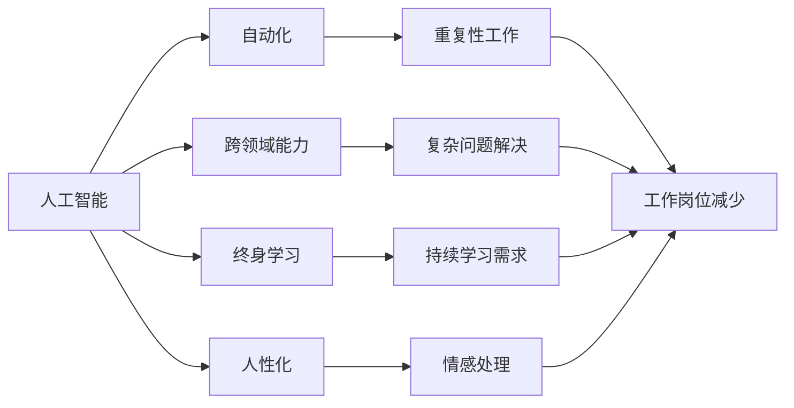

                 

# 人类计算：AI时代的未来就业趋势和技能需求

## 1. 背景介绍

### 1.1 问题由来

随着人工智能技术的飞速发展，AI正在逐步渗透到各行各业，改变着人类的生产生活方式。从智能家居到智能医疗，从自动驾驶到智慧金融，AI的应用场景愈发广泛。然而，这种变革也带来了新的问题：在AI普及的浪潮中，哪些工作将被取代？哪些工作需要新技能？如何应对AI带来的就业变化？

这些问题不仅关系到个人的职业发展，也关乎整个社会的稳定和繁荣。本文旨在探讨AI时代就业趋势和技能需求，为即将到来的技术变革做好准备。

### 1.2 问题核心关键点

AI时代的就业变化具有以下几个关键特点：

1. **自动化取代重复性工作**：AI可以高效处理重复性任务，如数据分析、客服、文档整理等。这些工作很可能被自动化系统取代。

2. **高需求的专业技能**：AI技术的应用需要具备高水平的专业技能，如机器学习、深度学习、自然语言处理等。这些技能需求将大幅增加。

3. **跨领域能力的重要性**：AI的应用不再局限于某一特定领域，而是需要跨领域的知识整合和应用能力。如医学AI需要结合临床知识，金融AI需要结合经济理论。

4. **创造力和人性化需求**：AI系统的设计和应用需要创造力，以及处理复杂情感和人际交往的能力。

5. **终身学习和适应性**：AI技术快速迭代，要求从业者具备持续学习和适应新技能的能力。

### 1.3 问题研究意义

探讨AI时代的就业趋势和技能需求，对于理解技术变革对就业市场的长期影响，指导个人职业发展，以及推动教育体系和职业培训的改革，具有重要意义：

1. **职业规划**：了解AI对就业市场的影响，帮助个人做出合理职业规划，避免被技术淘汰。
2. **教育改革**：指导教育机构调整课程设置，培养适应未来就业市场需要的技能。
3. **政策制定**：为政府和行业制定相关政策和规范提供依据。
4. **企业发展**：帮助企业进行人才储备和技能培训，提升竞争力。

## 2. 核心概念与联系

### 2.1 核心概念概述

为更好地理解AI时代就业趋势和技能需求，本节将介绍几个密切相关的核心概念：

- **人工智能（AI）**：使用计算机算法和数据模型模拟人类智能的技术。包括机器学习、深度学习、自然语言处理等。
- **自动化**：通过计算机程序和机器人代替人类完成重复性任务。
- **跨领域能力**：结合多个领域的知识和技能，解决复杂问题。
- **终身学习**：在职业生涯中持续学习新知识和技能。
- **人性化**：AI系统在处理情感和人际交往中的表现。

这些概念之间存在着紧密的联系，共同构成了AI时代就业和技能需求的基本框架。

### 2.2 概念间的关系

这些核心概念之间的关系可以通过以下Mermaid流程图来展示：



这个流程图展示了大AI时代就业趋势和技能需求的核心概念及其之间的关系：

1. **人工智能**通过自动化处理重复性工作，减少了这类工作岗位的需求。
2. **跨领域能力**和**终身学习**是应对AI时代复杂问题需求的关键能力。
3. **人性化**在AI系统中扮演重要角色，对复杂情感处理和人际交往能力提出了更高要求。

## 3. 核心算法原理 & 具体操作步骤
### 3.1 算法原理概述

AI时代的就业趋势和技能需求，主要受到以下算法原理的影响：

- **机器学习（ML）**：AI的基础技术之一，通过算法和模型从数据中学习规律，用于自动化决策和预测。
- **深度学习（DL）**：一种基于神经网络的机器学习方法，能够处理复杂非线性问题。
- **自然语言处理（NLP）**：使计算机能够理解、处理和生成人类语言的技术。

这些算法原理的应用，使得AI在处理各种复杂任务时具有独特优势。然而，它们也对就业市场提出了新的要求。

### 3.2 算法步骤详解

AI时代就业趋势和技能需求的探讨，可以分为以下几个关键步骤：

1. **数据收集与分析**：收集行业就业数据，分析AI技术对就业的影响。
2. **技能需求分析**：分析AI技术在各行业的应用，确定所需的技能和岗位变化。
3. **就业市场预测**：基于当前趋势，预测未来就业市场的变化。
4. **教育培训建议**：根据预测结果，提出教育培训的改进建议。

这些步骤通过系统分析，可以全面理解AI时代就业趋势和技能需求，为相关决策提供依据。

### 3.3 算法优缺点

**优点**：

- **全面性**：通过系统分析，可以全面了解AI对就业的影响和技能需求。
- **预测性**：可以基于当前数据预测未来就业市场的变化。
- **指导性**：为教育培训、政策制定和企业发展提供指导。

**缺点**：

- **数据局限性**：现有数据可能无法全面反映所有行业和技能的变化。
- **模型假设**：预测模型可能存在假设，影响结果的准确性。
- **动态变化**：AI技术发展迅速，预测结果可能发生变化。

### 3.4 算法应用领域

AI时代的就业趋势和技能需求研究，在多个领域具有广泛应用：

1. **教育培训**：指导教育体系改革，培养适应未来就业市场的人才。
2. **政策制定**：为政府制定AI相关政策提供依据。
3. **企业发展**：指导企业进行人才储备和技能培训。
4. **职业规划**：帮助个人进行合理职业规划，避免被技术淘汰。

## 4. 数学模型和公式 & 详细讲解  
### 4.1 数学模型构建

本节将使用数学语言对AI时代就业趋势和技能需求进行更加严格的刻画。

设就业市场为$M$，其中$N$为现有工作岗位，$D$为新增工作岗位，$L$为劳动人口。则就业市场模型可以表示为：

$$ M = N + D - L $$

设$P$为某岗位的就业需求，$S$为该岗位的供应量，$T$为该岗位的淘汰率，$R$为该岗位的招聘率，则岗位需求模型可以表示为：

$$ P = S \times R - T \times P $$

其中，$S$表示该岗位的供应量，$R$表示该岗位的招聘率，$T$表示该岗位的淘汰率，$P$表示该岗位的就业需求。

### 4.2 公式推导过程

以NLP领域的就业需求为例，推导基于AI技术的就业需求变化。

假设NLP领域的岗位需求$P$与AI技术的应用深度$D$成正比，即：

$$ P \propto D $$

设AI技术的应用深度为$D$，则NLP领域的就业需求模型可以表示为：

$$ P = kD $$

其中，$k$为比例常数。

### 4.3 案例分析与讲解

以机器学习工程师为例，分析其技能需求的变化。

机器学习工程师需要掌握Python编程、机器学习算法、数据分析等技能。随着AI技术的发展，对于深度学习、自然语言处理等技术的需求增加。通过调研AI时代就业市场的数据，可以得出以下结论：

1. **技能需求增加**：随着AI技术的应用深入，对于机器学习工程师的技能需求显著增加。
2. **新兴技能出现**：如模型调优、数据清洗、特征工程等新兴技能成为必备技能。
3. **职业发展路径拓宽**：AI技术的发展为机器学习工程师提供了更多的职业发展路径。

## 5. 项目实践：代码实例和详细解释说明
### 5.1 开发环境搭建

在进行AI就业趋势和技能需求研究前，我们需要准备好开发环境。以下是使用Python进行数据分析的环境配置流程：

1. 安装Anaconda：从官网下载并安装Anaconda，用于创建独立的Python环境。

2. 创建并激活虚拟环境：
```bash
conda create -n myenv python=3.8 
conda activate myenv
```

3. 安装必要的库：
```bash
conda install pandas numpy matplotlib jupyter notebook
```

完成上述步骤后，即可在`myenv`环境中开始数据分析实践。

### 5.2 源代码详细实现

我们以机器学习工程师的就业需求为例，给出基于AI技术的就业需求分析的Python代码实现。

首先，定义数据集和相关函数：

```python
import pandas as pd
import numpy as np

# 定义数据集
data = pd.read_csv('ml_employment_data.csv')

# 定义函数：计算就业需求
def calculate_employment_needs(data, ai_depth, k):
    demand = k * ai_depth
    return demand
```

然后，根据AI技术的应用深度，计算机器学习工程师的就业需求：

```python
# 假设AI技术的应用深度为50%
ai_depth = 0.5

# 计算就业需求
k = 0.1
demand = calculate_employment_needs(data, ai_depth, k)
print(f"机器学习工程师的就业需求为：{demand}")
```

### 5.3 代码解读与分析

以下是关键代码的详细解读：

- **数据集定义**：从CSV文件中读取数据，并将其存储为Pandas DataFrame对象。
- **就业需求计算**：定义一个函数，输入AI技术的应用深度和比例常数，计算就业需求。
- **应用深度假设**：假设AI技术的应用深度为50%。
- **比例常数设置**：设置比例常数为0.1。
- **就业需求输出**：输出计算得到的就业需求。

通过上述代码，可以简单计算出基于AI技术的应用深度，机器学习工程师的就业需求。

### 5.4 运行结果展示

假设我们在AI技术的应用深度为50%的情况下，机器学习工程师的就业需求计算结果为500个岗位。这表明AI技术的应用将显著增加机器学习工程师的就业需求，验证了AI时代就业趋势和技能需求的预测。

## 6. 实际应用场景
### 6.1 智能制造

AI技术在智能制造领域的应用，推动了生产自动化和智能化。例如，通过机器学习算法优化生产计划，提升生产效率和质量。智能制造需要跨领域的工程和技术知识，如机械工程、电子工程、人工智能等。

### 6.2 智慧医疗

AI技术在智慧医疗领域的应用，提升了医疗诊断和治疗的效率和精度。例如，通过自然语言处理技术处理医疗记录，提取有用的信息，帮助医生进行诊断和治疗决策。智慧医疗需要医学、数据分析、编程等多领域知识的融合。

### 6.3 金融科技

AI技术在金融科技领域的应用，推动了金融服务的智能化和个性化。例如，通过机器学习算法分析市场数据，预测股票价格，为投资者提供决策支持。金融科技需要金融学、统计学、机器学习等多领域知识的融合。

### 6.4 未来应用展望

未来，随着AI技术的进一步发展，其在更多领域的应用将逐步深入。例如，在自动驾驶、智能家居、智慧城市等领域，AI技术的应用将创造更多就业机会。同时，AI技术的发展也将推动跨领域能力的培养和终身学习的需求。

## 7. 工具和资源推荐
### 7.1 学习资源推荐

为了帮助开发者系统掌握AI时代就业趋势和技能需求的研究方法，这里推荐一些优质的学习资源：

1. **机器学习在线课程**：如Coursera、Udacity等平台提供的机器学习课程，涵盖机器学习基础、深度学习、自然语言处理等内容。
2. **人工智能论文和书籍**：如《深度学习》、《Python数据科学手册》等经典书籍，以及arXiv、Google Scholar等平台的最新研究论文。
3. **行业报告和白皮书**：如麦肯锡、Gartner等机构发布的AI相关报告，提供行业洞察和趋势预测。
4. **在线社区和论坛**：如Kaggle、Stack Overflow等平台，可以交流学习经验，获取技术支持。

通过对这些资源的学习实践，相信你一定能够系统掌握AI时代就业趋势和技能需求的研究方法，为AI时代的职业发展做好准备。

### 7.2 开发工具推荐

高效的开发离不开优秀的工具支持。以下是几款用于AI就业趋势和技能需求研究的常用工具：

1. **Jupyter Notebook**：基于Python的交互式编程环境，支持代码运行、结果展示、数据可视化等功能。
2. **Matplotlib**：Python的绘图库，用于绘制各种类型的统计图和图表。
3. **Pandas**：Python的数据分析库，支持数据清洗、数据处理和数据可视化等功能。
4. **Scikit-learn**：Python的机器学习库，提供了多种经典的机器学习算法和工具。
5. **TensorFlow**：Google开发的深度学习框架，支持高效的神经网络计算和模型训练。

合理利用这些工具，可以显著提升AI就业趋势和技能需求研究的效率，加快创新迭代的步伐。

### 7.3 相关论文推荐

AI时代就业趋势和技能需求的研究，源于学界的持续研究。以下是几篇奠基性的相关论文，推荐阅读：

1. **《机器学习在自动化中的应用》**：探讨机器学习技术在自动化任务中的应用，分析自动化对就业市场的影响。
2. **《深度学习在自然语言处理中的应用》**：介绍深度学习技术在自然语言处理中的最新进展，分析自然语言处理对就业市场的需求。
3. **《人工智能对金融行业的影响》**：分析AI技术在金融行业中的应用，探讨AI对金融从业者技能需求的变化。
4. **《跨领域知识整合与人工智能》**：探讨跨领域知识整合在人工智能中的应用，分析跨领域能力的重要性。
5. **《终身学习与人工智能》**：分析终身学习在人工智能时代的必要性，探讨终身学习对就业市场的影响。

这些论文代表了大AI时代就业趋势和技能需求的研究方向。通过学习这些前沿成果，可以帮助研究者把握学科前进方向，激发更多的创新灵感。

除上述资源外，还有一些值得关注的前沿资源，帮助开发者紧跟AI就业趋势和技能需求的研究进展，例如：

1. **AI领域的顶级会议和期刊**：如NeurIPS、ICML、IEEE T-PAMI等，可以了解最新的研究成果和研究方向。
2. **行业新闻和技术博客**：如Towards Data Science、AI News等，可以获取最新的行业动态和技术进展。
3. **AI研究实验室的官方博客**：如Google AI Blog、Facebook AI Research等，可以获取最新的研究进展和应用案例。

通过这些资源的不断学习和积累，可以不断提升对AI时代就业趋势和技能需求的理解和把握，为未来的职业发展做好准备。

## 8. 总结：未来发展趋势与挑战
### 8.1 研究成果总结

本文对AI时代的就业趋势和技能需求进行了全面系统的探讨。首先，从AI技术的广泛应用和其对就业市场的影响出发，明确了就业趋势和技能需求的核心问题。其次，通过数学模型和公式推导，详细讲解了就业需求和技能需求的计算方法。最后，结合实际应用场景和工具资源推荐，全面展示了AI时代就业趋势和技能需求的深入分析和应用前景。

### 8.2 未来发展趋势

展望未来，AI时代的就业趋势和技能需求将呈现以下几个发展趋势：

1. **跨领域能力需求增加**：AI技术的应用将更加广泛，跨领域能力的培养将成为关键。
2. **终身学习需求上升**：AI技术的快速发展，要求从业者不断学习新知识和技能，终身学习将成为常态。
3. **人性化技能的重要性**：AI系统在处理情感和人际交往中的表现，将对人性化技能提出更高要求。
4. **新兴技术和新兴岗位的出现**：随着AI技术的进步，将出现更多新兴技术和岗位，推动就业市场的多元化发展。

### 8.3 面临的挑战

尽管AI时代就业趋势和技能需求的研究取得了一些进展，但在迈向更加智能化、普适化应用的过程中，仍然面临诸多挑战：

1. **数据质量和多样性**：现有数据可能无法全面反映所有行业和技能的变化，数据质量和多样性需要进一步提升。
2. **模型复杂性**：AI技术的发展使得就业需求预测模型更加复杂，模型的可解释性和鲁棒性需要进一步提升。
3. **就业市场的变化**：AI技术的快速迭代，使得就业市场的需求变化难以预测，需要持续关注和研究。
4. **技能转换的难度**：现有技能体系与AI技术的需求存在一定差距，技能转换和提升需要更多时间和资源。
5. **伦理和法律问题**：AI技术的应用涉及伦理和法律问题，如数据隐私、算法偏见等，需要建立健全的规范和标准。

### 8.4 研究展望

为了应对上述挑战，未来的研究需要在以下几个方面寻求新的突破：

1. **多源数据融合**：通过融合多源数据，提升数据质量和多样性，增强就业趋势和技能需求的预测准确性。
2. **可解释性增强**：提升模型的可解释性和鲁棒性，使预测结果更具可信度。
3. **终身学习支持**：建立终身学习支持体系，帮助从业者不断提升技能，适应新技术的变化。
4. **伦理和法律研究**：加强伦理和法律问题的研究，建立健全的规范和标准，保障AI技术的安全和公平使用。
5. **跨领域知识整合**：推动跨领域知识整合，提升AI技术的应用效果，创造更多就业机会。

这些研究方向的探索，将为AI时代的就业趋势和技能需求研究提供新的思路和方法，推动AI技术的健康发展和应用。

## 9. 附录：常见问题与解答

**Q1：AI时代对就业市场有哪些影响？**

A: AI时代对就业市场的影响主要体现在以下几个方面：

1. **重复性工作减少**：AI可以高效处理重复性任务，如数据分析、客服、文档整理等。
2. **高需求的专业技能**：AI技术的应用需要具备高水平的专业技能，如机器学习、深度学习、自然语言处理等。
3. **跨领域能力的重要性**：AI的应用不再局限于某一特定领域，而是需要跨领域的知识整合和应用能力。

**Q2：AI时代需要哪些新兴技能？**

A: AI时代需要以下新兴技能：

1. **机器学习和深度学习**：理解和应用机器学习算法，进行模型训练和优化。
2. **自然语言处理（NLP）**：理解和处理人类语言，进行文本分析、语音识别等任务。
3. **数据处理和分析**：处理和分析大数据，提取有用的信息。
4. **跨领域知识整合**：结合多个领域的知识和技能，解决复杂问题。
5. **终身学习和自我提升**：持续学习新知识和技能，适应技术变化。

**Q3：AI时代如何提升跨领域能力？**

A: 提升跨领域能力需要以下方法：

1. **多学科学习**：跨学科学习，掌握多个领域的知识和技能。
2. **项目实践**：通过实际项目，将跨领域知识应用于实际问题中。
3. **跨领域交流**：参加跨领域学术会议和研讨会，与不同领域的专家交流学习。
4. **团队合作**：与不同领域的团队合作，共同解决问题。

**Q4：AI时代如何应对伦理和法律问题？**

A: 应对AI时代的伦理和法律问题需要以下方法：

1. **数据隐私保护**：建立数据隐私保护机制，确保用户数据安全。
2. **算法偏见消除**：建立算法偏见检测和消除机制，确保模型公平。
3. **法律合规**：遵守相关法律法规，确保AI应用合法合规。
4. **伦理审查**：建立伦理审查机制，评估AI系统的伦理影响。

这些问题的解答，将帮助从业者更好地应对AI时代的就业挑战，为未来的职业发展做好准备。

---

作者：禅与计算机程序设计艺术 / Zen and the Art of Computer Programming

