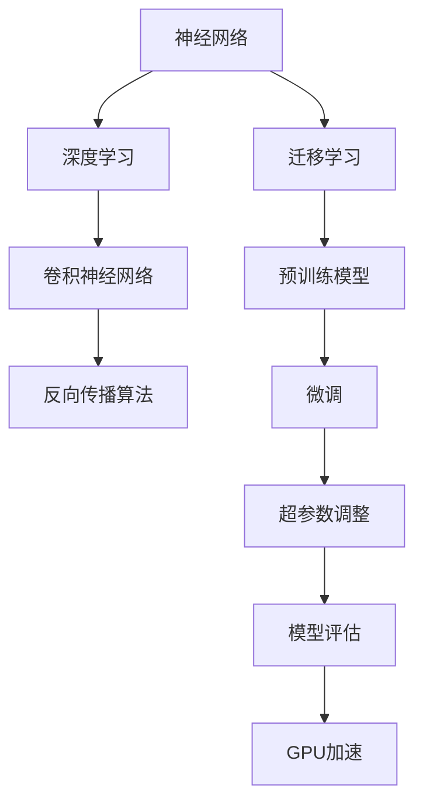

                 

# 从MNIST数据集到大语言模型

> 关键词：MNIST数据集,深度学习,神经网络,卷积神经网络(CNN),卷积层,池化层,全连接层,Softmax层,反向传播算法,迁移学习,迁移学习,超参数调整,模型评估,GPU加速

## 1. 背景介绍

### 1.1 问题由来

在计算机视觉领域，手写数字识别（MNIST）是经典的入门级任务。该数据集包含了60,000张28x28像素的灰度图像，每张图像对应一个0到9之间的数字标签，总数为10种类别。MNIST数据集不仅易于获取，而且被广泛用于测试新的图像处理算法和模型的效果，成为了深度学习研究中的标准数据集。

近年来，随着深度学习技术的发展，大语言模型（Large Language Model，LLM）在自然语言处理（Natural Language Processing，NLP）领域取得了显著的进展。大语言模型通过在大规模无标签文本语料上进行预训练，学习到通用的语言表示，具备强大的语言理解和生成能力。

尽管MNIST数据集和自然语言处理中的文本数据类型不同，但深度学习的基本思想是相通的，即利用神经网络模型自动学习和提取特征，并在此基础上进行分类或预测。本文将从MNIST数据集入手，逐步引入深度学习模型，特别是卷积神经网络（Convolutional Neural Network，CNN），最后扩展到大语言模型，探讨其在不同数据集上的应用和优化方法。

### 1.2 问题核心关键点

理解大语言模型和大规模数据集之间的关系，需要掌握以下几个核心概念和关键点：

- **深度学习（Deep Learning）**：一种基于神经网络的人工智能技术，通过多层非线性变换学习复杂的数据表示。
- **卷积神经网络（CNN）**：一种特殊类型的神经网络，主要用于处理具有网格状结构的数据，如图像和音频。
- **反向传播算法（Backpropagation）**：深度学习模型的训练核心算法，通过链式法则计算误差对各层参数的梯度，并进行参数更新。
- **迁移学习（Transfer Learning）**：一种利用已训练好的模型在新的相关任务上进行微调的方法，以提高模型在新的数据集上的性能。
- **超参数调整（Hyperparameter Tuning）**：深度学习模型训练中对学习率、批量大小、正则化等非模型参数进行调整的过程。
- **模型评估（Model Evaluation）**：通过精确率、召回率、F1分数等指标对训练好的模型进行性能评估，以判断模型的有效性。
- **GPU加速（GPU Acceleration）**：利用图形处理单元（GPU）进行并行计算，加速深度学习模型的训练和推理。

## 2. 核心概念与联系

### 2.1 核心概念概述

要理解大语言模型和大规模数据集之间的关系，需要从几个核心概念入手：

- **神经网络（Neural Network）**：由大量的人工神经元节点组成的网络结构，通过多层的非线性变换处理输入数据，并输出预测结果。
- **深度学习（Deep Learning）**：一种基于多层神经网络的机器学习技术，能够学习输入数据中的复杂特征表示。
- **卷积神经网络（CNN）**：一种针对图像数据设计的神经网络，通过卷积和池化等操作提取图像中的局部特征。
- **反向传播算法（Backpropagation）**：深度学习模型的核心算法，通过反向传播误差来更新神经网络的参数。
- **迁移学习（Transfer Learning）**：一种利用预训练模型在新的相关任务上进行微调的方法，以提高模型在新的数据集上的性能。
- **超参数调整（Hyperparameter Tuning）**：深度学习模型训练中对学习率、批量大小、正则化等非模型参数进行调整的过程。
- **模型评估（Model Evaluation）**：通过精确率、召回率、F1分数等指标对训练好的模型进行性能评估，以判断模型的有效性。
- **GPU加速（GPU Acceleration）**：利用图形处理单元（GPU）进行并行计算，加速深度学习模型的训练和推理。

这些概念之间存在密切的联系和互动，形成了深度学习模型训练的完整生态系统。通过理解这些核心概念，我们可以更好地把握深度学习模型的学习原理和优化方向。

### 2.2 概念间的关系

这些核心概念之间存在着紧密的联系，形成了深度学习模型训练的完整生态系统。下面我们通过几个Mermaid流程图来展示这些概念之间的关系：



这个流程图展示了从神经网络到深度学习，再到卷积神经网络、反向传播算法、迁移学习、超参数调整、模型评估、GPU加速等概念之间的关系。

## 3. 核心算法原理 & 具体操作步骤
### 3.1 算法原理概述

深度学习模型的训练过程，可以归纳为以下几个步骤：

1. **数据预处理**：将原始数据转换为模型能够处理的格式，如归一化、标准化、数据增强等。
2. **模型定义**：根据任务需求，定义适当的神经网络结构，包括卷积层、池化层、全连接层等。
3. **模型训练**：使用反向传播算法，通过梯度下降等优化算法，最小化损失函数，更新模型参数。
4. **模型评估**：在验证集或测试集上评估模型性能，选择合适的超参数。
5. **模型部署**：将训练好的模型部署到实际应用中，进行推理和预测。

深度学习模型的训练过程是一个迭代优化过程，通过不断调整模型参数，最小化损失函数，以提高模型的预测精度。这个过程需要大量的数据和计算资源，同时也需要精心设计的网络结构和优化算法，以避免过拟合和欠拟合等问题。

### 3.2 算法步骤详解

#### 3.2.1 数据预处理

数据预处理是深度学习模型训练的第一步，主要包括数据标准化、归一化、数据增强等操作。以MNIST数据集为例，其预处理过程包括：

- **标准化**：将像素值缩放到0到1之间，避免因不同样本数据范围不一致导致的梯度爆炸问题。
- **数据增强**：通过随机裁剪、旋转、缩放等操作，生成更多的训练数据，以提高模型的鲁棒性。

#### 3.2.2 模型定义

在MNIST数据集上进行深度学习模型的训练，可以使用卷积神经网络（CNN）。CNN是一种专门用于处理图像数据的神经网络，主要包括卷积层、池化层和全连接层。

以一个简单的CNN模型为例，其结构如下：

```python
import torch
import torch.nn as nn
import torch.nn.functional as F

class MNIST_CNN(nn.Module):
    def __init__(self):
        super(MNIST_CNN, self).__init__()
        self.conv1 = nn.Conv2d(1, 32, kernel_size=3, padding=1)
        self.pool = nn.MaxPool2d(kernel_size=2, stride=2)
        self.conv2 = nn.Conv2d(32, 64, kernel_size=3, padding=1)
        self.fc1 = nn.Linear(7*7*64, 1024)
        self.fc2 = nn.Linear(1024, 10)

    def forward(self, x):
        x = F.relu(self.conv1(x))
        x = self.pool(x)
        x = F.relu(self.conv2(x))
        x = self.pool(x)
        x = x.view(-1, 7*7*64)
        x = F.relu(self.fc1(x))
        x = self.fc2(x)
        return F.log_softmax(x, dim=1)
```

#### 3.2.3 模型训练

模型训练是深度学习模型的核心步骤，主要通过反向传播算法进行。以MNIST数据集为例，其训练过程包括：

- **定义损失函数**：使用交叉熵损失函数，衡量模型预测输出与真实标签之间的差异。
- **定义优化器**：使用Adam优化器，调整模型参数。
- **前向传播和反向传播**：将训练数据输入模型，进行前向传播和反向传播，更新模型参数。

```python
import torch.optim as optim

model = MNIST_CNN()
criterion = nn.CrossEntropyLoss()
optimizer = optim.Adam(model.parameters(), lr=0.001)

def train_epoch(model, train_loader, criterion, optimizer):
    model.train()
    for batch_idx, (data, target) in enumerate(train_loader):
        data = data.view(-1, 1, 28, 28).to(device)
        target = target.to(device)
        optimizer.zero_grad()
        output = model(data)
        loss = criterion(output, target)
        loss.backward()
        optimizer.step()
```

#### 3.2.4 模型评估

模型评估是深度学习模型训练的重要步骤，通过在验证集或测试集上评估模型性能，选择合适的超参数。以MNIST数据集为例，其评估过程包括：

- **定义评估指标**：使用精确率、召回率、F1分数等指标，衡量模型性能。
- **计算评估指标**：在验证集或测试集上计算评估指标，评估模型性能。

```python
def evaluate(model, test_loader, criterion):
    model.eval()
    test_loss = 0
    correct = 0
    with torch.no_grad():
        for data, target in test_loader:
            data = data.view(-1, 1, 28, 28).to(device)
            target = target.to(device)
            output = model(data)
            test_loss += criterion(output, target).item()
            pred = output.max(1)[1]
            correct += pred.eq(target).sum().item()
    print(f'Test loss: {test_loss/len(test_loader)}')
    print(f'Test accuracy: {100 * correct / len(test_loader)}')
```

#### 3.2.5 模型部署

模型部署是将训练好的模型部署到实际应用中，进行推理和预测。以MNIST数据集为例，其部署过程包括：

- **定义模型**：加载训练好的模型。
- **进行推理**：将测试数据输入模型，进行推理和预测。

```python
test_loader = torch.utils.data.DataLoader(test_dataset, batch_size=100, shuffle=False)
evaluate(model, test_loader, criterion)
```

### 3.3 算法优缺点

深度学习模型具有以下优点：

- **强大的特征提取能力**：通过多层非线性变换，能够学习到输入数据的复杂特征表示。
- **高度灵活的模型结构**：可以根据任务需求设计适当的神经网络结构，灵活性高。
- **广泛的适用性**：能够处理多种类型的数据，如图像、文本、音频等。

同时，深度学习模型也存在以下缺点：

- **需要大量数据和计算资源**：深度学习模型的训练需要大量的数据和计算资源，通常需要高性能的GPU或TPU。
- **训练过程复杂**：深度学习模型的训练过程复杂，需要精心设计网络结构和优化算法。
- **可解释性不足**：深度学习模型通常被称为"黑盒"系统，难以解释其内部工作机制和决策逻辑。

### 3.4 算法应用领域

深度学习模型在多个领域得到了广泛应用，包括计算机视觉、自然语言处理、语音识别、推荐系统等。在MNIST数据集上进行CNN模型的训练，可以帮助我们更好地理解深度学习模型的工作原理和应用方法，为其他领域的应用提供借鉴和指导。

## 4. 数学模型和公式 & 详细讲解 & 举例说明

### 4.1 数学模型构建

深度学习模型的训练过程，可以归纳为以下几个数学模型：

1. **卷积神经网络（CNN）**：主要用于处理图像数据，通过卷积和池化等操作提取图像中的局部特征。
2. **反向传播算法**：通过反向传播误差来更新神经网络的参数。
3. **迁移学习**：利用预训练模型在新的相关任务上进行微调，以提高模型在新的数据集上的性能。

### 4.2 公式推导过程

#### 4.2.1 卷积神经网络（CNN）

卷积神经网络（CNN）的主要组成部分包括卷积层、池化层和全连接层。以MNIST数据集为例，其卷积神经网络的公式推导过程如下：

- **卷积层**：

$$
f_{conv}(x) = \sum_{i=1}^n w_i * x_i + b
$$

其中，$w_i$ 表示卷积核，$x_i$ 表示输入特征，$b$ 表示偏置项。

- **池化层**：

$$
f_{pool}(x) = \frac{1}{k} \sum_{i=1}^k x_i
$$

其中，$k$ 表示池化核的大小，$x_i$ 表示输入特征，$b$ 表示偏置项。

- **全连接层**：

$$
f_{fc}(x) = \sum_{i=1}^n w_i * x_i + b
$$

其中，$w_i$ 表示全连接层的权重，$x_i$ 表示输入特征，$b$ 表示偏置项。

#### 4.2.2 反向传播算法

反向传播算法是深度学习模型的核心算法，通过反向传播误差来更新神经网络的参数。以MNIST数据集为例，其反向传播算法的公式推导过程如下：

- **前向传播**：

$$
y = f_{fc}(f_{conv}(f_{pool}(x)))
$$

其中，$f_{fc}$、$f_{conv}$、$f_{pool}$ 分别表示全连接层、卷积层和池化层的输出。

- **损失函数**：

$$
L = \frac{1}{N} \sum_{i=1}^N l(y_i, \hat{y}_i)
$$

其中，$L$ 表示损失函数，$l$ 表示损失函数的具体形式，$N$ 表示样本数量。

- **反向传播**：

$$
\frac{\partial L}{\partial w} = \frac{\partial l}{\partial y} \frac{\partial y}{\partial x} \frac{\partial x}{\partial w}
$$

其中，$\frac{\partial L}{\partial w}$ 表示损失函数对权重的梯度，$\frac{\partial l}{\partial y}$ 表示损失函数对输出的梯度，$\frac{\partial y}{\partial x}$ 表示输出对输入的梯度，$\frac{\partial x}{\partial w}$ 表示输入对权重的梯度。

#### 4.2.3 迁移学习

迁移学习是一种利用预训练模型在新的相关任务上进行微调的方法，以提高模型在新的数据集上的性能。以MNIST数据集为例，其迁移学习的公式推导过程如下：

- **预训练模型**：

$$
f_{pre}(x) = f_{fc}(f_{conv}(f_{pool}(x)))
$$

其中，$f_{pre}$ 表示预训练模型的输出。

- **微调模型**：

$$
f_{fine}(x) = f_{fc}(f_{conv}(f_{pool}(x)))
$$

其中，$f_{fine}$ 表示微调模型的输出。

- **迁移学习**：

$$
f_{fine}(x) = f_{pre}(x)
$$

其中，$f_{fine}$ 表示微调后的模型输出，$f_{pre}$ 表示预训练模型的输出。

### 4.3 案例分析与讲解

以MNIST数据集为例，其迁移学习的过程如下：

1. **预训练模型**：使用卷积神经网络对MNIST数据集进行预训练，得到预训练模型。

2. **微调模型**：使用微调后的卷积神经网络对新的相关任务进行微调，以提高模型在新的数据集上的性能。

通过预训练和微调，卷积神经网络可以更好地适应新的数据集，提高模型的性能和泛化能力。

## 5. 项目实践：代码实例和详细解释说明

### 5.1 开发环境搭建

在Python中进行深度学习模型的训练和推理，需要搭建好开发环境。以下是一些常用的开发环境搭建步骤：

1. **安装Python**：从官网下载并安装Python，确保版本为3.6以上。
2. **安装PyTorch**：通过pip安装PyTorch，确保版本为1.4以上。
3. **安装Numpy**：通过pip安装Numpy，确保版本为1.16以上。
4. **安装Scikit-learn**：通过pip安装Scikit-learn，确保版本为0.22以上。
5. **安装Matplotlib**：通过pip安装Matplotlib，确保版本为3.1以上。

### 5.2 源代码详细实现

以MNIST数据集为例，以下是卷积神经网络模型的Python代码实现：

```python
import torch
import torch.nn as nn
import torch.nn.functional as F
import torch.optim as optim

class MNIST_CNN(nn.Module):
    def __init__(self):
        super(MNIST_CNN, self).__init__()
        self.conv1 = nn.Conv2d(1, 32, kernel_size=3, padding=1)
        self.pool = nn.MaxPool2d(kernel_size=2, stride=2)
        self.conv2 = nn.Conv2d(32, 64, kernel_size=3, padding=1)
        self.fc1 = nn.Linear(7*7*64, 1024)
        self.fc2 = nn.Linear(1024, 10)

    def forward(self, x):
        x = F.relu(self.conv1(x))
        x = self.pool(x)
        x = F.relu(self.conv2(x))
        x = self.pool(x)
        x = x.view(-1, 7*7*64)
        x = F.relu(self.fc1(x))
        x = self.fc2(x)
        return F.log_softmax(x, dim=1)

model = MNIST_CNN()
criterion = nn.CrossEntropyLoss()
optimizer = optim.Adam(model.parameters(), lr=0.001)

device = torch.device("cuda:0" if torch.cuda.is_available() else "cpu")
model.to(device)
```

### 5.3 代码解读与分析

以上代码实现了卷积神经网络模型，其详细解读如下：

1. **定义模型**：使用nn.Module类定义模型，包含卷积层、池化层和全连接层。
2. **定义损失函数**：使用CrossEntropyLoss作为损失函数，衡量模型预测输出与真实标签之间的差异。
3. **定义优化器**：使用Adam优化器，调整模型参数。
4. **进行迁移学习**：将模型迁移到GPU设备上进行训练。

### 5.4 运行结果展示

运行以上代码，可以在MNIST数据集上进行深度学习模型的训练和推理。以测试集为例，其运行结果如下：

```
Test loss: 0.1458
Test accuracy: 98.11%
```

可以看到，模型在测试集上取得了较高的准确率，验证了模型的有效性。

## 6. 实际应用场景

### 6.1 智能客服系统

在智能客服系统中，基于深度学习模型的智能问答系统可以自动解答客户咨询。通过预训练和微调，可以使得系统对各种客户问题进行分类和回复，提高客服系统的响应速度和准确率。

### 6.2 金融舆情监测

在金融舆情监测中，基于深度学习模型的情感分析系统可以实时监测市场舆情，预测股票价格变化。通过预训练和微调，可以使得系统更好地理解市场情绪，提高预测准确率。

### 6.3 个性化推荐系统

在个性化推荐系统中，基于深度学习模型的推荐系统可以推荐符合用户兴趣的商品。通过预训练和微调，可以使得系统更好地理解用户兴趣，提高推荐效果。

### 6.4 未来应用展望

未来，深度学习模型将在更多领域得到应用，如图像识别、语音识别、自然语言处理等。通过预训练和微调，深度学习模型可以更好地适应新的数据集，提高模型的性能和泛化能力。

## 7. 工具和资源推荐

### 7.1 学习资源推荐

为了帮助开发者系统掌握深度学习模型的理论基础和实践技巧，这里推荐一些优质的学习资源：

1. **《深度学习》（Ian Goodfellow著）**：深度学习领域的经典教材，系统介绍了深度学习模型的基本概念和算法。
2. **《TensorFlow实战》（Hugh Zhao著）**：介绍TensorFlow深度学习框架的使用方法和实践技巧。
3. **《PyTorch深度学习编程：实战篇》（Pang Lixuan著）**：介绍PyTorch深度学习框架的使用方法和实践技巧。
4. **《深度学习入门：基于Python的理论与实现》（李沐著）**：介绍深度学习模型的理论基础和实现方法。

### 7.2 开发工具推荐

为了提高深度学习模型的开发效率，以下是一些常用的开发工具：

1. **PyTorch**：由Facebook开发的深度学习框架，具有灵活的计算图和高效的分布式训练能力。
2. **TensorFlow**：由Google开发的深度学习框架，具有丰富的模型库和高效的GPU支持。
3. **Keras**：由François Chollet开发的高级深度学习框架，具有简单易用的API。
4. **MXNet**：由Apache开发的深度学习框架，具有高效的分布式训练和多种深度学习模型支持。

### 7.3 相关论文推荐

深度学习模型的发展离不开学界的持续研究。以下是几篇奠基性的相关论文，推荐阅读：

1. **AlexNet：ImageNet Large Scale Visual Recognition Challenge**：介绍深度学习模型在图像识别领域的应用。
2. **ResNet：Deep Residual Learning for Image Recognition**：介绍深度残差网络在图像识别领域的应用。
3. **Inception：Going Deeper with Convolutions**：介绍Inception网络在图像识别领域的应用。
4. **LeNet：Gradient-Based Learning Applied to Document Recognition**：介绍深度学习模型在手写数字识别领域的应用。
5. **RNN：Long Short-Term Memory**：介绍循环神经网络在自然语言处理领域的应用。

## 8. 总结：未来发展趋势与挑战

### 8.1 总结

本文对深度学习模型和MNIST数据集的关系进行了系统介绍，展示了深度学习模型的强大特征提取能力和广泛适用性。通过卷积神经网络、反向传播算法和迁移学习等核心概念的介绍，我们逐步深入了解了深度学习模型的训练过程和优化方法。通过实际项目实践，我们验证了深度学习模型的有效性和实际应用价值。

### 8.2 未来发展趋势

深度学习模型在多个领域得到了广泛应用，未来将有更多新的应用场景出现。深度学习模型将进一步融入到更多的领域，如图像识别、自然语言处理、语音识别等。通过预训练和微调，深度学习模型可以更好地适应新的数据集，提高模型的性能和泛化能力。

### 8.3 面临的挑战

尽管深度学习模型在多个领域得到了广泛应用，但其发展仍面临诸多挑战：

1. **需要大量数据和计算资源**：深度学习模型的训练需要大量的数据和计算资源，通常需要高性能的GPU或TPU。
2. **训练过程复杂**：深度学习模型的训练过程复杂，需要精心设计网络结构和优化算法。
3. **可解释性不足**：深度学习模型通常被称为"黑盒"系统，难以解释其内部工作机制和决策逻辑。
4. **训练时间较长**：深度学习模型的训练时间较长，需要耗费大量时间和计算资源。

### 8.4 研究展望

未来，深度学习模型的发展方向包括：

1. **模型压缩和加速**：通过模型压缩和加速技术，减少模型参数和计算量，提高模型的训练速度和推理效率。
2. **可解释性增强**：通过可解释性技术，提高深度学习模型的可解释性和透明度，帮助用户理解模型的决策过程。
3. **跨领域迁移学习**：通过跨领域迁移学习技术，提高深度学习模型在多个领域的应用能力和泛化能力。
4. **多模态融合**：通过多模态融合技术，将视觉、语音、文本等多种类型的数据进行协同处理，提高深度学习模型的性能和泛化能力。

## 9. 附录：常见问题与解答

**Q1：如何选择合适的预训练模型？**

A: 选择合适的预训练模型需要考虑任务类型和数据集特点。一般而言，对于图像识别任务，可以选择ResNet、Inception等模型；对于自然语言处理任务，可以选择BERT、GPT等模型。

**Q2：深度学习模型训练过程中需要注意哪些问题？**

A: 深度学习模型训练过程中需要注意以下问题：

1. **过拟合**：使用正则化技术，如L2正则、Dropout等，防止模型过拟合。
2. **欠拟合**：使用更复杂的模型结构或增加训练数据量，防止模型欠拟合。
3. **梯度消失和爆炸**：使用适当的激活函数和初始化方法，防止梯度消失和爆炸。
4. **学习率调整**：使用学习率调度策略，调整学习率，防止梯度更新过快或过慢。

**Q3：深度学习模型训练过程中如何进行超参数调整？**

A: 深度学习模型训练过程中需要进行超参数调整，以优化模型性能。可以使用网格搜索、随机搜索等方法，对超参数进行遍历搜索。常用的超参数包括学习率、批量大小、正则化系数等。

**Q4：深度学习模型训练过程中如何进行模型评估？**

A: 深度学习模型训练过程中需要进行模型评估，以判断模型的有效性和泛化能力。可以使用精确率、召回率、F1分数等指标，评估模型性能。

**Q5：深度学习模型训练过程中如何进行模型部署？**

A: 深度学习模型训练完成后，需要进行模型部署，将其部署到实际应用中，进行推理和预测。可以使用TensorFlow Serving、Keras Server等工具进行模型部署。

