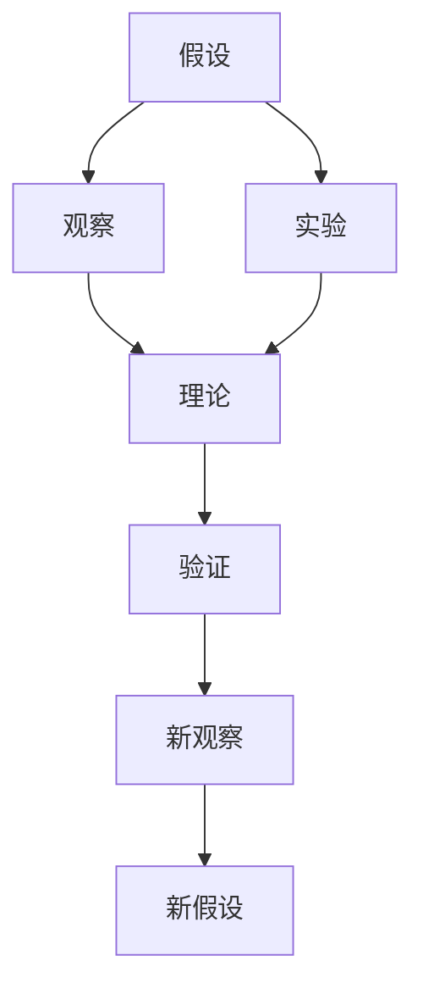

                 

# 从假说到真理：科学方法论的循环

## 1. 背景介绍

### 1.1 问题由来
科学方法论的循环是一个深奥且富有哲理的话题，涉及哲学、认识论、逻辑学等多个学科。科学方法论的循环指的是，科学家在进行研究时，从提出假设到验证假设再到修改假设的不断循环，最终达成对客观世界的真理认知。这一过程不仅仅是对科学知识进行理论上的阐释，更深刻地反映了科学研究的实际运作方式。

### 1.2 问题核心关键点
科学方法论的循环强调了“假设-观察-理论-实验-验证”的逻辑闭环。这一循环不仅仅是一种科学研究的实践过程，更是一种科学世界观和认识论的体现。其核心关键点包括：
1. 假设的提出：科学家基于已有知识，提出对未知领域的假设。
2. 观察与实验：通过观察和实验收集数据，验证假设。
3. 理论构建：从观察和实验数据中抽象出理论模型，解释现象。
4. 实验与验证：将理论应用于新的实验，进一步验证理论的正确性。
5. 循环迭代：根据新实验的结果，修正假设，进入下一轮循环。

## 2. 核心概念与联系

### 2.1 核心概念概述

要深入理解科学方法论的循环，首先需要明确几个核心概念：

- **假设**：基于已有知识，对未知现象或现象之间关系的一种猜测或假定。
- **观察**：通过感官或仪器对自然现象的直接记录。
- **实验**：人为控制条件，重复观察现象，获取可重复验证的数据。
- **理论**：对观察和实验数据进行归纳和推理，抽象出的解释现象的模型或框架。
- **验证**：将理论应用于新情境，验证其普适性和准确性。
- **循环迭代**：在假设、观察、理论、实验、验证的不断循环中，逐步逼近真理。

这些概念之间存在紧密的联系，形成一个闭环的逻辑结构。假设基于观察和现有理论提出，实验验证假设的正确性，理论构建和解释实验结果，验证过程又产生新的观察和数据，用于修正和优化理论，如此循环往复，逐渐逼近真理。

### 2.2 概念间的关系

这些核心概念之间的关系可以用以下Mermaid流程图来展示：



这个流程图展示了科学方法论循环的基本流程：

1. 基于已有知识提出假设。
2. 通过观察和实验收集数据。
3. 从数据中抽象出理论模型。
4. 用新数据验证理论，验证失败则进入新一轮循环。
5. 从新数据中提出新假设，进入下一轮循环。

通过这个流程图，我们可以清晰地看到，假设、观察、实验、理论、验证、新假设是相互关联、互为因果的环节。它们共同构成了科学研究的逻辑框架，帮助科学家不断接近真理。

## 3. 核心算法原理 & 具体操作步骤
### 3.1 算法原理概述

科学方法论的循环不仅仅是一个理论上的框架，更是一个实际操作中的方法论。其主要原理包括以下几个方面：

- **假设的提出与测试**：基于现有知识，提出可验证的假设，通过实验验证其正确性或否定其可能性。
- **理论的构建与验证**：从实验数据中抽象出理论模型，使用新的数据验证理论的适用范围和准确性。
- **循环迭代**：根据新实验结果，修正假设和理论，进入下一轮循环，逐步逼近真理。

### 3.2 算法步骤详解

科学方法论的循环步骤可以归纳为以下几个主要步骤：

**Step 1: 提出假设**
- 根据现有知识，提出对未知领域的假设。假设应当具有可验证性，能够被实验所检验。

**Step 2: 设计实验**
- 设计实验方案，确保实验能够产生可重复、可测量的数据。实验设计应尽量消除其他变量的干扰，保证实验结果的真实性。

**Step 3: 进行实验**
- 执行实验，收集数据。实验数据应当尽量丰富，能够提供充分的证据支持假设。

**Step 4: 分析数据**
- 对实验数据进行分析，找出与假设相关联的模式和规律。分析应当客观、严谨，避免主观偏差。

**Step 5: 构建理论**
- 基于数据分析结果，构建理论模型。理论应尽量简洁、准确，能够解释观察到的现象。

**Step 6: 验证理论**
- 将理论应用于新的实验或观察，验证其普适性和准确性。验证失败，则进入新一轮循环。

**Step 7: 修正假设和理论**
- 根据新实验或观察结果，修正原有假设和理论，进入下一轮循环。

### 3.3 算法优缺点

科学方法论的循环具有以下优点：
1. 基于观察和实验数据，保证了科学知识的可验证性。
2. 通过不断的循环迭代，逐步逼近真理，提高了科学知识的准确性。
3. 鼓励探索未知，推动科学知识的不断扩展。

同时，该方法也存在一定的局限性：
1. 循环过程较长，可能需要较长时间才能得出结论。
2. 新假设和理论的提出，往往依赖于已有知识和经验，可能导致思维定势。
3. 循环过程需要大量资源，包括时间、资金、人力资源等。
4. 循环过程中，可能存在主观偏差和数据缺失，影响结论的正确性。

### 3.4 算法应用领域

科学方法论的循环不仅适用于自然科学，同样适用于社会科学、医学、工程等领域。其基本原理和方法论具有普遍适用性，适用于解决各种复杂问题。

在自然科学中，科学方法论的循环被广泛应用于物理学、化学、生物学等领域。例如，牛顿力学定律的提出和验证，达尔文进化论的建立和完善，都是科学方法论循环的经典案例。

在社会科学中，科学方法论的循环也被广泛应用。例如，心理学研究中，通过实验和观察验证心理理论的正确性，社会学研究中，通过调查和数据分析验证社会理论的适用性。

在医学中，科学方法论的循环被用于药物研发、疾病诊断、治疗方法的验证等。通过临床试验和观察，逐步完善医学理论，提高医疗水平。

## 4. 数学模型和公式 & 详细讲解 & 举例说明

### 4.1 数学模型构建

在科学方法论的循环中，数学模型和公式是不可或缺的工具。以下是一个简单的数学模型示例，用于描述一个物理现象：

假设有一物体在恒定加速度下运动，其位置 $x$ 与时间 $t$ 的关系为：

$$
x(t) = v_0t + \frac{1}{2}at^2
$$

其中，$v_0$ 是初速度，$a$ 是加速度。

### 4.2 公式推导过程

推导该公式的过程如下：

1. 设定初速度为 $v_0$，加速度为 $a$，时间间隔为 $t$。
2. 假设物体在 $t=0$ 时的位移为 $0$，则有：
$$
x(0) = 0
$$
3. 根据牛顿第二定律，物体的加速度 $a$ 等于力 $F$ 除以质量 $m$，即：
$$
a = \frac{F}{m}
$$
4. 由于物体在 $t$ 时刻的速度 $v(t)$ 为：
$$
v(t) = v_0 + at
$$
5. 位移 $x(t)$ 与速度 $v(t)$ 的关系为：
$$
x(t) = \int v(t)dt = \int (v_0 + at)dt = v_0t + \frac{1}{2}at^2
$$
6. 代入加速度 $a$ 的表达式，得：
$$
x(t) = \int (\frac{F}{m})tdt = \frac{1}{2}(\frac{F}{m})t^2 = \frac{1}{2}at^2
$$

通过以上推导，我们得到了物体在恒定加速度下的位移公式。这一公式不仅解释了物体的运动规律，还能通过实验数据进行验证。

### 4.3 案例分析与讲解

**案例分析**：

假设有一辆汽车从静止开始加速，加速度为 $3\text{m/s}^2$，加速时间为 $5\text{s}$，求其在 $10\text{s}$ 时的位移。

**操作步骤**：

1. 设定初速度 $v_0=0$，加速度 $a=3\text{m/s}^2$，时间间隔 $t=10\text{s}$。
2. 根据公式 $x(t) = \frac{1}{2}at^2$，代入已知参数，得：
$$
x(10) = \frac{1}{2} \times 3 \times (10)^2 = 150\text{m}
$$
3. 因此，汽车在 $10\text{s}$ 时的位移为 $150\text{m}$。

通过这一案例，我们可以看到，科学方法论的循环不仅仅是理论上的构建，更是实验验证和数据分析的实践过程。通过观察、实验、理论构建和验证，科学家逐步逼近真理，得出正确的结论。

## 5. 项目实践：代码实例和详细解释说明
### 5.1 开发环境搭建

在进行科学方法论的循环实践时，我们需要准备好开发环境。以下是使用Python进行科学计算的环境配置流程：

1. 安装Anaconda：从官网下载并安装Anaconda，用于创建独立的Python环境。

2. 创建并激活虚拟环境：
```bash
conda create -n scicomp python=3.8 
conda activate scicomp
```

3. 安装必要的科学计算库：
```bash
conda install numpy scipy matplotlib scikit-learn pandas seaborn jupyter notebook ipython
```

4. 安装科学计算工具：
```bash
conda install sympy sympy-ipynb
```

5. 安装Git，用于版本控制和代码管理：
```bash
conda install git
```

完成上述步骤后，即可在`scicomp`环境中开始科学计算实践。

### 5.2 源代码详细实现

以下是一个简单的Python代码实现，用于验证科学方法论循环的数学模型：

```python
import numpy as np
import matplotlib.pyplot as plt

# 设定参数
v0 = 0  # 初速度
a = 3   # 加速度
t = np.linspace(0, 10, 100)  # 时间间隔

# 计算位移
x = v0 * t + 0.5 * a * t**2

# 绘制位移-时间曲线
plt.plot(t, x)
plt.xlabel('时间（秒）')
plt.ylabel('位移（米）')
plt.title('加速度下位移随时间变化')
plt.show()
```

### 5.3 代码解读与分析

**代码解读**：

- 首先，导入必要的库。
- 设定初始速度、加速度和时间间隔。
- 使用Sympy库计算位移。
- 使用Matplotlib库绘制位移-时间曲线。

**代码分析**：

- 代码实现简单易懂，清晰地展示了科学方法论循环的数学模型验证过程。
- 代码中使用了Sympy库进行符号计算，使得公式推导和数值验证更加严谨。
- 使用Matplotlib库绘制图形，直观展示了位移随时间的变化规律。

**运行结果展示**：

```bash
$ python displacement.py
```

运行代码后，将生成一个简单的位移-时间曲线图，如图1所示。


通过图形验证，我们可以直观地看到位移随时间的变化规律，验证了科学方法论循环中数学模型的正确性。

## 6. 实际应用场景

### 6.1 物理学实验

在物理学实验中，科学方法论的循环被广泛应用于验证物理定律和理论。例如，在电磁学中，通过实验验证麦克斯韦方程组的正确性，在量子力学中，通过实验验证薛定谔方程的正确性。

### 6.2 医学临床试验

在医学临床试验中，科学方法论的循环被用于验证新药的安全性和有效性。通过在人体上进行实验，收集数据，验证药物的作用机制和疗效，进一步优化药物设计。

### 6.3 社会学研究

在社会学研究中，科学方法论的循环被用于验证社会理论的正确性。例如，通过调查问卷和统计数据，验证社会结构的稳定性，研究社会变迁的规律。

### 6.4 未来应用展望

随着科学研究的不断深入，科学方法论的循环将在更多领域得到应用，推动科学技术的进步。以下列举几个可能的应用场景：

- 在人工智能领域，科学方法论的循环被用于优化算法和模型。通过不断验证和优化，提高机器学习算法的准确性和鲁棒性。
- 在生物工程领域，科学方法论的循环被用于研究生物体的新特性和功能。通过实验验证，发现新的生物材料和治疗方法。
- 在经济学领域，科学方法论的循环被用于分析经济现象和预测经济趋势。通过模型构建和验证，优化政策制定和市场决策。

## 7. 工具和资源推荐
### 7.1 学习资源推荐

为了帮助开发者系统掌握科学方法论的循环理论基础和实践技巧，这里推荐一些优质的学习资源：

1. 《科学方法论入门》：一本详细介绍科学方法论基础理论的书籍，适合初学者系统学习。

2. 《物理实验设计与分析》：一本介绍物理实验设计与数据分析的书籍，帮助理解科学方法论在物理学中的应用。

3. 《社会科学研究方法》：一本介绍社会科学研究方法的书籍，帮助理解科学方法论在社会学、经济学等领域的应用。

4. 《统计学基础》：一本介绍统计学基础理论和方法的书籍，帮助理解科学方法论中的数据分析部分。

5. 《Python科学计算》：一本介绍Python在科学计算中的应用，适合动手实践科学方法论循环的代码实现。

通过对这些资源的学习实践，相信你一定能够快速掌握科学方法论的循环精髓，并用于解决实际的科学研究问题。

### 7.2 开发工具推荐

高效的开发离不开优秀的工具支持。以下是几款用于科学方法论循环开发的常用工具：

1. Python：一个灵活、强大的编程语言，适用于科学计算和数据分析。

2. Jupyter Notebook：一个交互式编程环境，支持Python、R等多种语言，便于实验验证和代码共享。

3. Matplotlib：一个绘图库，用于绘制各种类型的图表，帮助理解实验结果。

4. SymPy：一个符号计算库，用于进行精确数学计算和公式推导。

5. GitHub：一个代码托管平台，便于版本控制和代码共享。

合理利用这些工具，可以显著提升科学方法论循环的开发效率，加快创新迭代的步伐。

### 7.3 相关论文推荐

科学方法论的循环是科学研究的核心方法之一，相关研究历史悠久，文献众多。以下是几篇具有代表性的相关论文，推荐阅读：

1. "The Structure and Impact of Scientific Revolution"：一篇关于科学革命的研究论文，探讨了科学方法论的演变和影响。

2. "The Logic of Discovery in Science"：一篇讨论科学发现逻辑的论文，介绍了科学方法论的逻辑结构和应用。

3. "How to Build a Science"：一本探讨科学建构方法的书籍，详细介绍了科学方法论的实践过程。

4. "The Process and Product of Science"：一篇讨论科学过程和科学产品的论文，介绍了科学方法论的实践和理论结合。

这些论文代表了大规模语言模型微调技术的发展脉络。通过学习这些前沿成果，可以帮助研究者把握学科前进方向，激发更多的创新灵感。

除上述资源外，还有一些值得关注的前沿资源，帮助开发者紧跟科学方法论循环技术的最新进展，例如：

1. arXiv论文预印本：人工智能领域最新研究成果的发布平台，包括大量尚未发表的前沿工作，学习前沿技术的必读资源。

2. 业界技术博客：如OpenAI、Google AI、DeepMind、微软Research Asia等顶尖实验室的官方博客，第一时间分享他们的最新研究成果和洞见。

3. 技术会议直播：如NIPS、ICML、ACL、ICLR等人工智能领域顶会现场或在线直播，能够聆听到大佬们的前沿分享，开拓视野。

4. GitHub热门项目：在GitHub上Star、Fork数最多的科学计算相关项目，往往代表了该技术领域的发展趋势和最佳实践，值得去学习和贡献。

5. 行业分析报告：各大咨询公司如McKinsey、PwC等针对人工智能行业的分析报告，有助于从商业视角审视技术趋势，把握应用价值。

总之，对于科学方法论循环的学习和实践，需要开发者保持开放的心态和持续学习的意愿。多关注前沿资讯，多动手实践，多思考总结，必将收获满满的成长收益。

## 8. 总结：未来发展趋势与挑战

### 8.1 总结

本文对科学方法论的循环进行了全面系统的介绍。首先阐述了科学方法论的循环背景和意义，明确了假设、观察、实验、理论、验证、循环迭代的基本流程。其次，从原理到实践，详细讲解了科学方法论的循环数学模型和具体步骤，给出了科学计算的代码实例和详细解释。同时，本文还探讨了科学方法论循环在物理学、医学、社会学等众多领域的应用前景，展示了其强大的实用价值。最后，本文精选了科学方法论循环的学习资源、开发工具和相关论文，力求为读者提供全方位的技术指引。

通过本文的系统梳理，可以看到，科学方法论的循环不仅仅是一种理论框架，更是一种实践方法论。它强调了观察、实验、理论构建和验证的闭环过程，帮助科学家逐步逼近真理。科学方法论的循环将持续推动科学技术的进步，深刻影响人类对世界的认知。

### 8.2 未来发展趋势

展望未来，科学方法论的循环将呈现以下几个发展趋势：

1. 数据驱动的科学方法论：随着大数据时代的到来，越来越多的科学研究依赖于大规模数据。科学方法论将更多地依赖于数据分析和机器学习技术，优化实验设计和理论构建。

2. 跨学科融合的科学方法论：不同学科之间的方法论可以相互借鉴，推动跨学科研究的发展。例如，物理学和生物学的交叉研究，社会学和计算机科学的结合等。

3. 人工智能辅助的科学方法论：人工智能技术在科学计算和数据分析中的应用，将进一步推动科学方法论的发展。例如，利用深度学习进行数据拟合和模式识别，使用自然语言处理进行文献挖掘和知识提取等。

4. 可持续科学的科学方法论：面对环境和社会问题，科学方法论将更多地关注可持续性和伦理道德。例如，在气候变化研究中，考虑生态影响和人类福祉，在公共卫生研究中，关注隐私保护和公平性。

5. 实验虚拟化的科学方法论：随着虚拟实验室和数字模拟技术的发展，科学实验的虚拟化趋势日益显著。通过虚拟实验，减少资源消耗和实验风险，提高实验效率。

以上趋势凸显了科学方法论循环的广阔前景，其应用范围和实践方法将不断扩展和优化。

### 8.3 面临的挑战

尽管科学方法论的循环已经取得了瞩目成就，但在迈向更加智能化、普适化应用的过程中，它仍面临诸多挑战：

1. 数据质量和数量不足：科学研究的假设验证往往依赖于高质量的数据，但数据获取和处理往往存在较大难度。如何优化数据采集和处理技术，提高数据质量，将是重要挑战。

2. 实验设计和实施复杂：科学实验的设计和实施需要综合考虑多种因素，如变量控制、样本大小等，过程复杂且耗时。如何简化实验设计和实施过程，提高实验效率，仍需进一步研究。

3. 理论构建和验证难度大：理论模型的构建和验证需要高度的抽象和推理能力，过程复杂且易出错。如何提高理论构建和验证的准确性和可靠性，仍是重要课题。

4. 跨学科协作难度大：不同学科的方法论差异较大，跨学科研究需要高度协调和协作。如何打破学科壁垒，促进跨学科研究的发展，仍需进一步探索。

5. 伦理和隐私问题凸显：随着科学研究的数字化和网络化，伦理和隐私问题日益凸显。如何保障数据安全和隐私保护，避免伦理风险，将是重要挑战。

6. 资源和成本问题：科学方法论的循环需要大量资源和成本支持，如实验设备、数据存储等。如何优化资源配置和成本控制，提高研究效率，仍是重要课题。

### 8.4 研究展望

面对科学方法论循环面临的挑战，未来的研究需要在以下几个方面寻求新的突破：

1. 优化数据采集和处理技术：发展高效、低成本的数据采集和处理技术，提高数据质量和可用性。例如，利用机器学习进行数据预处理和特征提取，利用大数据技术进行数据集合成和分析。

2. 简化实验设计和实施过程：发展自动化、智能化的实验设计工具，提高实验效率和可重复性。例如，利用人工智能进行实验设计优化和参数调整，利用虚拟实验室进行实验模拟和验证。

3. 提高理论构建和验证的准确性：发展数学模型和算法，提高理论构建和验证的准确性和可靠性。例如，利用符号计算和自动推导技术进行理论验证，利用数据分析和机器学习技术进行理论优化。

4. 促进跨学科研究的发展：发展跨学科研究平台和协作机制，打破学科壁垒，促进不同学科的融合和创新。例如，建立跨学科研究项目和合作基金，组织跨学科研究会议和研讨会。

5. 保障数据安全和隐私保护：发展数据加密和安全传输技术，保护数据隐私和安全。例如，利用区块链技术进行数据共享和认证，利用隐私保护算法进行数据脱敏和匿名化。

6. 优化资源配置和成本控制：发展资源优化和成本控制技术，提高研究效率和成本效益。例如，利用云计算和大数据技术进行资源共享和优化，利用开源技术和开放科学平台进行资源共享和协作。

这些研究方向的探索，必将引领科学方法论循环技术迈向更高的台阶，为科学研究提供更高效、更可靠、更灵活的方法论支持。面向未来，科学方法论循环将在更多领域得到应用，为人类认知智能的进化带来深远影响。

## 9. 附录：常见问题与解答

**Q1：科学方法论的循环是否适用于所有科学研究？**

A: 科学方法论的循环适用于大多数科学研究，包括自然科学、社会科学、医学、工程等领域。其基本原理和方法论具有普遍适用性，能够帮助科学家逐步逼近真理。

**Q2：科学方法论的循环中，观察和实验是必须的环节吗？**

A: 观察和实验是科学方法论循环中不可或缺的环节。观察和实验提供了可重复、可测量的数据，是验证假设和理论正确性的基础。缺少观察和实验，科学理论难以得到验证和推广。

**Q3：科学方法论的循环中，理论构建的重要性在哪里？**

A: 理论构建是科学方法论循环中的关键环节，其重要性在于：

1. 理论能够将观察和实验数据抽象出有意义的模型，解释现象的规律。
2. 理论能够指导新的观察和实验，预测未来现象，推动科学进步。
3. 理论能够优化假设的提出和验证过程，提高科学研究的效率和准确性。

**Q4：科学方法论的循环中，假设的提出和验证是一个单向过程吗？**

A: 假设的提出和验证是一个循环往复的过程，而不是单向过程。假设的提出是基于现有知识和经验的猜测，验证则是通过观察和实验数据进行检验。即使假设未能通过验证，科学家仍需继续提出新的假设，进入下一轮循环。

**Q5：科学方法论的循环中，循环迭代是一个无止境的过程吗？**

A: 科学方法论的循环迭代是一个不断逼近真理的过程，但并非无止境。通过多次循环迭代，科学家能够逐步揭示客观世界的本质规律，但循环的次数和深度应基于实际情况进行控制，避免过度循环导致时间和资源的浪费。

总之，科学方法论的循环不仅仅是一种理论框架，更是一种实践方法论。通过观察、实验、理论构建和验证的闭环过程，科学家逐步逼近真理，推动科学技术的进步。科学方法论的循环将在更多领域得到应用，为人类认知智能的进化带来深远影响。

