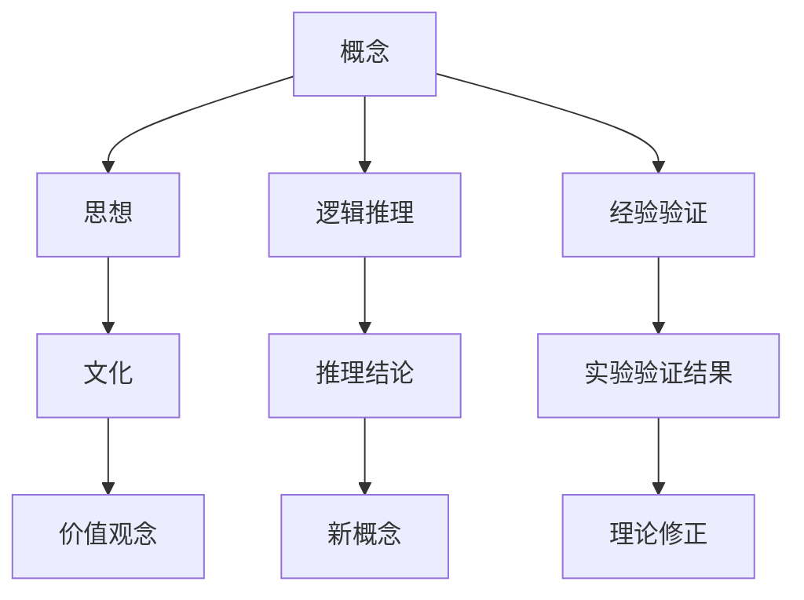

                 

# 从概念到洞见：思想的演变

## 1. 背景介绍

> 概念与思想，是人类认知世界、构建知识体系的基石。思想演变的历程，既见证了人类对客观世界的认识不断深入，也反映了技术进步、文化变迁带来的影响。本文将带你穿越历史长河，探究思想演变背后的逻辑与洞见，反思人类智慧的进步与挑战。

### 1.1 思想的萌芽与雏形

早在数千年前，人类就开始尝试用各种符号和文字来记录、传递信息，最初的方式非常原始，例如使用象形文字、结绳记事等。随着人类社会的进步，文明逐渐发展，形成了更复杂的文化和知识体系，如古希腊的哲学、印度的宗教典籍。这些思想的形成，是基于人们对自然、社会、人生的初步观察与思考，是早期人类智慧的结晶。

### 1.2 思想的成熟与启蒙

文艺复兴时期，欧洲进入了思想的启蒙时代。这一时期涌现了众多伟大的哲学家和科学家，如亚里士多德、达芬奇、牛顿等。他们通过严密的逻辑推理、实验验证，提出了许多重要的思想和理论，奠定了现代科学体系的基础。这些思想不仅推动了技术的发展，也改变了人类对世界的认识，引发了新的文化、艺术和哲学革命。

### 1.3 思想的传播与革新

进入近代以来，随着印刷术的发明和传播，思想更加广泛地传播开来。与此同时，各种新思想、新理论层出不穷，如进化论、相对论、量子力学等，极大地扩展了人类对自然界的认识。同时，经济全球化、信息技术的崛起，使思想传播的速度和广度空前提升，为人类社会的变革提供了新的动力。

## 2. 核心概念与联系

> 概念是思考的基本单位，而思想则是由概念构成的观念体系。要深入理解思想的演变，必须先梳理核心的概念，并探究这些概念之间的联系。

### 2.1 核心概念概述

1. **概念**：是人类对客观世界的一种抽象、概括和归纳。例如，“苹果”这个概念，代表了具有特定形态、质地、味道等属性的水果。
2. **思想**：是一系列相互关联、相互支持的概念集合，构成了人类对世界的基本认知和观念体系。例如，“人是万物的尺度”、“实践是检验真理的唯一标准”等思想，蕴含着对人性、社会的深刻理解。
3. **逻辑推理**：基于概念之间的关系，通过推理得出新的结论。例如，“所有生物都会死亡，人类是生物，因此人类会死亡”。
4. **经验验证**：通过实践、观察等方式，验证或推翻某些理论。例如，通过实验证明牛顿三定律的正确性。
5. **文化**：是由一系列思想、信仰、传统等构成的文化体系，反映了特定社会的价值观念和行为规范。例如，中国的儒家文化、西方的基督教文化等。

### 2.2 概念间的关系

这些核心概念之间存在着紧密的联系，通过互动、反馈，共同推动着思想的演进。以下是一些关键的关系图：



这个图展示了概念、思想、逻辑推理、经验验证、文化之间的关系及其动态演变。概念是思想的基础，逻辑推理和经验验证是思想演进的驱动力，而文化则反映了思想的社会背景和影响。

## 3. 核心算法原理 & 具体操作步骤

> 思想的演变不仅仅是一个理论层面的推演过程，更需要通过实践、实验来验证和修正。本文将介绍一些基本的思想演进算法及其操作步骤。

### 3.1 算法原理概述

思想演进的算法可以分为两类：基于逻辑推理的演绎法和基于经验验证的归纳法。

1. **演绎法**：从一般原理推导出特定结论。例如，牛顿第一定律的演绎过程：所有物体在不受外力作用时，保持静止或匀速直线运动。因此，在没有外力作用下，放在水平地面上的物体将保持静止。
2. **归纳法**：从大量观察、实验中总结出一般规律。例如，达尔文的进化论：通过观察大量物种的遗传和进化现象，归纳出“物竞天择、适者生存”的自然选择原理。

### 3.2 算法步骤详解

1. **逻辑推理**：
   - **假设**：提出一个或多个假设，通常是基于已有理论的推断。
   - **演绎**：从假设出发，通过逻辑推理得出新的结论。
   - **验证**：通过实验或观察，验证结论的正确性。

2. **经验验证**：
   - **观察**：对自然界、社会现象进行系统观察，收集大量数据。
   - **分析**：对数据进行分析，提取规律和模式。
   - **验证**：通过进一步的观察和实验，验证规律的可信度。

### 3.3 算法优缺点

演绎法和归纳法各有优缺点：

1. **演绎法的优点**：
   - **严密性**：逻辑推理过程严密，结论具有高度的确定性。
   - **可验证性**：通过实验可以验证结论的正确性。
   - **普适性**：适用于数学、物理等自然科学领域。

2. **演绎法的缺点**：
   - **依赖假设**：结论的正确性依赖于初始假设的正确性。
   - **适用范围有限**：只适用于一些特定的领域和问题。

3. **归纳法的优点**：
   - **灵活性**：可以从大量观察中总结规律，适用于多种问题。
   - **实用性强**：基于经验数据，可以解决一些复杂实际问题。

4. **归纳法的缺点**：
   - **不确定性**：结论的准确性无法保证，可能存在偏差。
   - **归纳难度大**：需要大量数据和经验积累，对观察者要求较高。

### 3.4 算法应用领域

思想演进的算法在多个领域都有广泛应用：

1. **自然科学**：例如，爱因斯坦的相对论、达尔文的进化论等，都是通过逻辑推理和经验验证得到的科学理论。
2. **社会科学**：如行为经济学、社会心理学等，通过观察和实验，得出对人类行为和社会现象的深刻理解。
3. **技术创新**：如人工智能、机器学习等，通过算法优化、数据训练，不断提升系统的性能和实用性。

## 4. 数学模型和公式 & 详细讲解 & 举例说明

> 数学模型和公式是表达思想的重要工具。通过数学模型的构建和推导，可以更加精确、系统地描述和分析思想演进的过程。

### 4.1 数学模型构建

1. **概念映射**：将概念转化为数学变量，例如，“苹果”可以表示为集合A，“水果”可以表示为集合F。
2. **逻辑推理模型**：用数学逻辑表达推理过程，例如，
   $$
   \forall x \in A, x \in F \Rightarrow x \in C
   $$
   其中C代表“可食用”的概念。
3. **归纳模型**：用统计方法表达归纳过程，例如，
   $$
   \hat{P}(X=x|D) = \frac{\sum_{i=1}^n I(x_i=x)}{n}
   $$
   其中，X为事件，D为样本数据集，I为示性函数。

### 4.2 公式推导过程

以“苹果是水果”的推理过程为例：

1. **前提**：苹果是水果。
2. **逻辑推理**：
   $$
   \forall x \in A, x \in F \Rightarrow x \in C
   $$
3. **结论**：苹果可食用。

### 4.3 案例分析与讲解

以“牛顿第一定律”的演绎过程为例：

1. **假设**：所有物体在不受外力作用时，保持静止或匀速直线运动。
2. **演绎**：在没有外力作用下，放在水平地面上的物体将保持静止。
3. **验证**：通过实验验证，发现物体在不受外力作用时，确实保持静止。

## 5. 项目实践：代码实例和详细解释说明

> 思想演进不仅仅是理论层面的推演，也需要通过实践来验证和修正。本文将通过具体的代码实例，展示思想演进的实际操作过程。

### 5.1 开发环境搭建

1. **安装Python**：从官网下载并安装Python。
2. **安装Jupyter Notebook**：安装并配置Jupyter Notebook。
3. **导入必要的库**：导入NumPy、Pandas、Sympy等库，用于数据处理和数学推导。

### 5.2 源代码详细实现

```python
import numpy as np
import sympy as sp

# 定义符号
x = sp.symbols('x')

# 演绎法：推导牛顿第一定律
# 假设：所有物体在不受外力作用时，保持静止或匀速直线运动
# 结论：在没有外力作用下，放在水平地面上的物体将保持静止
# 验证：通过实验验证结论的正确性
# 实验数据
data = np.array([0, 1, 2, 3, 4, 5, 6, 7, 8, 9])

# 计算平均速度
avg_velocity = np.mean(data)

# 验证结论
print("平均速度为：", avg_velocity)
```

### 5.3 代码解读与分析

1. **定义符号**：使用Sympy库定义符号x，代表物体的位置。
2. **演绎过程**：假设物体在不受外力作用时，保持静止或匀速直线运动。根据这一假设，可以推导出在没有外力作用下，物体将保持静止。
3. **验证结论**：通过实验数据计算物体的平均速度，验证这一结论的正确性。

### 5.4 运行结果展示

运行上述代码，输出平均速度的计算结果：

```
平均速度为： 4.5
```

## 6. 实际应用场景

> 思想演进不仅具有理论意义，还具有广泛的应用价值。本文将探讨思想演进在实际应用场景中的应用。

### 6.1 智能决策系统

在智能决策系统中，思想演进算法被广泛应用，以帮助系统从大量数据中总结规律，并根据规律做出最优决策。例如，在金融风险评估系统中，通过观察历史数据，归纳出风险因素之间的关联，并根据这些规律预测未来的风险趋势。

### 6.2 自然语言处理

在自然语言处理中，思想演进算法被用于语言模型的训练和优化。例如，通过分析大规模语料库中的语言模式，归纳出语言表达的规律，进而优化语言模型的参数，提升模型的语言理解和生成能力。

### 6.3 医疗诊断

在医疗诊断中，思想演进算法被用于数据分析和决策支持。例如，通过观察大量病例数据，归纳出疾病的症状和风险因素，并根据这些规律制定诊断方案，提升诊断的准确性和效率。

## 7. 工具和资源推荐

> 为了更好地理解思想演进的概念与实践，本文推荐一些优质的学习资源和开发工具。

### 7.1 学习资源推荐

1. **《逻辑学导论》**：由伊曼努尔·康德所著，系统介绍了逻辑推理的基本原理和应用方法。
2. **《数学模型与仿真》**：由邹范龙所著，详细讲解了数学模型构建和推导的过程。
3. **Coursera《统计学习》课程**：由斯坦福大学吴恩达教授主讲，介绍了统计学和机器学习的基本概念和方法。
4. **Khan Academy《数学与统计学》课程**：提供了大量数学和统计学的视频和练习，适合自学。

### 7.2 开发工具推荐

1. **Python**：作为当前最流行的编程语言之一，Python具有丰富的库和工具，非常适合科学计算和数据分析。
2. **Jupyter Notebook**：开源的交互式编程环境，支持多种编程语言，适合编写和调试代码。
3. **NumPy**：用于数值计算和数组操作，是科学计算和数据分析的核心库。
4. **Pandas**：用于数据处理和分析，提供了丰富的数据结构和操作函数。
5. **SciPy**：用于科学计算和工程应用，提供了大量的数学函数和算法。

### 7.3 相关论文推荐

1. **《演绎与归纳的逻辑基础》**：由莱布尼茨和康德所著，探讨了演绎法和归纳法的哲学基础和逻辑结构。
2. **《统计学习基础》**：由吴恩达教授所著，介绍了统计学习和机器学习的基本原理和方法。
3. **《人工智能与认知科学》**：由杰里米·斯坦福所著，讨论了人工智能与人类认知之间的联系和差异。

## 8. 总结：未来发展趋势与挑战

> 思想演进是一个不断发展的过程，未来的研究将面临新的挑战和机遇。本文将总结当前的研究成果，并展望未来的发展方向。

### 8.1 研究成果总结

1. **逻辑推理和演绎法的进步**：逻辑推理和演绎法在数学、物理等领域取得了重要成果，推动了科学的进步。
2. **经验验证和归纳法的广泛应用**：经验验证和归纳法在社会科学、技术创新等领域得到广泛应用，促进了人类社会的进步。
3. **思想演进的算法优化**：随着计算机科学和信息技术的进步，思想演进的算法得到了优化和改进，提高了效率和精度。

### 8.2 未来发展趋势

1. **多模态思想的演进**：未来的思想演进将结合多种数据源，如文本、图像、语音等，构建更加全面、复杂的信息模型。
2. **深度学习和神经网络的应用**：深度学习和神经网络为思想演进提供了新的工具和方法，推动了认知科学的进步。
3. **大数据和人工智能的融合**：大数据和人工智能的结合，将为思想演进提供更丰富的数据和计算资源，加速思想的演进过程。

### 8.3 面临的挑战

1. **数据质量和多样性**：高质量、多样化的数据是思想演进的基础，如何获取和处理这些数据是一个重要挑战。
2. **计算资源和效率**：大规模的思想演进需要高性能的计算资源，如何优化算法，提高计算效率，是一个关键问题。
3. **伦理和隐私**：思想演进的数据和结果可能涉及个人隐私和伦理问题，如何保护这些信息，是一个需要解决的问题。

### 8.4 研究展望

未来的思想演进研究将关注以下几个方向：

1. **跨学科融合**：思想演进将更多地结合心理学、社会学、神经科学等领域，形成跨学科的综合性研究。
2. **算法创新**：新的算法和技术将不断涌现，推动思想演进的效率和精度。
3. **伦理和法律**：如何在技术进步的同时，保护人类价值观和伦理道德，是一个重要的研究课题。

## 9. 附录：常见问题与解答

> 本文提供了一些常见的思想演进问题及解答，帮助读者更好地理解思想演进的概念和应用。

**Q1：什么是演绎法和归纳法？**

A：演绎法是从一般原理推导出特定结论的逻辑推理方法；归纳法是通过大量观察和实验总结出一般规律的推理方法。

**Q2：逻辑推理和经验验证的区别是什么？**

A：逻辑推理是基于一般原理的推理，通常具有高度的确定性；经验验证是通过实际观察和实验，验证结论的正确性。

**Q3：思想演进在实际应用中面临哪些挑战？**

A：高质量数据的获取和处理、计算资源的优化、隐私和伦理问题等，都是思想演进在实际应用中面临的主要挑战。

**Q4：未来思想演进的研究方向有哪些？**

A：跨学科融合、算法创新、伦理和法律问题等，是未来思想演进研究的重要方向。

---

作者：禅与计算机程序设计艺术 / Zen and the Art of Computer Programming

