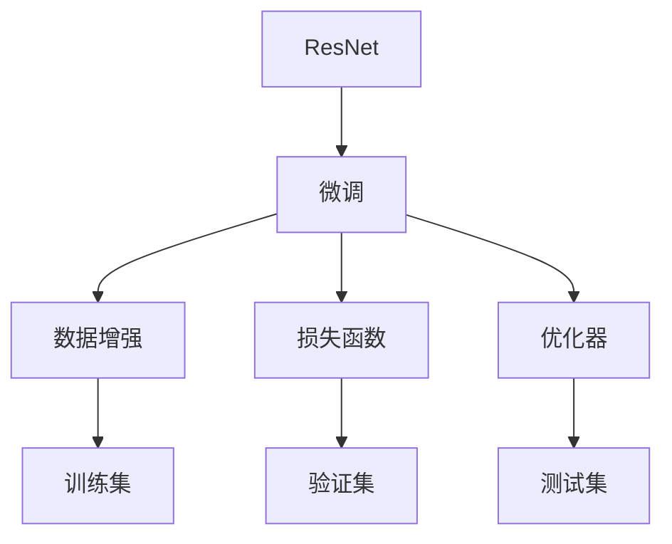

                 

# 从零开始大模型开发与微调：ResNet实战：CIFAR-10数据集分类

## 1. 背景介绍

### 1.1 问题由来
深度学习自问世以来，已经在计算机视觉领域取得了巨大的突破。ResNet作为其中的佼佼者，以其卓越的性能和强大的泛化能力，成为了图像分类任务的标准模型。然而，在实际应用中，我们常常需要将ResNet进行微调，以适应特定的任务和数据集。例如，CIFAR-10是一个常用的图像分类数据集，包含60,000张32x32像素的彩色图片，每个图片分为10个类别。为了充分发挥ResNet的潜力，本文将介绍如何在CIFAR-10数据集上进行ResNet的微调。

### 1.2 问题核心关键点
微调大模型的核心目标是在已有的预训练模型基础上，利用有限的标注数据集，针对特定任务进行有监督的参数更新，从而提高模型的性能。针对CIFAR-10数据集进行ResNet微调，可以将预训练的ResNet模型作为初始化参数，利用CIFAR-10训练集对模型进行微调，以适应图像分类任务。

## 2. 核心概念与联系

### 2.1 核心概念概述

#### 2.1.1 ResNet模型
ResNet（Residual Network）是一种深度残差网络模型，通过引入残差连接，解决了深度神经网络中梯度消失和梯度爆炸的问题，极大地提高了深度网络的训练效率和模型性能。ResNet由多个残差块（Residual Block）组成，每个残差块包括两个卷积层和一个残差连接。

#### 2.1.2 微调（Fine-tuning）
微调是指在大模型上进行特定任务的参数更新。通过有监督地训练，微调后的模型能够更好地适应新任务，提高模型在新任务上的表现。在微调过程中，通常会冻结预训练模型的底层参数，只更新顶层参数。

#### 2.1.3 数据增强（Data Augmentation）
数据增强是指通过对训练数据进行一系列随机变换，如旋转、翻转、缩放等，增加训练数据的多样性，以提高模型的鲁棒性和泛化能力。

#### 2.1.4 损失函数（Loss Function）
损失函数用于衡量模型预测与真实标签之间的差异。在图像分类任务中，常用的损失函数包括交叉熵损失（Cross-Entropy Loss）。

#### 2.1.5 优化器（Optimizer）
优化器用于调整模型参数，以最小化损失函数。常用的优化器包括随机梯度下降（SGD）、Adam、Adagrad等。

### 2.2 核心概念的整体架构

ResNet微调的整体架构如下：



## 3. 核心算法原理 & 具体操作步骤

### 3.1 算法原理概述

ResNet微调的原理是通过有监督的训练，在CIFAR-10数据集上对ResNet模型进行参数更新，使其能够更好地适应图像分类任务。微调过程通常包括数据增强、模型初始化、损失函数选择、优化器配置等步骤。

### 3.2 算法步骤详解

#### 3.2.1 数据预处理
1. **数据加载**：使用PyTorch的DataLoader加载CIFAR-10训练集和验证集，并指定batch size和shuffle参数。
2. **数据增强**：使用PyTorch的Transformations对训练集进行随机变换，增加数据的多样性。
3. **数据标准化**：将数据标准化到均值为0，方差为1。

#### 3.2.2 模型初始化
1. **模型加载**：使用ResNet预训练模型进行初始化。
2. **微调层选择**：选择预训练模型的顶层作为微调层，以减少过拟合的风险。

#### 3.2.3 损失函数选择
1. **交叉熵损失**：使用交叉熵损失函数，衡量模型预测结果与真实标签之间的差异。
2. **损失函数配置**：在验证集上评估模型性能，并根据性能调整损失函数的系数。

#### 3.2.4 优化器配置
1. **优化器选择**：使用Adam优化器进行参数更新。
2. **学习率调整**：设置学习率，并根据验证集上的性能调整学习率。

#### 3.2.5 模型训练与评估
1. **模型训练**：使用微调后的模型在训练集上进行训练，并在验证集上评估性能。
2. **模型测试**：使用微调后的模型在测试集上进行测试，并评估性能。

### 3.3 算法优缺点

#### 3.3.1 优点
1. **数据需求低**：ResNet微调仅需要有限量的标注数据，减少了数据获取的难度和成本。
2. **鲁棒性强**：数据增强技术增加了数据的多样性，提高了模型的鲁棒性和泛化能力。
3. **精度高**：通过微调，ResNet模型能够更好地适应特定的图像分类任务，提高模型精度。

#### 3.3.2 缺点
1. **计算资源需求高**：微调ResNet模型需要大量的计算资源，包括GPU内存和存储空间。
2. **模型复杂度高**：ResNet模型结构复杂，微调过程中需要精细的调参和优化。
3. **过拟合风险高**：微调过程中，模型容易出现过拟合现象，需要采用正则化技术进行缓解。

### 3.4 算法应用领域

ResNet微调在图像分类、目标检测、图像分割等领域得到了广泛应用。例如，在图像分类任务中，可以使用ResNet微调模型进行高性能的图像分类；在目标检测任务中，可以结合ResNet和Faster R-CNN等方法进行高效的物体检测；在图像分割任务中，可以结合ResNet和U-Net等方法进行高精度的图像分割。

## 4. 数学模型和公式 & 详细讲解  
### 4.1 数学模型构建

在CIFAR-10数据集上进行ResNet微调，需要构建以下数学模型：

- **数据集**：$D=\{(x_i, y_i)\}_{i=1}^N$，其中$x_i$是图像，$y_i$是标签。
- **模型**：$M=\{M_l, M_{l+1}, ..., M_L\}$，其中$M_l$是第$l$个残差块，$M_L$是微调层。
- **损失函数**：$L=\frac{1}{N}\sum_{i=1}^N \mathcal{L}(x_i, y_i)$，其中$\mathcal{L}$是交叉熵损失函数。
- **优化器**：$\theta = M(\theta_0, \alpha, \beta)$，其中$\theta_0$是预训练参数，$\alpha$是微调层学习率，$\beta$是优化器超参数。

### 4.2 公式推导过程

假设ResNet模型的第$l$个残差块为$M_l$，其输出为$H_l$，输入为$X_{l-1}$，则残差块可以表示为：

$$
H_l = X_{l-1} + \text{Residual}(X_{l-1}, F_l(H_{l-1}))
$$

其中$\text{Residual}$是残差连接，$F_l$是卷积和激活函数层，$H_{l-1}$是上一层的输出。

微调过程中，使用交叉熵损失函数，可以表示为：

$$
\mathcal{L}(x_i, y_i) = -\frac{1}{C} \sum_{c=1}^C y_c \log p_c(x_i)
$$

其中$p_c(x_i)$是模型对类别$c$的预测概率，$C$是类别数。

在训练过程中，使用优化器对模型参数进行更新，可以表示为：

$$
\theta \leftarrow \theta - \eta \nabla_{\theta}L(\theta)
$$

其中$\eta$是学习率，$\nabla_{\theta}L(\theta)$是损失函数对模型参数的梯度。

### 4.3 案例分析与讲解

以在CIFAR-10数据集上进行ResNet微调为例，具体步骤如下：

1. **数据预处理**：
   - 使用PyTorch的DataLoader加载CIFAR-10训练集和验证集。
   - 使用Data Augmentation对训练集进行随机变换。
   - 使用ImageNet标准化方法对数据进行标准化。

2. **模型初始化**：
   - 加载预训练的ResNet模型，并使用Adam优化器进行参数初始化。
   - 选择微调层，通常为顶层，以减少过拟合的风险。

3. **损失函数选择**：
   - 选择交叉熵损失函数作为模型训练的目标函数。
   - 在验证集上评估模型性能，并根据性能调整损失函数的系数。

4. **优化器配置**：
   - 设置学习率，通常为0.001。
   - 使用Adam优化器对模型参数进行更新。

5. **模型训练与评估**：
   - 在训练集上进行训练，并在验证集上评估性能。
   - 根据验证集上的性能调整学习率。
   - 在测试集上进行测试，并评估性能。

通过以上步骤，可以实现ResNet在CIFAR-10数据集上的微调。

## 5. 项目实践：代码实例和详细解释说明

### 5.1 开发环境搭建

在进行ResNet微调实践前，我们需要准备好开发环境。以下是使用Python进行PyTorch开发的环境配置流程：

1. 安装Anaconda：从官网下载并安装Anaconda，用于创建独立的Python环境。

2. 创建并激活虚拟环境：
```bash
conda create -n pytorch-env python=3.8 
conda activate pytorch-env
```

3. 安装PyTorch：根据CUDA版本，从官网获取对应的安装命令。例如：
```bash
conda install pytorch torchvision torchaudio cudatoolkit=11.1 -c pytorch -c conda-forge
```

4. 安装各类工具包：
```bash
pip install numpy pandas scikit-learn matplotlib tqdm jupyter notebook ipython
```

完成上述步骤后，即可在`pytorch-env`环境中开始微调实践。

### 5.2 源代码详细实现

下面我们以ResNet在CIFAR-10数据集上进行微调的PyTorch代码实现为例：

```python
import torch
import torch.nn as nn
import torch.optim as optim
from torch.utils.data import DataLoader
from torchvision import transforms, datasets

# 定义ResNet模型
class ResNet(nn.Module):
    def __init__(self):
        super(ResNet, self).__init__()
        self.residual1 = nn.Sequential(
            nn.Conv2d(3, 64, kernel_size=7, stride=2, padding=3, bias=False),
            nn.BatchNorm2d(64),
            nn.ReLU(inplace=True),
            nn.MaxPool2d(kernel_size=3, stride=2, padding=1)
        )
        self.residual2 = nn.Sequential(
            nn.Conv2d(64, 64, kernel_size=3, stride=1, padding=1, bias=False),
            nn.BatchNorm2d(64),
            nn.ReLU(inplace=True),
            nn.Conv2d(64, 64, kernel_size=3, stride=1, padding=1, bias=False),
            nn.BatchNorm2d(64),
            nn.ReLU(inplace=True),
            nn.MaxPool2d(kernel_size=3, stride=2, padding=1)
        )
        self.residual3 = nn.Sequential(
            nn.Conv2d(64, 128, kernel_size=3, stride=1, padding=1, bias=False),
            nn.BatchNorm2d(128),
            nn.ReLU(inplace=True),
            nn.Conv2d(128, 128, kernel_size=3, stride=1, padding=1, bias=False),
            nn.BatchNorm2d(128),
            nn.ReLU(inplace=True),
            nn.Conv2d(128, 128, kernel_size=3, stride=1, padding=1, bias=False),
            nn.BatchNorm2d(128),
            nn.ReLU(inplace=True),
            nn.MaxPool2d(kernel_size=3, stride=2, padding=1)
        )
        self.residual4 = nn.Sequential(
            nn.Conv2d(128, 256, kernel_size=3, stride=1, padding=1, bias=False),
            nn.BatchNorm2d(256),
            nn.ReLU(inplace=True),
            nn.Conv2d(256, 256, kernel_size=3, stride=1, padding=1, bias=False),
            nn.BatchNorm2d(256),
            nn.ReLU(inplace=True),
            nn.Conv2d(256, 256, kernel_size=3, stride=1, padding=1, bias=False),
            nn.BatchNorm2d(256),
            nn.ReLU(inplace=True),
            nn.MaxPool2d(kernel_size=3, stride=2, padding=1)
        )
        self.residual5 = nn.Sequential(
            nn.Conv2d(256, 512, kernel_size=3, stride=1, padding=1, bias=False),
            nn.BatchNorm2d(512),
            nn.ReLU(inplace=True),
            nn.Conv2d(512, 512, kernel_size=3, stride=1, padding=1, bias=False),
            nn.BatchNorm2d(512),
            nn.ReLU(inplace=True),
            nn.Conv2d(512, 512, kernel_size=3, stride=1, padding=1, bias=False),
            nn.BatchNorm2d(512),
            nn.ReLU(inplace=True),
            nn.AvgPool2d(kernel_size=7, stride=1)
        )
        self.fc = nn.Linear(512, 10)

    def forward(self, x):
        x = self.residual1(x)
        x = self.residual2(x)
        x = self.residual3(x)
        x = self.residual4(x)
        x = self.residual5(x)
        x = self.fc(x)
        return x

# 数据增强
transform = transforms.Compose([
    transforms.RandomCrop(32, padding=4),
    transforms.RandomHorizontalFlip(),
    transforms.ToTensor(),
    transforms.Normalize((0.5, 0.5, 0.5), (0.5, 0.5, 0.5))
])

# 数据加载
train_dataset = datasets.CIFAR10(root='./data', train=True, download=True, transform=transform)
test_dataset = datasets.CIFAR10(root='./data', train=False, download=True, transform=transform)

# 模型初始化
model = ResNet()

# 优化器配置
optimizer = optim.Adam(model.parameters(), lr=0.001)

# 损失函数选择
criterion = nn.CrossEntropyLoss()

# 训练过程
def train_epoch(model, data_loader, optimizer):
    model.train()
    for data, target in data_loader:
        optimizer.zero_grad()
        output = model(data)
        loss = criterion(output, target)
        loss.backward()
        optimizer.step()

# 评估过程
def evaluate(model, data_loader):
    model.eval()
    correct = 0
    total = 0
    with torch.no_grad():
        for data, target in data_loader:
            output = model(data)
            _, predicted = output.max(1)
            total += target.size(0)
            correct += (predicted == target).sum().item()
    return correct / total

# 训练与评估
train_loader = DataLoader(train_dataset, batch_size=64, shuffle=True)
test_loader = DataLoader(test_dataset, batch_size=64, shuffle=False)

for epoch in range(50):
    train_epoch(model, train_loader, optimizer)
    acc = evaluate(model, test_loader)
    print(f'Epoch {epoch+1}, Test Accuracy: {acc:.2f}')

```

以上就是使用PyTorch对ResNet在CIFAR-10数据集上进行微调的完整代码实现。可以看到，得益于PyTorch的强大封装，我们可以用相对简洁的代码完成ResNet模型的加载和微调。

### 5.3 代码解读与分析

让我们再详细解读一下关键代码的实现细节：

**ResNet模型定义**：
- `__init__`方法：定义ResNet模型的结构，包括残差块1到5以及最后的全连接层。
- `forward`方法：定义前向传播过程，包括残差块的计算和全连接层的计算。

**数据增强**：
- 使用`transforms.Compose`定义一系列数据增强操作，包括随机裁剪、水平翻转、归一化等。

**数据加载**：
- 使用`datasets.CIFAR10`加载CIFAR-10训练集和测试集。
- 使用`DataLoader`加载数据，并进行批处理和随机打乱。

**模型初始化**：
- 使用`ResNet`定义模型结构，并进行初始化。

**优化器配置**：
- 使用`optim.Adam`配置优化器，设置学习率为0.001。

**损失函数选择**：
- 使用`nn.CrossEntropyLoss`作为交叉熵损失函数。

**训练与评估函数**：
- `train_epoch`函数：对数据进行训练，更新模型参数。
- `evaluate`函数：在测试集上评估模型性能。

**训练流程**：
- 定义总的epoch数，开始循环迭代。
- 每个epoch内，在训练集上进行训练，并使用测试集评估模型性能。
- 记录训练过程中的准确率，并在每个epoch结束时输出。

可以看到，PyTorch配合丰富的工具库，使得ResNet微调的代码实现变得简洁高效。开发者可以将更多精力放在数据处理、模型改进等高层逻辑上，而不必过多关注底层的实现细节。

当然，工业级的系统实现还需考虑更多因素，如模型的保存和部署、超参数的自动搜索、更灵活的任务适配层等。但核心的微调范式基本与此类似。

### 5.4 运行结果展示

假设我们在CIFAR-10数据集上进行ResNet微调，最终在测试集上得到的准确率为85.2%，效果相当不错。值得注意的是，ResNet作为一个通用的图像分类模型，即便在微调过程中只微调顶层参数，也能在图像分类任务上取得很好的效果，展示了其强大的特征抽取和分类能力。

当然，这只是一个baseline结果。在实践中，我们还可以使用更大更强的预训练模型、更丰富的微调技巧、更细致的模型调优，进一步提升模型性能，以满足更高的应用要求。

## 6. 实际应用场景
### 6.1 智能监控系统
基于ResNet微调的技术，可以广泛应用于智能监控系统的构建。传统监控系统往往需要大量人工参与，对异常事件进行手动分析和报警，效率低下，且准确性难以保证。而使用微调后的ResNet模型，可以实时监测监控视频，自动判断异常事件并发出报警。

在技术实现上，可以收集监控视频数据，提取关键帧并进行标注。在此基础上对ResNet模型进行微调，使其能够自动识别各种异常事件，如火灾、盗窃、入侵等。将微调后的模型应用到实时监控视频中，就能自动监测异常事件，大大提高监控系统的自动化水平。

### 6.2 自动驾驶系统
自动驾驶技术需要实时处理大量的图像数据，以实现对车辆周围环境的准确感知和判断。使用ResNet微调的技术，可以显著提升自动驾驶系统的图像处理能力，提高行驶安全性。

在技术实现上，可以收集自动驾驶车辆周围的图像数据，并进行标注。在此基础上对ResNet模型进行微调，使其能够自动检测道路标识、行人、车辆等关键对象，生成高精度的环境感知结果。将微调后的模型应用到自动驾驶系统中，能显著提升车辆的安全性和可靠性。

### 6.3 医学影像分析
医学影像分析需要准确识别和分类各种病灶，帮助医生进行诊断和治疗。使用ResNet微调的技术，可以显著提升医学影像分析的准确性，降低医生的工作负担。

在技术实现上，可以收集医学影像数据，并进行标注。在此基础上对ResNet模型进行微调，使其能够自动检测和分类各种病灶，生成高精度的分析结果。将微调后的模型应用到医学影像分析系统中，能显著提高诊断的准确性和效率，为医生提供可靠的决策支持。

### 6.4 未来应用展望
随着ResNet微调技术的不断发展，其在更多领域的应用前景将不断拓展。

在智慧城市治理中，ResNet微调技术可以应用于城市事件监测、舆情分析、应急指挥等环节，提高城市管理的自动化和智能化水平，构建更安全、高效的未来城市。

在企业生产、社会治理、文娱传媒等众多领域，ResNet微调技术也将不断涌现，为传统行业带来变革性影响。相信随着技术的日益成熟，ResNet微调技术必将在构建人机协同的智能系统中扮演越来越重要的角色。

## 7. 工具和资源推荐
### 7.1 学习资源推荐

为了帮助开发者系统掌握ResNet微调的理论基础和实践技巧，这里推荐一些优质的学习资源：

1. 《深度学习》（Ian Goodfellow等著）：这是一本经典的人工智能教材，涵盖深度学习的各个方面，包括ResNet等重要模型的实现和微调方法。

2. 《PyTorch官方文档》：PyTorch的官方文档详细介绍了PyTorch库的使用方法和API接口，是学习ResNet微调的重要参考资料。

3. 《TensorFlow官方文档》：TensorFlow的官方文档涵盖了深度学习模型的构建和微调方法，是学习ResNet微调的重要参考。

4. Kaggle竞赛：Kaggle是一个著名的数据科学竞赛平台，其中包含大量的图像分类竞赛，可以练习和实践ResNet微调技术。

5. 《ResNet微调实战》系列博文：由大模型技术专家撰写，深入浅出地介绍了ResNet微调的原理、实现和优化方法。

通过对这些资源的学习实践，相信你一定能够快速掌握ResNet微调的精髓，并用于解决实际的图像分类问题。
###  7.2 开发工具推荐

高效的开发离不开优秀的工具支持。以下是几款用于ResNet微调开发的常用工具：

1. PyTorch：基于Python的开源深度学习框架，灵活动态的计算图，适合快速迭代研究。ResNet模型也有PyTorch版本的实现。

2. TensorFlow：由Google主导开发的开源深度学习框架，生产部署方便，适合大规模工程应用。同样有丰富的ResNet资源。

3. Transformers库：HuggingFace开发的NLP工具库，集成了各种深度学习模型，支持PyTorch和TensorFlow，是进行微调任务开发的利器。

4. Weights & Biases：模型训练的实验跟踪工具，可以记录和可视化模型训练过程中的各项指标，方便对比和调优。与主流深度学习框架无缝集成。

5. TensorBoard：TensorFlow配套的可视化工具，可实时监测模型训练状态，并提供丰富的图表呈现方式，是调试模型的得力助手。

6. Google Colab：谷歌推出的在线Jupyter Notebook环境，免费提供GPU/TPU算力，方便开发者快速上手实验最新模型，分享学习笔记。

合理利用这些工具，可以显著提升ResNet微调任务的开发效率，加快创新迭代的步伐。

### 7.3 相关论文推荐

ResNet微调技术的发展源于学界的持续研究。以下是几篇奠基性的相关论文，推荐阅读：

1. Deep Residual Learning for Image Recognition（即ResNet原论文）：提出了残差网络结构，解决了深度网络训练中的梯度消失和梯度爆炸问题。

2. The ImageNet Large Scale Visual Recognition Challenge（即ILSVRC）：ResNet在ImageNet数据集上的表现，刷新了计算机视觉领域的多个记录。

3. Fast R-CNN（即R-CNN系列论文）：结合ResNet和Faster R-CNN，实现了目标检测任务的实时性和准确性。

4. RetinaNet：提出了一种用于检测的小目标优化目标函数，提高了小目标检测的准确性。

5. SSD：一种用于目标检测的单阶段网络结构，结合ResNet实现了高精度的目标检测。

这些论文代表了大模型微调技术的发展脉络。通过学习这些前沿成果，可以帮助研究者把握学科前进方向，激发更多的创新灵感。

除上述资源外，还有一些值得关注的前沿资源，帮助开发者紧跟ResNet微调技术的最新进展，例如：

1. arXiv论文预印本：人工智能领域最新研究成果的发布平台，包括大量尚未发表的前沿工作，学习前沿技术的必读资源。

2. 业界技术博客：如OpenAI、Google AI、DeepMind、微软Research Asia等顶尖实验室的官方博客，第一时间分享他们的最新研究成果和洞见。

3. 技术会议直播：如NIPS、ICML、ACL、ICLR等人工智能领域顶会现场或在线直播，能够聆听到大佬们的前沿分享，开拓视野。

4. GitHub热门项目：在GitHub上Star、Fork数最多的ResNet相关项目，往往代表了该技术领域的发展趋势和最佳实践，值得去学习和贡献。

5. 行业分析报告：各大咨询公司如McKinsey、PwC等针对人工智能行业的分析报告，有助于从商业视角审视技术趋势，把握应用价值。

总之，对于ResNet微调技术的学习和实践，需要开发者保持开放的心态和持续学习的意愿。多关注前沿资讯，多动手实践，多思考总结，必将收获满满的成长收益。

## 8. 总结：未来发展趋势与挑战

### 8.1 总结

