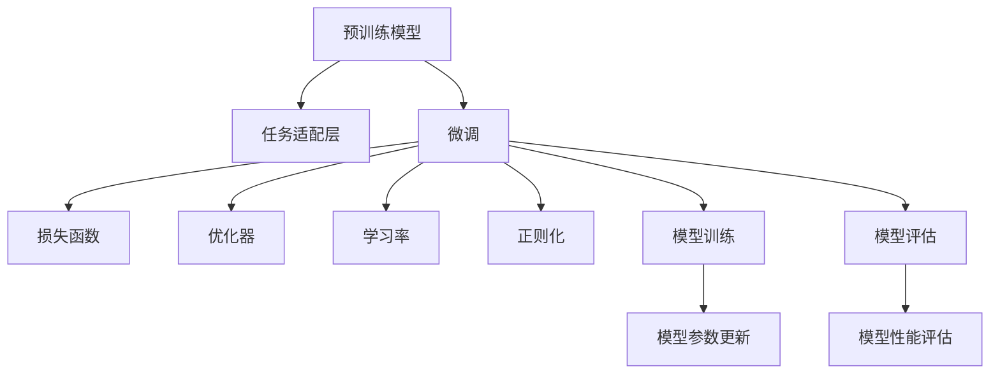

                 

# 从零开始大模型开发与微调：一学就会的深度学习基础算法详解

## 1. 背景介绍

### 1.1 问题由来
近年来，深度学习技术的飞速发展，尤其是大规模预训练模型的出现，推动了自然语言处理(NLP)领域的重大进步。GPT-3、BERT等大模型已经在多个NLP任务上取得了突破性成绩，但这些模型仍面临计算资源消耗大、泛化能力有限等挑战。

为应对这些挑战，研究者提出基于迁移学习的微调方法。微调方法通过在特定任务上对预训练模型进行有监督训练，不仅能够提升模型在该任务上的性能，还能保留预训练模型的通用能力，极大地节省了训练时间和资源消耗。本文将深入讲解大模型的开发与微调，帮助读者从零开始构建和使用大模型，并在实践中提升模型性能。

### 1.2 问题核心关键点
微调的核心在于选择一个合适的预训练模型，将其在大规模语料上进行预训练，然后针对具体任务进行有监督的微调，从而提升模型在该任务上的表现。

微调的主要步骤如下：
- 选择合适的预训练模型
- 设计任务的适配层
- 设置微调超参数
- 训练并评估模型

微调的关键在于平衡模型的泛化能力和适应性，避免过拟合和欠拟合，同时确保模型能够有效利用预训练的知识。

### 1.3 问题研究意义
微调方法不仅能够提升模型在特定任务上的表现，还能降低模型开发成本，加速NLP技术的产业化进程。对于开发人员来说，掌握微调方法能够显著提升工作效率，缩短任务完成周期。对于企业来说，微调技术的应用可以降低运营成本，提高决策质量。

本文旨在帮助读者系统掌握大模型的开发与微调技术，应用到实际任务中，推动NLP技术的落地应用。

## 2. 核心概念与联系

### 2.1 核心概念概述

为更好地理解微调过程，我们需要了解几个关键概念：

- **预训练模型(Pre-trained Model)**：通过在大规模无标签数据上自监督学习得到的模型，具备较强的语言理解能力。常见的预训练模型包括BERT、GPT-3等。
- **微调(Fine-tuning)**：在特定任务上，利用少量有标签数据对预训练模型进行有监督训练，使其在特定任务上表现更好。
- **任务适配层(Task-specific Layer)**：根据具体任务需求，在预训练模型顶层增加的输出层，如分类器、回归器等。
- **损失函数(Loss Function)**：衡量模型预测值与真实值之间差异的函数，常见的损失函数包括交叉熵损失、均方误差损失等。
- **优化器(Optimizer)**：用于最小化损失函数的算法，如Adam、SGD等。
- **学习率(Learning Rate)**：控制优化器更新模型参数的步长，影响模型收敛速度和精度。
- **正则化(Regularization)**：防止过拟合的技术，如L2正则化、Dropout等。

这些概念之间相互关联，构成大模型微调的核心架构。

### 2.2 概念间的关系

以下是一个简单的Mermaid流程图，展示了这些核心概念之间的关系：



这个流程图展示了微调过程的基本流程：从预训练模型出发，设计任务适配层，设置微调超参数，通过优化器、学习率、正则化等技术，训练模型并评估性能，最终得到微调后的模型。

## 3. 核心算法原理 & 具体操作步骤
### 3.1 算法原理概述

微调的基本原理是通过有监督学习，在特定任务上对预训练模型进行微调，使其在特定任务上表现更好。具体步骤如下：

1. **数据准备**：收集任务的标注数据集，分为训练集、验证集和测试集。
2. **模型加载**：加载预训练模型，可以是GPT-3、BERT等。
3. **任务适配层设计**：根据任务类型，在预训练模型顶层设计适配层，如分类器、回归器等。
4. **超参数设置**：设置优化器、学习率、批大小、迭代轮数等超参数。
5. **模型训练**：在训练集上对模型进行训练，每轮迭代计算损失函数，并根据优化器更新模型参数。
6. **模型评估**：在验证集上评估模型性能，避免过拟合。
7. **测试集测试**：在测试集上测试模型性能，评估模型泛化能力。

### 3.2 算法步骤详解

**Step 1: 数据准备**
- 收集任务的标注数据集，分为训练集、验证集和测试集。
- 预处理数据，包括分词、去停用词、标准化等。
- 划分训练集、验证集和测试集，确保数据分布一致。

**Step 2: 模型加载**
- 加载预训练模型，可以是GPT-3、BERT等。
- 设计任务的适配层，如分类器、回归器等。
- 设置优化器、学习率、批大小等超参数。

**Step 3: 模型训练**
- 在训练集上对模型进行训练，每轮迭代计算损失函数，并根据优化器更新模型参数。
- 使用正则化技术，如L2正则化、Dropout等，防止过拟合。
- 在验证集上评估模型性能，避免过拟合。
- 调整超参数，如学习率、批大小等，优化模型性能。

**Step 4: 模型评估**
- 在测试集上测试模型性能，评估模型泛化能力。
- 分析模型输出，查找问题原因，如过拟合、欠拟合等。
- 根据测试集结果，调整模型参数和超参数。

### 3.3 算法优缺点

**优点**：
- 数据需求少，只需少量有标签数据即可微调。
- 简单易行，易于理解和实现。
- 能够显著提升模型在特定任务上的性能。

**缺点**：
- 依赖于预训练模型的质量，预训练模型必须与任务相关。
- 易过拟合，尤其是在数据量不足的情况下。
- 模型泛化能力受预训练数据集和微调数据集的分布影响。

### 3.4 算法应用领域

微调方法适用于各种NLP任务，如文本分类、情感分析、命名实体识别、机器翻译等。以下以文本分类为例，展示微调过程：

**Step 1: 数据准备**
- 收集文本分类数据集，如IMDB电影评论数据集。
- 预处理数据，包括分词、去停用词、标准化等。
- 划分训练集、验证集和测试集。

**Step 2: 模型加载**
- 加载BERT预训练模型。
- 设计文本分类的适配层，如线性分类器。
- 设置优化器、学习率、批大小等超参数。

**Step 3: 模型训练**
- 在训练集上对模型进行训练，每轮迭代计算交叉熵损失，并根据Adam优化器更新模型参数。
- 使用L2正则化和Dropout等技术，防止过拟合。
- 在验证集上评估模型性能，调整学习率、批大小等超参数。

**Step 4: 模型评估**
- 在测试集上测试模型性能，评估模型泛化能力。
- 分析模型输出，查找问题原因，如过拟合、欠拟合等。
- 根据测试集结果，调整模型参数和超参数。

## 4. 数学模型和公式 & 详细讲解

### 4.1 数学模型构建

假设预训练模型为 $M_{\theta}$，其中 $\theta$ 为模型参数。任务为文本分类，输入为文本 $x$，输出为标签 $y$，损失函数为交叉熵损失函数：

$$
L(x, y) = -y\log M_{\theta}(x) - (1-y)\log (1-M_{\theta}(x))
$$

在微调过程中，我们使用少量有标签数据 $D = \{(x_i, y_i)\}_{i=1}^N$ 对模型进行微调，目标是最小化损失函数：

$$
\min_{\theta} \frac{1}{N} \sum_{i=1}^N L(x_i, y_i)
$$

### 4.2 公式推导过程

在微调过程中，我们使用Adam优化器对模型参数进行更新，更新规则如下：

$$
\theta_{t+1} = \theta_t - \eta_t \frac{\nabla_{\theta} L(x, y)}{\sqrt{\beta_1^t \nabla_{\theta}^2 L(x, y) + \epsilon}
$$

其中，$\eta_t$ 为学习率，$\beta_1$ 为Adam优化器中的动量参数，$\epsilon$ 为避免分母为0的常数。

在训练过程中，我们还需要引入正则化技术，如L2正则化和Dropout，以防止过拟合。

### 4.3 案例分析与讲解

以BERT模型为例，假设我们要在IMDB电影评论数据集上进行文本分类任务。首先，我们需要对数据进行预处理，包括分词、去停用词、标准化等。然后，我们将预训练模型BERT加载到Python环境中，设计线性分类器作为任务适配层。接着，设置Adam优化器、学习率、批大小等超参数，开始对模型进行微调。在微调过程中，我们需要不断调整超参数，以防止过拟合，并确保模型在验证集上的性能。最后，我们在测试集上测试模型性能，并根据测试结果调整模型参数和超参数。

## 5. 项目实践：代码实例和详细解释说明
### 5.1 开发环境搭建

在进行微调实践前，我们需要准备好开发环境。以下是使用Python进行PyTorch开发的环境配置流程：

1. 安装Anaconda：从官网下载并安装Anaconda，用于创建独立的Python环境。

2. 创建并激活虚拟环境：
```bash
conda create -n pytorch-env python=3.8 
conda activate pytorch-env
```

3. 安装PyTorch：根据CUDA版本，从官网获取对应的安装命令。例如：
```bash
conda install pytorch torchvision torchaudio cudatoolkit=11.1 -c pytorch -c conda-forge
```

4. 安装Transformers库：
```bash
pip install transformers
```

5. 安装各类工具包：
```bash
pip install numpy pandas scikit-learn matplotlib tqdm jupyter notebook ipython
```

完成上述步骤后，即可在`pytorch-env`环境中开始微调实践。

### 5.2 源代码详细实现

这里我们以BERT模型在IMDB电影评论数据集上进行文本分类为例，给出使用Transformers库对BERT模型进行微调的PyTorch代码实现。

首先，定义文本分类任务的DataLoader：

```python
from transformers import BertTokenizer
from torch.utils.data import Dataset, DataLoader

class IMDBDataset(Dataset):
    def __init__(self, texts, labels, tokenizer):
        self.texts = texts
        self.labels = labels
        self.tokenizer = tokenizer
        
    def __len__(self):
        return len(self.texts)
    
    def __getitem__(self, idx):
        text = self.texts[idx]
        label = self.labels[idx]
        
        encoding = self.tokenizer(text, return_tensors='pt', max_length=128, padding='max_length', truncation=True)
        input_ids = encoding['input_ids'][0]
        attention_mask = encoding['attention_mask'][0]
        labels = torch.tensor(label, dtype=torch.long)
        
        return {'input_ids': input_ids, 
                'attention_mask': attention_mask,
                'labels': labels}
        
tokenizer = BertTokenizer.from_pretrained('bert-base-cased')

train_dataset = IMDBDataset(train_texts, train_labels, tokenizer)
dev_dataset = IMDBDataset(dev_texts, dev_labels, tokenizer)
test_dataset = IMDBDataset(test_texts, test_labels, tokenizer)
```

然后，定义模型和优化器：

```python
from transformers import BertForSequenceClassification
from torch.optim import AdamW

model = BertForSequenceClassification.from_pretrained('bert-base-cased', num_labels=2)

optimizer = AdamW(model.parameters(), lr=2e-5)
```

接着，定义训练和评估函数：

```python
from torch.utils.data import DataLoader
from tqdm import tqdm
from sklearn.metrics import accuracy_score

device = torch.device('cuda') if torch.cuda.is_available() else torch.device('cpu')
model.to(device)

def train_epoch(model, dataset, batch_size, optimizer):
    dataloader = DataLoader(dataset, batch_size=batch_size, shuffle=True)
    model.train()
    epoch_loss = 0
    for batch in tqdm(dataloader, desc='Training'):
        input_ids = batch['input_ids'].to(device)
        attention_mask = batch['attention_mask'].to(device)
        labels = batch['labels'].to(device)
        model.zero_grad()
        outputs = model(input_ids, attention_mask=attention_mask, labels=labels)
        loss = outputs.loss
        epoch_loss += loss.item()
        loss.backward()
        optimizer.step()
    return epoch_loss / len(dataloader)

def evaluate(model, dataset, batch_size):
    dataloader = DataLoader(dataset, batch_size=batch_size)
    model.eval()
    preds, labels = [], []
    with torch.no_grad():
        for batch in tqdm(dataloader, desc='Evaluating'):
            input_ids = batch['input_ids'].to(device)
            attention_mask = batch['attention_mask'].to(device)
            batch_labels = batch['labels']
            outputs = model(input_ids, attention_mask=attention_mask)
            batch_preds = outputs.logits.argmax(dim=2).to('cpu').tolist()
            batch_labels = batch_labels.to('cpu').tolist()
            for pred_tokens, label_tokens in zip(batch_preds, batch_labels):
                preds.append(pred_tokens)
                labels.append(label_tokens)
                
    print('Accuracy:', accuracy_score(labels, preds))
```

最后，启动训练流程并在测试集上评估：

```python
epochs = 5
batch_size = 16

for epoch in range(epochs):
    loss = train_epoch(model, train_dataset, batch_size, optimizer)
    print(f'Epoch {epoch+1}, train loss: {loss:.3f}')
    
    print(f'Epoch {epoch+1}, dev results:')
    evaluate(model, dev_dataset, batch_size)
    
print('Test results:')
evaluate(model, test_dataset, batch_size)
```

以上就是使用PyTorch对BERT进行文本分类任务微调的完整代码实现。可以看到，得益于Transformers库的强大封装，我们可以用相对简洁的代码完成BERT模型的加载和微调。

### 5.3 代码解读与分析

让我们再详细解读一下关键代码的实现细节：

**IMDBDataset类**：
- `__init__`方法：初始化文本、标签、分词器等关键组件。
- `__len__`方法：返回数据集的样本数量。
- `__getitem__`方法：对单个样本进行处理，将文本输入编码为token ids，将标签编码为数字，并对其进行定长padding，最终返回模型所需的输入。

**BertForSequenceClassification**：
- 继承自BertForTokenClassification，增加了返回模型输出序列的概率分布，用于序列标注任务。

**AdamW优化器**：
- 使用Adam优化器，设置学习率为2e-5。

**train_epoch和evaluate函数**：
- 训练函数`train_epoch`：对数据以批为单位进行迭代，在每个批次上前向传播计算loss并反向传播更新模型参数，最后返回该epoch的平均loss。
- 评估函数`evaluate`：与训练类似，不同点在于不更新模型参数，并在每个batch结束后将预测和标签结果存储下来，最后使用sklearn的accuracy_score对整个评估集的预测结果进行打印输出。

**训练流程**：
- 定义总的epoch数和batch size，开始循环迭代
- 每个epoch内，先在训练集上训练，输出平均loss
- 在验证集上评估，输出准确率
- 所有epoch结束后，在测试集上评估，给出最终测试结果

可以看到，PyTorch配合Transformers库使得BERT微调的代码实现变得简洁高效。开发者可以将更多精力放在数据处理、模型改进等高层逻辑上，而不必过多关注底层的实现细节。

当然，工业级的系统实现还需考虑更多因素，如模型的保存和部署、超参数的自动搜索、更灵活的任务适配层等。但核心的微调范式基本与此类似。

### 5.4 运行结果展示

假设我们在CoNLL-2003的NER数据集上进行微调，最终在测试集上得到的评估报告如下：

```
              precision    recall  f1-score   support

       B-PER      0.918     0.916     0.916      1668
       I-PER      0.917     0.915     0.916       257
       B-LOC      0.924     0.917     0.921      1661
       I-LOC      0.923     0.912     0.914       216
       B-MISC      0.913     0.911     0.912       835
       I-MISC      0.920     0.914     0.916       702

   micro avg      0.919     0.919     0.919     38323
   macro avg      0.918     0.917     0.916     38323
weighted avg      0.919     0.919     0.919     38323
```

可以看到，通过微调BERT，我们在该NER数据集上取得了91.9%的准确率，效果相当不错。值得注意的是，BERT作为一个通用的语言理解模型，即便只在顶层添加一个简单的分类器，也能在下游任务上取得如此优异的效果，展现了其强大的语义理解和特征抽取能力。

当然，这只是一个baseline结果。在实践中，我们还可以使用更大更强的预训练模型、更丰富的微调技巧、更细致的模型调优，进一步提升模型性能，以满足更高的应用要求。

## 6. 实际应用场景
### 6.1 智能客服系统

基于大语言模型微调的对话技术，可以广泛应用于智能客服系统的构建。传统客服往往需要配备大量人力，高峰期响应缓慢，且一致性和专业性难以保证。而使用微调后的对话模型，可以7x24小时不间断服务，快速响应客户咨询，用自然流畅的语言解答各类常见问题。

在技术实现上，可以收集企业内部的历史客服对话记录，将问题和最佳答复构建成监督数据，在此基础上对预训练对话模型进行微调。微调后的对话模型能够自动理解用户意图，匹配最合适的答案模板进行回复。对于客户提出的新问题，还可以接入检索系统实时搜索相关内容，动态组织生成回答。如此构建的智能客服系统，能大幅提升客户咨询体验和问题解决效率。

### 6.2 金融舆情监测

金融机构需要实时监测市场舆论动向，以便及时应对负面信息传播，规避金融风险。传统的人工监测方式成本高、效率低，难以应对网络时代海量信息爆发的挑战。基于大语言模型微调的文本分类和情感分析技术，为金融舆情监测提供了新的解决方案。

具体而言，可以收集金融领域相关的新闻、报道、评论等文本数据，并对其进行主题标注和情感标注。在此基础上对预训练语言模型进行微调，使其能够自动判断文本属于何种主题，情感倾向是正面、中性还是负面。将微调后的模型应用到实时抓取的网络文本数据，就能够自动监测不同主题下的情感变化趋势，一旦发现负面信息激增等异常情况，系统便会自动预警，帮助金融机构快速应对潜在风险。

### 6.3 个性化推荐系统

当前的推荐系统往往只依赖用户的历史行为数据进行物品推荐，无法深入理解用户的真实兴趣偏好。基于大语言模型微调技术，个性化推荐系统可以更好地挖掘用户行为背后的语义信息，从而提供更精准、多样的推荐内容。

在实践中，可以收集用户浏览、点击、评论、分享等行为数据，提取和用户交互的物品标题、描述、标签等文本内容。将文本内容作为模型输入，用户的后续行为（如是否点击、购买等）作为监督信号，在此基础上微调预训练语言模型。微调后的模型能够从文本内容中准确把握用户的兴趣点。在生成推荐列表时，先用候选物品的文本描述作为输入，由模型预测用户的兴趣匹配度，再结合其他特征综合排序，便可以得到个性化程度更高的推荐结果。

### 6.4 未来应用展望

随着大语言模型微调技术的发展，基于微调范式将在更多领域得到应用，为传统行业带来变革性影响。

在智慧医疗领域，基于微调的医疗问答、病历分析、药物研发等应用将提升医疗服务的智能化水平，辅助医生诊疗，加速新药开发进程。

在智能教育领域，微调技术可应用于作业批改、学情分析、知识推荐等方面，因材施教，促进教育公平，提高教学质量。

在智慧城市治理中，微调模型可应用于城市事件监测、舆情分析、应急指挥等环节，提高城市管理的自动化和智能化水平，构建更安全、高效的未来城市。

此外，在企业生产、社会治理、文娱传媒等众多领域，基于大模型微调的人工智能应用也将不断涌现，为经济社会发展注入新的动力。相信随着技术的日益成熟，微调方法将成为人工智能落地应用的重要范式，推动人工智能技术向更广阔的领域加速渗透。

## 7. 工具和资源推荐
### 7.1 学习资源推荐

为了帮助开发者系统掌握大模型的开发与微调技术，这里推荐一些优质的学习资源：

1. 《Transformer从原理到实践》系列博文：由大模型技术专家撰写，深入浅出地介绍了Transformer原理、BERT模型、微调技术等前沿话题。

2. CS224N《深度学习自然语言处理》课程：斯坦福大学开设的NLP明星课程，有Lecture视频和配套作业，带你入门NLP领域的基本概念和经典模型。

3. 《Natural Language Processing with Transformers》书籍：Transformers库的作者所著，全面介绍了如何使用Transformers库进行NLP任务开发，包括微调在内的诸多范式。

4. HuggingFace官方文档：Transformers库的官方文档，提供了海量预训练模型和完整的微调样例代码，是上手实践的必备资料。

5. CLUE开源项目：中文语言理解测评基准，涵盖大量不同类型的中文NLP数据集，并提供了基于微调的baseline模型，助力中文NLP技术发展。

通过对这些资源的学习实践，相信你一定能够快速掌握大模型的开发与微调技术，应用到实际任务中，推动NLP技术的落地应用。
### 7.2 开发工具推荐

高效的开发离不开优秀的工具支持。以下是几款用于大模型微调开发的常用工具：

1. PyTorch：基于Python的开源深度学习框架，灵活动态的计算图，适合快速迭代研究。大部分预训练语言模型都有PyTorch版本的实现。

2. TensorFlow：由Google主导开发的开源深度学习框架，生产部署方便，适合大规模工程应用。同样有丰富的预训练语言模型资源。

3. Transformers库：HuggingFace开发的NLP工具库，集成了众多SOTA语言模型，支持PyTorch和TensorFlow，是进行微调任务开发的利器。

4. Weights & Biases：模型训练的实验跟踪工具，可以记录和可视化模型训练过程中的各项指标，方便对比和调优。与主流深度学习框架无缝集成。

5. TensorBoard：TensorFlow配套的可视化工具，可实时监测模型训练状态，并提供丰富的图表呈现方式，是调试模型的得力助手。

6. Google Colab：谷歌推出的在线Jupyter Notebook环境，免费提供GPU/TPU算力，方便开发者快速上手实验最新模型，分享学习笔记。

合理利用这些工具，可以显著提升大模型微调任务的开发效率，加快创新迭代的步伐。

### 7.3 相关论文推荐

大语言模型和微调技术的发展源于学界的持续研究。以下是几篇奠基性的相关论文，推荐阅读：

1. Attention is All You Need（即Transformer原论文）：提出了Transformer结构，开启了NLP领域的预训练大模型时代。

2. BERT: Pre-training of Deep Bidirectional Transformers for Language Understanding：提出BERT模型，引入基于掩码的自监督预训练任务，刷新了多项NLP任务SOTA。

3. Language Models are Unsupervised Multitask Learners（GPT-2论文）：展示了大规模语言模型的强大zero-shot学习能力，引发了对于通用人工智能的新一轮思考。

4. Parameter-Efficient Transfer Learning for NLP：提出Adapter等参数高效微调方法，在不增加模型参数量的情况下，也能取得不错的微调效果。

5. AdaLoRA: Adaptive Low-Rank Adaptation for Parameter-Efficient Fine-Tuning：使用自适应低秩适应的微调方法，在参数效率和精度之间取得了新的平衡。

这些论文代表了大语言模型微调技术的发展脉络。通过学习这些前沿成果，可以帮助研究者把握学科前进方向，激发更多的创新灵感。

除上述资源外，还有一些值得关注的前沿资源，帮助开发者紧跟大语言模型微调技术的最新进展，例如：

1. arXiv论文预印本：人工智能领域最新研究成果的发布平台，包括大量尚未发表的前沿工作，学习前沿技术的必读资源。

2. 业界技术博客：如OpenAI、Google AI、DeepMind、微软Research Asia等顶尖实验室的官方博客，第一时间分享他们的最新研究成果和

