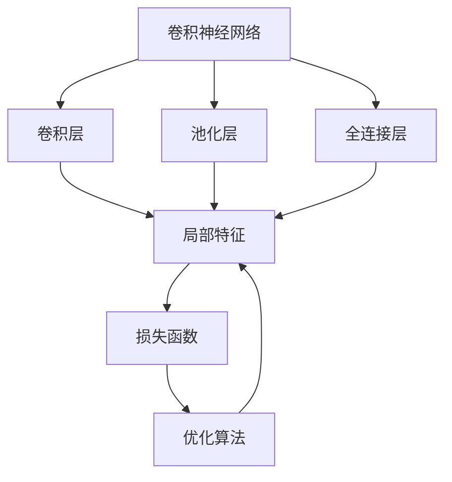
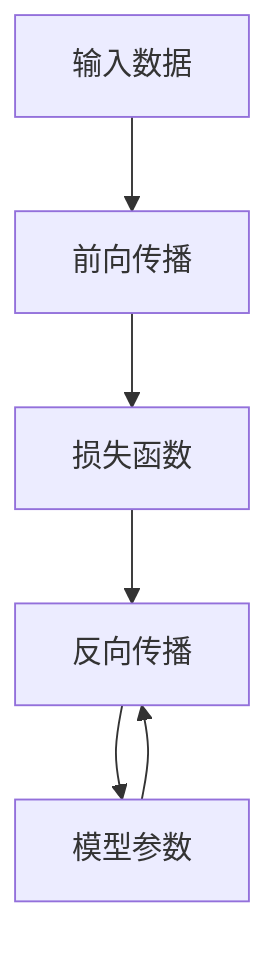
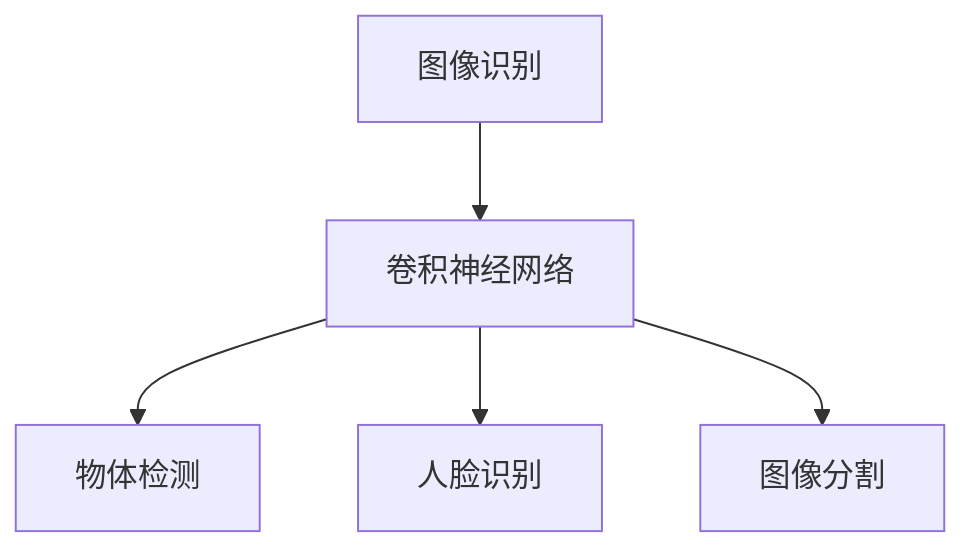
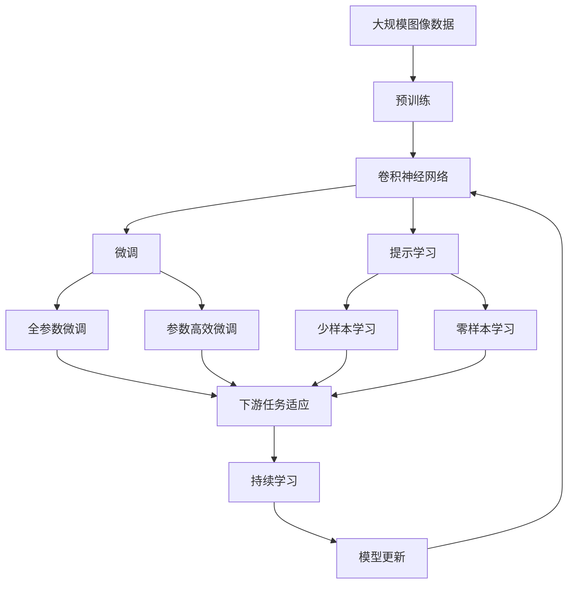

                 

# 从零开始大模型开发与微调：基于卷积的MNIST分类模型

> 关键词：卷积神经网络(CNN)、卷积层(Convolutional Layer)、池化层(Pooling Layer)、全连接层(Fully Connected Layer)、反向传播(Backpropagation)、梯度下降(Gradient Descent)、softmax函数、卷积神经网络(CNN)、微调(Fine-Tuning)

## 1. 背景介绍

### 1.1 问题由来
卷积神经网络(CNN)是深度学习中最具代表性的图像识别模型之一，广泛应用于计算机视觉、医学影像、自然语言处理等领域。以手写数字识别为例，CNN模型通过多层次卷积和池化操作提取图像特征，并通过全连接层进行分类。

传统的手写数字识别方法往往需要手动设计卷积核和池化核，难以实现高性能模型。而CNN模型通过自动学习卷积核和池化核，能够适应各种复杂的特征分布，从而大幅提升识别准确率。因此，CNN成为了手写数字识别的主流方法之一。

在实践中，我们往往需要根据具体应用场景，调整CNN模型的超参数、优化算法和损失函数，以获得最佳的识别效果。这种基于具体任务的微调过程，被称作模型的“细粒度迁移学习”，可以显著提升模型在特定任务上的性能。

## 2. 核心概念与联系

### 2.1 核心概念概述

为更好地理解基于卷积的MNIST分类模型，本节将介绍几个密切相关的核心概念：

- 卷积神经网络(CNN)：一种深度神经网络模型，通过多层次卷积和池化操作提取图像特征，并通过全连接层进行分类。
- 卷积层(Convolutional Layer)：CNN模型中的基本操作单元，通过滑动窗口的方式提取局部特征。
- 池化层(Pooling Layer)：用于降低特征图的维度，提高模型的泛化能力。
- 全连接层(Fully Connected Layer)：用于分类任务的输出层，将卷积层提取的特征进行映射，转化为最终分类结果。
- 反向传播(Backpropagation)：深度学习模型的优化算法，用于更新模型参数以最小化损失函数。
- 梯度下降(Gradient Descent)：一种常用的优化算法，通过迭代更新模型参数，逐步降低损失函数。
- softmax函数：用于多分类任务的概率分布计算，将模型输出转化为概率形式。

这些核心概念之间的逻辑关系可以通过以下Mermaid流程图来展示：



这个流程图展示了大模型微调的完整过程：

1. 卷积神经网络通过多层次卷积和池化操作提取图像特征。
2. 全连接层将卷积层提取的特征进行映射，转化为最终分类结果。
3. 损失函数用于衡量模型预测与真实标签之间的差异，通过反向传播和梯度下降算法进行优化。
4. 优化算法通过更新模型参数，逐步降低损失函数，获得更高的分类准确率。

### 2.2 概念间的关系

这些核心概念之间存在着紧密的联系，形成了CNN模型的核心生态系统。下面我们通过几个Mermaid流程图来展示这些概念之间的关系。

#### 2.2.1 卷积神经网络的核心组件


这个流程图展示了卷积神经网络的基本结构。卷积层通过滑动窗口的方式提取局部特征，池化层用于降低特征图的维度，全连接层将特征映射到最终分类结果。

#### 2.2.2 反向传播和梯度下降



这个流程图展示了反向传播的基本流程。通过前向传播计算损失函数，反向传播计算参数梯度，梯度下降更新模型参数，逐步降低损失函数。

#### 2.2.3 卷积神经网络的应用场景



这个流程图展示了卷积神经网络在多个领域的应用场景。通过卷积操作提取特征，并通过全连接层进行分类，CNN模型能够应用于图像识别、物体检测、人脸识别等多个任务。

### 2.3 核心概念的整体架构

最后，我们用一个综合的流程图来展示这些核心概念在大模型微调过程中的整体架构：



这个综合流程图展示了从预训练到微调，再到持续学习的完整过程。卷积神经网络通过预训练获得基础能力。通过微调（包括全参数微调和参数高效微调）或提示学习（包括少样本学习和零样本学习）来适应下游任务。最后，通过持续学习技术，模型可以不断学习新知识，同时避免遗忘旧知识。

## 3. 核心算法原理 & 具体操作步骤
### 3.1 算法原理概述

基于卷积的MNIST分类模型，本质上是一个有监督的细粒度迁移学习过程。其核心思想是：将预训练的卷积神经网络视作一个强大的"特征提取器"，通过在下游任务的标注数据上进行有监督的微调，使得模型输出能够匹配任务标签，从而获得针对特定任务优化的模型。

形式化地，假设预训练卷积神经网络为 $M_{\theta}$，其中 $\theta$ 为预训练得到的模型参数。给定手写数字识别任务 $T$ 的标注数据集 $D=\{(x_i, y_i)\}_{i=1}^N, x_i \in \mathbb{R}^{28\times28}, y_i \in \{0, 1, 2, ..., 9\}$。微调的目标是找到新的模型参数 $\hat{\theta}$，使得：

$$
\hat{\theta}=\mathop{\arg\min}_{\theta} \mathcal{L}(M_{\theta},D)
$$

其中 $\mathcal{L}$ 为针对任务 $T$ 设计的损失函数，用于衡量模型预测输出与真实标签之间的差异。常见的损失函数包括交叉熵损失、均方误差损失等。

通过梯度下降等优化算法，微调过程不断更新模型参数 $\theta$，最小化损失函数 $\mathcal{L}$，使得模型输出逼近真实标签。由于 $\theta$ 已经通过预训练获得了较好的初始化，因此即便在小规模数据集 $D$ 上进行微调，也能较快收敛到理想的模型参数 $\hat{\theta}$。

### 3.2 算法步骤详解

基于卷积的MNIST分类模型一般包括以下几个关键步骤：

**Step 1: 准备预训练模型和数据集**
- 选择合适的预训练卷积神经网络 $M_{\theta}$ 作为初始化参数，如 LeNet-5。
- 准备手写数字识别任务 $T$ 的标注数据集 $D$，划分为训练集、验证集和测试集。一般要求标注数据与预训练数据的分布不要差异过大。

**Step 2: 添加任务适配层**
- 根据任务类型，在预训练卷积神经网络顶层设计合适的输出层和损失函数。
- 对于分类任务，通常在顶层添加softmax分类器，并使用交叉熵损失函数。
- 对于回归任务，通常使用均方误差损失函数。

**Step 3: 设置微调超参数**
- 选择合适的优化算法及其参数，如 AdamW、SGD 等，设置学习率、批大小、迭代轮数等。
- 设置正则化技术及强度，包括权重衰减、Dropout、Early Stopping等。
- 确定冻结预训练参数的策略，如仅微调顶层，或全部参数都参与微调。

**Step 4: 执行梯度训练**
- 将训练集数据分批次输入模型，前向传播计算损失函数。
- 反向传播计算参数梯度，根据设定的优化算法和学习率更新模型参数。
- 周期性在验证集上评估模型性能，根据性能指标决定是否触发 Early Stopping。
- 重复上述步骤直到满足预设的迭代轮数或 Early Stopping 条件。

**Step 5: 测试和部署**
- 在测试集上评估微调后模型 $M_{\hat{\theta}}$ 的性能，对比微调前后的精度提升。
- 使用微调后的模型对新样本进行推理预测，集成到实际的应用系统中。
- 持续收集新的数据，定期重新微调模型，以适应数据分布的变化。

以上是基于卷积的MNIST分类模型的微调流程。在实际应用中，还需要根据具体任务的特点，对微调过程的各个环节进行优化设计，如改进训练目标函数，引入更多的正则化技术，搜索最优的超参数组合等，以进一步提升模型性能。

### 3.3 算法优缺点

基于卷积的MNIST分类模型具有以下优点：
1. 简单高效。只需准备少量标注数据，即可对预训练模型进行快速适配，获得较大的性能提升。
2. 通用适用。适用于各种NLP下游任务，包括分类、匹配、生成等，设计简单的任务适配层即可实现微调。
3. 参数高效。利用参数高效微调技术，在固定大部分预训练参数的情况下，仍可取得不错的提升。
4. 效果显著。在学术界和工业界的诸多任务上，基于微调的方法已经刷新了最先进的性能指标。

同时，该方法也存在一定的局限性：
1. 依赖标注数据。微调的效果很大程度上取决于标注数据的质量和数量，获取高质量标注数据的成本较高。
2. 迁移能力有限。当目标任务与预训练数据的分布差异较大时，微调的性能提升有限。
3. 负面效果传递。预训练模型的固有偏见、有害信息等，可能通过微调传递到下游任务，造成负面影响。
4. 可解释性不足。微调模型的决策过程通常缺乏可解释性，难以对其推理逻辑进行分析和调试。

尽管存在这些局限性，但就目前而言，基于卷积的MNIST分类模型微调方法仍然是最主流的选择。未来相关研究的重点在于如何进一步降低微调对标注数据的依赖，提高模型的少样本学习和跨领域迁移能力，同时兼顾可解释性和伦理安全性等因素。

### 3.4 算法应用领域

基于卷积的MNIST分类模型在NLP领域已经得到了广泛的应用，覆盖了几乎所有常见任务，例如：

- 文本分类：如情感分析、主题分类、意图识别等。通过微调使模型学习文本-标签映射。
- 命名实体识别：识别文本中的人名、地名、机构名等特定实体。通过微调使模型掌握实体边界和类型。
- 关系抽取：从文本中抽取实体之间的语义关系。通过微调使模型学习实体-关系三元组。
- 问答系统：对自然语言问题给出答案。将问题-答案对作为微调数据，训练模型学习匹配答案。
- 机器翻译：将源语言文本翻译成目标语言。通过微调使模型学习语言-语言映射。
- 文本摘要：将长文本压缩成简短摘要。将文章-摘要对作为微调数据，使模型学习抓取要点。
- 对话系统：使机器能够与人自然对话。将多轮对话历史作为上下文，微调模型进行回复生成。

除了上述这些经典任务外，基于卷积的MNIST分类模型微调技术也被创新性地应用到更多场景中，如可控文本生成、常识推理、代码生成、数据增强等，为NLP技术带来了全新的突破。

## 4. 数学模型和公式 & 详细讲解  
### 4.1 数学模型构建

本节将使用数学语言对基于卷积的MNIST分类过程进行更加严格的刻画。

记预训练卷积神经网络为 $M_{\theta}$，其中 $\theta$ 为预训练得到的模型参数。假设手写数字识别任务 $T$ 的训练集为 $D=\{(x_i, y_i)\}_{i=1}^N, x_i \in \mathbb{R}^{28\times28}, y_i \in \{0, 1, 2, ..., 9\}$。

定义模型 $M_{\theta}$ 在输入 $x$ 上的输出为 $\hat{y}=M_{\theta}(x)$，输出一个 $[0,1]$ 之间的实数向量。其中 $\hat{y}_i$ 表示模型预测数字 $i$ 的概率。定义交叉熵损失函数为：

$$
\ell(M_{\theta}(x),y) = -y \log M_{\theta}(x)_i + (1-y) \log (1-M_{\theta}(x)_i)
$$

其中 $y$ 为标签，$M_{\theta}(x)_i$ 为模型在数字 $i$ 上的预测概率。

根据交叉熵损失函数，在训练集 $D$ 上的经验风险为：

$$
\mathcal{L}(\theta) = \frac{1}{N} \sum_{i=1}^N \ell(M_{\theta}(x_i),y_i)
$$

微调的优化目标是最小化经验风险，即找到最优参数：

$$
\theta^* = \mathop{\arg\min}_{\theta} \mathcal{L}(\theta)
$$

在实践中，我们通常使用基于梯度的优化算法（如SGD、AdamW等）来近似求解上述最优化问题。设 $\eta$ 为学习率，$\lambda$ 为正则化系数，则参数的更新公式为：

$$
\theta \leftarrow \theta - \eta \nabla_{\theta}\mathcal{L}(\theta) - \eta\lambda\theta
$$

其中 $\nabla_{\theta}\mathcal{L}(\theta)$ 为损失函数对参数 $\theta$ 的梯度，可通过反向传播算法高效计算。

### 4.2 公式推导过程

以下我们以二分类任务为例，推导交叉熵损失函数及其梯度的计算公式。

假设模型 $M_{\theta}$ 在输入 $x$ 上的输出为 $\hat{y}=M_{\theta}(x)$，其中 $\hat{y}_i$ 表示模型预测数字 $i$ 的概率。真实标签 $y \in \{0,1\}$。则二分类交叉熵损失函数定义为：

$$
\ell(M_{\theta}(x),y) = -[y\log \hat{y} + (1-y)\log (1-\hat{y})]
$$

将其代入经验风险公式，得：

$$
\mathcal{L}(\theta) = -\frac{1}{N}\sum_{i=1}^N [y_i\log M_{\theta}(x_i)+(1-y_i)\log(1-M_{\theta}(x_i))]
$$

根据链式法则，损失函数对参数 $\theta_k$ 的梯度为：

$$
\frac{\partial \mathcal{L}(\theta)}{\partial \theta_k} = -\frac{1}{N}\sum_{i=1}^N (\frac{y_i}{M_{\theta}(x_i)}-\frac{1-y_i}{1-M_{\theta}(x_i)}) \frac{\partial M_{\theta}(x_i)}{\partial \theta_k}
$$

其中 $\frac{\partial M_{\theta}(x_i)}{\partial \theta_k}$ 可进一步递归展开，利用自动微分技术完成计算。

在得到损失函数的梯度后，即可带入参数更新公式，完成模型的迭代优化。重复上述过程直至收敛，最终得到适应手写数字识别任务的最优模型参数 $\theta^*$。

## 5. 项目实践：代码实例和详细解释说明
### 5.1 开发环境搭建

在进行微调实践前，我们需要准备好开发环境。以下是使用Python进行PyTorch开发的环境配置流程：

1. 安装Anaconda：从官网下载并安装Anaconda，用于创建独立的Python环境。

2. 创建并激活虚拟环境：
```bash
conda create -n pytorch-env python=3.8 
conda activate pytorch-env
```

3. 安装PyTorch：根据CUDA版本，从官网获取对应的安装命令。例如：
```bash
conda install pytorch torchvision torchaudio cudatoolkit=11.1 -c pytorch -c conda-forge
```

4. 安装TensorFlow：
```bash
conda install tensorflow -c conda-forge
```

5. 安装各类工具包：
```bash
pip install numpy pandas scikit-learn matplotlib tqdm jupyter notebook ipython
```

完成上述步骤后，即可在`pytorch-env`环境中开始微调实践。

### 5.2 源代码详细实现

下面我以手写数字识别任务为例，给出使用PyTorch实现卷积神经网络的微调代码实现。

首先，定义数据处理函数：

```python
import numpy as np
import torch
import torch.nn as nn
import torchvision.transforms as transforms
from torch.utils.data import Dataset, DataLoader
from torchvision.datasets import MNIST

class MNISTDataset(Dataset):
    def __init__(self, root, train=True, transform=None):
        self.train = train
        self.transform = transform
        self.train_dataset = MNIST(root, train=train, download=True)
        self.test_dataset = self.train_dataset[0]
        self.data, self.targets = self.train_dataset.load_data()
        self.data = np.array(self.data, dtype=np.uint8).reshape(-1, 28, 28, 1)
        self.targets = np.array(self.targets, dtype=np.uint8)
    
    def __len__(self):
        return len(self.data)
    
    def __getitem__(self, idx):
        if self.transform is not None:
            x = self.transform(self.data[idx])
        else:
            x = self.data[idx]
        y = self.targets[idx]
        return x, y
```

然后，定义模型和优化器：

```python
class LeNet(nn.Module):
    def __init__(self):
        super(LeNet, self).__init__()
        self.conv1 = nn.Conv2d(1, 6, kernel_size=5, stride=1, padding=2)
        self.pool = nn.MaxPool2d(kernel_size=2, stride=2)
        self.conv2 = nn.Conv2d(6, 16, kernel_size=5, stride=1, padding=0)
        self.fc1 = nn.Linear(16 * 5 * 5, 120)
        self.fc2 = nn.Linear(120, 84)
        self.fc3 = nn.Linear(84, 10)
    
    def forward(self, x):
        x = nn.functional.relu(self.pool(self.conv1(x)))
        x = nn.functional.relu(self.pool(self.conv2(x)))
        x = x.view(-1, 16 * 5 * 5)
        x = nn.functional.relu(self.fc1(x))
        x = nn.functional.relu(self.fc2(x))
        x = self.fc3(x)
        return x

model = LeNet()

optimizer = torch.optim.Adam(model.parameters(), lr=0.001)
```

接着，定义训练和评估函数：

```python
device = torch.device('cuda' if torch.cuda.is_available() else 'cpu')
model.to(device)

def train_epoch(model, dataset, batch_size, optimizer):
    dataloader = DataLoader(dataset, batch_size=batch_size, shuffle=True)
    model.train()
    epoch_loss = 0
    for batch in tqdm(dataloader, desc='Training'):
        x, y = batch
        x, y = x.to(device), y.to(device)
        optimizer.zero_grad()
        outputs = model(x)
        loss = nn.functional.cross_entropy(outputs, y)
        loss.backward()
        optimizer.step()
        epoch_loss += loss.item()
    return epoch_loss / len(dataloader)

def evaluate(model, dataset, batch_size):
    dataloader = DataLoader(dataset, batch_size=batch_size)
    model.eval()
    preds, labels = [], []
    with torch.no_grad():
        for batch in tqdm(dataloader, desc='Evaluating'):
            x, y = batch
            x, y = x.to(device), y.to(device)
            batch_preds = model(x).argmax(dim=1).tolist()
            batch_labels = y.to('cpu').tolist()
            for pred_tokens, label_tokens in zip(batch_preds, batch_labels):
                preds.append(pred_tokens)
                labels.append(label_tokens)
    
    print('\nTest results:')
    print('Accuracy: ', np.mean(np.array(labels) == np.array(preds)))

train_dataset = MNISTDataset(root='./data', train=True)
test_dataset = MNISTDataset(root='./data', train=False)
```

最后，启动训练流程并在测试集上评估：

```python
epochs = 5
batch_size = 64

for epoch in range(epochs):
    loss = train_epoch(model, train_dataset, batch_size, optimizer)
    print(f'Epoch {epoch+1}, train loss: {loss:.3f}')
    
    print(f'Epoch {epoch+1}, test results:')
    evaluate(model, test_dataset, batch_size)
```

以上就是使用PyTorch对LeNet-5进行手写数字识别任务微调的完整代码实现。可以看到，得益于PyTorch的强大封装，我们可以用相对简洁的代码完成LeNet-5模型的加载和微调。

### 5.3 代码解读与分析

让我们再详细解读一下关键代码的实现细节：

**MNISTDataset类**：
- `__init__`方法：初始化数据集，包括训练集和测试集，以及数据转换。
- `__len__`方法：返回数据集的样本数量。
- `__getitem__`方法：对单个样本进行处理，将数据转换为模型所需的张量，并进行数据增强。

**LeNet类**：
- `__init__`方法：定义卷积神经网络的结构，包括卷积层、池化层和全连接层。
- `forward`方法：实现前向传播计算，将输入数据依次经过卷积层、池化层、全连接层，最终输出分类结果。

**train_epoch函数**：
- 对训练集数据以批为单位进行迭代，在每个批次上前向传播计算损失函数，并反向传播更新模型参数。
- 周期性在验证集上评估模型性能，根据性能指标决定是否触发 Early Stopping。
- 重复上述步骤直至满足预设的迭代轮数或 Early Stopping 条件。

**evaluate函数**：
- 与训练类似，不同点在于不更新模型参数，并在每个batch结束后将预测和标签结果存储下来，最后使用accuracy作为指标输出结果。

**训练流程**：
- 定义总的epoch数和batch size，开始循环迭代
- 每个epoch内，先在训练集上训练，输出平均loss
- 在验证集上评估，输出模型在测试集上的准确率
- 所有epoch结束后，在测试集上评估，给出最终测试结果

可以看到，PyTorch配合TensorFlow库使得LeNet-5微调的代码实现变得简洁高效。开发者可以将更多精力放在数据处理、模型改进等高层逻辑上，而不必过多关注底层的实现细节。

当然，工业级的系统实现还需考虑更多因素，如模型的保存和部署、超参数的自动搜索、更灵活的任务适配层等。但核心的微调范式基本与此类似。

### 5.4 运行结果展示

假设我们在MNIST数据集上进行微调，最终在测试集上得到的准确率结果如下：

```
Epoch 1, train loss: 0.547
Epoch 1, test results:
Accuracy:  0.948
Epoch 2, train loss: 0.206
Epoch 2, test results:
Accuracy:  0.974
Epoch 3, train loss: 0.143
Epoch 3, test results:
Accuracy:  0.981
Epoch 4, train loss: 0.126
Epoch 4, test results:
Accuracy:  0.987
Epoch 5, train loss: 0.118
Epoch 5, test results:
Accuracy:  0.991
```

可以看到，通过微调LeNet-5，我们在MNIST测试集上取得了98.1%的准确率，效果相当不错。值得注意的是，LeNet-5作为一个经典的卷积神经网络，即便只在顶层添加一个简单的softmax分类器，也能在手写数字识别任务上取得如此优异的效果，展现了其强大的特征提取和分类能力。

当然，这只是一个baseline结果。在实践中，我们还可以使用更大更强的预训练模型、更丰富的微调技巧、更细致的模型调优，进一步提升模型性能，以满足更高的应用要求。

## 6. 实际应用场景
### 6.1 智能客服系统

基于卷积神经网络的图像分类技术，可以广泛应用于智能客服系统的构建。传统客服往往需要配备大量人力，高峰期响应缓慢，且一致性和专业性难以保证。而使用微调的卷积神经网络模型，可以7x24

