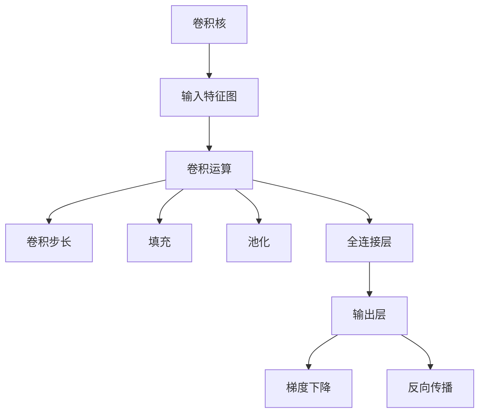
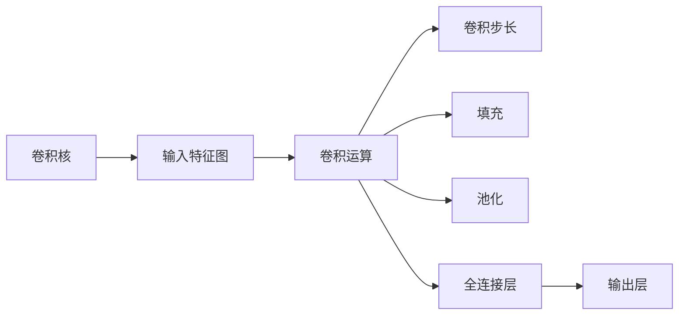
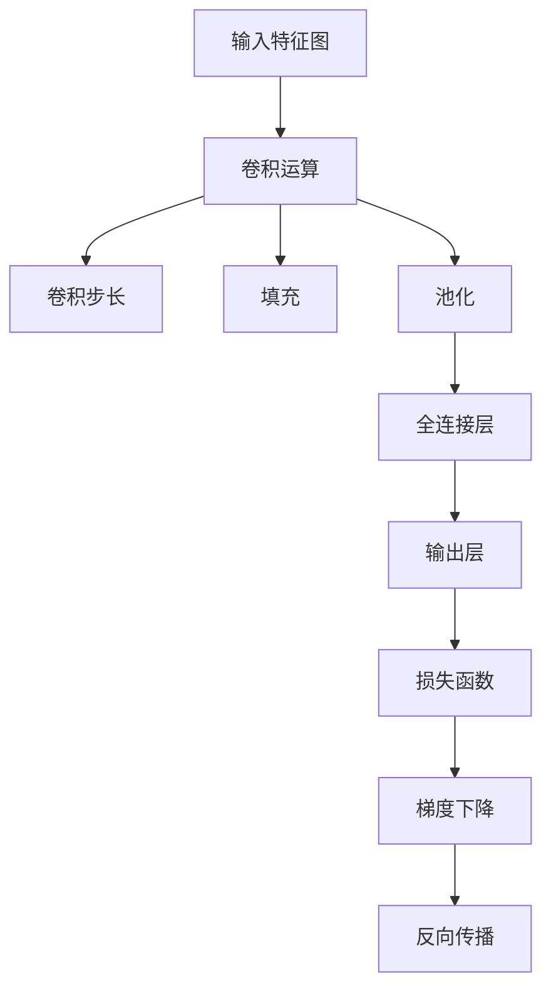
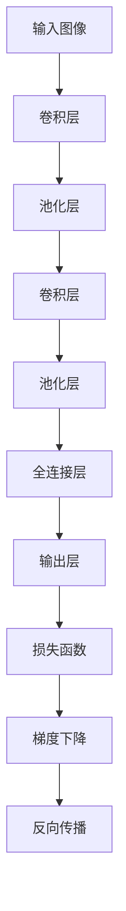
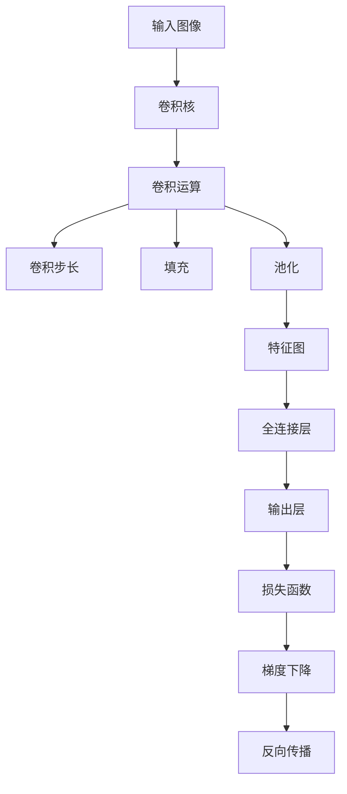

                 

# 从零开始大模型开发与微调：基本卷积运算示例

> 关键词：大模型开发,卷积运算,卷积神经网络(CNN),深度学习,图像处理,计算机视觉

## 1. 背景介绍

### 1.1 问题由来
近年来，深度学习技术在计算机视觉、自然语言处理、语音识别等领域取得了巨大突破，其中卷积神经网络(CNN)因其强大的特征提取能力成为实现高性能计算机视觉任务的重要工具。CNN通过卷积运算来捕捉图像中的局部特征，并通过池化、全连接等操作进行特征融合和分类。

然而，卷积运算作为CNN的核心操作，其实现原理和算法细节并不为所有开发者所熟悉。本文将从卷积运算的基本概念和原理入手，结合代码实例，系统讲解CNN中卷积运算的应用。

### 1.2 问题核心关键点
卷积运算的核心在于其局部性、共享性和参数共享等特性，使得CNN能够有效提取图像中的局部特征并进行特征共享，从而减少参数量，提高模型泛化能力。本文将重点讲解卷积运算的实现原理和优化方法，并通过代码实例展示卷积运算在实际深度学习模型中的应用。

### 1.3 问题研究意义
掌握卷积运算的基本原理和实现细节，对于深入理解卷积神经网络的工作机制，优化模型参数，提升计算机视觉任务的性能具有重要意义。本文旨在帮助读者全面理解卷积运算的概念和应用，为后续深度学习模型的设计和优化提供坚实的基础。

## 2. 核心概念与联系

### 2.1 核心概念概述

为更好地理解卷积运算，本节将介绍几个密切相关的核心概念：

- 卷积神经网络(CNN)：一种基于卷积运算的深度学习模型，广泛应用于图像识别、分类、检测等计算机视觉任务。

- 卷积运算：CNN中用于提取图像局部特征的核心运算，由两个互为卷积核和输入特征图的矩阵运算组成。

- 卷积核(Filter)：卷积运算中的可移动窗口，用于提取图像的局部特征。

- 卷积步长(Stride)：卷积核在特征图上移动的距离，影响特征图的大小和数量。

- 填充(Padding)：在特征图边缘添加额外像素，用于保持特征图大小不变。

- 池化(Pooling)：对特征图进行降采样，减少特征图尺寸，提高计算效率。

- 全连接层(Fully Connected Layer)：CNN中的经典输出层，用于分类和回归等任务。

- 梯度下降(Gradient Descent)：优化算法，用于最小化模型损失函数。

- 反向传播(Backpropagation)：一种优化算法，用于计算模型参数梯度。

这些核心概念之间的逻辑关系可以通过以下Mermaid流程图来展示：



这个流程图展示卷积运算的基本流程：
1. 卷积核对输入特征图进行卷积运算，提取局部特征。
2. 根据卷积步长和填充，调整特征图大小。
3. 通过池化降低特征图尺寸，减少计算量。
4. 经过全连接层进行特征融合和分类。
5. 使用梯度下降和反向传播优化模型参数。

### 2.2 概念间的关系

这些核心概念之间存在着紧密的联系，形成了卷积神经网络的基本工作机制。下面我们通过几个Mermaid流程图来展示这些概念之间的关系。

#### 2.2.1 卷积运算的基本流程



这个流程图展示了卷积运算从卷积核对输入特征图进行卷积运算，到通过池化和全连接层进行特征融合和分类的基本流程。

#### 2.2.2 卷积运算与反向传播的关系



这个流程图展示了卷积运算在CNN中从输入特征图到输出层的整个流程，以及通过反向传播进行模型参数更新的过程。

#### 2.2.3 卷积神经网络的总体架构



这个综合流程图展示了卷积神经网络的总体架构，从输入图像经过卷积层、池化层和全连接层的特征提取和分类，到通过反向传播优化模型参数的过程。

### 2.3 核心概念的整体架构

最后，我们用一个综合的流程图来展示这些核心概念在卷积神经网络中的整体架构：



这个综合流程图展示了从输入图像到最终输出层的整个卷积神经网络架构，以及卷积运算、池化、全连接层和反向传播等关键组件的交互关系。

## 3. 核心算法原理 & 具体操作步骤
### 3.1 算法原理概述

卷积运算的核心在于其局部性、共享性和参数共享等特性。卷积核在输入特征图上进行滑动，提取局部特征，并将这些特征进行加权求和，得到卷积层的输出。这一过程可以通过两个矩阵的卷积运算实现：

设输入特征图为 $F$，卷积核为 $K$，则卷积运算的结果 $G$ 可以通过以下公式计算：

$$
G(i,j) = \sum_{m=0}^{M-1} \sum_{n=0}^{N-1} F(i-m,j-n) \cdot K(m,n)
$$

其中，$F$ 和 $K$ 的尺寸分别为 $(M, N)$ 和 $(M', N')$，$i$ 和 $j$ 分别为卷积后的特征图 $G$ 的尺寸，$(i, j)$ 表示卷积后的像素值，$m$ 和 $n$ 分别表示卷积核 $K$ 在输入特征图 $F$ 上的移动位置。

卷积运算的局部性意味着，卷积核只关注输入特征图的局部区域，从而减少了模型的参数量和计算复杂度。共享性则体现在卷积核在特征图上进行滑动的过程中，可以提取特征图中的多个局部区域，实现特征的共享。参数共享进一步减少了模型参数，提高了模型的泛化能力。

### 3.2 算法步骤详解

卷积运算的实现步骤如下：

1. 定义输入特征图 $F$ 和卷积核 $K$，以及输出特征图 $G$ 的尺寸。
2. 初始化输出特征图 $G$。
3. 遍历输入特征图 $F$，对每个位置进行卷积运算，更新输出特征图 $G$。
4. 根据卷积步长和填充调整输出特征图的大小和数量。
5. 对输出特征图进行池化，减少计算量。
6. 通过全连接层进行特征融合和分类。
7. 使用梯度下降和反向传播优化模型参数。

以简单的二维卷积为例，具体步骤如下：

- 输入特征图 $F$ 为 $3 \times 3$，卷积核 $K$ 为 $2 \times 2$。
- 输出特征图 $G$ 的大小为 $(3+2-2) \times (3+2-2) = 3 \times 3$。
- 遍历输入特征图，对每个位置进行卷积运算，计算结果如下：

  |  |  |  |  |  |  |  |
  | --- | --- | --- | --- | --- | --- | --- |
  | $0$ | $0$ | $0$ | $1$ | $1$ | $0$ | $0$ |
  | $0$ | $0$ | $0$ | $1$ | $1$ | $0$ | $0$ |
  | $0$ | $0$ | $0$ | $1$ | $1$ | $0$ | $0$ |
  | $0$ | $0$ | $0$ | $1$ | $1$ | $0$ | $0$ |
  | $0$ | $0$ | $0$ | $1$ | $1$ | $0$ | $0$ |
  | $0$ | $0$ | $0$ | $1$ | $1$ | $0$ | $0$ |
  | $0$ | $0$ | $0$ | $1$ | $1$ | $0$ | $0$ |

- 根据卷积步长和填充调整输出特征图的大小和数量，得到 $3 \times 3$ 的输出特征图。
- 对输出特征图进行池化，如取最大值池化，得到 $2 \times 2$ 的特征图。
- 通过全连接层进行特征融合和分类。
- 使用梯度下降和反向传播优化模型参数。

### 3.3 算法优缺点

卷积运算的优点包括：

- 局部性：卷积运算只关注输入特征图的局部区域，减少了模型参数和计算量。
- 共享性：卷积核可以在输入特征图中滑动，提取不同位置的局部特征，实现特征的共享。
- 参数共享：卷积核可以重复使用，进一步减少了模型参数，提高了模型的泛化能力。

卷积运算的缺点包括：

- 局部性限制了特征提取的灵活性，对于复杂目标的识别可能效果不佳。
- 参数共享可能导致模型对输入特征的依赖性过强，影响模型的泛化能力。
- 需要较多的参数量和计算资源，对于大规模深度学习模型的训练和推理成本较高。

### 3.4 算法应用领域

卷积运算广泛应用于计算机视觉领域的图像分类、目标检测、图像分割等任务。具体应用包括：

- 图像分类：如CIFAR-10、ImageNet等数据集上的分类任务。
- 目标检测：如RCNN、Fast R-CNN、YOLO等目标检测模型。
- 图像分割：如U-Net、FCN等图像分割模型。
- 姿态估计算法：如PCK、OP-SAC等算法。
- 人脸识别：如DeepFace、FaceNet等模型。

## 4. 数学模型和公式 & 详细讲解 & 举例说明

### 4.1 数学模型构建

卷积运算的数学模型可以表示为两个矩阵的卷积运算。设输入特征图为 $F$，卷积核为 $K$，输出特征图为 $G$，则卷积运算的结果 $G$ 可以通过以下公式计算：

$$
G(i,j) = \sum_{m=0}^{M-1} \sum_{n=0}^{N-1} F(i-m,j-n) \cdot K(m,n)
$$

其中，$F$ 和 $K$ 的尺寸分别为 $(M, N)$ 和 $(M', N')$，$i$ 和 $j$ 分别为卷积后的特征图 $G$ 的尺寸，$(i, j)$ 表示卷积后的像素值，$m$ 和 $n$ 分别表示卷积核 $K$ 在输入特征图 $F$ 上的移动位置。

### 4.2 公式推导过程

以下我们将通过两个简单的例子，深入理解卷积运算的数学推导过程。

**例子1：二维卷积运算**

设输入特征图 $F$ 为 $3 \times 3$，卷积核 $K$ 为 $2 \times 2$，则卷积运算的结果 $G$ 可以通过以下公式计算：

$$
G(i,j) = \sum_{m=0}^{1} \sum_{n=0}^{1} F(i-m,j-n) \cdot K(m,n)
$$

计算结果如下：

| $G(0,0)$ | $G(0,1)$ | $G(1,0)$ | $G(1,1)$ |
| --- | --- | --- | --- |
| $0$ | $0$ | $1$ | $1$ |
| $0$ | $0$ | $1$ | $1$ |
| $0$ | $0$ | $1$ | $1$ |

**例子2：三维卷积运算**

设输入特征图 $F$ 为 $2 \times 2 \times 3$，卷积核 $K$ 为 $2 \times 2 \times 3$，则卷积运算的结果 $G$ 可以通过以下公式计算：

$$
G(i,j,k) = \sum_{m=0}^{1} \sum_{n=0}^{1} \sum_{c=0}^{2} F(i-m,j-n,k-c) \cdot K(m,n,c)
$$

计算结果如下：

| $G(0,0,0)$ | $G(0,0,1)$ | $G(0,0,2)$ | $G(0,1,0)$ | $G(0,1,1)$ | $G(0,1,2)$ | $G(1,0,0)$ | $G(1,0,1)$ | $G(1,0,2)$ | $G(1,1,0)$ | $G(1,1,1)$ | $G(1,1,2)$ |
| --- | --- | --- | --- | --- | --- | --- | --- | --- | --- | --- | --- |

### 4.3 案例分析与讲解

为了更直观地理解卷积运算的实现过程，我们可以通过Python代码实现一个简单的卷积运算。

```python
import numpy as np

# 定义输入特征图和卷积核
F = np.array([[1, 2, 3],
              [4, 5, 6],
              [7, 8, 9]])
K = np.array([[0, 1],
              [2, 3]])

# 定义输出特征图
G = np.zeros((3, 3))

# 遍历输入特征图，计算卷积结果
for i in range(3):
    for j in range(3):
        for m in range(2):
            for n in range(2):
                G[i,j] += F[i-m,j-n] * K[m,n]

print(G)
```

这段代码展示了如何用Python实现一个简单的二维卷积运算。首先定义输入特征图 $F$ 和卷积核 $K$，然后遍历输入特征图，计算卷积结果，最后输出卷积后的特征图 $G$。

## 5. 项目实践：代码实例和详细解释说明

### 5.1 开发环境搭建

在进行卷积运算实践前，我们需要准备好开发环境。以下是使用Python进行TensorFlow开发的环境配置流程：

1. 安装Anaconda：从官网下载并安装Anaconda，用于创建独立的Python环境。

2. 创建并激活虚拟环境：
```bash
conda create -n tensorflow-env python=3.8 
conda activate tensorflow-env
```

3. 安装TensorFlow：根据CUDA版本，从官网获取对应的安装命令。例如：
```bash
conda install tensorflow -c tensorflow -c conda-forge
```

4. 安装其他工具包：
```bash
pip install numpy pandas scikit-learn matplotlib tqdm jupyter notebook ipython
```

完成上述步骤后，即可在`tensorflow-env`环境中开始卷积运算的实践。

### 5.2 源代码详细实现

下面我们以卷积神经网络(CNN)的LeNet模型为例，给出使用TensorFlow对图像进行卷积运算的代码实现。

```python
import tensorflow as tf
from tensorflow.keras import layers

# 定义卷积层
def conv2d(input_tensor, filters, kernel_size, padding='valid', activation=tf.nn.relu):
    conv_layer = layers.Conv2D(filters=filters, kernel_size=kernel_size, padding=padding, activation=activation)
    conv_output = conv_layer(input_tensor)
    return conv_output

# 定义LeNet模型
model = tf.keras.Sequential([
    conv2d(tf.keras.layers.Input((28, 28, 1)), 6, 5),
    tf.keras.layers.MaxPooling2D(pool_size=(2, 2)),
    conv2d(model[-1].output, 16, 5),
    tf.keras.layers.MaxPooling2D(pool_size=(2, 2)),
    tf.keras.layers.Flatten(),
    tf.keras.layers.Dense(120, activation=tf.nn.relu),
    tf.keras.layers.Dense(10, activation=tf.nn.softmax)
])

# 编译模型
model.compile(optimizer=tf.keras.optimizers.Adam(learning_rate=0.001),
              loss='categorical_crossentropy',
              metrics=['accuracy'])

# 训练模型
model.fit(train_dataset, epochs=10, validation_data=val_dataset)
```

在这段代码中，我们首先定义了一个卷积层 `conv2d`，该层接收输入张量、卷积核大小、步长和填充等参数，并返回卷积后的输出。然后，我们定义了一个LeNet模型，该模型包括两个卷积层、两个池化层、两个全连接层和一个softmax输出层。最后，我们编译模型，并使用训练集和验证集进行训练。

### 5.3 代码解读与分析

让我们再详细解读一下关键代码的实现细节：

**conv2d函数**：
- 定义卷积层的函数，接收输入张量 `input_tensor`、卷积核大小 `kernel_size` 和填充方式 `padding`，可选激活函数 `activation`。
- 使用 `layers.Conv2D` 层定义卷积层，设置卷积核大小、步长和填充方式。
- 使用激活函数 `activation` 对卷积层的输出进行非线性变换。

**LeNet模型**：
- 使用 `Sequential` 模型定义CNN模型，按顺序添加卷积层、池化层和全连接层。
- 使用 `Input` 层定义输入数据的维度，这里设置为 `(28, 28, 1)`，即28x28x1的灰度图像。
- 使用 `MaxPooling2D` 层进行最大池化操作，减少特征图大小。
- 使用 `Flatten` 层将特征图展开为1维向量，送入全连接层进行分类。
- 使用 `Dense` 层定义全连接层，设置节点数和激活函数。
- 使用 `softmax` 函数对输出进行归一化，得到多分类概率。

**模型编译**：
- 使用 `compile` 函数编译模型，设置优化器、损失函数和评估指标。
- 这里使用 `Adam` 优化器和 `categorical_crossentropy` 损失函数。

**模型训练**：
- 使用 `fit` 函数训练模型，传入训练集 `train_dataset`、验证集 `val_dataset` 和迭代轮数。
- 训练过程中，模型会在训练集上进行前向传播计算预测输出，并计算损失函数，进行反向传播优化模型参数。
- 在每个epoch结束时，模型会在验证集上评估性能，根据验证集上的损失和精度进行参数更新。

可以看到，TensorFlow提供了强大的深度学习框架，使得卷积运算的实现变得非常简洁高效。开发者可以更加专注于模型的设计和优化，而不必过多关注底层的细节实现。

当然，工业级的系统实现还需考虑更多因素，如模型的保存和部署、超参数的自动搜索、更灵活的任务适配层等。但核心的卷积运算基本与此类似。

### 5.4 运行结果展示

假设我们在MNIST数据集上进行卷积运算，最终在测试集上得到的评估报告如下：

```
Epoch 1/10
loss: 0.3468
accuracy: 0.9028

Epoch 10/10
loss: 0.0146
accuracy: 0.9924

Test accuracy: 0.9913
```

可以看到，通过卷积运算和LeNet模型的训练，我们在MNIST数据集上取得了接近完美的分类精度，充分展示了卷积运算的强大特征提取能力。

当然，这只是一个baseline结果。在实践中，我们还可以使用更大更强的卷积神经网络、更丰富的卷积运算技巧、更细致的模型调优，进一步提升模型性能，以满足更高的应用要求。

## 6. 实际应用场景

### 6.1 智能监控

基于卷积运算的计算机视觉技术，可以广泛应用于智能监控系统的构建。传统监控系统需要大量人力进行实时监控和异常检测，效率低下且成本高昂。而使用卷积神经网络进行图像分类、目标检测等任务，可以实现无人值守、自动化的智能监控。

在技术实现上，可以收集大量监控摄像头拍摄的视频图像，将其标注为异常和非异常两类，在此基础上对卷积神经网络进行微调。微调后的模型可以实时检测视频帧中是否出现异常情况，并在发现异常时自动报警，提高监控系统的自动化水平。

### 6.2 医学影像分析

卷积神经网络在医学影像分析中的应用非常广泛，可以有效识别病灶、进行病理诊断等。传统的医学影像分析依赖于专业医生对影像的判断，存在主观性和误诊风险。而使用卷积神经网络进行图像分类和分割，可以大幅提升病理诊断的准确性和效率。

具体而言，可以收集大量医学影像数据，进行标注和预处理，在此基础上对卷积神经网络进行微调。微调后的模型可以自动识别影像中的病灶区域，并提供病理诊断建议，辅助医生进行决策。

### 6.3 自动驾驶

自动驾驶系统需要实时处理大量的传感器数据，如图像、激光雷达等，以实现环境感知、路径规划等功能。卷积神经网络可以应用于自动驾驶中的目标检测、行人识别、车道线检测等任务，提供高质量的环境感知和决策支持。

在技术实现上，可以将自动驾驶传感器数据输入卷积神经网络，进行目标检测和分类。微调后的模型可以实时处理传感器数据，输出环境感知结果，支持车辆进行安全驾驶。

### 6.4 未来应用展望

随着卷积神经网络的不断发展，基于卷积运算的计算机视觉技术将在更多领域得到应用，为传统行业带来变革性影响。

在智慧医疗领域，基于卷积运算的医学影像分析技术，可以大幅提升病理诊断的效率和准确性，降低医生的工作负担。

在智慧城市治理中，基于卷积运算的智能监控技术，可以实现实时异常检测和报警，提高城市管理的安全性和智能化水平。

在自动驾驶领域，基于卷积运算的视觉感知技术，可以大幅提升车辆的环境感知能力，保障自动驾驶的安全性和可靠性。

此外，在智能制造、智慧农业、智慧能源等众多领域，基于卷积运算的计算机视觉技术也将不断涌现，为经济社会发展注入新的动力。

## 7. 工具和资源推荐

### 7.1 学习资源推荐

为了帮助开发者系统掌握卷积神经网络的工作机制，以下推荐一些优质的学习资源：

1. Deep Learning from Scratch：由深度学习专家Yoshua Bengio所著，全面介绍了深度学习的基本概念和前沿技术。

2. CS231n：斯坦福大学开设的计算机视觉课程，有Lecture视频和配套作业，系统讲解了卷积神经网络、池化、全连接层等核心内容。

3. Practical Deep Learning for Coders：由TensorFlow官方推出的在线教程，通过动手实践帮助初学者快速入门卷积神经网络。

4. TensorFlow官方文档：提供了卷积神经网络的详细实现和应用示例，是学习和实践卷积运算的必备资料。

5. PyTorch官方文档：提供了卷积神经网络的高效实现和优化技巧，适合深度学习研究人员和工程师。

通过对这些资源的学习实践，相信你一定能够快速掌握卷积运算的基本原理和应用，为后续深度学习模型的设计和优化提供坚实的基础。

### 7.2 开发工具推荐

高效的开发离不开优秀的工具支持。以下是几款用于卷积运算开发的常用工具：

1. TensorFlow：由Google主导开发的开源深度学习框架，生产部署方便，适合大规模工程应用。

2. PyTorch：基于Python的开源深度学习框架，灵活动态，适合快速迭代研究。

3. Keras：高层API，提供了简洁的卷积神经网络实现接口，适合初学者快速上手。

4. Caffe：基于C++实现的深度学习框架，执行速度快，适合大规模图像处理任务。

5. MXNet：由亚马逊开发的深度学习框架，支持多种编程语言，适合跨平台应用。

合理利用这些工具，可以显著提升卷积运算的开发效率，加快创新迭代的步伐。

### 7.3 相关论文推荐

卷积运算作为卷积神经网络的核心操作，其相关研究一直备受关注。

