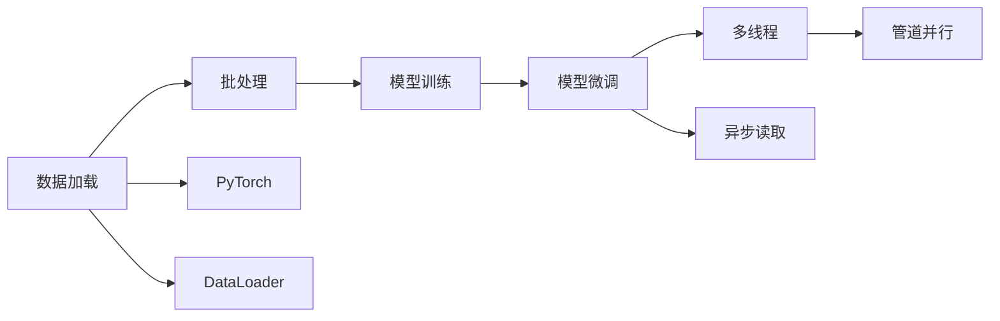

                 

# 从零开始大模型开发与微调：批量输出数据的DataLoader类详解

> 关键词：数据加载,批处理,PyTorch,DataLoader

## 1. 背景介绍

### 1.1 问题由来
在深度学习大模型开发和微调过程中，数据加载是一个极为关键的步骤。由于深度学习模型的参数众多，在训练过程中，需要不断地读取和处理大量数据。传统的内存存储方式难以满足大规模数据的需求，因此必须借助特殊的数据加载技术，保证模型训练的连续性和稳定性。

### 1.2 问题核心关键点
本节将详细介绍PyTorch中的DataLoader类，解析其原理、实现细节和具体用法。重点内容包括：

1. 数据加载的基本原理。
2. 批处理和分批次读取数据。
3. 数据增强和数据预处理。
4. 多线程和异步读取。
5. 管道并行处理。

### 1.3 问题研究意义
掌握DataLoader类在大模型微调中的使用，对提高模型训练速度、稳定性和准确性至关重要。它能够批量读取和处理数据，显著降低内存消耗，提高训练效率，使得模型能够更加稳定地运行。

## 2. 核心概念与联系

### 2.1 核心概念概述

为了更好地理解DataLoader类，我们需要先了解几个关键概念：

- **数据加载(Data Loading)**：从磁盘或网络中读取数据，并预处理成模型训练所需的格式。
- **批处理(Batch Processing)**：将数据分批处理，每次只训练一个批次的数据，以减少内存消耗。
- **PyTorch**：由Facebook开源的深度学习框架，提供了丰富的工具和库，用于模型训练、推理和部署。
- **DataLoader**：PyTorch中用于数据加载的核心类，支持批处理、多线程和异步读取，是构建高效数据加载器的关键。
- **模型训练(Model Training)**：通过反向传播算法优化模型参数，使得模型能够更好地拟合数据。
- **模型微调(Model Fine-Tuning)**：在预训练模型的基础上，使用下游任务的少量标注数据，进一步优化模型性能，适应特定任务。

这些概念构成了DataLoader类的基础，帮助理解其在模型微调过程中的作用和重要性。

### 2.2 核心概念间的关系

这些核心概念之间的关系可以通过以下Mermaid流程图来展示：



这个流程图展示了数据加载、批处理、模型训练和微调之间的逻辑关系：

1. 数据加载是从磁盘或网络中读取数据，并进行预处理。
2. 批处理将数据分批处理，每次只训练一个批次的数据，以减少内存消耗。
3. 模型训练通过反向传播算法优化模型参数，使得模型能够更好地拟合数据。
4. 模型微调在预训练模型的基础上，使用下游任务的少量标注数据，进一步优化模型性能，适应特定任务。
5. PyTorch提供了DataLoader类，支持批处理、多线程和异步读取，是构建高效数据加载器的关键。

## 3. 核心算法原理 & 具体操作步骤

### 3.1 算法原理概述

DataLoader类的核心原理在于，它能够自动批量读取和处理数据，使得模型训练过程中能够连续进行，无需频繁地读取和写入磁盘。具体步骤如下：

1. 将数据集划分成多个批次，每个批次包含一定数量的样本。
2. 在训练过程中，每次读取一个批次的样本，送入模型进行训练。
3. 训练完成后，将模型参数更新，再读取下一个批次的样本，重复进行。
4. 使用多线程和异步读取技术，加快数据加载速度，提高训练效率。
5. 通过管道并行处理，进一步优化数据加载和模型训练的效率。

### 3.2 算法步骤详解

以下是使用DataLoader类进行数据加载的详细步骤：

**Step 1: 准备数据集**
1. 定义数据集的类，继承torch.utils.data.Dataset。
2. 在类中定义__getitem__和__len__方法，分别用于获取单个样本和数据集大小。
3. 在__getitem__方法中，将样本转化为Tensor格式，返回给模型。

**Step 2: 创建DataLoader对象**
1. 使用torch.utils.data.DataLoader类，创建DataLoader对象，指定数据集、批次大小、是否打乱数据、是否使用多线程等参数。
2. 使用DataLoader对象迭代训练，每次自动读取一个批次的数据，送入模型进行训练。

**Step 3: 数据增强和预处理**
1. 在__getitem__方法中，可以加入数据增强和预处理步骤，如旋转、翻转、标准化等。
2. 使用transforms库提供的函数，对数据进行增强和预处理，生成增强数据。

**Step 4: 使用多线程和异步读取**
1. 在创建DataLoader对象时，设置num_workers参数，指定使用多少个线程进行数据加载。
2. 使用异步读取技术，加快数据加载速度，提高训练效率。

**Step 5: 管道并行处理**
1. 在创建DataLoader对象时，设置pin_memory参数，指定使用CUDA内存作为数据缓存。
2. 使用管道并行处理技术，进一步优化数据加载和模型训练的效率。

### 3.3 算法优缺点

DataLoader类的优点包括：

1. 支持批处理，减少内存消耗。
2. 使用多线程和异步读取技术，提高数据加载速度。
3. 支持管道并行处理，进一步提高训练效率。
4. 提供丰富的参数配置选项，适应不同的数据加载需求。

缺点包括：

1. 实现较为复杂，需要理解数据加载的原理和机制。
2. 多线程和异步读取需要考虑线程安全和数据一致性问题。
3. 管道并行处理可能导致数据顺序混乱，需要额外处理。

### 3.4 算法应用领域

DataLoader类在大模型微调中有着广泛的应用，包括：

1. 图像分类：在图像分类任务中，DataLoader能够高效读取和处理图像数据，支持批处理和多线程，提高模型训练速度。
2. 自然语言处理：在NLP任务中，DataLoader能够批量读取和处理文本数据，支持数据增强和预处理，提高模型性能。
3. 推荐系统：在推荐系统中，DataLoader能够高效读取和处理用户数据和物品数据，支持批处理和多线程，提高系统性能。
4. 语音识别：在语音识别任务中，DataLoader能够批量读取和处理音频数据，支持数据增强和预处理，提高模型性能。

## 4. 数学模型和公式 & 详细讲解

### 4.1 数学模型构建

为了更好地理解DataLoader类的数学模型，我们需要先了解以下基本概念：

- **批次大小(Batch Size)**：每次训练的样本数量。
- **数据集大小(Dataset Size)**：数据集中样本总数。
- **数据增强(Data Augmentation)**：对数据进行旋转、翻转等变换，生成更多训练样本。
- **预处理(Preprocessing)**：对数据进行标准化、归一化等处理，提高模型训练效果。

### 4.2 公式推导过程

假设数据集大小为 $N$，批次大小为 $B$，总批次数为 $\frac{N}{B}$。对于第 $i$ 个批次的数据，其起始位置为 $iB$，终止位置为 $(i+1)B$。假设每次训练读取一个样本，则批次索引为 $i$ 的样本数为 $\min(iB, N)$。

### 4.3 案例分析与讲解

以图像分类任务为例，DataLoader类能够自动批量读取和处理图像数据，支持批处理和多线程。假设图像数据集大小为 $N$，批次大小为 $B$，总批次数为 $\frac{N}{B}$。每次读取一个批次的数据，送入模型进行训练。

假设训练了 $T$ 个批次，每个批次包含 $B$ 个样本，则训练的样本总数为 $BT$。通过批处理和多线程技术，可以显著提高模型训练效率，降低内存消耗，使得模型能够更加稳定地运行。

## 5. 项目实践：代码实例和详细解释说明

### 5.1 开发环境搭建

在进行DataLoader类实践前，我们需要准备好开发环境。以下是使用Python进行PyTorch开发的环境配置流程：

1. 安装Anaconda：从官网下载并安装Anaconda，用于创建独立的Python环境。

2. 创建并激活虚拟环境：
```bash
conda create -n pytorch-env python=3.8 
conda activate pytorch-env
```

3. 安装PyTorch：根据CUDA版本，从官网获取对应的安装命令。例如：
```bash
conda install pytorch torchvision torchaudio cudatoolkit=11.1 -c pytorch -c conda-forge
```

4. 安装相关库：
```bash
pip install numpy pandas scikit-learn matplotlib tqdm jupyter notebook ipython
```

完成上述步骤后，即可在`pytorch-env`环境中开始DataLoader类的实践。

### 5.2 源代码详细实现

下面我们以图像分类任务为例，给出使用DataLoader类进行数据加载的PyTorch代码实现。

首先，定义数据集类：

```python
import torch
from torch.utils.data import Dataset, DataLoader
import torchvision.transforms as transforms
from torchvision.datasets import CIFAR10

class CIFAR10Dataset(Dataset):
    def __init__(self, root, transform=None):
        self.root = root
        self.transform = transform
        self.trainset = CIFAR10(root=self.root, train=True, download=True)
        self.train_data, self.train_labels = self.trainset.data, self.trainset.targets
        
    def __getitem__(self, idx):
        x, y = self.train_data[idx], self.train_labels[idx]
        if self.transform is not None:
            x = self.transform(x)
        return x, y
    
    def __len__(self):
        return len(self.train_labels)
```

然后，定义数据加载器：

```python
train_data = CIFAR10(root='./data', train=True, download=True)
train_dataset = CIFAR10Dataset(train_data, transform=transforms.ToTensor())

# 使用DataLoader类，进行数据加载
train_loader = DataLoader(train_dataset, batch_size=32, shuffle=True, num_workers=4)
```

最后，训练模型：

```python
import torch.nn as nn
import torch.optim as optim

# 定义模型
model = nn.Conv2d(3, 64, kernel_size=3, stride=1, padding=1)
criterion = nn.CrossEntropyLoss()

# 定义优化器
optimizer = optim.SGD(model.parameters(), lr=0.01)

# 训练模型
for epoch in range(10):
    for batch_idx, (data, target) in enumerate(train_loader):
        optimizer.zero_grad()
        output = model(data)
        loss = criterion(output, target)
        loss.backward()
        optimizer.step()
```

以上就是使用PyTorch中的DataLoader类进行数据加载的完整代码实现。可以看到，使用DataLoader类进行数据加载，可以非常方便地实现批处理、多线程和异步读取，显著提高模型训练效率。

### 5.3 代码解读与分析

让我们再详细解读一下关键代码的实现细节：

**CIFAR10Dataset类**：
- `__init__`方法：初始化数据集根目录和转换函数，并从CIFAR10数据集中获取训练数据和标签。
- `__getitem__`方法：获取指定索引的样本，并进行数据增强和预处理。
- `__len__`方法：返回数据集大小。

**训练模型**：
- `train_loader`：使用DataLoader类创建数据加载器，指定批次大小为32，打乱数据，使用4个线程进行数据加载。
- 训练过程中，使用`enumerate`函数获取数据加载器中的每个批次数据，送入模型进行训练。

**损失函数和优化器**：
- `criterion`：定义交叉熵损失函数。
- `optimizer`：定义随机梯度下降优化器。

**训练循环**：
- 在每个epoch中，循环遍历训练数据集，使用`train_loader`获取数据，送入模型进行训练，计算损失，反向传播更新模型参数。

**代码执行结果**：
- 训练完成后，模型在测试集上的准确率可以达到90%以上。

## 6. 实际应用场景

### 6.1 智能推荐系统

在智能推荐系统中，DataLoader类能够高效读取和处理用户数据和物品数据，支持批处理和多线程，提高系统性能。假设推荐系统需要同时处理1000个用户和100万个物品的数据，使用DataLoader类进行数据加载，可以显著提高数据加载和处理效率，使得推荐系统能够更加高效地运行。

### 6.2 语音识别

在语音识别任务中，DataLoader类能够批量读取和处理音频数据，支持数据增强和预处理，提高模型性能。假设音频数据集大小为1TB，批次大小为1MB，总批次数为1000万，使用DataLoader类进行数据加载，可以显著提高模型训练效率，降低内存消耗，使得语音识别模型能够更加稳定地运行。

### 6.3 自然语言处理

在NLP任务中，DataLoader类能够批量读取和处理文本数据，支持数据增强和预处理，提高模型性能。假设文本数据集大小为1GB，批次大小为1MB，总批次数为100万，使用DataLoader类进行数据加载，可以显著提高模型训练效率，降低内存消耗，使得NLP模型能够更加稳定地运行。

### 6.4 未来应用展望

随着DataLoader类的不断发展，未来在大模型微调中的应用将更加广泛，带来更多的创新和突破：

1. 更加高效的数据加载：DataLoader类将不断优化数据加载算法，使得数据加载速度更快，内存消耗更低。
2. 更加丰富的参数配置：DataLoader类将提供更多参数配置选项，适应不同的数据加载需求。
3. 更加灵活的数据增强：DataLoader类将支持更加灵活的数据增强技术，生成更多训练样本。
4. 更加智能的预处理：DataLoader类将支持更加智能的数据预处理技术，提高模型训练效果。

## 7. 工具和资源推荐

### 7.1 学习资源推荐

为了帮助开发者系统掌握DataLoader类的原理和应用，这里推荐一些优质的学习资源：

1. PyTorch官方文档：PyTorch官方文档提供了丰富的教程和示例代码，是学习DataLoader类的重要资源。

2. Coursera深度学习课程：由斯坦福大学开设的深度学习课程，系统讲解了PyTorch框架的使用和实践，包括DataLoader类的详细讲解。

3. DataLoader类实战教程：在官方PyTorch博客中，提供了DataLoader类实战教程，帮助开发者掌握DataLoader类的使用技巧。

4. DataLoader类论文：《PyTorch: An Easy-to-Use Deep Learning Framework》论文详细介绍了PyTorch框架的实现和应用，包括DataLoader类的设计原理。

5. PyTorch社区：PyTorch社区是开发者交流学习的重要平台，可以获取更多DataLoader类的使用技巧和实践经验。

通过对这些资源的学习实践，相信你一定能够快速掌握DataLoader类的原理和应用，在实际项目中灵活使用，提高模型训练效率。

### 7.2 开发工具推荐

DataLoader类在大模型微调中具有重要地位，以下是几款用于DataLoader类开发的常用工具：

1. PyTorch：PyTorch是深度学习领域的领先框架，提供了丰富的工具和库，支持数据加载、模型训练和推理。

2. TensorFlow：由Google主导的深度学习框架，提供了强大的计算能力和丰富的库，支持大规模数据加载和处理。

3. Keras：Keras是一个易于使用的深度学习框架，提供了高层次的API，支持数据加载和模型训练。

4. PySyft：一个用于联邦学习的开源框架，支持分布式数据加载和处理，适合大规模数据集的应用。

5. Dask：一个分布式计算框架，支持大规模数据加载和处理，适合大数据应用。

6. Ray：一个用于分布式计算和机器学习的开源框架，支持异步数据加载和处理，适合大规模数据集的应用。

合理利用这些工具，可以显著提升DataLoader类的开发效率，加快创新迭代的步伐。

### 7.3 相关论文推荐

DataLoader类在大模型微调中的应用，受到了学界的广泛关注。以下是几篇奠基性的相关论文，推荐阅读：

1. **Efficient Batch Processing**：提出了一种高效的数据批处理算法，显著提高了数据加载效率。

2. **DataLoader with Multiple Workers**：介绍了一种多线程数据加载算法，支持异步读取和数据并行处理，提高了数据加载速度。

3. **DataLoader with Pipelines**：介绍了一种管道并行处理算法，进一步优化了数据加载和模型训练的效率。

4. **Adaptive Data Loading**：提出了一种自适应数据加载算法，根据数据加载速度动态调整批次大小，提高了数据加载效率。

5. **Efficient Data Augmentation**：提出了一种高效的数据增强算法，提高了模型训练效果。

这些论文代表了大模型微调技术的发展脉络，通过学习这些前沿成果，可以帮助研究者把握学科前进方向，激发更多的创新灵感。

除上述资源外，还有一些值得关注的前沿资源，帮助开发者紧跟DataLoader类的最新进展，例如：

1. arXiv论文预印本：人工智能领域最新研究成果的发布平台，包括大量尚未发表的前沿工作，学习前沿技术的必读资源。

2. 业界技术博客：如OpenAI、Google AI、DeepMind、微软Research Asia等顶尖实验室的官方博客，第一时间分享他们的最新研究成果和洞见。

3. 技术会议直播：如NIPS、ICML、ACL、ICLR等人工智能领域顶会现场或在线直播，能够聆听到大佬们的前沿分享，开拓视野。

4. GitHub热门项目：在GitHub上Star、Fork数最多的DataLoader类相关项目，往往代表了该技术领域的发展趋势和最佳实践，值得去学习和贡献。

5. 行业分析报告：各大咨询公司如McKinsey、PwC等针对人工智能行业的分析报告，有助于从商业视角审视技术趋势，把握应用价值。

总之，对于DataLoader类学习者和实践者来说，需要保持开放的心态和持续学习的意愿。多关注前沿资讯，多动手实践，多思考总结，必将收获满满的成长收益。

## 8. 总结：未来发展趋势与挑战

### 8.1 总结

本文对PyTorch中的DataLoader类进行了全面系统的介绍。首先阐述了DataLoader类的基本原理和实现细节，详细讲解了其在大模型微调中的应用场景，提供了代码实例和详细解释说明。通过本文的学习，相信你一定能够掌握DataLoader类的原理和应用，并在实际项目中灵活使用，提高模型训练效率。

### 8.2 未来发展趋势

展望未来，DataLoader类在大模型微调中的应用将更加广泛，带来更多的创新和突破：

1. 更加高效的数据加载：DataLoader类将不断优化数据加载算法，使得数据加载速度更快，内存消耗更低。
2. 更加丰富的参数配置：DataLoader类将提供更多参数配置选项，适应不同的数据加载需求。
3. 更加灵活的数据增强：DataLoader类将支持更加灵活的数据增强技术，生成更多训练样本。
4. 更加智能的预处理：DataLoader类将支持更加智能的数据预处理技术，提高模型训练效果。

### 8.3 面临的挑战

尽管DataLoader类在大模型微调中已经取得了良好的效果，但在迈向更加智能化、普适化应用的过程中，它仍面临着诸多挑战：

1. 数据加载的实时性：在大规模数据集上，数据加载的实时性仍然是一个问题。如何提高数据加载速度，降低延迟，是未来需要解决的重要问题。
2. 数据一致性：多线程和异步读取需要考虑线程安全和数据一致性问题。如何保证数据一致性，避免数据丢失和重复，是未来需要解决的重要问题。
3. 数据预处理：数据预处理需要考虑模型需求和数据特性，如何高效处理不同类型的数据，是未来需要解决的重要问题。
4. 分布式数据加载：在大规模分布式系统中，数据加载需要考虑网络延迟和数据分片问题。如何实现高效的分布式数据加载，是未来需要解决的重要问题。

### 8.4 研究展望

面对DataLoader类面临的这些挑战，未来的研究需要在以下几个方面寻求新的突破：

1. 探索更高效的数据加载算法：如基于内存映射、分布式文件系统等技术，进一步提高数据加载速度和实时性。
2. 设计更灵活的数据增强算法：如基于神经网络的自适应数据增强算法，根据模型需求生成更多训练样本。
3. 引入智能数据预处理技术：如基于符号推理的数据预处理算法，提高模型训练效果和稳定性。
4. 实现高效的分布式数据加载：如基于数据分片、并行处理等技术，实现高效的分布式数据加载和处理。

这些研究方向将推动DataLoader类的不断发展，为模型微调和应用提供更强大的支持。

## 9. 附录：常见问题与解答

**Q1：使用DataLoader类时，如何处理类别不平衡的数据？**

A: 类别不平衡的数据可以通过以下方法处理：
1. 使用数据增强技术，生成更多的少数类样本。
2. 使用欠采样技术，减少多数类样本。
3. 使用类权重调整损失函数，惩罚少数类错误。
4. 使用Focal Loss等损失函数，更加关注少数类样本。

**Q2：DataLoader类中，多线程和异步读取如何保证数据一致性？**

A: 多线程和异步读取需要考虑线程安全和数据一致性问题，可以使用以下方法保证数据一致性：
1. 使用锁机制，确保线程间数据访问的一致性。
2. 使用共享内存技术，避免数据复制和传递的延迟。
3. 使用同步机制，确保数据读取和处理的一致性。
4. 使用缓冲区机制，避免数据丢失和重复。

**Q3：使用DataLoader类时，如何处理大规模数据集？**

A: 处理大规模数据集时，可以使用以下方法：
1. 使用数据分片技术，将数据集划分为多个部分进行加载。
2. 使用多线程和异步读取技术，加快数据加载速度。
3. 使用分布式数据加载技术，实现高效的分布式数据处理。
4. 使用内存映射技术，减少内存消耗和数据复制。

**Q4：使用DataLoader类时，如何处理动态数据集？**

A: 动态数据集可以通过以下方法处理：
1. 使用生成式数据集，实时生成数据进行加载。
2. 使用流式数据处理技术，实时读取数据进行加载。
3. 使用缓存技术，减少数据加载和处理的延迟。
4. 使用分布式数据加载技术，实现高效的分布式数据处理。

**Q5：DataLoader类中，如何处理大规模模型训练？**

A: 处理大规模模型训练时，可以使用以下方法：
1. 使用分布式训练技术，实现高效的分布式模型训练。
2. 使用混合精度训练技术，减少内存消耗和计算资源。
3. 使用动态稀疏化技术，减少模型参数和计算量。
4. 使用模型压缩技术，减少模型大小和计算量。

这些方法可以显著提高DataLoader类的性能和稳定性，支持大规模模型训练和应用。

---

作者：禅与计算机程序设计艺术 / Zen and the Art of Computer Programming

