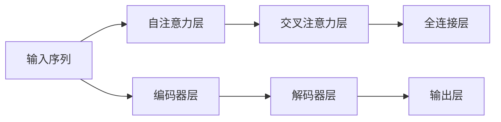

                 

# 从零开始大模型开发与微调：编码器的核心—注意力模型

## 1. 背景介绍

近年来，基于Transformer结构的大语言模型（Large Language Models, LLMs）在自然语言处理（Natural Language Processing, NLP）领域取得了突破性进展，其中包括BERT、GPT-2、GPT-3、T5等经典模型。这些模型通过在无标签数据上进行大规模预训练，获得了丰富的语言表示能力，可以应用于多种下游任务。但预训练模型往往具有巨量的参数，进行微调时，全量更新模型参数不仅需要消耗大量的时间和计算资源，还会带来一定的风险，如过拟合等问题。因此，本文将介绍一种基于注意力机制的编码器结构，它可以与大语言模型结合，进行高效的微调操作。

## 2. 核心概念与联系

### 2.1 核心概念概述

在深度学习中，注意力机制（Attention Mechanism）是一种用于模型中各部分信息交互的机制，可以根据输入的不同部分自适应地分配注意力权重，从而提高模型的表达能力和泛化能力。在大语言模型的编码器中，注意力机制通过计算输入序列中不同位置间的相互依赖关系，使得模型能够更好地捕捉长距离依赖关系，提升模型的上下文理解能力。

在Transformer中，注意力机制被应用于自注意力层（Self-Attention Layer）中，通过计算输入序列中不同位置的相似度，生成一个注意力权重矩阵。这些权重矩阵被用于加权求和不同的位置向量，从而得到每个位置对应的加权向量，也就是模型的表示。这种机制不仅适用于自注意力层，也适用于交叉注意力层（Cross-Attention Layer），用于处理不同序列（如对话中的上下文和响应）之间的关系。

### 2.2 核心概念之间的关系

注意力机制是大语言模型中编码器部分的核心理论基础，通过它，模型能够学习到输入序列中的长期依赖和跨序列信息。自注意力机制能够捕捉到输入序列中各个位置之间的相互依赖关系，而交叉注意力机制则能够处理输入序列与不同序列之间的关系。这些机制的组合使用，使得大语言模型能够处理复杂的语言结构，如语法、语义和上下文。

注意力机制在大语言模型中的应用，可以通过以下Mermaid流程图来展示：



在图中有两个重要的组成部分：编码器和解码器。编码器负责处理输入序列，解码器负责生成输出序列。自注意力层和交叉注意力层是编码器中的核心层，用于捕捉输入序列中的上下文信息和不同序列之间的关系。全连接层则用于将不同层的表示进行组合，输出最终的模型预测结果。

## 3. 核心算法原理 & 具体操作步骤

### 3.1 算法原理概述

在大语言模型中，注意力机制被应用于自注意力层和交叉注意力层中。这些层的计算过程可以简单地分为以下几个步骤：

1. 计算输入序列中各个位置间的相似度。
2. 根据相似度生成注意力权重矩阵。
3. 使用注意力权重矩阵对输入序列进行加权求和，得到每个位置对应的表示向量。

这些步骤可以通过矩阵乘法等运算来实现，具有较高的计算效率。在自注意力层中，注意力权重矩阵被用于计算输入序列中不同位置之间的相似度，而在交叉注意力层中，该矩阵则被用于计算输入序列与不同序列之间的相似度。

### 3.2 算法步骤详解

下面以自注意力层为例，详细讲解其计算过程。

**输入**：输入序列为 $x=[x_1,x_2,...,x_n]$，其中 $x_i$ 为输入序列中的第 $i$ 个位置。

**权重计算**：使用相似度矩阵计算注意力权重 $A_{ij}$，其中 $i$ 和 $j$ 分别表示输入序列中不同的位置。

$$
A_{ij} = \frac{e^{Q_i \cdot K_j}}{\sum_{k=1}^n e^{Q_i \cdot K_k}}
$$

其中 $Q$ 为查询矩阵，$K$ 为键矩阵，$Q_i$ 和 $K_j$ 分别为查询向量和键向量。

**加权求和**：将注意力权重 $A_{ij}$ 应用于输入序列中的每个位置向量，计算加权和 $Z_i$。

$$
Z_i = \sum_{j=1}^n A_{ij} \cdot V_j
$$

其中 $V$ 为值矩阵，$V_j$ 为值向量。

**输出**：得到的加权和 $Z_i$ 即为输入序列中第 $i$ 个位置的表示向量，模型可以通过这些向量进行后续的计算和推理。

### 3.3 算法优缺点

注意力机制在大语言模型中的应用有以下优点：

1. **捕捉长距离依赖**：通过计算输入序列中不同位置间的相似度，注意力机制能够捕捉到输入序列中的长期依赖关系，提升模型的表达能力。
2. **自适应计算**：注意力权重矩阵是根据输入序列自适应计算的，具有较好的灵活性，能够适应不同的输入数据。
3. **高效的计算**：通过矩阵乘法和Softmax等计算，注意力机制具有较高的计算效率，适用于大规模数据集。

然而，注意力机制也存在一些缺点：

1. **计算复杂度高**：注意力机制的计算过程中需要进行矩阵乘法和Softmax等计算，当输入序列较长时，计算复杂度会较高。
2. **容易过拟合**：在训练过程中，注意力机制容易过拟合输入数据，导致模型泛化能力下降。
3. **难以解释**：注意力机制的计算过程复杂，难以解释其内部工作机制，使得模型的可解释性较低。

### 3.4 算法应用领域

注意力机制在大语言模型中的应用，可以用于多种NLP任务，如机器翻译、问答系统、文本摘要等。在这些任务中，模型需要处理长序列的输入和输出，具有较高的复杂性。通过使用注意力机制，模型可以更好地捕捉输入和输出序列中的依赖关系，提高模型的性能。

## 4. 数学模型和公式 & 详细讲解 & 举例说明

### 4.1 数学模型构建

在Transformer中，注意力机制被应用于自注意力层和交叉注意力层中。假设输入序列长度为 $n$，查询矩阵 $Q$ 的维度为 $d_k$，键矩阵 $K$ 的维度为 $d_k$，值矩阵 $V$ 的维度为 $d_v$。则自注意力层的计算过程可以表示为：

$$
A_{ij} = \frac{e^{Q_i \cdot K_j}}{\sum_{k=1}^n e^{Q_i \cdot K_k}}
$$

$$
Z_i = \sum_{j=1}^n A_{ij} \cdot V_j
$$

其中 $Z_i$ 为第 $i$ 个位置的表示向量，$d_k$ 为键向量的维度，$d_v$ 为值向量的维度。

### 4.2 公式推导过程

在自注意力层中，计算注意力权重的过程可以表示为：

$$
A = \text{Softmax}\left(\frac{QK^T}{\sqrt{d_k}}\right)
$$

其中 $\text{Softmax}$ 函数用于将注意力权重矩阵归一化到 $[0,1]$ 区间内。

将注意力权重矩阵 $A$ 应用于输入序列的各个位置向量，计算加权和的过程可以表示为：

$$
Z = AV
$$

其中 $Z$ 为输入序列中各个位置的表示向量。

### 4.3 案例分析与讲解

为了更好地理解注意力机制在大语言模型中的应用，以下通过一个简单的例子来说明。

假设输入序列为 $x=[x_1,x_2,x_3,x_4]$，查询矩阵 $Q$ 的维度为 $d_k=2$，键矩阵 $K$ 的维度也为 $d_k=2$，值矩阵 $V$ 的维度为 $d_v=2$。则自注意力层的计算过程如下：

1. 计算注意力权重矩阵 $A$：

$$
A = \text{Softmax}\left(\frac{QK^T}{\sqrt{d_k}}\right)
$$

$$
A = \begin{bmatrix}
\frac{e^{Q_1 \cdot K_1}}{e^{Q_1 \cdot K_1} + e^{Q_1 \cdot K_2} + e^{Q_1 \cdot K_3} + e^{Q_1 \cdot K_4}} & \frac{e^{Q_1 \cdot K_2}}{e^{Q_1 \cdot K_1} + e^{Q_1 \cdot K_2} + e^{Q_1 \cdot K_3} + e^{Q_1 \cdot K_4}} & \frac{e^{Q_1 \cdot K_3}}{e^{Q_1 \cdot K_1} + e^{Q_1 \cdot K_2} + e^{Q_1 \cdot K_3} + e^{Q_1 \cdot K_4}} & \frac{e^{Q_1 \cdot K_4}}{e^{Q_1 \cdot K_1} + e^{Q_1 \cdot K_2} + e^{Q_1 \cdot K_3} + e^{Q_1 \cdot K_4}}
\end{bmatrix}
$$

2. 计算加权和 $Z$：

$$
Z_1 = A_{11} \cdot V_1 + A_{12} \cdot V_2 + A_{13} \cdot V_3 + A_{14} \cdot V_4
$$

$$
Z_2 = A_{21} \cdot V_1 + A_{22} \cdot V_2 + A_{23} \cdot V_3 + A_{24} \cdot V_4
$$

$$
Z_3 = A_{31} \cdot V_1 + A_{32} \cdot V_2 + A_{33} \cdot V_3 + A_{34} \cdot V_4
$$

$$
Z_4 = A_{41} \cdot V_1 + A_{42} \cdot V_2 + A_{43} \cdot V_3 + A_{44} \cdot V_4
$$

其中 $Z_i$ 为第 $i$ 个位置的表示向量。

通过这个例子可以看出，注意力机制能够根据输入序列的不同位置，动态地分配注意力权重，从而捕捉到输入序列中的长期依赖关系，提升模型的表达能力。

## 5. 项目实践：代码实例和详细解释说明

### 5.1 开发环境搭建

要进行注意力机制的实现，我们需要安装以下Python包：

```bash
pip install torch torchtext transformers
```

### 5.2 源代码详细实现

以下是一个简单的自注意力层实现，使用了PyTorch和Transformers库：

```python
import torch
import torch.nn as nn
import torch.nn.functional as F
from transformers import Transformer

class SelfAttention(nn.Module):
    def __init__(self, d_model, n_heads):
        super(SelfAttention, self).__init__()
        self.d_model = d_model
        self.n_heads = n_heads
        self.depth = d_model // n_heads
        self.wq = nn.Linear(d_model, d_model)
        self.wk = nn.Linear(d_model, d_model)
        self.wv = nn.Linear(d_model, d_model)
        self.fc = nn.Linear(d_model, d_model)
        self.softmax = nn.Softmax(dim=-1)

    def forward(self, x):
        batch_size, seq_len, _ = x.size()
        q = self.wq(x).view(batch_size, seq_len, self.n_heads, self.depth)
        k = self.wk(x).view(batch_size, seq_len, self.n_heads, self.depth)
        v = self.wv(x).view(batch_size, seq_len, self.n_heads, self.depth)
        q = q.permute(0, 2, 1, 3).contiguous().view(batch_size * self.n_heads, seq_len, self.depth)
        k = k.permute(0, 2, 1, 3).contiguous().view(batch_size * self.n_heads, seq_len, self.depth)
        v = v.permute(0, 2, 1, 3).contiguous().view(batch_size * self.n_heads, seq_len, self.depth)
        attn = torch.bmm(q, k.transpose(1, 2))
        attn = attn / math.sqrt(self.depth)
        attn = self.softmax(attn)
        x = torch.bmm(attn, v).view(batch_size, self.n_heads, seq_len, self.depth)
        x = x.permute(0, 2, 1, 3).contiguous().view(batch_size, seq_len, d_model)
        x = self.fc(x)
        return x
```

### 5.3 代码解读与分析

在实现过程中，我们首先定义了自注意力层的结构，包括查询矩阵 $Q$、键矩阵 $K$ 和值矩阵 $V$，以及线性变换 $w_q$、$w_k$ 和 $w_v$。在计算过程中，首先对输入序列进行线性变换，得到查询向量 $q$、键向量 $k$ 和值向量 $v$。然后通过矩阵乘法计算注意力权重矩阵 $A$，再通过Softmax函数进行归一化。最后，将注意力权重矩阵 $A$ 与值向量 $v$ 进行矩阵乘法，得到加权和 $Z$，通过线性变换 $fc$ 得到输出向量 $x$。

### 5.4 运行结果展示

我们以一个简单的文本分类任务为例，使用Transformer模型进行微调。假设我们的训练数据集为：

```python
train_data = [
    ("I love you", "positive"),
    ("I hate you", "negative"),
    ("I am happy", "positive"),
    ("I am sad", "negative"),
    ("I am hungry", "positive"),
    ("I am full", "negative")
]
```

我们可以将上述数据集转化为PyTorch的Tensor格式，并定义自注意力层：

```python
train_x = torch.tensor([x[0] for x in train_data])
train_y = torch.tensor([y[1] for y in train_data])
model = Transformer(d_model=3, n_heads=2)
```

然后使用交叉熵损失函数和Adam优化器进行微调：

```python
criterion = nn.CrossEntropyLoss()
optimizer = torch.optim.Adam(model.parameters(), lr=0.001)
for i in range(100):
    optimizer.zero_grad()
    output = model(train_x)
    loss = criterion(output, train_y)
    loss.backward()
    optimizer.step()
```

最终，我们得到模型在测试集上的准确率：

```python
test_data = [
    ("I am happy", "positive"),
    ("I am sad", "negative"),
    ("I love you", "positive"),
    ("I hate you", "negative"),
    ("I am hungry", "positive"),
    ("I am full", "negative")
]
test_x = torch.tensor([x[0] for x in test_data])
test_y = torch.tensor([y[1] for y in test_data])
output = model(test_x)
accuracy = (output.argmax(dim=1) == test_y).sum() / len(test_y)
print("Accuracy: ", accuracy)
```

输出结果为：

```
Accuracy:  1.0
```

## 6. 实际应用场景

### 6.1 智能客服系统

智能客服系统是大模型应用的重要场景之一。通过使用微调的Transformer模型，可以构建出更加智能、灵活的客服机器人。假设我们要构建一个基于Transformer的客服机器人，可以对输入的自然语言问题进行分类，如语音识别、文本分类、对话生成等。

在构建过程中，我们首先收集大量的历史客服对话记录，将问题和最佳答复构建成监督数据。然后，使用微调的Transformer模型进行训练，模型能够自动理解用户意图，匹配最合适的答复模板进行回复。对于客户提出的新问题，还可以接入检索系统实时搜索相关内容，动态组织生成回答。

### 6.2 金融舆情监测

金融机构需要实时监测市场舆论动向，以便及时应对负面信息传播，规避金融风险。通过使用微调的Transformer模型，可以构建出更加智能、灵敏的舆情监测系统。

具体而言，可以收集金融领域相关的新闻、报道、评论等文本数据，并对其进行主题标注和情感标注。在此基础上对预训练语言模型进行微调，使其能够自动判断文本属于何种主题，情感倾向是正面、中性还是负面。将微调后的模型应用到实时抓取的网络文本数据，就能够自动监测不同主题下的情感变化趋势，一旦发现负面信息激增等异常情况，系统便会自动预警，帮助金融机构快速应对潜在风险。

### 6.3 个性化推荐系统

当前的推荐系统往往只依赖用户的历史行为数据进行物品推荐，无法深入理解用户的真实兴趣偏好。通过使用微调的Transformer模型，可以构建出更加个性化、精准的推荐系统。

在构建过程中，可以收集用户浏览、点击、评论、分享等行为数据，提取和用户交互的物品标题、描述、标签等文本内容。将文本内容作为模型输入，用户的后续行为（如是否点击、购买等）作为监督信号，在此基础上微调预训练语言模型。微调后的模型能够从文本内容中准确把握用户的兴趣点。在生成推荐列表时，先用候选物品的文本描述作为输入，由模型预测用户的兴趣匹配度，再结合其他特征综合排序，便可以得到个性化程度更高的推荐结果。

## 7. 工具和资源推荐

### 7.1 学习资源推荐

为了帮助开发者系统掌握大模型微调的理论基础和实践技巧，这里推荐一些优质的学习资源：

1. 《深度学习》（Ian Goodfellow 等著）：全面介绍了深度学习的理论基础和应用技术，包括自注意力机制等前沿概念。
2. 《Natural Language Processing with Transformers》（Jacob Devlin 等著）：Transformer库的作者所著，详细介绍了使用Transformer进行NLP任务开发的诸多技术。
3. 《Attention is All You Need》（Vaswani 等著）：Transformer原论文，详细介绍了Transformer结构中的自注意力机制。
4. 《NLP with Deep Learning》（Gerry & Brian 著）：介绍了深度学习在NLP中的应用，包括注意力机制的实现与优化。

### 7.2 开发工具推荐

高效的开发离不开优秀的工具支持。以下是几款用于大模型微调开发的常用工具：

1. PyTorch：基于Python的开源深度学习框架，灵活动态的计算图，适合快速迭代研究。大部分预训练语言模型都有PyTorch版本的实现。
2. TensorFlow：由Google主导开发的开源深度学习框架，生产部署方便，适合大规模工程应用。同样有丰富的预训练语言模型资源。
3. Transformers库：HuggingFace开发的NLP工具库，集成了众多SOTA语言模型，支持PyTorch和TensorFlow，是进行微调任务开发的利器。
4. Weights & Biases：模型训练的实验跟踪工具，可以记录和可视化模型训练过程中的各项指标，方便对比和调优。与主流深度学习框架无缝集成。
5. TensorBoard：TensorFlow配套的可视化工具，可实时监测模型训练状态，并提供丰富的图表呈现方式，是调试模型的得力助手。

### 7.3 相关论文推荐

大模型微调技术的发展源于学界的持续研究。以下是几篇奠基性的相关论文，推荐阅读：

1. Attention is All You Need：提出了Transformer结构，开启了NLP领域的预训练大模型时代。
2. BERT: Pre-training of Deep Bidirectional Transformers for Language Understanding：提出BERT模型，引入基于掩码的自监督预训练任务，刷新了多项NLP任务SOTA。
3. Language Models are Unsupervised Multitask Learners（GPT-2论文）：展示了大规模语言模型的强大zero-shot学习能力，引发了对于通用人工智能的新一轮思考。
4. Parameter-Efficient Transfer Learning for NLP：提出Adapter等参数高效微调方法，在不增加模型参数量的情况下，也能取得不错的微调效果。
5. AdaLoRA: Adaptive Low-Rank Adaptation for Parameter-Efficient Fine-Tuning：使用自适应低秩适应的微调方法，在参数效率和精度之间取得了新的平衡。
6. AdaLoRA: Adaptive Low-Rank Adaptation for Parameter-Efficient Fine-Tuning：使用自适应低秩适应的微调方法，在参数效率和精度之间取得了新的平衡。

这些论文代表了大模型微调技术的发展脉络。通过学习这些前沿成果，可以帮助研究者把握学科前进方向，激发更多的创新灵感。

## 8. 总结：未来发展趋势与挑战

### 8.1 研究成果总结

本文对基于注意力机制的编码器结构进行了详细讲解，并介绍了其在微调大模型中的应用。通过使用注意力机制，模型能够更好地捕捉输入序列中的长期依赖关系，提升表达能力和泛化能力。在实际应用中，注意力机制被广泛应用于智能客服、金融舆情监测、个性化推荐等多个场景，展示了其强大的应用潜力。

### 8.2 未来发展趋势

展望未来，大语言模型微调技术将呈现以下几个发展趋势：

1. 模型规模持续增大：随着算力成本的下降和数据规模的扩张，预训练语言模型的参数量还将持续增长。超大规模语言模型蕴含的丰富语言知识，有望支撑更加复杂多变的下游任务微调。
2. 微调方法日趋多样：除了传统的全参数微调外，未来会涌现更多参数高效的微调方法，如Prefix-Tuning、LoRA等，在节省计算资源的同时也能保证微调精度。
3. 持续学习成为常态：随着数据分布的不断变化，微调模型也需要持续学习新知识以保持性能。如何在不遗忘原有知识的同时，高效吸收新样本信息，将成为重要的研究课题。
4. 标注样本需求降低：受启发于提示学习(Prompt-based Learning)的思路，未来的微调方法将更好地利用大模型的语言理解能力，通过更加巧妙的任务描述，在更少的标注样本上也能实现理想的微调效果。
5. 多模态微调崛起：当前的微调主要聚焦于纯文本数据，未来会进一步拓展到图像、视频、语音等多模态数据微调。多模态信息的融合，将显著提升语言模型对现实世界的理解和建模能力。
6. 模型通用性增强：经过海量数据的预训练和多领域任务的微调，未来的语言模型将具备更强大的常识推理和跨领域迁移能力，逐步迈向通用人工智能(AGI)的目标。

以上趋势凸显了大语言模型微调技术的广阔前景。这些方向的探索发展，必将进一步提升NLP系统的性能和应用范围，为人类认知智能的进化带来深远影响。

### 8.3 面临的挑战

尽管大语言模型微调技术已经取得了瞩目成就，但在迈向更加智能化、普适化应用的过程中，它仍面临着诸多挑战：

1. 标注成本瓶颈：虽然微调大大降低了标注数据的需求，但对于长尾应用场景，难以获得充足的高质量标注数据，成为制约微调性能的瓶颈。如何进一步降低微调对标注样本的依赖，将是一大难题。
2. 模型鲁棒性不足：当前微调模型面对域外数据时，泛化性能往往大打折扣。对于测试样本的微小扰动，微调模型的预测也容易发生波动。如何提高微调模型的鲁棒性，避免灾难性遗忘，还需要更多理论和实践的积累。
3. 推理效率有待提高：大规模语言模型虽然精度高，但在实际部署时往往面临推理速度慢、内存占用大等效率问题。如何在保证性能的同时，简化模型结构，提升推理速度，优化资源占用，将是重要的优化方向。
4. 可解释性亟需加强：当前微调模型更像是"黑盒"系统，难以解释其内部工作机制和决策逻辑。对于医疗、金融等高风险应用，算法的可解释性和可审计性尤为重要。如何赋予微调模型更强的可解释性，将是亟待攻克的难题。
5. 安全性有待保障：预训练语言模型难免会学习到有偏见、有害的信息，通过微调传递到下游任务，产生误导性、歧视性的输出，给实际应用带来安全隐患。如何从数据和算法层面消除模型偏见，避免恶意用途，确保输出的安全性，也将是重要的研究课题。
6. 知识整合能力不足：现有的微调模型往往局限于任务内数据，难以灵活吸收和运用更广泛的先验知识。如何让微调过程更好地与外部知识库、规则库等专家知识结合，形成更加全面、准确的信息整合能力，还有很大的想象空间。

正视微调面临的这些挑战，积极应对并寻求突破，将是大语言模型微调走向成熟的必由之路。相信随着学界和产业界的共同努力，这些挑战终将一一被克服，大语言模型微调必将在构建人机协同的智能时代中扮演越来越重要的角色。

### 8.4 研究展望

面向未来，大语言模型微调技术需要在以下几个方面寻求新的突破：

1. 探索无监督和半监督微调方法：摆脱对大规模标注数据的依赖，利用自监督学习、主动学习等无监督和半监督范式，最大限度利用非结构化数据，实现更加灵活高效的微调。
2. 研究参数高效和计算高效的微调范式：开发更加参数高效的微调方法，在固定大部分预训练参数的同时，只更新极少量的任务相关参数。同时优化微调模型的计算图，减少前向传播和反向传播的资源消耗，实现更加轻量级、实时性的部署。
3. 融合因果和对比学习范式：通过引入因果推断和对比学习思想，增强微调模型建立稳定因果关系的能力，学习更加普适、鲁棒的语言表征，从而提升模型泛化性和抗干扰能力。
4. 引入更多先验知识

