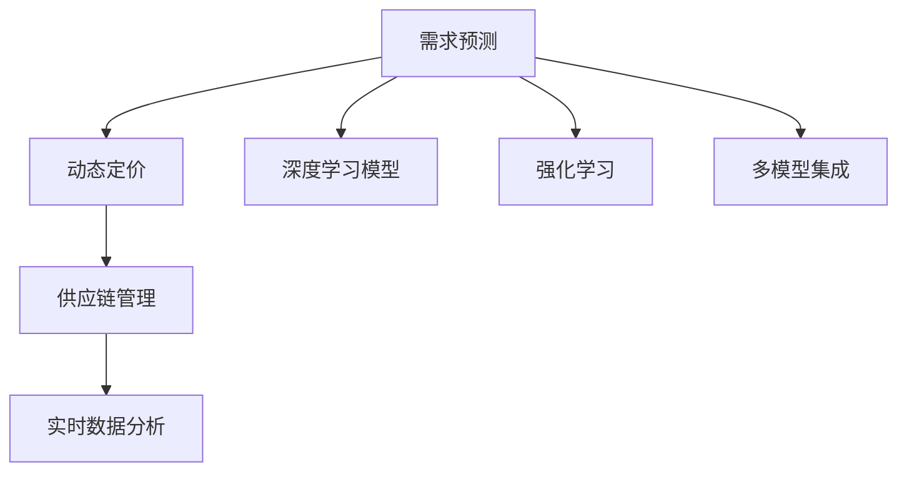
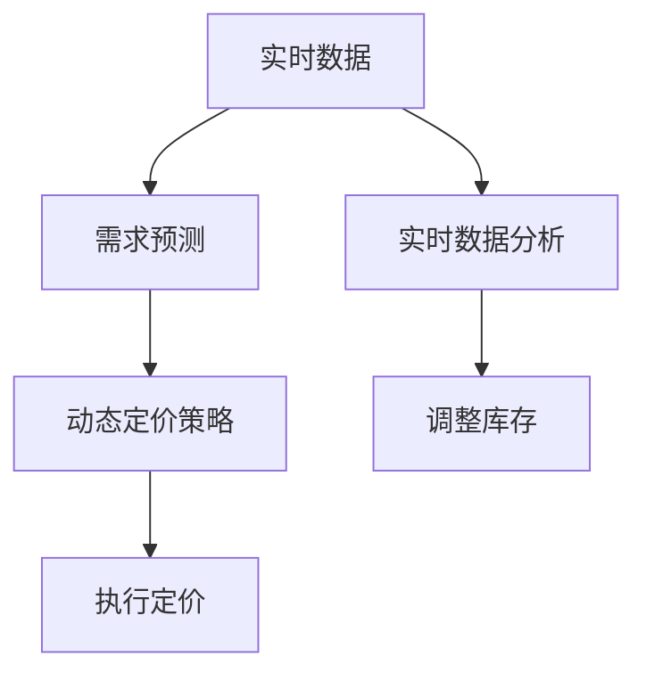
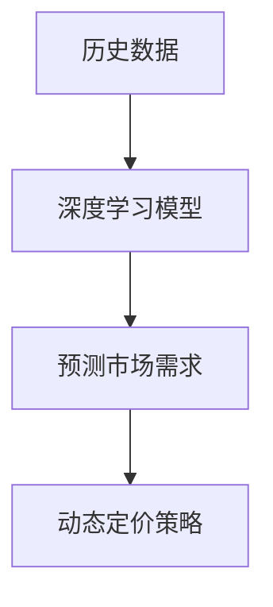
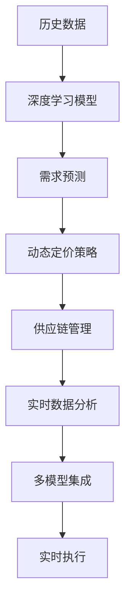

                 

# 价格优化：AI根据市场供需调整价格

> 关键词：价格优化, AI, 市场供需, 动态定价, 需求预测, 供应链管理

## 1. 背景介绍

### 1.1 问题由来
在现代商业世界中，价格是最直观的竞争手段之一。传统的定价策略往往基于固定的成本、历史数据和经验法则，难以适应快速变化的市场环境。随着人工智能（AI）技术的发展，越来越多的企业开始利用AI来实时监控市场供需，动态调整产品价格，以优化收益和市场占有率。

### 1.2 问题核心关键点
价格优化的核心在于实时地理解市场需求和供给情况，并根据这些数据来调整价格。核心技术包括：
1. 需求预测：使用历史数据和实时数据，预测未来需求的变化趋势。
2. 动态定价：根据预测的需求，实时调整产品价格。
3. 供应链管理：实时监控库存和供应链状况，确保价格调整策略的可行性。

### 1.3 问题研究意义
价格优化通过精准的市场分析，可以大幅提升企业的盈利能力和市场竞争力。具体而言：
1. 提高收益：在需求旺盛时提高价格，在需求低迷时降低价格，最大化利润。
2. 优化库存：动态调整价格可以更精准地匹配市场需求，减少库存积压。
3. 竞争优势：快速响应市场变化，提升企业的市场竞争力。

## 2. 核心概念与联系

### 2.1 核心概念概述

为更好地理解基于AI的价格优化方法，本节将介绍几个密切相关的核心概念：

- **动态定价**：指根据市场供需实时调整商品价格的策略。通过动态定价，企业可以在需求高峰时提价，需求低谷时降价，从而优化整体收益。

- **需求预测**：使用历史数据和实时数据，预测未来市场需求的变化。预测的准确性直接影响动态定价的效果。

- **供应链管理**：实时监控供应链的各个环节，包括原材料供应、生产、物流等，确保价格调整策略的可行性。

- **深度学习模型**：利用深度神经网络进行需求预测和动态定价，通过大量的历史数据学习市场需求和供给的规律。

- **强化学习**：通过模拟市场环境，训练模型学习最优的价格调整策略，逐步优化定价效果。

- **实时数据分析**：实时获取和分析市场数据，包括价格、销量、库存等，为价格调整提供依据。

- **多模型集成**：将不同的AI模型进行组合，取长补短，提升预测和定价的准确性。

这些核心概念之间的逻辑关系可以通过以下Mermaid流程图来展示：



这个流程图展示了大规模语言模型微调的完整过程。需求预测和供应链管理提供数据基础，深度学习模型和强化学习是主要的定价工具，实时数据分析为决策提供支持，多模型集成提升整体效果。

### 2.2 概念间的关系

这些核心概念之间存在着紧密的联系，形成了动态定价的完整生态系统。下面我们通过几个Mermaid流程图来展示这些概念之间的关系。

#### 2.2.1 动态定价的执行流程



这个流程图展示了动态定价的基本流程：首先获取实时数据，预测市场需求，根据预测结果制定动态定价策略，执行定价，并实时监控库存变化。

#### 2.2.2 深度学习模型的应用



这个流程图展示了深度学习模型在需求预测中的应用。通过大量历史数据训练模型，生成未来需求预测，用于制定动态定价策略。

#### 2.2.3 强化学习的训练过程


这个流程图展示了强化学习训练的过程：在市场环境中模拟训练策略，执行策略并评估结果，根据反馈调整模型参数，优化模型效果。

### 2.3 核心概念的整体架构

最后，我们用一个综合的流程图来展示这些核心概念在大规模语言模型微调过程中的整体架构：



这个综合流程图展示了从数据输入到最终定价执行的完整过程。深度学习模型进行需求预测，动态定价策略生成价格调整策略，供应链管理和实时数据分析提供支持，多模型集成提升整体效果，最终执行定价。

## 3. 核心算法原理 & 具体操作步骤

### 3.1 算法原理概述

基于AI的价格优化，本质上是一个实时决策的问题。其核心在于如何实时地获取和分析市场数据，并根据这些数据调整价格。算法通常分为以下步骤：

1. **数据收集**：实时收集市场数据，包括价格、销量、库存等。
2. **需求预测**：使用深度学习模型对未来需求进行预测。
3. **动态定价**：根据预测需求，实时调整价格。
4. **执行与监控**：将新的价格策略应用到实际市场，并实时监控效果。
5. **模型优化**：根据反馈调整模型参数，提升预测和定价的准确性。

### 3.2 算法步骤详解

以下是基于AI的价格优化的详细操作步骤：

**Step 1: 准备数据集**

首先，需要准备一个包含历史价格、销量、库存等市场数据的数据集。数据集应包含以下关键信息：
- 时间戳：记录数据的时间点。
- 商品ID：商品的唯一标识。
- 价格：商品在不同时间点的售价。
- 销量：商品在不同时间点的销量。
- 库存：商品在不同时间点的库存量。

**Step 2: 构建深度学习模型**

选择或设计一个深度学习模型，用于预测未来市场需求。常用的模型包括：
- 长短期记忆网络（LSTM）：适用于时间序列数据的预测。
- 卷积神经网络（CNN）：适用于图像和文本数据的处理。
- 注意力机制（Attention）：用于处理多变量之间的关系。

**Step 3: 训练深度学习模型**

使用历史数据训练深度学习模型，优化模型参数，使其能够准确预测未来需求。

**Step 4: 实时数据获取与预处理**

实时获取市场数据，包括价格、销量、库存等。对数据进行预处理，去除异常值，标准化数据。

**Step 5: 需求预测**

将实时数据输入深度学习模型，得到未来需求预测结果。

**Step 6: 动态定价**

根据需求预测结果，实时调整商品价格。通常使用动态定价策略，如基于需求的定价、基于成本的定价等。

**Step 7: 执行与监控**

将新的价格策略应用到实际市场，并实时监控价格调整的效果。

**Step 8: 模型优化**

根据实时监控结果，调整模型参数，提升预测和定价的准确性。

### 3.3 算法优缺点

基于AI的价格优化具有以下优点：
1. 实时性：能够实时监控市场变化，快速响应需求波动。
2. 自动化：减少人工干预，提高效率。
3. 精确性：通过深度学习模型，能够准确预测需求，优化定价。

同时，该方法也存在一些缺点：
1. 数据质量要求高：需要高质量、全面、准确的市场数据。
2. 模型复杂度高：深度学习模型的训练和调参需要较高的时间和计算资源。
3. 市场不确定性：市场环境复杂多变，模型预测可能存在误差。

### 3.4 算法应用领域

基于AI的价格优化方法，已经在多个领域得到应用，包括但不限于：

- 零售业：动态调整商品价格，优化库存，提升收益。
- 航空业：根据航班需求调整票价，优化航线运营。
- 酒店业：实时定价，根据需求和季节调整房价。
- 旅游业：根据季节和事件调整旅游产品价格，提升用户满意度。
- 电商：实时监控商品价格和销量，优化促销策略。

随着AI技术的不断进步，基于AI的价格优化方法将在更多领域得到应用，为企业带来更大的竞争优势。

## 4. 数学模型和公式 & 详细讲解 & 举例说明

### 4.1 数学模型构建

假设市场价格为 $p$，需求量为 $d$，供给量为 $s$。需求预测模型为 $f(t)$，其中 $t$ 为时间点。动态定价的目标是最大化收益 $R$：

$$
R = p \cdot d
$$

根据需求预测模型，动态定价策略为：

$$
p(t) = p_0 + \alpha \cdot f(t)
$$

其中 $p_0$ 为初始价格，$\alpha$ 为价格调整系数，$f(t)$ 为需求预测结果。

### 4.2 公式推导过程

以LSTM模型为例，推导需求预测的数学过程：

1. 输入层：输入时间序列数据 $(x_t, y_t)$，其中 $x_t$ 为当前价格和销量，$y_t$ 为历史需求。

2. LSTM层：通过多层LSTM网络，对输入数据进行处理，得到隐藏状态 $h_t$。

3. 输出层：将隐藏状态 $h_t$ 输入全连接层，输出预测结果 $\hat{d}_t$。

4. 损失函数：使用均方误差损失函数，计算预测值与实际值之间的误差。

5. 反向传播：通过反向传播算法，更新模型参数，最小化预测误差。

### 4.3 案例分析与讲解

以一家在线零售商为例，假设其销售的商品为书籍。通过历史数据训练LSTM模型，预测未来30天内的每日需求量。根据需求预测结果，动态调整书籍价格，以达到最佳收益。具体步骤如下：

1. 准备数据集：收集书籍历史价格、销量、库存等数据。

2. 构建LSTM模型：使用Keras或TensorFlow框架构建LSTM模型，设定模型结构。

3. 训练模型：使用历史数据训练模型，优化模型参数。

4. 实时数据获取：通过API获取实时数据，包括当前价格、销量和库存。

5. 需求预测：将实时数据输入LSTM模型，得到未来30天的需求预测。

6. 动态定价：根据需求预测结果，调整书籍价格。假设价格调整系数为0.1，初始价格为$10。

7. 执行与监控：将新的价格策略应用到实际市场，并实时监控价格调整的效果。

8. 模型优化：根据实时监控结果，调整模型参数，提升预测和定价的准确性。

## 5. 项目实践：代码实例和详细解释说明

### 5.1 开发环境搭建

在进行基于AI的价格优化实践前，我们需要准备好开发环境。以下是使用Python进行TensorFlow开发的环境配置流程：

1. 安装Anaconda：从官网下载并安装Anaconda，用于创建独立的Python环境。

2. 创建并激活虚拟环境：
```bash
conda create -n tf-env python=3.8 
conda activate tf-env
```

3. 安装TensorFlow：根据CUDA版本，从官网获取对应的安装命令。例如：
```bash
conda install tensorflow -c conda-forge
```

4. 安装TensorFlow Addons：用于获取TensorFlow的额外组件，如LSTM模型。
```bash
conda install tensorflow-estimator -c conda-forge
```

5. 安装各类工具包：
```bash
pip install numpy pandas scikit-learn matplotlib tqdm jupyter notebook ipython
```

完成上述步骤后，即可在`tf-env`环境中开始价格优化实践。

### 5.2 源代码详细实现

以下是使用TensorFlow实现基于LSTM模型的需求预测和动态定价的代码实现：

```python
import tensorflow as tf
from tensorflow.keras.layers import LSTM, Dense
from tensorflow.keras.models import Sequential
from tensorflow.keras.optimizers import Adam

# 准备数据集
data = pd.read_csv('sales_data.csv')
train_data = data[:'train']
test_data = data['test']
train_price = train_data['price'].values.reshape(-1, 1)
train_selling = train_data['selling'].values.reshape(-1, 1)
train_date = train_data['date'].values.reshape(-1, 1)

# 构建LSTM模型
model = Sequential()
model.add(LSTM(64, input_shape=(train_price.shape[1], 1)))
model.add(Dense(1))
model.compile(optimizer=Adam(), loss='mse')

# 训练模型
model.fit([train_price, train_selling], train_date, epochs=100, batch_size=32)

# 实时数据获取
live_price = live_data['price'].values.reshape(-1, 1)
live_selling = live_data['selling'].values.reshape(-1, 1)
live_date = live_data['date'].values.reshape(-1, 1)

# 需求预测
predict_date = model.predict([live_price, live_selling])
predict_date = predict_date.flatten()

# 动态定价
initial_price = 10
price_adjustment = 0.1
new_price = initial_price + price_adjustment * predict_date[0]

# 输出新价格
print(f"New price: {new_price}")
```

### 5.3 代码解读与分析

让我们再详细解读一下关键代码的实现细节：

**需求预测部分**：
- 准备数据集：使用Pandas读取历史数据集，并分割为训练集和测试集。
- 构建LSTM模型：使用Keras框架构建包含一个LSTM层和一个全连接层的模型，并进行编译。
- 训练模型：使用训练集数据训练模型，优化模型参数。

**实时数据获取与处理**：
- 实时数据获取：通过API或其他方式获取实时价格、销量和日期数据。
- 需求预测：将实时数据输入训练好的模型，得到未来需求预测。

**动态定价部分**：
- 初始价格设定：设定初始价格为$10。
- 价格调整系数：设定价格调整系数为0.1。
- 计算新价格：根据预测结果和初始价格计算新价格。

**代码输出**：
- 打印输出新价格，作为实时决策结果。

## 6. 实际应用场景

### 6.1 零售业

在零售业中，价格优化可以显著提升企业的收益。以一家大型超市为例，通过实时监控销售数据，动态调整商品价格。根据季节变化和节假日促销，智能调价系统可以自动优化价格策略，从而提升整体销售额。

### 6.2 航空业

在航空业中，动态定价可以优化航班运营。通过实时监控航班需求和市场价格，智能调价系统可以自动调整机票价格，达到最佳收益。此外，系统还可以根据不同客户群体，定制个性化的定价策略。

### 6.3 酒店业

在酒店业中，动态定价可以提升客房出租率。通过实时监控客房需求和市场价格，智能调价系统可以自动调整房间价格，优化营收。同时，系统还可以根据客户需求，提供个性化的价格和促销方案。

### 6.4 旅游业

在旅游业中，动态定价可以提升客户满意度。通过实时监控旅游产品需求和市场价格，智能调价系统可以自动调整产品价格，优化客户体验。此外，系统还可以根据客户历史行为，提供个性化的定价和推荐。

### 6.5 电商

在电商中，动态定价可以优化促销策略。通过实时监控商品销量和市场价格，智能调价系统可以自动调整商品价格，优化促销效果。同时，系统还可以根据客户行为，提供个性化的定价和推荐方案。

## 7. 工具和资源推荐

### 7.1 学习资源推荐

为了帮助开发者系统掌握基于AI的价格优化理论基础和实践技巧，这里推荐一些优质的学习资源：

1. 《深度学习入门：基于Python的理论与实现》书籍：介绍深度学习的基本理论和实现方法，适合初学者入门。

2. 《机器学习实战》书籍：详细介绍机器学习的基本算法和应用场景，涵盖多种经典模型和实战案例。

3. 《TensorFlow实战》课程：由Google官方提供，深入讲解TensorFlow框架的使用方法和案例。

4. 《LSTM网络原理与实现》论文：介绍LSTM网络的结构和工作原理，适合进一步学习深度学习。

5. 《强化学习入门》书籍：介绍强化学习的基本理论和应用场景，涵盖多种经典模型和实战案例。

通过对这些资源的学习实践，相信你一定能够快速掌握基于AI的价格优化精髓，并用于解决实际的商业问题。

### 7.2 开发工具推荐

高效的开发离不开优秀的工具支持。以下是几款用于基于AI的价格优化开发的常用工具：

1. TensorFlow：由Google主导开发的开源深度学习框架，生产部署方便，适合大规模工程应用。

2. Keras：基于TensorFlow的高级API，使用简洁，适合快速原型开发。

3. PyTorch：基于Python的开源深度学习框架，灵活动态，适合研究实验。

4. Jupyter Notebook：强大的交互式开发环境，适合数据处理和模型训练。

5. Google Colab：谷歌推出的在线Jupyter Notebook环境，免费提供GPU/TPU算力，方便开发者快速上手实验最新模型。

6. Weights & Biases：模型训练的实验跟踪工具，可以记录和可视化模型训练过程中的各项指标，方便对比和调优。

7. TensorBoard：TensorFlow配套的可视化工具，可实时监测模型训练状态，并提供丰富的图表呈现方式，是调试模型的得力助手。

合理利用这些工具，可以显著提升基于AI的价格优化任务的开发效率，加快创新迭代的步伐。

### 7.3 相关论文推荐

基于AI的价格优化技术的发展源于学界的持续研究。以下是几篇奠基性的相关论文，推荐阅读：

1. "A Deep Learning Approach to Dynamic Pricing in the Sharing Economy"：介绍深度学习在共享经济领域动态定价的应用。

2. "LSTM Networks for Dynamic Pricing"：使用LSTM网络进行动态定价，并比较不同模型的效果。

3. "Adaptive Dynamic Pricing with Reinforcement Learning"：通过强化学习优化动态定价策略，提升收益。

4. "Supply Chain Dynamics and Dynamic Pricing in a Novel Procedure"：研究供应链管理中的动态定价问题。

5. "Real-Time Demand Forecasting with Long Short-Term Memory Networks"：使用LSTM网络进行实时需求预测，并应用于动态定价。

这些论文代表了大规模语言模型微调技术的发展脉络。通过学习这些前沿成果，可以帮助研究者把握学科前进方向，激发更多的创新灵感。

除上述资源外，还有一些值得关注的前沿资源，帮助开发者紧跟基于AI的价格优化技术的最新进展，例如：

1. arXiv论文预印本：人工智能领域最新研究成果的发布平台，包括大量尚未发表的前沿工作，学习前沿技术的必读资源。

2. 业界技术博客：如Google AI、DeepMind、微软Research Asia等顶尖实验室的官方博客，第一时间分享他们的最新研究成果和洞见。

3. 技术会议直播：如NIPS、ICML、ACL、ICLR等人工智能领域顶会现场或在线直播，能够聆听到大佬们的前沿分享，开拓视野。

4. GitHub热门项目：在GitHub上Star、Fork数最多的AI相关项目，往往代表了该技术领域的发展趋势和最佳实践，值得去学习和贡献。

5. 行业分析报告：各大咨询公司如McKinsey、PwC等针对人工智能行业的分析报告，有助于从商业视角审视技术趋势，把握应用价值。

总之，对于基于AI的价格优化技术的学习和实践，需要开发者保持开放的心态和持续学习的意愿。多关注前沿资讯，多动手实践，多思考总结，必将收获满满的成长收益。

## 8. 总结：未来发展趋势与挑战

### 8.1 总结

本文对基于AI的价格优化方法进行了全面系统的介绍。首先阐述了价格优化的背景和意义，明确了动态定价和需求预测在其中的核心作用。其次，从原理到实践，详细讲解了动态定价的数学原理和操作步骤，给出了基于LSTM模型的需求预测和动态定价的代码实现。同时，本文还探讨了动态定价在零售、航空、酒店、旅游、电商等多个行业领域的应用前景，展示了其广泛的应用价值。此外，本文精选了动态定价技术的各类学习资源，力求为读者提供全方位的技术指引。

通过本文的系统梳理，可以看到，基于AI的价格优化技术正在成为现代商业中的重要工具，极大地提升了企业的盈利能力和市场竞争力。未来，伴随AI技术的不断进步，动态定价方法将进一步优化市场响应速度和效果，为经济社会发展注入新的动力。

### 8.2 未来发展趋势

展望未来，基于AI的价格优化技术将呈现以下几个发展趋势：

1. 模型复杂度提高：随着深度学习模型的不断发展，未来将出现更多复杂的动态定价模型，如多任务学习、联合学习等。

2. 数据利用更加深入：通过数据挖掘和数据增强，更好地利用历史和实时数据，提升动态定价的精确性。

3. 多模态数据融合：将文本、图像、语音等多模态数据融合，提升动态定价模型的表现。

4. 强化学习应用广泛：通过强化学习优化定价策略，提升动态定价的智能化水平。

5. 自动化和智能化：通过自动化算法和智能决策系统，减少人工干预，提高效率。

6. 跨领域应用拓展：动态定价技术将在更多行业得到应用，提升各行业的运营效率。

以上趋势凸显了基于AI的价格优化技术的广阔前景。这些方向的探索发展，必将进一步提升商业决策的智能化和科学化水平，为经济社会发展注入新的动力。

### 8.3 面临的挑战

尽管基于AI的价格优化技术已经取得了瞩目成就，但在迈向更加智能化、普适化应用的过程中，它仍面临着诸多挑战：

1. 数据质量瓶颈：需要高质量、全面、准确的市场数据，数据获取和清洗难度大。

2. 模型复杂度高：深度学习模型训练复杂，需要较高的计算资源和时间。

3. 市场不确定性：市场环境复杂多变，模型预测可能存在误差。

4. 实时性要求高：需要快速响应市场变化，实时调整价格策略。

5. 多变量协同：多变量协同建模和优化，难度大。

6. 模型鲁棒性不足：模型可能出现泛化能力不足，对异常值敏感。

正视基于AI的价格优化面临的这些挑战，积极应对并寻求突破，将是大规模语言模型微调走向成熟的必由之路。相信随着学界和产业界的共同努力，这些挑战终将一一被克服，动态定价方法必将在构建智能商业生态中扮演越来越重要的角色。

### 8.4 研究展望

面对基于AI的价格优化所面临的种种挑战，未来的研究需要在以下几个方面寻求新的突破：

1. 探索多变量协同建模方法：将不同变量进行协同建模，提升动态定价的精度。

2. 研究多任务学习范式：通过多任务学习，提高模型的泛化能力和应用范围。

3. 引入强化学习机制：通过强化学习优化定价策略，提升动态定价的效果。

4. 研究跨领域应用：将动态定价技术应用于更多行业，提升各行业的运营效率。

5. 开发自动化决策系统：通过自动化决策系统，减少人工干预，提高效率。

6. 增强模型鲁棒性：通过模型优化和数据增强，提高模型的鲁棒性和泛化能力。

这些研究方向的探索，必将引领基于AI的价格优化技术迈向更高的台阶，为构建智能商业生态和智能化运营提供新的工具和方法。面向未来，基于AI的价格优化技术还需要与其他AI技术进行更深入的融合，如知识表示、因果推理、强化学习等，多路径协同发力，共同推动商业决策的智能化进程。只有勇于创新、敢于突破，才能不断拓展价格优化的边界，让AI技术更好地造福商业实践。

## 9. 附录：常见问题与解答

**Q1：价格优化是否适用于所有行业？**

A: 价格优化技术在零售、航空、酒店、旅游、电商等多个行业中都得到了应用，并取得了良好的效果。但对于一些特殊行业，如医疗、金融等，还需要结合行业特性进行优化。

**Q2：如何评估价格优化的效果？**

A: 价格优化的效果可以通过以下几个指标进行评估：
1. 收益优化：价格优化前后的收益变化。
2. 市场占有率：价格优化前后的市场份额变化。
3. 库存管理：价格优化前后的库存水平变化。
4. 客户满意度：价格优化前后的客户反馈变化。
5. 运营成本：价格优化前后的运营成本变化。

**Q3：如何选择适合的定价策略？**

A: 选择合适的定价策略需要综合考虑市场环境、产品特性、客户需求等因素。常见的定价策略包括：
1. 基于需求的价格：根据市场需求调整价格。
2. 基于成本的价格：根据产品成本调整价格。
3. 动态价格：根据市场变化实时调整价格。
4. 差别价格：根据不同客户群体设定不同价格。

**Q4：价格优化过程中需要注意哪些问题？**

A: 价格优化过程中需要注意以下几个问题：
1. 数据质量：确保数据的准确性和完整性。
2. 模型选择：选择适合的模型和算法，进行参数优化。
3. 实时性：确保价格调整策略的实时性和高效性。
4. 客户接受度：考虑客户对价格变化的接受度和满意度。
5. 市场环境：考虑市场环境的变化，及时

