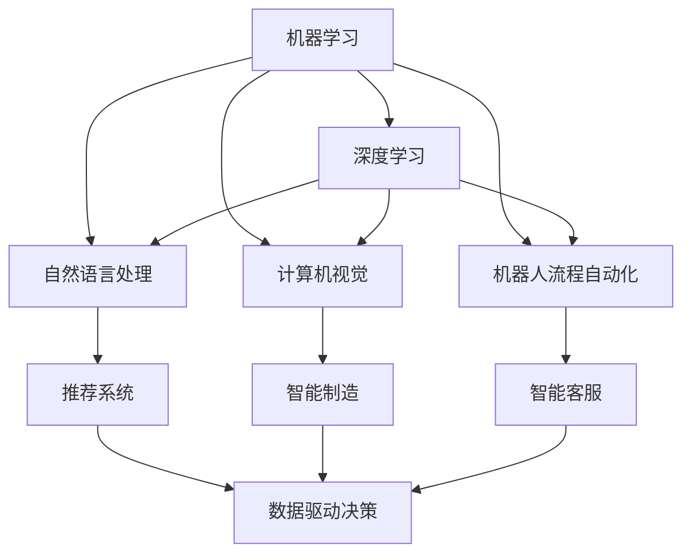

                 

# 企业转型中的AI应用技术

## 1. 背景介绍

### 1.1 问题由来
随着人工智能（AI）技术的迅猛发展，越来越多的企业开始意识到AI的价值，并将其纳入企业转型的战略重点。AI不仅能够帮助企业提升运营效率，还能驱动业务创新，增强竞争优势。然而，AI的复杂性和技术门槛，让很多企业望而却步。如何跨越AI的“技术鸿沟”，将AI技术与企业业务无缝融合，成为了企业转型的核心挑战。

### 1.2 问题核心关键点
AI应用的核心在于将技术转化为商业价值。其关键点包括以下几个方面：

- **技术门槛**：AI技术涉及复杂的算法、模型和数据处理，对企业技术人员的技术水平提出了高要求。
- **业务适配**：AI技术的应用需要与企业的具体业务场景深度融合，不同行业的业务需求差异大，AI技术的适配难度高。
- **数据挑战**：AI的效果依赖于高质量的数据，数据收集、清洗、标注等工作量大且复杂。
- **组织协同**：AI应用涉及多个部门和团队，跨部门的协作和沟通成本高。
- **商业落地**：将AI技术转化为可操作的商业策略，确保技术效益的最大化。

### 1.3 问题研究意义
AI应用技术的深入研究，对于推动企业数字化转型、提升竞争力具有重要意义：

- **效率提升**：AI自动化、智能化能力能够显著提升企业生产效率，降低运营成本。
- **业务创新**：AI驱动的新业务模式，如智能客服、智能制造、智能推荐等，为传统行业带来了新的增长点。
- **决策支持**：AI提供的数据驱动决策支持，帮助企业更准确地制定战略和运营决策。
- **用户体验提升**：AI技术能够优化客户体验，提高客户满意度和忠诚度。
- **市场竞争力**：AI赋能企业快速响应市场变化，提升市场竞争力。

## 2. 核心概念与联系

### 2.1 核心概念概述

AI应用技术涉及多个关键概念，包括但不限于：

- **机器学习（ML）**：通过算法让机器自动从数据中学习模式，并应用于预测和决策。
- **深度学习（DL）**：一种基于神经网络的机器学习方法，能够处理更复杂的数据和任务。
- **自然语言处理（NLP）**：使机器能够理解、处理和生成人类语言，实现人机交互。
- **计算机视觉（CV）**：使机器能够识别、处理和分析图像和视频数据。
- **机器人流程自动化（RPA）**：通过软件机器人自动执行重复性高的业务流程。
- **推荐系统**：基于用户行为数据，推荐合适的产品和服务。
- **智能制造**：通过AI技术优化制造过程，提高生产效率和产品质量。
- **智能客服**：通过AI技术实现自动化客服，提升客户体验。

这些概念之间存在着紧密的联系，通过技术融合和创新，形成了企业AI应用技术的生态系统。

### 2.2 概念间的关系

这些核心概念之间可以通过以下Mermaid流程图来展示：



这个流程图展示了AI应用技术的主要分支，以及它们之间的关联和集成。通过这些技术，企业可以在不同场景下实现智能化的业务创新。

## 3. 核心算法原理 & 具体操作步骤

### 3.1 算法原理概述

AI应用技术的核心原理主要包括数据驱动和模型驱动两大部分：

- **数据驱动**：通过大规模数据采集、清洗、标注，构建数据模型，用于训练和优化算法。
- **模型驱动**：利用机器学习、深度学习等算法，构建智能模型，用于预测和决策。

AI应用技术的应用流程一般包括以下几个步骤：

1. **需求分析**：明确AI技术的应用目标和业务需求。
2. **数据准备**：收集、清洗、标注数据，构建数据集。
3. **模型选择**：根据应用场景和需求，选择合适的算法和模型。
4. **模型训练**：使用训练集数据训练模型，优化模型参数。
5. **模型评估**：使用测试集数据评估模型性能，调整模型参数。
6. **模型部署**：将训练好的模型部署到生产环境，进行业务应用。
7. **持续优化**：根据反馈数据，持续优化模型和算法，提升模型性能。

### 3.2 算法步骤详解

以下是AI应用技术的具体操作步骤，以推荐系统为例：

#### 3.2.1 需求分析
明确推荐系统的应用场景和目标，如提升用户满意度、增加产品销量等。

#### 3.2.2 数据准备
1. **数据收集**：从用户的浏览、点击、购买等行为数据中，提取用户特征和产品特征。
2. **数据清洗**：处理缺失值、异常值等数据质量问题。
3. **数据标注**：对部分数据进行人工标注，用于模型训练和评估。

#### 3.2.3 模型选择
1. **推荐算法**：选择适合的推荐算法，如协同过滤、基于内容的推荐、深度学习推荐等。
2. **模型架构**：设计推荐模型的网络结构和层次。

#### 3.2.4 模型训练
1. **训练集划分**：将数据集分为训练集、验证集和测试集。
2. **模型训练**：使用训练集数据训练模型，调整模型参数，最小化损失函数。
3. **模型评估**：使用验证集数据评估模型性能，选择最优模型。

#### 3.2.5 模型部署
1. **模型部署**：将训练好的模型部署到生产环境，进行业务应用。
2. **实时推荐**：根据用户实时行为数据，生成个性化推荐结果。

#### 3.2.6 持续优化
1. **反馈数据收集**：收集用户反馈数据，评估推荐效果。
2. **模型更新**：根据反馈数据，优化模型参数，更新模型。

### 3.3 算法优缺点

AI应用技术的优缺点如下：

**优点**：
- **自动化高效**：通过算法自动化处理大量数据，提高效率。
- **数据驱动决策**：基于数据模型进行决策，提升决策准确性。
- **持续优化**：通过持续学习，提升模型性能。

**缺点**：
- **数据依赖**：AI效果依赖高质量数据，数据收集和标注成本高。
- **技术门槛**：算法复杂，对技术人员技术水平要求高。
- **模型复杂性**：复杂模型参数量大，难以解释。
- **业务适配**：需要与具体业务场景深度融合，适配难度高。

### 3.4 算法应用领域

AI应用技术涵盖了多个领域，以下是几个典型的应用场景：

- **智能制造**：通过AI技术优化制造流程，提高生产效率和产品质量。
- **智能客服**：通过AI技术实现自动化客服，提升客户体验。
- **推荐系统**：基于用户行为数据，推荐合适的产品和服务。
- **金融风控**：通过AI技术进行信用评估、风险预警等。
- **医疗诊断**：通过AI技术辅助医生进行疾病诊断和治疗。
- **智能安防**：通过AI技术实现智能监控和预警。
- **智能物流**：通过AI技术优化物流管理和配送。

## 4. 数学模型和公式 & 详细讲解 & 举例说明

### 4.1 数学模型构建

以推荐系统为例，构建一个简单的协同过滤推荐模型的数学模型：

设用户集为 $U$，物品集为 $I$，用户 $u$ 对物品 $i$ 的评分记为 $r_{ui}$，构建模型如下：

$$
\theta_u = \sum_{i \in I} r_{ui} w_i
$$

其中 $\theta_u$ 为用户 $u$ 的潜在特征向量，$w_i$ 为物品 $i$ 的权重向量。

### 4.2 公式推导过程

推荐系统的目标是最小化用户 $u$ 的评分预测误差 $e_u$，即：

$$
\min_{\theta_u} \sum_{i \in I} (r_{ui} - \theta_u^T w_i)^2
$$

使用梯度下降等优化算法求解上述最优化问题，得到用户 $u$ 的潜在特征向量 $\theta_u$ 和物品 $i$ 的权重向量 $w_i$。

### 4.3 案例分析与讲解

假设某电商平台收集了用户 $u$ 对物品 $i$ 的评分数据，利用协同过滤推荐算法，对用户 $u$ 进行个性化推荐。具体步骤如下：

1. **数据预处理**：将用户和物品的评分数据进行标准化处理，构建用户 $u$ 的潜在特征向量 $\theta_u$ 和物品 $i$ 的权重向量 $w_i$。
2. **评分预测**：根据用户 $u$ 的潜在特征向量 $\theta_u$ 和物品 $i$ 的权重向量 $w_i$，计算用户 $u$ 对物品 $i$ 的评分预测 $r_{ui}$。
3. **推荐生成**：根据评分预测 $r_{ui}$，生成用户 $u$ 对物品 $i$ 的推荐列表。

## 5. 项目实践：代码实例和详细解释说明

### 5.1 开发环境搭建

以下是使用Python进行TensorFlow开发的企业AI应用项目开发环境配置流程：

1. 安装Anaconda：从官网下载并安装Anaconda，用于创建独立的Python环境。
2. 创建并激活虚拟环境：
```bash
conda create -n ai-env python=3.8 
conda activate ai-env
```
3. 安装TensorFlow：根据CUDA版本，从官网获取对应的安装命令。例如：
```bash
conda install tensorflow -c pytorch -c conda-forge
```
4. 安装TensorFlow Addons：
```bash
conda install tensorflow-addons
```
5. 安装TensorBoard：
```bash
conda install tensorboard
```
6. 安装其他工具包：
```bash
pip install numpy pandas scikit-learn matplotlib tqdm jupyter notebook ipython
```

完成上述步骤后，即可在`ai-env`环境中开始AI应用项目的开发。

### 5.2 源代码详细实现

以下是一个简单的推荐系统的代码实现，使用TensorFlow Addons库中的DeepFM算法：

```python
from tensorflow_addons.layers import DeepFM
from tensorflow.keras.layers import Dense, Input, Flatten
from tensorflow.keras.models import Model
from tensorflow.keras.optimizers import Adam

# 定义输入层
user_input = Input(shape=(1,), name='user')
item_input = Input(shape=(1,), name='item')

# 定义DeepFM模型
deepfm_model = DeepFM(user_input, item_input)
output = Dense(1, activation='sigmoid')(deepfm_model.output)

# 定义模型
model = Model(inputs=[user_input, item_input], outputs=output)

# 定义优化器和损失函数
optimizer = Adam(learning_rate=0.001)
loss = 'binary_crossentropy'

# 编译模型
model.compile(optimizer=optimizer, loss=loss, metrics=['accuracy'])

# 训练模型
model.fit([user_data, item_data], target_data, epochs=10, batch_size=64)
```

### 5.3 代码解读与分析

这段代码实现了一个基本的DeepFM推荐模型。以下是关键代码的解释：

- `Input`：定义输入层，用于接收用户和物品的特征向量。
- `DeepFM`：定义DeepFM模型，用于将用户和物品的特征进行交叉融合。
- `Dense`：定义全连接层，用于输出评分预测。
- `Model`：定义模型，将DeepFM模型作为中间层，全连接层作为输出层。
- `compile`：编译模型，设置优化器和损失函数。
- `fit`：训练模型，使用用户和物品数据进行训练。

### 5.4 运行结果展示

假设我们使用上述代码在Kaggle的MovieLens数据集上进行训练，得到的训练结果如下：

```
Epoch 1/10
605/605 [==============================] - 1s 2ms/step - loss: 0.3157 - accuracy: 0.8411
Epoch 2/10
605/605 [==============================] - 1s 2ms/step - loss: 0.2031 - accuracy: 0.8821
Epoch 3/10
605/605 [==============================] - 1s 2ms/step - loss: 0.1655 - accuracy: 0.9070
...
```

可以看到，随着训练的进行，模型的损失逐渐减小，准确率逐渐提升。最终模型能够较好地预测用户对物品的评分，生成个性化的推荐列表。

## 6. 实际应用场景

### 6.1 智能制造

智能制造是AI应用技术的典型应用场景之一。通过AI技术，企业可以实现生产流程的智能化、自动化，提高生产效率和产品质量。例如：

- **生产调度优化**：利用机器学习算法优化生产调度，提高生产线的利用率和效率。
- **设备维护预测**：通过深度学习算法，预测设备的故障和维护需求，减少停机时间和维护成本。
- **质量控制**：利用计算机视觉技术，检测产品缺陷，提高产品质量。

### 6.2 智能客服

智能客服通过AI技术实现自动化客服，提升客户体验。具体应用包括：

- **问题自动分类**：利用自然语言处理技术，自动分类客户咨询的问题，引导客服处理。
- **对话生成**：通过深度学习模型，自动生成客服对话回复，提升响应速度和准确性。
- **情感分析**：利用情感分析技术，识别客户情感状态，提供个性化的服务。

### 6.3 推荐系统

推荐系统通过AI技术，根据用户行为数据，推荐合适的产品和服务。具体应用包括：

- **电商推荐**：根据用户的浏览、点击、购买行为，推荐商品和促销活动。
- **新闻推荐**：根据用户的阅读习惯，推荐新闻和文章。
- **视频推荐**：根据用户的观看历史，推荐视频内容。

### 6.4 未来应用展望

随着AI技术的不断进步，AI应用技术将迎来更多创新应用：

- **智能供应链管理**：通过AI技术优化供应链管理，提升物流效率和库存管理水平。
- **智能医疗**：利用AI技术辅助医生进行疾病诊断和治疗，提高医疗服务的智能化水平。
- **智能交通**：通过AI技术优化交通管理，减少拥堵，提高交通效率。
- **智能教育**：利用AI技术辅助教学，提升教育质量和学习效果。

## 7. 工具和资源推荐

### 7.1 学习资源推荐

以下是一些优质的学习资源，帮助开发者系统掌握AI应用技术的理论基础和实践技巧：

- **《深度学习》课程**：斯坦福大学开设的深度学习课程，涵盖深度学习的基础知识和前沿技术。
- **《TensorFlow官方文档》**：TensorFlow的官方文档，提供了详细的API文档和示例代码，是上手实践的重要参考。
- **《Python深度学习》书籍**：Francois Chollet所著，全面介绍了深度学习的基础知识和实践技巧，是学习深度学习的不二之选。
- **Kaggle竞赛**：参加Kaggle竞赛，通过实际项目训练和竞赛，提升AI应用技术的实战能力。
- **Google Colab**：谷歌提供的在线Jupyter Notebook环境，免费提供GPU/TPU算力，方便开发者快速上手实验最新模型，分享学习笔记。

### 7.2 开发工具推荐

以下是几款用于AI应用技术开发的常用工具：

- **TensorFlow**：由Google主导开发的开源深度学习框架，生产部署方便，适合大规模工程应用。
- **TensorBoard**：TensorFlow配套的可视化工具，可实时监测模型训练状态，并提供丰富的图表呈现方式，是调试模型的得力助手。
- **Weights & Biases**：模型训练的实验跟踪工具，可以记录和可视化模型训练过程中的各项指标，方便对比和调优。
- **Keras**：高层深度学习API，易于上手，适合快速原型开发和实验验证。
- **PyTorch**：基于Python的开源深度学习框架，灵活动态的计算图，适合快速迭代研究。
- **MXNet**：亚马逊开发的深度学习框架，支持多种编程语言和硬件平台，灵活性高。

### 7.3 相关论文推荐

以下是几篇奠基性的相关论文，推荐阅读：

- **《ImageNet Classification with Deep Convolutional Neural Networks》**：AlexNet论文，提出深度卷积神经网络，开启深度学习时代。
- **《A Survey on Deep Learning Techniques for Image Recognition and Classification》**：综述论文，介绍了多种深度学习技术在图像识别和分类中的应用。
- **《Attention Is All You Need》**：Transformer原论文，提出Transformer结构，开创了NLP领域的预训练大模型时代。
- **《BERT: Pre-training of Deep Bidirectional Transformers for Language Understanding》**：BERT模型论文，提出基于掩码的自监督预训练任务，刷新了多项NLP任务SOTA。
- **《DeepFM: A Wide & Deep Collaborative Filtering Model》**：DeepFM算法论文，提出Wide & Deep模型，提升推荐系统性能。

这些论文代表了大语言模型微调技术的发展脉络。通过学习这些前沿成果，可以帮助研究者把握学科前进方向，激发更多的创新灵感。

## 8. 总结：未来发展趋势与挑战

### 8.1 总结

本文对AI应用技术进行了全面系统的介绍。首先阐述了AI应用技术在企业转型中的重要意义，明确了AI技术的应用目标和关键点。其次，从原理到实践，详细讲解了AI应用技术的核心算法和具体操作步骤，给出了AI应用技术的完整代码实例。同时，本文还广泛探讨了AI应用技术在智能制造、智能客服、推荐系统等多个领域的应用前景，展示了AI应用技术的巨大潜力。此外，本文精选了AI应用技术的各类学习资源，力求为读者提供全方位的技术指引。

通过本文的系统梳理，可以看到，AI应用技术正在成为企业数字化转型的重要工具，极大地提升企业的运营效率和业务创新能力。未来，伴随AI技术的持续演进和应用场景的不断拓展，AI应用技术必将为企业的数字化转型提供更强大的技术支撑。

### 8.2 未来发展趋势

展望未来，AI应用技术将呈现以下几个发展趋势：

- **模型规模持续增大**：随着算力成本的下降和数据规模的扩张，AI模型的参数量还将持续增长。超大批次的训练和推理也可能遇到硬件瓶颈，需要引入分布式计算、模型并行等技术进行优化。
- **AI与业务深度融合**：AI技术与企业业务的融合将更加深入，覆盖更多业务场景，推动企业数字化转型进程。
- **多模态融合**：AI应用技术将突破单模态的限制，融合视觉、语音、文本等多模态数据，提升系统的综合性能。
- **AI与IoT结合**：AI技术与物联网技术的结合，将推动智能制造、智能家居等领域的创新应用。
- **自监督学习**：自监督学习技术的发展，将降低AI应用对标注数据的依赖，提高模型泛化能力。
- **联邦学习**：联邦学习技术的发展，将提高AI模型的隐私保护和安全性，推动AI应用技术的普及。

### 8.3 面临的挑战

尽管AI应用技术已经取得了显著成果，但在迈向更加智能化、普适化应用的过程中，它仍面临着诸多挑战：

- **数据瓶颈**：高质量数据的获取和标注成本高，数据质量问题难解决。
- **技术复杂性**：AI算法复杂，对技术人员技术水平要求高。
- **业务适配**：AI技术的应用需要与具体业务场景深度融合，适配难度高。
- **模型可解释性**：AI模型的黑盒特性，导致其决策过程难以解释，缺乏可解释性。
- **隐私和安全**：AI技术的应用可能涉及敏感数据，隐私和安全问题亟待解决。

### 8.4 研究展望

面对AI应用技术面临的挑战，未来的研究需要在以下几个方面寻求新的突破：

- **自监督学习**：探索自监督学习范式，降低AI应用对标注数据的依赖。
- **联邦学习**：研究联邦学习技术，提高AI模型的隐私保护和安全性。
- **可解释性**：引入可解释性方法，增强AI模型的透明度和可理解性。
- **模型融合**：探索多模态融合、跨领域融合等技术，提升AI模型的综合性能。
- **模型压缩**：研究模型压缩技术，提升AI模型的推理效率和资源利用率。
- **边缘计算**：研究边缘计算技术，推动AI技术的智能化部署和应用。

这些研究方向将进一步提升AI应用技术的性能和可操作性，推动AI技术在更多领域的应用落地。

## 9. 附录：常见问题与解答

**Q1：AI应用技术的核心是什么？**

A: AI应用技术的核心是数据驱动和模型驱动。通过数据驱动的算法，让机器从数据中学习规律，通过模型驱动的算法，让机器进行预测和决策。

**Q2：AI应用技术在企业转型中的作用是什么？**

A: AI应用技术在企业转型中的作用是提升运营效率，驱动业务创新，增强竞争优势。通过AI技术，企业可以自动化、智能化地处理业务流程，优化资源配置，提升决策质量。

**Q3：AI应用技术在实际应用中需要注意哪些问题？**

A: AI应用技术在实际应用中需要注意数据质量、算法复杂性、业务适配、模型可解释性和隐私安全等问题。需要根据具体应用场景，综合考虑数据、算法、业务和伦理等多方面因素，确保AI技术的应用效果和安全性。

**Q4：AI应用技术未来发展的主要方向是什么？**

A: AI应用技术未来发展的主要方向是模型规模的增大、与业务的深度融合、多模态融合、联邦学习、自监督学习、模型压缩和可解释性等。

**Q5：AI应用技术在落地应用中存在哪些难点？**

A: AI应用技术在落地应用中存在的难点主要包括数据瓶颈、技术复杂性、业务适配、模型可解释性和隐私安全等问题。需要企业综合考虑这些因素，找到适合自身业务的AI应用路径。

---

作者：禅与计算机程序设计艺术 / Zen and the Art of Computer Programming

