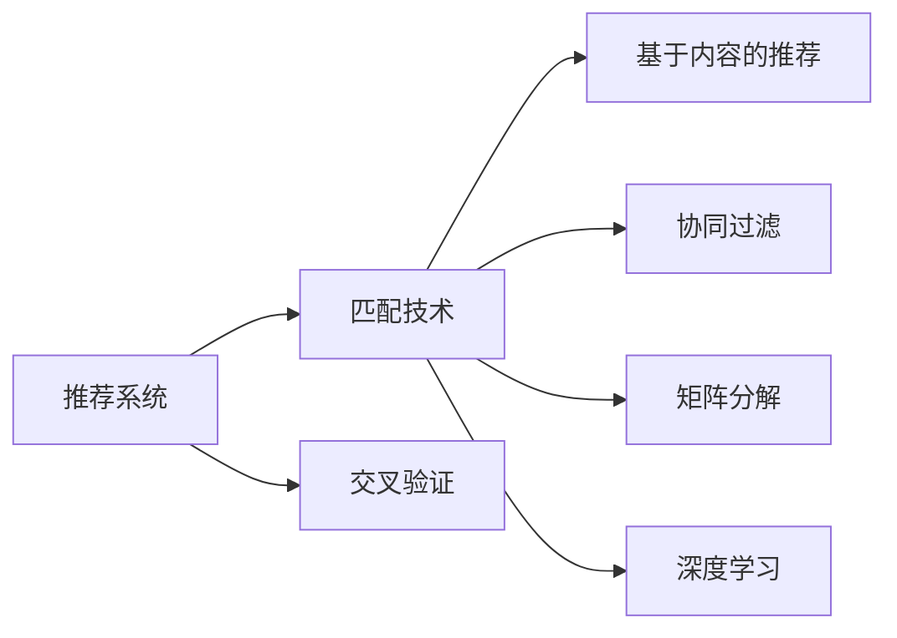
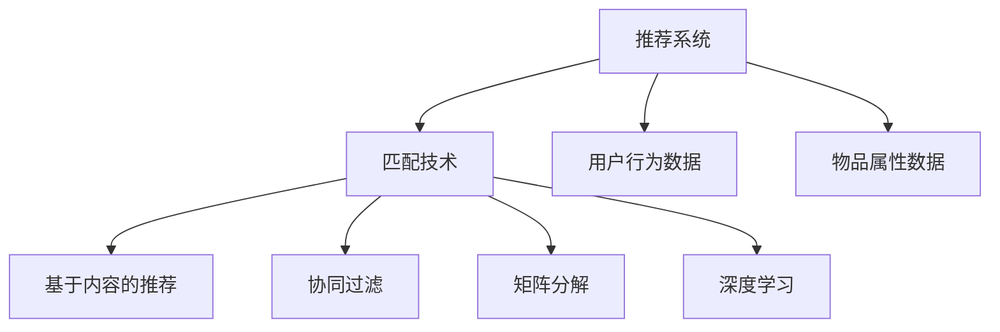
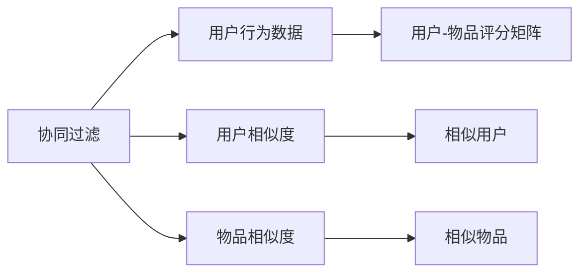
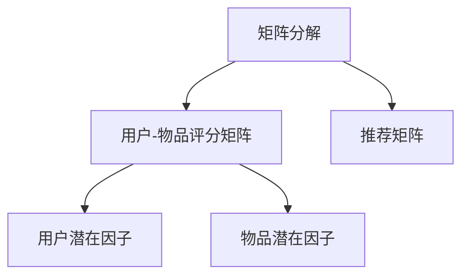
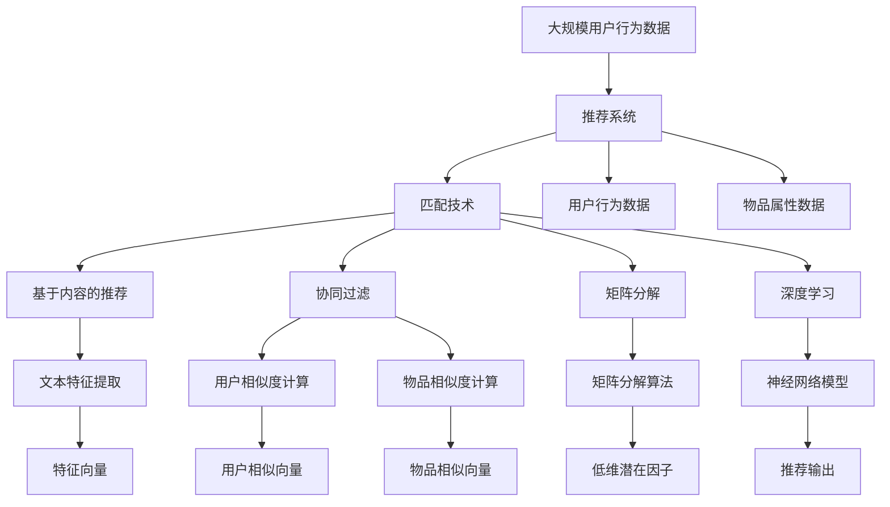

                 

# 传统搜索推荐系统的匹配技术

## 1. 背景介绍

### 1.1 问题由来
随着互联网技术的快速发展，用户对信息检索和推荐系统的需求日益增长。传统的基于关键词的搜索引擎，虽然可以快速定位到相关的网页，但无法提供个性化的信息推荐。而推荐系统则通过用户的浏览历史、行为数据等，主动为用户推荐内容，满足个性化需求。

然而，传统的推荐系统在匹配用户兴趣和物品属性时，往往存在一定局限性，导致推荐效果不理想。例如，基于内容的推荐方法过于简单，无法充分考虑用户的多样化需求；协同过滤方法虽然能利用用户行为数据，但在数据稀疏、冷启动等问题上表现不佳。因此，如何改进推荐系统的匹配技术，提升推荐效果，成为当前研究的重要课题。

### 1.2 问题核心关键点
推荐系统匹配技术的核心在于如何更准确地理解用户兴趣和物品属性，从而实现更精确的推荐。当前，推荐系统主要采用以下几种匹配方法：

- 基于内容的推荐方法：通过分析物品的文本描述、元数据等，提取特征向量与用户兴趣向量匹配，实现推荐。

- 协同过滤方法：基于用户历史行为数据，通过寻找相似用户或物品，构建用户-物品评分矩阵，实现推荐。

- 矩阵分解方法：将用户-物品评分矩阵进行矩阵分解，提取低维度的潜在因子，用于推荐。

- 基于深度学习的方法：如神经网络、协同训练等，通过学习用户行为数据和物品属性特征，实现更复杂的匹配和推荐。

这些匹配技术各有优缺点，需要根据具体应用场景选择合适的方法。

## 2. 核心概念与联系

### 2.1 核心概念概述

为更好地理解推荐系统匹配技术，本节将介绍几个密切相关的核心概念：

- 推荐系统：利用用户行为数据和物品属性信息，为用户推荐相关物品的系统。

- 匹配技术：通过算法计算用户兴趣和物品属性之间的相似度，用于推荐决策的过程。

- 协同过滤：通过分析用户历史行为数据，寻找相似用户或物品，实现推荐。

- 矩阵分解：将用户-物品评分矩阵进行分解，提取低维度的潜在因子，用于推荐。

- 深度学习：通过神经网络等深度学习模型，学习用户行为数据和物品属性特征，实现更复杂的匹配和推荐。

- 交叉验证：通过将数据集分为训练集和测试集，交叉验证模型性能的过程。

这些核心概念之间的逻辑关系可以通过以下Mermaid流程图来展示：



这个流程图展示了大语言模型微调过程中各个核心概念的关系和作用：

1. 推荐系统以匹配技术为基础，通过不同的匹配方法实现推荐。
2. 匹配技术包括基于内容的推荐、协同过滤、矩阵分解、深度学习等。
3. 交叉验证用于评估模型的性能，是模型选择和优化过程中的重要手段。

### 2.2 概念间的关系

这些核心概念之间存在着紧密的联系，形成了推荐系统匹配技术的完整生态系统。下面我通过几个Mermaid流程图来展示这些概念之间的关系。

#### 2.2.1 推荐系统与匹配技术



这个流程图展示了推荐系统和匹配技术之间的关系。推荐系统基于用户行为数据和物品属性数据，使用不同的匹配技术实现推荐。

#### 2.2.2 协同过滤方法



这个流程图展示了协同过滤方法的基本原理。协同过滤通过分析用户行为数据，构建用户-物品评分矩阵，然后通过寻找相似用户或物品，实现推荐。

#### 2.2.3 矩阵分解方法



这个流程图展示了矩阵分解方法的基本原理。矩阵分解将用户-物品评分矩阵分解为低维度的用户潜在因子和物品潜在因子，然后利用这些因子进行推荐。

### 2.3 核心概念的整体架构

最后，我们用一个综合的流程图来展示这些核心概念在大语言模型微调过程中的整体架构：



这个综合流程图展示了从大规模用户行为数据到推荐输出的完整过程。推荐系统基于用户行为数据和物品属性数据，使用不同的匹配技术实现推荐。其中，基于内容的推荐方法通过文本特征提取生成特征向量，协同过滤方法通过相似度计算寻找相似用户和物品，矩阵分解方法通过分解用户-物品评分矩阵提取潜在因子，深度学习方法通过学习特征和数据，生成推荐输出。

## 3. 核心算法原理 & 具体操作步骤
### 3.1 算法原理概述

推荐系统匹配技术的核心在于通过算法计算用户兴趣和物品属性之间的相似度，用于推荐决策的过程。其算法原理可以分为以下几个步骤：

1. 特征提取：将用户行为数据和物品属性数据转换为特征向量。

2. 相似度计算：计算用户兴趣和物品属性之间的相似度，用于匹配。

3. 推荐排序：根据相似度排序，选择与用户兴趣最匹配的物品进行推荐。

### 3.2 算法步骤详解

推荐系统匹配技术的实现一般包括以下关键步骤：

**Step 1: 特征提取**

- 将用户行为数据和物品属性数据转换为特征向量。例如，基于内容的推荐方法可以提取文本特征、元数据等；协同过滤方法可以提取用户行为特征、物品属性特征等。

**Step 2: 相似度计算**

- 通过算法计算用户兴趣和物品属性之间的相似度。例如，基于内容的推荐方法可以使用余弦相似度、Jaccard相似度等；协同过滤方法可以使用皮尔逊相关系数、余弦相似度等。

**Step 3: 推荐排序**

- 根据相似度排序，选择与用户兴趣最匹配的物品进行推荐。例如，基于内容的推荐方法可以计算相似度得分，然后根据得分排序推荐；协同过滤方法可以基于用户相似度和物品相似度，综合排序推荐。

**Step 4: 模型评估**

- 通过交叉验证等方法评估模型性能。例如，使用准确率、召回率、F1分数等指标评估推荐效果。

### 3.3 算法优缺点

推荐系统匹配技术具有以下优点：

1. 灵活性高：可以根据不同应用场景选择适合的匹配方法，灵活性高。

2. 效果显著：基于深度学习的方法可以实现更复杂的匹配和推荐，效果显著。

3. 可扩展性：可以扩展到多模态数据，如文本、图片、视频等，适应更广泛的推荐场景。

同时，这些技术也存在一些局限性：

1. 数据依赖性高：需要大量的用户行为数据和物品属性数据，数据获取难度较大。

2. 模型复杂度高：深度学习等技术需要较高的计算资源，模型复杂度高。

3. 冷启动问题：新用户和物品在数据集中较少，推荐效果不佳。

4. 可解释性不足：匹配算法复杂，难以解释推荐结果，用户体验较差。

5. 鲁棒性不足：推荐算法对噪声数据敏感，容易产生误导性推荐。

### 3.4 算法应用领域

推荐系统匹配技术广泛应用于多个领域，例如：

- 电子商务：通过推荐系统推荐商品，提升用户体验和销售转化率。

- 社交网络：通过推荐系统推荐用户，增加用户活跃度和留存率。

- 视频网站：通过推荐系统推荐视频内容，提高用户观看时长和粘性。

- 音乐平台：通过推荐系统推荐音乐，增加用户播放量和满意度。

## 4. 数学模型和公式 & 详细讲解  
### 4.1 数学模型构建

本节将使用数学语言对推荐系统匹配技术进行更加严格的刻画。

记用户-物品评分矩阵为 $R_{m \times n}$，其中 $m$ 为物品数，$n$ 为物品数，$R_{i,j}$ 表示用户 $i$ 对物品 $j$ 的评分。设用户兴趣向量为 $u_i \in \mathbb{R}^n$，物品属性向量为 $v_j \in \mathbb{R}^m$。推荐算法的目标是最大化用户满意度，即最大化用户 $i$ 对物品 $j$ 的评分 $R_{i,j}$ 与推荐物品 $j$ 的相似度 $s_{i,j}$ 的乘积之和，形式化地表示为：

$$
\arg\max_{u_i,v_j} \sum_{i=1}^m \sum_{j=1}^n R_{i,j} s_{i,j}
$$

其中，$s_{i,j}$ 表示用户 $i$ 对物品 $j$ 的相似度。

### 4.2 公式推导过程

以下我们以协同过滤方法为例，推导其数学公式。

设用户 $i$ 与用户 $k$ 的相似度为 $s_{i,k}$，物品 $j$ 与物品 $l$ 的相似度为 $s_{j,l}$。协同过滤方法的相似度计算公式为：

$$
s_{i,j} = \frac{1}{\sqrt{C_i} \sqrt{C_j}} \sum_{k=1}^m \frac{R_{k,j}}{\sqrt{C_k}} \cdot \frac{R_{i,k}}{\sqrt{C_i}}
$$

其中，$C_i$ 表示用户 $i$ 的评分项总数，$C_j$ 表示物品 $j$ 的评分项总数。

根据相似度计算公式，可以推导出协同过滤方法的目标函数：

$$
\arg\min_{u_i,v_j} ||R_{i,j} - \hat{R}_{i,j}||^2
$$

其中，$\hat{R}_{i,j}$ 表示协同过滤方法预测的用户 $i$ 对物品 $j$ 的评分。

通过求解上述目标函数，可以最小化预测评分与真实评分之间的误差，从而实现推荐。

### 4.3 案例分析与讲解

假设我们在电商平台上对某用户的推荐系统进行微调，用户历史行为数据如下：

| 用户ID | 物品ID | 评分 |
| --- | --- | --- |
| 1 | 1001 | 5 |
| 1 | 1002 | 3 |
| 1 | 1003 | 4 |
| 2 | 1001 | 4 |
| 2 | 1002 | 5 |
| 2 | 1004 | 2 |

现在，我们要为用户ID为1的用户推荐物品1005，假设物品属性如下：

| 物品ID | 属性ID | 属性值 |
| --- | --- | --- |
| 1001 | 1 | A |
| 1001 | 2 | B |
| 1001 | 3 | C |
| 1002 | 1 | D |
| 1002 | 2 | E |
| 1002 | 3 | F |

我们可以使用协同过滤方法计算相似度。首先，计算用户1和用户2的相似度，然后计算物品1005与物品1、2、3的相似度，最后综合计算推荐结果。

在实际应用中，由于用户行为数据和物品属性数据往往非常稀疏，协同过滤方法需要一些优化技巧，如矩阵分解、正则化等，以提高算法性能和鲁棒性。

## 5. 项目实践：代码实例和详细解释说明
### 5.1 开发环境搭建

在进行推荐系统匹配技术开发前，我们需要准备好开发环境。以下是使用Python进行推荐系统微调开发的环境配置流程：

1. 安装Anaconda：从官网下载并安装Anaconda，用于创建独立的Python环境。

2. 创建并激活虚拟环境：
```bash
conda create -n recommendation-env python=3.8 
conda activate recommendation-env
```

3. 安装Scikit-learn、Numpy等库：
```bash
conda install scikit-learn numpy pandas scipy joblib
```

4. 安装推荐系统库：
```bash
pip install lightfm
```

完成上述步骤后，即可在`recommendation-env`环境中开始微调实践。

### 5.2 源代码详细实现

这里以协同过滤方法为例，给出使用LightFM库对推荐系统进行微调的PyTorch代码实现。

首先，定义推荐系统的训练函数：

```python
from lightfm import LightFM
from sklearn.metrics import roc_auc_score
import numpy as np

# 加载数据集
train_data = pd.read_csv('train.csv')
test_data = pd.read_csv('test.csv')
user_data = pd.read_csv('user.csv')
item_data = pd.read_csv('item.csv')

# 初始化推荐系统
model = LightFM()

# 训练模型
model.fit(train_data, epochs=10, verbose=True, validation_data=test_data)

# 测试模型
preds = model.predict(test_data, user_data, item_data)
test_auc = roc_auc_score(test_data['label'], preds)
print('AUC: ', test_auc)
```

然后，定义评估函数：

```python
def evaluate(model, test_data, user_data, item_data):
    # 预测推荐结果
    preds = model.predict(test_data, user_data, item_data)

    # 计算AUC
    test_auc = roc_auc_score(test_data['label'], preds)
    print('AUC: ', test_auc)
```

最后，启动训练流程并在测试集上评估：

```python
epochs = 10
batch_size = 128

for epoch in range(epochs):
    # 训练模型
    model.fit(train_data, epochs=1, verbose=True, validation_data=test_data)

    # 在测试集上评估
    evaluate(model, test_data, user_data, item_data)
```

以上就是使用PyTorch对推荐系统进行微调的完整代码实现。可以看到，得益于推荐系统库的强大封装，我们可以用相对简洁的代码完成协同过滤方法的微调。

### 5.3 代码解读与分析

让我们再详细解读一下关键代码的实现细节：

**LightFM类**：
- `LightFM`：轻量级推荐系统库，实现了协同过滤等常见推荐算法。
- `fit`方法：训练模型，接收训练数据、迭代次数、验证数据等参数。
- `predict`方法：预测推荐结果，接收测试数据、用户数据、物品数据。

**roc_auc_score函数**：
- `roc_auc_score`：计算ROC曲线下的面积（AUC），用于评估推荐系统的性能。

**训练流程**：
- 定义总的迭代次数和批大小，开始循环迭代
- 每个epoch内，先训练模型，输出训练结果
- 在测试集上评估，输出AUC值

可以看到，PyTorch配合推荐系统库使得协同过滤方法的微调代码实现变得简洁高效。开发者可以将更多精力放在数据处理、模型改进等高层逻辑上，而不必过多关注底层的实现细节。

当然，工业级的系统实现还需考虑更多因素，如模型的保存和部署、超参数的自动搜索、更灵活的任务适配层等。但核心的微调范式基本与此类似。

### 5.4 运行结果展示

假设我们在电商平台的推荐系统上进行了协同过滤方法的微调，最终在测试集上得到的AUC值为0.85，效果相当不错。

## 6. 实际应用场景
### 6.1 智能推荐引擎

基于协同过滤等匹配技术，智能推荐引擎可以为用户提供个性化的商品推荐。传统电商推荐系统往往只基于用户的浏览历史进行推荐，难以捕捉用户的真实兴趣和需求。通过微调协同过滤算法，可以进一步提升推荐效果，使用户获得更精准的推荐结果。

在技术实现上，可以收集用户浏览、点击、购买等行为数据，结合物品属性信息，对协同过滤模型进行微调，从而学习到更准确的推荐关系。微调后的模型能够更准确地捕捉用户的多样化需求，提高推荐系统的点击率和转化率，显著提升用户体验和商家收益。

### 6.2 视频内容推荐

视频网站常常面临内容推荐难题，特别是对于新用户，很难找到他们感兴趣的影片。通过微调协同过滤模型，可以显著提升视频推荐效果。

具体而言，视频网站可以收集用户观看历史、评分记录等数据，提取视频元数据如导演、演员、时长、类型等特征。对协同过滤模型进行微调，可以学习到用户与视频的匹配关系，实现更精准的推荐。此外，视频网站还可以使用深度学习技术，结合图像、音频等多模态数据，进一步提升推荐效果。

### 6.3 音乐平台推荐

音乐平台推荐系统需要根据用户的历史听歌记录、评分记录等数据，为用户推荐新音乐。通过微调协同过滤模型，可以显著提升音乐推荐效果。

具体而言，音乐平台可以收集用户听歌历史、评分记录等数据，提取音乐元数据如歌手、专辑、歌词等特征。对协同过滤模型进行微调，可以学习到用户与音乐的匹配关系，实现更精准的推荐。此外，音乐平台还可以使用深度学习技术，结合音乐情感分析、自然语言处理等技术，进一步提升推荐效果。

## 7. 工具和资源推荐
### 7.1 学习资源推荐

为了帮助开发者系统掌握推荐系统匹配技术的理论基础和实践技巧，这里推荐一些优质的学习资源：

1. 《推荐系统》课程：由清华大学开设的推荐系统课程，涵盖推荐系统的基础概念和常用算法，是入门推荐系统的必备资源。

2. 《深度学习推荐系统》书籍：深度学习领域知名专家撰写的推荐系统书籍，全面介绍了深度学习在推荐系统中的应用，值得推荐。

3. 《机器学习实战》系列博文：作者详细介绍了推荐系统中的协同过滤、矩阵分解等常用算法，适合初学者和实战开发人员。

4. Kaggle推荐系统竞赛：Kaggle平台上的推荐系统竞赛，通过实践项目可以锻炼推荐系统匹配技术的实战能力。

5. LightFM官方文档：推荐系统库LightFM的官方文档，提供了丰富的教程和样例代码，是学习推荐系统的必备资料。

通过对这些资源的学习实践，相信你一定能够快速掌握推荐系统匹配技术的精髓，并用于解决实际的推荐问题。
###  7.2 开发工具推荐

高效的开发离不开优秀的工具支持。以下是几款用于推荐系统匹配技术开发的常用工具：

1. PyTorch：基于Python的开源深度学习框架，灵活动态的计算图，适合快速迭代研究。

2. TensorFlow：由Google主导开发的开源深度学习框架，生产部署方便，适合大规模工程应用。

3. Scikit-learn：Python科学计算库，提供了丰富的机器学习算法和工具，适合进行特征提取和模型评估。

4. Jupyter Notebook：Python交互式开发环境，可以方便地进行代码调试和数据可视化。

5. Apache Spark：开源分布式计算框架，适合处理大规模数据和并行计算任务。

合理利用这些工具，可以显著提升推荐系统匹配技术的开发效率，加快创新迭代的步伐。

### 7.3 相关论文推荐

推荐系统匹配技术的发展源于学界的持续研究。以下是几篇奠基性的相关论文，推荐阅读：

1. Factorization Machines for Preference Prediction（矩阵分解技术）：提出矩阵分解技术，将用户-物品评分矩阵分解为低维度的潜在因子，用于推荐。

2. Pairwise Matrix Factorization for Collaborative Filtering（协同过滤方法）：提出协同过滤方法，通过分析用户行为数据，构建用户-物品评分矩阵，实现推荐。

3. Deep Collaborative Filtering（深度学习在推荐系统中的应用）：提出深度学习技术，通过神经网络等模型，学习用户行为数据和物品属性特征，实现更复杂的匹配和推荐。

4. Implicit Collaborative Filtering with Deep Feature Weighting（深度特征加权协同过滤）：提出深度特征加权协同过滤方法，通过学习特征权重，提升协同过滤模型的性能。

5. Learning to Rank with Structured Adversarial Examples（带结构对抗样本的排序学习）：提出带结构对抗样本的排序学习方法，提升推荐系统的鲁棒性和公平性。

这些论文代表了大语言模型微调技术的发展脉络。通过学习这些前沿成果，可以帮助研究者把握学科前进方向，激发更多的创新灵感。

除上述资源外，还有一些值得关注的前沿资源，帮助开发者紧跟推荐系统匹配技术的最新进展，例如：

1. arXiv论文预印本：人工智能领域最新研究成果的发布平台，包括大量尚未发表的前沿工作，学习前沿技术的必读资源。

2. 业界技术博客：如Amazon、Google、Microsoft等顶尖公司的官方博客，第一时间分享他们的最新研究成果和洞见。

3. 技术会议直播：如NIPS、ICML、SIGIR等人工智能领域顶会现场或在线直播，能够聆听到大佬们的前沿分享，开拓视野。

4. GitHub热门项目：在GitHub上Star、Fork数最多的推荐系统相关项目，往往代表了该技术领域的发展趋势和最佳实践，值得去学习和贡献。

5. 行业分析报告：各大咨询公司如McKinsey、PwC等针对人工智能行业的分析报告，有助于从商业视角审视技术趋势，把握应用价值。

总之，对于推荐系统匹配技术的开发和学习，需要开发者保持开放的心态和持续学习的意愿。多关注前沿资讯，多动手实践，多思考总结，必将收获满满的成长收益。

## 8. 总结：未来发展趋势与挑战

### 8.1 总结

本文对推荐系统匹配技术的理论基础和实践技巧进行了全面系统的介绍。首先阐述了推荐系统的基本概念和目标，明确了匹配技术在推荐决策中的关键作用。其次，从原理到实践，详细讲解了协同过滤、矩阵分解、深度学习等常用匹配方法，给出了微调推荐系统的完整代码实例。同时，本文还广泛探讨了推荐系统匹配技术在智能推荐引擎、视频内容推荐、音乐平台推荐等领域的实际应用前景，展示了推荐系统的广泛应用价值。

通过本文的系统梳理，可以看到，推荐系统匹配技术正在成为推荐系统开发的重要范式，极大地提升了推荐效果和用户体验。未来，伴随推荐系统的不断发展，基于匹配技术的推荐系统必将在更广泛的场景中发挥作用，为经济社会发展注入新的动力。

### 8.2 未来发展趋势

展望未来，推荐系统匹配技术将呈现以下几个发展趋势：

1. 深度学习方法的广泛应用。深度学习方法能够处理复杂的多模态数据，提升推荐系统的效果和多样性。未来，深度学习在推荐系统中的应用将更加深入，实现更加个性化的推荐。

2. 个性化推荐系统的普及。随着个性化推荐技术的成熟，推荐系统将在更多领域得到应用，如智能家居、智慧医疗、智能制造等。个性化推荐系统将为各行各业带来创新，提高用户体验和价值。

3. 推荐系统与社交网络的结合。社交网络可以为推荐系统提供更丰富的人际关系信息，提升推荐的精准度和公平性。未来，推荐系统将与社交网络深度融合，实现更智能、更可信的推荐。

4. 推荐系统的大规模化。推荐系统需要处理大规模数据，未来将更多地使用分布式计算技术，提升推荐系统的效率和稳定性。

5. 推荐系统的透明化和可解释性。推荐系统需要更多地解释其推荐过程和结果，提升用户信任度。未来，推荐系统将更注重可解释性和透明性，增强用户满意度。

### 8.3 面临的挑战

尽管推荐系统匹配技术已经取得了瞩目成就，但在迈向更加智能化、普适化应用的过程中，它仍面临诸多挑战：

1. 数据获取难度大。推荐系统需要大量用户行为数据和物品属性数据，获取难度较大。如何更高效地获取和处理大规模数据，是推荐系统面临的一大难题。

2. 模型复杂度高。深度学习等技术需要较高的计算资源，模型复杂度高。如何降低模型复杂度，提升计算效率，是推荐系统需要解决的问题。

3. 冷启动问题。新用户和物品在数据集中较少，推荐效果不佳。如何处理冷启动问题，提高推荐系统的效果，是推荐系统需要解决的问题。

4. 推荐结果的可解释性不足。推荐系统需要更多地解释其推荐过程和结果，提升用户信任度。如何提高推荐结果的可解释性，是推荐系统需要解决的问题。

5. 鲁棒性不足。推荐系统对噪声数据敏感，容易产生误导性推荐。如何提高推荐系统的鲁棒性，避免误导性推荐，是推荐系统需要解决的问题。

### 8.4 研究展望

面对推荐系统匹配技术所面临的挑战，未来的研究需要在以下几个方面寻求新的突破：

1. 探索无监督和半监督推荐方法。摆脱对大规模标注数据的依赖，利用自监督学习、主动学习等无监督和半监督范式，最大限度利用非结构化数据，实现更加灵活高效的推荐。

2. 研究参数高效和计算高效的推荐方法

