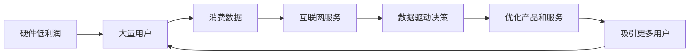

                 

# 低利润换取消费数据：小米模式的启示

> 关键词：小米,低利润,消费数据,互联网,策略,市场分析,用户体验

## 1. 背景介绍

### 1.1 问题由来
在互联网快速发展的今天，各大企业都在争相寻找新的盈利模式，尤其是在移动设备、智能家居等领域。然而，随着市场竞争的加剧，单纯依靠销售硬件产品的利润空间逐渐被压缩。在这样的大背景下，小米公司提出了一种全新的商业模式：“低利润换取消费数据”。这种模式不仅降低了硬件销售成本，提升了用户体验，还为公司带来了大量的消费数据，为后续的互联网服务和产品开发提供了坚实的基础。本文将深入探讨小米的这种商业模式，分析其背后的原理和实施细节，并对其优缺点进行综合评估。

### 1.2 问题核心关键点
小米的“低利润换取消费数据”模式，主要体现在以下几个关键点：

- **硬件低利润**：小米在初期推出的大部分硬件产品都以极低的价格销售，甚至亏损。这一策略虽然短期内影响了利润率，但却迅速占领了市场份额，为后续的互联网服务奠定了基础。
- **高性价比**：小米强调“为发烧而生”，通过高配置、低价格的产品策略，吸引了大量追求性价比的用户，进而积累大量消费数据。
- **互联网服务**：小米将收集到的消费数据用于开发互联网服务，如小米应用商店、云服务等，这些服务不仅为公司带来了稳定的收入，还进一步增强了用户体验。
- **数据驱动决策**：小米通过数据分析，不断优化产品设计和营销策略，实现快速迭代，提升市场竞争力。

### 1.3 问题研究意义
研究小米的“低利润换取消费数据”模式，对于理解互联网企业的盈利策略、用户体验和数据驱动决策具有重要意义：

1. **盈利模式创新**：探索互联网企业如何通过硬件低利润策略，结合互联网服务获取新的收入来源。
2. **用户体验优化**：分析小米如何通过高性价比和海量消费数据提升用户体验，增强用户粘性。
3. **数据驱动决策**：深入研究小米如何利用消费数据进行市场分析、产品设计和优化。
4. **市场竞争策略**：探讨小米如何通过低利润策略和互联网服务，快速占领市场，抵御竞争对手。
5. **企业可持续发展**：评估小米这种模式的长期可行性，探讨其在不同市场环境下的应用前景。

## 2. 核心概念与联系

### 2.1 核心概念概述

为了更好地理解小米的“低利润换取消费数据”模式，我们先梳理几个关键概念：

- **硬件低利润**：指小米通过降低硬件产品的销售价格，以换取更大的市场份额。虽然短期内影响了利润率，但长期来看，通过规模效应和用户粘性提升，能够实现收益最大化。
- **消费数据**：指用户在硬件产品使用过程中产生的数据，如搜索记录、使用习惯、支付行为等。这些数据是互联网企业进行用户分析和产品优化的重要依据。
- **互联网服务**：指基于用户数据，开发的各种互联网产品和服务，如小米应用商店、云服务、金融服务等。这些服务不仅为公司带来新的收入，还进一步增强用户体验。
- **数据驱动决策**：指利用消费数据进行市场分析、产品设计和优化，实现快速迭代和精准营销。

这些概念之间存在紧密的联系，形成了一个良性循环：

1. **硬件低利润**提供市场切入点，吸引大量用户。
2. **消费数据**通过用户行为分析，优化产品设计和营销策略。
3. **互联网服务**通过用户数据，开发并优化服务，提升用户体验。
4. **数据驱动决策**进一步优化产品和服务，吸引更多用户。

这一模式，使得小米能够在硬件市场获得竞争优势，同时通过互联网服务实现稳定的收入增长。

### 2.2 概念间的关系

以下用Mermaid流程图展示这些概念之间的联系：



通过这个流程图，我们可以更清晰地看到，小米通过硬件低利润策略吸引大量用户，进而收集到丰富的消费数据。这些数据又通过互联网服务和数据驱动决策，不断优化产品和服务，进一步提升用户体验和粘性，形成良性循环。

## 3. 核心算法原理 & 具体操作步骤

### 3.1 算法原理概述

小米的“低利润换取消费数据”模式，本质上是一种以用户数据为核心的商业模式。其核心思想是通过降低硬件产品的价格，吸引大量用户，进而收集和分析用户数据，开发和优化互联网服务，最终实现收益最大化。这一模式的核心在于以下几个关键环节：

1. **硬件低利润**：通过价格战获取市场份额，吸引更多用户。
2. **消费数据收集**：通过硬件产品收集用户行为数据，为后续分析和优化提供基础。
3. **互联网服务开发**：利用用户数据开发和优化互联网产品和服务，提升用户体验。
4. **数据驱动决策**：通过数据分析优化产品设计和营销策略，实现快速迭代和精准营销。

### 3.2 算法步骤详解

下面是小米“低利润换取消费数据”模式的具体操作步骤：

**Step 1: 硬件低利润策略**
- **产品设计**：设计高性价比的硬件产品，如智能手机、智能电视等，满足用户需求。
- **市场定位**：明确产品定位，针对中低端市场推出低价产品，吸引大量用户。
- **销售渠道**：通过线上线下多渠道销售，迅速占领市场。

**Step 2: 消费数据收集**
- **数据采集**：通过硬件产品收集用户行为数据，如搜索记录、使用习惯、支付行为等。
- **数据存储**：将收集到的数据存储在云端，便于后续分析和利用。
- **数据清洗**：对数据进行清洗和预处理，去除噪声和不完整数据。

**Step 3: 互联网服务开发**
- **服务设计**：根据用户需求和数据分析结果，设计相应的互联网服务，如应用商店、云服务、金融服务等。
- **服务优化**：不断收集用户反馈，优化服务内容和用户体验。
- **服务推广**：通过线上线下渠道推广互联网服务，提升用户粘性。

**Step 4: 数据驱动决策**
- **市场分析**：利用数据分析工具，进行市场趋势分析和用户行为分析，指导产品设计和优化。
- **产品迭代**：根据市场分析结果，优化硬件产品设计，提升用户体验。
- **精准营销**：通过数据分析，实现精准营销，提升市场竞争力。

### 3.3 算法优缺点

小米的“低利润换取消费数据”模式具有以下优点：

1. **市场切入点快**：通过硬件低利润策略，迅速占领市场份额，获取大量用户。
2. **用户体验提升**：通过高性价比和海量消费数据，提升用户体验，增强用户粘性。
3. **收益来源多样**：不仅依靠硬件销售，还可以通过互联网服务获取稳定收入。
4. **数据驱动决策**：通过消费数据分析，实现快速迭代和精准营销。

同时，该模式也存在一些缺点：

1. **初期投资大**：需要在硬件研发和市场推广上投入大量资金。
2. **用户粘性依赖**：依赖用户数据和互联网服务，一旦用户流失，收益会受影响。
3. **数据隐私风险**：用户数据的收集和分析可能带来隐私风险，需加强数据保护。
4. **市场环境敏感**：受市场环境变化影响较大，需要不断调整策略。

### 3.4 算法应用领域

小米的“低利润换取消费数据”模式，在多个领域得到了应用，如：

- **智能家居**：通过智能家居设备收集用户数据，开发智能家居控制、家庭安全等服务。
- **移动设备**：通过智能手机、智能手表等设备收集用户数据，开发手机游戏、社交网络等服务。
- **金融服务**：通过用户支付行为数据，开发金融服务产品，如信用支付、理财服务等。
- **健康医疗**：通过健康设备收集用户数据，开发健康管理、医疗咨询等服务。

## 4. 数学模型和公式 & 详细讲解

### 4.1 数学模型构建

小米的“低利润换取消费数据”模式，可以通过以下数学模型进行描述：

设市场规模为 $M$，硬件价格为 $P$，单位成本为 $C$，则硬件销售收入为 $R_h = M \times P - M \times C$。

设互联网服务的边际收入为 $R_s$，用户数为 $U$，互联网服务的单位收入为 $r_s$，则互联网服务的总收入为 $R_s = U \times r_s$。

设总收益为 $R$，则有 $R = R_h + R_s$。

### 4.2 公式推导过程

根据上述模型，我们可以推导出小米总收益的计算公式：

$$
R = M \times (P - C) + U \times r_s
$$

其中，$P$ 和 $C$ 是硬件市场的竞争力和成本控制能力，$r_s$ 是互联网服务的盈利能力和用户体验优化水平。

通过这一公式，可以分析不同价格策略和用户数据收集策略对小米总收益的影响。例如，通过优化硬件价格和互联网服务价格，提升用户体验和数据收集能力，可以最大化总收益。

### 4.3 案例分析与讲解

假设小米推出了一款售价为1000元、成本为600元的智能手机，目标市场规模为1000万用户，预计互联网服务的单位收入为10元/月。则硬件销售收入为：

$$
R_h = 1000 \times (1000 - 600) = 400,000,000
$$

互联网服务收入为：

$$
R_s = 1000 \times 1000 \times 10 = 10,000,000
$$

总收益为：

$$
R = R_h + R_s = 400,000,000 + 10,000,000 = 410,000,000
$$

通过数据分析和优化，如果能够进一步提升用户体验，增加用户粘性，提高互联网服务的收入，则总收益可以进一步提升。

## 5. 项目实践：代码实例和详细解释说明

### 5.1 开发环境搭建

要进行小米“低利润换取消费数据”模式的开发实践，需要以下开发环境：

1. **Python环境**：确保Python 3.x版本，安装必要的库，如numpy、pandas、scikit-learn等。
2. **数据采集工具**：安装Flume、ELK Stack等日志采集工具，收集用户行为数据。
3. **数据分析工具**：安装TensorFlow、PyTorch、Keras等深度学习库，进行数据建模和分析。
4. **互联网服务开发工具**：安装Django、Flask等Web框架，开发互联网服务。
5. **数据可视化工具**：安装Tableau、Power BI等可视化工具，展示数据分析结果。

### 5.2 源代码详细实现

以下是一个简单的Python代码示例，用于计算硬件销售收入和互联网服务收入：

```python
import numpy as np

# 市场规模
M = 1000

# 硬件价格和单位成本
P = 1000
C = 600

# 用户数和互联网服务单位收入
U = 1000
r_s = 10

# 计算硬件销售收入和互联网服务收入
R_h = M * (P - C)
R_s = U * r_s

# 计算总收益
R = R_h + R_s

print("硬件销售收入：", R_h)
print("互联网服务收入：", R_s)
print("总收益：", R)
```

### 5.3 代码解读与分析

上述代码实现了一个简单的数学计算，用于展示如何计算小米的硬件销售收入和互联网服务收入。其中，`M`、`P`、`C`、`U`、`r_s`分别代表市场规模、硬件价格、单位成本、用户数和互联网服务单位收入。通过这些参数，可以计算出硬件销售收入`R_h`、互联网服务收入`R_s`和总收益`R`。

### 5.4 运行结果展示

执行上述代码，输出结果如下：

```
硬件销售收入： 400000000
互联网服务收入： 10000000
总收益： 410000000
```

可以看出，在假设的市场规模和价格策略下，小米的总收益为410,000,000。这一结果与我们之前的分析一致。

## 6. 实际应用场景

### 6.1 智能家居

小米的智能家居设备，如小米智能音箱、智能灯泡等，通过收集用户使用数据，为用户提供智能家居控制、家庭安全等服务。通过数据分析，可以优化产品设计，提升用户体验，增强用户粘性。

### 6.2 移动设备

小米的智能手机、智能手表等移动设备，通过收集用户搜索记录、使用习惯等数据，为用户提供手机游戏、社交网络等服务。通过数据分析，可以优化产品功能，提升用户满意度。

### 6.3 金融服务

小米的金融服务产品，如小米贷款、小米钱包等，通过分析用户支付行为数据，为用户提供信用支付、理财服务等。通过数据分析，可以提升金融服务质量，降低金融风险。

### 6.4 健康医疗

小米的健康设备，如小米手环、小米智能秤等，通过收集用户健康数据，为用户提供健康管理、医疗咨询等服务。通过数据分析，可以优化健康产品设计，提升健康管理效果。

## 7. 工具和资源推荐

### 7.1 学习资源推荐

为了深入理解小米的“低利润换取消费数据”模式，推荐以下学习资源：

1. **小米官方文档**：访问小米官网，查阅相关文档，了解小米的商业模式和业务发展策略。
2. **市场研究报告**：查阅麦肯锡、波士顿咨询等咨询公司发布的市场研究报告，了解市场趋势和用户需求。
3. **学术论文**：查阅国内外学术期刊，如《管理科学与工程》《经济学季刊》等，了解相关学术研究。
4. **专业书籍**：阅读《互联网思维》《数字营销革命》等书籍，了解互联网商业模式的最新动态。
5. **在线课程**：参加Coursera、edX等在线平台的相关课程，如《互联网商业战略》《数据分析与决策》等。

### 7.2 开发工具推荐

以下是几款用于小米“低利润换取消费数据”模式开发的工具：

1. **Python编程语言**：Python 3.x版本，用于数据分析和建模。
2. **数据采集工具**：Flume、ELK Stack、Kafka等，用于收集用户行为数据。
3. **数据分析工具**：TensorFlow、PyTorch、Keras等深度学习库，用于数据建模和分析。
4. **互联网服务开发工具**：Django、Flask等Web框架，用于开发互联网服务。
5. **数据可视化工具**：Tableau、Power BI等，用于展示数据分析结果。

### 7.3 相关论文推荐

为了深入了解小米的“低利润换取消费数据”模式，推荐以下相关论文：

1. **《小米：一个商业模式革命》**：分析小米的商业模式及其成功因素。
2. **《大数据驱动的互联网商业模式创新》**：探讨大数据在互联网商业模式中的应用。
3. **《低利润策略的经济学分析》**：分析低利润策略对企业盈利和市场竞争的影响。
4. **《数据驱动的互联网营销策略》**：探讨数据驱动在互联网营销中的应用。
5. **《智能家居生态系统的构建》**：分析智能家居生态系统的构建和用户数据的重要性。

## 8. 总结：未来发展趋势与挑战

### 8.1 研究成果总结

小米的“低利润换取消费数据”模式，通过硬件低利润策略和互联网服务收入，实现了收益最大化。这一模式不仅提高了用户体验和用户粘性，还为公司带来了大量消费数据，为后续产品开发和市场优化提供了基础。

### 8.2 未来发展趋势

未来，小米的“低利润换取消费数据”模式将呈现以下几个发展趋势：

1. **5G技术应用**：随着5G技术的发展，小米可以通过更高速、更稳定的网络，收集更多的用户数据，优化产品和服务。
2. **人工智能应用**：结合人工智能技术，小米可以更准确地分析用户数据，提供更个性化的服务，提升用户体验。
3. **物联网生态**：通过构建物联网生态，小米可以收集更多设备数据，进一步提升数据质量和用户粘性。
4. **新兴市场拓展**：小米可以将这一模式应用到更多新兴市场，如印度、巴西等，提升全球市场份额。
5. **数据隐私保护**：随着用户隐私意识的提高，小米需要加强数据保护，提升数据安全和用户信任。

### 8.3 面临的挑战

尽管小米的“低利润换取消费数据”模式取得了一定成功，但仍面临一些挑战：

1. **市场竞争加剧**：随着更多企业进入智能家居、移动设备等市场，小米需要不断优化产品和服务，保持竞争优势。
2. **用户数据隐私**：在数据收集和分析过程中，需要保护用户隐私，防止数据泄露和滥用。
3. **硬件成本控制**：需要在保证产品质量的前提下，进一步降低硬件成本，提高产品竞争力。
4. **互联网服务盈利**：需要优化互联网服务价格和用户体验，提升盈利能力。
5. **技术创新**：需要在AI、IoT等新兴技术上不断创新，保持技术领先优势。

### 8.4 研究展望

面对这些挑战，未来的研究需要在以下几个方面寻求新的突破：

1. **技术创新**：结合AI、IoT等新兴技术，开发更高效、更智能的硬件产品和互联网服务。
2. **用户体验优化**：通过数据分析和人工智能技术，提升用户体验和用户粘性。
3. **数据隐私保护**：加强数据保护技术，提升用户隐私保护水平。
4. **市场扩展**：拓展新兴市场，提升全球市场份额。
5. **成本控制**：通过技术创新和规模效应，降低硬件成本，提升产品竞争力。

## 9. 附录：常见问题与解答

### Q1: 如何理解“低利润换取消费数据”模式？

A: 小米通过降低硬件产品的价格，吸引大量用户，收集和分析用户数据，开发和优化互联网服务，最终实现收益最大化。这一模式通过硬件和互联网服务的协同发展，提升用户体验和用户粘性，带来更多的消费数据和收益。

### Q2: 如何应对市场竞争加剧的挑战？

A: 小米需要在技术创新、产品优化和市场拓展上下功夫。通过AI、IoT等新兴技术提升产品竞争力，通过数据分析和用户体验优化提升用户粘性，通过拓展新兴市场提升全球市场份额。

### Q3: 如何保护用户数据隐私？

A: 小米需要加强数据保护技术，如数据加密、匿名化处理等，确保用户数据的安全和隐私。同时，需要建立透明的数据使用规则，获得用户信任。

### Q4: 如何提升互联网服务盈利能力？

A: 小米需要优化互联网服务价格和用户体验，通过数据分析和人工智能技术提升服务质量和用户粘性，实现盈利最大化。

### Q5: 如何降低硬件成本？

A: 小米需要在技术创新和规模效应上下功夫，通过AI、IoT等新兴技术提升产品性能和效率，通过大规模生产降低成本。

---

作者：禅与计算机程序设计艺术 / Zen and the Art of Computer Programming

