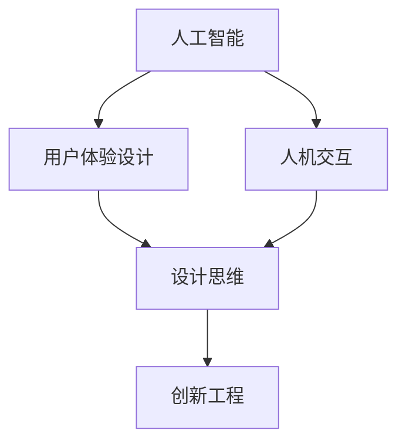
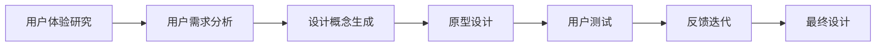
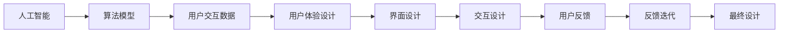
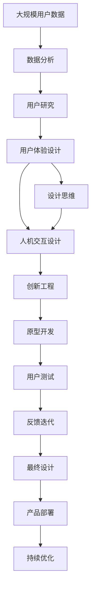

                 

# 体验设计师：AI时代的新兴职业探索

> 关键词：人工智能,用户体验设计,人机交互,数据驱动设计,设计思维,创新工程

## 1. 背景介绍

### 1.1 问题由来
随着人工智能（AI）技术的迅猛发展，用户与计算机的交互方式正在经历翻天覆地的变化。从传统的桌面软件、移动应用到智能家居、无人驾驶等新兴领域，AI已经深刻影响了各个行业的用户体验设计。这一背景下，新的职业——体验设计师应运而生。

### 1.2 问题核心关键点
体验设计师是AI时代应运而生的新兴职业，其主要职责是将AI技术与用户体验设计相结合，创造更加智能化、个性化和人性化的用户交互体验。这一职业的出现，不仅拓展了用户体验设计（User Experience Design, UXD）的边界，也揭示了AI技术在实际应用中的潜力与挑战。

### 1.3 问题研究意义
体验设计师职业的研究和探索，对于提升AI技术在实际应用中的用户体验，推动人工智能技术的普及和应用，具有重要意义：

1. **提升用户体验**：通过将AI技术与用户体验设计相结合，体验设计师可以创造出更加智能、个性化的交互体验，提升用户满意度。
2. **推动AI技术落地**：体验设计师的工作能够将复杂的技术转换为易于使用的产品和服务，加速AI技术的产业化进程。
3. **激发设计创新**：体验设计师需要不断尝试新的设计方法和技术手段，推动用户体验设计的不断创新。
4. **赋能行业升级**：体验设计师的工作能够赋能传统行业，通过引入AI技术，提升行业的智能化水平和效率。
5. **伦理与可持续性**：体验设计师在设计过程中需要考虑伦理和可持续性问题，确保AI技术的健康发展。

## 2. 核心概念与联系

### 2.1 核心概念概述

为更好地理解体验设计师的职业特点和设计方法，本节将介绍几个密切相关的核心概念：

- **人工智能（AI）**：以机器学习、深度学习等为代表的技术，通过模拟人类智能，实现信息的自动处理和决策。
- **用户体验设计（UXD）**：通过研究用户行为、心理和需求，设计出易用、可访问、可操作的产品和服务，提升用户满意度和体验。
- **人机交互（HCI）**：研究人与计算机交互的科学和技术，通过界面设计、交互设计等手段，优化人机交互体验。
- **设计思维（Design Thinking）**：一种以用户为中心的设计方法，强调通过观察、共情、迭代等步骤，发现问题、解决问题。
- **创新工程（Innovative Engineering）**：将技术与设计相结合，通过迭代实验、验证等手段，不断优化产品和服务，实现创新突破。

这些核心概念之间的逻辑关系可以通过以下Mermaid流程图来展示：



这个流程图展示了几大核心概念之间的关系：

1. 人工智能提供技术和工具，用户体验设计关注人机交互体验的优化，设计思维指导用户体验设计的迭代改进。
2. 人机交互是用户体验设计和人工智能技术的桥梁，两者通过设计思维进行有机结合。
3. 创新工程支持用户体验设计的实施和优化，通过不断实验和验证，推动设计创新。

### 2.2 概念间的关系

这些核心概念之间存在着紧密的联系，形成了体验设计师职业的工作框架。下面我们通过几个Mermaid流程图来展示这些概念之间的关系。

#### 2.2.1 体验设计师的工作流程



这个流程图展示了体验设计师的工作流程：

1. 用户体验研究阶段，通过数据分析、用户调研等方式，深入理解用户需求。
2. 用户需求分析阶段，基于用户研究结果，提炼出关键需求点。
3. 设计概念生成阶段，通过头脑风暴、草图等手段，生成多个设计方案。
4. 原型设计阶段，将设计方案转化为可交互的原型，进行用户测试验证。
5. 用户测试阶段，通过用户反馈获取设计方案的优点和不足。
6. 反馈迭代阶段，根据用户测试结果，不断优化设计方案。
7. 最终设计阶段，输出完成的设计方案和规范文档。

#### 2.2.2 人工智能与用户体验设计的关系



这个流程图展示了人工智能与用户体验设计的互动关系：

1. 人工智能提供算法模型，用于分析用户交互数据。
2. 用户交互数据是用户体验设计的重要参考，指导界面和交互设计。
3. 界面设计和交互设计是基于用户反馈的迭代过程，不断优化用户体验。
4. 最终设计是基于用户反馈迭代的结果，确保产品符合用户需求和期望。

### 2.3 核心概念的整体架构

最后，我们用一个综合的流程图来展示这些核心概念在大数据时代的整体架构：



这个综合流程图展示了从数据收集到产品部署的完整过程。大规模用户数据通过数据分析和用户研究，指导用户体验设计的迭代。通过设计思维和人机交互设计，优化用户体验，最终在创新工程的支持下，进行原型开发和用户测试。根据用户反馈，进行反馈迭代，输出最终设计，部署产品，并持续优化。

## 3. 核心算法原理 & 具体操作步骤
### 3.1 算法原理概述

体验设计师的核心工作是将AI技术与用户体验设计相结合，创造更加智能化、个性化和人性化的用户交互体验。具体而言，体验设计师在人工智能算法的支持下，进行用户研究、界面设计、交互设计、用户测试等环节，最终输出符合用户需求的产品和服务。

### 3.2 算法步骤详解

#### 3.2.1 用户体验研究

用户体验研究是体验设计师的重要前期工作，主要通过数据分析、用户调研等方式，了解用户需求和行为，发现设计机会。

1. **数据分析**：利用大数据分析工具，如Google Analytics、Mixpanel等，分析用户在应用中的行为数据，发现用户使用模式和偏好。
2. **用户调研**：通过问卷调查、深度访谈等方式，与用户进行直接交流，获取用户反馈和需求。
3. **竞品分析**：对比竞品的设计和功能，借鉴优秀的设计经验，发现设计改进的机会。

#### 3.2.2 用户需求分析

用户需求分析是将用户体验研究结果转化为具体的设计需求的过程。主要步骤包括：

1. **需求提炼**：基于用户研究结果，提炼出核心需求点和痛点。
2. **场景构建**：构建具体的用户使用场景，明确用户在特定情境下的需求和行为。
3. **任务分析**：分析用户完成特定任务的步骤和关键点，指导界面和交互设计。

#### 3.2.3 设计概念生成

设计概念生成是将用户需求转化为具体的设计方案的过程。主要步骤包括：

1. **头脑风暴**：通过集体讨论，激发创意，生成多个设计方案。
2. **草图绘制**：快速绘制草图，直观展示设计思路。
3. **原型设计**：基于草图，制作可交互的原型，进行初步验证。

#### 3.2.4 用户测试

用户测试是将原型呈现给真实用户，收集反馈的过程。主要步骤包括：

1. **测试准备**：选择合适的测试工具和用户群体，明确测试目标和指标。
2. **用户参与**：让用户在真实场景中使用原型，收集其使用过程中的行为和反馈。
3. **数据分析**：分析用户反馈，发现设计问题，指导后续迭代改进。

#### 3.2.5 反馈迭代

反馈迭代是根据用户测试结果，不断优化设计方案的过程。主要步骤包括：

1. **反馈整理**：整理用户反馈，发现共性问题和改进方向。
2. **迭代设计**：根据反馈，修改设计方案，进行多次迭代。
3. **测试验证**：在每次迭代后，重新进行用户测试，验证设计效果。

#### 3.2.6 最终设计

最终设计是将多次迭代后的设计方案转化为完整的产品和服务的过程。主要步骤包括：

1. **界面设计**：基于用户研究结果，设计符合用户需求的界面元素。
2. **交互设计**：设计符合用户行为模式和心理预期的交互方式。
3. **规范文档**：编写设计规范和开发文档，指导后续开发和维护。

### 3.3 算法优缺点

体验设计师在AI时代的应用，具有以下优点：

1. **提升用户体验**：通过将AI技术与用户体验设计相结合，可以创造更加智能、个性化的交互体验，提升用户满意度。
2. **加速产品迭代**：利用AI技术进行数据分析和用户研究，可以更快地发现用户需求，加速产品迭代。
3. **优化设计效率**：通过AI技术进行原型生成和用户测试，可以显著提高设计效率。

但同时，体验设计师的工作也存在一些缺点：

1. **技术依赖**：体验设计师需要掌握一定的AI技术和数据分析方法，对技术要求较高。
2. **数据隐私**：在使用用户数据进行设计时，需要严格遵守数据隐私和伦理规范，确保用户数据的安全和隐私保护。
3. **用户体验风险**：AI技术本身具有不确定性，用户体验设计过程中可能存在技术实现难度和用户体验风险。

### 3.4 算法应用领域

体验设计师的工作主要应用于以下几个领域：

- **智能家居**：利用AI技术优化家居设备的控制和交互，提升用户使用体验。
- **智能客服**：通过AI技术进行智能对话和用户意图识别，提高客服效率和用户满意度。
- **无人驾驶**：利用AI技术优化驾驶控制和决策，提升行车安全和用户体验。
- **虚拟现实（VR）和增强现实（AR）**：通过AI技术优化虚拟和增强现实体验，创造沉浸式和交互式场景。
- **医疗健康**：利用AI技术进行智能诊断和个性化健康管理，提升用户健康水平。
- **金融科技**：通过AI技术进行智能推荐和风险控制，提高金融服务的质量和效率。
- **智能办公**：利用AI技术优化办公自动化和协作，提升工作效率和用户体验。

## 4. 数学模型和公式 & 详细讲解  
### 4.1 数学模型构建

体验设计师在实际工作中，虽然不直接涉及复杂的数学模型，但在一些环节中仍需使用基本的数学公式进行分析和计算。这里以用户研究中的数据分析为例，展示一个简单的数学模型。

假设我们有一个用户行为数据集，包含用户的点击次数、停留时间、页面跳转等行为指标。我们可以使用以下数学模型来分析用户的点击率（Click-Through Rate, CTR）：

$$
CTR = \frac{点击次数}{总访问次数}
$$

在实际应用中，我们可以利用统计学方法对用户数据进行分析和可视化，如平均停留时间、页面跳转路径等。通过这些数据，我们可以更好地理解用户行为和需求，指导用户体验设计。

### 4.2 公式推导过程

在用户体验研究中，我们常常需要处理大规模用户数据，进行统计分析。以下以用户点击率的计算为例，展示数学公式的推导过程。

假设我们有一个用户点击数据集，包含用户的点击次数、总访问次数等指标。我们可以使用以下公式计算用户的点击率：

$$
CTR = \frac{\sum_{i=1}^{N} C_i}{\sum_{i=1}^{N} A_i}
$$

其中，$C_i$表示用户$i$的点击次数，$A_i$表示用户$i$的总访问次数。$N$表示用户总数。

通过这个公式，我们可以得到每个用户的点击率，进一步计算整体的平均点击率和标准差，发现用户行为中的异常情况。在实际应用中，我们还可以利用机器学习算法进行用户分群和行为预测，更好地理解用户需求和行为模式。

### 4.3 案例分析与讲解

假设我们有一个电商平台的订单数据，包含用户的订单量、购买金额、购买频率等行为指标。我们可以通过以下步骤进行数据分析：

1. **数据收集**：从电商平台获取用户的订单数据，进行数据清洗和预处理。
2. **用户分群**：利用聚类算法将用户分为不同的群组，发现不同群组的购买行为差异。
3. **行为预测**：使用回归算法预测用户的购买金额和购买频率，发现高价值用户和潜在的销售机会。
4. **个性化推荐**：根据用户的购买历史和行为预测结果，生成个性化推荐列表，提升用户满意度和购买转化率。

通过这些步骤，我们可以更好地理解用户的购买行为和需求，指导电商平台的个性化推荐和用户体验设计。

## 5. 项目实践：代码实例和详细解释说明
### 5.1 开发环境搭建

在进行用户体验设计的数据分析和用户研究时，我们需要搭建一个开发环境，方便进行数据分析和可视化。以下是使用Python进行数据处理和可视化的环境配置流程：

1. 安装Anaconda：从官网下载并安装Anaconda，用于创建独立的Python环境。

2. 创建并激活虚拟环境：
```bash
conda create -n data-env python=3.8 
conda activate data-env
```

3. 安装必要的库：
```bash
conda install pandas numpy matplotlib seaborn
```

4. 安装可视化工具：
```bash
pip install matplotlib
```

完成上述步骤后，即可在`data-env`环境中进行数据分析和可视化。

### 5.2 源代码详细实现

这里我们以电商平台的订单数据分析为例，展示一个简单的用户分群和行为预测过程。

首先，我们定义一个订单数据集，包含用户的订单量、购买金额、购买频率等指标：

```python
import pandas as pd

# 定义订单数据集
data = {
    'user_id': [1, 2, 3, 4, 5, 6, 7, 8, 9, 10],
    'order_count': [5, 3, 7, 2, 4, 6, 1, 4, 3, 5],
    'purchase_amount': [50, 80, 120, 30, 60, 90, 20, 60, 70, 80],
    'purchase_frequency': [3, 2, 5, 1, 3, 4, 2, 2, 4, 3]
}

# 创建订单数据集
df = pd.DataFrame(data)
```

然后，我们可以使用Pandas库进行数据分析和可视化：

```python
# 计算用户的平均购买金额和频率
avg_purchase_amount = df.groupby('user_id')['purchase_amount'].mean()
avg_purchase_frequency = df.groupby('user_id')['purchase_frequency'].mean()

# 绘制用户购买金额和频率的分布图
plt.figure(figsize=(10, 6))
plt.title('User Purchase Analysis')
plt.plot(avg_purchase_amount.index, avg_purchase_amount.values, label='Average Purchase Amount')
plt.plot(avg_purchase_frequency.index, avg_purchase_frequency.values, label='Average Purchase Frequency')
plt.xlabel('User ID')
plt.ylabel('Average Value')
plt.legend()
plt.show()
```

最后，我们可以使用Scikit-learn库进行用户分群和行为预测：

```python
from sklearn.cluster import KMeans
from sklearn.linear_model import LinearRegression

# 使用KMeans算法进行用户分群
kmeans = KMeans(n_clusters=3)
kmeans.fit(df[['purchase_amount', 'purchase_frequency']])
labels = kmeans.predict(df[['purchase_amount', 'purchase_frequency']])

# 使用线性回归进行行为预测
x = df[['purchase_amount', 'purchase_frequency']]
y = df['purchase_amount']
reg = LinearRegression()
reg.fit(x, y)
predicted_purchase_amount = reg.predict(x)
```

在实际应用中，我们通常需要根据具体任务和数据特点，选择合适的数据分析和机器学习算法，进行深入分析和预测。通过这些算法，我们可以更好地理解用户行为和需求，指导用户体验设计。

### 5.3 代码解读与分析

让我们再详细解读一下关键代码的实现细节：

**订单数据集**：
- `df`：定义一个Pandas DataFrame数据框，包含订单数据集的基本信息。

**用户分析**：
- `avg_purchase_amount`和`avg_purchase_frequency`：计算每个用户的平均购买金额和频率，并进行可视化展示。

**用户分群**：
- `KMeans`算法：使用KMeans算法进行用户分群，将用户分为不同的群组。
- `labels`：根据分群结果，为每个用户打上对应的群组标签。

**行为预测**：
- `LinearRegression`模型：使用线性回归模型进行行为预测，预测用户的购买金额。
- `predicted_purchase_amount`：根据输入数据，预测每个用户的购买金额。

**运行结果展示**：
在实际应用中，我们通常需要根据具体任务和数据特点，选择合适的算法进行分析和预测。通过这些算法，我们可以更好地理解用户行为和需求，指导用户体验设计。

## 6. 实际应用场景
### 6.1 智能家居

智能家居系统通过传感器、摄像头等设备，收集用户的生活数据，利用AI技术进行分析和优化。体验设计师在这一场景中，需要设计出符合用户需求的界面和交互方式，提升用户的舒适度和满意度。

以智能温控系统为例，体验设计师可以设计一个可语音控制的温控界面，支持用户通过语音指令调整室温。通过数据分析和用户测试，设计师可以发现用户对温控系统的使用偏好和需求，进一步优化界面和交互方式，提升用户体验。

### 6.2 智能客服

智能客服系统通过自然语言处理（NLP）技术，实现用户与机器人的交互。体验设计师在这一场景中，需要设计出符合用户需求和心理的对话界面和交互流程，提升用户满意度和问题解决效率。

以智能客服系统为例，体验设计师可以设计一个可多轮对话的对话界面，支持用户通过自然语言与机器人进行交互。通过数据分析和用户测试，设计师可以发现用户对话中的常见问题和不足，进一步优化对话流程和回答策略，提升用户满意度。

### 6.3 无人驾驶

无人驾驶系统通过传感器和AI技术，实现车辆的自动驾驶和决策。体验设计师在这一场景中，需要设计出符合用户需求的界面和交互方式，提升用户的信任和接受度。

以无人驾驶系统为例，体验设计师可以设计一个可实时反馈驾驶状态的仪表盘界面，支持用户通过仪表盘了解车辆的状态和行驶轨迹。通过数据分析和用户测试，设计师可以发现用户对驾驶状态的关注点和需求，进一步优化仪表盘设计和交互方式，提升用户体验。

### 6.4 未来应用展望

随着AI技术的不断进步，体验设计师的工作将变得更加多样化和复杂化。未来，体验设计师需要掌握更多跨领域的知识和技能，才能更好地适应不断变化的技术和市场需求。以下是几个未来应用展望：

1. **跨领域设计**：随着AI技术在更多领域的普及，体验设计师需要具备跨领域的知识和技能，设计出符合不同领域用户需求的产品和服务。
2. **数据驱动设计**：通过数据分析和机器学习算法，体验设计师可以更好地理解用户行为和需求，指导设计决策。
3. **人机协作设计**：随着人机协作的普及，体验设计师需要设计出高效、自然的人机交互方式，提升协作效率和用户体验。
4. **多模态设计**：随着多模态技术的普及，体验设计师需要设计出符合多模态用户需求的产品和服务，提升用户交互体验。
5. **伦理与隐私设计**：随着AI技术的普及，用户体验设计师需要设计出符合伦理和隐私保护要求的产品和服务，保障用户数据的安全和隐私。

## 7. 工具和资源推荐
### 7.1 学习资源推荐

为了帮助开发者系统掌握体验设计师的职业特点和设计方法，这里推荐一些优质的学习资源：

1. **《UX Design: A Complete Guide to User Experience for Beginners》**：一本全面介绍用户体验设计基础知识和实践的书籍，适合初学者入门。

2. **《Interaction of Computers and People》**：一本经典的用户界面设计书籍，介绍了人机交互的基本理论和设计方法。

3. **《Designing User Interfaces》**：一本全面介绍用户界面设计的书籍，涵盖界面设计、交互设计、可用性测试等方面。

4. **《Interaction Design Foundation》**：一个提供用户体验设计课程和资源的平台，涵盖用户体验设计的各个方面。

5. **《Nielsen Norman Group》**：一个提供用户体验研究报告和设计指导的网站，包含大量用户体验设计的最佳实践和案例分析。

通过对这些资源的学习实践，相信你一定能够快速掌握用户体验设计的精髓，并用于解决实际的NLP问题。

### 7.2 开发工具推荐

高效的开发离不开优秀的工具支持。以下是几款用于用户体验设计开发的常用工具：

1. **Sketch**：一个流行的界面设计工具，支持快速绘制原型和进行设计协作。

2. **Adobe XD**：一个强大的设计工具，支持从原型设计到用户体验测试的全过程。

3. **Figma**：一个基于云的设计工具，支持实时协作和设计分享。

4. **InVision Studio**：一个全栈设计工具，支持界面设计、交互设计、用户测试等多个环节。

5. **Axure RP**：一个强大的原型设计工具，支持高级交互设计和动画效果。

合理利用这些工具，可以显著提升用户体验设计的开发效率，加快创新迭代的步伐。

### 7.3 相关论文推荐

用户体验设计是一门不断发展的学科，以下是几篇奠基性的相关论文，推荐阅读：

1. **《Design at Every Touchpoint: Touchpoints and Experiences》**：探讨用户体验设计中的触点设计，强调触点设计的系统性和全面性。

2. **《The User Experience of Interaction Design》**：探讨交互设计中的用户体验设计，强调交互设计对用户体验的影响。

3. **《Understanding the Digital Product Experience》**：探讨数字产品的用户体验设计，强调用户体验设计的多维性和综合性。

4. **《Designing Interfaces for Interaction Design》**：探讨界面设计中的用户体验设计，强调界面设计对用户体验的影响。

5. **《User-Centered Design》**：一本经典的用户中心设计书籍，全面介绍了用户中心设计的基本理论和实践。

这些论文代表了大体验设计师职业发展的历程和趋势，提供了丰富的理论和方法论指导。

除上述资源外，还有一些值得关注的前沿资源，帮助开发者紧跟用户体验设计的发展趋势，例如：

1. **Google Design**：谷歌官方设计平台，提供丰富的设计资源和设计案例。

2. **Microsoft Design**：微软官方设计平台，提供最新的设计趋势和设计实践。

3. **Apple Human Interface Guidelines**：苹果官方设计指南，提供了全面的用户界面设计指导。

4. **IBM Experience Design》**：IBM官方设计平台，提供最新的设计趋势和设计实践。

5. **Figma Blog》**：Figma官方博客，提供最新的设计趋势和设计实践。

总之，对于用户体验设计师的职业学习和实践，需要开发者保持开放的心态和持续学习的意愿。多关注前沿资讯，多动手实践，多思考总结，必将收获满满的成长收益。

## 8. 总结：未来发展趋势与挑战
### 8.1 总结

本文对体验设计师这一新兴职业进行了全面系统的介绍。首先阐述了体验设计师职业的特点和工作流程，明确了在AI时代用户体验设计的广阔前景。其次，从原理到实践，详细讲解了用户体验设计的数学模型和实际操作，给出了完整的代码实例和详细解释说明。同时，本文还广泛探讨了体验设计师在各个实际应用场景中的具体应用，展示了用户体验设计的无限潜力。最后，本文推荐了相关的学习资源、开发工具和前沿论文，帮助开发者系统掌握用户体验设计的方法和实践。

通过本文的系统梳理，可以看到，体验设计师职业在AI时代具有广阔的发展前景，能够更好地满足用户需求，推动人工智能技术的普及和应用。未来，随着AI技术的不断进步和应用场景的不断扩展，体验设计师将发挥更加重要的作用，为构建更加智能、人性化的人机交互系统做出更大贡献。

### 8.2 未来发展趋势

展望未来，用户体验设计师的工作将呈现出以下几个发展趋势：

1. **数据驱动设计**：通过数据分析和机器学习算法，用户体验设计师可以更好地理解用户行为和需求，指导设计决策。

2. **跨领域设计**：随着AI技术在更多领域的普及，用户体验设计师需要具备跨领域的知识和技能，设计出符合不同领域用户需求的产品和服务。

3. **人机协作设计**：随着人机协作的普及，用户体验设计师需要设计出高效、自然的人机交互方式，提升协作效率和用户体验。

4. **多模态设计**：随着多模态技术的普及，用户体验设计师需要设计出符合多模态用户需求的产品和服务，提升用户交互体验。

5. **伦理与隐私设计**：随着AI技术的普及，用户体验设计师需要设计出符合伦理和隐私保护要求的产品和服务，保障用户数据的安全和隐私。

6. **个性化设计**：通过数据分析和机器学习算法，用户体验设计师可以更好地理解用户行为和需求，设计出个性化、多样化的产品和服务，提升用户体验。

7. **智能化设计**：随着AI技术的不断发展，用户体验设计师需要设计出更加智能化的产品和服务，提升用户满意度和交互体验。

这些趋势凸显了用户体验设计的广阔前景和创新空间，用户体验设计师需要不断学习新技术和新方法，才能更好地适应未来的市场需求。

### 8.3 面临的挑战

尽管用户体验设计师职业在AI时代具有广阔的发展前景，但在迈向更加智能化、普适化应用的过程中，仍面临诸多挑战：

1. **技术门槛高**：用户体验设计师需要掌握数据分析

