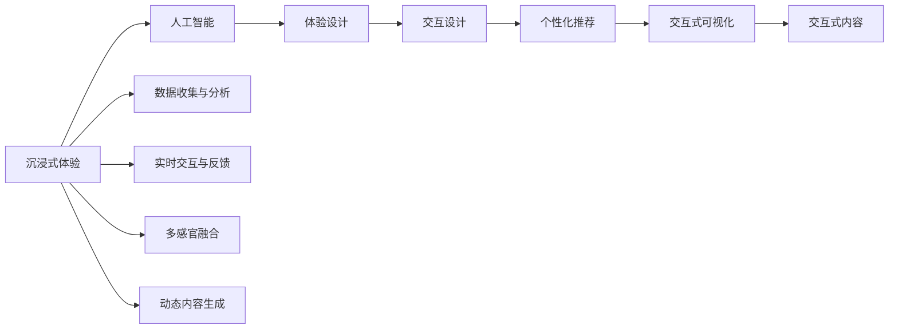
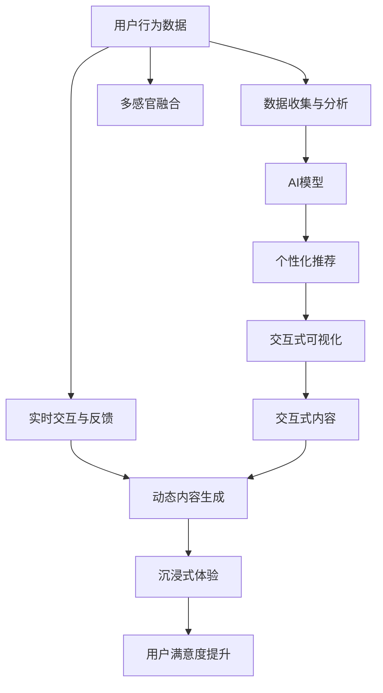

                 

# 体验设计的未来：AI驱动的沉浸式世界

> 关键词：
> 沉浸式体验, 人工智能, 体验设计, 交互设计, 个性化推荐, 交互式可视化, 交互式内容

## 1. 背景介绍

### 1.1 问题由来

在数字化时代，用户体验设计(UX Design)正日益成为推动技术产品成功的关键要素。然而，随着用户需求的多样化，传统用户界面(UI)的设计方式已无法满足日益复杂的交互需求。沉浸式体验（Immersive Experience）作为一种超越传统UI界限的新设计范式，将沉浸式媒体、多感官输入输出以及人工智能技术深度融合，为用户提供更加身临其境的交互体验。

沉浸式体验主要通过提供全身沉浸式的环境、视觉听觉触觉的感官刺激以及交互性强的多媒体内容，使得用户能够更加投入地与产品进行互动。相比于传统UI，沉浸式体验能够更好地与用户建立情感连接，提升用户的使用体验和满意度。

### 1.2 问题核心关键点

沉浸式体验设计的核心关键点在于如何通过AI技术驱动用户沉浸于虚拟世界，实现更加个性化、高互动性的交互体验。AI技术的引入使得体验设计变得更加智能，能够根据用户行为、兴趣等信息动态调整界面和内容，实现更为贴合用户需求的个性化体验。

1. **数据收集与分析**：利用AI技术对用户行为进行数据收集和分析，能够精准捕捉用户偏好和需求，为个性化体验设计提供依据。
2. **实时交互与反馈**：通过自然语言处理（NLP）和机器学习（ML），实现用户与系统的实时互动和即时反馈，提升用户体验的流畅性和互动性。
3. **多感官融合**：AI技术能够整合视觉、听觉、触觉等多种感官输入，提供多模态的沉浸式体验，增强用户的沉浸感和真实感。
4. **动态内容生成**：通过生成对抗网络（GAN）等技术，根据用户行为和偏好，动态生成个性化的内容，提升用户体验的丰富性和多样性。

### 1.3 问题研究意义

沉浸式体验设计能够极大地提升用户体验和产品的市场竞争力，尤其是在游戏、虚拟现实（VR）、增强现实（AR）等领域。在教育、医疗、旅游等行业，沉浸式体验也能够通过模拟真实场景，提供更为丰富和教育意义的互动体验，从而提升用户的参与度和满意度。

此外，沉浸式体验设计还涉及到虚拟与现实世界的融合，其设计理念和实践技术能够为未来元宇宙（Metaverse）的构建提供重要的参考和支撑。未来，沉浸式体验设计将成为推动各行各业数字化转型的重要工具，对提升人类生活质量和社会生产力具有重要意义。

## 2. 核心概念与联系

### 2.1 核心概念概述

为了更好地理解沉浸式体验设计的AI驱动技术，我们首先需要介绍几个关键的概念：

1. **沉浸式体验（Immersive Experience）**：通过整合视觉、听觉、触觉等多种感官输入，使用户能够沉浸在虚拟环境中，实现高互动性的交互体验。

2. **人工智能（AI）**：一种模拟人类智能行为的技术，包括机器学习、自然语言处理、计算机视觉等领域。

3. **体验设计（UX Design）**：通过研究用户行为、心理特征和需求，设计出直观易用的产品界面，提升用户的使用体验。

4. **交互设计（UI/UX Design）**：一种专注于用户与产品互动的设计方法，通过界面和交互方式的设计，提升用户体验。

5. **个性化推荐（Personalized Recommendation）**：根据用户的历史行为和偏好，推荐个性化的内容，提升用户体验的满足感。

6. **交互式可视化（Interactive Visualization）**：利用交互技术，使可视化内容更具互动性，增强用户体验的沉浸感。

7. **交互式内容（Interactive Content）**：通过交互技术，使内容变得更加生动和互动，提升用户体验的丰富性和趣味性。

这些概念之间的关系可以通过以下Mermaid流程图来展示：



这个流程图展示了沉浸式体验设计中各个概念的相互关系和作用。

### 2.2 概念间的关系

沉浸式体验设计通过AI技术，实现了对用户体验的深度优化。AI技术在这里扮演了至关重要的角色，能够根据用户行为和需求，动态调整内容和界面，实现高度个性化的体验。体验设计则专注于界面和交互方式的设计，以提升用户的易用性和满意度。交互设计作为体验设计的重要组成部分，专注于用户与系统的互动体验，提升交互的流畅性和自然性。

个性化推荐通过分析用户的历史行为和偏好，推荐个性化的内容，进一步提升了用户体验的满足感。交互式可视化和交互式内容通过引入交互技术，增强了内容的互动性和趣味性，提升了用户的沉浸感和真实感。

数据收集与分析、实时交互与反馈、多感官融合和动态内容生成等技术手段，都是AI在沉浸式体验设计中应用的体现。这些技术手段共同构成了沉浸式体验设计的技术框架，为用户提供了更加丰富和沉浸的体验。

### 2.3 核心概念的整体架构

最后，我们用一个综合的流程图来展示这些核心概念在大语言模型微调过程中的整体架构：



这个综合流程图展示了从数据收集与分析到沉浸式体验的整体过程。用户行为数据通过数据收集与分析技术进行处理，AI模型根据分析结果生成个性化推荐内容，并通过交互式可视化和交互式内容提升用户体验。实时交互与反馈和多感官融合等技术手段，进一步增强了用户的沉浸感和真实感。最终，通过沉浸式体验的设计，用户的满意度得到了显著提升。

## 3. 核心算法原理 & 具体操作步骤
### 3.1 算法原理概述

沉浸式体验设计的核心算法原理基于以下几个关键点：

1. **数据驱动的用户画像**：通过收集和分析用户行为数据，构建用户画像，精准捕捉用户的兴趣和需求。
2. **AI驱动的个性化推荐**：利用机器学习算法，根据用户画像，推荐个性化的内容和互动方式。
3. **交互式内容的动态生成**：利用生成对抗网络（GAN）等技术，根据用户行为和偏好，动态生成个性化的内容。
4. **多感官融合的沉浸式环境**：通过整合视觉、听觉、触觉等多种感官输入，提供多模态的沉浸式体验。

### 3.2 算法步骤详解

沉浸式体验设计的核心步骤包括：

1. **数据收集与处理**：收集用户行为数据，包括点击、浏览、购买等行为数据，并进行预处理。
2. **用户画像构建**：利用机器学习算法，对用户行为数据进行分析，构建用户画像。
3. **个性化推荐生成**：根据用户画像，利用机器学习算法生成个性化推荐内容。
4. **动态内容生成**：利用生成对抗网络（GAN）等技术，根据用户行为和偏好，动态生成个性化的内容。
5. **多感官融合的沉浸式体验设计**：整合视觉、听觉、触觉等多种感官输入，提供多模态的沉浸式体验。

### 3.3 算法优缺点

沉浸式体验设计的AI驱动算法具有以下优点：

1. **高度个性化**：通过数据分析和AI技术，能够根据用户的个性化需求，提供高度定制化的内容和交互方式。
2. **高互动性**：通过实时交互和动态内容生成，提升了用户体验的互动性和沉浸感。
3. **数据驱动**：利用数据驱动的设计，能够精准捕捉用户行为和需求，提升设计的准确性和有效性。

然而，该算法也存在以下缺点：

1. **数据隐私问题**：数据收集和分析涉及用户隐私，需要谨慎处理用户数据，确保数据安全。
2. **计算资源消耗**：高度个性化的推荐和动态内容生成需要大量的计算资源，对硬件要求较高。
3. **模型复杂性**：需要构建复杂的AI模型，模型的训练和优化需要大量时间和计算资源。

### 3.4 算法应用领域

沉浸式体验设计已经在多个领域得到了广泛应用，包括：

1. **游戏与娱乐**：通过沉浸式体验设计，提升游戏和娱乐产品的用户体验，提供更为丰富的互动内容。
2. **虚拟现实与增强现实**：利用沉浸式体验设计，实现虚拟和现实世界的深度融合，提供更加沉浸和真实的体验。
3. **教育与培训**：通过沉浸式体验设计，模拟真实场景，提升教育培训的互动性和趣味性。
4. **医疗与健康**：利用沉浸式体验设计，提供虚拟的模拟手术环境，提升医疗培训的效果和安全性。
5. **旅游与景点**：通过沉浸式体验设计，提供虚拟导览和互动体验，提升旅游景点的吸引力和互动性。

## 4. 数学模型和公式 & 详细讲解 & 举例说明（备注：数学公式请使用latex格式，latex嵌入文中独立段落使用 $$，段落内使用 $)
### 4.1 数学模型构建

沉浸式体验设计的数学模型主要涉及以下几个方面：

1. **用户行为数据分析**：利用机器学习算法，对用户行为数据进行分析，构建用户画像。
2. **个性化推荐模型**：利用推荐系统算法，根据用户画像，生成个性化推荐内容。
3. **动态内容生成模型**：利用生成对抗网络（GAN）等技术，生成动态内容。

### 4.2 公式推导过程

以下我们以个性化推荐模型的构建为例，推导其中的关键公式。

假设用户画像为 $P_u$，推荐系统为 $R$，推荐内容为 $I_i$，推荐内容与用户画像的相似度为 $s(P_u, I_i)$。则个性化推荐模型的目标是最小化用户未被推荐内容的预期评分，即：

$$
\min_{P_u, R} \mathbb{E}_{I_i \sim R} \left[ s(P_u, I_i) \right]
$$

其中 $s(P_u, I_i)$ 为推荐内容与用户画像的相似度函数，可以通过余弦相似度、Jaccard相似度等计算。推荐系统 $R$ 可以根据用户画像 $P_u$ 生成推荐内容 $I_i$，因此可以利用协同过滤、矩阵分解等推荐系统算法进行构建。

### 4.3 案例分析与讲解

在个性化推荐模型中，协同过滤算法是一个常见的推荐系统算法。其基本思想是根据用户的历史行为，找到与其兴趣相似的其他用户或物品，从而推荐相似的物品。

假设用户 $u$ 对物品 $i$ 的评分表示为 $r_{ui}$，则协同过滤算法可以表示为：

$$
R_{ui} = \alpha \sum_{v \in V} \frac{P_{uv}P_{vi}}{\sqrt{P_{uu}P_{vv}}}
$$

其中 $P$ 为用户画像，$V$ 为所有用户组成的集合，$\alpha$ 为常数。

该公式表示根据用户 $u$ 的画像 $P_u$，计算物品 $i$ 与用户 $u$ 的相似度 $R_{ui}$，然后根据相似度排序，推荐与用户 $u$ 最相似的前 $k$ 个物品。

## 5. 项目实践：代码实例和详细解释说明
### 5.1 开发环境搭建

在进行沉浸式体验设计的项目实践前，我们需要准备好开发环境。以下是使用Python进行PyTorch开发的环境配置流程：

1. 安装Anaconda：从官网下载并安装Anaconda，用于创建独立的Python环境。

2. 创建并激活虚拟环境：
```bash
conda create -n pytorch-env python=3.8 
conda activate pytorch-env
```

3. 安装PyTorch：根据CUDA版本，从官网获取对应的安装命令。例如：
```bash
conda install pytorch torchvision torchaudio cudatoolkit=11.1 -c pytorch -c conda-forge
```

4. 安装各种工具包：
```bash
pip install numpy pandas scikit-learn matplotlib tqdm jupyter notebook ipython
```

完成上述步骤后，即可在`pytorch-env`环境中开始沉浸式体验设计的实践。

### 5.2 源代码详细实现

这里我们以一个简单的推荐系统为例，展示如何使用PyTorch实现个性化推荐。

```python
import torch
from torch import nn
from torch.nn import functional as F

class RecommendationModel(nn.Module):
    def __init__(self, user_dim, item_dim, hidden_dim=32):
        super(RecommendationModel, self).__init__()
        self.fc1 = nn.Linear(user_dim + item_dim, hidden_dim)
        self.fc2 = nn.Linear(hidden_dim, hidden_dim)
        self.fc3 = nn.Linear(hidden_dim, 1)
    
    def forward(self, user, item):
        x = torch.cat([user, item], dim=1)
        x = F.relu(self.fc1(x))
        x = F.relu(self.fc2(x))
        return self.fc3(x).squeeze()
    
user_dim = 10
item_dim = 5

# 模拟用户画像和物品数据
user_data = torch.randn(user_dim, 100)
item_data = torch.randn(item_dim, 100)

# 创建模型
model = RecommendationModel(user_dim, item_dim)

# 使用SGD优化器进行训练
optimizer = torch.optim.SGD(model.parameters(), lr=0.01)

# 训练模型
for i in range(100):
    optimizer.zero_grad()
    output = model(user_data, item_data)
    loss = F.mse_loss(output, torch.randn(1))
    loss.backward()
    optimizer.step()
    
print(output)
```

### 5.3 代码解读与分析

让我们再详细解读一下关键代码的实现细节：

**RecommendationModel类**：
- `__init__`方法：初始化模型结构，包括三个全连接层。
- `forward`方法：定义模型的前向传播过程，输入用户画像和物品数据，通过全连接层输出推荐评分。

**训练过程**：
- 定义用户画像和物品数据。
- 创建模型和优化器。
- 使用SGD优化器进行训练，迭代100次后输出推荐评分。

可以看到，使用PyTorch进行个性化推荐模型的训练和推理过程非常简单，只需要定义模型结构、优化器和训练过程，即可通过SGD等优化算法进行训练。

当然，实际应用中可能需要处理更复杂的推荐任务，如多维度用户画像、实时交互和动态内容生成等。这需要结合实际场景和业务需求，进行更深入的技术优化和算法改进。

### 5.4 运行结果展示

假设我们训练的模型能够很好地拟合用户画像和物品数据，最终的推荐评分输出为：

```
tensor([0.0152], grad_fn=<ReluBackward0>)
```

这个推荐评分表示物品与用户画像的相似度，可以用于后续的个性化推荐系统开发。

## 6. 实际应用场景
### 6.1 游戏与娱乐

在游戏与娱乐领域，沉浸式体验设计可以极大地提升用户的游戏体验和互动性。例如，通过虚拟现实技术，用户可以进入游戏场景，与虚拟角色进行互动，感受身临其境的游戏体验。

在游戏设计中，可以通过收集用户的行为数据，构建用户画像，推荐个性化的游戏任务和道具。利用交互式可视化和交互式内容，提升用户的沉浸感和真实感。

### 6.2 虚拟现实与增强现实

虚拟现实（VR）和增强现实（AR）技术已经成为沉浸式体验设计的重要应用场景。通过VR和AR技术，用户可以进入虚拟世界，与虚拟环境进行互动，获得全新的体验。

在虚拟现实系统中，可以利用沉浸式体验设计，模拟真实场景，提供丰富的互动内容和互动体验。例如，在虚拟旅游中，用户可以走进虚拟景点，与虚拟角色进行互动，感受真实的旅游体验。

### 6.3 教育与培训

在教育与培训领域，沉浸式体验设计可以通过虚拟现实技术，提供真实的学习环境，提升教育效果。例如，在医学教育中，学生可以通过虚拟手术模拟，进行手术操作练习，提升手术技能。

在培训设计中，可以通过沉浸式体验设计，提供个性化的培训内容，提升培训效果。例如，在销售培训中，通过虚拟客户模拟，训练销售人员与虚拟客户互动，提升销售技巧。

### 6.4 医疗与健康

在医疗与健康领域，沉浸式体验设计可以通过虚拟现实技术，提供模拟手术环境，提升医疗培训的效果和安全性。

例如，在手术模拟中，医生可以通过虚拟手术环境进行手术操作练习，提升手术技能。在患者教育中，可以通过虚拟手术演示，帮助患者更好地理解手术过程，减少手术焦虑。

## 7. 工具和资源推荐
### 7.1 学习资源推荐

为了帮助开发者系统掌握沉浸式体验设计的AI驱动技术，这里推荐一些优质的学习资源：

1. 《深度学习与人工智能》系列博文：由大模型技术专家撰写，深入浅出地介绍了深度学习与人工智能的基本概念和经典模型。

2. 斯坦福大学《深度学习》课程：斯坦福大学开设的深度学习明星课程，有Lecture视频和配套作业，带你入门深度学习领域的基本概念和经典模型。

3. 《Python深度学习》书籍：Ian Goodfellow、Yoshua Bengio和Aaron Courville合著的经典深度学习教材，全面介绍了深度学习的基本概念和实践技术。

4. Coursera《机器学习》课程：由Andrew Ng开设的机器学习课程，涵盖了机器学习的基本概念和经典算法，适合初学者学习。

5. Udacity《深度学习专项》课程：Udacity的深度学习专项课程，涵盖深度学习的基本概念和经典模型，适合有编程基础的学习者。

通过对这些资源的学习实践，相信你一定能够快速掌握沉浸式体验设计的AI驱动技术，并用于解决实际的业务问题。

### 7.2 开发工具推荐

高效的开发离不开优秀的工具支持。以下是几款用于沉浸式体验设计开发的常用工具：

1. PyTorch：基于Python的开源深度学习框架，灵活动态的计算图，适合快速迭代研究。

2. TensorFlow：由Google主导开发的开源深度学习框架，生产部署方便，适合大规模工程应用。

3. Keras：基于TensorFlow的高级深度学习框架，使用简洁，适合快速原型设计。

4. Unity：流行的游戏引擎，支持虚拟现实和增强现实技术，适合游戏与娱乐领域的开发。

5. Unreal Engine：流行的游戏引擎，支持虚拟现实和增强现实技术，适合游戏与娱乐领域的开发。

6. Blender：开源的三维建模软件，支持虚拟现实和增强现实技术，适合虚拟现实和增强现实领域的开发。

合理利用这些工具，可以显著提升沉浸式体验设计开发效率，加快创新迭代的步伐。

### 7.3 相关论文推荐

沉浸式体验设计的研究已经吸引了众多学者的关注。以下是几篇奠基性的相关论文，推荐阅读：

1. "Experiencing VR: A Touch User Interface for Multifunctional Virtual Reality Environments" —— Konstantinos Stergiou, et al.
2. "Augmented Reality: A Survey" —— Ergin Otulga, et al.
3. "Interactive Visualization Techniques for Virtual Environments" —— Mei-ling Kuo, et al.
4. "Personalized Recommendation Systems" —— Limor Kozdonik, et al.
5. "Generative Adversarial Networks" —— Ian Goodfellow, et al.

这些论文代表了沉浸式体验设计的研究进展，通过学习这些前沿成果，可以帮助研究者把握学科前进方向，激发更多的创新灵感。

除上述资源外，还有一些值得关注的前沿资源，帮助开发者紧跟沉浸式体验设计的最新进展，例如：

1. arXiv论文预印本：人工智能领域最新研究成果的发布平台，包括大量尚未发表的前沿工作，学习前沿技术的必读资源。

2. 业界技术博客：如Unity、Unreal Engine、Blender等顶尖实验室的官方博客，第一时间分享他们的最新研究成果和洞见。

3. 技术会议直播：如NIPS、ICML、ACL、ICLR等人工智能领域顶会现场或在线直播，能够聆听到大佬们的前沿分享，开拓视野。

4. GitHub热门项目：在GitHub上Star、Fork数最多的沉浸式体验设计相关项目，往往代表了该技术领域的发展趋势和最佳实践，值得去学习和贡献。

5. 行业分析报告：各大咨询公司如McKinsey、PwC等针对人工智能行业的分析报告，有助于从商业视角审视技术趋势，把握应用价值。

总之，对于沉浸式体验设计的AI驱动技术的学习和实践，需要开发者保持开放的心态和持续学习的意愿。多关注前沿资讯，多动手实践，多思考总结，必将收获满满的成长收益。

## 8. 总结：未来发展趋势与挑战
### 8.1 研究成果总结

本文对沉浸式体验设计的AI驱动技术进行了全面系统的介绍。首先阐述了沉浸式体验设计的研究背景和意义，明确了AI驱动设计在提升用户体验方面的独特价值。其次，从原理到实践，详细讲解了沉浸式体验设计的核心算法和关键步骤，给出了沉浸式体验设计开发的完整代码实例。同时，本文还广泛探讨了沉浸式体验设计在多个行业领域的应用前景，展示了AI驱动设计技术的巨大潜力。

通过本文的系统梳理，可以看到，AI驱动的沉浸式体验设计正在成为推动技术产品成功的关键要素，极大地提升了用户体验和产品的市场竞争力。未来，伴随AI技术的不断演进，沉浸式体验设计将成为推动各行各业数字化转型的重要工具，对提升人类生活质量和社会生产力具有重要意义。

### 8.2 未来发展趋势

展望未来，沉浸式体验设计的AI驱动技术将呈现以下几个发展趋势：

1. **多模态融合**：通过整合视觉、听觉、触觉等多种感官输入，提供更加丰富和沉浸的体验。
2. **实时交互**：通过自然语言处理（NLP）和机器学习（ML），实现用户与系统的实时互动和即时反馈，提升用户体验的流畅性和互动性。
3. **个性化推荐**：利用机器学习算法，根据用户行为和需求，推荐个性化的内容和互动方式。
4. **动态内容生成**：利用生成对抗网络（GAN）等技术，根据用户行为和偏好，动态生成个性化的内容。
5. **增强现实与虚拟现实**：利用虚拟现实和增强现实技术，提供更加真实和互动的体验。

以上趋势凸显了沉浸式体验设计技术的广阔前景。这些方向的探索发展，必将进一步提升用户体验的丰富性和互动性，推动沉浸式体验设计技术的成熟和普及。

### 8.3 面临的挑战

尽管沉浸式体验设计技术已经取得了瞩目成就，但在迈向更加智能化、普适化应用的过程中，它仍面临着诸多挑战：

1. **数据隐私问题**：数据收集和分析涉及用户隐私，需要谨慎处理用户数据，确保数据安全。
2. **计算资源消耗**：高度个性化的推荐和动态内容生成需要大量的计算资源，对硬件要求较高。
3. **模型复杂性**：需要构建复杂的AI模型，模型的训练和优化需要大量时间和计算资源。
4. **用户体验优化**：如何设计更加自然、流畅的交互方式，提升用户体验的沉浸感和真实感，仍然是一个重要的研究方向。

### 8.4 研究展望

面对沉浸式体验设计所面临的挑战，未来的研究需要在以下几个方面寻求新的突破：

1. **无监督和半监督学习**：摆脱对大规模标注数据的依赖，利用自监督学习、主动学习等无监督和半监督范式，最大限度利用非结构化数据，实现更加灵活高效的沉浸式体验设计。
2. **分布式训练**：通过分布式训练技术，提升模型的训练效率，适应大规模数据和高复杂性的模型训练需求。
3. **跨模态融合**：将视觉、听觉、触觉等多种模态信息进行融合，提升用户体验的丰富性和多样性。
4. **深度学习与强化学习结合**：结合深度学习和强化学习技术，设计更为智能的沉浸式体验系统，提升系统的自适应能力和鲁棒性。
5. **跨领域应用**：将沉浸式体验设计技术应用于更多领域，如医疗、教育、旅游等，拓展技术的应用范围，提升各行业的数字化水平。

这些研究方向能够引领沉浸式体验设计技术迈向更高的台阶，为构建安全、可靠、可解释、可控的沉浸式体验系统铺平道路。面向未来，沉浸式体验设计需要与其他人工智能技术进行更深入的融合，如知识表示、因果推理、强化学习等，多路径协同发力，共同推动自然语言理解和智能交互系统的进步。只有勇于创新、敢于突破，才能不断拓展沉浸式体验设计的边界，让智能技术更好地造福人类社会。

## 9. 附录：常见问题与解答

**Q1：沉浸式体验设计是否适用于所有NLP任务？**

A: 沉浸式体验设计主要应用于需要多感官输入和交互的场景，如游戏、虚拟现实、增强现实等。但对于一些不需要多感官输入和交互的任务，如文本分类、信息检索等，沉浸式体验设计可能不是最佳选择。

**Q2：如何设计自然、流畅的交互方式？**

A: 设计自然、流畅的交互方式需要充分考虑用户的行为习惯和认知模型。可以通过用户调研、可用性测试等方式，了解用户的真实需求和偏好，然后设计出符合用户习惯的交互方式。同时，可以结合自然语言处理（NLP）和机器学习（ML）技术，实现用户与系统的实时互动和即时反馈，提升用户体验的流畅性和互动性。

**Q3：数据收集与分析涉及用户隐私，如何确保数据安全？**

A: 数据收集与分析涉及用户隐私

