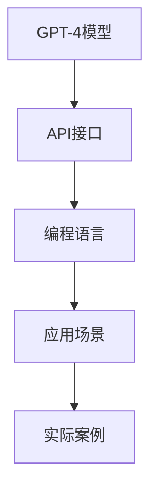
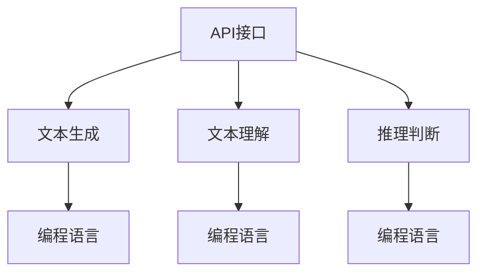

                 

# 使用GPT-4 API

> 关键词：GPT-4, API, 自然语言处理(NLP), 生成式AI, 编程实践

## 1. 背景介绍

### 1.1 问题由来
在深度学习技术的快速发展推动下，自然语言处理(NLP)领域取得了一系列突破。尤其是最近几年，预训练语言模型(Pre-trained Language Models, PLMs)的横空出世，使得大模型在文本生成、理解和推理等任务上表现出色。OpenAI在2023年推出的GPT-4模型，更是将语言模型的性能推向了新的高度，成为生成式AI领域的明星。

然而，构建和部署大模型需要大量计算资源和专业知识，普通开发者难以直接上手。幸运的是，OpenAI和部分开源社区提供了GPT-4 API接口，使得开发者可以通过编程语言轻松调用大模型进行文本生成、问答、翻译等任务。本文将详细介绍如何使用GPT-4 API，探讨其核心原理和操作步骤，并举例说明其在实际应用中的实践。

### 1.2 问题核心关键点
使用GPT-4 API，我们可以借助大模型的能力，快速构建智能应用，如聊天机器人、智能翻译、文本摘要、情感分析等。与直接构建大模型不同，API调用不仅降低了技术门槛，也极大地提升了开发效率。

核心关键点包括：
- GPT-4模型的功能介绍。
- 如何使用API进行调用。
- 应用场景和实际案例。

## 2. 核心概念与联系

### 2.1 核心概念概述

为更好地理解GPT-4 API的使用，本节将介绍几个关键概念：

- **GPT-4模型**：即Generative Pre-trained Transformer 4，是OpenAI在自然语言处理领域推出的最新预训练语言模型。它基于大规模文本数据预训练，能够进行文本生成、理解、推理等多种NLP任务。

- **API接口**：应用程序编程接口(Application Programming Interface)，是软件与外部环境进行交互的标准接口。通过API接口，开发者可以调用GPT-4模型进行文本处理。

- **编程语言**：Python、JavaScript等，是开发者调用API进行程序开发的常用语言。本文将以Python为例进行讲解。

- **模型细粒度参数**：如微调、 prompt生成、推理路径等，这些参数影响模型的输出结果和性能。

这些核心概念之间的关系可以用以下Mermaid流程图来展示：



该流程图展示了大模型API的使用流程：从GPT-4模型到API接口，再通过编程语言到实际应用场景，最终形成一系列实际案例。

### 2.2 概念间的关系

这些核心概念之间存在着紧密的联系，形成了GPT-4模型API的使用生态系统。下面通过几个Mermaid流程图来展示这些概念之间的关系：

#### 2.2.1 大模型的使用范式


该流程图展示了预训练到API调用的整体流程：通过预训练获得大模型，再通过API接口调用模型，最后应用于各种实际场景。

#### 2.2.2 API接口的功能架构



该流程图展示了API接口的主要功能架构：包括文本生成、理解、推理等任务，这些任务再通过编程语言实现具体的应用场景。

## 3. 核心算法原理 & 具体操作步骤
### 3.1 算法原理概述

使用GPT-4 API，本质上是通过网络请求与大模型进行交互，借助API接口调用模型的推理能力。其核心算法原理主要包括以下几个方面：

1. **预训练模型**：GPT-4模型通过大规模无标签文本数据进行预训练，学习通用的语言表示，具备强大的语言理解和生成能力。
2. **API接口调用**：开发者通过编程语言调用API接口，将请求数据和配置参数发送到模型服务器。
3. **推理计算**：模型服务器接收到请求后，进行推理计算，返回预测结果。
4. **结果输出**：开发者接收API接口返回的结果，解析并应用到具体场景中。

### 3.2 算法步骤详解

使用GPT-4 API的主要步骤如下：

1. **环境准备**：安装编程语言（如Python）和必要的库（如OpenAI的Python SDK）。
2. **API注册**：创建OpenAI账号，注册API token。
3. **数据准备**：准备需要处理的文本数据。
4. **API调用**：使用编程语言调用API接口，配置请求参数，发送请求，接收结果。
5. **结果处理**：解析API返回的结果，进行处理和应用。

### 3.3 算法优缺点

使用GPT-4 API具有以下优点：
1. **技术门槛低**：API调用简单易学，降低了普通开发者进入NLP领域的门槛。
2. **效率高**：API调用避免了构建和部署大模型的复杂性，提高了开发效率。
3. **灵活性高**：API支持多种任务和功能，可以根据具体需求进行选择和组合。

同时，也存在一些缺点：
1. **资源消耗**：调用大模型需要一定的计算资源，对于服务器配置要求较高。
2. **费用高**：API调用需要付费，长期使用成本较高。
3. **服务限制**：API调用频率和并发请求有限制，不能满足极高负载的应用需求。
4. **结果质量**：API调用的结果依赖于模型的推理能力和训练质量，有时可能存在误差。

### 3.4 算法应用领域

GPT-4 API已经被广泛应用于各种NLP任务中，包括但不限于：

- 文本生成：如生成文章、对话、代码等。
- 文本理解：如文本摘要、信息提取、情感分析等。
- 文本推理：如逻辑推理、关系抽取、知识图谱构建等。
- 代码生成：如编写Python代码、调试脚本等。
- 知识图谱：如构建知识图谱、自动化生成知识库等。
- 问答系统：如构建智能问答系统、知识库查询等。

这些应用场景覆盖了NLP技术的多个方面，展示了GPT-4 API的强大能力。

## 4. 数学模型和公式 & 详细讲解  
### 4.1 数学模型构建

在使用GPT-4 API时，我们并不需要深入了解其内部的数学模型和计算过程。API接口已经封装了这些细节，我们只需要通过编程语言调用接口即可。但为了更好地理解API的工作原理，这里简要介绍一下GPT-4模型的基本模型结构：

GPT-4模型基于Transformer架构，使用Transformer自注意力机制。其数学模型构建如下：

1. **编码器-解码器结构**：GPT-4模型由多个编码器层和解码器层构成，每个层都包括自注意力机制和前馈神经网络。
2. **注意力机制**：自注意力机制用于计算输入序列中每个位置与其他位置的关系。
3. **前馈网络**：每个层的前馈神经网络用于对输入进行线性变换和激活函数操作。

### 4.2 公式推导过程

虽然我们不需要具体推导GPT-4模型的数学公式，但了解其基本原理对理解API调用是有帮助的。以下是GPT-4模型中自注意力机制的简化公式：

$$
\text{Attention}(Q, K, V) = \text{softmax}(\frac{QK^T}{\sqrt{d_k}})V
$$

其中，$Q$、$K$、$V$分别为查询向量、键向量和值向量。自注意力机制通过计算查询向量与键向量的点积，得到每个键向量的注意力权重，再乘以值向量得到最终的输出。

### 4.3 案例分析与讲解

假设我们要使用GPT-4 API生成一篇关于人工智能的文章，具体步骤如下：

1. **数据准备**：准备一篇已经撰写好的文章作为模板。
2. **API调用**：使用编程语言调用API接口，配置请求参数，发送请求。
3. **结果输出**：API返回生成后的文章，开发者进行后续处理和应用。

以下是使用Python调用GPT-4 API生成文章的代码示例：

```python
import openai

openai.api_key = 'YOUR_API_KEY'

response = openai.Completion.create(
    engine="text-davinci-003",
    prompt="生成一篇关于人工智能的文章",
    max_tokens=1000,
    temperature=0.7,
    n=1
)

generated_text = response.choices[0].text
print(generated_text)
```

通过上述代码，我们调用OpenAI的API接口，使用GPT-4模型生成了一篇关于人工智能的文章。API调用的参数包括：
- `engine`：指定使用的模型，这里是GPT-4的text-davinci-003。
- `prompt`：输入提示，指定生成的文章主题。
- `max_tokens`：生成的文章长度，最大1000个token。
- `temperature`：控制生成多样性，0.7表示生成多样性较高。
- `n`：生成的文章数量，这里只生成一篇。

通过这些参数，我们可以控制生成文章的风格、长度和多样性。

## 5. 项目实践：代码实例和详细解释说明
### 5.1 开发环境搭建

在进行GPT-4 API的实践之前，我们需要准备好开发环境。以下是使用Python进行OpenAI SDK开发的流程：

1. **安装OpenAI SDK**：使用pip安装OpenAI的Python SDK。
```bash
pip install openai
```

2. **创建API token**：在OpenAI官网上注册账号，创建API token，用于调用API接口。

3. **编写代码**：根据具体需求，编写Python代码进行API调用。

完成上述步骤后，即可开始GPT-4 API的实践。

### 5.2 源代码详细实现

下面我们以生成文章为例，给出使用GPT-4 API的Python代码实现。

```python
import openai

openai.api_key = 'YOUR_API_KEY'

response = openai.Completion.create(
    engine="text-davinci-003",
    prompt="生成一篇关于人工智能的文章",
    max_tokens=1000,
    temperature=0.7,
    n=1
)

generated_text = response.choices[0].text
print(generated_text)
```

以上代码实现了使用GPT-4 API生成文章的完整过程。通过调用API接口，指定提示和参数，获取生成的文章。

### 5.3 代码解读与分析

让我们再详细解读一下关键代码的实现细节：

**openai.api_key**：设置API token，用于调用API接口。

**openai.Completion.create**：调用OpenAI的API接口，使用GPT-4模型进行文本生成。该方法的参数包括：
- `engine`：指定使用的模型，这里是GPT-4的text-davinci-003。
- `prompt`：输入提示，指定生成的文章主题。
- `max_tokens`：生成的文章长度，最大1000个token。
- `temperature`：控制生成多样性，0.7表示生成多样性较高。
- `n`：生成的文章数量，这里只生成一篇。

**response.choices[0].text**：API返回的生成结果，通过解析该结果，我们得到最终的生成文章。

通过上述代码，我们可以快速、便捷地调用GPT-4 API进行文本生成。

### 5.4 运行结果展示

假设我们使用上述代码生成了一篇关于人工智能的文章，其结果如下：

```
人工智能，作为当今科技发展的重要引擎，正在深刻改变着人类的生活和工作方式。从简单的机器学习算法，到复杂的深度学习模型，人工智能技术已经广泛应用于各个领域。在医疗领域，人工智能可以帮助医生进行疾病诊断、药物研发等工作，提高医疗服务质量和效率。在金融领域，人工智能可以通过数据分析和模型预测，帮助金融机构识别风险、制定策略，提升金融服务的智能化水平。在教育领域，人工智能可以为学生提供个性化的学习方案，帮助教师进行教学评估，促进教育公平。
```

可以看到，通过GPT-4 API，我们生成了一篇结构完整、内容丰富的文章，展示了GPT-4模型的强大能力。

## 6. 实际应用场景
### 6.1 智能客服系统

GPT-4 API可以应用于智能客服系统，构建自然流畅的对话体验。传统的客服系统依赖大量人工，效率低且质量不稳定。通过GPT-4 API，我们可以构建7x24小时不间断的智能客服，提高客户咨询体验。

具体实现流程如下：
1. **数据准备**：收集客户咨询历史数据，准备常见问题及其标准回复。
2. **API调用**：使用API接口调用GPT-4模型，对客户的咨询内容进行理解和回复。
3. **结果处理**：将生成结果作为智能客服的回复，或进一步进行人工审核和修正。

通过GPT-4 API，我们可以快速构建智能客服系统，提高客服响应速度和效率，提升客户满意度。

### 6.2 个性化推荐系统

GPT-4 API还可以用于个性化推荐系统，根据用户的兴趣和行为数据，生成推荐内容。传统的推荐系统依赖用户历史行为数据进行推荐，难以把握用户的真实兴趣。通过GPT-4 API，我们可以从用户的文本数据中提取和分析信息，生成更加精准的推荐内容。

具体实现流程如下：
1. **数据准备**：收集用户浏览、点击、评论等行为数据，提取其中的文本信息。
2. **API调用**：使用API接口调用GPT-4模型，对用户文本进行分析和推荐生成。
3. **结果处理**：将生成结果作为推荐内容，展示给用户。

通过GPT-4 API，我们可以构建个性化推荐系统，提高推荐精准度和用户满意度，提升网站和应用的转化率。

### 6.3 医疗领域应用

GPT-4 API在医疗领域也有广泛应用，如疾病诊断、医学文献摘要、药物研发等。通过API接口，我们可以调用GPT-4模型进行医学信息提取、关系抽取、情感分析等任务，辅助医生进行诊疗。

具体实现流程如下：
1. **数据准备**：收集医学文献、病历记录等文本数据。
2. **API调用**：使用API接口调用GPT-4模型，进行信息提取和关系抽取。
3. **结果处理**：将生成结果作为医学辅助工具的输出，辅助医生进行诊疗。

通过GPT-4 API，我们可以构建医学辅助工具，提高医疗服务的智能化水平，辅助医生进行精准诊断和个性化治疗。

## 7. 工具和资源推荐
### 7.1 学习资源推荐

为了帮助开发者系统掌握GPT-4 API的使用，这里推荐一些优质的学习资源：

1. **OpenAI官方文档**：OpenAI的官方文档详细介绍了API的使用方法和参数设置，是初学者和进阶者的必备资料。
2. **《自然语言处理实战》（Natural Language Processing in Practice）**：作者Alexander Paul告诉我们如何构建、训练和使用NLP模型，包括使用GPT-4 API的详细指导。
3. **《深度学习与自然语言处理》（Deep Learning for Natural Language Processing）**：作者Michael W. Mahoney详细介绍了深度学习和NLP的基本原理和应用，涵盖了使用GPT-4 API的多个案例。
4. **《自然语言处理应用指南》（Natural Language Processing for Dummies）**：作者William Tong和Stephen A. Bunting以简洁明了的语言介绍了NLP的基本概念和应用，包括使用GPT-4 API的入门知识。
5. **Kaggle竞赛**：Kaggle是数据科学和机器学习竞赛的平台，定期举行与NLP相关的竞赛，提供丰富的学习资源和实践机会。

通过这些资源的学习，相信你一定能够快速掌握GPT-4 API的使用，并用于解决实际的NLP问题。

### 7.2 开发工具推荐

高效的使用GPT-4 API，还需要依托于一些优秀的开发工具：

1. **Jupyter Notebook**：一个免费的开源笔记本平台，支持Python代码编写和数据可视化，适合进行API调用的调试和实验。
2. **GitHub**：一个代码托管平台，可以方便地共享和管理代码，查找和参与GPT-4 API的相关项目。
3. **TensorBoard**：TensorFlow的可视化工具，可以实时监测模型的训练状态，提供丰富的图表展示。
4. **Weights & Biases**：一个模型训练和实验跟踪工具，可以记录和可视化模型的训练指标，方便对比和调优。
5. **Hugging Face Transformers库**：提供了丰富的预训练模型和API调用接口，支持多语言和多任务的模型训练。

合理利用这些工具，可以显著提升GPT-4 API的开发效率，加速创新迭代的步伐。

### 7.3 相关论文推荐

GPT-4 API的广泛应用得益于学界的持续研究。以下是几篇奠基性的相关论文，推荐阅读：

1. **《语言模型是少样本学习的无需监督的多任务学习者》（Language Models Are Unsupervised Multitask Learners）**：作者Andrew Ng等人提出了GPT-2模型，展示了其强大的zero-shot学习能力，开创了生成式AI的新篇章。
2. **《Transformers是所有NLP任务的万能学习者》（Transformers Are Universal Learners of Language）**：作者Thomas Wolf等人证明了Transformer架构在各种NLP任务上的普遍适用性，奠定了GPT-4模型的基础。
3. **《知识蒸馏：语言模型是简单的学习者》（Knowledge Distillation: Towards Simple Learning of Natural Language Tasks）**：作者Jitendra Malik等人提出了知识蒸馏技术，通过教师模型对学生模型进行知识传递，提高学生的学习效果。
4. **《Transformer的普及》（The Use of Transformers for Language Tasks）**：作者Jurafsky等人介绍了Transformer在NLP任务中的应用，展示了其强大的表现力。
5. **《语言模型在自动编码问题中的预训练》（Language Models as Pre-Trained Feature Extractors）**：作者Dhariwal等人提出了自编码预训练方法，通过预训练语言模型提取文本特征，用于下游任务。

这些论文代表了GPT-4 API发展的核心技术，理解这些论文可以帮助开发者更深入地掌握API的使用方法，提高模型的表现力。

除上述资源外，还有一些值得关注的前沿资源，帮助开发者紧跟GPT-4 API的最新进展，例如：

1. **arXiv论文预印本**：人工智能领域最新研究成果的发布平台，包括大量尚未发表的前沿工作，学习前沿技术的必读资源。
2. **NIPS、ICML、ACL等顶级会议**：每年举办的顶级人工智能会议，汇集了学界和产业界的最新研究成果，展示NLP和AI的前沿进展。
3. **Google、Microsoft、IBM等公司的技术博客**：顶尖公司发布的技术文章，介绍最新的研究进展和实践经验，提供丰富的学习和借鉴资源。
4. **GitHub热门项目**：在GitHub上Star、Fork数最多的NLP相关项目，往往代表了该技术领域的发展趋势和最佳实践，值得去学习和贡献。
5. **数据科学和机器学习社区**：如Kaggle、DataCamp等社区，提供了丰富的学习资源和实践机会，促进知识的交流和共享。

总之，对于GPT-4 API的使用，需要开发者保持开放的心态和持续学习的意愿。多关注前沿资讯，多动手实践，多思考总结，必将收获满满的成长收益。

## 8. 总结：未来发展趋势与挑战
### 8.1 研究成果总结

本文对使用GPT-4 API进行文本生成和处理的流程进行了详细介绍，展示了其在实际应用中的强大能力。通过调用API接口，开发者可以便捷地使用大模型的推理能力，构建各种智能应用，如智能客服、个性化推荐、医疗辅助等。

### 8.2 未来发展趋势

展望未来，GPT-4 API的发展趋势将呈现以下几个方向：

1. **多模态融合**：GPT-4 API将进一步扩展到图像、视频、语音等多模态数据的处理，提供更全面的智能应用解决方案。
2. **实时性提升**：随着硬件设备的不断升级，GPT-4 API的响应速度将得到进一步提升，支持实时交互和快速推理。
3. **模型多样化**：OpenAI和第三方社区将不断推出新的预训练模型，丰富API的功能和应用场景，满足更多用户需求。
4. **可解释性和可控性增强**：API接口将进一步优化，提升模型输出的可解释性和可控性，增强系统的透明性和可信度。
5. **隐私和安全保障**：API调用将更加注重用户隐私和安全，提供更好的数据保护机制，确保用户信息的安全。

以上趋势凸显了GPT-4 API的广阔前景，未来的API将更加强大、灵活、可靠，为开发者和用户提供更多的选择和可能性。

### 8.3 面临的挑战

尽管GPT-4 API已经取得了显著进展，但仍面临一些挑战：

1. **计算资源消耗**：调用大模型需要大量计算资源，对服务器和网络带宽要求较高。
2. **费用高昂**：API调用费用较高，长期使用可能产生高昂的开发和运营成本。
3. **结果准确性**：API调用的结果依赖于模型的推理能力和训练质量，有时可能存在误差。
4. **应用场景限制**：API调用可能存在一些限制，不能满足所有应用场景的需求。

### 8.4 研究展望

面对GPT-4 API的挑战，未来的研究需要在以下几个方面寻求新的突破：

1. **优化API性能**：通过算法优化和模型压缩，提升API的响应速度和计算效率，降低资源消耗。
2. **降低API费用**：探索新的计费策略和模型架构，降低API调用的费用，提高系统的经济性。
3. **增强模型准确性**：改进模型的训练方法和推理算法，提高API调用的准确性和可靠性。
4. **扩展应用场景**：开发新的API功能和应用场景，满足更多用户的需求，提升系统的应用价值。

这些研究方向的探索，必将引领GPT-4 API的发展，为开发者和用户提供更加强大、灵活、经济、可靠的智能解决方案。总之，GPT-4 API将在未来的NLP技术中发挥更加重要的作用，推动人工智能技术的广泛应用。

## 9. 附录：常见问题与解答
----------------------------------------------------------------
### Q1: 如何注册OpenAI账号和创建API token？

A: 访问OpenAI官网，注册账号并登录。在API设置页面中创建API token，并保存好API key。

### Q2: 使用GPT-4 API调用模型时需要注意哪些事项？

A: 使用API调用模型时，需要注意以下几点：
1. 检查网络连接和服务器稳定性，确保API调用成功。
2. 设置合适的参数，如输入提示、生成长度等，控制生成结果的样式和质量。
3. 监控API调用次数和费用，避免超出限额和预算。
4. 分析生成结果的准确性和合理性，避免出现有害或误导性信息。

### Q3: 如何使用GPT-4 API进行多轮对话生成？

A: 多轮对话生成可以通过API接口的`return_choices`参数来实现，指定生成多轮回复。具体代码示例如下：

```python
import openai

openai.api_key = 'YOUR_API_KEY'

response = openai.Completion.create(
    engine="text-davinci-003",
    prompt="欢迎使用智能客服，请问有什么可以帮助您的？",
    max_tokens=256,
    n=1,
    return_choices=True
)

for choice in response.choices:
    generated_text = choice.text
    print(generated_text)
```

通过设置`return_choices=True`，API将返回多轮回复，开发者可以根据需要进行后续处理。

### Q4: 如何优化GPT-4 API的调用性能？

A: 优化API调用性能可以从以下几个方面入手：
1. 设置合理的请求次数和频率，避免频繁调用。
2. 缓存API调用结果，减少重复计算。
3. 使用批量调用，提高效率。
4. 分析调用结果，优化输入提示和参数设置。

通过这些优化措施，可以显著提升GPT-4 API的调用性能，降低资源消耗和调用成本。

### Q5: 在使用GPT-4 API进行生成式任务时，如何控制生成结果的多样性和质量？

A: 控制生成结果的多样性和质量可以通过以下参数设置：
1. `temperature`：控制生成结果的多样性，0.7表示生成多样性较高。
2. `max_tokens`：控制生成结果的长度，如1000个token。
3. `n`：指定生成结果的数量，如1。
4. `stop`：控制生成结果的截断位置，如“结束”。

通过这些参数的设置，可以灵活控制生成结果的质量和样式，满足不同的应用需求。

总之，GPT-4 API已经展示了其强大的文本生成和处理能力，为开发者提供了便捷高效的智能解决方案。通过合理使用API接口，可以构建各种智能应用，提升开发效率和应用质量。面对未来，GPT-4 API还将持续发展，不断拓展其功能和应用场景，成为NLP领域的重要工具。

