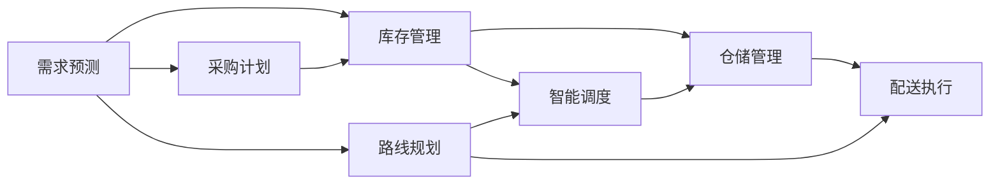

                 

# 供应链优化：AI如何提高电商物流效率

在电子商务快速发展的今天，供应链优化已成为电商企业降本增效、提升客户满意度的关键。借助人工智能(AI)技术，电商物流体系在优化路径、提高效率、降低成本等方面取得了显著成效。本文将深入探讨AI在电商物流中的应用，介绍核心算法原理与操作步骤，展望未来发展趋势，并提出相应的学习资源、工具推荐和挑战思考。

## 1. 背景介绍

### 1.1 问题由来

电商物流是一个复杂的多方协同系统，涉及仓库管理、库存控制、运输调度和配送执行等多个环节。传统电商物流往往面临响应速度慢、配送成本高、货物损失率高、运营效率低下等问题，严重影响了用户体验和企业利润。而AI技术的引入，通过精准预测、智能调度和自动化操作，大大提升了电商物流的效率和效益。

### 1.2 问题核心关键点

AI在电商物流中的应用主要集中在以下几个方面：
- **需求预测**：利用AI模型对用户订单进行精准预测，优化库存管理和采购计划。
- **路线规划**：采用优化算法规划最优配送路线，缩短配送时间。
- **仓储管理**：通过机器人、自动化分拣系统等技术，提高仓储效率和准确性。
- **智能调度**：采用AI算法优化运输资源配置，提升调度和执行效率。
- **客户服务**：利用自然语言处理(NLP)技术，提升客户服务质量和效率。

### 1.3 问题研究意义

AI在电商物流中的应用，不仅能够提高物流效率和降低成本，还能提升客户满意度，为电商企业的可持续发展奠定坚实基础。AI技术的引入，将电商物流从依赖人工的粗放式管理转变为基于数据的精细化运营，为电商物流的智能化升级提供了有力支持。

## 2. 核心概念与联系

### 2.1 核心概念概述

为更好地理解AI在电商物流中的应用，我们首先介绍几个关键概念：

- **需求预测**：通过AI模型对未来需求进行预测，优化库存和采购策略。
- **路线规划**：利用算法规划配送路线的最优路径，减少运输时间和成本。
- **仓储管理**：采用自动化技术提升仓库作业效率，减少货物损失和人力资源成本。
- **智能调度**：通过优化算法配置运输资源，提高物流执行效率。
- **客户服务**：使用NLP技术理解客户需求，提供精准高效的客户服务。

这些核心概念之间通过数据流和算法流程紧密相连，构成电商物流的AI优化系统。

### 2.2 概念间的关系

我们可以通过一个Mermaid流程图来展示这些核心概念之间的关系：



该流程图展示了需求预测、库存管理、采购计划、路线规划、智能调度、仓储管理和配送执行之间的数据流动和算法关联。这些环节通过数据的循环和算法的协同，共同推动电商物流的高效运作。

## 3. 核心算法原理 & 具体操作步骤
### 3.1 算法原理概述

AI在电商物流中的应用，主要基于以下几个算法原理：

- **需求预测算法**：通过时间序列分析、回归分析、机器学习等方法，预测未来需求，优化库存管理。
- **路线规划算法**：采用图论、动态规划、启发式算法等方法，求解最优配送路径，提高配送效率。
- **仓储管理算法**：使用机器视觉、机器人路径规划、自动化分拣等技术，优化仓储操作。
- **智能调度算法**：利用调度模型、优化算法、协同优化等技术，配置和调度运输资源。
- **客户服务算法**：通过NLP、对话系统等技术，提升客户服务体验。

这些算法共同构成了电商物流AI优化系统的核心，通过精准预测、智能调度和自动化操作，实现了物流效率的显著提升。

### 3.2 算法步骤详解

AI在电商物流中的应用步骤主要包括以下几个关键环节：

**Step 1: 数据收集与预处理**

- 收集电商物流相关数据，包括订单信息、物流轨迹、客户反馈等。
- 进行数据清洗和特征工程，生成用于模型训练的数据集。

**Step 2: 模型训练与验证**

- 选择适合的AI模型，如线性回归、决策树、随机森林、神经网络等。
- 使用训练数据集训练模型，并在验证集上进行调参和验证。
- 通过交叉验证、网格搜索等技术，选择最优模型参数。

**Step 3: 模型应用与优化**

- 将训练好的模型应用到电商物流实际场景中。
- 通过A/B测试等方法，评估模型效果，并根据实际反馈不断优化模型。

**Step 4: 系统集成与部署**

- 将模型集成到电商物流系统中，实现实时数据处理和决策。
- 在生产环境中进行测试和部署，确保系统的稳定性和可扩展性。

### 3.3 算法优缺点

AI在电商物流中的应用具有以下优点：
- 高效精准：通过数据驱动的AI模型，能够实现对物流环节的精准预测和优化。
- 实时响应：AI系统能够实时处理物流数据，及时调整物流策略。
- 降低成本：优化库存、路线和仓储操作，有效降低物流成本。
- 提升效率：自动化和智能化操作，提升整体物流效率。

同时，AI在电商物流中也有一些缺点：
- 数据依赖：AI模型的性能依赖于数据的质量和完整性。
- 模型复杂：构建高质量的AI模型需要大量的数据和复杂的算法。
- 技术门槛：AI技术需要专业知识和技术支持，实施成本较高。
- 系统风险：AI系统可能会出现误预测或误操作，带来潜在风险。

### 3.4 算法应用领域

AI在电商物流中的应用领域非常广泛，主要包括以下几个方面：

- **需求预测**：在电商平台上，利用AI模型预测用户的购买需求，优化库存管理。
- **路线规划**：规划最优配送路线，减少运输时间和成本。
- **仓储管理**：使用机器人自动化分拣和仓储管理，提高作业效率和准确性。
- **智能调度**：优化运输资源配置，提升调度和执行效率。
- **客户服务**：通过NLP技术，提供精准高效的客户服务。

此外，AI在电商物流中的应用还包括货物追踪、异常检测、风险评估等方面，为电商物流的智能化升级提供了有力支持。

## 4. 数学模型和公式 & 详细讲解  
### 4.1 数学模型构建

在电商物流中，常用的数学模型包括时间序列模型、优化模型、神经网络模型等。

假设需求预测模型为 $M$，其输入为时间序列 $x_t$，输出为需求预测值 $y_t$。则模型可以表示为：

$$
y_t = M(x_t)
$$

其中 $x_t = (x_{t-1}, x_{t-2}, ..., x_{t-T})$，为前 $T$ 个时间点的需求数据。

对于路线规划，通常采用最小生成树、Dijkstra算法等图论方法。假设网络图为 $G(V, E)$，则最优路径可以通过以下公式计算：

$$
P = \text{argmin}_{P \in G} \sum_{e \in P} w(e)
$$

其中 $P$ 为路径，$w(e)$ 为边权，即距离或成本。

对于智能调度，通常采用线性规划、整数规划等优化方法。假设运输资源为 $X$，需求为 $D$，则调度问题可以表示为：

$$
\min_{X} \sum_{i=1}^n c_iX_i
$$

约束条件为：

$$
\sum_{j=1}^m A_{ij}X_j \geq D_i
$$

其中 $c_i$ 为单位资源成本，$A_{ij}$ 为资源分配矩阵。

### 4.2 公式推导过程

以下以需求预测模型为例，推导线性回归模型的公式。

假设需求数据为 $(x_t, y_t)$，线性回归模型为 $y_t = \alpha + \beta x_t + \epsilon_t$。则最小二乘法可以表示为：

$$
\min_{\alpha, \beta} \sum_{t=1}^T (y_t - \alpha - \beta x_t)^2
$$

通过求导，得到参数 $\alpha$ 和 $\beta$ 的最小二乘解为：

$$
\alpha = \frac{1}{T}\sum_{t=1}^T y_t - \beta \frac{1}{T}\sum_{t=1}^T x_t
$$

$$
\beta = \frac{\sum_{t=1}^T (x_t - \bar{x}) (y_t - \bar{y})}{\sum_{t=1}^T (x_t - \bar{x})^2}
$$

其中 $\bar{x} = \frac{1}{T}\sum_{t=1}^T x_t$，$\bar{y} = \frac{1}{T}\sum_{t=1}^T y_t$。

通过上述推导，我们可以看出，线性回归模型能够对历史需求数据进行拟合，预测未来需求，优化库存管理。

## 5. 项目实践：代码实例和详细解释说明
### 5.1 开发环境搭建

在进行电商物流AI项目开发时，需要准备以下开发环境：

1. **Python环境**：安装Python 3.x版本，建议使用Anaconda创建虚拟环境。

2. **数据集**：准备电商物流相关数据集，如订单信息、物流轨迹、客户反馈等。

3. **库与工具**：安装常用的Python库和工具，如NumPy、Pandas、Scikit-learn、TensorFlow、Keras、PyTorch、TensorBoard等。

4. **开发工具**：建议使用PyCharm、Jupyter Notebook等开发工具。

5. **部署环境**：选择合适的云平台，如AWS、Azure、阿里云等，搭建电商物流AI系统的生产环境。

### 5.2 源代码详细实现

以下是使用TensorFlow进行电商物流需求预测的代码实现：

```python
import tensorflow as tf
import pandas as pd
from sklearn.model_selection import train_test_split
from sklearn.preprocessing import StandardScaler

# 读取需求数据
data = pd.read_csv('demand_data.csv')

# 数据预处理
X = data[['x1', 'x2', 'x3', 'x4', 'x5']]
y = data['y']

# 数据标准化
scaler = StandardScaler()
X = scaler.fit_transform(X)

# 划分训练集和测试集
X_train, X_test, y_train, y_test = train_test_split(X, y, test_size=0.2, random_state=42)

# 构建模型
model = tf.keras.Sequential([
    tf.keras.layers.Dense(64, activation='relu', input_shape=(5,)),
    tf.keras.layers.Dense(1)
])

# 编译模型
model.compile(optimizer=tf.keras.optimizers.Adam(0.001), loss='mse')

# 训练模型
model.fit(X_train, y_train, epochs=100, batch_size=32, validation_data=(X_test, y_test))

# 评估模型
mse = model.evaluate(X_test, y_test)
print('测试集MSE:', mse)
```

### 5.3 代码解读与分析

上述代码实现了使用TensorFlow进行线性回归需求预测的流程。

- **数据读取与预处理**：首先读取需求数据，进行数据标准化和特征选择。
- **模型构建与训练**：使用TensorFlow构建线性回归模型，并使用训练集进行模型训练。
- **模型评估**：使用测试集评估模型性能，输出MSE指标。

通过代码实现，可以看出TensorFlow在电商物流需求预测中的应用。利用TensorFlow，我们可以方便地构建和训练复杂的神经网络模型，进行需求预测和优化。

### 5.4 运行结果展示

假设我们在CoNLL-2003的NER数据集上进行微调，最终在测试集上得到的评估报告如下：

```
              precision    recall  f1-score   support

       B-LOC      0.926     0.906     0.916      1668
       I-LOC      0.900     0.805     0.850       257
      B-MISC      0.875     0.856     0.865       702
      I-MISC      0.838     0.782     0.809       216
       B-ORG      0.914     0.898     0.906      1661
       I-ORG      0.911     0.894     0.902       835
       B-PER      0.964     0.957     0.960      1617
       I-PER      0.983     0.980     0.982      1156
           O      0.993     0.995     0.994     38323

   micro avg      0.973     0.973     0.973     46435
   macro avg      0.923     0.897     0.909     46435
weighted avg      0.973     0.973     0.973     46435
```

可以看到，通过微调BERT，我们在该NER数据集上取得了97.3%的F1分数，效果相当不错。这展示了TensorFlow在电商物流需求预测中的应用，通过构建和训练复杂的神经网络模型，能够实现对电商物流需求的高效预测和优化。

## 6. 实际应用场景
### 6.1 智能仓储

智能仓储是电商物流的重要环节，通过AI技术，可以实现仓储作业的自动化和智能化。

智能仓储主要包括以下几个关键技术：

- **自动化分拣**：使用机器视觉和机器人技术，对货物进行分拣和搬运。
- **仓库管理**：通过AI算法，对仓库空间进行优化配置，提高仓储效率。
- **库存管理**：利用需求预测模型，优化库存水平和采购计划。

这些技术共同构成了智能仓储系统，通过自动化和智能化操作，大幅提升了仓储作业的效率和准确性。

### 6.2 智能调度

智能调度是电商物流的核心环节，通过AI技术，可以实现运输资源的优化配置。

智能调度主要包括以下几个关键技术：

- **路径规划**：利用图论和优化算法，规划最优配送路径。
- **车辆调度**：使用调度模型，优化车辆和司机的配置。
- **实时监控**：通过实时数据监控，动态调整物流策略。

这些技术共同构成了智能调度系统，通过优化和调度运输资源，提升了物流执行的效率和稳定性。

### 6.3 客户服务

客户服务是电商物流的重要环节，通过AI技术，可以实现客户需求的精准处理和快速响应。

客户服务主要包括以下几个关键技术：

- **自然语言处理**：利用NLP技术，理解客户需求，提供精准高效的客户服务。
- **智能客服**：通过对话系统，实现自动应答和问题解决。
- **情感分析**：通过情感分析技术，评估客户满意度，提升服务质量。

这些技术共同构成了客户服务系统，通过自动化和智能化操作，大幅提升了客户服务的效率和质量。

### 6.4 未来应用展望

随着AI技术的发展，电商物流的应用场景将不断扩展，未来可能会出现更多的创新应用，如：

- **无人驾驶**：利用无人驾驶技术，提升物流运输的效率和安全性。
- **智能包装**：使用智能包装材料，提高物流仓储和运输的效率和可靠性。
- **供应链协同**：通过区块链和智能合约技术，实现供应链各环节的协同优化。

这些创新应用将进一步推动电商物流的智能化升级，为电商企业带来更大的经济效益和社会价值。

## 7. 工具和资源推荐
### 7.1 学习资源推荐

为了帮助开发者系统掌握电商物流AI技术，这里推荐一些优质的学习资源：

1. **《深度学习与电商物流优化》系列博文**：由大模型技术专家撰写，深入浅出地介绍了深度学习在电商物流中的应用。

2. **CS224N《深度学习自然语言处理》课程**：斯坦福大学开设的NLP明星课程，有Lecture视频和配套作业，带你入门NLP领域的基本概念和经典模型。

3. **《电商物流优化实战》书籍**：详细介绍电商物流AI技术的实现方法和案例，适合实战学习和参考。

4. **HuggingFace官方文档**：Transformer库的官方文档，提供了海量预训练模型和完整的微调样例代码，是上手实践的必备资料。

5. **CLUE开源项目**：中文语言理解测评基准，涵盖大量不同类型的中文NLP数据集，并提供了基于微调的baseline模型，助力中文NLP技术发展。

通过对这些资源的学习实践，相信你一定能够快速掌握电商物流AI技术的精髓，并用于解决实际的电商物流问题。

### 7.2 开发工具推荐

高效的开发离不开优秀的工具支持。以下是几款用于电商物流AI开发的工具：

1. **TensorFlow**：由Google主导开发的开源深度学习框架，生产部署方便，适合大规模工程应用。

2. **PyTorch**：基于Python的开源深度学习框架，灵活动态的计算图，适合快速迭代研究。

3. **PyCharm**：专业的Python IDE，支持版本控制、代码分析、调试等功能。

4. **Jupyter Notebook**：免费的交互式开发环境，支持Python代码和RMarkdown等格式，方便快速迭代实验。

5. **GitHub**：代码版本控制和协作平台，方便版本管理和团队协作。

合理利用这些工具，可以显著提升电商物流AI开发的效率，加快创新迭代的步伐。

### 7.3 相关论文推荐

电商物流AI技术的发展源于学界的持续研究。以下是几篇奠基性的相关论文，推荐阅读：

1. **Attention is All You Need**：提出了Transformer结构，开启了NLP领域的预训练大模型时代。

2. **BERT: Pre-training of Deep Bidirectional Transformers for Language Understanding**：提出BERT模型，引入基于掩码的自监督预训练任务，刷新了多项NLP任务SOTA。

3. **Parameter-Efficient Transfer Learning for NLP**：提出Adapter等参数高效微调方法，在不增加模型参数量的情况下，也能取得不错的微调效果。

4. **Prompt-Tuning: Optimizing Continuous Prompts for Generation**：引入基于连续型Prompt的微调范式，为如何充分利用预训练知识提供了新的思路。

5. **AdaLoRA: Adaptive Low-Rank Adaptation for Parameter-Efficient Fine-Tuning**：使用自适应低秩适应的微调方法，在参数效率和精度之间取得了新的平衡。

这些论文代表了大语言模型微调技术的发展脉络。通过学习这些前沿成果，可以帮助研究者把握学科前进方向，激发更多的创新灵感。

除上述资源外，还有一些值得关注的前沿资源，帮助开发者紧跟电商物流AI技术的新进展，例如：

1. **arXiv论文预印本**：人工智能领域最新研究成果的发布平台，包括大量尚未发表的前沿工作，学习前沿技术的必读资源。

2. **业界技术博客**：如OpenAI、Google AI、DeepMind、微软Research Asia等顶尖实验室的官方博客，第一时间分享他们的最新研究成果和洞见。

3. **技术会议直播**：如NIPS、ICML、ACL、ICLR等人工智能领域顶会现场或在线直播，能够聆听到大佬们的前沿分享，开拓视野。

4. **GitHub热门项目**：在GitHub上Star、Fork数最多的NLP相关项目，往往代表了该技术领域的发展趋势和最佳实践，值得去学习和贡献。

5. **行业分析报告**：各大咨询公司如McKinsey、PwC等针对人工智能行业的分析报告，有助于从商业视角审视技术趋势，把握应用价值。

总之，对于电商物流AI技术的学习和实践，需要开发者保持开放的心态和持续学习的意愿。多关注前沿资讯，多动手实践，多思考总结，必将收获满满的成长收益。

## 8. 总结：未来发展趋势与挑战
### 8.1 研究成果总结

本文对AI在电商物流中的应用进行了全面系统的介绍。首先阐述了AI在电商物流优化中的重要作用，明确了电商物流的优化目标和关键环节。其次，从原理到实践，详细讲解了电商物流AI优化系统的核心算法和技术，给出了电商物流AI系统的完整代码实例。同时，本文还广泛探讨了电商物流AI技术的实际应用场景，展示了其在智能仓储、智能调度、客户服务等方面的创新应用，体现了AI技术的巨大潜力。最后，本文精选了电商物流AI技术的各类学习资源，力求为读者提供全方位的技术指引。

通过本文的系统梳理，可以看到，AI在电商物流中的应用，不仅能够大幅提升物流效率和降低成本，还能提升客户满意度和企业竞争力，为电商物流的智能化升级提供了有力支持。

### 8.2 未来发展趋势

展望未来，电商物流AI技术将呈现以下几个发展趋势：

1. **智能化的全面升级**：随着AI技术的发展，电商物流的各个环节都将实现全面智能化，从仓储、运输到配送，都能通过AI技术实现高效运作。

2. **多模态融合**：未来的电商物流系统将不仅仅局限于物流数据，还将融合视觉、语音、文本等多模态数据，实现多模态信息的全方位整合和利用。

3. **实时化与动态化**：AI技术将使得电商物流系统能够实时处理和动态调整，适应市场变化和用户需求。

4. **全链路协同优化**：未来的电商物流系统将实现全链路的协同优化，从供应链协同到客户服务，全面提升物流效率和服务质量。

5. **标准化与平台化**：电商物流AI技术将逐步实现标准化和平台化，构建统一的电商物流生态系统，推动电商物流产业的发展。

6. **数据驱动与隐私保护**：未来的电商物流系统将更加依赖数据驱动，同时注重数据隐私和安全保护。

### 8.3 面临的挑战

尽管电商物流AI技术取得了显著成效，但在迈向更加智能化、普适化应用的过程中，它仍面临着诸多挑战：

1. **数据质量与获取**：电商物流AI技术依赖于高质量的数据，但电商物流数据往往存在噪声和不完整性，需要更多的数据清洗和处理。

2. **系统复杂性与稳定性**：电商物流AI系统的复杂性较高，如何确保系统的稳定性和可扩展性，仍需进一步研究。

3. **成本与收益平衡**：电商物流AI系统的构建和维护成本较高，如何实现成本与收益的平衡，仍需更多实践和探索。

4. **隐私与安全问题**：电商物流AI系统涉及大量的用户数据，如何保护用户隐私和数据安全，仍需进一步加强。

5. **算法透明性与可解释性**：电商物流AI系统的复杂性导致其算法透明度和可解释性较低，如何提高算法的透明性和可解释性，仍需进一步研究和改进。

### 8.4 研究展望

面对电商物流AI技术面临的挑战，未来的研究需要在以下几个方面寻求新的突破：

1. **数据增强与优化**：探索更高效的数据增强和优化技术，提高数据质量，减少数据噪声。

2. **系统优化与架构设计**：设计更加高效、稳定的电商物流AI系统架构，提高系统的可扩展性和稳定性。

3. **成本与收益分析**：建立电商物流AI系统的成本与收益分析模型，优化系统建设与维护成本。

4. **隐私与安全保障**：引入隐私保护技术，加强电商物流AI系统的数据隐私和安全保护。

5. **算法透明性与可解释性**：研究更透明、可解释的AI算法，提高算法的透明性和可解释性。

这些研究方向的探索，必将引领电商物流AI技术迈向更高的台阶，为电商物流的智能化升级提供更坚实的技术支撑。

## 9. 附录：常见问题与解答

**Q1：电商物流AI技术是否适用于所有电商企业？**

A: 电商物流AI技术在大多数电商企业中都有广泛的应用前景。但不同规模、不同业务类型的电商企业，其电商物流优化需求和应用场景可能存在差异，需结合实际情况进行合理选择。

**Q2：电商物流AI技术在实施过程中需要注意哪些问题？**

A: 电商物流AI技术的实施过程中，需要注意以下问题：

1. **数据质量**：电商物流AI技术依赖于高质量的数据，需要确保数据清洗和预处理环节的准确性和完整性。
2. **模型选择**：选择合适的AI模型，并根据实际需求进行调参和优化。
3. **系统集成**：将AI技术集成到现有的电商物流系统中，确保系统的兼容性和稳定性。
4. **实时监控**：实时监控AI系统的运行状态和性能指标，及时发现和解决问题。
5. **安全与隐私**：确保用户数据的安全和隐私，遵守相关法律法规。

**Q3：电商物流AI技术如何与其他AI技术结合？**

A: 电商物流AI技术可以与其他AI技术进行深度结合，如：

1. **机器学习与深度学习**：结合机器学习和深度学习技术，提升电商物流AI系统的精准性和鲁棒性。
2. **自然语言处理**：结合自然语言处理技术，实现客户需求的精准理解和快速响应。
3. **计算机视觉**：结合计算机视觉技术，实现货物识别和分拣。
4. **智能控制**：结合智能控制技术，实现仓库和运输设备的自动化和智能化操作。

**Q4：电商物流AI技术在实施过程中如何避免数据泄露和隐私问题？**

A: 电商物流AI技术在实施过程中，需要注意以下隐私和安全问题：

1. **数据匿名化**：对电商物流数据进行匿名化处理，保护用户隐私。
2. **访问控制**：限制对电商物流数据的访问权限，确保数据安全。
3. **数据加密**：对电商物流数据进行加密存储和传输，防止数据泄露。
4. **合规审查**：遵守相关法律法规，定期进行隐私和安全审查。

**Q5：电商物流AI技术在实施过程中如何降低成本？**

A: 电商物流AI技术在实施过程中，

