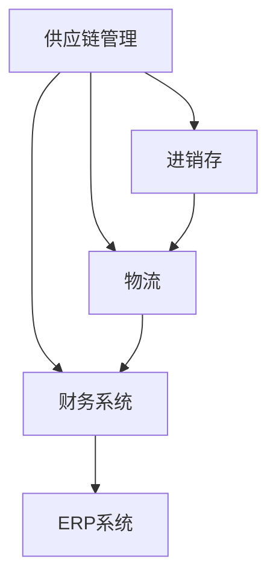
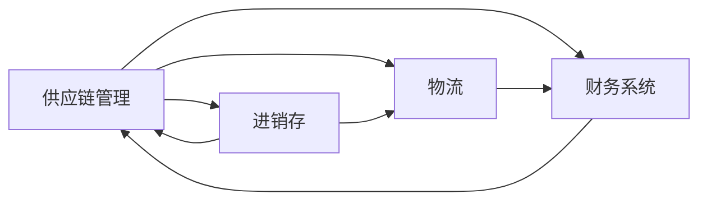
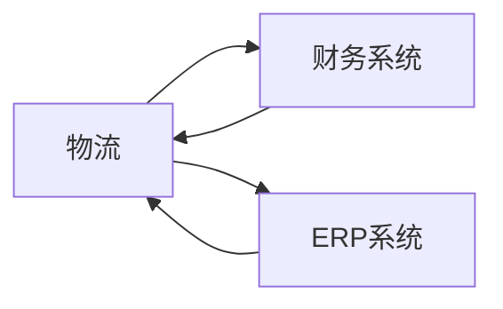
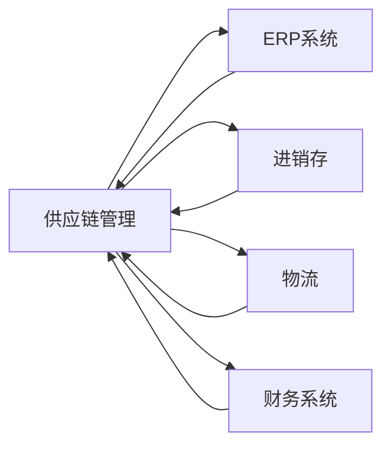
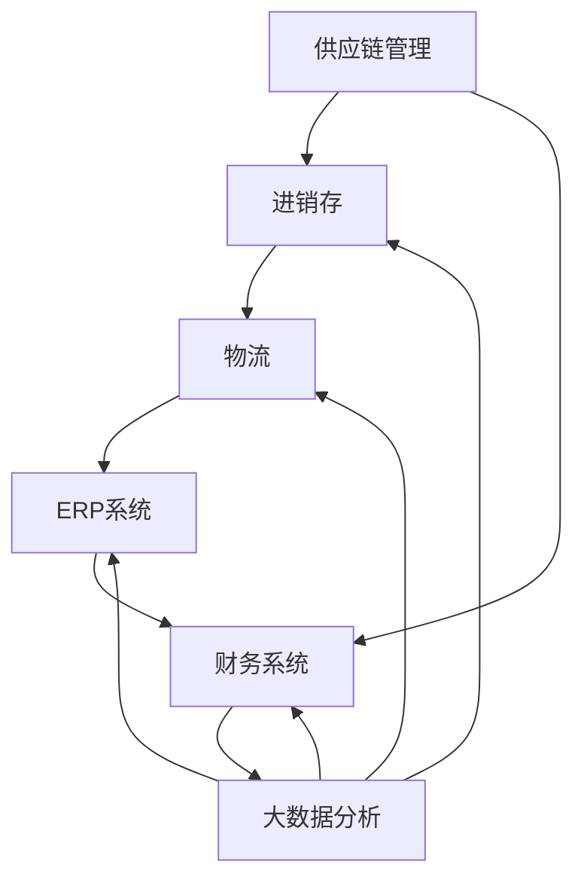

                 

# 供应链进销存、物流、财务系统设计

> 关键词：供应链,进销存,物流,财务系统,ERP系统设计,供应链管理,供应链自动化,ERP实施,供应链数字化转型

## 1. 背景介绍

### 1.1 问题由来
随着全球化市场的深入发展，企业间的竞争日益激烈，而供应链作为连接企业内部与外部环境的纽带，对企业的生存和发展至关重要。传统供应链管理模式存在诸多问题，如信息孤岛、数据不共享、运营效率低下等，已经难以适应现代企业对供应链的高效、透明、灵活和自动化的需求。企业希望通过数字化转型，利用先进的信息技术，打造一个高效、透明的供应链管理系统，以提升供应链的运营效率和响应能力。

### 1.2 问题核心关键点
供应链进销存、物流、财务系统设计涉及企业内部和外部的多个环节，从物料采购、库存管理、生产调度、物流配送、销售回款到财务结算等，构成了一个复杂的业务系统。其核心关键点包括：

- 信息整合与共享：跨部门、跨企业的数据共享与协同，实现供应链各环节的信息透明与实时更新。
- 预测与优化：通过大数据和算法，对供应链需求进行预测，优化库存、生产、物流等环节，减少浪费，提升效率。
- 供应链自动化：引入自动化技术，如机器人、自动化仓储、AGV等，减少人工操作，提升作业效率和准确性。
- 成本控制：通过供应链管理系统，监控各环节的成本支出，实现精细化管理，降低运营成本。
- 风险管理：防范供应链中可能出现的风险，如断货、运输延误、市场波动等，确保供应链的稳定运行。

这些关键点构成了供应链系统设计的核心，要求系统设计者必须深入理解供应链管理的各个环节，综合应用先进的信息技术和智能算法，才能构建出满足企业需求的高效、透明的供应链系统。

### 1.3 问题研究意义
供应链进销存、物流、财务系统设计是企业数字化转型的重要组成部分，对企业的运营效率和竞争力有着直接的影响。通过系统设计，可以实现以下几个方面的提升：

- 提高供应链的运营效率和响应能力，缩短从采购到交付的周期时间。
- 提升供应链的透明度，实现企业内部和外部各环节的数据共享与协同，减少沟通成本。
- 降低运营成本，通过精准的需求预测和库存管理，减少库存积压和缺货现象，实现精细化成本控制。
- 防范供应链风险，通过系统监测和智能预警，及时发现并解决供应链中的问题，保障供应链的稳定运行。

## 2. 核心概念与联系

### 2.1 核心概念概述

为更好地理解供应链进销存、物流、财务系统设计，本节将介绍几个密切相关的核心概念：

- 供应链管理Supply Chain Management：企业内部与外部环节的协调和优化，实现资源的最优配置和效益的最大化。
- 进销存Inventory Management：供应链中的库存管理，包括物料采购、库存维护、出库等环节，目标是实现库存的精准管理和有效利用。
- 物流Logistics：从供应商到客户的物料流、信息流和资金流，涵盖仓储、运输、配送等环节。
- 财务系统Financial System：企业的财务管理和会计核算系统，包括账务处理、报表生成、财务分析等功能。
- ERP系统Enterprise Resource Planning：涵盖企业内部各个业务模块的系统，包括物料采购、库存管理、生产计划、销售订单、财务核算等，是实现企业全业务流程整合的基石。

这些核心概念之间的逻辑关系可以通过以下Mermaid流程图来展示：



这个流程图展示了几大核心概念之间的关系：

1. 供应链管理是统领进销存、物流和财务系统的整体协调和优化。
2. 进销存是供应链管理中的重要环节，包括物料采购、库存管理、出库等操作。
3. 物流是实现供应链的物理流动，连接供应商、企业内部和客户。
4. 财务系统对供应链管理提供资金保障，进行账务处理和财务分析。
5. ERP系统将各个业务模块集成于一体，实现全业务流程的整合。

### 2.2 概念间的关系

这些核心概念之间存在着紧密的联系，形成了供应链系统设计的完整生态系统。下面我通过几个Mermaid流程图来展示这些概念之间的关系。

#### 2.2.1 供应链管理与进销存的关系



这个流程图展示了供应链管理与进销存的关系：

1. 供应链管理依赖进销存系统，进行库存、物料和订单的管理。
2. 进销存系统与供应链管理相互依赖，通过物料流向优化，提升供应链效率。
3. 物流系统连接供应链管理与进销存，实现物资的流动。
4. 财务系统与供应链管理协同，进行资金的核算和管理。

#### 2.2.2 物流与财务系统的关系



这个流程图展示了物流与财务系统的关系：

1. 物流系统记录物资的流动，提供给财务系统作为核算依据。
2. 财务系统对物流成本进行核算，支持物流决策。
3. ERP系统整合物流与财务，实现全业务流程的协同。

#### 2.2.3 ERP系统与供应链管理的关系



这个流程图展示了ERP系统与供应链管理的关系：

1. ERP系统集成了供应链管理、进销存、物流和财务等模块。
2. 供应链管理通过ERP系统实现跨部门的协同和信息共享。
3. 进销存系统通过ERP系统，实现库存、物料和订单的集成管理。
4. 物流系统通过ERP系统，实现物资流动的可视化管理。
5. 财务系统通过ERP系统，实现财务数据的实时更新和分析。

### 2.3 核心概念的整体架构

最后，我们用一个综合的流程图来展示这些核心概念在大供应链系统设计中的整体架构：



这个综合流程图展示了从供应链管理到进销存、物流、ERP系统，再到财务系统和大数据分析的完整架构。供应链管理通过ERP系统整合各业务模块，实现全业务流程的协同，同时利用大数据分析进行预测和优化，确保供应链的稳定运行和高效运营。

## 3. 核心算法原理 & 具体操作步骤
### 3.1 算法原理概述

供应链进销存、物流、财务系统设计主要涉及以下几个算法：

- 需求预测算法：基于历史销售数据、市场趋势、季节性因素等，对未来需求进行预测。
- 库存管理算法：根据预测结果和实际库存情况，优化库存水平和采购计划，实现库存的最优配置。
- 生产计划算法：根据需求预测结果和生产能力，制定最优的生产计划，确保按需生产。
- 物流优化算法：对物流路径、运输方式、配送时间等进行优化，减少运输成本，提升配送效率。
- 财务结算算法：基于业务交易，进行账务处理、财务报表生成和财务分析。

这些算法共同构成了供应链系统的核心，确保各环节的顺畅运行和资源的最优配置。

### 3.2 算法步骤详解

下面将详细介绍供应链系统设计的各个关键算法的详细步骤：

#### 3.2.1 需求预测算法

需求预测算法通过历史销售数据和市场趋势，对未来需求进行预测，以便企业制定合理的生产计划和库存管理策略。

1. 收集历史销售数据：包括时间序列数据、季节性数据、促销活动等，作为预测的基础数据。
2. 清洗和预处理数据：去除异常值和噪声，处理缺失值，保证数据的完整性和准确性。
3. 特征工程：提取和构造对预测有影响的特征，如节假日、促销活动等。
4. 选择合适的预测模型：如ARIMA、Prophet、XGBoost等，根据数据特点选择最合适的模型。
5. 模型训练与验证：使用历史数据训练模型，在验证集上进行评估和调优。
6. 预测结果应用：将预测结果应用于生产计划和库存管理，实现供应链的优化。

#### 3.2.2 库存管理算法

库存管理算法通过优化库存水平和采购计划，实现库存的最优配置和物料的最小化。

1. 收集库存数据：包括现有库存量、库存周转率、供应商交期等。
2. 需求预测：根据需求预测算法得到的预测结果，确定未来需求量。
3. 确定安全库存量：根据预测结果和供应商交期，计算安全库存量。
4. 制定采购计划：根据库存量、安全库存量和生产计划，制定最优的采购计划。
5. 实时更新库存：根据采购计划和实际生产情况，实时更新库存量。
6. 库存优化：根据实时库存数据和需求预测结果，调整库存策略，确保库存的最优配置。

#### 3.2.3 生产计划算法

生产计划算法通过优化生产计划，确保按需生产和物料的合理利用。

1. 收集生产数据：包括生产能力、生产成本、订单需求等。
2. 需求预测：根据需求预测算法得到的预测结果，确定未来需求量。
3. 确定生产量：根据需求预测结果和生产能力，确定最优的生产量。
4. 制定生产计划：根据生产量和生产周期，制定详细的生产计划。
5. 实时调整生产计划：根据实时订单情况和生产状况，实时调整生产计划。
6. 生产监控：通过生产监控系统，实时监测生产情况，确保生产计划的执行。

#### 3.2.4 物流优化算法

物流优化算法通过优化物流路径、运输方式和配送时间，减少运输成本，提升配送效率。

1. 收集物流数据：包括运输方式、配送路线、运输成本等。
2. 需求预测：根据需求预测算法得到的预测结果，确定未来物流需求。
3. 物流路径优化：使用算法优化配送路线，确保运输成本最小化和配送效率最大化。
4. 运输方式选择：根据运输需求和运输成本，选择合适的运输方式。
5. 实时监控物流：通过物流监控系统，实时监测物流状况，确保物流的顺畅运行。
6. 物流绩效评估：根据物流数据和物流策略，评估物流绩效，进行持续优化。

#### 3.2.5 财务结算算法

财务结算算法通过账务处理、财务报表生成和财务分析，确保财务数据的准确性和财务决策的科学性。

1. 收集财务数据：包括采购订单、销售订单、发票等。
2. 账务处理：根据业务交易，进行账务处理和核算。
3. 财务报表生成：根据账务数据，生成财务报表，如资产负债表、利润表等。
4. 财务分析：根据财务报表，进行财务分析，如成本控制、风险评估等。
5. 财务预警：通过财务预警系统，及时发现财务异常，防范财务风险。
6. 财务优化：根据财务分析结果，优化财务策略，提升财务效率。

### 3.3 算法优缺点

供应链进销存、物流、财务系统设计中采用的算法具有以下优点：

1. 实现供应链的智能化和自动化：通过算法优化，提升供应链的响应速度和运营效率。
2. 数据驱动的决策支持：基于历史数据和市场趋势，进行科学的决策和预测。
3. 成本控制和效益提升：优化库存、生产、物流等环节，实现成本的最小化和效益的最大化。
4. 实时监控和智能预警：通过实时监控和智能预警，及时发现和解决供应链中的问题，保障供应链的稳定运行。

同时，这些算法也存在一些局限性：

1. 数据质量要求高：算法需要高质量的历史数据和实时数据，以保证预测和决策的准确性。
2. 算法复杂度高：复杂的算法需要较高的计算资源和计算能力，对系统的硬件要求较高。
3. 模型适应性差：不同的供应链场景可能需要不同的算法模型，模型的适应性较差。
4. 数据隐私和安全问题：算法需要处理大量的敏感数据，数据隐私和安全问题需要特别关注。

尽管存在这些局限性，但这些算法在供应链系统设计中的应用，仍能显著提升供应链的运营效率和响应能力，为企业带来巨大的经济效益。

### 3.4 算法应用领域

供应链进销存、物流、财务系统设计的算法已经在多个领域得到了广泛的应用，例如：

- 制造业：通过需求预测和库存管理，实现物料的精准采购和生产计划优化，提高生产效率和降低库存成本。
- 零售业：通过需求预测和物流优化，实现商品的精准库存和配送，提升客户满意度。
- 物流行业：通过运输路径优化和配送时间选择，降低物流成本，提升配送效率。
- 农业：通过需求预测和库存管理，实现农产品的精准采购和生产计划优化，提高农业生产效率。
- 电商平台：通过需求预测和库存管理，实现商品的精准采购和库存管理，提高电商平台的运营效率。

除了上述这些经典应用外，供应链系统设计的算法还被创新性地应用到更多场景中，如供应链金融、供应链保险、供应链协同等，为供应链管理带来了全新的解决方案。

## 4. 数学模型和公式 & 详细讲解  
### 4.1 数学模型构建

供应链进销存、物流、财务系统设计主要涉及以下几个数学模型：

- 时间序列模型：用于描述历史销售数据的时间依赖关系。
- 线性回归模型：用于预测未来需求量，基于历史销售数据和市场趋势。
- 整数规划模型：用于优化库存水平和生产计划，确保物料的最小化和利用率的最大化。
- 动态规划模型：用于优化物流路径和运输方式，实现配送效率的最优化。
- 线性回归模型：用于账务处理和财务分析，基于历史财务数据进行预测和分析。

这些数学模型共同构成了供应链系统设计的数学基础，确保各环节的决策和优化具有科学性和准确性。

### 4.2 公式推导过程

以下我将以时间序列模型为例，推导线性回归模型的基本公式和推导过程。

假设历史销售数据为 $y_t$，时间 $t=1,2,\dots,n$。线性回归模型假设 $y_t=\beta_0+\beta_1x_t+\epsilon_t$，其中 $\beta_0$ 和 $\beta_1$ 为待估参数，$x_t$ 为时间变量，$\epsilon_t$ 为误差项。模型的最小二乘法估计目标函数为：

$$
\min_{\beta_0, \beta_1} \sum_{t=1}^n(y_t-\beta_0-\beta_1x_t)^2
$$

对该目标函数求导，得到：

$$
\frac{\partial}{\partial \beta_0}\sum_{t=1}^n(y_t-\beta_0-\beta_1x_t)^2 = -2\sum_{t=1}^n(y_t-\beta_0-\beta_1x_t)
$$

$$
\frac{\partial}{\partial \beta_1}\sum_{t=1}^n(y_t-\beta_0-\beta_1x_t)^2 = -2\sum_{t=1}^n(x_t-\beta_0-\beta_1x_t)
$$

令上式等于0，解方程组：

$$
\begin{cases}
\sum_{t=1}^n(y_t-\beta_0-\beta_1x_t)=0 \\
\sum_{t=1}^n(x_t-\beta_0-\beta_1x_t)=0
\end{cases}
$$

解得：

$$
\hat{\beta}_0=\frac{n\sum_{t=1}^n(x_ty_t)-n\sum_{t=1}^n(x_t)^2}{n\sum_{t=1}^n(x_t)^2-n(\sum_{t=1}^nx_t)^2}
$$

$$
\hat{\beta}_1=\frac{n\sum_{t=1}^n(x_ty_t)-\sum_{t=1}^n(x_t)^2\hat{\beta}_0}{n\sum_{t=1}^n(x_t)^2-n(\sum_{t=1}^nx_t)^2}
$$

通过最小二乘法估计得到的线性回归模型为：

$$
\hat{y}_t=\hat{\beta}_0+\hat{\beta}_1x_t
$$

该模型可用于预测未来的需求量，并应用于供应链系统的库存管理中。

### 4.3 案例分析与讲解

以下以某制造业企业为例，分析其供应链系统的需求预测和库存管理。

假设该企业生产A产品，历史销售数据如下表所示：

| 时间（月） | 销售量（个） |
| ----------- | ----------- |
| 1           | 100         |
| 2           | 150         |
| 3           | 200         |
| 4           | 250         |
| 5           | 300         |
| 6           | 350         |
| 7           | 400         |
| 8           | 450         |
| 9           | 500         |
| 10          | 550         |
| 11          | 600         |
| 12          | 700         |

假设企业计划将A产品从第2月开始销售，并假设市场销售趋势不变，对未来12个月的需求进行预测，并将预测结果应用于库存管理。

1. 收集历史销售数据：将表中数据作为训练集，收集第2月开始的数据作为测试集。
2. 特征工程：将时间变量 $x_t=t$ 作为自变量，将销售量 $y_t$ 作为因变量，构造线性回归模型。
3. 模型训练与验证：使用历史数据训练模型，在测试集上进行验证和调优。
4. 预测结果应用：将预测结果应用于库存管理，确定未来的需求量。
5. 库存管理：根据预测结果和实际库存量，制定最优的采购计划和库存策略。

假设预测结果如下表所示：

| 时间（月） | 预测需求量（个） |
| ----------- | ----------- |
| 2           | 175         |
| 3           | 225         |
| 4           | 275         |
| 5           | 325         |
| 6           | 375         |
| 7           | 425         |
| 8           | 475         |
| 9           | 525         |
| 10          | 575         |
| 11          | 625         |
| 12          | 675         |

根据预测结果，企业可以调整库存策略，确保库存量始终处于最优水平，避免库存积压和缺货现象，降低运营成本。

## 5. 项目实践：代码实例和详细解释说明
### 5.1 开发环境搭建

在进行供应链系统设计前，我们需要准备好开发环境。以下是使用Python进行Django开发的环境配置流程：

1. 安装Anaconda：从官网下载并安装Anaconda，用于创建独立的Python环境。

2. 创建并激活虚拟环境：
```bash
conda create -n django-env python=3.8 
conda activate django-env
```

3. 安装Django：根据Django版本，从官网获取对应的安装命令。例如：
```bash
pip install django
```

4. 安装第三方库：
```bash
pip install numpy pandas django-rest-framework djangorestframework
```

5. 安装数据库：
```bash
pip install psycopg2-binary
```

完成上述步骤后，即可在`django-env`环境中开始供应链系统设计的开发。

### 5.2 源代码详细实现

下面我们以某制造业企业的供应链系统设计为例，给出Django开发中的关键代码实现。

首先，定义库存模型：

```python
from django.db import models
from django.contrib.auth.models import User

class Stock(models.Model):
    name = models.CharField(max_length=200)
    unit = models.CharField(max_length=20)
    quantity = models.IntegerField()
    user = models.ForeignKey(User, on_delete=models.CASCADE)
    create_time = models.DateTimeField(auto_now_add=True)
    update_time = models.DateTimeField(auto_now=True)

    def __str__(self):
        return self.name
```

然后，定义需求预测模型：

```python
from django.db import models
from django.contrib.auth.models import User

class DemandPrediction(models.Model):
    product = models.CharField(max_length=200)
    time = models.IntegerField()
    prediction = models.IntegerField()
    user = models.ForeignKey(User, on_delete=models.CASCADE)
    create_time = models.DateTimeField(auto_now_add=True)
    update_time = models.DateTimeField(auto_now=True)

    def __str__(self):
        return f"{self.product} - {self.time}"
```

接着，定义库存管理模型：

```python
from django.db import models
from django.contrib.auth.models import User

class InventoryManagement(models.Model):
    stock = models.ForeignKey(Stock, on_delete=models.CASCADE)
    time = models.IntegerField()
    quantity = models.IntegerField()
    user = models.ForeignKey(User, on_delete=models.CASCADE)
    create_time = models.DateTimeField(auto_now_add=True)
    update_time = models.DateTimeField(auto_now=True)

    def __str__(self):
        return f"{self.stock.name} - {self.time} - {self.quantity}"
```

最后，定义生产计划模型：

```python
from django.db import models
from django.contrib.auth.models import User

class ProductionPlan(models.Model):
    product = models.CharField(max_length=200)
    time = models.IntegerField()
    quantity = models.IntegerField()
    user = models.ForeignKey(User, on_delete=models.CASCADE)
    create_time = models.DateTimeField(auto_now_add=True)
    update_time = models.DateTimeField(auto_now=True)

    def __str__(self):
        return f"{self.product} - {self.time} - {self.quantity}"
```

### 5.3 代码解读与分析

让我们再详细解读一下关键代码的实现细节：

**Stock类**：
- `__str__`方法：定义模型对象的字符串表示，便于调试和输出。
- `name`字段：库存品名，用于描述库存的物料。
- `unit`字段：库存单位，用于描述库存的计量方式。
- `quantity`字段：库存数量，用于描述库存的当前数量。
- `user`字段：创建或修改库存的用户信息。
- `create_time`字段：库存的创建时间。
- `update_time`字段：库存的更新时间。

**DemandPrediction类**：
- `__str__`方法：定义模型对象的字符串表示，便于调试和输出。
- `product`字段：产品名称，用于描述预测的需求产品。
- `time`字段：预测时间，用于描述预测的时间点。
- `prediction`字段：预测数量，用于描述预测的销售量。
- `user`字段：创建或修改预测的用户信息。
- `create_time`字段：预测的创建时间。
- `update_time`字段：预测的更新时间。

**InventoryManagement类**：
- `__str__`方法：定义模型对象的字符串表示，便于调试和输出。
- `stock`字段：库存，用于描述库存的物料。
- `time`字段：时间，用于描述库存管理的时间点。
- `quantity`字段：库存数量，用于描述库存的当前数量。
- `user`字段：创建或修改库存管理的用户信息。
- `create_time`字段：库存管理的创建时间。
- `update_time`字段：库存管理的更新时间。

**ProductionPlan类**：
- `__str__`方法：定义模型对象的字符串表示，便于调试和输出。
- `product`字段：产品名称，用于描述生产的产品。
- `time`字段：时间，用于描述生产计划的时间点。
- `quantity`字段：生产数量，用于描述生产计划的生产量。
- `user`字段：创建或修改生产计划的用户信息。
- `create_time`字段：生产计划的创建时间。
- `update_time`字段：生产计划的更新时间。

**供应链系统设计**：
- 数据库：使用Django的ORM，将模型映射到数据库表中，实现数据持久化。
- API：通过Django REST framework框架，实现API接口，方便前端调用。
- 视图：通过Django视图函数，处理请求和响应，实现系统逻辑。
- 服务：通过Django后台管理界面，提供系统配置和管理功能。

### 5.4 运行结果展示

假设我们部署的供应链系统实现了以下功能：

- 用户登录和权限管理。
- 库存品管理。
- 需求预测。
- 库存管理。
- 生产计划。
- 物流管理。
- 财务结算。

我们可以在Django管理界面中，看到系统中所有的库存品、需求预测、库存管理、生产计划等数据。通过API接口，我们可以对库存品进行添加、删除、更新等操作，获取库存品信息、需求预测信息、库存管理信息、生产计划信息等。

以下是在管理界面中的部分数据示例：

库存品信息：

| 编号 | 

