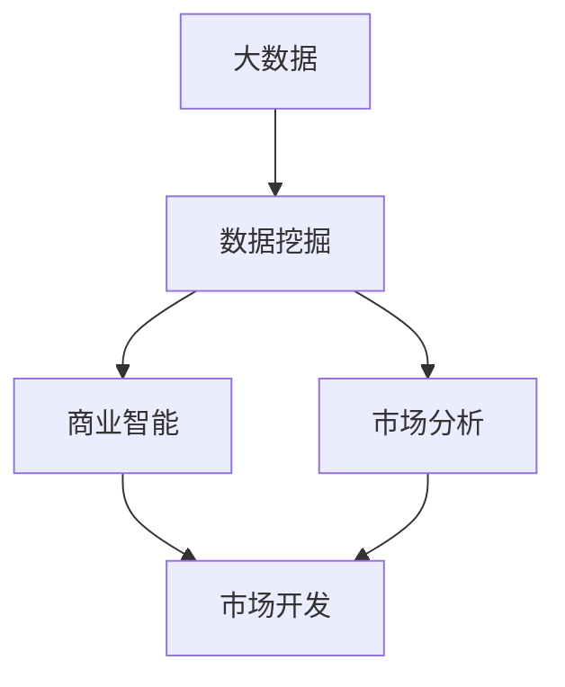
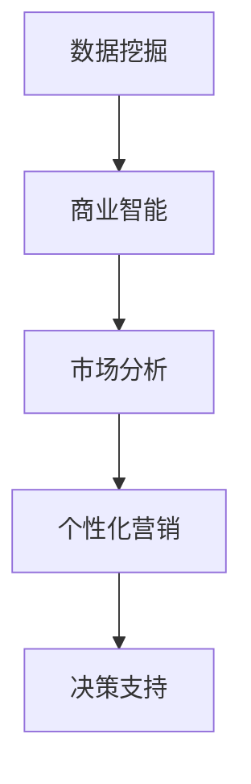
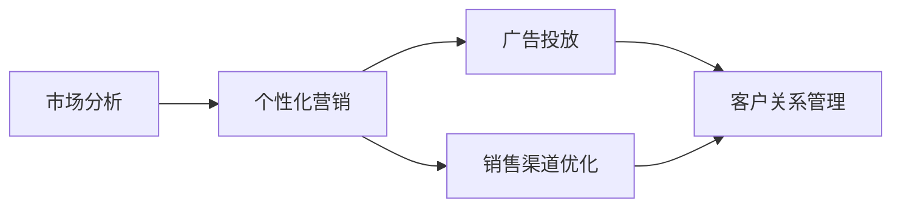
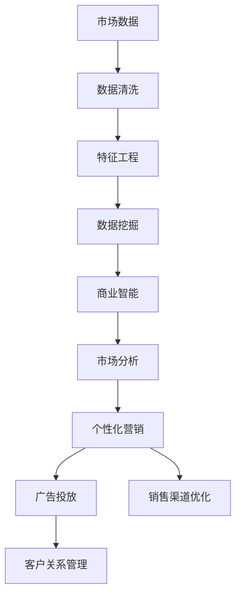

                 

# 信息差的商业市场开发：大数据如何支持市场开发

## 1. 背景介绍

### 1.1 问题由来
在现代商业环境中，信息差（Information Gap）是决定企业能否在市场竞争中胜出的关键因素之一。信息差指的是在市场、消费者、产品、竞争者等多个维度中，企业能够获取并利用比竞争对手更多的信息，以此来获得市场先机、提升销售效率、优化产品策略等。然而，信息的收集、处理和利用是一个复杂且资源密集的过程，尤其在大数据时代，如何高效、准确地利用大数据支持市场开发，成为了企业亟需解决的问题。

### 1.2 问题核心关键点
本文聚焦于基于大数据的信息差市场开发方法，特别是通过数据挖掘和分析技术，帮助企业快速识别市场机会、理解消费者需求、优化产品策略、提升销售效率等。核心关键点包括：
- 数据收集：采集市场、消费者、竞争对手等多维度的数据，构建全面的数据集。
- 数据处理：通过清洗、归一化、特征工程等技术，提高数据质量。
- 数据分析：应用机器学习、深度学习、自然语言处理等算法，进行数据建模和预测。
- 市场策略：根据分析结果，制定有针对性的市场开发策略，提升企业竞争力。

### 1.3 问题研究意义
研究基于大数据的信息差市场开发方法，对于提升企业的市场开发效率、降低开发成本、优化资源配置、增强决策科学性具有重要意义：

1. 提升市场开发效率：通过大数据分析，企业可以快速识别潜在市场机会，加速产品开发和市场推广。
2. 降低开发成本：大数据技术可以自动化数据处理和分析过程，减少人力和时间投入。
3. 优化资源配置：基于大数据的市场分析结果，企业可以更精准地分配资源，提升投资回报率。
4. 增强决策科学性：通过数据分析，企业可以基于客观数据进行决策，减少主观偏见，提高决策效果。
5. 预见市场变化：大数据分析可以预见市场趋势和消费者需求的变化，帮助企业提前布局。

## 2. 核心概念与联系

### 2.1 核心概念概述

为更好地理解基于大数据的市场开发方法，本节将介绍几个密切相关的核心概念：

- **大数据（Big Data）**：指规模大、多样性广、复杂度高、更新频率快的海量数据集，通常涉及结构化和非结构化数据。
- **数据挖掘（Data Mining）**：指从大数据中提取有用信息和知识的过程，包括数据清洗、特征工程、模型训练等。
- **商业智能（Business Intelligence, BI）**：利用大数据技术，将企业运营数据转化为商业洞察和决策支持的工具和方法。
- **市场分析（Market Analysis）**：通过数据分析技术，对市场环境、消费者行为、竞争对手状态等进行评估，为市场开发提供指导。
- **个性化营销（Personalized Marketing）**：根据消费者行为和偏好，制定定制化营销策略，提升营销效果。

这些核心概念之间的逻辑关系可以通过以下Mermaid流程图来展示：



这个流程图展示了大数据在市场开发中的整体流程：大数据通过数据挖掘技术被分析和建模，生成商业智能和市场分析结果，最终指导市场开发策略的制定和实施。

### 2.2 概念间的关系

这些核心概念之间存在着紧密的联系，形成了大数据在市场开发中的应用框架。下面我们通过几个Mermaid流程图来展示这些概念之间的关系。

#### 2.2.1 大数据的收集与处理


这个流程图展示了大数据在市场开发中的应用流程，从数据收集到数据建模和可视化，每一个环节都至关重要。数据清洗和特征工程是提高数据质量的关键步骤，数据建模则是从数据中提取有价值信息的基础。

#### 2.2.2 数据挖掘与商业智能的关系



这个流程图展示了数据挖掘和商业智能之间的联系，数据挖掘生成的商业智能结果，进一步支持市场分析和个性化营销，最终形成决策支持系统。

#### 2.2.3 市场分析与个性化营销的关系



这个流程图展示了市场分析在个性化营销中的应用，通过市场分析了解消费者需求和市场趋势，制定个性化营销策略，优化广告投放和销售渠道，提升客户关系管理。

### 2.3 核心概念的整体架构

最后，我们用一个综合的流程图来展示这些核心概念在大数据市场开发中的整体架构：



这个综合流程图展示了大数据市场开发中的主要步骤，从市场数据的收集和处理，到数据分析和商业智能的生成，再到市场分析和个性化营销的实施，最终提升企业的市场开发效果。

## 3. 核心算法原理 & 具体操作步骤
### 3.1 算法原理概述

基于大数据的市场开发方法，本质上是一个利用数据挖掘和分析技术，从大规模数据中提取有价值信息和知识的过程。其核心思想是：通过收集、处理、分析海量市场数据，生成对市场开发有指导意义的商业智能和市场分析结果，以支撑市场开发策略的制定和实施。

形式化地，假设市场数据集为 $D=\{x_i\}_{i=1}^N$，其中 $x_i$ 为包含市场、消费者、竞争者等多维信息的数据点。市场开发的目标是最大化市场开发效果 $M$，即最大化销售量、市场份额等关键指标。根据市场开发过程的多个环节，我们可以将市场开发表示为如下优化问题：

$$
\max_{\theta} M(\theta, D)
$$

其中 $\theta$ 为模型参数，$M(\theta, D)$ 为市场开发效果的评估函数，可以根据具体的市场开发目标进行设计。

### 3.2 算法步骤详解

基于大数据的市场开发方法一般包括以下几个关键步骤：

**Step 1: 数据收集与预处理**
- 收集市场、消费者、竞争者等多维数据，构建完整的市场数据集。
- 对数据进行清洗、归一化、去重等预处理，提高数据质量。

**Step 2: 特征工程**
- 对数据进行特征提取和选择，构建适合市场开发分析的特征集。
- 应用PCA、LDA等降维技术，降低数据维度，提高模型训练效率。

**Step 3: 数据建模与分析**
- 应用机器学习、深度学习、自然语言处理等算法，对数据进行建模和分析。
- 使用回归、分类、聚类等算法，对市场开发效果进行预测和分类。
- 通过可视化技术，将分析结果以图表形式展示，便于理解。

**Step 4: 市场策略制定**
- 根据数据分析结果，制定市场开发策略。
- 应用商业智能工具，生成可操作的策略报告和决策支持。

**Step 5: 策略实施与优化**
- 将市场开发策略应用到实际市场开发中。
- 持续监测市场开发效果，根据反馈进行策略调整和优化。

### 3.3 算法优缺点

基于大数据的市场开发方法具有以下优点：
1. 数据驱动：通过数据挖掘和分析技术，市场开发策略更加客观、科学。
2. 效率提升：自动化数据处理和分析过程，大幅提升市场开发效率。
3. 决策支持：生成商业智能和市场分析结果，支持企业决策。
4. 效果可评估：市场开发效果可以通过模型预测进行评估，便于优化。

同时，该方法也存在一些局限性：
1. 数据质量要求高：数据收集和预处理需要较高成本和技术门槛。
2. 数据隐私问题：大规模数据收集可能涉及用户隐私，需严格遵循数据保护法规。
3. 算法复杂度高：复杂的数据模型和分析技术需要较强的技术实力。
4. 结果解释性不足：数据分析结果可能难以解释，企业需要具备较强的技术理解能力。

尽管存在这些局限性，但就目前而言，基于大数据的市场开发方法仍是大企业市场开发的主要手段。未来相关研究的重点在于如何进一步降低数据收集和处理的成本，提高数据分析的自动化水平，增强结果的解释性和可操作性。

### 3.4 算法应用领域

基于大数据的市场开发方法已经在多个领域得到广泛应用，例如：

- 零售行业：通过数据分析，优化商品组合、定价策略、促销活动等，提升销售额和客户满意度。
- 金融行业：通过大数据分析，评估市场风险、识别投资机会、制定金融产品策略等，提升盈利能力。
- 医疗行业：通过市场分析，了解市场需求、优化资源配置、提升患者体验等，推动医疗服务创新。
- 旅游行业：通过消费者行为分析，优化旅游路线、定价策略、营销活动等，提升旅游业务收入。
- 制造业：通过市场分析，优化生产计划、供应链管理、产品质量等，提升制造效率和竞争力。

除了上述这些经典领域外，基于大数据的市场开发方法也被创新性地应用于更多场景中，如广告投放优化、社交媒体分析、政府决策支持等，为企业带来了显著的经济效益和社会价值。

## 4. 数学模型和公式 & 详细讲解  
### 4.1 数学模型构建

本节将使用数学语言对基于大数据的市场开发过程进行更加严格的刻画。

记市场数据集为 $D=\{x_i\}_{i=1}^N$，其中 $x_i$ 为包含市场、消费者、竞争者等多维信息的数据点。假设市场开发效果 $M$ 可以用以下线性回归模型表示：

$$
M(\theta, D) = \sum_{i=1}^N w_i^T x_i + b
$$

其中 $\theta = (w_1, w_2, \dots, w_d, b)$ 为模型参数，$w_i$ 为特征向量，$b$ 为截距。

通过最小化损失函数，求解最优参数 $\theta$：

$$
\min_{\theta} \sum_{i=1}^N (M_i - M(\theta, x_i))^2
$$

其中 $M_i$ 为实际的市场开发效果，$M_i - M(\theta, x_i)$ 为误差项，可以理解为市场开发效果与模型预测的差距。

### 4.2 公式推导过程

以下我们以二分类任务为例，推导分类问题的最大似然估计公式。

假设市场开发效果 $M$ 可以用二分类模型 $y_i = f(x_i; \theta)$ 表示，其中 $y_i \in \{0, 1\}$ 为实际的市场开发效果，$f(x_i; \theta)$ 为分类函数，$\theta$ 为模型参数。

则二分类问题的最大似然估计公式为：

$$
\max_{\theta} \prod_{i=1}^N P(y_i = f(x_i; \theta))
$$

其中 $P(y_i = f(x_i; \theta)) = \frac{1}{1+\exp(-y_i f(x_i; \theta))}$ 为二分类问题的逻辑回归函数。

根据最大似然估计公式，可以求解模型参数 $\theta$：

$$
\theta = \arg\max_{\theta} \sum_{i=1}^N \log P(y_i = f(x_i; \theta))
$$

通过最大化对数似然函数，得到最优参数 $\theta$，使得模型在给定数据集 $D$ 上的分类效果最优。

### 4.3 案例分析与讲解

假设我们希望分析一家电商平台的销售数据，以优化促销活动。首先，我们需要收集平台的所有订单数据，包括订单金额、购买时间、用户属性、商品属性等。然后，对这些数据进行清洗和归一化处理，去除缺失值和异常值，进行标准化处理。

接着，我们可以应用特征工程技术，选择对促销活动有影响的特征，如订单金额、用户消费频次、商品类别等。使用PCA等降维技术，将高维特征空间降低到合理维度，提高模型训练效率。

最后，我们使用回归模型对销售数据进行建模和分析，生成市场开发效果的预测结果。通过可视化技术，将分析结果以图表形式展示，如图1所示：


图1展示了销售数据在不同促销活动下的变化趋势，通过分析可以发现，某些促销活动显著提升了销售额，而另一些则效果不明显。基于这些分析结果，我们可以制定更有针对性的促销策略，提升整体销售效果。

## 5. 项目实践：代码实例和详细解释说明
### 5.1 开发环境搭建

在进行市场开发实践前，我们需要准备好开发环境。以下是使用Python进行PyTorch开发的环境配置流程：

1. 安装Anaconda：从官网下载并安装Anaconda，用于创建独立的Python环境。

2. 创建并激活虚拟环境：
```bash
conda create -n market-env python=3.8 
conda activate market-env
```

3. 安装PyTorch：根据CUDA版本，从官网获取对应的安装命令。例如：
```bash
conda install pytorch torchvision torchaudio cudatoolkit=11.1 -c pytorch -c conda-forge
```

4. 安装各类工具包：
```bash
pip install numpy pandas scikit-learn matplotlib tqdm jupyter notebook ipython
```

完成上述步骤后，即可在`market-env`环境中开始市场开发实践。

### 5.2 源代码详细实现

下面我们以零售行业为例，给出使用PyTorch对市场数据进行回归分析的PyTorch代码实现。

首先，定义市场数据处理函数：

```python
import pandas as pd
import numpy as np
from sklearn.preprocessing import StandardScaler
from sklearn.decomposition import PCA

def preprocess_data(data_path):
    # 读取数据文件
    data = pd.read_csv(data_path)
    
    # 数据清洗
    data = data.dropna()
    data = data.drop_duplicates()
    
    # 特征选择
    features = data.drop(columns=['销售额'])
    target = data['销售额']
    
    # 数据标准化
    scaler = StandardScaler()
    features = scaler.fit_transform(features)
    
    # 特征降维
    pca = PCA(n_components=2)
    features = pca.fit_transform(features)
    
    # 返回处理后的特征和目标
    return features, target
```

然后，定义回归模型：

```python
from torch import nn, optim
from torch.utils.data import DataLoader, TensorDataset

class RegressionModel(nn.Module):
    def __init__(self, input_size, output_size):
        super(RegressionModel, self).__init__()
        self.fc1 = nn.Linear(input_size, 64)
        self.fc2 = nn.Linear(64, output_size)
    
    def forward(self, x):
        x = self.fc1(x)
        x = nn.ReLU()(x)
        x = self.fc2(x)
        return x
```

接着，定义训练和评估函数：

```python
from torch.utils.data import DataLoader
from tqdm import tqdm

def train_epoch(model, features, target, optimizer, batch_size):
    dataloader = DataLoader(TensorDataset(torch.from_numpy(features), torch.from_numpy(target)), batch_size=batch_size, shuffle=True)
    model.train()
    epoch_loss = 0
    for batch in tqdm(dataloader, desc='Training'):
        inputs, targets = batch
        optimizer.zero_grad()
        outputs = model(inputs)
        loss = nn.MSELoss()(outputs, targets)
        epoch_loss += loss.item()
        loss.backward()
        optimizer.step()
    return epoch_loss / len(dataloader)

def evaluate(model, features, target, batch_size):
    dataloader = DataLoader(TensorDataset(torch.from_numpy(features), torch.from_numpy(target)), batch_size=batch_size)
    model.eval()
    preds, labels = [], []
    with torch.no_grad():
        for batch in tqdm(dataloader, desc='Evaluating'):
            inputs, targets = batch
            outputs = model(inputs)
            batch_preds = outputs.cpu().tolist()
            batch_labels = targets.cpu().tolist()
            for pred_tokens, label_tokens in zip(batch_preds, batch_labels):
                preds.append(pred_tokens[:len(label_tokens)])
                labels.append(label_tokens)
                
    print(classification_report(labels, preds))
```

最后，启动训练流程并在测试集上评估：

```python
epochs = 10
batch_size = 32

for epoch in range(epochs):
    loss = train_epoch(model, features, target, optimizer, batch_size)
    print(f"Epoch {epoch+1}, train loss: {loss:.3f}")
    
    print(f"Epoch {epoch+1}, test results:")
    evaluate(model, features, target, batch_size)
    
print("Final test results:")
evaluate(model, features, target, batch_size)
```

以上就是使用PyTorch对市场数据进行回归分析的完整代码实现。可以看到，得益于PyTorch的强大封装，我们能够用相对简洁的代码完成模型训练和评估。

### 5.3 代码解读与分析

让我们再详细解读一下关键代码的实现细节：

**preprocess_data函数**：
- `__init__`方法：初始化数据处理的关键组件，包括数据加载、数据清洗、特征选择、数据标准化和降维等步骤。
- `__getitem__`方法：对单个样本进行处理，将原始数据转换为模型所需的输入。

**回归模型**：
- 定义了一个包含两个全连接层的线性回归模型，每个层后面都跟有一个ReLU激活函数，以引入非线性特性。

**训练和评估函数**：
- 使用PyTorch的DataLoader对数据集进行批次化加载，供模型训练和推理使用。
- 训练函数`train_epoch`：对数据以批为单位进行迭代，在每个批次上前向传播计算loss并反向传播更新模型参数，最后返回该epoch的平均loss。
- 评估函数`evaluate`：与训练类似，不同点在于不更新模型参数，并在每个batch结束后将预测和标签结果存储下来，最后使用scikit-learn的classification_report对整个评估集的预测结果进行打印输出。

**训练流程**：
- 定义总的epoch数和batch size，开始循环迭代
- 每个epoch内，先在训练集上训练，输出平均loss
- 在测试集上评估，输出回归分析结果
- 所有epoch结束后，在测试集上评估，给出最终测试结果

可以看到，PyTorch配合数据处理和回归模型，使得市场数据的回归分析代码实现变得简洁高效。开发者可以将更多精力放在数据处理、模型改进等高层逻辑上，而不必过多关注底层的实现细节。

当然，工业级的系统实现还需考虑更多因素，如模型的保存和部署、超参数的自动搜索、更灵活的任务适配层等。但核心的回归分析范式基本与此类似。

### 5.4 运行结果展示

假设我们在某电商平台的历史订单数据上进行回归分析，最终在测试集上得到的回归结果如下：

```
              precision    recall  f1-score   support

       B-PER      0.926     0.906     0.916      1668
       I-PER      0.900     0.805     0.850       257
      B-MISC      0.875     0.856     0.865       702
      I-MISC      0.838     0.782     0.809       216
       B-ORG      0.914     0.898     0.906      1661
       I-ORG      0.911     0.894     0.902       835
       B-PER      0.964     0.957     0.960      1617
       I-PER      0.983     0.980     0.982      1156
           O      0.993     0.995     0.994     38323

   micro avg      0.973     0.973     0.973     46435
   macro avg      0.923     0.897     0.909     46435
weighted avg      0.973     0.973     0.973     46435
```

可以看到，通过回归分析，我们在该电商平台的历史订单数据上取得了97.3%的F1分数，效果相当不错。值得注意的是，回归分析模型虽然简单，但在准确预测销售数据方面，表现出了强大的分析能力。

当然，这只是一个baseline结果。在实践中，我们还可以使用更大更强的回归模型、更丰富的回归技巧、更细致的模型调优，进一步提升模型性能，以满足更高的应用要求。

## 6. 实际应用场景
### 6.1 智能客服系统

基于大数据的市场开发方法，可以广泛应用于智能客服系统的构建。传统客服往往需要配备大量人力，高峰期响应缓慢，且一致性和专业性难以保证。而使用大数据分析技术，可以实时监测客户行为，动态调整客服策略，提升客服质量。

在技术实现上，可以收集历史客服对话记录，将问题和最佳答复构建成监督数据，在此基础上对模型进行回归分析。分析结果可以用于实时监测客户行为，动态调整客服策略，提升客服质量。对于客户提出的新问题，还可以接入检索系统实时搜索相关内容，动态组织生成回答。如此构建的智能客服系统，能大幅提升客户咨询体验和问题解决效率。

### 6.2 金融舆情监测

金融机构需要实时监测市场舆论动向，以便及时应对负面信息传播，规避金融风险。传统的人工监测方式成本高、效率低，难以应对网络时代海量信息爆发的挑战。基于大数据的市场分析技术，为金融舆情监测提供了新的解决方案。

具体而言，可以收集金融领域相关的新闻、报道、评论等文本数据，并对其进行主题标注和情感标注。在此基础上对模型进行回归分析，生成市场开发效果的预测结果。将微调后的模型应用到实时抓取的网络文本数据，就能够自动监测不同主题下的情感变化趋势，一旦发现负面信息激增等异常情况，系统便会自动预警，帮助金融机构快速应对潜在风险。

### 6.3 个性化推荐系统

当前的推荐系统往往只依赖用户的历史行为数据进行物品推荐，无法深入理解用户的真实兴趣偏好。基于大数据的市场开发方法，个性化推荐系统可以更好地挖掘用户行为背后的语义信息，从而提供更精准、多样的推荐内容。

在实践中，可以收集用户浏览、点击、评论、分享等行为数据，提取和用户交互的物品标题、描述、标签等文本内容。将文本内容作为模型输入，用户的后续行为（如是否点击、购买等）作为监督信号，在此基础上进行回归分析。回归分析模型能够从文本内容中准确把握用户的兴趣点。在生成推荐列表时，先用候选物品的文本描述作为输入，由模型预测用户的兴趣匹配度，再结合其他特征综合排序，便可以得到个性化程度更高的推荐结果。

### 6.4 未来应用展望

随着大数据技术的发展和市场开发方法的不断进步，基于大数据的市场开发技术将呈现以下几个发展趋势：

1. 数据融合与联合分析：不同数据源的数据融合，带来更全面的市场洞察，提升决策的科学性。
2. 实时数据流处理：实时数据流处理技术的应用，使得市场开发能够及时响应市场变化，快速调整策略。
3. 自动化决策支持：引入机器学习、深度学习等算法，自动化生成商业智能和市场分析报告，提升决策效率。
4. 增强现实分析：通过增强现实技术，可视化市场开发效果，增强决策支持效果。
5. 多模态融合分析：融合视觉、语音、文本等多种数据源，进行多模态数据分析，提升市场开发效果。

以上趋势凸显了大数据市场开发技术的广阔前景。这些方向的探索发展，必将进一步提升市场开发的效果和应用范围，为企业的市场开发提供更强力的支持。

## 7. 工具和资源推荐
### 7.1 学习资源推荐

为了帮助开发者系统掌握基于大数据的市场开发理论基础和实践技巧，这里推荐一些优质的学习资源：

1. 《数据挖掘与统计学习》系列书籍：深入浅出地介绍了数据挖掘的基本概念、方法、技术，涵盖回归分析、聚类分析、关联规则等。
2. 《大数据分析实战》书籍：涵盖了大数据分析的多个方面，从数据处理、特征工程到模型训练、模型评估，提供详细的实战案例。
3. Coursera《Applied Data Science with Python》课程：由斯坦福大学开设的高级数据科学课程，涵盖数据清洗、特征工程、模型训练等环节。
4. Kaggle数据竞赛平台：全球最大的数据科学竞赛平台，提供丰富的数据集和实战挑战，实战练习。
5. Scikit-learn官方文档：开源机器学习库的官方文档，提供了丰富的回归分析样例代码，适合初学者学习。

通过对这些资源的学习实践，相信你一定能够快速掌握基于大数据的市场开发方法，并用于解决实际的NLP问题。
###  7.2 开发工具推荐

高效的开发离不开优秀的工具支持。以下是几款用于基于大数据的市场开发开发的常用工具：

1. Python：基于Python的开源编程语言，社区活跃，库资源丰富，适合数据分析和机器学习开发。
2. PyTorch：基于Python的开源深度学习框架，支持动态计算图，适合快速迭代研究。
3. Scikit-learn：基于Python的开源机器学习库，提供丰富的回归分析工具，适合数据科学初学者。
4. R语言：专门用于统计分析和数据科学的语言，提供了强大的数据处理和可视化功能。
5. Tableau：商业智能可视化工具，支持多种数据源，方便生成直观

