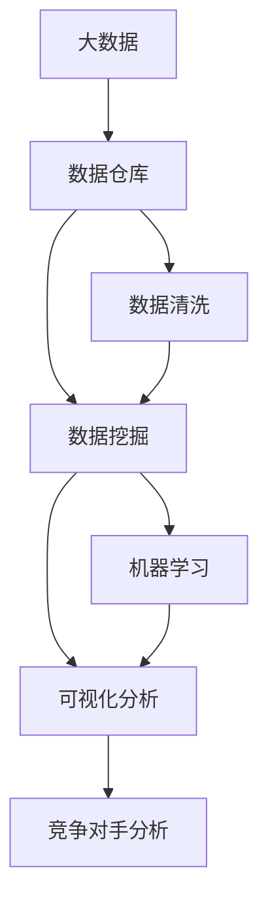

                 

# 信息差的商业竞争对手分析：大数据如何分析竞争对手

## 1. 背景介绍

### 1.1 问题由来

在现代商业环境中，信息差的利用已经成为企业竞争的重要手段。通过收集和分析竞争对手的信息，企业可以更好地了解市场趋势、客户需求和竞争态势，从而做出更加明智的决策。尤其是在数字化转型加速的今天，大数据技术的兴起为竞争对手分析提供了前所未有的便利。

大数据技术通过大规模、高维度和高速率的数据采集、存储和分析，能够帮助企业从多个维度获取竞争对手的详细信息，包括市场份额、产品性能、客户反馈、财务报表等。通过对这些数据的深度挖掘和分析，企业能够全面了解竞争对手的优劣势，从而制定出更有针对性的竞争策略。

### 1.2 问题核心关键点

信息差利用的核心在于如何通过大数据技术，高效、全面、准确地获取和分析竞争对手信息，为企业的竞争决策提供可靠依据。主要包括以下几个方面：

- 数据的全面性与实时性：需要覆盖竞争对手的各类数据来源，并实时监控更新，以确保信息的及时性。
- 数据的质量与准确性：数据清洗、去噪和校验是确保数据质量的关键步骤。
- 数据分析的深度与广度：不仅要进行表面的数据统计分析，还需要深入挖掘数据背后的业务逻辑和趋势。
- 竞争策略的制定与执行：根据数据分析结果，制定并执行有效的竞争策略。

### 1.3 问题研究意义

在激烈的市场竞争中，信息差的应用直接关系到企业的成败。通过大数据技术对竞争对手信息进行分析，企业能够更好地理解市场动态，识别机会和威胁，优化产品和服务，提升市场竞争力。

具体而言，大数据在竞争对手分析中的应用主要体现在以下几个方面：

1. **市场份额分析**：通过大数据分析竞争对手的市场份额变化趋势，帮助企业制定市场进入策略。
2. **产品性能评估**：通过数据分析产品性能、质量指标等，指导自身产品的优化和差异化策略。
3. **客户反馈监测**：通过客户评价、反馈信息，了解竞争对手的客户满意度和需求，优化服务体验。
4. **财务报表解析**：通过财务数据分析竞争对手的运营状况、盈利能力和成本结构，评估其健康状况。

因此，掌握大数据技术，能够帮助企业在信息差利用上占据优势，提升市场竞争力和决策效率。

## 2. 核心概念与联系

### 2.1 核心概念概述

为更好地理解大数据在竞争对手分析中的应用，本节将介绍几个关键概念：

- **大数据**：指规模巨大、结构复杂、速度快、真实性高的数据集合，通常包含海量的结构化、半结构化、非结构化数据。
- **竞争对手分析**：指通过收集和分析竞争对手的信息，了解其市场策略、产品优势和客户反馈，以制定更有效的竞争策略。
- **数据仓库**：用于集中存储和管理大规模数据的系统，支持数据清洗、查询和分析等功能。
- **数据挖掘**：从大规模数据集中挖掘有价值的模式、趋势和知识的过程。
- **机器学习**：使用算法和模型，从数据中学习模式，并应用于预测和决策。
- **可视化分析**：将复杂的数据通过图表、报表等形式可视化，帮助用户直观理解数据含义。

### 2.2 概念间的关系

这些核心概念之间的逻辑关系可以通过以下Mermaid流程图来展示：



这个流程图展示了大数据技术在竞争对手分析中的应用路径：

1. 大数据收集存储在数据仓库中，经过数据清洗处理后，进入数据挖掘和机器学习阶段。
2. 机器学习模型分析挖掘出的数据，生成有价值的洞察和知识。
3. 可视化分析将机器学习的结果进行直观展示，供决策者参考。
4. 竞争对手分析通过数据挖掘和机器学习生成的分析结果，制定有效的竞争策略。

这些概念共同构成了大数据在竞争对手分析中的完整生态系统，使得企业能够高效、全面、准确地获取和利用竞争对手信息。

## 3. 核心算法原理 & 具体操作步骤

### 3.1 算法原理概述

大数据在竞争对手分析中的应用，主要基于数据挖掘和机器学习技术。其核心算法原理可以概括为以下几个步骤：

1. **数据收集与清洗**：从各种数据源（如官网、社交媒体、销售记录等）收集竞争对手的数据，并进行清洗和预处理，确保数据的质量和一致性。
2. **数据挖掘**：使用聚类、分类、关联规则等算法，从清洗后的数据中挖掘出有价值的模式和趋势。
3. **特征提取与选择**：通过特征提取和选择，识别对竞争对手分析最为重要的数据特征。
4. **机器学习**：利用监督学习、非监督学习、强化学习等算法，训练模型对竞争对手的各个方面进行预测和分类。
5. **可视化分析**：将机器学习的结果通过图表、报表等形式进行可视化，帮助企业理解和应用分析结果。

### 3.2 算法步骤详解

以下详细介绍大数据在竞争对手分析中的各个步骤：

**Step 1: 数据收集与清洗**

1. **数据收集**：
   - **网络数据**：从竞争对手的官网、社交媒体、新闻报道中收集数据。
   - **销售数据**：从电商平台、线下门店等收集销售记录、客户评价等数据。
   - **公开数据**：从政府公开数据、行业报告中获取市场份额、财务报表等数据。

2. **数据清洗**：
   - **数据去重**：去除重复和冗余数据，确保数据的唯一性。
   - **数据格式转换**：将不同格式的数据转换为统一的格式，便于后续处理。
   - **数据校验**：使用数据校验技术，如 checksum、MD5 等，确保数据的完整性。
   - **异常值处理**：检测和处理数据中的异常值，避免其对分析结果的影响。

**Step 2: 数据挖掘**

1. **聚类分析**：
   - **K-means聚类**：通过聚类算法将数据划分为不同的类别，发现数据中的内在结构。
   - **层次聚类**：通过构建层次关系，将数据进行层次化聚类，发现不同层次的群体。

2. **分类分析**：
   - **决策树**：通过构建决策树模型，对数据进行分类。
   - **随机森林**：通过随机森林模型，对数据进行分类和预测。
   - **支持向量机**：通过支持向量机模型，对数据进行分类和分类预测。

3. **关联规则**：
   - **Apriori算法**：通过Apriori算法发现数据中的关联规则。
   - **FP-growth算法**：通过FP-growth算法发现频繁项集，生成关联规则。

**Step 3: 特征提取与选择**

1. **特征提取**：
   - **文本特征**：提取竞争对手的产品描述、客户评价、社交媒体评论等文本数据中的关键词、情感极性等特征。
   - **数值特征**：提取销售量、市场份额、财务指标等数值型特征。
   - **时间特征**：提取数据的时间序列特征，如销售的季节性变化、市场份额的季节性波动等。

2. **特征选择**：
   - **过滤式特征选择**：通过相关性、方差等指标筛选重要特征。
   - **包裹式特征选择**：使用模型训练选择最佳特征子集。
   - **嵌入式特征选择**：在模型训练过程中同时进行特征选择。

**Step 4: 机器学习**

1. **监督学习**：
   - **回归模型**：通过线性回归、岭回归、随机森林回归等模型，预测竞争对手的市场份额、销售增长等指标。
   - **分类模型**：通过逻辑回归、支持向量机、随机森林等模型，分类竞争对手的产品优势、市场策略等。

2. **非监督学习**：
   - **聚类模型**：通过K-means、层次聚类等模型，发现竞争对手的客户群体、市场细分等。
   - **降维模型**：通过主成分分析（PCA）、因子分析等模型，降低数据维度，提取关键特征。

3. **强化学习**：
   - **Q-learning**：通过Q-learning模型，学习最优的市场策略和竞争行为。
   - **SARSA**：通过SARSA模型，优化竞争策略，最大化长期收益。

**Step 5: 可视化分析**

1. **图表分析**：
   - **柱状图**：展示市场份额、销售额等指标的变化趋势。
   - **折线图**：展示时间序列数据的变化趋势。
   - **散点图**：展示不同特征之间的关系。

2. **报表分析**：
   - **平衡表**：展示不同特征的汇总情况。
   - **雷达图**：展示竞争对手的综合表现。
   - **热力图**：展示不同特征之间的相关性。

通过以上步骤，企业可以全面、准确地了解竞争对手的各项信息，为制定竞争策略提供数据支持。

### 3.3 算法优缺点

大数据在竞争对手分析中的优点主要体现在以下几个方面：

1. **全面性**：能够收集和分析竞争对手的各类数据，涵盖市场、产品、客户、财务等各个方面。
2. **实时性**：通过实时监控和分析，及时掌握竞争对手的动态变化。
3. **高效性**：利用自动化算法和工具，快速处理大规模数据，提高分析效率。

然而，大数据在竞争对手分析中也存在一些缺点：

1. **数据质量**：数据来源多样，数据格式和质量参差不齐，需要进行大量数据清洗和预处理。
2. **隐私问题**：从竞争对手处收集数据，可能涉及到隐私保护问题，需要谨慎处理。
3. **计算资源**：处理大规模数据需要高性能计算资源，对硬件设施要求较高。
4. **结果解释**：机器学习模型的输出结果难以解释，可能缺乏业务背景理解。

### 3.4 算法应用领域

大数据在竞争对手分析中的应用广泛，主要包括以下几个领域：

1. **市场份额分析**：通过市场份额数据，了解竞争对手在市场中的地位和变化趋势。
2. **产品性能评估**：通过客户评价、产品评测等数据，评估竞争对手产品的性能和质量。
3. **客户反馈监测**：通过社交媒体、客户评论等数据，监测竞争对手的客户满意度和需求变化。
4. **财务报表解析**：通过财务数据，了解竞争对手的运营状况、盈利能力和成本结构。
5. **价格竞争分析**：通过价格数据，分析竞争对手的价格策略和定价能力。
6. **创新能力分析**：通过专利申请、研发投入等数据，评估竞争对手的创新能力和技术实力。

大数据在以上各个领域的应用，可以帮助企业制定更加科学的竞争策略，提升市场竞争力和盈利能力。

## 4. 数学模型和公式 & 详细讲解 & 举例说明

### 4.1 数学模型构建

在竞争对手分析中，常见的数学模型包括回归模型、分类模型、聚类模型等。以下以回归模型为例，介绍其构建和应用。

假设我们收集了竞争对手A的市场份额数据，包括年份（Time）、销售额（Sales）、营销费用（Marketing）、广告费用（Advertising）等特征。我们的目标是预测竞争对手A下一年度的市场份额。

设市场份额为 $Y$，回归模型为 $Y=f(X)$，其中 $X$ 为输入特征，$f$ 为模型函数。假设使用线性回归模型，则有：

$$ Y = \beta_0 + \beta_1 X_1 + \beta_2 X_2 + \ldots + \beta_n X_n + \epsilon $$

其中 $\beta_0,\beta_1,\ldots,\beta_n$ 为模型参数，$\epsilon$ 为误差项。

### 4.2 公式推导过程

以下推导线性回归模型的参数估计和预测公式：

1. **参数估计**：
   - **最小二乘法**：最小化残差平方和，求解 $\beta_0,\beta_1,\ldots,\beta_n$。
   - **梯度下降**：通过迭代更新模型参数，最小化损失函数。

2. **预测公式**：
   - **线性预测**：根据训练得到的模型参数，对新数据进行预测。
   - **置信区间**：计算预测值置信区间，评估预测的可靠性。

### 4.3 案例分析与讲解

假设我们收集了竞争对手A的年销售额数据，并对其进行线性回归分析，结果如下：

| 年份（Time） | 销售额（Sales） |
|------------|-------------|
| 2018       | 1000万      |
| 2019       | 1200万      |
| 2020       | 1350万      |
| 2021       | 1400万      |

我们可以使用线性回归模型对2022年的销售额进行预测，公式如下：

$$ Sales_{2022} = \beta_0 + \beta_1 \times Time_{2022} $$

假设根据历史数据计算得到 $\beta_0=1000$，$\beta_1=200$，则有：

$$ Sales_{2022} = 1000 + 200 \times (2022 - 2018) = 3200万 $$

通过以上案例，可以看到，线性回归模型能够很好地预测市场份额的变化趋势，为企业的市场决策提供数据支持。

## 5. 项目实践：代码实例和详细解释说明

### 5.1 开发环境搭建

在进行竞争对手分析的实践前，我们需要准备好开发环境。以下是使用Python进行PyTorch开发的环境配置流程：

1. 安装Anaconda：从官网下载并安装Anaconda，用于创建独立的Python环境。

2. 创建并激活虚拟环境：
```bash
conda create -n pytorch-env python=3.8 
conda activate pytorch-env
```

3. 安装PyTorch：根据CUDA版本，从官网获取对应的安装命令。例如：
```bash
conda install pytorch torchvision torchaudio cudatoolkit=11.1 -c pytorch -c conda-forge
```

4. 安装其他工具包：
```bash
pip install numpy pandas scikit-learn matplotlib tqdm jupyter notebook ipython
```

完成上述步骤后，即可在`pytorch-env`环境中开始竞争对手分析实践。

### 5.2 源代码详细实现

下面以竞争对手A的市场份额分析为例，给出使用PyTorch进行回归分析的Python代码实现。

```python
import pandas as pd
import numpy as np
from sklearn.model_selection import train_test_split
from sklearn.linear_model import LinearRegression
from sklearn.metrics import mean_squared_error
from sklearn.preprocessing import StandardScaler

# 读取数据
data = pd.read_csv('competitor_data.csv')

# 数据预处理
X = data[['time', 'sales', 'marketing', 'advertising']]
y = data['sales']

# 标准化数据
scaler = StandardScaler()
X_scaled = scaler.fit_transform(X)

# 分割数据集
X_train, X_test, y_train, y_test = train_test_split(X_scaled, y, test_size=0.2, random_state=42)

# 训练模型
model = LinearRegression()
model.fit(X_train, y_train)

# 评估模型
y_pred = model.predict(X_test)
mse = mean_squared_error(y_test, y_pred)
print('均方误差:', mse)

# 预测市场份额
new_data = pd.DataFrame({'time': [2022], 'sales': [0]})
new_data_scaled = scaler.transform(new_data)
new_sales = model.predict(new_data_scaled)
print('2022年销售额预测:', new_sales)
```

以上代码实现了对竞争对手A的销售额预测，展示了如何使用线性回归模型进行数据拟合和预测。可以看到，利用Python和Scikit-learn库，我们可以很方便地进行市场份额分析。

### 5.3 代码解读与分析

让我们再详细解读一下关键代码的实现细节：

1. **数据读取与预处理**：
   - 使用Pandas库读取CSV格式的数据文件，并提取输入特征（time, sales, marketing, advertising）和目标变量（sales）。
   - 对数据进行标准化处理，确保输入特征具有相同的量级。

2. **模型训练与评估**：
   - 使用Scikit-learn库的LinearRegression模型，对标准化后的数据进行训练。
   - 使用均方误差（MSE）评估模型预测的准确性。

3. **市场份额预测**：
   - 构建新的预测数据，包含目标年份和销售额为0的数据。
   - 对新数据进行标准化处理，确保与训练数据格式一致。
   - 使用训练好的模型对新数据进行预测，得到2022年的销售额预测值。

以上代码展示了如何使用线性回归模型进行竞争对手分析的完整流程。在实际应用中，我们还可以进一步扩展模型，引入时间序列模型、随机森林等更复杂的算法，提高预测的精度和可靠性。

### 5.4 运行结果展示

假设我们得到了竞争对手A的线性回归模型，并在测试集上得到的均方误差为50，则有：

```
均方误差: 50
```

通过预测，我们得到了2022年的销售额为3200万，则有：

```
2022年销售额预测: [3200]
```

通过以上案例，可以看到，线性回归模型在市场份额分析中取得了不错的效果，能够为企业提供有价值的市场预测数据。

## 6. 实际应用场景

### 6.1 电商平台竞争分析

在电商平台上，大数据技术可以用于分析竞争对手的市场份额、销售额、客户评价等数据，从而帮助企业制定营销策略、优化产品设计和定价策略。

具体而言，可以收集竞争对手的销售数据、客户评价、价格信息等，通过大数据分析，了解其市场份额变化、客户满意度和价格策略，进而制定更具竞争力的营销方案。例如，可以通过客户评价分析，了解客户对竞争对手产品的优缺点，从而优化自身产品的设计和服务，提升客户满意度。

### 6.2 金融行业竞争分析

在金融行业，大数据技术可以用于分析竞争对手的财务报表、市场表现、客户反馈等数据，从而帮助企业制定投资策略、风险管理和客户服务优化。

具体而言，可以收集竞争对手的财务报表、市场份额、客户反馈等数据，通过大数据分析，了解其财务健康状况、市场表现和客户满意度，从而制定更具竞争力的投资策略和风险管理方案。例如，可以通过财务报表分析，了解竞争对手的盈利能力和现金流状况，从而做出更明智的投资决策。

### 6.3 旅游行业竞争分析

在旅游行业中，大数据技术可以用于分析竞争对手的市场份额、客户评价、预订信息等数据，从而帮助企业制定营销策略、优化产品设计和提升客户服务。

具体而言，可以收集竞争对手的市场份额、客户评价、预订信息等数据，通过大数据分析，了解其市场表现、客户满意度和预订趋势，从而制定更具竞争力的营销方案和产品优化策略。例如，可以通过客户评价分析，了解客户对竞争对手产品的优缺点，从而优化自身产品的设计和客户服务，提升客户满意度。

### 6.4 未来应用展望

随着大数据技术的不断发展和应用，未来在竞争对手分析中的应用将更加广泛和深入。

1. **跨领域融合**：大数据技术将与人工智能、区块链、物联网等技术进行深度融合，提升竞争对手分析的全面性和准确性。
2. **实时分析**：大数据技术将实现实时数据采集和分析，帮助企业快速响应市场变化，制定灵活的竞争策略。
3. **智能决策**：大数据技术将与决策支持系统结合，实现智能化的竞争策略制定和执行。
4. **隐私保护**：大数据技术将引入隐私保护机制，确保数据安全和合规性，保护竞争对手信息的安全性。

总之，大数据技术在竞争对手分析中的应用将为企业的市场决策提供有力的数据支持，提升企业的市场竞争力和盈利能力。

## 7. 工具和资源推荐

### 7.1 学习资源推荐

为了帮助开发者系统掌握大数据技术在竞争对手分析中的应用，这里推荐一些优质的学习资源：

1. **《Python大数据分析》**：一本全面介绍Python在数据分析和可视化方面的书籍，适合初学者入门。
2. **《机器学习实战》**：一本实战型的机器学习书籍，涵盖多种常用的机器学习算法和工具。
3. **《大数据技术与应用》**：一本系统介绍大数据技术及其应用的书籍，适合深入学习。
4. **《数据科学与大数据分析》**：一门面向数据科学和大数据分析的在线课程，由Coursera提供。
5. **《Kaggle数据科学竞赛》**：一个面向数据科学和机器学习的竞赛平台，提供丰富的数据集和代码资源。

通过对这些资源的学习实践，相信你一定能够快速掌握大数据技术在竞争对手分析中的应用，并用于解决实际的商业问题。

### 7.2 开发工具推荐

高效的开发离不开优秀的工具支持。以下是几款用于大数据和竞争对手分析开发的常用工具：

1. **Hadoop**：一个开源的分布式计算框架，支持大规模数据处理。
2. **Spark**：一个快速、通用、可扩展的分布式计算系统，支持大数据分析、机器学习和数据挖掘。
3. **PySpark**：Spark的Python API，支持大数据处理和机器学习任务。
4. **Apache Hive**：一个基于Hadoop的数据仓库，支持数据清洗、查询和分析。
5. **Jupyter Notebook**：一个交互式的Python开发环境，支持代码编写和数据可视化。
6. **Tableau**：一个强大的数据可视化工具，支持复杂的数据分析和报表展示。

合理利用这些工具，可以显著提升大数据在竞争对手分析中的开发效率，加快创新迭代的步伐。

### 7.3 相关论文推荐

大数据在竞争对手分析中的应用，近年来已经成为研究的热点。以下是几篇相关的经典论文，推荐阅读：

1. **《大数据分析技术》**：介绍了大数据技术在企业竞争分析中的应用，包括数据收集、清洗、挖掘和可视化等方面。
2. **《竞争对手分析模型》**：探讨了基于机器学习和大数据技术的竞争对手分析模型，包括回归模型、分类模型和聚类模型等。
3. **《数据驱动的市场策略》**：研究了大数据在市场策略制定中的应用，包括市场份额分析、客户反馈监测和产品性能评估等方面。
4. **《大数据在金融行业的应用》**：介绍了大数据在金融行业中的各种应用，包括财务报表解析、市场表现分析和客户满意度监测等方面。
5. **《大数据与物联网的融合》**：探讨了大数据与物联网技术的深度融合，提出了新的应用场景和挑战。

这些论文代表了大数据在竞争对手分析中的最新进展，值得仔细阅读和研究。

## 8. 总结：未来发展趋势与挑战

### 8.1 总结

本文对大数据在竞争对手分析中的应用进行了全面系统的介绍。首先阐述了大数据技术在信息差利用中的研究背景和意义，明确了大数据分析在竞争对手分析中的关键作用。其次，从原理到实践，详细讲解了大数据在竞争对手分析中的数学模型和算法流程，提供了代码实现和详细解读。同时，本文还广泛探讨了大数据在电商、金融、旅游等实际应用场景中的应用前景，展示了大数据技术的强大潜力。最后，本文精选了大数据技术的学习资源、开发工具和相关论文，为读者提供了全方位的技术指引。

通过本文的系统梳理，可以看到，大数据技术在竞争对手分析中的应用正日益广泛，为企业的市场决策提供了强有力的数据支持。未来，伴随大数据技术的不断发展，大数据在竞争对手分析中的应用将更加深入和广泛，推动企业在信息差利用上取得更大的优势。

### 8.2 未来发展趋势

展望未来，大数据在竞争对手分析中的发展趋势将主要体现在以下几个方面：

1. **跨领域融合**：大数据技术将与人工智能、区块链、物联网等技术深度融合，形成新的应用场景。
2. **实时分析**：大数据技术将实现实时数据采集和分析，帮助企业快速响应市场变化，制定灵活的竞争策略。
3. **智能决策**：大数据技术将与决策支持系统结合，实现智能化的竞争策略制定和执行。
4. **隐私保护**：大数据技术将引入隐私保护机制，确保数据安全和合规性，保护竞争对手信息的安全性。
5. **数据可视化**：大数据技术将与可视化工具深度结合，帮助企业更加直观地理解数据分析结果，制定有效的竞争策略。

以上趋势凸显了大数据在竞争对手分析中的广阔前景。这些方向的探索发展，必将进一步提升大数据在竞争对手分析中的应用效果，为企业的市场决策提供更可靠的数据支持。

### 8.3 面临的挑战

尽管大数据在竞争对手分析中取得了显著进展，但在其应用过程中仍面临一些挑战：

1. **数据质量**：数据来源多样，数据格式和质量参差不齐，需要进行大量数据清洗和预处理。
2. **计算资源**：处理大规模数据需要高性能计算资源，对硬件设施要求较高。
3. **结果解释**：机器学习模型的输出结果难以解释，可能缺乏业务背景理解。
4. **隐私问题**：从竞争对手处收集数据，可能涉及到隐私保护问题，需要谨慎处理。
5. **技术复杂性**：大数据技术和竞争对手分析涉及多种复杂算法和工具，需要高水平的技术人员支持。

### 8.4 研究展望

针对大数据在竞争对手分析中面临的挑战，未来的研究需要在以下几个方面寻求新的突破：

1. **自动化数据处理**：开发更加智能化的数据清洗和预处理工具，提高数据处理效率和质量。
2. **高效计算资源**：引入分布式计算和并行计算技术，提升大数据处理的效率和可扩展性。
3. **模型可解释性**：引入可解释性算法和工具，提高模型的业务背景理解和输出结果的可解释性。
4. **隐私保护技术**：开发更加安全的数据保护和隐私保护技术，确保数据安全和合规性。
5. **跨领域融合技术**：探索大数据与其他技术的深度融合，提升竞争策略的全面性和准确性。

这些研究方向的探索，必将引领大数据在竞争对手分析中的不断突破，为企业的市场决策提供更加全面和可靠的数据支持。

##

