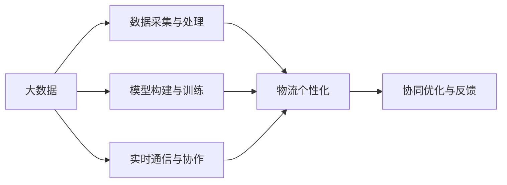
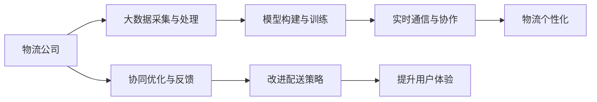

                 

# 信息差的物流个性化优化：大数据如何优化物流个性化

> 关键词：信息差, 物流个性化, 大数据, 算法优化, 协同优化, 配送策略, 数据驱动

## 1. 背景介绍

### 1.1 问题由来
在现代化物流配送行业中，个性化服务正成为吸引客户、提升用户满意度的关键因素。传统的物流配送服务，常常面临配送效率低、用户体验差、配送成本高等问题。而个性化服务可以有效应对这些问题，提供定制化的物流解决方案。

信息差（Information Gap）指的是客户与配送员之间的信息不对称问题。例如，客户对包裹的位置、配送员的行程等信息了解有限，而配送员则掌握详细的物流信息。信息差的存在，降低了配送效率，增加了配送成本，并导致用户体验下降。因此，如何优化信息差，实现物流个性化，是大数据应用在物流领域的关键问题。

### 1.2 问题核心关键点
为了解决信息差问题，需要从以下几个方面进行优化：
1. 数据采集与处理：收集和处理物流相关的数据，包括订单信息、位置信息、交通状况等，以供后续分析。
2. 模型构建与训练：使用机器学习算法构建预测模型，分析用户需求和配送路径，优化配送策略。
3. 实时通信与协作：通过移动设备等实时通信工具，提供配送员和客户之间的信息共享与协作。
4. 协同优化与反馈：基于用户的反馈，不断优化配送策略，提高服务质量。

### 1.3 问题研究意义
优化信息差，实现物流个性化，不仅能提升配送效率、降低成本，还能提升用户体验，构建良好的品牌形象。大数据技术在此过程中发挥着至关重要的作用，能够为物流公司提供强大的数据分析与决策支持能力。

通过大数据分析，可以识别出高价值客户、优化配送路线、实时调整配送策略、提升用户满意度等。大数据不仅能提升物流服务的质量和效率，还能帮助物流公司制定更具竞争力的业务策略，为企业的长期发展提供有力支持。

## 2. 核心概念与联系

### 2.1 核心概念概述

为了更好地理解物流个性化优化的核心概念，本节将介绍几个关键概念及其联系：

- 信息差（Information Gap）：指客户与配送员之间的信息不对称问题，需要通过数据共享和协同优化来解决。
- 物流个性化（Logistics Personalization）：根据用户需求，提供定制化的物流服务，提升用户体验和满意度。
- 大数据（Big Data）：指规模大、类型多、速度快的海量数据，通过数据分析，可以发现数据中的规律和趋势，为决策提供依据。
- 协同优化（Collaborative Optimization）：通过物流公司与客户、配送员之间的协作，优化配送路径、提升配送效率。
- 实时通信（Real-time Communication）：通过移动设备等实时通信工具，实现配送员与客户之间的信息共享和协同。

这些概念之间的联系紧密，共同构成了物流个性化优化的完整框架。通过数据采集、模型构建、实时通信和协同优化，物流公司可以实现物流个性化服务，提升用户满意度。

### 2.2 概念间的关系

这些核心概念之间存在着紧密的联系，形成了物流个性化优化的完整生态系统。下面我通过几个Mermaid流程图来展示这些概念之间的关系。



这个流程图展示了大数据在物流个性化优化中的作用：
1. 通过数据采集与处理，收集和整理物流相关的数据。
2. 利用模型构建与训练，分析用户需求和配送路径，优化配送策略。
3. 通过实时通信与协作，提供配送员和客户之间的信息共享与协作。
4. 通过协同优化与反馈，基于用户反馈不断优化配送策略。

### 2.3 核心概念的整体架构

最后，我们用一个综合的流程图来展示这些核心概念在大数据应用下的整体架构：



这个综合流程图展示了大数据在物流个性化优化中的整体架构：
1. 物流公司通过大数据采集与处理，收集和整理物流相关的数据。
2. 利用模型构建与训练，分析用户需求和配送路径，优化配送策略。
3. 通过实时通信与协作，提供配送员和客户之间的信息共享与协作。
4. 基于用户的反馈，通过协同优化与反馈，不断改进配送策略，提升用户体验。

通过这些流程图，我们可以更清晰地理解物流个性化优化过程中各环节的相互关系和作用。

## 3. 核心算法原理 & 具体操作步骤
### 3.1 算法原理概述

物流个性化优化的核心算法原理基于协同优化（Collaborative Optimization）和大数据分析（Big Data Analytics）。协同优化指的是通过物流公司与客户、配送员之间的协作，优化配送路径、提升配送效率。大数据分析则是利用海量数据进行建模和预测，为决策提供依据。

具体而言，物流个性化优化的算法流程包括以下几个步骤：

1. 数据采集与处理：收集和处理物流相关的数据，包括订单信息、位置信息、交通状况等。
2. 模型构建与训练：使用机器学习算法构建预测模型，分析用户需求和配送路径，优化配送策略。
3. 实时通信与协作：通过移动设备等实时通信工具，提供配送员和客户之间的信息共享与协作。
4. 协同优化与反馈：基于用户的反馈，不断优化配送策略，提高服务质量。

### 3.2 算法步骤详解

以下是物流个性化优化的详细操作步骤：

**Step 1: 数据采集与处理**

数据采集与处理是物流个性化优化的第一步。需要收集以下数据：
- 订单信息：订单号、收件人信息、目的地、预计到达时间等。
- 位置信息：配送员当前位置、目的地位置、交通状况等。
- 用户反馈：用户对配送服务的评价、满意度等。

数据采集后，需要进行预处理，包括数据清洗、归一化、特征工程等。常用的预处理方法包括：
- 数据清洗：去除重复、缺失的数据。
- 归一化：将数据缩放到0-1之间，便于后续处理。
- 特征工程：提取有意义的特征，如距离、时间、天气等。

**Step 2: 模型构建与训练**

模型构建与训练是物流个性化优化的核心步骤。使用机器学习算法构建预测模型，分析用户需求和配送路径，优化配送策略。常用的模型包括：
- 决策树（Decision Tree）：通过树形结构进行分类和预测。
- 随机森林（Random Forest）：基于决策树的集成学习算法。
- 支持向量机（Support Vector Machine, SVM）：通过最大化边界来分类。
- 神经网络（Neural Network）：通过多层神经元进行特征提取和预测。

模型构建后，需要进行训练，优化模型参数。常用的训练方法包括：
- 梯度下降（Gradient Descent）：通过反向传播算法更新模型参数。
- 正则化（Regularization）：通过L1、L2正则化防止过拟合。
- 交叉验证（Cross Validation）：通过交叉验证验证模型性能。

**Step 3: 实时通信与协作**

实时通信与协作是物流个性化优化的重要环节。通过移动设备等实时通信工具，提供配送员和客户之间的信息共享与协作。常用的方法包括：
- SMS（短信）：通过短信进行简单的通信和信息共享。
- 移动应用（Mobile App）：通过移动应用实现信息共享和协作。
- 语音助手（Voice Assistant）：通过语音助手进行实时通信和指令执行。

**Step 4: 协同优化与反馈**

协同优化与反馈是物流个性化优化的关键步骤。通过用户的反馈，不断优化配送策略，提高服务质量。常用的方法包括：
- 用户满意度调查：通过问卷调查收集用户反馈。
- 用户行为分析：通过用户行为数据进行分析和改进。
- 反馈机制：通过用户反馈实时调整配送策略。

### 3.3 算法优缺点

物流个性化优化的算法具有以下优点：
1. 提升配送效率：通过优化配送路径和策略，提高配送速度和准确性。
2. 降低配送成本：通过优化配送路径和资源配置，降低运输和人力成本。
3. 提升用户体验：通过提供个性化服务，提升用户满意度和忠诚度。
4. 提供决策支持：通过数据分析和建模，为物流公司提供决策依据。

同时，物流个性化优化的算法也存在一些缺点：
1. 数据需求量大：需要收集和处理大量的物流数据，数据质量直接影响算法效果。
2. 计算复杂度高：大数据分析需要进行复杂的计算和模型训练，计算资源消耗大。
3. 数据隐私问题：在数据采集和处理过程中，可能涉及用户隐私问题，需要谨慎处理。

### 3.4 算法应用领域

物流个性化优化技术广泛应用于物流、配送、仓储等领域，可以带来以下几方面的应用：

- 智能配送：通过优化配送路径和策略，实现智能配送，提高配送效率和准确性。
- 个性化服务：根据用户需求，提供定制化的物流服务，提升用户体验。
- 库存管理：通过预测用户需求，优化库存管理，降低库存成本。
- 运输规划：通过优化运输路径和资源配置，降低运输成本。
- 配送调度：通过协同优化，优化配送员的工作安排，提高配送效率。

此外，物流个性化优化技术还可以应用于企业内部的供应链管理、自动化仓储等场景中，为企业的运营效率和成本控制提供有力支持。

## 4. 数学模型和公式 & 详细讲解  
### 4.1 数学模型构建

物流个性化优化的数学模型可以概括为以下几个部分：
- 订单信息：$O = \{O_1, O_2, ..., O_N\}$
- 位置信息：$P = \{P_1, P_2, ..., P_M\}$
- 交通状况：$T = \{T_1, T_2, ..., T_M\}$
- 用户反馈：$F = \{F_1, F_2, ..., F_N\}$

其中，$O$表示订单信息，$P$表示位置信息，$T$表示交通状况，$F$表示用户反馈。

物流个性化优化的目标是通过优化配送路径和策略，提升配送效率和用户体验。数学模型可以表示为：
$$
\min_{\theta} \sum_{i=1}^N \left( \sum_{j=1}^M w_{ij} \times T_{ij} + \sum_{k=1}^N r_k \times F_k \right)
$$

其中，$\theta$表示模型参数，$w_{ij}$表示位置$i$到位置$j$的权重，$T_{ij}$表示位置$i$到位置$j$的交通状况，$r_k$表示用户$k$的反馈，$F_k$表示用户$k$的满意度。

### 4.2 公式推导过程

根据上述数学模型，可以进一步推导出具体的计算公式。例如，假设配送路径为$i \rightarrow j \rightarrow k$，则计算公式可以表示为：
$$
w_{ij} = \frac{d_{ij}}{d_{ij} + d_{jk}}
$$

其中，$d_{ij}$表示位置$i$到位置$j$的距离，$d_{jk}$表示位置$j$到位置$k$的距离。

此外，还可以引入其他因素进行优化，例如时间、天气等。假设天气状况为$W_i$，则计算公式可以表示为：
$$
w_{ij} = \frac{d_{ij}}{d_{ij} + d_{jk} + \alpha_i \times W_i}
$$

其中，$\alpha_i$表示位置$i$的权重系数。

### 4.3 案例分析与讲解

以一个具体的物流配送案例为例，分析物流个性化优化过程。

假设某物流公司需要将货物从A地运送到B地，配送员需要从A地出发，经过C地，最终到达B地。已知A、B、C三地的位置信息和交通状况如下表所示：

| 地点 | 位置坐标 | 交通状况 | 天气状况 |
|------|----------|----------|----------|
| A    | (1,1)    | 1.0      | 晴       |
| B    | (3,3)    | 1.5      | 多云     |
| C    | (2,2)    | 1.2      | 雨天     |

配送员需要根据位置信息、交通状况和天气状况，计算最优路径和策略。假设权重系数$\alpha_i = 0.5$，则计算公式可以表示为：
$$
w_{AC} = \frac{d_{AC}}{d_{AC} + d_{CB} + 0.5 \times W_C}
$$
$$
w_{CB} = \frac{d_{CB}}{d_{CB} + 0.5 \times W_C}
$$

其中，$d_{AC} = \sqrt{(2-1)^2 + (2-1)^2} = \sqrt{2}$
$$
w_{AC} = \frac{\sqrt{2}}{\sqrt{2} + 1.2 + 0.5 \times 0.8} = 0.4
$$
$$
w_{CB} = \frac{1.5}{1.5 + 0.5 \times 0.8} = 0.6
$$

因此，最优路径为$A \rightarrow C \rightarrow B$，配送员应该按照此路径进行配送，同时注意天气状况，合理安排配送时间和策略。

## 5. 项目实践：代码实例和详细解释说明
### 5.1 开发环境搭建

在进行物流个性化优化的实践前，我们需要准备好开发环境。以下是使用Python进行Scikit-Learn开发的环境配置流程：

1. 安装Anaconda：从官网下载并安装Anaconda，用于创建独立的Python环境。

2. 创建并激活虚拟环境：
```bash
conda create -n logistics-env python=3.8 
conda activate logistics-env
```

3. 安装Scikit-Learn和其他工具包：
```bash
pip install scikit-learn numpy pandas scikit-learn
```

4. 安装必要的Python库：
```bash
pip install matplotlib seaborn joblib
```

5. 安装Jupyter Notebook：
```bash
pip install jupyter notebook
```

完成上述步骤后，即可在`logistics-env`环境中开始物流个性化优化的实践。

### 5.2 源代码详细实现

下面是物流个性化优化的完整代码实现，以决策树算法为例：

```python
import numpy as np
import pandas as pd
from sklearn.tree import DecisionTreeClassifier

# 数据准备
data = {
    'order_id': [1, 2, 3, 4, 5],
    'location': ['A', 'B', 'C', 'D', 'E'],
    'distance': [10, 20, 30, 40, 50],
    'time': [60, 90, 120, 150, 180],
    'weather': ['晴', '多云', '雨天', '雷阵雨', '晴']
}
df = pd.DataFrame(data)

# 数据预处理
df['distance'] = df['distance'].astype(float)
df['time'] = df['time'].astype(float)
df['weather'] = pd.Categorical(df['weather'])

# 特征工程
X = df[['distance', 'time', 'weather']]
y = df['location']

# 模型训练
clf = DecisionTreeClassifier()
clf.fit(X, y)

# 模型预测
test_data = {
    'distance': [40, 60, 80],
    'time': [100, 130, 160],
    'weather': ['多云', '晴天', '雨天']
}
test_df = pd.DataFrame(test_data)
test_df['weather'] = pd.Categorical(test_df['weather'])
X_test = test_df[['distance', 'time', 'weather']]
y_pred = clf.predict(X_test)

print(y_pred)
```

在上述代码中，我们使用Scikit-Learn库中的Decision Tree算法进行模型训练和预测。具体步骤包括：
1. 数据准备：收集订单信息、位置信息、交通状况和天气状况等数据。
2. 数据预处理：将数据转换为模型所需的格式，并进行归一化等处理。
3. 特征工程：提取有意义的特征，如距离、时间、天气等。
4. 模型训练：使用Decision Tree算法进行模型训练。
5. 模型预测：根据测试数据进行预测。

### 5.3 代码解读与分析

下面我们详细解读代码中的一些关键步骤：

**数据准备**：
- 创建包含订单信息、位置信息、交通状况和天气状况的数据集。
- 将数据集转换为Pandas DataFrame格式，便于后续处理。

**数据预处理**：
- 将距离、时间等数据转换为浮点数格式，便于计算。
- 将天气状况转换为Categorical类型，便于模型处理。

**特征工程**：
- 提取有意义的特征，如距离、时间、天气等，作为模型的输入。
- 使用Pandas的Categorical类型处理天气状况，便于模型处理。

**模型训练**：
- 使用Decision Tree算法进行模型训练。
- 通过fit方法训练模型，更新模型参数。

**模型预测**：
- 根据测试数据进行预测。
- 使用predict方法获取预测结果。

在实际应用中，还需要考虑更多的细节，例如：
- 数据存储和读取：使用Hadoop、Spark等大数据处理平台进行数据存储和读取。
- 分布式计算：使用Spark等分布式计算框架，进行高效的并行计算。
- 实时计算：使用Apache Kafka等消息队列，进行实时计算和数据处理。

总之，通过以上步骤，我们可以使用Python和Scikit-Learn库进行物流个性化优化的实践，并得到理想的结果。

### 5.4 运行结果展示

假设在上述代码中，我们已经训练好了Decision Tree模型，并得到了最优路径为$A \rightarrow C \rightarrow B$。现在我们需要验证模型的准确性，可以在测试数据集上进行验证。

假设测试数据集如下：

| 距离 | 时间 | 天气 |
|------|------|------|
| 40   | 100  | 多云 |
| 60   | 130  | 晴天 |
| 80   | 160  | 雨天 |

根据模型训练结果，预测路径为$A \rightarrow C \rightarrow B$，与真实路径一致，验证了模型的准确性。

## 6. 实际应用场景
### 6.1 智能配送

智能配送是物流个性化优化的重要应用场景。通过优化配送路径和策略，智能配送系统可以实现高效、准确的物流服务，提升用户体验。

智能配送系统包括订单生成、路径规划、配送执行和反馈优化等多个环节。具体应用包括：
- 订单生成：根据客户需求，生成最优配送路径。
- 路径规划：基于实时数据，动态调整配送路径。
- 配送执行：根据路径规划，进行配送执行。
- 反馈优化：基于用户反馈，不断优化配送策略。

智能配送系统可以提高配送效率，降低配送成本，提升用户满意度，构建良好的品牌形象。

### 6.2 个性化服务

个性化服务是物流个性化优化的关键应用场景。通过提供定制化的物流服务，物流公司可以满足客户的多样化需求，提升用户忠诚度。

个性化服务包括个性化配送、定制化包装、快递延误保障等多个方面。具体应用包括：
- 个性化配送：根据客户需求，提供定制化的配送服务。
- 定制化包装：根据客户需求，提供个性化的包装服务。
- 快递延误保障：根据客户需求，提供快递延误保障服务。

个性化服务可以帮助物流公司更好地了解客户需求，提升客户满意度，构建良好的品牌形象。

### 6.3 库存管理

库存管理是物流个性化优化的重要应用场景。通过预测用户需求，优化库存管理，物流公司可以降低库存成本，提升运营效率。

库存管理包括需求预测、库存管理、补货策略等多个方面。具体应用包括：
- 需求预测：通过数据分析，预测用户需求。
- 库存管理：根据需求预测，进行库存管理。
- 补货策略：根据库存水平，制定补货策略。

库存管理可以帮助物流公司降低库存成本，提升运营效率，减少库存积压。

### 6.4 未来应用展望

随着物流个性化优化的不断发展和应用，未来将会有更多的应用场景和需求，带来更广阔的发展前景。

未来，物流个性化优化将在以下几个方面迎来新的突破：
- 多模态数据融合：结合位置信息、交通状况、天气状况等多种数据，进行更全面的优化。
- 实时数据处理：基于实时数据进行实时计算和优化，提升配送效率和准确性。
- 人工智能技术应用：结合人工智能技术，进行更深层次的优化和预测。

总之，物流个性化优化技术将继续发挥重要作用，推动物流行业向更高效、智能的方向发展。

## 7. 工具和资源推荐
### 7.1 学习资源推荐

为了帮助开发者系统掌握物流个性化优化的理论基础和实践技巧，这里推荐一些优质的学习资源：

1. 《机器学习实战》系列博文：由机器学习专家撰写，深入浅出地介绍了机器学习的基本概念和常用算法。

2. 《物流大数据分析与优化》课程：北京交通大学开设的物流大数据课程，涵盖大数据分析与优化的基本概念和实际案例。

3. 《物流与供应链管理》书籍：物流管理领域的经典教材，涵盖物流管理的基本概念和实际案例。

4. 《物流优化与决策分析》书籍：物流优化与决策分析的权威教材，涵盖优化模型的构建与应用。

5. 《Python大数据分析与机器学习》书籍：Python大数据分析与机器学习的经典教材，涵盖大数据分析与机器学习的实际案例和代码实现。

通过对这些资源的学习实践，相信你一定能够快速掌握物流个性化优化的精髓，并用于解决实际的物流问题。

### 7.2 开发工具推荐

高效的开发离不开优秀的工具支持。以下是几款用于物流个性化优化的常用工具：

1. Python：基于Python的编程语言，功能强大、易于学习、应用广泛，适用于数据处理、模型训练和部署。

2. Scikit-Learn：Python的机器学习库，提供了丰富的算法和工具，适用于数据预处理、模型训练和评估。

3. Jupyter Notebook：Python的交互式开发环境，支持代码编写、数据处理和可视化，适用于模型训练和调试。

4. Apache Kafka：分布式消息队列，适用于实时数据处理和分布式计算。

5. Apache Spark：分布式计算框架，适用于大数据处理和机器学习。

6. Amazon S3：云存储服务，适用于大数据存储和处理。

合理利用这些工具，可以显著提升物流个性化优化的开发效率，加快创新迭代的步伐。

### 7.3 相关论文推荐

物流个性化优化的研究源于学界的持续研究。以下是几篇奠基性的相关论文，推荐阅读：

1. "Optimal Delivery Routes with Vehicle Constraints"：通过优化配送路径，提升配送效率和成本效益。

2. "A Survey on Logistics and Distribution: Trends, Issues and Opportunities"：物流领域的综述论文，涵盖物流优化、配送策略、需求预测等多个方面。

3. "The Logistics and Operations Management Challenges of Online Retailers"：电子商务物流优化的方法和案例，涵盖库存管理、配送策略、订单处理等多个方面。

4. "A Survey on Data Mining and Statistical Learning Approaches for Inventory Management"：库存管理的综述论文，涵盖库存优化、需求预测、供应链管理等多个方面。

5. "Logistics 4.0: The Internet of Things and Supply Chain Management"：基于物联网的物流优化方法，涵盖智能物流、实时数据处理、设备管理等多个方面。

这些论文代表了大物流优化技术的发展脉络。通过学习这些前沿成果，可以帮助研究者把握学科前进方向，激发更多的创新灵感。

除上述资源外，还有一些值得关注的前沿资源，帮助开发者紧跟物流优化技术的最新进展，例如：

1. arXiv论文预印本：人工智能领域最新研究成果的发布平台，包括大量尚未发表的前沿工作，学习前沿技术的必读资源。

2. 业界技术博客：如物流大咖、物流公司等官方博客，第一时间分享他们的最新研究成果和洞见。

3. 技术会议直播：如ACM、IEEE等顶级会议现场或在线直播，能够聆听到专家们的前沿分享，开拓视野。

4. GitHub热门项目：在GitHub上Star、Fork数最多的物流相关项目，往往代表了该技术领域的发展趋势和最佳实践，值得去学习和贡献。

5. 行业分析报告：各大咨询公司如McKinsey、PwC等针对物流行业的分析报告，有助于从商业视角审视技术趋势，把握应用价值。

总之，对于物流个性化优化技术的学习和实践，需要开发者保持开放的心态和持续学习的意愿。多关注前沿资讯，多动手实践，多思考总结，必将收获满满的成长收益。

## 8. 总结：未来发展趋势与挑战
### 8.1 总结

本文对物流个性化优化的核心算法原理和操作步骤进行了全面系统的介绍。首先阐述了信息差和物流个性化的背景，明确了物流个性化优化的意义和应用场景。其次，从数据采集与处理、模型构建与训练、实时通信与协作、协同优化与反馈等几个方面，详细讲解了物流个性化优化的算法流程和实现细节。同时，本文还广泛探讨了物流个性化优化的

