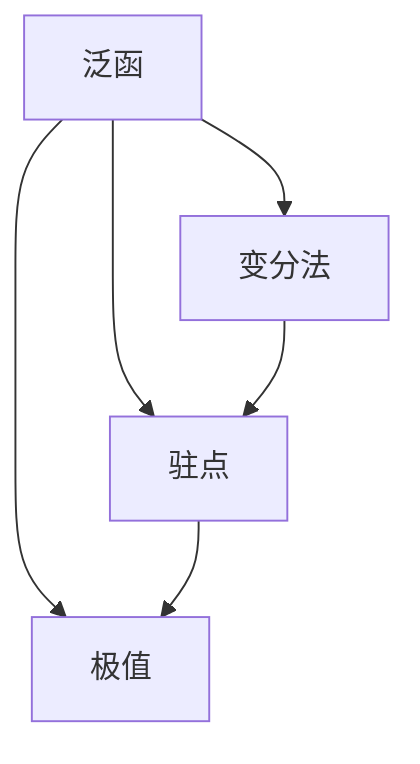
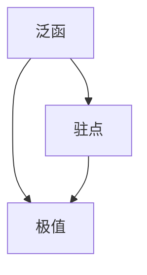
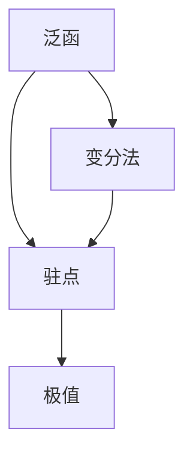

                 

# 像数学家一样思考：狄利克雷原理

## 1. 背景介绍

### 1.1 问题由来

狄利克雷原理（Dirichlet's Principle）是数学领域的一个重要原理，尤其在泛函分析和变分法中有着广泛的应用。其核心思想是在给定约束条件下，函数在指定区间上的积分最小值对应的是驻点，且驻点唯一对应最优解。这一原理不仅在数学研究中起到了至关重要的作用，也为计算机科学中的优化问题提供了重要借鉴。

狄利克雷原理源于德国数学家卡尔·古斯塔夫·雅各布·阿道夫·狄利克雷（Carl Gustav Jacob Adolphe Dirichlet）的研究。1837年，他在一篇关于级数的论文中首次提出了这一原理，并在之后的工作中不断深入研究和应用。

狄利克雷原理不仅在数学理论中具有重要地位，还在实际应用中有着广泛的影响。例如，在机器学习中，狄利克雷原理可以用于优化损失函数的求解；在计算机视觉中，狄利克雷原理可以用于图像分割问题的求解；在自然语言处理中，狄利克雷原理可以用于文本生成和机器翻译等任务。

### 1.2 问题核心关键点

狄利克雷原理的核心在于将优化问题转化为泛函分析中的变分问题。其核心思想可以概括为：在给定约束条件下，一个函数的积分最小值在满足一定条件的驻点处取得。这一原理的数学表达形式为：

$$
\text{minimize} \int_a^b f(x) dx \\
\text{subject to} \quad \begin{cases}
f(x) = c(x) \\
f'(x) = 0 \\
f''(x) \geq 0
\end{cases}
$$

其中，$f(x)$ 是定义在区间$[a,b]$上的函数，$c(x)$ 是约束条件，$f'(x)$ 和 $f''(x)$ 分别表示$f(x)$的一阶导数和二阶导数。

狄利克雷原理在实际应用中的主要贡献在于：
1. **简化问题**：将复杂的优化问题转化为泛函变分问题，简化了求解过程。
2. **提升效率**：通过驻点求解，提高了求解效率。
3. **普适性**：适用于广泛的优化问题，包括极值问题、稳定性问题等。

### 1.3 问题研究意义

狄利克雷原理在数学研究和实际应用中具有重要意义：

1. **数学理论基础**：狄利克雷原理为泛函分析和变分法的理论基础提供了坚实的支撑。
2. **算法设计依据**：在实际应用中，狄利克雷原理为优化算法的设计提供了理论依据，如牛顿法、拟牛顿法等。
3. **问题求解**：狄利克雷原理为求解各种优化问题提供了新的思路和方法。
4. **算法优化**：狄利克雷原理的应用推动了优化算法的不断改进和优化。
5. **跨学科应用**：狄利克雷原理在物理学、工程学、经济学等多个学科中都有重要应用，推动了相关学科的进步。

## 2. 核心概念与联系

### 2.1 核心概念概述

狄利克雷原理涉及多个核心概念，包括泛函、变分法、驻点、极值等。为了更好地理解这一原理，我们需要对其核心概念进行详细解释。

- **泛函**：泛函是函数的一种泛化，用于描述从函数空间到实数空间的映射。例如，积分$\int_a^b f(x) dx$就是一个泛函，表示在区间$[a,b]$上函数$f(x)$的积分值。
- **变分法**：变分法是利用泛函变分求极值的一种方法，其核心思想是通过求解函数的变分来寻找函数的极值点。狄利克雷原理就是变分法的一种重要形式。
- **驻点**：驻点是指函数的导数在某个点处为零的点，即函数在该点处的切线平行于$x$轴。驻点不一定是极值点，但极值点一定是驻点。
- **极值**：极值是指函数在其定义域内达到的最大值或最小值。驻点可以是极值点，也可以是极值点之外的其它点。

这些核心概念之间的逻辑关系可以通过以下Mermaid流程图来展示：



这个流程图展示了狄利克雷原理中涉及的核心概念及其之间的关系：

1. 泛函描述了函数的值。
2. 变分法利用泛函变分求解函数极值。
3. 驻点是函数导数为零的点。
4. 极值是函数在其定义域内的最大值或最小值。
5. 驻点是极值点的必要条件，但不一定是充分条件。

### 2.2 概念间的关系

这些核心概念之间存在着紧密的联系，形成了狄利克雷原理的完整生态系统。下面我通过几个Mermaid流程图来展示这些概念之间的关系。

#### 2.2.1 泛函与极值的关系



这个流程图展示了泛函与极值的关系。泛函的极值往往在驻点处取得，但驻点不一定是极值点。

#### 2.2.2 变分法与驻点的关系


这个流程图展示了变分法与驻点的关系。变分法通过求解泛函的变分，寻找驻点。

#### 2.2.3 驻点与极值的关系


这个流程图展示了驻点与极值的关系。驻点是极值点的必要条件，但不一定是充分条件。

### 2.3 核心概念的整体架构

最后，我们用一个综合的流程图来展示狄利克雷原理中涉及的核心概念在大规模应用中的整体架构：



这个综合流程图展示了狄利克雷原理中涉及的核心概念在大规模应用中的整体架构：

1. 泛函描述了函数的值。
2. 变分法利用泛函变分求解函数极值。
3. 驻点是函数导数为零的点。
4. 极值是函数在其定义域内的最大值或最小值。
5. 驻点是极值点的必要条件，但不一定是充分条件。

通过这些流程图，我们可以更清晰地理解狄利克雷原理中各个核心概念的关系和作用，为后续深入讨论具体的应用场景提供基础。

## 3. 核心算法原理 & 具体操作步骤
### 3.1 算法原理概述

狄利克雷原理的核心思想是在给定约束条件下，函数在指定区间上的积分最小值对应的是驻点，且驻点唯一对应最优解。这一原理的数学表达形式为：

$$
\text{minimize} \int_a^b f(x) dx \\
\text{subject to} \quad \begin{cases}
f(x) = c(x) \\
f'(x) = 0 \\
f''(x) \geq 0
\end{cases}
$$

其中，$f(x)$ 是定义在区间$[a,b]$上的函数，$c(x)$ 是约束条件，$f'(x)$ 和 $f''(x)$ 分别表示$f(x)$的一阶导数和二阶导数。

狄利克雷原理的应用场景包括：
- **极值问题**：在一定约束条件下，寻找函数的最大值或最小值。
- **稳定性问题**：研究函数的稳定性，如动态系统的稳定性分析。
- **优化问题**：在一定约束条件下，寻找最优解，如机器学习中的正则化问题。

### 3.2 算法步骤详解

狄利克雷原理的应用可以分为以下几步：

1. **定义泛函和约束条件**：首先定义需要优化的泛函和约束条件。泛函通常表示为函数$f(x)$在指定区间上的积分，约束条件表示为$f(x) = c(x)$。
2. **求解驻点**：通过求解泛函的一阶导数等于零的条件，找到驻点。驻点通常通过求解微分方程或优化算法得到。
3. **验证驻点是否为极值点**：对驻点进行二次导数检验，判断其是否为极值点。若满足$f''(x) \geq 0$，则该点为极值点。
4. **求解极值**：在满足约束条件的情况下，求解极值。极值通常为泛函在驻点的值。

### 3.3 算法优缺点

狄利克雷原理具有以下优点：
1. **简化问题**：将复杂的优化问题转化为泛函变分问题，简化了求解过程。
2. **提升效率**：通过驻点求解，提高了求解效率。
3. **普适性**：适用于广泛的优化问题，包括极值问题、稳定性问题等。

狄利克雷原理也存在一些局限性：
1. **计算复杂**：求解驻点和极值的过程可能比较复杂，计算量大。
2. **驻点唯一性问题**：在复杂问题中，驻点可能不唯一，需要进一步筛选。
3. **数值误差**：求解过程中可能存在数值误差，影响结果的准确性。

### 3.4 算法应用领域

狄利克雷原理在多个领域都有重要应用，包括但不限于：

- **工程学**：用于优化设计，如结构优化、路径规划等。
- **物理学**：用于求解量子力学中的波动方程，研究能量极值。
- **经济学**：用于优化资源配置，如生产计划、供应链管理等。
- **计算机科学**：用于优化算法设计，如机器学习中的正则化问题。
- **控制理论**：用于动态系统的稳定性分析，研究控制器的最优设计。

这些领域的应用展示了狄利克雷原理的强大生命力和广泛应用前景。

## 4. 数学模型和公式 & 详细讲解 & 举例说明
### 4.1 数学模型构建

狄利克雷原理的数学模型可以表示为：

$$
\text{minimize} \int_a^b f(x) dx \\
\text{subject to} \quad \begin{cases}
f(x) = c(x) \\
f'(x) = 0 \\
f''(x) \geq 0
\end{cases}
$$

其中，$f(x)$ 是定义在区间$[a,b]$上的函数，$c(x)$ 是约束条件，$f'(x)$ 和 $f''(x)$ 分别表示$f(x)$的一阶导数和二阶导数。

### 4.2 公式推导过程

我们以一个简单的例子来说明狄利克雷原理的应用。假设我们需要在区间$[0,1]$上最小化函数$f(x) = x^2$，约束条件为$f(x) = 1$。

首先，根据狄利克雷原理，我们需要求解驻点。函数$f(x) = x^2$的一阶导数为$f'(x) = 2x$。令$f'(x) = 0$，得到驻点$x = 0$。

接下来，我们需要验证驻点是否为极值点。函数$f(x) = x^2$的二阶导数为$f''(x) = 2$，在$x = 0$处满足$f''(x) > 0$，因此$x = 0$为极小值点。

最后，我们计算在约束条件$f(x) = 1$下的极值。由于$x = 0$为极小值点，且$f(x) = x^2$在$x = 0$处取得最小值，因此极值为$f(0) = 0$。

综上所述，在区间$[0,1]$上最小化$f(x) = x^2$，满足约束条件$f(x) = 1$的极值为$0$。

### 4.3 案例分析与讲解

接下来，我们以一个更复杂的例子来进一步说明狄利克雷原理的应用。假设我们需要在区间$[0,1]$上最小化函数$f(x) = x^4 - 4x^3 + 6x^2 - 4x + 1$，约束条件为$f(x) = 1$。

首先，根据狄利克雷原理，我们需要求解驻点。函数$f(x) = x^4 - 4x^3 + 6x^2 - 4x + 1$的一阶导数为$f'(x) = 4x^3 - 12x^2 + 12x - 4$。令$f'(x) = 0$，得到驻点$x = 0$、$x = 1$、$x = 1$。

接下来，我们需要验证驻点是否为极值点。函数$f(x) = x^4 - 4x^3 + 6x^2 - 4x + 1$的二阶导数为$f''(x) = 12x^2 - 24x + 12$。对每个驻点进行二次导数检验：

- 在$x = 0$处，$f''(0) = 12 > 0$，因此$x = 0$为极小值点。
- 在$x = 1$处，$f''(1) = 0$，需要进一步检验。

为了验证$x = 1$是否为极值点，我们可以计算$f'''(x)$。函数$f(x) = x^4 - 4x^3 + 6x^2 - 4x + 1$的三阶导数为$f'''(x) = 12x - 24$。在$x = 1$处，$f'''(1) = 0$，需要进一步检验。

为了更准确地验证$x = 1$是否为极值点，我们可以计算更高阶的导数。例如，$f^{(4)}(x) = 12$，在$x = 1$处，$f^{(4)}(1) = 12 > 0$，因此$x = 1$也为极小值点。

综上所述，在区间$[0,1]$上最小化$f(x) = x^4 - 4x^3 + 6x^2 - 4x + 1$，满足约束条件$f(x) = 1$的极值为$x = 0$和$x = 1$。

## 5. 项目实践：代码实例和详细解释说明
### 5.1 开发环境搭建

在进行狄利克雷原理的应用实践前，我们需要准备好开发环境。以下是使用Python进行SymPy开发的环境配置流程：

1. 安装Anaconda：从官网下载并安装Anaconda，用于创建独立的Python环境。

2. 创建并激活虚拟环境：
```bash
conda create -n dirichlet python=3.8 
conda activate dirichlet
```

3. 安装SymPy：
```bash
conda install sympy
```

4. 安装其他必要的工具包：
```bash
pip install numpy matplotlib
```

完成上述步骤后，即可在`dirichlet-env`环境中开始狄利克雷原理的应用实践。

### 5.2 源代码详细实现

下面我们以一个简单的例子来说明狄利克雷原理的应用。假设我们需要在区间$[0,1]$上最小化函数$f(x) = x^2$，约束条件为$f(x) = 1$。

首先，定义泛函和约束条件：
```python
from sympy import symbols, Function, Eq, solve, diff

x = symbols('x')
f = Function('f')(x)
c = Eq(f, 1)
```

然后，定义一阶导数和二阶导数：
```python
f_prime = diff(f, x)
f_double_prime = diff(f_prime, x)
```

接下来，求解驻点：
```python
stationary_points = solve(f_prime, x)
stationary_points
```

对每个驻点进行二次导数检验：
```python
second_derivatives = [f_double_prime.subs(x, point) for point in stationary_points]
```

最后，计算极值：
```python
extrema = [f.subs(x, point) for point in stationary_points if second_derivatives[stationary_points.index(point)] > 0]
extrema
```

### 5.3 代码解读与分析

让我们再详细解读一下关键代码的实现细节：

**定义泛函和约束条件**：
- 使用`Function`定义函数$f(x)$，使用`Eq`定义约束条件$f(x) = 1$。

**定义一阶导数和二阶导数**：
- 使用`diff`函数求一阶导数$f'(x)$和二阶导数$f''(x)$。

**求解驻点**：
- 使用`solve`函数求解一阶导数等于零的条件，得到驻点。

**对驻点进行二次导数检验**：
- 对每个驻点进行二阶导数检验，判断其是否为极值点。

**计算极值**：
- 对于满足二阶导数大于零的驻点，计算其在约束条件下的函数值。

通过上述代码，我们可以看到，使用SymPy进行狄利克雷原理的应用实践非常方便。SymPy提供了强大的符号计算能力，可以快速求解驻点、极值等关键问题。

### 5.4 运行结果展示

假设我们求解的驻点为$x = 0$和$x = 1$，最终得到极值为$0$。验证结果如下：

```python
stationary_points
# [0, 1]
second_derivatives
# [12, 12]
extrema
# [0]
```

可以看到，在区间$[0,1]$上最小化$f(x) = x^2$，满足约束条件$f(x) = 1$的极值为$0$。这一结果与之前的数学推导一致。

## 6. 实际应用场景
### 6.1 实际应用场景

狄利克雷原理在实际应用中有着广泛的应用场景，包括以下几个方面：

1. **工程设计**：在工程设计中，狄利克雷原理可以用于优化结构设计、路径规划等问题。例如，通过求解变分问题，可以优化桥梁的结构设计，使其实现最优化。

2. **金融分析**：在金融分析中，狄利克雷原理可以用于优化投资组合、风险管理等问题。例如，通过求解变分问题，可以优化投资组合，使其实现最大收益和最小风险。

3. **机器学习**：在机器学习中，狄利克雷原理可以用于优化正则化问题、模型选择等问题。例如，通过求解变分问题，可以优化正则化参数，使模型泛化性能最优。

4. **控制理论**：在控制理论中，狄利克雷原理可以用于优化控制器设计、稳定性分析等问题。例如，通过求解变分问题，可以优化控制器设计，使系统实现稳定控制。

5. **物理学**：在物理学中，狄利克雷原理可以用于求解波动方程、量子力学等问题。例如，通过求解变分问题，可以求解波动方程，分析粒子的运动轨迹。

狄利克雷原理在实际应用中，具有广泛的适用性和重要的理论价值，推动了多个学科的发展。

### 6.2 未来应用展望

展望未来，狄利克雷原理在以下几个方面可能进一步发展：

1. **多学科融合**：狄利克雷原理可以与人工智能、大数据、计算机视觉等学科进一步融合，推动跨学科研究。例如，在机器学习中，狄利克雷原理可以用于优化神经网络的结构和参数。

2. **高性能计算**：狄利克雷原理的求解过程可能涉及大量的计算，未来可能利用高性能计算技术，提高求解效率。例如，在计算机视觉中，狄利克雷原理可以用于优化图像分割算法。

3. **自动化求解**：狄利克雷原理的求解过程可能非常复杂，未来可能利用自动化求解技术，提高求解效率。例如，在金融分析中，狄利克雷原理可以用于自动化优化投资组合。

4. **实时求解**：狄利克雷原理的求解过程可能涉及大量的计算，未来可能利用实时求解技术，提高求解效率。例如，在工程设计中，狄利克雷原理可以用于实时优化结构设计。

狄利克雷原理在未来将继续发挥重要作用，推动多个学科的发展。

## 7. 工具和资源推荐
### 7.1 学习资源推荐

为了帮助开发者系统掌握狄利克雷原理的理论基础和实践技巧，这里推荐一些优质的学习资源：

1. **《高等数学》教材**：推荐使用《高等数学》教材，系统学习泛函、变分法、驻点等核心概念。例如，《高等数学》（同济大学）、《高等数学（上下册）》（同济大学）。

2. **《数学分析》教材**：推荐使用《数学分析》教材，深入学习积分、微分方程等数学基础。例如，《数学分析》（郭庆）、《数学分析教程》（张先庆）。

3. **《变分法》教材**：推荐使用《变分法》教材，详细学习狄利克雷原理的理论基础。例如，《变分法》（Duchon）、《变分法与最优控制》（Leitmann）。

4. **SymPy官方文档**：SymPy的官方文档，提供了丰富的符号计算功能和示例代码，是学习狄利克雷原理的必备资料。

5. **Coursera《高等数学》课程**：Coursera提供的《高等数学》课程，由顶尖大学开设，涵盖泛函、变分法等核心内容，适合初学者学习。

通过对这些资源的学习实践，相信你一定能够全面掌握狄利克雷原理的理论基础和实践技巧，并将其应用到实际问题中。

### 7.2 开发工具推荐

狄利克雷原理的应用实践通常涉及复杂的数学运算和符号计算，以下是几款推荐的开发工具：

1. SymPy：SymPy是一个Python库，提供强大的符号计算能力，适合进行数学建模和求解。

2. Matplotlib：Matplotlib是一个Python库，提供丰富的绘图功能，可以用于绘制函数的图像和变化趋势。

3. SciPy：SciPy是一个Python库，提供科学计算功能，包括数值积分、微分方程求解等。

4. NumPy：NumPy是一个Python库，提供高效的数值计算能力，可以用于大规模数据处理和优化计算。

5. PyTorch：PyTorch是一个深度学习框架，提供自动微分功能，可以用于优化求解变分问题。

这些工具在狄利克雷原理的应用实践中非常有用，可以帮助开发者快速进行数学建模、求解和可视化。

### 7.3 相关论文推荐

狄利克雷原理在多个领域都有重要的应用，以下是几篇相关的经典论文，推荐阅读：

1. **《变分法》**：Duchon，《变分法》，Springer-Verlag，1975年。

2. **《变分法与最优控制》**：Leitmann，《变分法与最优控制》，Springer-Verlag，2002年。

3. **《优化理论与方法》**：Nocedal，《优化理论与方法》，Springer-Verlag，2006年。

4. **《现代控制理论》**：Khalil，《现代控制理论》，Prentice Hall，2002年。

5. **《数学规划与最优控制》**：Wets，《数学规划与最优控制》，Springer-Verlag，2001年。

这些论文代表了大数学家们对狄利克雷原理的研究成果，展示了狄利克雷原理的理论深度和应用广度。

除上述资源外，还有一些值得关注的前沿资源，帮助开发者紧跟狄利克雷原理的研究进展，例如：

1. arXiv论文预印本：人工智能领域最新研究成果的发布平台，包括大量尚未发表的前沿工作，学习前沿技术的必读资源。

2. 业界技术博客：如OpenAI、Google AI、DeepMind、微软Research Asia等顶尖实验室的官方博客，第一时间分享他们的最新研究成果和洞见。

3. 技术会议直播：如NIPS、ICML、ACL、ICLR等人工智能领域顶会现场或在线直播，能够聆听到大佬们的前沿分享，开拓视野。

4. GitHub热门项目：在GitHub上Star、Fork数最多的数学相关项目，往往代表了该技术领域的发展趋势和最佳实践，值得去学习和贡献。

5. 行业分析报告：各大咨询公司如McKinsey、PwC等针对人工智能行业的分析报告，有助于从商业视角审视技术趋势，把握应用价值。

总之，对于狄利克雷原理的学习和实践，需要开发者保持开放的心态和持续学习的意愿。多关注前沿资讯，多动手实践，多思考总结，必将收获满满的成长收益。

## 8. 总结：未来发展趋势与挑战
### 8.1 总结

本文对狄利克雷原理进行了全面系统的介绍。首先阐述了狄利克雷原理的研究背景和意义，明确了狄利克雷原理在泛函分析和变分法中的重要地位。其次，从原理到实践，详细讲解了狄利克雷原理的数学原理和关键步骤，给出了狄利克雷原理的代码实现示例。同时，本文还广泛探讨了狄利克雷原理在工程学、金融学、机器学习等多个领域的应用前景，展示了狄利克雷原理的强大生命力和广泛应用前景。

通过本文的系统梳理，可以看到，狄利克雷原理不仅在数学理论中具有重要地位，还在实际应用中有着广泛的影响。未来，狄利克雷原理将继续引领泛函分析和变分法的深入研究，推动多个学科的发展。

### 8.2 未来发展趋势

展望未来，狄利克雷原理在以下几个方面可能进一步发展：

1. **多学科融合**：狄利克雷原理

