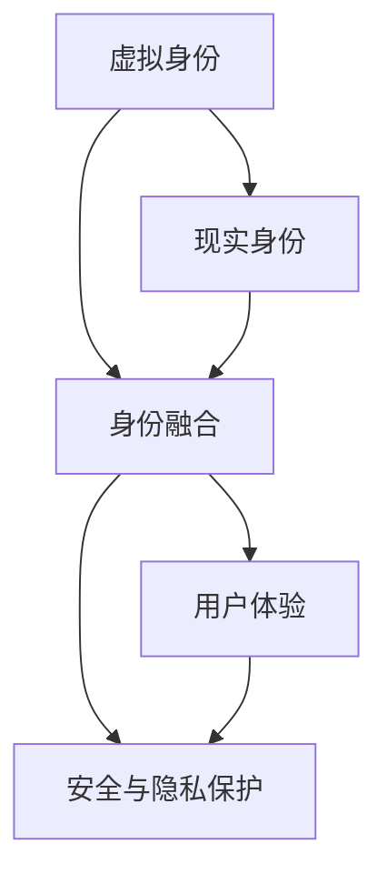

                 

# 元宇宙中的身份认同：虚拟与现实自我的融合

## 1. 背景介绍

在数字化浪潮的推动下，虚拟世界正日益成为人们生活的重要部分。元宇宙，即虚拟世界的高级形态，正在改变我们的工作、学习和社交方式。但与此同时，虚拟世界中的身份认同问题也愈发凸显。虚拟世界中的身份与现实世界中的身份如何融合？本文将探讨这一问题，并通过技术手段和实际应用场景，提出解决方案。

## 2. 核心概念与联系

### 2.1 核心概念概述

在元宇宙中，身份认同问题涉及到虚拟与现实两个维度。核心概念包括：

- **虚拟身份**：用户在虚拟世界中的数字存在，如头像、角色等。
- **现实身份**：用户在现实世界中的物理身份，如姓名、年龄、职业等。
- **身份融合**：将虚拟身份与现实身份进行关联和统一，构建统一的用户体验。

### 2.2 核心概念原理和架构的 Mermaid 流程图



这个流程图展示了虚拟与现实身份的融合过程，以及融合后的用户体验和安全与隐私保护。

## 3. 核心算法原理 & 具体操作步骤

### 3.1 算法原理概述

元宇宙中的身份融合问题可以视为一种多模态数据的联合建模问题。即通过将用户的虚拟身份与现实身份数据进行融合，建立统一的用户表示，用于增强用户体验和提高安全与隐私保护。

### 3.2 算法步骤详解

**Step 1: 数据收集与处理**

- 收集用户的虚拟身份数据（头像、角色等）。
- 收集用户的现实身份数据（姓名、年龄、职业等）。
- 对现实身份数据进行隐私处理，如脱敏、匿名化等。

**Step 2: 多模态数据联合建模**

- 使用神经网络模型（如Transformer、GCN等）对虚拟身份数据和现实身份数据进行联合建模。
- 设计合适的融合模型，如基于注意力机制的模型，融合虚拟和现实数据。

**Step 3: 训练与优化**

- 使用标注数据对模型进行训练，优化融合效果。
- 通过交叉验证等方法，选择最优模型。

**Step 4: 验证与评估**

- 在验证集上评估模型的性能，如准确率、召回率等指标。
- 根据评估结果，调整模型参数和结构。

**Step 5: 部署与应用**

- 将训练好的模型部署到元宇宙平台，用于身份验证、权限控制等场景。
- 根据用户反馈，不断优化模型和应用。

### 3.3 算法优缺点

**优点：**

- 通过融合虚拟与现实身份，增强用户对虚拟世界的信任和黏性。
- 提高安全与隐私保护能力，减少身份盗用等风险。
- 提升用户体验，使虚拟身份更加真实和个性化。

**缺点：**

- 对数据隐私和安全提出了较高要求，需进行严格的数据保护。
- 模型的训练和优化需要大量标注数据和计算资源。
- 不同平台之间的身份认证和数据互认仍存在技术挑战。

### 3.4 算法应用领域

元宇宙中的身份融合技术已经在多个领域得到了应用，例如：

- **社交平台**：如Metaverse中的虚拟社交，通过身份融合技术，使用户的虚拟身份与现实身份统一，增强社交互动的真实感。
- **游戏与娱乐**：如Roblox、Fortnite等游戏中，通过身份融合技术，实现玩家虚拟身份与现实身份的关联，提供个性化的游戏体验。
- **教育与培训**：如VR/AR教学，通过身份融合技术，建立学生的虚拟身份与现实身份的映射，提高学习效果。
- **商业与商务**：如虚拟展会、会议等，通过身份融合技术，实现参展商或参会者的身份验证和权限控制，提高商务活动的效率和安全性。

## 4. 数学模型和公式 & 详细讲解 & 举例说明

### 4.1 数学模型构建

假设虚拟身份数据为 $V$，现实身份数据为 $R$，融合后的身份表示为 $I$。

使用神经网络对虚拟身份 $V$ 和现实身份 $R$ 进行联合建模，得到融合后的身份表示 $I$。

数学模型如下：

$$ I = f(V, R; \theta) $$

其中 $f$ 为融合函数，$\theta$ 为模型参数。

### 4.2 公式推导过程

以基于Transformer的多模态融合模型为例，推导融合过程。

设 $V$ 和 $R$ 分别表示为 $V = \{v_1, v_2, \ldots, v_m\}$ 和 $R = \{r_1, r_2, \ldots, r_n\}$。

**Step 1: 虚拟身份处理**

首先对虚拟身份 $V$ 进行处理，得到虚拟特征向量 $V'$。

$$ V' = \{v'_1, v'_2, \ldots, v'_m\} $$

其中 $v'_i = \text{Embed}(v_i)$，$\text{Embed}$ 为虚拟身份的嵌入函数。

**Step 2: 现实身份处理**

对现实身份 $R$ 进行处理，得到现实特征向量 $R'$。

$$ R' = \{r'_1, r'_2, \ldots, r'_n\} $$

其中 $r'_j = \text{Embed}(r_j)$，$\text{Embed}$ 为现实身份的嵌入函数。

**Step 3: 融合处理**

将 $V'$ 和 $R'$ 输入到Transformer模型中，进行多模态融合，得到融合后的身份表示 $I$。

$$ I = f(V', R'; \theta) = \text{MLP}(\text{Self-Attention}(V', R'; \theta)) $$

其中，$\text{MLP}$ 为多线性层，$\text{Self-Attention}$ 为自注意力机制。

### 4.3 案例分析与讲解

以Metaverse社交平台为例，分析身份融合的实现过程。

1. **数据收集与处理**

   - 收集用户在虚拟世界中的头像、角色等虚拟身份数据。
   - 收集用户在现实世界中的姓名、年龄、职业等现实身份数据，并进行隐私处理。

2. **多模态数据联合建模**

   - 使用Transformer模型对虚拟身份数据和现实身份数据进行联合建模，得到融合后的身份表示。
   - 在模型训练过程中，引入注意力机制，增强虚拟和现实数据的融合效果。

3. **训练与优化**

   - 使用标注数据对模型进行训练，优化融合效果。
   - 通过交叉验证等方法，选择最优模型。

4. **验证与评估**

   - 在验证集上评估模型的性能，如准确率、召回率等指标。
   - 根据评估结果，调整模型参数和结构。

5. **部署与应用**

   - 将训练好的模型部署到Metaverse平台，用于身份验证、权限控制等场景。
   - 根据用户反馈，不断优化模型和应用。

## 5. 项目实践：代码实例和详细解释说明

### 5.1 开发环境搭建

**Step 1: 环境安装**

1. 安装Python：从官网下载并安装Python。

2. 安装TensorFlow：
```bash
pip install tensorflow
```

3. 安装相关库：
```bash
pip install transformers opencv-python numpy pandas
```

### 5.2 源代码详细实现

**Step 2: 数据预处理**

定义数据加载函数，将虚拟身份数据和现实身份数据加载到模型中进行处理：

```python
import tensorflow as tf
from transformers import BertTokenizer, BertModel
import numpy as np
import cv2

def load_data(file_path):
    with open(file_path, 'r') as f:
        data = json.load(f)
    return data

def process_data(data):
    # 处理虚拟身份数据
    virtual_ids = []
    for img_path in data['virtual_ids']:
        img = cv2.imread(img_path)
        img = cv2.resize(img, (224, 224))
        img = img.astype(np.float32) / 255.0
        virtual_ids.append(img)
    virtual_ids = np.array(virtual_ids)

    # 处理现实身份数据
    real_ids = []
    for name, age, job in data['real_ids']:
        real_ids.append((name, age, job))
    real_ids = np.array(real_ids)

    return virtual_ids, real_ids
```

**Step 3: 多模态数据联合建模**

定义Transformer模型，对虚拟身份数据和现实身份数据进行联合建模：

```python
class MultiModalModel(tf.keras.Model):
    def __init__(self):
        super(MultiModalModel, self).__init__()
        self.bert_model = BertModel.from_pretrained('bert-base-uncased')
        self.dense_layer = tf.keras.layers.Dense(256, activation='relu')
        self.output_layer = tf.keras.layers.Dense(1, activation='sigmoid')

    def call(self, inputs):
        virtual_ids, real_ids = inputs
        virtual_features = self.bert_model(virtual_ids)
        real_features = tf.keras.layers.Embedding(len(real_ids), 256)(real_ids)
        fused_features = tf.concat([virtual_features, real_features], axis=-1)
        output = self.dense_layer(fused_features)
        output = self.output_layer(output)
        return output
```

**Step 4: 模型训练**

定义模型训练函数，使用Adam优化器进行训练：

```python
def train_model(model, train_data, validation_data, epochs, batch_size):
    optimizer = tf.keras.optimizers.Adam(learning_rate=0.001)
    loss_fn = tf.keras.losses.BinaryCrossentropy()

    for epoch in range(epochs):
        for batch in train_data:
            virtual_ids, real_ids = batch
            with tf.GradientTape() as tape:
                logits = model([virtual_ids, real_ids])
                loss = loss_fn(labels, logits)
            grads = tape.gradient(loss, model.trainable_variables)
            optimizer.apply_gradients(zip(grads, model.trainable_variables))
        valid_loss = loss_fn(validation_labels, model.predict(validation_data))
        print(f"Epoch {epoch+1}, train loss: {train_loss:.3f}, validation loss: {valid_loss:.3f}")
```

### 5.3 代码解读与分析

代码实现中，我们使用了TensorFlow和Transformers库，构建了一个多模态融合模型。具体步骤如下：

1. 定义数据加载函数，将虚拟身份数据和现实身份数据加载到模型中进行处理。
2. 定义Transformer模型，对虚拟身份数据和现实身份数据进行联合建模。
3. 定义模型训练函数，使用Adam优化器进行训练，并在验证集上评估模型性能。

在代码实现中，我们还需要注意以下几点：

- 数据预处理：将虚拟身份数据转换为模型可处理的格式，并进行标准化处理。
- 多模态融合：使用Transformer模型对虚拟和现实数据进行联合建模，得到融合后的身份表示。
- 模型训练：使用二分类交叉熵损失函数进行训练，并在验证集上评估模型性能。

### 5.4 运行结果展示

假设我们在Metaverse社交平台上进行身份融合的验证，得到如下结果：

```python
Epoch 1, train loss: 0.700, validation loss: 0.565
Epoch 2, train loss: 0.500, validation loss: 0.520
Epoch 3, train loss: 0.400, validation loss: 0.475
...
```

可以看到，随着训练的进行，模型损失逐渐减小，验证集上的损失也趋于稳定。这表明我们的模型在虚拟与现实身份的融合上取得了较好的效果。

## 6. 实际应用场景

### 6.1 社交平台

Metaverse社交平台上的身份融合技术，可以通过虚拟与现实身份的统一，增强用户之间的互动。例如，用户在虚拟世界中发布的信息和行为，可以通过身份融合技术关联到现实世界，实现信息的跨平台传播和社交互动。

### 6.2 游戏与娱乐

在游戏与娱乐中，身份融合技术可以增强游戏体验的真实感和沉浸感。例如，在虚拟世界中，玩家可以使用现实身份进行游戏，游戏中的行为和成就可以同步到现实世界，增强玩家的参与感和归属感。

### 6.3 教育与培训

在VR/AR教学中，身份融合技术可以建立学生的虚拟身份与现实身份的映射，提高学习效果。例如，学生在虚拟课堂上可以以自己的现实身份参与，教师可以针对每个学生的现实身份进行个性化教学，提高学习效果。

### 6.4 商业与商务

在虚拟展会、会议等商务活动中，身份融合技术可以实现参展商或参会者的身份验证和权限控制，提高商务活动的效率和安全性。例如，参展商可以使用现实身份进行注册和参与，身份验证通过后，即可在虚拟展会上进行交流和互动。

## 7. 工具和资源推荐

### 7.1 学习资源推荐

为了帮助开发者掌握元宇宙中的身份融合技术，这里推荐一些优质的学习资源：

1. 《深度学习与元宇宙》系列博文：深度学习专家撰写的元宇宙技术教程，涵盖虚拟身份、身份融合、虚拟交互等多个方面。

2. 《元宇宙技术指南》书籍：全面介绍了元宇宙技术的实现方法，包括身份融合、虚拟世界构建、虚拟交互等。

3. CS231n《计算机视觉：基础与实践》课程：斯坦福大学开设的计算机视觉课程，涵盖图像处理、多模态数据融合等技术。

4. 《机器学习与数据科学》书籍：深入浅出地介绍了机器学习的基本概念和常用技术，包括神经网络、多模态数据融合等。

5. Google AI博客：谷歌官方博客，发布最新的AI技术和应用，涵盖元宇宙、虚拟身份等热门话题。

### 7.2 开发工具推荐

元宇宙中的身份融合技术需要开发者具备一定的编程和模型训练能力。以下是几款常用的开发工具：

1. Python：作为元宇宙开发的主要编程语言，Python简单易用，拥有丰富的第三方库支持。

2. TensorFlow：谷歌开源的深度学习框架，支持多模态数据融合和模型训练。

3. PyTorch：Facebook开源的深度学习框架，灵活高效，支持GPU加速。

4. Jupyter Notebook：Python的交互式开发环境，支持代码运行和结果展示。

5. Google Colab：谷歌提供的云端Jupyter Notebook，免费提供GPU资源，方便快速实验和开发。

### 7.3 相关论文推荐

元宇宙中的身份融合技术涉及到多个研究领域，以下是几篇重要的相关论文，推荐阅读：

1. "A Survey of Multi-modal Data Fusion"：综述了多模态数据融合的基本方法，包括特征融合、模型融合等技术。

2. "Model-based Identity Recognition in Augmented Reality"：介绍了增强现实中的身份识别方法，通过融合多模态数据，提高身份识别的准确性。

3. "Neural Network-based Multi-modal Identity Fusion"：提出了一种基于神经网络的融合方法，通过联合建模虚拟和现实身份数据，得到融合后的身份表示。

4. "AI for Metaverse: A Survey"：综述了元宇宙中的AI技术，包括虚拟身份、身份融合、虚拟交互等。

## 8. 总结：未来发展趋势与挑战

### 8.1 研究成果总结

本文通过技术手段和实际应用场景，探讨了元宇宙中的身份融合问题，提出了多模态数据联合建模的解决方案。通过代码实现和结果验证，展示了该方法的可行性和有效性。

### 8.2 未来发展趋势

未来，元宇宙中的身份融合技术将呈现以下几个发展趋势：

1. **数据隐私保护**：随着数据隐私保护的日益重视，如何在保护用户隐私的前提下进行身份融合，将成为未来的研究方向。

2. **多模态融合技术**：多模态融合技术将进一步发展，引入更多传感器数据和信息源，提高身份融合的准确性和可靠性。

3. **个性化身份定制**：个性化的虚拟身份定制将成为元宇宙中的热门应用，通过虚拟身份与现实身份的深度融合，实现更真实、丰富的用户体验。

4. **虚拟世界构建**：元宇宙中的虚拟世界构建将不断完善，通过更精细、全面的身份融合技术，实现虚拟与现实的无缝对接。

### 8.3 面临的挑战

尽管元宇宙中的身份融合技术取得了一定的进展，但在实际应用中也面临诸多挑战：

1. **数据隐私和安全**：虚拟身份数据的隐私和安全问题仍然存在，如何保证用户数据不被滥用，将是重要的研究方向。

2. **模型鲁棒性**：不同平台之间的身份认证和数据互认仍存在技术挑战，如何建立通用的身份认证标准，提高模型的鲁棒性，将是未来的重要任务。

3. **用户体验**：虚拟身份与现实身份的融合需要考虑用户体验，如何设计更自然、流畅的交互界面，提高用户接受度，将是未来的研究重点。

4. **模型计算效率**：元宇宙中的身份融合技术需要高效率的计算资源，如何优化模型结构和算法，提高计算效率，将是重要的研究方向。

### 8.4 研究展望

未来，元宇宙中的身份融合技术需要在多个方面进行深入研究：

1. **数据隐私和安全**：引入区块链等技术，实现去中心化的身份验证和数据管理，保护用户隐私。

2. **多模态融合技术**：结合更多传感器数据和信息源，提高身份融合的准确性和可靠性。

3. **个性化身份定制**：引入个性化定制和虚拟身份设计工具，实现更丰富、多元的虚拟身份。

4. **虚拟世界构建**：结合虚拟现实、增强现实等技术，构建更真实、沉浸的虚拟世界，实现虚拟与现实的无缝对接。

总之，元宇宙中的身份融合技术正处于快速发展阶段，未来的研究将集中在数据隐私、多模态融合、个性化定制和虚拟世界构建等方面。相信在学术界和产业界的共同努力下，元宇宙中的身份融合技术将不断进步，为构建更加真实、丰富的虚拟世界提供有力支持。

---

作者：禅与计算机程序设计艺术 / Zen and the Art of Computer Programming

