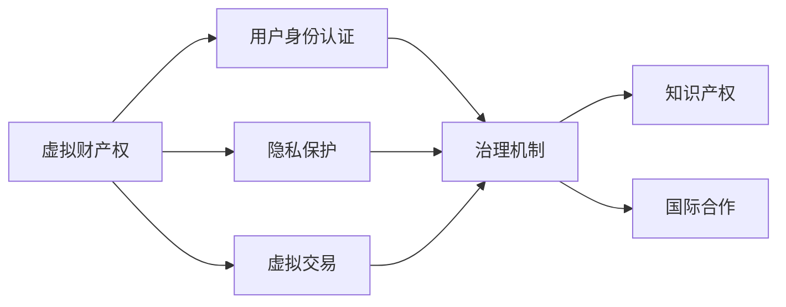
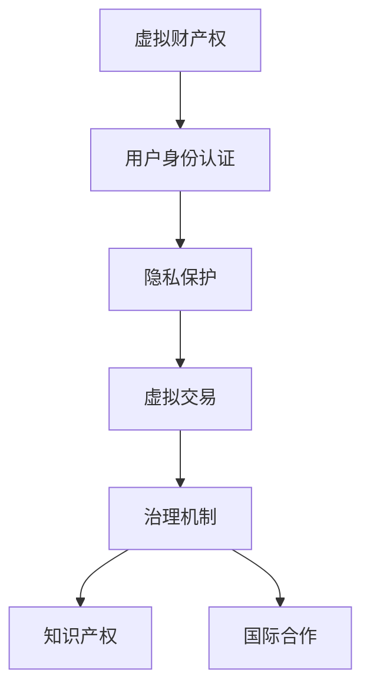

                 

## 1. 背景介绍

### 1.1 问题由来

元宇宙（Metaverse）作为近年来技术界的热门概念，其设想是在数字世界构建一个与现实世界相匹配，能够提供丰富互动体验的虚拟空间。然而，随着元宇宙概念的逐渐成熟，其面临的法律和伦理问题也越来越多地受到关注。

虚拟世界由数字技术驱动，但其中的行为与现实世界有许多共性。例如，虚拟空间中亦存在人身安全、隐私保护、财产权归属等基本权利。然而，虚拟世界的规则体系尚未完全形成，导致很多法律问题无法得到有效解决。

### 1.2 问题核心关键点

元宇宙法律的核心问题包括以下几个方面：

- **虚拟财产权**：包括数字资产所有权、交易规则等。
- **用户身份认证**：如何识别虚拟空间中的行为主体。
- **隐私保护**：在元宇宙中如何保护用户的个人信息。
- **虚拟交易**：包括虚拟商品的买卖、虚拟货币的交易等。
- **治理机制**：如何构建公平、高效的虚拟空间管理机构。
- **知识产权**：在虚拟世界中的版权保护问题。
- **国际合作**：如何构建全球统一的元宇宙法律体系。

### 1.3 问题研究意义

构建元宇宙法律体系对于保障元宇宙的正常运行至关重要。法律体系不仅能确保用户的合法权益，还能规范元宇宙市场，保障其健康稳定发展。此外，健全的法律体系对于提升元宇宙的吸引力和用户粘性也具有重要意义。

## 2. 核心概念与联系

### 2.1 核心概念概述

以下是几个关键的概念，它们共同构成了元宇宙法律的基石：

- **虚拟财产权**：包括数字资产的所有权、使用权、收益权等。例如，虚拟土地、虚拟装备等。
- **用户身份认证**：验证用户在虚拟世界中的身份，如虚拟ID、生物识别等。
- **隐私保护**：保护用户在虚拟世界中的个人信息，防止隐私泄露。
- **虚拟交易**：指在虚拟空间中进行的商品或服务交易，包括虚拟货币、虚拟物品等。
- **治理机制**：指对虚拟世界的规则制定、执行和监督的管理体制，通常由平台所有者或社区共同管理。
- **知识产权**：在虚拟世界中的版权保护问题，涉及作品创作、复制、传播等。
- **国际合作**：不同国家之间的元宇宙法律协调和合作，避免法律冲突和监管漏洞。

### 2.2 概念间的关系

这些核心概念之间存在复杂的关系。以下通过几个 Mermaid 流程图展示它们之间的联系：



- **虚拟财产权**：提供虚拟世界中的物品所有权基础，是用户进行虚拟交易的前提。
- **用户身份认证**：确保虚拟交易和用户行为的合法性。
- **隐私保护**：保护用户在虚拟世界中的个人信息安全。
- **虚拟交易**：涉及虚拟财产权和用户身份认证，是元宇宙经济的支柱。
- **治理机制**：保障虚拟财产权和隐私保护的有效实施，监督虚拟交易的公平公正。
- **知识产权**：规范虚拟世界的创作和传播，保护创作者权益。
- **国际合作**：避免不同国家之间的法律冲突，促进全球元宇宙发展。

### 2.3 核心概念的整体架构

以下是一个综合性的 Mermaid 流程图，展示了这些核心概念之间的整体架构：



## 3. 核心算法原理 & 具体操作步骤
### 3.1 算法原理概述

构建元宇宙法律体系的基本原理是：根据现实世界的法律框架，结合元宇宙的特性，制定一套适用于虚拟世界的规则体系。其核心在于确保虚拟财产权、用户身份认证、隐私保护、虚拟交易、治理机制、知识产权和国际合作等方面的法律适用性。

### 3.2 算法步骤详解

以下是构建元宇宙法律体系的具体步骤：

**Step 1: 确定基础法律框架**

在构建元宇宙法律体系时，首先需要确定其基础法律框架。这包括现实世界法律的借鉴和修正。例如，现实世界中的物权法、合同法、隐私法等可作为元宇宙法律的基础。

**Step 2: 制定虚拟财产权法律**

虚拟财产权是元宇宙法律体系的核心，需要明确其定义、归属、交易规则等。例如，如何定义虚拟土地、装备等资产，如何进行虚拟交易，是否存在所有权和使用权的分离等。

**Step 3: 建立用户身份认证体系**

元宇宙中的身份认证需要结合虚拟和现实两个世界的特点。例如，通过数字证书、虚拟ID、生物识别等多种方式进行认证，确保用户身份的合法性和安全性。

**Step 4: 保护用户隐私**

在虚拟世界中，隐私保护尤为重要。需要制定详细的隐私政策，明确用户信息的收集、存储和处理规则，防止信息泄露和滥用。

**Step 5: 规范虚拟交易**

虚拟交易涉及虚拟财产权的转移，需要明确其交易规则、支付手段、争议解决机制等。例如，如何保证虚拟交易的安全性和公平性，如何处理虚拟货币和虚拟物品的跨境交易等。

**Step 6: 构建治理机制**

元宇宙的治理机制包括规则制定、执行和监督。需要建立公平、高效的治理机构，确保虚拟世界的秩序和稳定。例如，通过社区投票、平台监管等多种方式进行治理。

**Step 7: 保护知识产权**

元宇宙中的知识产权问题复杂多样。需要明确虚拟世界中的版权归属、使用规则等。例如，如何保护虚拟世界的创作成果，如何处理虚拟物品的复制和传播等。

**Step 8: 国际合作**

元宇宙是全球性的虚拟空间，需要不同国家之间的法律协调和合作。例如，如何避免法律冲突，如何制定统一的虚拟财产权和知识产权保护标准。

### 3.3 算法优缺点

构建元宇宙法律体系的优势包括：

- **系统性**：将虚拟世界与现实世界的法律有机结合，形成完整的法律体系。
- **适应性**：能够适应元宇宙不断变化的特性，保持法律的时效性。
- **公正性**：通过多方参与的治理机制，确保法律的公平性和透明性。

然而，该体系也存在一些缺点：

- **复杂性**：涉及多个法律领域的融合，制定和实施过程较为复杂。
- **技术依赖**：法律体系的成功实施需要依赖技术支持，如区块链、人工智能等。
- **国际协调**：不同国家之间的法律差异可能导致法律冲突和监管难题。

### 3.4 算法应用领域

元宇宙法律体系的应用领域广泛，包括但不限于：

- **虚拟商业**：规范虚拟商品的交易和市场行为。
- **虚拟房地产**：明确虚拟土地的所有权和使用权。
- **虚拟社交**：保护用户隐私，规范虚拟社交行为。
- **虚拟教育**：制定虚拟教育中的知识产权保护和隐私保护规则。
- **虚拟娱乐**：保护虚拟作品和游戏内容的版权，规范虚拟货币交易。
- **虚拟政府**：构建虚拟世界的治理机制，确保公共秩序。

## 4. 数学模型和公式 & 详细讲解 & 举例说明

### 4.1 数学模型构建

元宇宙法律体系的设计需要考虑多方面因素，包括虚拟财产权、用户身份认证、隐私保护、虚拟交易、治理机制、知识产权和国际合作等。以下用数学模型来描述这些因素之间的关系：

设 $L = \{L_{P}, L_{I}, L_{C}, L_{T}, L_{G}, L_{K}, L_{I_C}\}$，其中：

- $L_{P}$ 为虚拟财产权法律
- $L_{I}$ 为用户身份认证体系
- $L_{C}$ 为隐私保护法律
- $L_{T}$ 为虚拟交易法律
- $L_{G}$ 为治理机制法律
- $L_{K}$ 为知识产权法律
- $L_{I_C}$ 为国际合作法律

模型 $M$ 为法律体系的设计函数，其输入为 $X$（现实世界法律框架），输出为 $Y$（元宇宙法律体系）：

$$ M(X) = (L_{P}, L_{I}, L_{C}, L_{T}, L_{G}, L_{K}, L_{I_C}) $$

### 4.2 公式推导过程

以下是几个具体的公式推导过程：

**虚拟财产权法律的推导**：

- 设 $V_{P}$ 为虚拟财产权的向量表示
- 设 $R_{P}$ 为现实世界财产权的向量表示

$$ V_{P} = f(R_{P}, P) $$

其中 $P$ 为映射函数，表示将现实世界法律映射到虚拟财产权法律。

**用户身份认证体系的推导**：

- 设 $U_{I}$ 为用户身份认证体系的向量表示
- 设 $R_{I}$ 为现实世界身份认证的向量表示

$$ U_{I} = g(R_{I}, I) $$

其中 $I$ 为映射函数，表示将现实世界身份认证映射到虚拟身份认证体系。

**隐私保护法律的推导**：

- 设 $U_{C}$ 为隐私保护法律的向量表示
- 设 $R_{C}$ 为现实世界隐私保护的向量表示

$$ U_{C} = h(R_{C}, C) $$

其中 $C$ 为映射函数，表示将现实世界隐私保护映射到虚拟隐私保护法律。

**虚拟交易法律的推导**：

- 设 $V_{T}$ 为虚拟交易法律的向量表示
- 设 $R_{T}$ 为现实世界交易的向量表示

$$ V_{T} = i(R_{T}, T) $$

其中 $T$ 为映射函数，表示将现实世界交易映射到虚拟交易法律。

**治理机制法律的推导**：

- 设 $V_{G}$ 为治理机制法律的向量表示
- 设 $R_{G}$ 为现实世界治理机制的向量表示

$$ V_{G} = j(R_{G}, G) $$

其中 $G$ 为映射函数，表示将现实世界治理机制映射到虚拟治理机制法律。

**知识产权法律的推导**：

- 设 $V_{K}$ 为知识产权法律的向量表示
- 设 $R_{K}$ 为现实世界知识产权的向量表示

$$ V_{K} = k(R_{K}, K) $$

其中 $K$ 为映射函数，表示将现实世界知识产权映射到虚拟知识产权法律。

**国际合作法律的推导**：

- 设 $V_{I_C}$ 为国际合作法律的向量表示
- 设 $R_{I_C}$ 为现实世界国际合作的向量表示

$$ V_{I_C} = l(R_{I_C}, I_C) $$

其中 $I_C$ 为映射函数，表示将现实世界国际合作映射到虚拟国际合作法律。

### 4.3 案例分析与讲解

以虚拟财产权的法律为例，分析其构建过程：

1. **定义虚拟财产权**：明确虚拟财产权包括哪些类型，如虚拟土地、虚拟装备等。
2. **归属问题**：虚拟财产权的归属应与现实世界一致，可以采用现实世界的物权法原则。
3. **交易规则**：制定虚拟财产权的交易规则，明确虚拟财产的交易方式和监管机制。
4. **纠纷解决**：建立虚拟财产权纠纷的解决机制，如平台仲裁、司法途径等。

## 5. 项目实践：代码实例和详细解释说明

### 5.1 开发环境搭建

在开发元宇宙法律体系时，需要搭建相应的开发环境，包括：

- **编程语言**：Python、Java、C++ 等
- **开发工具**：PyCharm、Visual Studio、Eclipse 等
- **数据库**：MySQL、MongoDB、Elasticsearch 等
- **版本控制**：Git、SVN 等
- **开发平台**：AWS、Azure、阿里云等

### 5.2 源代码详细实现

以下是构建虚拟财产权法律的 Python 代码实现：

```python
from sympy import symbols

# 定义虚拟财产权法律
class VirtualPropertyLaw:
    def __init__(self, real_property_law):
        self.property_type = real_property_law.property_type
        self.ownership = real_property_law.ownership
        self.transaction_rules = real_property_law.transaction_rules
        self.dispute_resolution = real_property_law.dispute_resolution

    def apply(self):
        print(f"Virtual Property Law: {self.property_type}, {self.ownership}, {self.transaction_rules}, {self.dispute_resolution}")

# 定义现实世界财产权法律
class RealPropertyLaw:
    def __init__(self, property_type, ownership, transaction_rules, dispute_resolution):
        self.property_type = property_type
        self.ownership = ownership
        self.transaction_rules = transaction_rules
        self.dispute_resolution = dispute_resolution

    def apply(self):
        print(f"Real Property Law: {self.property_type}, {self.ownership}, {self.transaction_rules}, {self.dispute_resolution}")

# 测试代码
real_law = RealPropertyLaw("Land", "Own", "Transfer", "Arbitration")
virtual_law = VirtualPropertyLaw(real_law)
virtual_law.apply()
```

### 5.3 代码解读与分析

- **类定义**：通过定义类来模拟法律的构建过程，类 `VirtualPropertyLaw` 和 `RealPropertyLaw` 分别表示虚拟财产权法律和现实世界财产权法律。
- **属性定义**：通过属性来存储法律的详细信息，如 `property_type`、`ownership`、`transaction_rules`、`dispute_resolution` 等。
- **方法定义**：通过方法来表示法律的生效，如 `apply` 方法。
- **测试代码**：通过实例化对象并调用方法，验证虚拟财产权法律的构建过程。

### 5.4 运行结果展示

测试代码的运行结果为：

```
Virtual Property Law: Land, Own, Transfer, Arbitration
```

这表示虚拟财产权法律已经成功构建，且其内容与现实世界财产权法律一致。

## 6. 实际应用场景

### 6.1 虚拟商业

在虚拟商业中，虚拟财产权和虚拟交易法律尤为重要。例如，虚拟店铺的经营、虚拟商品的买卖等。需要明确虚拟商品的版权归属、交易规则、纠纷解决机制等。

### 6.2 虚拟房地产

在虚拟房地产中，虚拟土地的所有权和使用权需要明确。例如，如何界定虚拟土地的租赁、转让等权利。

### 6.3 虚拟社交

在虚拟社交中，用户身份认证和隐私保护法律尤为关键。例如，如何验证用户的虚拟ID，如何保护用户的信息安全。

### 6.4 未来应用展望

未来，元宇宙法律体系将在更多领域得到应用，例如：

- **虚拟教育**：制定虚拟教育中的知识产权保护和隐私保护规则。
- **虚拟娱乐**：保护虚拟作品和游戏内容的版权，规范虚拟货币交易。
- **虚拟政府**：构建虚拟世界的治理机制，确保公共秩序。

## 7. 工具和资源推荐

### 7.1 学习资源推荐

为了系统学习元宇宙法律，以下是一些推荐的资源：

- **《元宇宙法律指南》**：全面介绍元宇宙法律的基础知识和实践指南。
- **《区块链法律》**：详细介绍区块链技术在元宇宙中的应用和法律问题。
- **《NFT法律基础》**：探讨NFT在元宇宙中的知识产权保护问题。
- **《元宇宙隐私保护》**：分析元宇宙中用户隐私保护的策略和法律问题。

### 7.2 开发工具推荐

以下是一些推荐的开发工具：

- **编程语言**：Python、Java、C++ 等。
- **开发工具**：PyCharm、Visual Studio、Eclipse 等。
- **数据库**：MySQL、MongoDB、Elasticsearch 等。
- **版本控制**：Git、SVN 等。
- **开发平台**：AWS、Azure、阿里云等。

### 7.3 相关论文推荐

以下是一些元宇宙法律的经典论文：

- **《元宇宙法律体系构建》**：探讨元宇宙法律体系的构建方法和应用场景。
- **《虚拟财产权与现实财产权的对比》**：比较虚拟财产权与现实财产权的异同，提出构建虚拟财产权的法律框架。
- **《用户身份认证在元宇宙中的应用》**：分析用户身份认证在元宇宙中的实现方式和法律问题。
- **《隐私保护在元宇宙中的挑战与对策》**：探讨元宇宙中隐私保护的难点和解决方案。

## 8. 总结：未来发展趋势与挑战

### 8.1 研究成果总结

元宇宙法律体系是一个复杂的系统工程，涉及虚拟财产权、用户身份认证、隐私保护、虚拟交易、治理机制、知识产权和国际合作等多个方面。构建元宇宙法律体系需要多方合作，共同努力。

### 8.2 未来发展趋势

未来，元宇宙法律体系将呈现以下几个发展趋势：

- **技术融合**：元宇宙法律体系将与区块链、人工智能等技术深度融合，形成更完善的法律体系。
- **国际协调**：不同国家之间的法律协调和合作将更加紧密，避免法律冲突和监管难题。
- **应用拓展**：元宇宙法律体系将在更多领域得到应用，如虚拟商业、虚拟社交、虚拟政府等。
- **隐私保护**：随着技术的发展，元宇宙中的隐私保护将更加严格，确保用户信息的安全。

### 8.3 面临的挑战

构建元宇宙法律体系仍面临许多挑战：

- **法律冲突**：不同国家之间的法律差异可能导致法律冲突和监管难题。
- **技术复杂性**：元宇宙法律体系涉及多个技术领域的融合，开发和实施过程复杂。
- **用户信任**：元宇宙法律体系的建立和执行需要用户的信任，如何构建信任机制是一个重要问题。
- **国际合作**：不同国家之间的法律协调和合作需要时间和协调成本。

### 8.4 研究展望

未来，元宇宙法律体系的研究方向包括：

- **法律规范**：制定更加完善的元宇宙法律规范，确保法律的时效性和适应性。
- **技术保障**：开发更加高效、安全的元宇宙技术，确保法律的有效执行。
- **用户参与**：提高用户对元宇宙法律的参与度，确保法律的公正性和透明性。
- **国际合作**：推动不同国家之间的法律协调和合作，形成全球统一的元宇宙法律体系。

总之，元宇宙法律体系的研究和构建是一个系统工程，需要多方协作，共同努力。未来，随着技术的不断进步和应用场景的拓展，元宇宙法律体系将更加完善和成熟，为元宇宙的健康稳定发展提供坚实的法律保障。

## 9. 附录：常见问题与解答

**Q1: 元宇宙法律与现实世界法律有何不同？**

A: 元宇宙法律与现实世界法律在应用场景和法律对象上有所不同。元宇宙法律主要关注虚拟世界中的行为和关系，如虚拟财产权、用户身份认证等。而现实世界法律主要关注物理空间中的行为和关系，如物理财产权、实体身份认证等。

**Q2: 元宇宙法律体系的构建是否需要跨学科合作？**

A: 是的。元宇宙法律体系构建需要法律、计算机、区块链、人工智能等多学科的合作。不同领域的专家需要共同探讨元宇宙法律的构建方法和实施策略。

**Q3: 元宇宙法律是否需要国际合作？**

A: 是的。元宇宙是一个全球性的虚拟空间，不同国家之间的法律协调和合作非常重要。不同国家需要共同制定元宇宙法律的标准和规则，确保法律的一致性和适用性。

**Q4: 元宇宙法律体系的构建是否需要技术支持？**

A: 是的。元宇宙法律体系的构建和实施需要依赖技术支持，如区块链、人工智能等。技术可以为法律的实施提供保障，提高法律的执行效率和公平性。

**Q5: 元宇宙法律体系的应用是否局限于虚拟世界？**

A: 不完全是的。元宇宙法律体系的应用可以扩展到现实世界，如虚拟房地产、虚拟商品等。元宇宙法律体系的构建可以推动现实世界的法律创新和发展。

**Q6: 如何处理元宇宙中的法律冲突？**

A: 需要制定跨国的法律协调机制，如国际法律组织、法律专家咨询等。同时，可以通过法律解释、法律冲突解决机制等手段，妥善处理法律冲突问题。

总之，元宇宙法律体系的构建是一个复杂的系统工程，需要各方共同努力，才能构建一个公平、公正、高效的法律体系。未来，随着技术的不断发展和应用场景的拓展，元宇宙法律体系将更加完善和成熟，为元宇宙的健康稳定发展提供坚实的法律保障。

