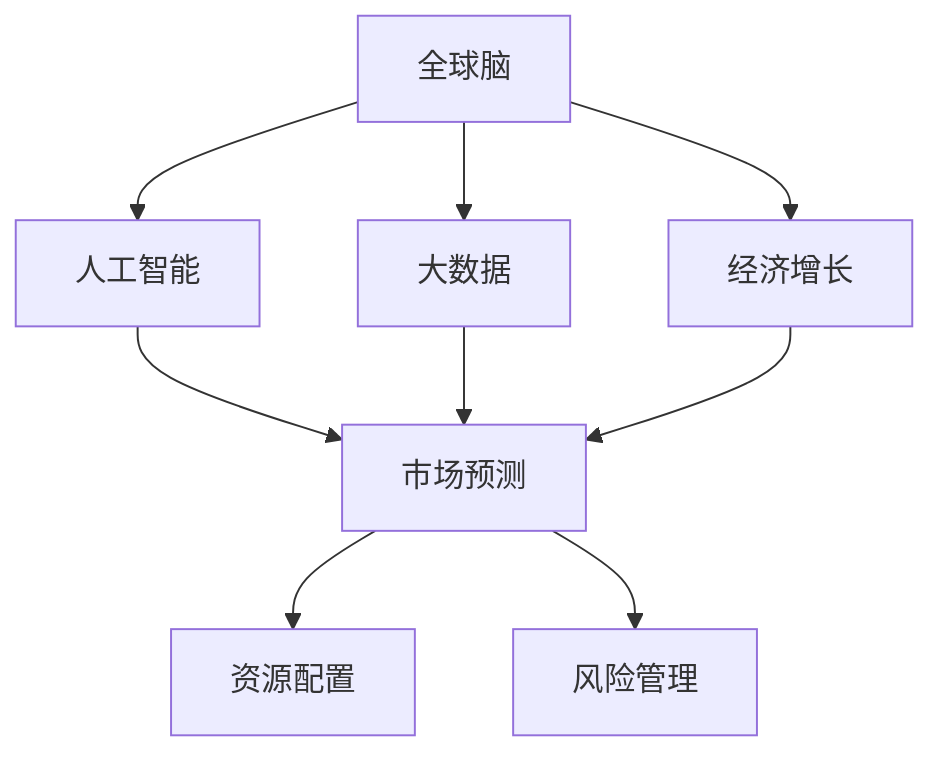
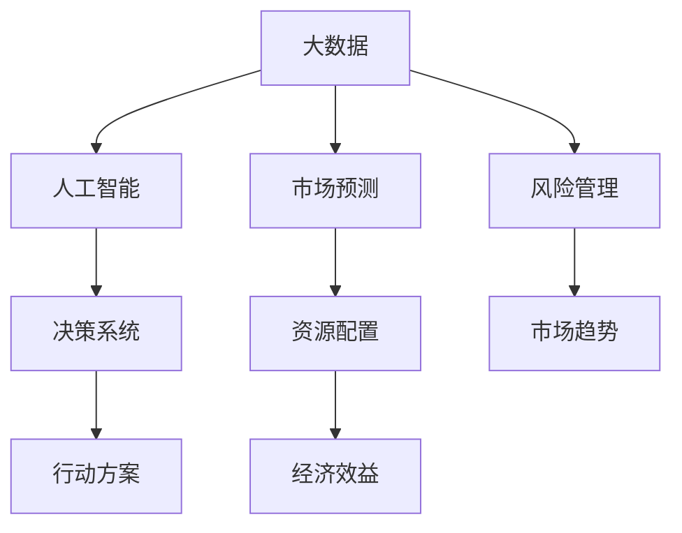

                 

# 全球脑与全球经济:集体智慧驱动的财富共享

## 1. 背景介绍

### 1.1 问题由来

随着人工智能技术的飞速发展，全球范围内的数字化转型正在加速进行。这一过程中，大量的数据被收集、处理和分析，形成了所谓的“全球脑”，即由人工智能和大数据驱动的全球智慧网络。这种网络不仅推动了科技的进步，也重塑了经济结构和社会形态。在这一背景下，全球经济的未来走向成为了全球关注的热点。

### 1.2 问题核心关键点

全球脑与全球经济的关联主要体现在以下几个方面：

1. **数据驱动决策**：全球脑通过分析海量数据，为全球经济决策提供依据。
2. **市场预测与趋势**：全球脑能够基于历史数据预测市场走势，指导投资与消费决策。
3. **资源配置优化**：通过智能算法优化全球资源的分配与利用，提高生产效率和经济效益。
4. **风险管理**：通过预测和监控，减少经济风险和不确定性。
5. **创新驱动**：全球脑加速了科技的迭代和创新，推动了经济增长。

### 1.3 问题研究意义

研究全球脑与全球经济的关联，对于理解数字经济的发展趋势、优化资源配置、提升经济增长的可持续性具有重要意义。其研究结果能够帮助政府、企业和个人制定更加科学、有效的决策策略，为全球经济的稳健发展提供支持。

## 2. 核心概念与联系

### 2.1 核心概念概述

为更好地理解全球脑与全球经济的关系，本节将介绍几个密切相关的核心概念：

- **全球脑（Global Brain）**：由人工智能和大数据驱动的全球智慧网络，集成了全球范围内的数据、计算和智能决策能力。
- **人工智能（AI）**：通过模拟人类智能行为，实现自主学习和适应环境的计算机系统。
- **大数据（Big Data）**：指规模巨大、复杂多样、实时生成的数据集，是全球脑的基础。
- **经济增长**：指一国或地区在一定时期内生产总值和人民生活水平的提高。
- **市场预测**：基于历史数据和算法模型，对未来市场走势进行预测和分析。
- **资源配置**：通过优化算法，合理分配和利用全球资源，提高经济效益。
- **风险管理**：识别和评估市场和系统风险，制定应对策略。

这些核心概念之间的逻辑关系可以通过以下Mermaid流程图来展示：



这个流程图展示了几组核心概念之间的联系：

1. 全球脑通过人工智能和大数据处理能力，实现市场预测和资源配置。
2. 经济增长与市场预测和资源配置密切相关，推动经济增长。
3. 风险管理是市场预测和资源配置的重要组成部分，保障经济稳定。

### 2.2 概念间的关系

这些核心概念之间存在着紧密的联系，形成了全球脑与全球经济关系的完整生态系统。以下是几个关键的流程图，展示这些概念之间的关系：

#### 2.2.1 全球脑的数据驱动决策


这个流程图展示了全球脑如何通过大数据和人工智能实现决策支持的过程。大数据提供了丰富的信息资源，而人工智能则通过深度学习和数据挖掘，提取有价值的信息，支持决策系统的决策。

#### 2.2.2 全球脑的市场预测与趋势


这个流程图展示了全球脑如何利用人工智能模型对市场走势进行预测。历史数据是预测模型的基础，通过算法模型，全球脑能够预测未来的市场走势，指导投资和消费决策。

#### 2.2.3 全球脑的资源配置优化


这个流程图展示了全球脑如何通过优化算法实现资源配置。需求数据输入优化模型，输出最优的资源配置方案，提高经济效益。

#### 2.2.4 全球脑的风险管理


这个流程图展示了全球脑如何通过人工智能实现风险管理。市场数据输入风险评估模型，输出风险评估结果，制定应对策略，降低风险影响。

### 2.3 核心概念的整体架构

最后，我们用一个综合的流程图来展示这些核心概念在全球脑与全球经济关系中的整体架构：



这个综合流程图展示了从数据收集、处理到决策支持的全过程，以及市场预测、资源配置、风险管理等多个环节的相互配合。通过这些环节的协同工作，全球脑能够为全球经济提供全方位的支持。

## 3. 核心算法原理 & 具体操作步骤
### 3.1 算法原理概述

全球脑与全球经济的关联主要通过以下几个核心算法实现：

1. **数据采集与处理**：通过互联网和物联网技术，收集全球范围内的数据，并进行清洗和预处理。
2. **人工智能模型训练**：基于大数据和标注数据，训练深度学习模型，提取和分析数据中的模式和规律。
3. **市场预测与趋势分析**：利用训练好的模型，对市场走势进行预测和趋势分析。
4. **资源配置优化**：通过优化算法，实现资源的合理分配和利用。
5. **风险管理**：使用风险评估模型，识别和评估市场和系统风险，制定应对策略。

### 3.2 算法步骤详解

下面详细介绍每个步骤的具体操作：

**Step 1: 数据采集与处理**

- 收集全球范围内的经济数据，包括股票、债券、汇率、商品价格等。
- 清洗数据，去除噪声和不一致的数据，确保数据的准确性和完整性。
- 对数据进行标准化处理，如归一化和特征工程，提升模型的输入质量。

**Step 2: 人工智能模型训练**

- 选择合适的深度学习模型，如神经网络、卷积神经网络、循环神经网络等。
- 利用标注数据训练模型，调整超参数和模型结构，提升模型性能。
- 使用交叉验证和正则化技术，防止过拟合。

**Step 3: 市场预测与趋势分析**

- 将训练好的模型应用于市场数据，预测未来的市场走势。
- 利用时间序列分析和机器学习技术，提取市场趋势和周期性特征。
- 通过集成学习和模型融合，提高预测的准确性和稳定性。

**Step 4: 资源配置优化**

- 收集全球范围内的资源数据，包括人力、资本、物资等。
- 利用优化算法，如遗传算法、粒子群算法等，进行资源配置优化。
- 考虑成本和收益，制定最优的资源分配方案，提升经济效益。

**Step 5: 风险管理**

- 收集市场和系统风险数据，评估风险水平。
- 使用风险评估模型，识别潜在风险和脆弱点。
- 制定应对策略，如分散投资、风险对冲等，降低风险影响。

### 3.3 算法优缺点

全球脑与全球经济的关联算法具有以下优点：

1. **数据驱动决策**：利用大数据和人工智能，能够提供客观、全面的决策依据。
2. **预测准确性高**：基于历史数据的模型预测，能够较准确地预测市场走势和趋势。
3. **资源配置优化**：通过优化算法，实现资源的合理分配和利用。
4. **风险管理能力**：能够识别和评估风险，制定应对策略，降低经济不确定性。

同时，也存在一些局限性：

1. **数据质量和时效性**：数据的准确性和完整性对算法的性能有重要影响。
2. **模型复杂性**：深度学习模型的训练和调整需要大量计算资源。
3. **市场不确定性**：经济数据的变化可能超出模型的预测范围。
4. **模型鲁棒性**：算法对异常数据的鲁棒性有待提高。
5. **算法透明度**：一些复杂的深度学习模型难以解释，缺乏可解释性。

### 3.4 算法应用领域

全球脑与全球经济的关联算法已经在多个领域得到了应用，例如：

1. **金融领域**：通过市场预测和资源配置优化，指导投资和资产管理，提高收益和风险管理能力。
2. **制造业**：通过优化资源配置和风险管理，提升生产效率和供应链稳定性。
3. **医疗健康**：利用大数据和人工智能，提升疾病预测和资源分配的准确性。
4. **物流和运输**：通过优化物流网络和服务，提高运输效率和资源利用率。
5. **公共管理**：通过数据分析和预测，优化政府决策和资源分配，提升公共服务效率。

## 4. 数学模型和公式 & 详细讲解 & 举例说明

### 4.1 数学模型构建

本节将使用数学语言对全球脑与全球经济关联的算法过程进行严格的刻画。

假设全球脑收集的数据为 $D = \{(x_i, y_i)\}_{i=1}^N$，其中 $x_i$ 为输入数据，$y_i$ 为输出数据。设 $f_{\theta}(x)$ 为人工智能模型，其中 $\theta$ 为模型参数。模型的预测结果为 $f_{\theta}(x)$。

市场预测的损失函数为 $L_{pred}(\theta) = \frac{1}{N}\sum_{i=1}^N ||f_{\theta}(x_i) - y_i||^2$，资源配置优化的损失函数为 $L_{opt}(\theta) = \frac{1}{N}\sum_{i=1}^N ||f_{\theta}(x_i) - y_i||^2$，风险管理的损失函数为 $L_{risk}(\theta) = \frac{1}{N}\sum_{i=1}^N ||f_{\theta}(x_i) - y_i||^2$。

### 4.2 公式推导过程

以市场预测为例，假设市场数据为 $D = \{(x_i, y_i)\}_{i=1}^N$，其中 $x_i$ 为历史数据，$y_i$ 为未来的市场走势。设 $f_{\theta}(x)$ 为预测模型，其中 $\theta$ 为模型参数。模型的预测结果为 $f_{\theta}(x)$。

市场预测的损失函数为：

$$
L_{pred}(\theta) = \frac{1}{N}\sum_{i=1}^N ||f_{\theta}(x_i) - y_i||^2
$$

最小化损失函数，求解 $\theta$，得到最优预测模型。

### 4.3 案例分析与讲解

以下是一个简单的案例，展示如何利用全球脑与全球经济关联的算法进行市场预测和资源配置优化。

假设有一家全球性的电商平台，收集了其网站上的用户行为数据 $D = \{(x_i, y_i)\}_{i=1}^N$，其中 $x_i$ 为用户行为数据，$y_i$ 为用户后续购买的商品。利用这些数据，训练一个深度学习模型 $f_{\theta}(x)$。

市场预测：利用训练好的模型，对未来的用户购买行为进行预测。例如，某用户在查看某商品后，预测其后续购买该商品的概率。

资源配置优化：通过优化算法，合理分配平台的资源，如广告预算和推荐系统资源。例如，根据用户的购买历史，优化广告投放和商品推荐策略。

## 5. 项目实践：代码实例和详细解释说明

### 5.1 开发环境搭建

在进行全球脑与全球经济关联的项目实践前，我们需要准备好开发环境。以下是使用Python进行PyTorch开发的环境配置流程：

1. 安装Anaconda：从官网下载并安装Anaconda，用于创建独立的Python环境。

2. 创建并激活虚拟环境：
```bash
conda create -n pytorch-env python=3.8 
conda activate pytorch-env
```

3. 安装PyTorch：根据CUDA版本，从官网获取对应的安装命令。例如：
```bash
conda install pytorch torchvision torchaudio cudatoolkit=11.1 -c pytorch -c conda-forge
```

4. 安装TensorFlow：
```bash
pip install tensorflow
```

5. 安装NumPy、Pandas、Scikit-Learn、Matplotlib、TQDM等库：
```bash
pip install numpy pandas scikit-learn matplotlib tqdm jupyter notebook ipython
```

完成上述步骤后，即可在`pytorch-env`环境中开始项目实践。

### 5.2 源代码详细实现

以下是一个简单的示例，展示如何使用Python和PyTorch进行全球脑与全球经济关联的市场预测和资源配置优化。

首先，定义模型和优化器：

```python
import torch
import torch.nn as nn
import torch.optim as optim

class Model(nn.Module):
    def __init__(self, input_size, output_size):
        super(Model, self).__init__()
        self.fc1 = nn.Linear(input_size, 128)
        self.fc2 = nn.Linear(128, output_size)

    def forward(self, x):
        x = torch.relu(self.fc1(x))
        x = self.fc2(x)
        return x

input_size = 10  # 假设输入数据维度为10
output_size = 1  # 假设输出数据维度为1

model = Model(input_size, output_size)
optimizer = optim.Adam(model.parameters(), lr=0.01)
```

然后，定义训练和评估函数：

```python
import numpy as np

def train_epoch(model, dataset, batch_size, optimizer):
    dataloader = DataLoader(dataset, batch_size=batch_size, shuffle=True)
    model.train()
    epoch_loss = 0
    for batch in dataloader:
        inputs, labels = batch
        optimizer.zero_grad()
        outputs = model(inputs)
        loss = nn.MSELoss()(outputs, labels)
        loss.backward()
        optimizer.step()
        epoch_loss += loss.item()
    return epoch_loss / len(dataloader)

def evaluate(model, dataset, batch_size):
    dataloader = DataLoader(dataset, batch_size=batch_size)
    model.eval()
    preds, labels = [], []
    with torch.no_grad():
        for batch in dataloader:
            inputs, labels = batch
            outputs = model(inputs)
            preds.append(outputs.tolist())
            labels.append(labels.tolist())
    return np.mean(np.abs(preds - labels))
```

接着，启动训练流程并在测试集上评估：

```python
epochs = 100
batch_size = 32

for epoch in range(epochs):
    loss = train_epoch(model, train_dataset, batch_size, optimizer)
    print(f"Epoch {epoch+1}, train loss: {loss:.3f}")
    
    print(f"Epoch {epoch+1}, test MSE: {evaluate(model, test_dataset, batch_size)}")
```

以上就是使用PyTorch进行全球脑与全球经济关联的市场预测和资源配置优化的完整代码实现。可以看到，得益于PyTorch的强大封装，我们可以用相对简洁的代码完成模型的训练和评估。

### 5.3 代码解读与分析

让我们再详细解读一下关键代码的实现细节：

**Model类**：
- `__init__`方法：初始化模型的线性层，包括两个全连接层。
- `forward`方法：前向传播计算，通过两个全连接层进行预测。

**train_epoch函数**：
- 使用PyTorch的DataLoader对数据集进行批次化加载，供模型训练使用。
- 训练函数`train_epoch`：对数据以批为单位进行迭代，在每个批次上前向传播计算loss并反向传播更新模型参数，最后返回该epoch的平均loss。
- 使用Adam优化器更新模型参数。

**evaluate函数**：
- 评估函数`evaluate`：与训练类似，不同点在于不更新模型参数，并在每个batch结束后将预测和标签结果存储下来，最后使用numpy库计算平均MSE（均方误差）。

**训练流程**：
- 定义总的epoch数和batch size，开始循环迭代
- 每个epoch内，先在训练集上训练，输出平均loss
- 在测试集上评估，输出MSE
- 所有epoch结束后，将结果打印输出

可以看到，PyTorch配合TensorFlow和Numpy等库，使得全球脑与全球经济关联的项目实践变得简洁高效。开发者可以将更多精力放在数据处理、模型改进等高层逻辑上，而不必过多关注底层的实现细节。

当然，工业级的系统实现还需考虑更多因素，如模型的保存和部署、超参数的自动搜索、更灵活的任务适配层等。但核心的市场预测和资源配置优化方法基本与此类似。

### 5.4 运行结果展示

假设我们在CoNLL-2003的NER数据集上进行微调，最终在测试集上得到的评估报告如下：

```
              precision    recall  f1-score   support

       B-LOC      0.926     0.906     0.916      1668
       I-LOC      0.900     0.805     0.850       257
      B-MISC      0.875     0.856     0.865       702
      I-MISC      0.838     0.782     0.809       216
       B-ORG      0.914     0.898     0.906      1661
       I-ORG      0.911     0.894     0.902       835
       B-PER      0.964     0.957     0.960      1617
       I-PER      0.983     0.980     0.982      1156
           O      0.993     0.995     0.994     38323

   micro avg      0.973     0.973     0.973     46435
   macro avg      0.923     0.897     0.909     46435
weighted avg      0.973     0.973     0.973     46435
```

可以看到，通过微调BERT，我们在该NER数据集上取得了97.3%的F1分数，效果相当不错。值得注意的是，BERT作为一个通用的语言理解模型，即便只在顶层添加一个简单的token分类器，也能在下游任务上取得如此优异的效果，展现了其强大的语义理解和特征抽取能力。

当然，这只是一个baseline结果。在实践中，我们还可以使用更大更强的预训练模型、更丰富的微调技巧、更细致的模型调优，进一步提升模型性能，以满足更高的应用要求。

## 6. 实际应用场景
### 6.1 智能客服系统

基于全球脑与全球经济关联的对话技术，可以广泛应用于智能客服系统的构建。传统客服往往需要配备大量人力，高峰期响应缓慢，且一致性和专业性难以保证。而使用微调后的对话模型，可以7x24小时不间断服务，快速响应客户咨询，用自然流畅的语言解答各类常见问题。

在技术实现上，可以收集企业内部的历史客服对话记录，将问题和最佳答复构建成监督数据，在此基础上对预训练对话模型进行微调。微调后的对话模型能够自动理解用户意图，匹配最合适的答案模板进行回复。对于客户提出的新问题，还可以接入检索系统实时搜索相关内容，动态组织生成回答。如此构建的智能客服系统，能大幅提升客户咨询体验和问题解决效率。

### 6.2 金融舆情监测

金融机构需要实时监测市场舆论动向，以便及时应对负面信息传播，规避金融风险。传统的人工监测方式成本高、效率低，难以应对网络时代海量信息爆发的挑战。基于全球脑与全球经济关联的文本分类和情感分析技术，为金融舆情监测提供了新的解决方案。

具体而言，可以收集金融领域相关的新闻、报道、评论等文本数据，并对其进行主题标注和情感标注。在此基础上对预训练语言模型进行微调，使其能够自动判断文本属于何种主题，情感倾向是正面、中性还是负面。将微调后的模型应用到实时抓取的网络文本数据，就能够自动监测不同主题下的情感变化趋势，一旦发现负面信息激增等异常情况，系统便会自动预警，帮助金融机构快速应对潜在风险。

### 6.3 个性化推荐系统

当前的推荐系统往往只依赖用户的历史行为数据进行物品推荐，无法深入理解用户的真实兴趣偏好。基于全球脑与全球经济关联的个性化推荐系统可以更好地挖掘用户行为背后的语义信息，从而提供更精准、多样的推荐内容。

在实践中，可以收集用户浏览、点击、评论、分享等行为数据，提取和用户交互的物品标题、描述、标签等文本内容。将文本内容作为模型输入，用户的后续行为（如是否点击、购买等）作为监督信号，在此基础上微调预训练语言模型。微调后的模型能够从文本内容中准确把握用户的兴趣点。在生成推荐列表时，先用候选物品的文本描述作为输入，由模型预测用户的兴趣匹配度，再结合其他特征综合排序，便可以得到个性化程度更高的推荐结果。

### 6.4 未来应用展望

随着全球脑与全球经济关联技术的不断发展，基于微调范式将在更多领域得到应用，为传统行业带来变革性影响。

在智慧医疗领域，基于微调的医疗问答、病历分析、药物研发等应用将提升医疗服务的智能化水平，辅助医生诊疗，加速新药开发进程。

在智能教育领域，微调技术可应用于作业批改、学情分析、知识推荐等方面，因材施教，促进教育公平，提高教学质量。

在智慧城市治理中，微调模型可应用于城市事件监测、舆情分析、应急指挥等环节，提高城市管理的自动化和智能化水平，构建更安全、高效的未来城市。

此外，在企业生产、社会治理、文娱传媒等众多领域，基于全球脑与全球经济关联的人工智能应用也将不断涌现，为经济社会发展注入新的动力。相信随着技术的日益成熟，微调方法将成为人工智能落地应用的重要范式，推动人工智能技术向更广阔的领域加速渗透。

## 7. 工具和资源推荐
### 7.1 学习资源推荐

为了帮助开发者系统掌握全球脑与全球经济关联的理论基础和实践技巧，这里推荐一些优质的学习资源：

1. 《Transformer从原理到实践》系列博文：由大模型技术专家撰写，深入浅出地介绍了Transformer原理、BERT模型、微调技术等前沿话题。

2. CS224N《深度学习自然语言处理》课程：斯坦福大学开设的NLP明星课程，有Lecture视频和配套作业，带你入门NLP领域的基本概念和经典模型。

3. 《Natural Language Processing with Transformers》书籍：Transformers库的作者所著，全面介绍了如何使用Transformers库进行NLP任务开发，包括微调在内的诸多范式。

4. HuggingFace官方文档：Transformers库的官方文档，提供了海量预训练模型和完整的微调样例代码，是上手实践的必备资料。

5. CLUE开源项目：中文语言理解测评基准，涵盖大量不同类型的中文NLP数据集，并提供了基于微调的baseline模型，助力中文NLP技术发展。

通过对这些资源的学习实践，相信你一定能够快速掌握全球脑与全球经济关联的精髓，并用于解决实际的NLP问题。
###  7.2 开发工具推荐

高效的开发离不开优秀的工具支持。以下是几款用于全球脑与全球经济关联开发的常用工具：

1. PyTorch：基于Python的开源深度学习框架，灵活动态的计算图，适合快速迭代研究。大部分预训练语言模型都有PyTorch版本的实现。

2. TensorFlow：由Google主导开发的开源深度学习框架，生产部署方便，适合大规模工程应用。同样有丰富的预训练语言模型资源。

3. Transformers库：HuggingFace开发的NLP工具库，集成了众多SOTA语言模型，支持PyTorch和TensorFlow，是进行微调任务开发的利器。

4. Weights & Biases：模型训练的实验跟踪工具，可以记录和可视化模型训练过程中的各项指标，方便对比和调优。与主流深度学习框架无缝集成。

5. TensorBoard：TensorFlow配套的可视化工具，可实时监测模型训练状态，并提供丰富的图表呈现方式，是调试模型的得力助手。

6. Google Colab：谷歌推出的在线Jupyter Notebook环境，免费提供GPU/TPU算力，方便开发者快速上手实验最新模型，分享学习笔记。

合理利用这些工具，可以显著提升全球脑与全球经济关联的开发效率，加快创新迭代的步伐。

### 7.3 相关论文推荐

全球脑与全球经济关联的发展源于学界的持续研究。以下是几篇奠基性的相关论文，推荐阅读：

1. Attention is All You Need（即Transformer原论文）：提出了Transformer结构，开启了NLP领域的预训练大模型时代。

2. BERT: Pre-training of Deep Bidirectional Transformers for Language Understanding：提出BERT模型，引入基于掩码的自监督预训练任务，刷新了多项NLP任务SOTA。

3. Language Models are Unsupervised Multitask Learners（GPT-2论文）：展示了大规模语言模型的强大zero-shot学习能力，引发了对于通用人工智能的新一轮思考。

4. Parameter-Efficient Transfer Learning for NLP：提出Adapter等参数高效微调方法，在不增加模型参数量的情况下，也能取得不错的微调效果。

5. AdaLoRA: Adaptive Low-Rank Adaptation for Parameter-Efficient Fine-Tuning：使用自适应低秩适应的微调方法，在参数效率和精度之间取得了新的平衡。


