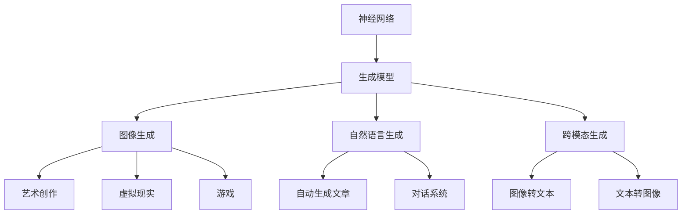

                 

# 全球范围内掀起生成式AI浪潮

> 关键词：生成式AI, 神经网络, 生成模型, 图像生成, 自然语言生成, 跨模态生成, 多领域应用

## 1. 背景介绍

随着人工智能技术的飞速发展，生成式AI（Generative AI）正逐渐成为AI领域的一股强劲浪潮，并快速渗透到各个行业和应用领域。生成式AI不仅能够生成高质量、高度逼真的图像、视频、音频和文本，还能在各种跨模态场景中进行创新应用，为社会经济带来了深远的影响。本文将系统介绍生成式AI的原理与核心算法，深入剖析其在不同领域的实践应用，并展望未来的发展趋势。

## 2. 核心概念与联系

### 2.1 核心概念概述

生成式AI的核心概念主要包括：

- **神经网络**：生成式AI的核心技术架构，基于多层感知器（MLP）和卷积神经网络（CNN）等架构实现。

- **生成模型**：通过训练数据，生成式模型可以学习到数据的分布，从而生成新的数据样本。

- **图像生成**：使用生成式模型生成高质量的图像，广泛应用于艺术创作、虚拟现实、游戏等领域。

- **自然语言生成**：通过生成式模型生成自然语言文本，如自动生成文章、对话系统等。

- **跨模态生成**：在图像、音频、视频和文本等不同模态之间进行生成和转换，实现跨模态数据的融合和交互。

### 2.2 核心概念的联系

以下通过一个Mermaid流程图来展示这些核心概念的联系：



这个流程图展示了生成式AI的三个核心领域：图像生成、自然语言生成和跨模态生成，以及它们在各个应用场景中的应用。

## 3. 核心算法原理 & 具体操作步骤

### 3.1 算法原理概述

生成式AI的算法原理基于深度学习，特别是生成对抗网络（GANs）和变分自编码器（VAEs）等生成模型。这些模型通过学习数据的概率分布，能够生成与真实数据高度相似的新数据。

生成式模型的训练过程通常包含两个部分：生成器和判别器。生成器负责从噪声或随机向量中生成新数据，判别器则负责判断生成数据与真实数据之间的差异。通过对抗训练，生成器能够不断改进，生成更加逼真的数据。

### 3.2 算法步骤详解

生成式AI的训练和应用步骤如下：

1. **数据准备**：收集并准备用于训练的数据集，包括图像、音频、文本等。

2. **模型选择**：选择适合的生成模型，如GAN、VAE等。

3. **模型搭建**：搭建生成器和判别器的神经网络架构，选择合适的损失函数，如交叉熵损失等。

4. **训练过程**：通过对抗训练过程，不断优化生成器和判别器的参数。

5. **模型评估**：在测试集上评估生成模型的性能，如使用Inception Score或Fréchet Inception Distance等指标。

6. **应用场景**：将训练好的生成模型应用到具体的生成任务中，如图像生成、文本生成等。

### 3.3 算法优缺点

生成式AI的优点包括：

- **逼真度高**：生成模型能够生成与真实数据高度相似的新数据。
- **应用广泛**：可以应用于图像、音频、文本等多种数据类型。
- **创新性强**：能够进行跨模态数据的生成和转换，实现创新的应用场景。

其缺点包括：

- **训练复杂**：生成对抗网络的训练过程复杂，需要大量计算资源。
- **样本数量要求高**：生成模型需要大量的训练数据才能获得好的性能。
- **可解释性差**：生成模型的内部机制复杂，难以解释其生成的过程。

### 3.4 算法应用领域

生成式AI在多个领域都有广泛的应用：

- **图像生成**：用于艺术创作、虚拟现实、游戏等领域，如DeepArt、DALL-E等。

- **自然语言生成**：用于自动生成文章、对话系统、摘要生成等，如GPT-3、GPT-4等。

- **跨模态生成**：用于图像转文本、文本转图像、图像转音频等，如StyleGAN2、CycleGAN等。

## 4. 数学模型和公式 & 详细讲解  
### 4.1 数学模型构建

生成式AI的数学模型主要基于概率模型和生成模型。以下以GAN为例，介绍生成对抗网络的数学模型构建。

设$X$为真实数据集，$G$为生成器，$D$为判别器，训练目标是最大化生成器生成逼真数据的概率，最小化判别器区分真实数据和生成数据的概率。数学模型如下：

$$
\min_G \max_D V(D,G) = \mathbb{E}_{x\sim X}[\log D(x)] + \mathbb{E}_{z\sim p(z)}[\log(1-D(G(z)))]
$$

其中，$z$为随机噪声向量，$p(z)$为噪声向量的概率分布。

### 4.2 公式推导过程

GAN的推导过程如下：

1. **生成器的推导**：生成器的目标是生成尽可能逼真的数据。假设生成器为$G(z)$，$z$为随机噪声向量，生成的数据为$G(z)$。

2. **判别器的推导**：判别器的目标是区分真实数据和生成数据。假设判别器为$D(x)$，$x$为真实数据，判别器的目标为$\mathbb{E}_{x\sim X}[\log D(x)]$。

3. **对抗训练**：生成器和判别器通过对抗训练不断改进。生成器的目标是最大化生成数据的逼真度，判别器的目标是最大化区分真实数据和生成数据的概率。

### 4.3 案例分析与讲解

以图像生成为例，使用GAN生成逼真的人脸图像。首先，收集大量的人脸图像数据，作为训练集。然后，使用GAN模型对噪声向量$z$进行采样，生成人脸图像。最后，使用判别器$D(x)$判断生成图像是否逼真，通过对抗训练不断优化生成器和判别器的参数。

## 5. 项目实践：代码实例和详细解释说明

### 5.1 开发环境搭建

生成式AI的开发环境主要使用Python和深度学习框架，如TensorFlow、PyTorch等。以下是TensorFlow和PyTorch的安装方法：

```bash
pip install tensorflow==2.6
pip install torch==1.10
```

### 5.2 源代码详细实现

以下是一个使用PyTorch实现GAN生成人脸图像的代码示例：

```python
import torch
import torchvision.transforms as transforms
import torchvision.datasets as datasets

# 定义GAN模型
class Generator(torch.nn.Module):
    def __init__(self):
        super(Generator, self).__init__()
        self.main = nn.Sequential(
            nn.Linear(100, 256),
            nn.LeakyReLU(0.2, inplace=True),
            nn.Linear(256, 512),
            nn.LeakyReLU(0.2, inplace=True),
            nn.Linear(512, 1024),
            nn.LeakyReLU(0.2, inplace=True),
            nn.Linear(1024, 784),
            nn.Tanh()
        )

    def forward(self, input):
        return self.main(input)

class Discriminator(torch.nn.Module):
    def __init__(self):
        super(Discriminator, self).__init__()
        self.main = nn.Sequential(
            nn.Linear(784, 512),
            nn.LeakyReLU(0.2, inplace=True),
            nn.Dropout(0.5),
            nn.Linear(512, 256),
            nn.LeakyReLU(0.2, inplace=True),
            nn.Dropout(0.5),
            nn.Linear(256, 1),
            nn.Sigmoid()
        )

    def forward(self, input):
        return self.main(input)

# 定义训练函数
def train(ngpu, batch_size, epochs, lr):
    # 加载数据集
    dataset = datasets.MNIST(root='./data', train=True, transform=transforms.ToTensor(), download=True)
    train_loader = torch.utils.data.DataLoader(dataset, batch_size=batch_size, shuffle=True)

    # 定义模型和优化器
    generator = Generator()
    discriminator = Discriminator()
    if ngpu > 0:
        generator = generator.cuda()
        discriminator = discriminator.cuda()
    generator_optimizer = torch.optim.Adam(generator.parameters(), lr=lr)
    discriminator_optimizer = torch.optim.Adam(discriminator.parameters(), lr=lr)

    # 训练过程
    for epoch in range(epochs):
        for i, (images, _) in enumerate(train_loader):
            # 调整批大小，保证每个批中只有一张图像
            if ngpu > 0 and images.size(0) * ngpu != batch_size:
                continue
            # 定义真实和假图像
            real_images = images.view(-1, 28 * 28).float().to(ngpu)
            batches = batch_size // ngpu
            z = torch.randn(batches * ngpu, 100).float().to(ngpu)

            # 生成假图像
            fake_images = generator(z)

            # 判别器损失
            real_loss = discriminator(real_images).mean()
            fake_loss = discriminator(fake_images).mean()
            d_loss = real_loss + fake_loss

            # 生成器损失
            g_loss = discriminator(fake_images).mean()

            # 反向传播
            generator_optimizer.zero_grad()
            discriminator_optimizer.zero_grad()
            real_loss.backward()
            fake_loss.backward()
            g_loss.backward()
            generator_optimizer.step()
            discriminator_optimizer.step()

            # 输出训练结果
            if i % 50 == 0:
                print('[%d/%d][%d/%d][%d] Loss: D %f, G %f' % (epoch, epochs, i, len(train_loader), ngpu, d_loss.item(), g_loss.item()))

# 启动训练
train(ngpu, batch_size, epochs, lr)
```

### 5.3 代码解读与分析

代码中，我们定义了GAN模型，包括生成器和判别器。生成器使用4层全连接神经网络，判别器使用2层全连接神经网络。在训练过程中，我们使用了MNIST手写数字数据集，通过对抗训练不断优化生成器和判别器的参数。

## 6. 实际应用场景

### 6.1 艺术创作

生成式AI在艺术创作领域有广泛应用。例如，使用GAN生成逼真的艺术作品，艺术家可以通过调整超参数，生成独特的艺术风格。

### 6.2 虚拟现实

在虚拟现实领域，生成式AI可以生成逼真的虚拟场景和角色，提高用户的沉浸感和体验。

### 6.3 游戏开发

在游戏开发中，生成式AI可以生成逼真的游戏场景和角色，增强游戏的互动性和趣味性。

### 6.4 未来应用展望

未来，生成式AI将在更多领域得到应用，如医疗、教育、金融等。通过生成式AI，可以生成高质量的教育素材、医疗影像、金融报表等，助力这些行业的创新和进步。

## 7. 工具和资源推荐

### 7.1 学习资源推荐

- **深度学习课程**：如CS231n《卷积神经网络》、CS224n《自然语言处理》、CS234《计算机视觉：目标检测与分类》等。

- **生成式AI书籍**：如《Generative Adversarial Networks with TensorFlow 2》、《Generative Models in HedgehogGAN》等。

### 7.2 开发工具推荐

- **深度学习框架**：TensorFlow、PyTorch等。

- **可视化工具**：TensorBoard、Weights & Biases等。

- **数据集**：如CIFAR-10、MNIST、ImageNet等。

### 7.3 相关论文推荐

- **GAN论文**：如Ian Goodfellow等人《Generative Adversarial Nets》。

- **VAE论文**：如Alex Kingma等人《Auto-Encoding Variational Bayes》。

## 8. 总结：未来发展趋势与挑战

### 8.1 研究成果总结

生成式AI在图像、音频、文本等多个领域都取得了显著进展，应用场景不断扩展，技术不断完善。未来，生成式AI将在更多的应用场景中发挥作用，提升人类的生产和生活水平。

### 8.2 未来发展趋势

未来，生成式AI的发展趋势包括：

- **高精度生成**：生成式模型将越来越精确，生成的数据将更加逼真、自然。

- **跨模态生成**：生成式AI将在更多模态之间进行融合，实现跨模态数据的生成和转换。

- **多领域应用**：生成式AI将在医疗、教育、金融等多个领域得到应用，带来创新和变革。

- **可解释性增强**：生成式AI的内部机制将更加透明，生成过程更加可解释。

### 8.3 面临的挑战

生成式AI面临的挑战包括：

- **计算资源需求高**：生成式模型的训练和推理需要大量计算资源。

- **训练数据需求大**：生成式模型需要大量的高质量训练数据。

- **生成结果的可控性**：如何控制生成结果的风格和质量，仍是一个难题。

- **伦理和隐私问题**：生成式AI可能生成有害内容，如何保障内容的安全和隐私，需要进一步探索。

### 8.4 研究展望

未来，生成式AI的研究方向包括：

- **小样本学习和零样本学习**：如何让生成式模型在少数样本和零样本情况下，也能生成高质量的数据。

- **鲁棒性增强**：如何让生成式模型在面对噪声和扰动时，仍能保持稳定的性能。

- **可解释性提升**：如何让生成式模型更加透明，生成过程更加可解释。

- **跨模态生成技术**：如何让生成式模型在多个模态之间进行更加流畅的转换。

## 9. 附录：常见问题与解答

**Q1：生成式AI的优势是什么？**

A: 生成式AI的优势包括：

- **高精度生成**：生成式模型能够生成高质量、高度逼真的数据。

- **应用广泛**：可以应用于图像、音频、文本等多种数据类型。

- **创新性强**：能够进行跨模态数据的生成和转换，实现创新的应用场景。

**Q2：生成式AI的训练过程有哪些关键步骤？**

A: 生成式AI的训练过程包括：

- **数据准备**：收集并准备用于训练的数据集。

- **模型选择**：选择适合的生成模型，如GAN、VAE等。

- **模型搭建**：搭建生成器和判别器的神经网络架构，选择合适的损失函数。

- **训练过程**：通过对抗训练不断优化生成器和判别器的参数。

- **模型评估**：在测试集上评估生成模型的性能。

**Q3：生成式AI在实际应用中需要注意哪些问题？**

A: 生成式AI在实际应用中需要注意的问题包括：

- **计算资源需求高**：生成式模型的训练和推理需要大量计算资源。

- **训练数据需求大**：生成式模型需要大量的高质量训练数据。

- **生成结果的可控性**：如何控制生成结果的风格和质量，仍是一个难题。

- **伦理和隐私问题**：生成式AI可能生成有害内容，如何保障内容的安全和隐私，需要进一步探索。

**Q4：生成式AI在医疗领域有哪些应用？**

A: 生成式AI在医疗领域的应用包括：

- **医学图像生成**：生成逼真的医学影像，辅助诊断和治疗。

- **药物设计**：生成新的药物分子，加速药物研发过程。

- **医疗文本生成**：生成医学报告、病历等文本，提高医疗文档的生成效率。

**Q5：生成式AI在教育领域有哪些应用？**

A: 生成式AI在教育领域的应用包括：

- **教育素材生成**：生成高质量的教材、课件、试题等教育素材。

- **个性化教育**：根据学生的学习情况，生成个性化的学习路径和教学内容。

- **虚拟教师**：生成虚拟教师，辅助教学和学习。

---

作者：禅与计算机程序设计艺术 / Zen and the Art of Computer Programming

