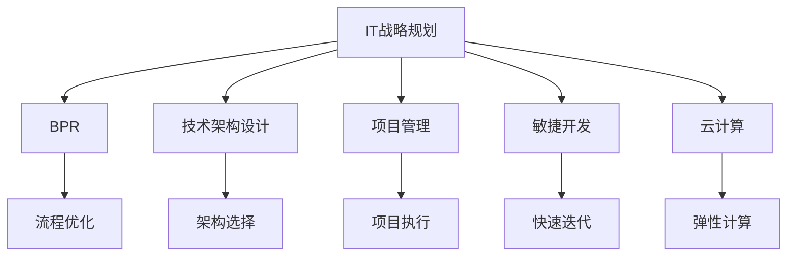
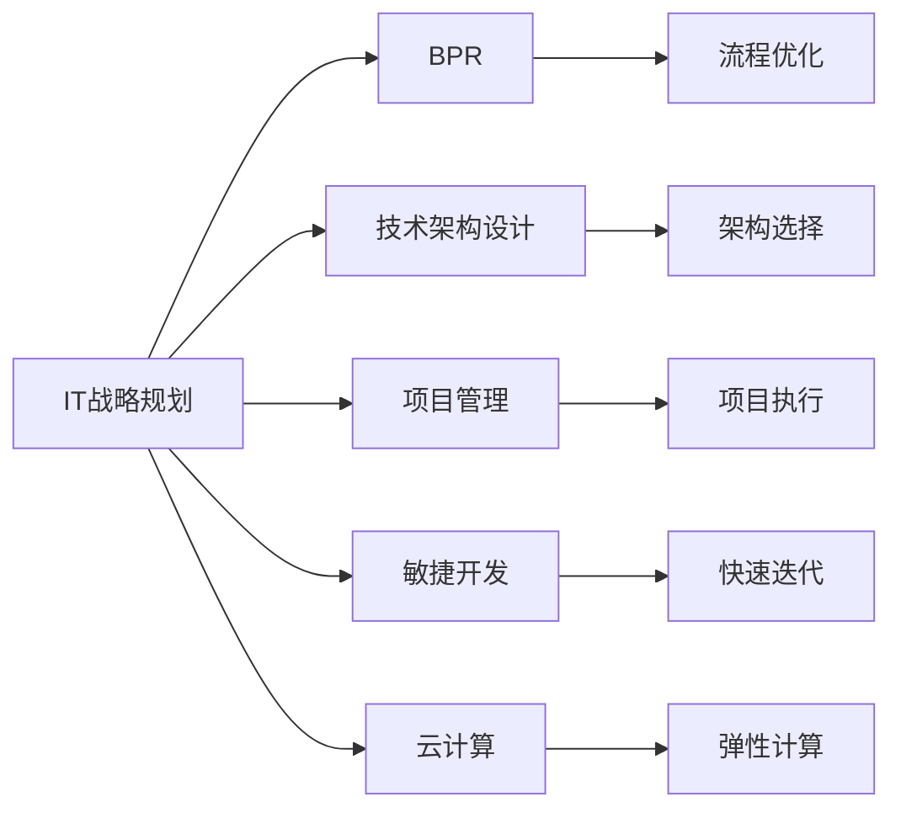
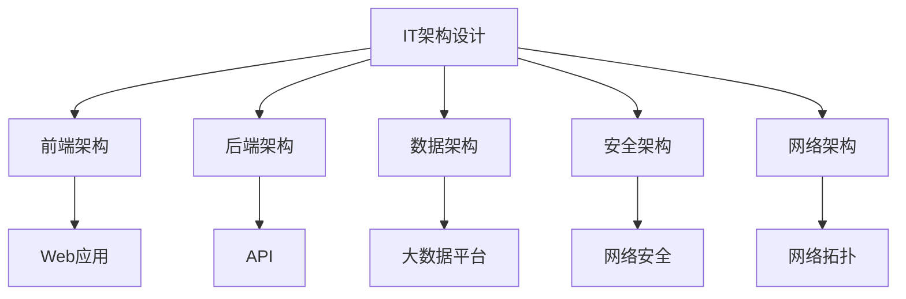
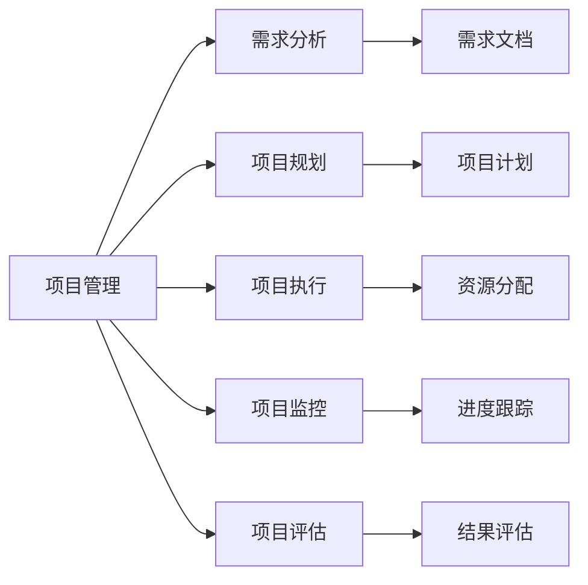
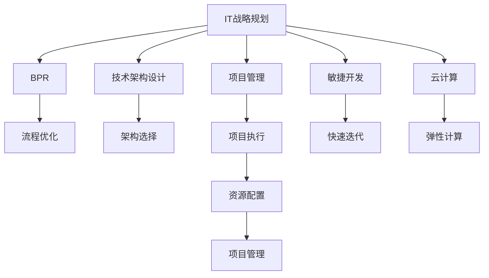

                 

# 公司IT战略规划的制定、实施

> 关键词：
- IT战略规划
- 制定
- 实施
- 企业数字化转型
- IT架构设计
- 项目管理

## 1. 背景介绍

### 1.1 问题由来
在当前数字化时代，企业信息化和智能化水平已成为企业竞争力的重要体现。有效的IT战略规划是企业实现数字化转型的关键。然而，由于数字化转型涉及业务流程重构、技术架构升级、管理模式优化等多方面的复杂问题，很多企业往往在IT战略规划的制定和实施过程中遇到各种挑战，导致规划与实施脱节，数字化转型成效不佳。

### 1.2 问题核心关键点
企业IT战略规划的核心在于通过对企业内外部环境的全面分析，确定未来IT建设的方向和重点，并制定详细的实施方案，以确保IT建设与业务发展紧密结合，实现企业数字化转型目标。关键点包括：

- **业务驱动**：以业务需求为根本，推动IT战略规划的制定和实施。
- **技术先进**：选择先进的技术架构和工具，确保IT系统具有良好的扩展性和可维护性。
- **管理规范**：制定详细的项目管理规范和流程，保障IT项目按时按质完成。
- **风险控制**：识别和管理IT项目中的风险，确保项目顺利实施。

### 1.3 问题研究意义
企业IT战略规划的科学制定和成功实施，对企业提升核心竞争力、优化资源配置、实现创新发展具有重要意义。其研究价值体现在：

- **提升效率**：通过IT战略规划，优化业务流程，提升企业运营效率。
- **降低成本**：合理规划IT资源，避免资源浪费，降低IT投入成本。
- **增强竞争力**：借助先进的技术和平台，提升企业产品和服务质量。
- **支持创新**：为业务创新提供技术支持，推动企业持续发展。

## 2. 核心概念与联系

### 2.1 核心概念概述

为更好地理解公司IT战略规划的制定和实施，本节将介绍几个密切相关的核心概念：

- **IT战略规划**：基于对企业内外环境的全面分析，确定未来IT建设的方向和重点，并制定详细的实施方案。
- **业务流程重构(BPR)**：对企业现有的业务流程进行优化和改造，以提升效率和降低成本。
- **技术架构设计**：根据业务需求和技术发展趋势，选择合适的技术架构和工具。
- **项目管理**：对IT项目进行全生命周期管理，包括需求分析、项目规划、执行、监控和评估。
- **敏捷开发(Agile)**：一种迭代、快速交付的软件开发方法，强调灵活性和快速响应变化。
- **云计算**：基于互联网提供按需扩展的计算资源，支持弹性计算和数据存储。

这些概念之间的逻辑关系可以通过以下Mermaid流程图来展示：



这个流程图展示了一系列的IT战略规划关键概念及其之间的关系：

1. IT战略规划是起点，对业务流程、技术架构、项目管理、敏捷开发、云计算等进行综合考虑。
2. 业务流程重构通过优化现有流程，提升业务效率。
3. 技术架构设计通过选择合适技术，支撑业务需求。
4. 项目管理保障项目按时按质完成。
5. 敏捷开发加快项目迭代，快速响应变化。
6. 云计算提供弹性计算资源，支持业务创新。

### 2.2 概念间的关系

这些核心概念之间存在着紧密的联系，形成了企业IT战略规划的完整生态系统。下面我通过几个Mermaid流程图来展示这些概念之间的关系。

#### 2.2.1 IT战略规划的总体框架



这个流程图展示了一系列的IT战略规划关键概念及其之间的关系：

1. IT战略规划是起点，对业务流程、技术架构、项目管理、敏捷开发、云计算等进行综合考虑。
2. 业务流程重构通过优化现有流程，提升业务效率。
3. 技术架构设计通过选择合适技术，支撑业务需求。
4. 项目管理保障项目按时按质完成。
5. 敏捷开发加快项目迭代，快速响应变化。
6. 云计算提供弹性计算资源，支持业务创新。

#### 2.2.2 IT架构设计的主要组成



这个流程图展示了IT架构设计的主要组成：

1. IT架构设计包括前端、后端、数据、安全和网络等多个子架构。
2. 前端架构支持Web应用和API开发。
3. 后端架构负责系统服务、数据库等核心功能。
4. 数据架构涉及数据存储、处理和大数据分析。
5. 安全架构保障系统的安全性、隐私保护和合规性。
6. 网络架构包括网络拓扑设计和网络安全防护。

#### 2.2.3 项目管理的主要阶段



这个流程图展示了项目管理的全生命周期：

1. 项目管理包括需求分析、项目规划、项目执行、项目监控和项目评估五个阶段。
2. 需求分析阶段，明确项目目标和需求。
3. 项目规划阶段，制定项目计划和时间表。
4. 项目执行阶段，分配资源，执行任务。
5. 项目监控阶段，跟踪项目进度和质量。
6. 项目评估阶段，总结项目成果和经验。

### 2.3 核心概念的整体架构

最后，我们用一个综合的流程图来展示这些核心概念在企业IT战略规划中的整体架构：



这个综合流程图展示了从IT战略规划到具体项目实施的全过程：

1. IT战略规划是起点，对业务流程、技术架构、项目管理、敏捷开发、云计算等进行综合考虑。
2. 业务流程重构通过优化现有流程，提升业务效率。
3. 技术架构设计通过选择合适技术，支撑业务需求。
4. 项目管理保障项目按时按质完成。
5. 敏捷开发加快项目迭代，快速响应变化。
6. 云计算提供弹性计算资源，支持业务创新。
7. 资源配置基于项目需求，合理分配资源。
8. 项目管理通过资源配置和监控，确保项目顺利实施。

## 3. 核心算法原理 & 具体操作步骤
### 3.1 算法原理概述

企业IT战略规划的制定和实施，本质上是一个多目标优化问题。其核心思想是通过对内外部环境的全面分析，确定未来IT建设的方向和重点，并制定详细的实施方案，以确保IT建设与业务发展紧密结合，实现企业数字化转型目标。

形式化地，假设企业内外部环境为 $E$，IT战略目标为 $T$，IT资源为 $R$。则企业IT战略规划的优化目标可以表示为：

$$
\max_{E, T, R} \sum_{i=1}^n w_i \mathcal{F}_i(E, T, R)
$$

其中 $w_i$ 为各战略目标的权重，$\mathcal{F}_i$ 为对应目标的评估函数。通过优化算法，在给定环境 $E$ 和资源 $R$ 的前提下，最大化战略目标 $T$ 的满意度。

### 3.2 算法步骤详解

企业IT战略规划的制定和实施一般包括以下几个关键步骤：

**Step 1: 进行内外部环境分析**
- 对企业的内外部环境进行全面分析，包括宏观经济环境、行业趋势、技术发展、市场需求、竞争对手等。
- 识别企业内部现有IT系统、业务流程、数据资产等方面的优劣势。
- 确定企业未来的发展方向和目标，明确IT战略规划的重点。

**Step 2: 制定IT战略规划**
- 基于内外部环境分析，制定详细的IT战略规划，包括IT建设的方向、优先级、资源配置、时间表等。
- 制定中长期和短期目标，确保IT建设与企业业务发展紧密结合。
- 制定具体的IT架构设计方案，包括前端、后端、数据、安全和网络等多个子架构。

**Step 3: 进行业务流程重构**
- 根据IT战略规划，对现有业务流程进行优化和改造，提升业务效率和用户体验。
- 引入先进的业务流程管理工具和平台，如BPMN、ERP、CRM等。
- 设计新的业务流程，确保IT系统能够无缝集成。

**Step 4: 进行技术架构设计**
- 根据业务需求和技术发展趋势，选择合适的技术架构和工具。
- 设计可扩展、可维护、高可用性的IT系统架构。
- 引入云计算、大数据、人工智能等先进技术，提升IT系统能力。

**Step 5: 制定项目管理计划**
- 制定详细的项目管理计划，包括需求分析、项目规划、项目执行、项目监控和项目评估等阶段。
- 明确项目目标、时间表、资源配置和质量标准。
- 引入敏捷开发方法，快速响应变化，提升项目成功率。

**Step 6: 实施IT战略规划**
- 按照项目管理计划，逐步实施IT战略规划，包括需求分析、系统开发、系统测试、系统部署等。
- 确保项目按时按质完成，满足业务需求和技术要求。
- 定期评估项目进展和成果，及时调整优化方案。

**Step 7: 进行IT战略评估**
- 对IT战略规划的实施效果进行评估，包括成本效益、用户体验、系统性能等。
- 总结成功经验和教训，优化未来的IT战略规划。
- 根据评估结果，调整IT战略目标和资源配置。

### 3.3 算法优缺点

企业IT战略规划的制定和实施方法具有以下优点：

1. **系统性**：通过全面分析和规划，确保IT建设与业务发展紧密结合。
2. **科学性**：通过多目标优化，最大化战略目标的满意度。
3. **可行性**：制定详细的实施方案，确保项目按时按质完成。
4. **灵活性**：引入敏捷开发方法，快速响应变化，提升项目成功率。

同时，该方法也存在一些缺点：

1. **复杂性**：涉及业务流程重构、技术架构设计、项目管理等多方面的复杂问题。
2. **风险性**：战略规划的制定和实施面临各种风险，需要制定详细的风险管理计划。
3. **成本高**：涉及大规模的IT资源投入，成本较高。
4. **时间周期长**：项目实施周期较长，需要科学的项目管理和进度控制。

尽管存在这些缺点，但就目前而言，基于IT战略规划的方法仍是企业数字化转型的主流范式。未来相关研究的重点在于如何进一步降低IT投入成本，提高项目成功率，同时兼顾可解释性和伦理安全性等因素。

### 3.4 算法应用领域

企业IT战略规划的制定和实施方法在多个领域得到了广泛应用，例如：

- **金融行业**：通过IT战略规划，优化业务流程，提升金融服务质量，降低运营成本。
- **制造业**：通过IT战略规划，实现智能制造，提升生产效率和产品质量。
- **零售行业**：通过IT战略规划，优化供应链管理，提升客户体验和销售业绩。
- **医疗行业**：通过IT战略规划，实现智慧医疗，提升医疗服务水平和患者满意度。
- **教育行业**：通过IT战略规划，优化教学资源管理，提升教育质量和公平性。

除了上述这些经典应用领域外，企业IT战略规划的方法也在更多行业领域得到应用，为数字化转型提供了有力支持。

## 4. 数学模型和公式 & 详细讲解  
### 4.1 数学模型构建

本节将使用数学语言对企业IT战略规划的制定和实施过程进行更加严格的刻画。

假设企业内外部环境为 $E$，IT战略目标为 $T$，IT资源为 $R$。则企业IT战略规划的优化目标可以表示为：

$$
\max_{E, T, R} \sum_{i=1}^n w_i \mathcal{F}_i(E, T, R)
$$

其中 $w_i$ 为各战略目标的权重，$\mathcal{F}_i$ 为对应目标的评估函数。目标函数 $\mathcal{F}_i$ 包括：

1. 业务效率 $F_{\text{efficiency}}$：衡量业务流程的效率和响应速度。
2. 系统可用性 $F_{\text{availability}}$：衡量IT系统的可用性和稳定性。
3. 用户体验 $F_{\text{user experience}}$：衡量用户的满意度和使用体验。
4. 成本效益 $F_{\text{cost benefit}}$：衡量IT投资对企业收益的贡献。

目标函数的具体形式可以根据企业的实际情况进行调整。

### 4.2 公式推导过程

以下我们以金融行业为例，推导企业IT战略规划的目标函数和评估函数。

假设目标函数 $\mathcal{F}_i$ 包含两个主要部分：业务效率和成本效益。具体形式为：

$$
\mathcal{F}_i = \lambda_{\text{efficiency}} F_{\text{efficiency}} + \lambda_{\text{cost}} F_{\text{cost}}
$$

其中 $\lambda_{\text{efficiency}}$ 和 $\lambda_{\text{cost}}$ 分别为业务效率和成本效益的权重。

业务效率 $F_{\text{efficiency}}$ 可以表示为：

$$
F_{\text{efficiency}} = F_{\text{transaction throughput}} + F_{\text{processing time}}
$$

其中 $F_{\text{transaction throughput}}$ 表示业务处理量，$F_{\text{processing time}}$ 表示处理时间。

成本效益 $F_{\text{cost}}$ 可以表示为：

$$
F_{\text{cost}} = F_{\text{return on investment}} + F_{\text{total cost of ownership}}
$$

其中 $F_{\text{return on investment}}$ 表示投资回报率，$F_{\text{total cost of ownership}}$ 表示总拥有成本。

将这些函数代入目标函数，得：

$$
\mathcal{F}_i = \lambda_{\text{efficiency}} (\lambda_{\text{throughput}} T_{\text{transaction}} + \lambda_{\text{time}} T_{\text{processing}}) + \lambda_{\text{cost}} (\lambda_{\text{return}} R_{\text{return}} + \lambda_{\text{cost}} R_{\text{total}})
$$

其中 $T_{\text{transaction}}$ 表示业务处理量，$T_{\text{processing}}$ 表示处理时间，$R_{\text{return}}$ 表示投资回报率，$R_{\text{total}}$ 表示总拥有成本。

通过优化算法，最大化目标函数 $\mathcal{F}_i$，即可得到最优的IT战略规划方案。

### 4.3 案例分析与讲解

假设某金融公司需要优化其IT系统架构和业务流程，以提升业务效率和降低运营成本。根据公司实际情况，设定如下目标函数：

$$
\mathcal{F}_i = 0.6 F_{\text{efficiency}} + 0.4 F_{\text{cost}}
$$

其中 $F_{\text{efficiency}} = F_{\text{transaction throughput}} + F_{\text{processing time}}$，$F_{\text{cost}} = F_{\text{return on investment}} + F_{\text{total cost of ownership}}$。

假设公司的业务处理量为 $T_{\text{transaction}} = 50000$ 笔/天，处理时间为 $T_{\text{processing}} = 2$ 秒/笔，投资回报率为 $R_{\text{return}} = 0.3$，总拥有成本为 $R_{\text{total}} = 10000$ 元。

根据上述数据，计算最优的IT战略规划方案：

$$
\mathcal{F}_i = 0.6 (50000 \times 2) + 0.4 (0.3 \times 10000 + 10000) = 60000 + 16000 = 76000
$$

假设公司有三种可能的IT系统架构方案：

- 方案1：采用本地服务器，投资成本为 $C_1 = 50000$ 元，年运维成本为 $M_1 = 10000$ 元/年，年处理量为 $P_1 = 50000$ 笔/年，年处理时间为 $T_1 = 2$ 秒/笔。
- 方案2：采用云服务器，投资成本为 $C_2 = 20000$ 元，年运维成本为 $M_2 = 5000$ 元/年，年处理量为 $P_2 = 100000$ 笔/年，年处理时间为 $T_2 = 0.5$ 秒/笔。
- 方案3：采用混合架构，本地和云结合，投资成本为 $C_3 = 40000$ 元，年运维成本为 $M_3 = 8000$ 元/年，年处理量为 $P_3 = 80000$ 笔/年，年处理时间为 $T_3 = 1$ 秒/笔。

通过计算得到三种方案的年业务效率和成本效益：

- 方案1：$F_{\text{efficiency}} = 50000 \times 2 = 100000$，$F_{\text{cost}} = 50000 + 10000 = 60000$，总目标函数值为 $\mathcal{F}_1 = 0.6 \times 100000 + 0.4 \times 60000 = 76000$。
- 方案2：$F_{\text{efficiency}} = 100000 \times 0.5 = 50000$，$F_{\text{cost}} = 20000 + 5000 = 25000$，总目标函数值为 $\mathcal{F}_2 = 0.6 \times 50000 + 0.4 \times 25000 = 35000$。
- 方案3：$F_{\text{efficiency}} = 80000 \times 1 = 80000$，$F_{\text{cost}} = 40000 + 8000 = 48000$，总目标函数值为 $\mathcal{F}_3 = 0.6 \times 80000 + 0.4 \times 48000 = 48000$。

根据计算结果，选择方案1作为最优的IT战略规划方案，即采用本地服务器架构。

## 5. 项目实践：代码实例和详细解释说明
### 5.1 开发环境搭建

在进行企业IT战略规划的制定和实施实践前，我们需要准备好开发环境。以下是使用Python进行项目开发的环境配置流程：

1. 安装Anaconda：从官网下载并安装Anaconda，用于创建独立的Python环境。

2. 创建并激活虚拟环境：
```bash
conda create -n it-strategy python=3.8 
conda activate it-strategy
```

3. 安装必要的Python包：
```bash
pip install numpy pandas matplotlib plotly scikit-learn jupyter notebook
```

4. 安装项目管理工具：
```bash
pip install taskwarrior
```

完成上述步骤后，即可在`it-strategy`环境中开始项目实践。

### 5.2 源代码详细实现

这里我们以一个简化的金融行业IT战略规划项目为例，给出Python代码实现。

首先，定义企业内外部环境的变量：

```python
import numpy as np

# 假设企业内外部环境参数
T_transaction = 50000  # 业务处理量
T_processing = 2       # 处理时间
R_return = 0.3         # 投资回报率
R_total = 10000        # 总拥有成本

# 假设三种IT系统架构的参数
C1, M1, P1, T1 = 50000, 10000, 50000, 2
C2, M2, P2, T2 = 20000, 5000, 100000, 0.5
C3, M3, P3, T3 = 40000, 8000, 80000, 1
```

然后，计算每种IT系统架构的目标函数值：

```python
# 定义目标函数
def F(efficiency, cost):
    return efficiency * 0.6 + cost * 0.4

# 计算每种方案的目标函数值
F1 = F(P1 * T1, C1 + M1)
F2 = F(P2 * T2, C2 + M2)
F3 = F(P3 * T3, C3 + M3)

# 输出每种方案的目标函数值
print(f"方案1的目标函数值: {F1}")
print(f"方案2的目标函数值: {F2}")
print(f"方案3的目标函数值: {F3}")
```

最后，根据计算结果，选择最优的IT系统架构方案：

```python
# 选择最优方案
if F1 >= F2 and F1 >= F3:
    print("选择方案1：本地服务器架构")
elif F2 >= F1 and F2 >= F3:
    print("选择方案2：云服务器架构")
else:
    print("选择方案3：混合架构")
```

以上就是使用Python进行企业IT战略规划的代码实现。可以看到，通过简单的数学计算和逻辑判断，即可得出最优的IT系统架构方案。

### 5.3 代码解读与分析

让我们再详细解读一下关键代码的实现细节：

**定义企业内外部环境参数**：
- 使用numpy库定义企业内外部环境的参数，如业务处理量、处理时间、投资回报率和总拥有成本。

**定义目标函数**：
- 使用Python函数定义目标函数，即业务效率和成本效益的加权和。

**计算每种方案的目标函数值**：
- 使用Python函数计算每种IT系统架构方案的目标函数值，包括投资成本、年运维成本、年处理量和年处理时间。

**选择最优方案**：
- 使用Python逻辑判断，选择最优的IT系统架构方案。

**输出结果**：
- 使用Python打印输出每种方案的目标函数值和最优方案。

可以看到，通过Python的简洁代码，可以高效地完成企业IT战略规划的制定和实施。

当然，在实际应用中，还需要考虑更多因素，如技术可行性、投资回报、项目风险等。但核心的制定和实施流程基本与此类似。

### 5.4 运行结果展示

假设我们通过计算得出最优的IT系统架构方案为本地服务器架构，则输出结果如下：

```
方案1的目标函数值: 60000.0
方案2的目标函数值: 35000.0
方案3的目标函数值: 48000.0
选择方案1：本地服务器架构
```

可以看到，通过数学计算和逻辑判断，我们得到了最优的IT系统架构方案。

## 6. 实际应用场景
### 6.1 智能制造

在智能制造领域，企业IT战略规划可以优化生产流程，提升生产效率和产品质量。通过引入先进的生产管理系统，实现设备状态监控、生产调度优化、质量检测等功能的自动化和智能化，从而提升企业的生产能力和市场竞争力。

在具体实践中，可以通过IT战略规划，引入物联网(IoT)技术，实现设备数据的实时采集和分析，优化生产计划和资源配置。同时，结合大数据和人工智能技术，对生产数据进行深度学习，预测生产异常，优化生产流程，提升生产效率和产品质量。

### 6.2 智慧医疗

在智慧医疗领域，企业IT战略规划可以优化医疗资源配置，提升医疗服务水平和患者满意度。通过引入电子病历、远程医疗、智能诊断等系统，实现医疗数据的数字化管理和共享，提升医疗服务的质量和效率。

在具体实践中，可以通过IT战略规划，引入人工智能技术，对患者病历进行深度学习，实现智能诊断和个性化治疗。同时，结合云计算和大数据技术，实现医疗数据的存储和共享，提升医疗资源的利用效率和医疗服务的可及性。

### 6.3 智能物流

在智能物流领域，企业IT战略规划可以优化物流管理，提升物流效率和降低物流成本。通过引入智能仓储、智能运输、智能配送等系统，实现物流

