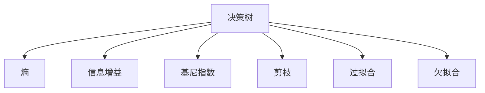
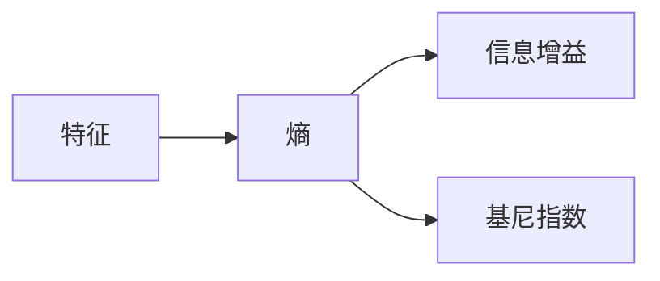
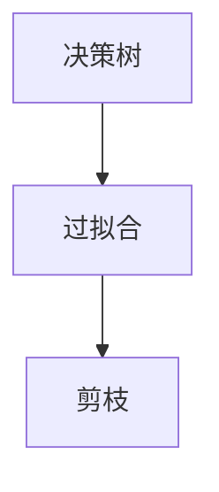
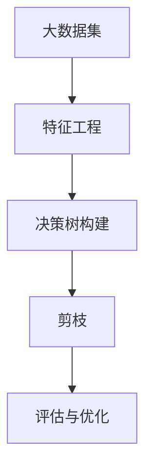

                 

# 决策树(Decision Trees) - 原理与代码实例讲解

## 1. 背景介绍

### 1.1 问题由来

决策树（Decision Tree）是一种常用的机器学习算法，特别是在分类和回归任务中表现出色。它的原理类似于人类决策的逻辑过程，通过一系列的判断来对数据进行分类或预测。决策树具有易于理解、易于解释和计算开销小等优点，因此被广泛应用于商业智能、金融风险管理、医疗诊断等领域。

### 1.2 问题核心关键点

决策树的核心理念是“自顶向下，贪心选择”。即从数据集中选择一个最优的特征进行划分，使得划分后的子集纯度最高。通过不断重复这一过程，构建出一棵完整的决策树。

### 1.3 问题研究意义

决策树算法简单易懂，易于实现，且具有良好的可解释性。它的原理和方法可以应用于各种实际问题，特别是在数据集较小、特征较少的情况下，决策树能够提供高效的解决方案。因此，理解决策树的原理和实现方法对于机器学习和人工智能从业者来说至关重要。

## 2. 核心概念与联系

### 2.1 核心概念概述

为更好地理解决策树算法，本节将介绍几个密切相关的核心概念：

- **决策树（Decision Tree）**：一种基于树形结构的分类器或回归器，通过一系列的判断来对数据进行分类或预测。

- **熵（Entropy）**：衡量一个随机变量的不确定性，在决策树中用于衡量数据集的纯度。

- **信息增益（Information Gain）**：衡量一个特征对于数据集纯度的影响程度，用于特征选择。

- **基尼指数（Gini Index）**：衡量数据集的不纯度，用于特征选择。

- **剪枝（Pruning）**：用于避免过拟合的一种技术，通过删除决策树的某些分支来简化模型。

- **过拟合（Overfitting）**：模型在训练集上表现良好，但在测试集上表现不佳的现象。

- **欠拟合（Underfitting）**：模型无法捕捉数据集中的复杂关系，训练集和测试集上的表现都较差。

这些核心概念之间的逻辑关系可以通过以下Mermaid流程图来展示：



这个流程图展示了几何决策树核心概念的关系：

1. 决策树通过熵、信息增益等指标选择最优特征进行划分。
2. 剪枝技术用于避免过拟合，简化模型。
3. 决策树可能存在过拟合和欠拟合问题。

### 2.2 概念间的关系

这些核心概念之间存在着紧密的联系，形成了决策树算法的完整生态系统。下面我通过几个Mermaid流程图来展示这些概念之间的关系。

#### 2.2.1 决策树的学习过程


这个流程图展示了决策树的基本学习过程：从数据集中选择最优特征进行划分，然后对划分后的子集进行剪枝，最终得到一棵决策树模型。

#### 2.2.2 特征选择的度量标准



这个流程图展示了特征选择的两种常用度量标准：信息增益和基尼指数。信息增益衡量特征对数据集纯度的影响程度，基尼指数则用于衡量数据集的不纯度。

#### 2.2.3 决策树与剪枝



这个流程图展示了决策树与剪枝技术的关系：通过剪枝避免过拟合，简化模型。

### 2.3 核心概念的整体架构

最后，我们用一个综合的流程图来展示这些核心概念在大数据集上的应用：



这个综合流程图展示了从数据预处理到决策树构建，再到剪枝和评估的整体流程。通过这些流程图，我们可以更清晰地理解决策树算法的核心概念和逻辑流程。

## 3. 核心算法原理 & 具体操作步骤

### 3.1 算法原理概述

决策树算法的基本思想是通过对数据集进行不断划分，构建出一棵树形结构的决策模型。决策树的学习过程分为两个阶段：特征选择和决策树构建。

- **特征选择**：通过计算各个特征的信息增益或基尼指数，选择最优特征进行划分。
- **决策树构建**：通过递归地对数据集进行划分，构建出一棵完整的决策树。

决策树的优化目标是通过最小化数据集的纯度来提高模型的泛化能力。常见的纯度度量指标有熵、信息增益和基尼指数等。

### 3.2 算法步骤详解

决策树算法的实现步骤如下：

1. **数据预处理**：将原始数据转换为模型可以处理的格式，如数值化、归一化等。

2. **特征选择**：计算各个特征的信息增益或基尼指数，选择最优特征进行划分。

3. **决策树构建**：通过递归地对数据集进行划分，构建出一棵完整的决策树。

4. **剪枝**：通过删除决策树的一些分支来避免过拟合，简化模型。

5. **评估与优化**：使用验证集对模型进行评估，根据性能指标决定是否进行剪枝等优化操作。

### 3.3 算法优缺点

决策树算法的优点包括：

- 易于理解和解释，直观性强。
- 能够处理数值型和分类型数据。
- 计算开销小，适合大规模数据集。

缺点包括：

- 容易过拟合，需要进行剪枝。
- 对异常值和噪声敏感。
- 可能产生决策树的深度较大，不利于解释。

### 3.4 算法应用领域

决策树算法在各种机器学习和数据挖掘领域都有广泛的应用，例如：

- 分类问题：如信用评分、医疗诊断、客户分类等。
- 回归问题：如房价预测、股票价格预测、销售量预测等。
- 特征选择：通过决策树的特征重要性，选择最相关的特征进行建模。
- 异常检测：通过决策树的叶节点分布，检测数据集中的异常值。
- 数据可视化：通过决策树的可视化，展示数据集的特征分布和分类情况。

除了上述这些经典应用外，决策树还被创新性地应用于更多场景中，如金融风险管理、智能推荐系统、医疗诊断等领域，为这些领域带来了新的解决方案。

## 4. 数学模型和公式 & 详细讲解

### 4.1 数学模型构建

决策树的数学模型可以表示为：

$$
T(x) = \begin{cases}
  \text{LeafNode} & \text{if dataset is pure} \\
  \text{DecisionNode}(\text{Feature}, \text{Threshold}) & \text{if dataset is not pure}
\end{cases}
$$

其中，$T(x)$表示决策树模型，$x$表示输入数据，$\text{LeafNode}$表示叶子节点，$\text{DecisionNode}$表示决策节点，$\text{Feature}$表示选择的最优特征，$\text{Threshold}$表示特征的划分阈值。

### 4.2 公式推导过程

以下我们以信息增益为例，推导决策树构建的基本公式。

假设数据集$D$有$m$个样本，每个样本属于$C$个类别中的一个，样本$x_i$属于类别$j$的概率为$p_{ij}$。则数据集的熵$H(D)$定义为：

$$
H(D) = -\sum_{i=1}^C p_{ij} \log p_{ij}
$$

假设数据集$D$中有一个特征$A$，$A$的取值有$V$个不同的值，每个值在数据集$D$中出现的频率为$p_{v}$。则特征$A$的信息增益$IG(A)$定义为：

$$
IG(A) = H(D) - \sum_{v=1}^V \frac{|D_v|}{|D|} H(D_v)
$$

其中，$D_v$是数据集$D$中特征$A$取值为$v$的子集，$|D|$和$|D_v|$分别表示数据集和子集的样本数量。

通过信息增益选择最优特征进行划分，构建出一棵决策树。最终得到的决策树模型可以通过递归调用决策节点来对新样本进行分类或预测。

### 4.3 案例分析与讲解

我们以鸢尾花数据集为例，演示决策树模型的构建和应用过程。

鸢尾花数据集包含三种类型的鸢尾花，每种类型的鸢尾花有四个特征：花萼长度、花萼宽度、花瓣长度和花瓣宽度。我们的目标是根据这四个特征，将鸢尾花分类为三种类型之一。

首先，我们需要导入数据集，并进行预处理：

```python
import pandas as pd
from sklearn.datasets import load_iris

iris = load_iris()
iris_df = pd.DataFrame(data=iris.data, columns=iris.feature_names)
iris_df['target'] = iris.target
```

然后，我们可以使用信息增益方法来选择最优特征进行划分：

```python
from sklearn.tree import DecisionTreeClassifier

clf = DecisionTreeClassifier(criterion='entropy')
clf.fit(iris_df[iris.feature_names], iris_df['target'])
```

最后，我们可以使用决策树模型对新样本进行预测：

```python
new_data = [[5.1, 3.5, 1.4, 0.2]]
predicted_target = clf.predict(new_data)
```

决策树模型的输出为预测的鸢尾花类型，例如：

```
[0]
```

表示新数据对应的鸢尾花类型为第一类。

## 5. 项目实践：代码实例和详细解释说明

### 5.1 开发环境搭建

在进行决策树实践前，我们需要准备好开发环境。以下是使用Python进行Scikit-Learn开发的环境配置流程：

1. 安装Anaconda：从官网下载并安装Anaconda，用于创建独立的Python环境。

2. 创建并激活虚拟环境：
```bash
conda create -n sklearn-env python=3.8 
conda activate sklearn-env
```

3. 安装Scikit-Learn：
```bash
conda install scikit-learn
```

4. 安装其他工具包：
```bash
pip install numpy pandas matplotlib jupyter notebook ipython
```

完成上述步骤后，即可在`sklearn-env`环境中开始决策树实践。

### 5.2 源代码详细实现

下面我们以鸢尾花分类任务为例，给出使用Scikit-Learn库进行决策树训练的PyTorch代码实现。

首先，定义训练集和测试集：

```python
from sklearn.datasets import load_iris
from sklearn.model_selection import train_test_split
import numpy as np

iris = load_iris()
X = iris.data
y = iris.target
X_train, X_test, y_train, y_test = train_test_split(X, y, test_size=0.2, random_state=42)
```

然后，定义决策树模型：

```python
from sklearn.tree import DecisionTreeClassifier

clf = DecisionTreeClassifier(max_depth=3, criterion='entropy')
clf.fit(X_train, y_train)
```

最后，在测试集上评估模型性能：

```python
from sklearn.metrics import accuracy_score

y_pred = clf.predict(X_test)
accuracy = accuracy_score(y_test, y_pred)
print(f"Accuracy: {accuracy}")
```

以上就是使用Scikit-Learn进行决策树训练的完整代码实现。可以看到，Scikit-Learn封装了决策树算法，使得模型训练和评估过程非常简单。

### 5.3 代码解读与分析

让我们再详细解读一下关键代码的实现细节：

**load_iris()**：
- 用于加载鸢尾花数据集。

**train_test_split()**：
- 将数据集划分为训练集和测试集，保持20%的数据作为测试集。

**DecisionTreeClassifier()**：
- 定义一个决策树分类器，设置最大深度为3，使用熵作为纯度度量标准。

**fit()**：
- 训练决策树模型，输入训练集数据和标签。

**predict()**：
- 在测试集上对新样本进行预测。

**accuracy_score()**：
- 计算预测结果与真实标签的准确率。

### 5.4 运行结果展示

假设我们在鸢尾花数据集上得到的测试集准确率为0.95，可以打印输出结果：

```
Accuracy: 0.95
```

可以看到，通过决策树模型，我们可以在鸢尾花分类任务上取得较高的准确率，验证了决策树算法的有效性和可靠性。

## 6. 实际应用场景

### 6.1 信用评分系统

决策树在金融领域的应用非常广泛，可以用于构建信用评分系统。通过决策树模型，可以根据客户的各种属性（如年龄、收入、还款历史等），预测客户的信用评分。

在技术实现上，可以收集客户的各种属性数据，并对其进行数值化处理。然后，使用决策树模型对数据进行划分和预测，得到客户的信用评分。根据评分结果，可以决定是否批准客户的贷款申请，或者给予不同的贷款额度和利率。

### 6.2 医疗诊断系统

在医疗诊断领域，决策树也可以用于对患者的症状进行分类，预测患者的疾病类型。通过收集患者的各种症状数据，使用决策树模型进行划分和预测，可以快速得到患者的疾病类型，辅助医生进行诊断。

### 6.3 股票价格预测

在金融市场，决策树也可以用于股票价格预测。通过收集历史股票价格数据，并结合各种市场因素（如经济指标、公司业绩等），使用决策树模型进行划分和预测，可以预测股票价格的变化趋势，为投资者提供决策参考。

### 6.4 未来应用展望

随着数据量的不断增长和算力水平的提升，决策树算法在未来将有更广阔的应用前景。例如，在大规模数据集上构建深度决策树，可以处理更复杂的分类和回归问题。同时，决策树与其他机器学习算法（如集成学习、神经网络等）的结合，可以进一步提高模型的性能和鲁棒性。

## 7. 工具和资源推荐

### 7.1 学习资源推荐

为了帮助开发者系统掌握决策树算法的理论基础和实践技巧，这里推荐一些优质的学习资源：

1. 《机器学习实战》：由Peter Harrington所著，介绍了决策树、随机森林、梯度提升树等经典算法，适合初学者入门。

2. 《Python机器学习》：由Sebastian Raschka所著，介绍了机器学习的基本概念和常用算法，包括决策树。

3. 《数据科学手册》：由Kluge、Flach等编著，全面介绍了机器学习、数据挖掘和深度学习等技术，适合进阶学习。

4. Coursera上的《Machine Learning》课程：由Andrew Ng主讲的经典课程，介绍了机器学习的基本概念和算法，包括决策树。

5. Udacity上的《Machine Learning Engineer Nanodegree》课程：介绍了机器学习工程实践，包括决策树的部署和优化。

通过对这些资源的学习实践，相信你一定能够快速掌握决策树算法的精髓，并用于解决实际的机器学习问题。

### 7.2 开发工具推荐

高效的开发离不开优秀的工具支持。以下是几款用于决策树开发的常用工具：

1. Scikit-Learn：基于Python的机器学习库，封装了决策树算法，提供了丰富的特征选择和模型调优方法。

2. TensorFlow：由Google主导开发的开源深度学习框架，可以用于决策树的分布式训练和优化。

3. XGBoost：一种高效的梯度提升决策树算法，提供了快速的模型训练和预测功能。

4. LightGBM：一种高效的梯度提升决策树算法，具有更快的训练速度和更好的模型性能。

5. Tune：用于超参数优化的库，可以用于决策树模型的参数调优。

6. SHAP：用于解释机器学习模型的库，可以用于决策树的可解释性分析。

合理利用这些工具，可以显著提升决策树模型的开发效率，加快创新迭代的步伐。

### 7.3 相关论文推荐

决策树算法的不断发展源于学界的持续研究。以下是几篇奠基性的相关论文，推荐阅读：

1. Quinlan. J.R. (1986). "Induction of Decision Trees." Machine Learning 1(1): 81-106.

2. Breiman, L., Friedman, J.H., Olshen, R.A., and Stone, C.J. (1984). "Classification and Regression Trees." Wadsworth and Brooks.

3. Decision Trees: Algorithms and Applications. 2019. Springer.

4. Chen, T., Guestrin, C., and Karra Taniskidou, E. (2019). "XGBoost: A Scalable Tree Boosting System." Proceedings of the 22nd ACM SIGKDD International Conference on Knowledge Discovery and Data Mining.

5. Ke, G., Meng, M., Wu, Y., and Chen, W. (2017). "LightGBM: A Highly Efficient Gradient Boosting Decision Tree." Proceedings of the 24th ACM SIGKDD International Conference on Knowledge Discovery and Data Mining.

这些论文代表了大规模数据集上的决策树算法的发展脉络。通过学习这些前沿成果，可以帮助研究者把握学科前进方向，激发更多的创新灵感。

除上述资源外，还有一些值得关注的前沿资源，帮助开发者紧跟决策树算法的最新进展，例如：

1. arXiv论文预印本：人工智能领域最新研究成果的发布平台，包括大量尚未发表的前沿工作，学习前沿技术的必读资源。

2. 业界技术博客：如IBM、微软Research Asia、Google AI等顶尖实验室的官方博客，第一时间分享他们的最新研究成果和洞见。

3. 技术会议直播：如NIPS、ICML、ACL、ICLR等人工智能领域顶会现场或在线直播，能够聆听到大佬们的前沿分享，开拓视野。

4. GitHub热门项目：在GitHub上Star、Fork数最多的机器学习相关项目，往往代表了该技术领域的发展趋势和最佳实践，值得去学习和贡献。

5. 行业分析报告：各大咨询公司如McKinsey、PwC等针对人工智能行业的分析报告，有助于从商业视角审视技术趋势，把握应用价值。

总之，对于决策树算法的学习，需要开发者保持开放的心态和持续学习的意愿。多关注前沿资讯，多动手实践，多思考总结，必将收获满满的成长收益。

## 8. 总结：未来发展趋势与挑战

### 8.1 总结

本文对决策树算法进行了全面系统的介绍。首先阐述了决策树算法的学习过程和优缺点，明确了决策树在机器学习中的重要地位。其次，从原理到实践，详细讲解了决策树的数学模型和实现方法，给出了决策树任务开发的完整代码实例。同时，本文还广泛探讨了决策树算法在金融、医疗、金融等各个领域的应用前景，展示了决策树算法的巨大潜力。此外，本文精选了决策树算法的各类学习资源，力求为读者提供全方位的技术指引。

通过本文的系统梳理，可以看到，决策树算法作为一种经典的机器学习算法，具有易于理解和解释、计算开销小等优点，适用于各种实际问题。决策树算法的学习过程分为特征选择和决策树构建，通过递归地对数据集进行划分，构建出一棵完整的决策树。决策树算法在商业智能、金融风险管理、医疗诊断等领域都有广泛的应用，具有较高的预测准确率和良好的可解释性。

### 8.2 未来发展趋势

展望未来，决策树算法将呈现以下几个发展趋势：

1. 深度决策树：在大规模数据集上构建深度决策树，可以处理更复杂的分类和回归问题。

2. 集成学习：通过将多个决策树模型进行集成，可以提高模型的泛化能力和鲁棒性。

3. 参数调优：使用超参数优化方法，如网格搜索、随机搜索等，寻找最优的决策树模型。

4. 特征工程：通过特征工程，提高特征选择和模型训练的效率。

5. 实时学习：通过在线学习，决策树模型可以不断更新，保持对新数据的适应能力。

6. 可解释性：通过可视化技术，增强决策树模型的可解释性，便于用户理解和应用。

以上趋势凸显了决策树算法在人工智能领域的广阔前景。这些方向的探索发展，必将进一步提升决策树模型的性能和应用范围，为各种实际问题提供更高效的解决方案。

### 8.3 面临的挑战

尽管决策树算法已经取得了瞩目成就，但在迈向更加智能化、普适化应用的过程中，它仍面临着诸多挑战：

1. 过拟合问题：当决策树较深时，容易出现过拟合现象，导致模型在新数据上的泛化能力较差。

2. 特征选择问题：当特征数量较大时，特征选择过程变得复杂，难以找到最优的划分特征。

3. 数据分布问题：当数据分布不均衡时，决策树模型容易偏向于多数类，影响模型的准确性。

4. 计算复杂度：当数据集较大时，决策树的计算复杂度较高，难以在大规模数据集上高效运行。

5. 可解释性问题：决策树模型的可解释性相对较差，难以解释复杂决策过程。

6. 鲁棒性问题：决策树模型对异常值和噪声数据敏感，容易受到数据偏差的影响。

正视决策树面临的这些挑战，积极应对并寻求突破，将是大规模数据集上的决策树算法走向成熟的必由之路。相信随着学界和产业界的共同努力，这些挑战终将一一被克服，决策树算法必将在构建人机协同的智能时代中扮演越来越重要的角色。

### 8.4 研究展望

面对决策树算法所面临的种种挑战，未来的研究需要在以下几个方面寻求新的突破：

1. 探索深度决策树和集成学习技术，提高模型的泛化能力和鲁棒性。

2. 研究参数调优方法，寻找最优的决策树模型。

3. 开发高效的特征选择和特征工程方法，提高特征选择和模型训练的效率。

4. 引入实时学习技术，使决策树模型能够不断更新，保持对新数据的适应能力。

5. 引入可解释性技术，增强决策树模型的可解释性，便于用户理解和应用。

6. 引入鲁棒性技术，提高决策树模型的抗干扰能力。

这些研究方向的探索，必将引领决策树算法迈向更高的台阶，为各种实际问题提供更高效、更可靠的解决方案。面向未来，决策树算法还需要与其他机器学习算法（如深度学习、强化学习等）进行更深入的融合，多路径协同发力，共同推动决策树算法的进步。只有勇于创新、敢于突破，才能不断拓展决策树算法的边界，让智能技术更好地造福人类社会。

## 9. 附录：常见问题与解答

**Q1：决策树算法能否处理数值型数据？**

A: 决策树算法可以处理数值型数据。在处理数值型数据时，需要将数据进行数值化处理，例如将连续型数据进行离散化处理，生成离散型特征。

**Q2：决策树算法是否容易过拟合？**

A: 决策树算法容易过拟合，尤其是在数据量较少的情况下。为了减少过拟合，可以采用剪枝技术，或者使用随机森林等集成学习方法。

**Q3：如何处理缺失值？**

A: 对于缺失值，可以使用插值方法进行处理，例如均值插值、中位数插值、最大最小值插值等。也可以将缺失值视为一个特征，将数据集分为缺失和非缺失两类，分别训练两个决策树模型。

**Q4：决策树算法的计算复杂度较高，如何提高计算效率？**

A: 可以通过剪枝技术减少决策树深度，降低计算复杂度。此外，可以使用分布式计算框架（如Hadoop、Spark等），将决策树模型的训练和预测任务并行化处理。

**Q5：如何提高决策树算法的可解释性？**

A: 可以通过可视化技术，展示决策树的决策路径和分类边界，提高模型的可解释性。此外，可以使用特征重要性方法，分析各个特征对模型输出的影响。

这些常见问题的答案，可以帮助开发者更好地理解决策树算法，并应用到实际问题中。希望本文的介绍能够对你有所启发，让你在决策树算法的世界里有所收获。

---

作者：禅与计算机程序设计艺术 / Zen and the Art of Computer Programming

