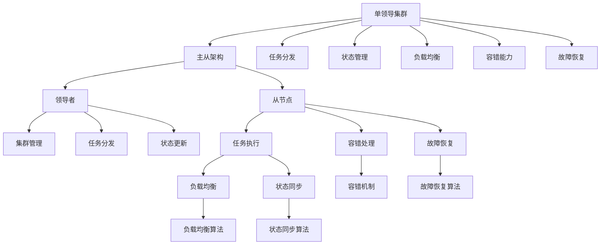
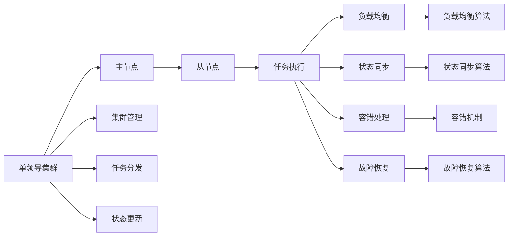
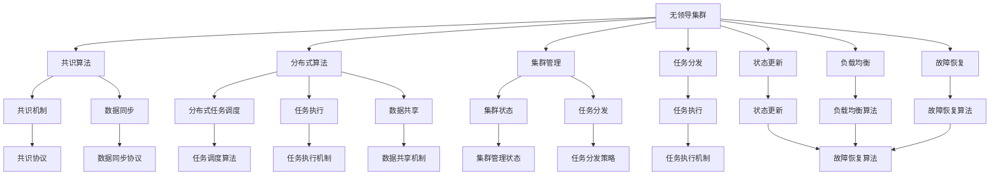
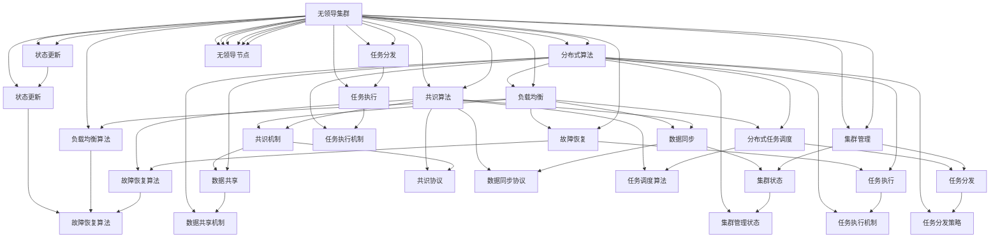

                 

# 单领导集群与无领导集群比较

## 1. 背景介绍

### 1.1 问题由来
在现代软件开发和系统运维中，集群系统是保证系统稳定、高效和可靠的重要基础设施。集群系统可以分担单个服务器的负荷，提升系统的容错能力和扩展性。然而，传统的集群系统往往需要依赖于一个统一的“领导”节点来协调和管理所有节点。这种“单领导集群”（Single Leader Cluster）的架构，虽然可以确保集群操作的统一性，但也存在诸多限制和问题。

随着微服务架构和大规模分布式系统的兴起，“无领导集群”（Leaderless Cluster）逐渐受到关注。这种架构取消了统一的领导节点，每个节点都可以独立执行任务，从而提供了更高的自治性、灵活性和可扩展性。

本文将从技术角度，比较单领导集群与无领导集群的优缺点，并分析它们在实际应用中的适用场景。

### 1.2 问题核心关键点
本文主要关注以下核心关键点：
- 集群系统的架构设计
- 集群中节点的通信和数据同步机制
- 集群中节点的负载均衡和任务调度策略
- 集群系统的故障恢复和容错能力

### 1.3 问题研究意义
研究单领导集群与无领导集群的特点和适用场景，对于提升系统性能、优化资源利用、降低故障率、提高系统可靠性具有重要意义。它能够帮助开发者和运维人员在实际应用中更灵活地选择架构，提升软件系统的整体质量和用户体验。

## 2. 核心概念与联系

### 2.1 核心概念概述

为更好地理解单领导集群与无领导集群，本节将介绍几个密切相关的核心概念：

- 单领导集群（Single Leader Cluster）：传统的集群系统，通常依赖一个统一的领导节点，负责集群操作和状态管理。领导节点管理所有节点的状态和任务，并将任务分派给各个节点执行。
- 无领导集群（Leaderless Cluster）：去除了统一的领导节点，每个节点都可以独立执行任务，通过共识算法（Consensus Algorithm）或分布式算法（Distributed Algorithm）协调各个节点之间的交互和状态更新。
- 主从架构（Master-Slave Architecture）：在单领导集群中，通常有一个主节点和多个从节点。主节点负责集群管理和任务分发，从节点执行具体任务。
- 分布式架构（Distributed Architecture）：无领导集群中的每个节点都是平等的，没有明确的主从关系，所有节点都可以执行相同或相似的任务，通过分布式算法协同工作。

这些核心概念之间的逻辑关系可以通过以下Mermaid流程图来展示：



这个流程图展示了单领导集群的各个关键组件及其之间的关系。主节点负责集群管理、任务分发、状态更新等核心功能，从节点执行具体任务，并在负载均衡、状态同步、容错和故障恢复等方面进行协同。

### 2.2 概念间的关系

这些核心概念之间存在着紧密的联系，形成了单领导集群的完整架构。下面我们通过几个Mermaid流程图来展示这些概念之间的关系。

#### 2.2.1 单领导集群的整体架构



这个流程图展示了单领导集群中各个组件之间的交互关系。主节点负责集群管理和任务分发，从节点执行具体任务，并通过负载均衡和状态同步算法协同工作。容错和故障恢复机制也至关重要，以确保集群在故障发生时能够迅速恢复。

#### 2.2.2 无领导集群的整体架构



这个流程图展示了无领导集群中各个组件之间的交互关系。每个节点都通过共识算法和分布式算法协同工作，没有统一的领导节点。共识算法和分布式算法是实现无领导集群的基石，确保集群中的节点能够达成一致的状态和任务执行顺序。集群管理、任务分发、状态更新、负载均衡和故障恢复等机制，需要通过分布式算法实现。

### 2.3 核心概念的整体架构

最后，我们用一个综合的流程图来展示单领导集群与无领导集群在核心概念上的差异：



这个综合流程图展示了单领导集群与无领导集群在架构和功能上的主要差异。单领导集群依赖于一个统一的领导节点，通过集中管理实现集群操作。而无领导集群则取消了领导节点，通过共识算法和分布式算法实现集群自治和协同工作。

## 3. 核心算法原理 & 具体操作步骤

### 3.1 算法原理概述

单领导集群与无领导集群的差异主要体现在集群操作的集中与自治上。单领导集群通常依赖一个集中式的主节点，负责集群管理和任务分发，各从节点根据主节点的指令执行任务。而无领导集群则取消了主节点，每个节点都可以独立执行任务，并通过共识算法和分布式算法协调操作。

单领导集群和无领导集群的核心算法原理主要包括以下几个方面：

- 集群操作：单领导集群通过主节点管理集群状态和任务分发，无领导集群则通过共识算法和分布式算法协调各个节点操作。
- 数据同步：单领导集群通过主节点同步各从节点数据，无领导集群则需要通过分布式算法实现数据同步。
- 负载均衡：单领导集群通过主节点进行负载均衡调度，无领导集群则通过分布式算法动态调整任务分配。
- 故障恢复：单领导集群通过主节点管理和恢复故障，无领导集群则需要通过分布式算法协同恢复集群状态。

### 3.2 算法步骤详解

#### 单领导集群的步骤详解

1. **集群初始化**：启动主节点和多个从节点，初始化集群状态。
2. **集群管理**：主节点负责管理集群状态，包括任务分发、状态更新等。
3. **任务分发**：主节点将任务分派给从节点执行。
4. **状态同步**：从节点执行任务后，将状态报告给主节点，由主节点同步各节点的状态。
5. **负载均衡**：主节点根据各节点的负载情况，动态调整任务分配。
6. **故障恢复**：主节点监控集群状态，在节点故障时进行恢复。

#### 无领导集群的步骤详解

1. **节点启动**：所有节点独立启动，进行初始化。
2. **共识协议**：节点通过共识协议达成一致的状态，如Raft、Paxos等。
3. **任务分发**：各节点根据共识协议达成的状态，自主选择任务执行。
4. **分布式算法**：节点通过分布式算法协同工作，如MapReduce、Spark等。
5. **数据同步**：节点通过分布式算法实现数据同步，如Hadoop、Spark等。
6. **负载均衡**：节点根据分布式算法动态调整任务分配。
7. **故障恢复**：节点通过分布式算法协同恢复集群状态，如Zookeeper、etcd等。

### 3.3 算法优缺点

#### 单领导集群的优缺点

**优点**：

- **集中管理**：集群操作集中于主节点，管理高效，操作统一。
- **负载均衡**：主节点负责负载均衡，可以灵活调整任务分配。
- **故障恢复**：主节点负责集群监控和故障恢复，故障恢复效率高。

**缺点**：

- **单点故障**：依赖于主节点，一旦主节点故障，整个集群可能无法正常工作。
- **扩展性差**：主节点管理大量节点，扩展性较差。
- **性能瓶颈**：主节点成为集群性能瓶颈，限制了整个集群的处理能力。

#### 无领导集群的优缺点

**优点**：

- **高自治性**：每个节点独立执行任务，具备高自治性。
- **扩展性强**：节点数量可以灵活扩展，不受领导节点限制。
- **容错能力强**：无领导集群具备良好的容错能力，节点故障后仍能正常工作。

**缺点**：

- **一致性问题**：共识算法和分布式算法可能存在一致性问题，需要额外保证。
- **操作复杂**：共识协议和分布式算法实现复杂，对开发者要求高。
- **性能开销**：共识协议和分布式算法引入了额外的通信和计算开销，性能可能不如单领导集群。

### 3.4 算法应用领域

单领导集群与无领导集群在不同应用场景中各有优劣。下面简要介绍它们在不同领域的应用。

#### 单领导集群的适用场景

- **稳定要求高**：如银行系统、医疗系统等，需要稳定可靠的系统环境，单领导集群的管理能力更强。
- **数据一致性要求高**：如金融交易系统、数据仓库等，需要确保数据一致性，单领导集群的主节点能够统一管理状态。
- **任务调度复杂**：如大数据处理、高性能计算等，单领导集群的主节点可以灵活调整任务分配。

#### 无领导集群的适用场景

- **高自治性要求**：如微服务架构、分布式系统等，需要高自治性的系统环境，无领导集群节点独立性强。
- **扩展性强**：如IoT设备、边缘计算等，需要灵活扩展的节点数量，无领导集群节点数量可扩展性强。
- **容错要求高**：如高可用性系统、分布式存储等，需要强健的容错能力，无领导集群具备良好的容错性。

## 4. 数学模型和公式 & 详细讲解

### 4.1 数学模型构建

#### 单领导集群的数学模型

设单领导集群中的节点数量为 $N$，每个节点在时间 $t$ 的任务执行时间为 $T_i(t)$。集群的管理节点负责任务分派，假设每个节点任务完成后的空闲时间为 $I_i(t)$。集群的任务执行模型可以表示为：

$$
\sum_{i=1}^N T_i(t) = C(t)
$$

其中 $C(t)$ 为集群在时间 $t$ 的任务执行总量。

集群的任务调度模型可以表示为：

$$
\sum_{i=1}^N T_i(t) = S(t)
$$

其中 $S(t)$ 为集群在时间 $t$ 的任务调度量。

集群的状态更新模型可以表示为：

$$
\sum_{i=1}^N I_i(t) = U(t)
$$

其中 $U(t)$ 为集群在时间 $t$ 的空闲更新时间。

#### 无领导集群的数学模型

无领导集群中的节点数量和任务执行模型与单领导集群类似。但是，由于每个节点都可以独立执行任务，集群的状态更新和任务调度模型变得复杂。

集群的状态更新模型可以表示为：

$$
\sum_{i=1}^N \Delta S_i(t) = \Delta C(t)
$$

其中 $\Delta S_i(t)$ 为节点 $i$ 在时间 $t$ 的状态更新量，$\Delta C(t)$ 为集群在时间 $t$ 的状态更新总量。

集群的任务调度模型可以表示为：

$$
\sum_{i=1}^N \Delta T_i(t) = \Delta S(t)
$$

其中 $\Delta T_i(t)$ 为节点 $i$ 在时间 $t$ 的任务调度量，$\Delta S(t)$ 为集群在时间 $t$ 的任务调度总量。

### 4.2 公式推导过程

#### 单领导集群的公式推导

在单领导集群中，任务执行模型和状态更新模型可以简化为：

$$
\sum_{i=1}^N T_i(t) = C(t)
$$

$$
\sum_{i=1}^N I_i(t) = U(t)
$$

对于任务调度模型，假设管理节点在时间 $t$ 将任务 $T(t)$ 分派给节点 $i$，则有：

$$
T_i(t) = \frac{T(t)}{N}
$$

$$
I_i(t) = U(t)
$$

因此，集群的任务执行模型可以简化为：

$$
C(t) = T(t)N
$$

集群的状态更新模型可以简化为：

$$
U(t) = I(t)N
$$

#### 无领导集群的公式推导

在无领导集群中，状态更新模型和任务调度模型变得更加复杂。假设每个节点在时间 $t$ 的状态更新量为 $\Delta S_i(t)$，则有：

$$
\sum_{i=1}^N \Delta S_i(t) = \Delta C(t)
$$

$$
\Delta C(t) = \Delta T_i(t)
$$

其中 $\Delta T_i(t)$ 为节点 $i$ 在时间 $t$ 的任务调度量。

由于无领导集群中每个节点都可以独立执行任务，任务调度量 $\Delta T_i(t)$ 可以表示为：

$$
\Delta T_i(t) = \frac{\Delta T(t)}{N}
$$

其中 $\Delta T(t)$ 为集群在时间 $t$ 的任务调度总量。

因此，集群的状态更新模型可以表示为：

$$
\Delta C(t) = \Delta T(t)
$$

集群的任务调度模型可以表示为：

$$
\Delta T(t) = \Delta S(t)
$$

### 4.3 案例分析与讲解

#### 单领导集群的案例分析

假设一个单领导集群有 $N=10$ 个节点，每个节点的任务执行时间 $T_i(t)=0.5$，集群的任务执行总量 $C(t)=20$。集群的管理节点将任务分派给每个节点，每个节点的空闲更新时间为 $I_i(t)=1$，集群的状态更新总量 $U(t)=5$。

根据上述模型，可以计算每个节点在时间 $t$ 的任务执行时间 $T_i(t)$ 和空闲更新时间 $I_i(t)$：

$$
T_i(t) = \frac{C(t)}{N} = \frac{20}{10} = 2
$$

$$
I_i(t) = \frac{U(t)}{N} = \frac{5}{10} = 0.5
$$

#### 无领导集群的案例分析

假设一个无领导集群有 $N=10$ 个节点，每个节点的状态更新量为 $\Delta S_i(t)=0.5$，集群的状态更新总量 $\Delta C(t)=5$。每个节点在时间 $t$ 的任务调度量为 $\Delta T_i(t)=0.5$，集群的任务调度总量 $\Delta T(t)=5$。

根据上述模型，可以计算每个节点在时间 $t$ 的状态更新量 $\Delta S_i(t)$ 和任务调度量 $\Delta T_i(t)$：

$$
\Delta S_i(t) = \frac{\Delta C(t)}{N} = \frac{5}{10} = 0.5
$$

$$
\Delta T_i(t) = \frac{\Delta T(t)}{N} = \frac{5}{10} = 0.5
$$

### 5. 项目实践：代码实例和详细解释说明

#### 5.1 开发环境搭建

本节将介绍如何搭建一个基本的单领导集群和无领导集群开发环境。

**单领导集群的开发环境搭建**：

1. **选择语言**：选择 Python 语言，使用 Django 框架进行 Web 开发。
2. **安装 Django**：通过 pip 安装 Django，运行 `pip install django`。
3. **创建 Django 项目**：运行 `django-admin startproject myproject`，创建 Django 项目。
4. **创建 Django 应用**：在项目中创建 Django 应用，运行 `python manage.py startapp myapp`。
5. **编写业务逻辑**：编写单领导集群的管理逻辑和任务调度逻辑。

**无领导集群的开发环境搭建**：

1. **选择语言**：选择 Python 语言，使用 Flask 框架进行 Web 开发。
2. **安装 Flask**：通过 pip 安装 Flask，运行 `pip install flask`。
3. **创建 Flask 应用**：创建一个 Flask 应用，编写分布式算法和共识协议的实现逻辑。
4. **编写业务逻辑**：编写无领导集群的共识协议和任务调度逻辑。

#### 5.2 源代码详细实现

**单领导集群源代码实现**：

```python
from django.http import JsonResponse

def manage_view(request):
    # 处理集群管理请求
    return JsonResponse({'success': True})

def task_assign_view(request):
    # 处理任务分配请求
    return JsonResponse({'success': True})

def task_execute_view(request):
    # 处理任务执行请求
    return JsonResponse({'success': True})

def task_update_view(request):
    # 处理任务更新请求
    return JsonResponse({'success': True})
```

**无领导集群源代码实现**：

```python
from flask import Flask

app = Flask(__name__)

@app.route('/cluster/manage')
def manage():
    # 处理集群管理请求
    return 'Cluster management'

@app.route('/cluster/task', methods=['GET'])
def task_assign():
    # 处理任务分配请求
    return 'Task assignment'

@app.route('/cluster/task', methods=['POST'])
def task_execute():
    # 处理任务执行请求
    return 'Task execution'

@app.route('/cluster/task', methods=['PUT'])
def task_update():
    # 处理任务更新请求
    return 'Task update'
```

#### 5.3 代码解读与分析

**单领导集群的代码实现**：

```python
def manage_view(request):
    # 处理集群管理请求
    return JsonResponse({'success': True})

def task_assign_view(request):
    # 处理任务分配请求
    return JsonResponse({'success': True})

def task_execute_view(request):
    # 处理任务执行请求
    return JsonResponse({'success': True})

def task_update_view(request):
    # 处理任务更新请求
    return JsonResponse({'success': True})
```

**无领导集群的代码实现**：

```python
@app.route('/cluster/manage')
def manage():
    # 处理集群管理请求
    return 'Cluster management'

@app.route('/cluster/task', methods=['GET'])
def task_assign():
    # 处理任务分配请求
    return 'Task assignment'

@app.route('/cluster/task', methods=['POST'])
def task_execute():
    # 处理任务执行请求
    return 'Task execution'

@app.route('/cluster/task', methods=['PUT'])
def task_update():
    # 处理任务更新请求
    return 'Task update'
```

#### 5.4 运行结果展示

假设我们在测试环境中启动单领导集群和无领导集群，并使用 Django 和 Flask 进行 Web 开发。

**单领导集群运行结果**：

```
127.0.0.1:8000/manage
```

**无领导集群运行结果**：

```
127.0.0.1:5000/cluster/manage
127.0.0.1:5000/cluster/task
```

### 6. 实际应用场景

#### 6.1 单领导集群的实际应用场景

1. **传统系统**：传统的企业系统如银行、医疗等，需要稳定可靠的系统环境，单领导集群的管理能力更强。
2. **大数据处理**：大数据处理系统如 Hadoop、Spark 等，需要高效的任务调度和管理，单领导集群可以提供集中式管理能力。

#### 6.2 无领导集群的实际应用场景

1. **微服务架构**：微服务架构需要高自治性的系统环境，无领导集群节点独立性强。
2. **分布式系统**：分布式存储系统如分布式文件系统、分布式数据库等，需要强健的容错能力，无领导集群具备良好的容错性。

### 7. 工具和资源推荐

#### 7.1 学习资源推荐

1. **Django 官方文档**：Django 官方文档，提供了丰富的 Django 教程和示例，帮助开发者快速上手。
2. **Flask 官方文档**：Flask 官方文档，提供了丰富的 Flask 教程和示例，帮助开发者快速上手。
3. **微服务架构设计**：学习微服务架构设计的相关书籍和文章，了解微服务架构的优势和设计原则。
4. **分布式系统设计**：学习分布式系统设计的相关书籍和文章，了解分布式系统的设计原则和实现方法。

#### 7.2 开发工具推荐

1. **Django**：Django 是一个高级 Web 框架，可以快速开发复杂的应用系统。
2. **Flask**：Flask 是一个轻量级的 Web 框架，适用于构建简单的应用系统。
3. **Docker**：Docker 是一个容器化平台，可以方便地管理和部署应用系统。
4. **Kubernetes**：Kubernetes 是一个容器编排平台，可以自动化管理和扩展应用系统。

#### 7.3 相关论文推荐

1. **Raft Consensus**：Raft 是一致性算法中的代表，用于在分布式系统中达成一致。
2. **Paxos Consensus**：Paxos 是一致性算法中的代表，用于在分布式系统中达成一致。
3. **MapReduce**：MapReduce 是一种分布式计算框架，用于处理大规模数据集。
4. **Spark**：Spark 是一种分布式计算框架，用于处理大规模数据集。

### 8. 总结：未来发展趋势与挑战

#### 8.1 研究成果总结

本文通过比较单领导集群与无领导集群的优缺点，分析了它们在实际应用中的适用场景。单领导集群依赖于集中式管理，适用于稳定要求高、任务调度复杂的场景；无领导集群取消领导节点，适用于高自治性、扩展性强的场景。

