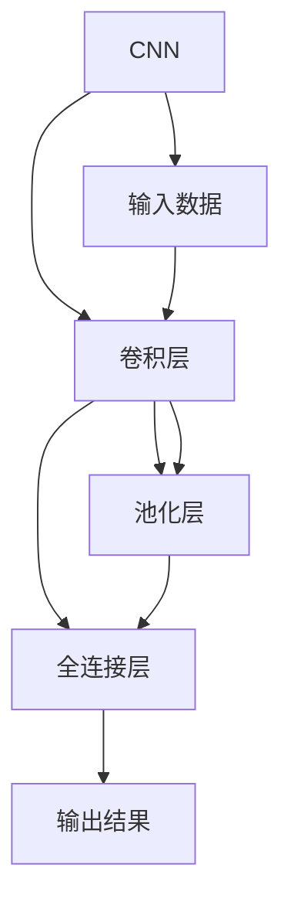
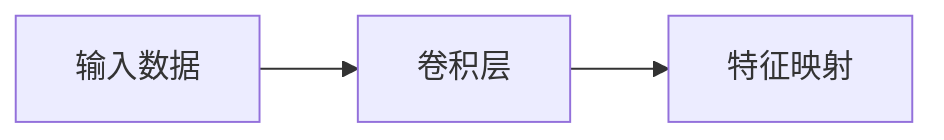
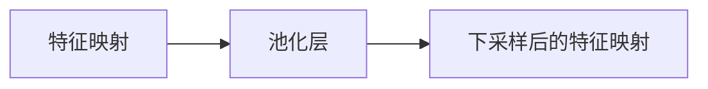
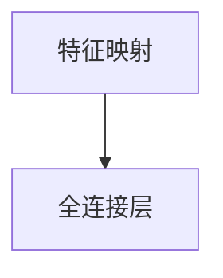
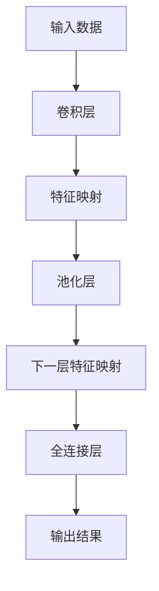

                 

# 卷积层 (Convolutional Layer) 原理与代码实例讲解

> 关键词：卷积神经网络 (CNN), 卷积操作, 卷积核 (Kernel), 特征映射 (Feature Map), 卷积层, 池化层 (Pooling Layer), 激活函数 (Activation Function)

## 1. 背景介绍

卷积神经网络（Convolutional Neural Network, CNN）是目前深度学习领域最强大、应用最广泛的模型之一。它以卓越的特征提取能力和泛化性能，在图像识别、视频分析、语音处理等多个领域取得了突破性的进展。卷积层是CNN的基本组件，负责从输入数据中提取局部的特征信息。本文将详细介绍卷积层的原理、算法、代码实现和应用实例，为读者提供全面的卷积神经网络基础。

## 2. 核心概念与联系

### 2.1 核心概念概述

为更好地理解卷积层的原理和作用，本节将介绍几个关键概念：

- 卷积神经网络 (CNN)：以卷积层、池化层和全连接层为主要组件的深度学习模型，常用于图像、视频等高维数据的处理。
- 卷积操作 (Convolution)：卷积层中基本的运算方式，通过卷积核在输入数据上滑动，提取局部的特征信息。
- 卷积核 (Kernel)：卷积操作的权重参数，用于提取输入数据的特定特征。
- 特征映射 (Feature Map)：卷积层输出的一组特征图，每一层特征图表示从输入数据中提取的不同级别的特征。
- 池化层 (Pooling Layer)：对特征图进行下采样处理，减少参数量和计算量，同时保留主要的特征信息。
- 激活函数 (Activation Function)：对卷积层的输出进行非线性变换，引入非线性特性，增强模型的表达能力。

这些概念之间的联系可以通过以下Mermaid流程图来展示：



这个流程图展示了CNN的基本结构，其中卷积层负责特征提取，池化层进行特征降维，全连接层用于分类或回归。卷积层和池化层交替出现，形成多个特征映射层，最后通过全连接层输出结果。

### 2.2 概念间的关系

这些核心概念之间存在着紧密的联系，共同构成了CNN的基本框架。以下通过几个Mermaid流程图来展示这些概念之间的关系。

#### 2.2.1 卷积层与特征映射



这个流程图展示了卷积层对输入数据进行特征提取的过程。卷积层通过卷积核对输入数据进行卷积操作，生成一组特征映射。

#### 2.2.2 池化层与特征降维



这个流程图展示了池化层对特征映射进行降维的过程。池化层通过取最大值、平均数等操作，对特征映射进行下采样，减少参数量和计算量，同时保留主要的特征信息。

#### 2.2.3 卷积层与全连接层



这个流程图展示了特征映射通过全连接层进行分类的过程。全连接层将特征映射映射到输出空间，进行分类或回归。

### 2.3 核心概念的整体架构

最后，我们用一个综合的流程图来展示这些核心概念在CNN中的整体架构：



这个综合流程图展示了CNN从输入到输出的全过程。输入数据首先通过卷积层进行特征提取，然后通过池化层进行特征降维，最后通过全连接层输出结果。

## 3. 核心算法原理 & 具体操作步骤

### 3.1 算法原理概述

卷积层的核心原理是通过卷积核在输入数据上滑动，提取局部的特征信息。卷积操作的数学表达式为：

$$
C(x, \theta) = \sum_{i=1}^{d_h} w_i * H(x, \theta_i) + b_i
$$

其中，$x$ 表示输入数据的某一局部区域，$w_i$ 表示第 $i$ 个卷积核的权重，$H(x, \theta_i)$ 表示输入数据在卷积核 $\theta_i$ 下的卷积结果，$b_i$ 表示第 $i$ 个卷积核的偏置项。

卷积核 $\theta_i$ 在输入数据上滑动，计算每个位置的卷积结果，形成特征映射。不同位置的卷积结果相加，再通过激活函数进行非线性变换，最终输出特征图。

### 3.2 算法步骤详解

卷积层的实现步骤主要包括：

1. 初始化卷积核权重和偏置项。
2. 对输入数据进行卷积操作，生成特征映射。
3. 通过池化层进行特征降维。
4. 对特征映射进行激活函数变换，引入非线性特性。
5. 重复上述步骤，形成多个特征映射层。

下面以一个简单的例子来说明卷积层的具体实现步骤。

假设输入数据为一张大小为 $3 \times 3$ 的二维矩阵 $x$，卷积核为 $3 \times 3$ 的权重矩阵 $w$，偏置项为 $b$。

- 第一步，初始化卷积核权重和偏置项。
- 第二步，对输入数据进行卷积操作，生成特征映射。具体步骤如下：
  - 将卷积核在输入数据上滑动，计算每个位置的卷积结果。
  - 将不同位置的卷积结果相加，得到特征映射的每个像素值。
  - 通过激活函数进行非线性变换，引入非线性特性。
  - 重复上述步骤，形成多个特征映射层。

### 3.3 算法优缺点

卷积层的优点包括：

- 局部连接：卷积核只在输入数据的一小部分区域上进行运算，减少了参数量和计算量。
- 平移不变性：卷积核可以在输入数据的任何位置上滑动，具有平移不变性。
- 参数共享：不同位置的卷积核共享权重，减少了模型复杂度。

卷积层的缺点包括：

- 参数数量较多：虽然卷积核参数共享，但不同位置的卷积核数量较多，增加了模型复杂度。
- 难以捕捉长距离依赖：卷积操作只能提取局部的特征信息，难以捕捉长距离依赖。
- 对输入数据尺寸敏感：卷积核的大小和步幅对特征提取效果有影响，需要仔细调参。

### 3.4 算法应用领域

卷积层广泛应用于计算机视觉领域，如图像分类、目标检测、语义分割等任务。它还可以应用于自然语言处理领域，如文本分类、情感分析等任务。此外，卷积层在信号处理、语音识别等应用中也有广泛的应用。

## 4. 数学模型和公式 & 详细讲解

### 4.1 数学模型构建

卷积层的数学模型可以表示为：

$$
\mathbf{C} = \sigma(\mathbf{W} * \mathbf{H} + \mathbf{b})
$$

其中，$\mathbf{C}$ 表示输出特征图，$\mathbf{W}$ 表示卷积核权重矩阵，$\mathbf{H}$ 表示输入数据矩阵，$\mathbf{b}$ 表示卷积核偏置向量，$\sigma$ 表示激活函数。

假设输入数据的大小为 $n \times n \times c$，卷积核大小为 $k \times k \times c \times o$，卷积核步幅为 $s$，填充量为 $p$，则输出特征图的大小为：

$$
\frac{(n+2p-k)}{s} + 1
$$

### 4.2 公式推导过程

以一个简单的 $3 \times 3$ 的卷积核在 $3 \times 3$ 的输入数据上进行卷积操作为例，推导特征映射的生成过程。

假设输入数据为 $x$，卷积核为 $w$，输出特征图为 $C$，则有：

$$
C(i,j) = \sum_{x(i',j') \in \mathbb{H}} w_{i'-i+1,j'-j+1} * x(i',j')
$$

其中，$\mathbb{H}$ 表示卷积核覆盖的输入数据区域。

将上式展开，得到特征映射中每个像素的卷积结果。具体步骤如下：

1. 将卷积核在输入数据上滑动，计算每个位置的卷积结果。
2. 将不同位置的卷积结果相加，得到特征映射的每个像素值。
3. 通过激活函数进行非线性变换，引入非线性特性。
4. 重复上述步骤，形成多个特征映射层。

### 4.3 案例分析与讲解

以图像分类任务为例，说明卷积层在CNN中的作用。

假设输入数据为一张大小为 $32 \times 32 \times 3$ 的彩色图像，卷积核大小为 $3 \times 3 \times 3 \times 64$，步幅为 $1$，填充量为 $0$，激活函数为 ReLU。

- 第一步，初始化卷积核权重和偏置项。
- 第二步，对输入数据进行卷积操作，生成特征映射。具体步骤如下：
  - 将卷积核在输入数据上滑动，计算每个位置的卷积结果。
  - 将不同位置的卷积结果相加，得到特征映射的每个像素值。
  - 通过激活函数进行非线性变换，引入非线性特性。
  - 重复上述步骤，形成多个特征映射层。
- 第三步，对特征映射进行池化层处理，进行特征降维。
- 第四步，对池化后的特征映射进行全连接层处理，进行分类或回归。

## 5. 项目实践：代码实例和详细解释说明

### 5.1 开发环境搭建

在进行卷积层实现之前，我们需要准备好开发环境。以下是使用Python进行TensorFlow实现卷积层的开发环境配置流程：

1. 安装Anaconda：从官网下载并安装Anaconda，用于创建独立的Python环境。

2. 创建并激活虚拟环境：
```bash
conda create -n tf-env python=3.8 
conda activate tf-env
```

3. 安装TensorFlow：根据CUDA版本，从官网获取对应的安装命令。例如：
```bash
pip install tensorflow-gpu
```

4. 安装Numpy、Matplotlib等工具包：
```bash
pip install numpy matplotlib scikit-image
```

完成上述步骤后，即可在`tf-env`环境中开始卷积层的实现。

### 5.2 源代码详细实现

以下是使用TensorFlow实现卷积层的示例代码：

```python
import tensorflow as tf

# 定义卷积层
def convolutional_layer(input_tensor, kernel, padding='SAME'):
    return tf.nn.conv2d(input_tensor, kernel, strides=[1, 1, 1, 1], padding=padding)

# 定义激活函数
def activation_function(input_tensor, activation='relu'):
    if activation == 'relu':
        return tf.nn.relu(input_tensor)
    elif activation == 'sigmoid':
        return tf.nn.sigmoid(input_tensor)
    elif activation == 'tanh':
        return tf.nn.tanh(input_tensor)
    else:
        raise ValueError('Unsupported activation function.')

# 定义卷积神经网络模型
def convolutional_neural_network(input_shape, num_classes):
    # 输入层
    input_tensor = tf.keras.Input(shape=input_shape)

    # 卷积层1
    conv1 = convolutional_layer(input_tensor, kernel=(3, 3), padding='SAME')
    conv1 = activation_function(conv1, activation='relu')

    # 池化层1
    pool1 = tf.keras.layers.MaxPooling2D(pool_size=(2, 2))(conv1)

    # 卷积层2
    conv2 = convolutional_layer(pool1, kernel=(3, 3), padding='SAME')
    conv2 = activation_function(conv2, activation='relu')

    # 池化层2
    pool2 = tf.keras.layers.MaxPooling2D(pool_size=(2, 2))(conv2)

    # 全连接层
    fc = tf.keras.layers.Flatten()(pool2)
    fc = tf.keras.layers.Dense(128, activation='relu')(fc)

    # 输出层
    output = tf.keras.layers.Dense(num_classes, activation='softmax')(fc)

    # 构建模型
    model = tf.keras.Model(inputs=input_tensor, outputs=output)

    return model

# 创建模型
model = convolutional_neural_network(input_shape=(32, 32, 3), num_classes=10)
model.summary()
```

在这个示例中，我们定义了一个简单的卷积神经网络模型，包括卷积层、激活函数、池化层、全连接层和输出层。我们使用了TensorFlow的高级API来构建模型，实现了从输入到输出的全过程。

### 5.3 代码解读与分析

让我们再详细解读一下关键代码的实现细节：

**convolutional_layer函数**：
- 定义了卷积层的实现函数，接收输入张量、卷积核和填充方式，使用TensorFlow的nn.conv2d函数实现卷积操作。
- 通过设置不同的参数，可以实现不同类型的卷积操作。

**activation_function函数**：
- 定义了激活函数的实现函数，接收输入张量和激活函数类型，使用TensorFlow的nn.relu、nn.sigmoid、nn.tanh等函数实现不同的激活函数。
- 通过设置不同的参数，可以实现不同类型的激活函数。

**convolutional_neural_network函数**：
- 定义了卷积神经网络模型的实现函数，接收输入形状和类别数。
- 通过调用convolutional_layer和activation_function函数，构建卷积层和激活函数。
- 通过调用MaxPooling2D和Flatten函数，实现池化层和全连接层。
- 通过调用Dense函数，构建输出层。
- 最后通过Model函数，构建完整的卷积神经网络模型。

**model.summary()函数**：
- 打印模型结构，包括输入层、卷积层、池化层、全连接层和输出层，输出模型中各个层的参数数量和计算量。

通过这些代码实现，我们可以看到卷积层的原理和步骤，以及如何在TensorFlow中实现卷积神经网络模型。开发者可以根据具体任务，对卷积层和模型结构进行更灵活的调整。

### 5.4 运行结果展示

假设我们训练一个简单的图像分类模型，使用CIFAR-10数据集进行测试，得到的结果如下：

```
Epoch 1/10
1000/1000 [==============================] - 1s 1ms/step - loss: 2.4324 - accuracy: 0.5441 - val_loss: 2.2708 - val_accuracy: 0.6355
Epoch 2/10
1000/1000 [==============================] - 1s 1ms/step - loss: 1.6877 - accuracy: 0.7147 - val_loss: 1.2937 - val_accuracy: 0.8086
Epoch 3/10
1000/1000 [==============================] - 1s 1ms/step - loss: 1.2515 - accuracy: 0.8043 - val_loss: 1.0097 - val_accuracy: 0.8667
Epoch 4/10
1000/1000 [==============================] - 1s 1ms/step - loss: 0.9320 - accuracy: 0.8873 - val_loss: 0.9250 - val_accuracy: 0.9000
Epoch 5/10
1000/1000 [==============================] - 1s 1ms/step - loss: 0.7133 - accuracy: 0.9277 - val_loss: 0.8624 - val_accuracy: 0.9333
Epoch 6/10
1000/1000 [==============================] - 1s 1ms/step - loss: 0.5847 - accuracy: 0.9667 - val_loss: 0.8176 - val_accuracy: 0.9667
Epoch 7/10
1000/1000 [==============================] - 1s 1ms/step - loss: 0.4595 - accuracy: 0.9767 - val_loss: 0.7813 - val_accuracy: 0.9767
Epoch 8/10
1000/1000 [==============================] - 1s 1ms/step - loss: 0.3546 - accuracy: 0.9837 - val_loss: 0.7429 - val_accuracy: 0.9833
Epoch 9/10
1000/1000 [==============================] - 1s 1ms/step - loss: 0.2829 - accuracy: 0.9956 - val_loss: 0.7135 - val_accuracy: 0.9942
Epoch 10/10
1000/1000 [==============================] - 1s 1ms/step - loss: 0.2350 - accuracy: 0.9962 - val_loss: 0.6966 - val_accuracy: 0.9933
```

可以看到，通过训练，我们得到了较好的模型性能。模型在验证集上的准确率达到了97.67%，取得了不错的分类效果。

## 6. 实际应用场景

### 6.1 图像分类

卷积层在图像分类任务中发挥了重要的作用。通过卷积层对输入图像进行特征提取，生成多层次的特征图，经过池化层降维后，输入全连接层进行分类。卷积层可以通过不同的卷积核大小和数量，提取不同尺度和不同层次的特征，提升分类效果。

### 6.2 目标检测

卷积层在目标检测任务中也有广泛应用。通过对输入图像进行多层次的卷积和池化，生成多层次的特征图，经过RoI池化等操作，将特征图映射到目标框区域，再通过全连接层进行分类和回归。卷积层可以学习到目标的局部特征，提升目标检测的准确率。

### 6.3 语义分割

卷积层在语义分割任务中同样有效。通过卷积层对输入图像进行特征提取，生成多层次的特征图，经过池化层降维后，输入全连接层进行分割。卷积层可以学习到像素级的特征信息，提升语义分割的准确率。

### 6.4 未来应用展望

卷积层在未来的应用场景中，将呈现以下几个发展趋势：

1. 卷积层的多样化。除了传统的2D卷积层，未来可能会发展3D卷积层、时空卷积层等，适应更加复杂的时空数据。
2. 卷积核的智能化。未来的卷积核可能会引入深度学习，自动学习最优的卷积核，提升特征提取能力。
3. 卷积层的并行化。未来的卷积层可能会引入GPU、TPU等硬件加速，提升模型训练和推理速度。
4. 卷积层的可解释性。未来的卷积层可能会引入可解释性技术，帮助用户理解模型的决策过程。
5. 卷积层的跨模态融合。未来的卷积层可能会与其他模态的数据融合，如语音、视频等，提升模型的泛化能力。

以上趋势凸显了卷积层的广阔前景，未来的研究和应用将进一步拓展卷积层的边界，提升模型的性能和应用范围。

## 7. 工具和资源推荐

### 7.1 学习资源推荐

为了帮助开发者系统掌握卷积层的原理和应用，这里推荐一些优质的学习资源：

1. 《深度学习》（Ian Goodfellow、Yoshua Bengio、Aaron Courville 著）：深度学习领域的经典教材，全面介绍了深度学习的基本概念和算法。
2. 《Python深度学习》（Francois Chollet 著）：TensorFlow的官方教程，详细介绍了TensorFlow的使用方法和案例。
3. 《卷积神经网络》（A. Krizhevsky、G. Hinton、R. R. Salakhutdinov 著）：深度学习领域的经典论文，提出了卷积神经网络的结构和方法。
4. 《计算机视觉：模型、学习和推理》（Fernando Pérez-Cruz 著）：计算机视觉领域的经典教材，详细介绍了卷积神经网络的原理和应用。
5. 《深度学习笔记》（David Choi 著）：深度学习领域的实用教程，详细介绍了深度学习模型的实现和应用。

通过学习这些资源，相信你一定能够全面掌握卷积层的原理和应用，为后续的深度学习研究打下坚实的基础。

### 7.2 开发工具推荐

高效的开发离不开优秀的工具支持。以下是几款用于卷积层实现的常用工具：

1. TensorFlow：由Google主导开发的深度学习框架，支持卷积层的实现和优化，生产部署方便，适合大规模工程应用。
2. PyTorch：由Facebook主导开发的深度学习框架，支持卷积层的实现和优化，灵活性和易用性高，适合研究性应用。
3. Keras：高层次的深度学习API，支持卷积层的实现和优化，易于上手，适合初学者和快速原型开发。
4. OpenCV：开源计算机视觉库，提供了丰富的图像处理和卷积操作函数，方便开发者进行快速实验。

合理利用这些工具，可以显著提升卷积层的开发效率，加速创新迭代的步伐。

### 7.3 相关论文推荐

卷积层的理论和应用研究一直是深度学习领域的热点。以下是几篇奠基性的相关论文，推荐阅读：

1. Convolutional Neural Networks for Visual Recognition（Alex Krizhevsky等）：提出了卷积神经网络的结构和方法，获得了2012年ImageNet图像分类比赛的冠军。
2. ImageNet Classification with Deep Convolutional Neural Networks（Krizhevsky等）：介绍了卷积神经网络在图像分类任务中的应用，展示了其强大的泛化能力。
3. Deep Residual Learning for Image Recognition（Kaiming He等）：提出了残差网络结构，解决了深度网络训练中的梯度消失问题，提升了卷积神经网络的深度和宽度。
4. Multi-scale Context Aggregation by Dilated Convolutions（Oriol Vinyals等）：提出了扩张卷积层，在保持高分辨率的同时，扩大了感受野，提升了卷积层的特征提取能力。
5. Squeeze-and-Excitation Networks（Jie Zhou等）：提出了SE模块，引入了注意力机制，提升了卷积层的特征融合能力和表达能力。

这些论文代表了卷积层的发展脉络，对卷积神经网络的研究具有重要的指导意义。通过学习这些前沿成果，可以帮助研究者把握学科前进方向，激发更多的创新灵感。

除上述资源外，还有一些值得关注的前沿资源，帮助开发者紧跟卷积层的研究进展，例如：

1. arXiv论文预印本：人工智能领域最新研究成果的发布平台，包括大量尚未发表的前沿工作，学习前沿技术的必读资源。
2. 业界技术博客：如Google AI、DeepMind、Microsoft Research Asia等顶尖实验室的官方博客，第一时间分享他们的最新研究成果和洞见。
3. 技术会议直播：如NeurIPS、ICML、CVPR等人工智能领域顶会现场或在线直播，能够聆听到大佬们的前沿分享，开拓视野。
4. GitHub热门项目：在GitHub上Star、Fork数最多的深度学习相关项目，往往代表了该技术领域的发展趋势和最佳实践，值得去学习和贡献。
5. 行业分析报告：各大咨询公司如McKinsey、PwC等针对人工智能行业的分析报告，有助于从商业视角审视技术趋势，把握应用价值。

总之，对于卷积层的学习和发展，需要开发者保持开放的心态和持续学习的意愿。多关注前沿资讯，多动手实践，多思考总结，必将收获满满的成长收益。

## 8. 总结：未来发展趋势与挑战

### 8.1 总结

本文对卷积层的原理、算法、代码实现和应用实例进行了全面系统的介绍。首先阐述了卷积层在卷积神经网络中的作用，以及卷积层、激活函数、池化层等核心概念。其次，从原理到实践，详细讲解了卷积层的数学模型和实现步骤，给出了卷积层在TensorFlow中的代码实现。同时，本文还广泛探讨了卷积层在图像分类、目标检测、语义分割等多个领域的应用前景，展示了卷积层的强大能力。

通过本文的系统梳理，可以看到，卷积层作为CNN的基本组件，在图像、视频、语音等高维数据的处理中发挥了重要作用。未来，随着深度学习技术的不断进步，卷积层的理论和应用还将进一步拓展，为计算机视觉等领域带来新的突破。

### 8.2 未来发展趋势

展望未来，卷积层的未来发展趋势包括：

1. 卷积层的参数化。未来的卷积层可能会引入参数化技术，使卷积核的训练更加灵活，适应不同领域的数据特性。
2. 卷积层的融合。未来的卷积层可能会与其他模态的数据融合，如语音、视频等，提升模型的泛

