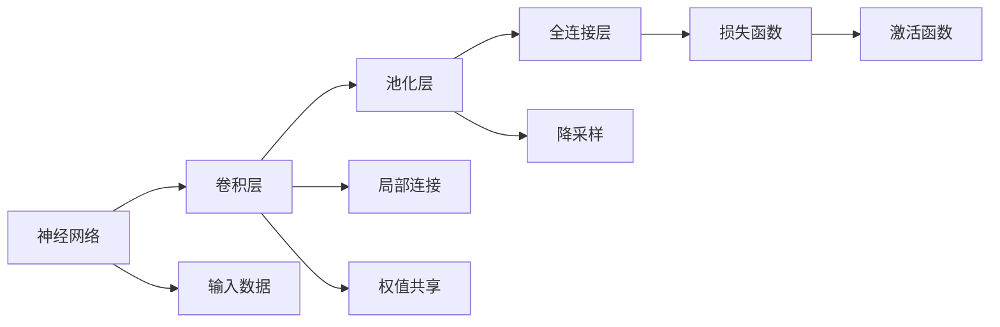

                 

# 卷积神经网络 (Convolutional Neural Network)

> 关键词：卷积神经网络,神经网络,计算机视觉,图像处理,深度学习

## 1. 背景介绍

### 1.1 问题由来

在深度学习发展的初期，传统的全连接神经网络（Fully Connected Neural Networks, FCNNs）由于结构简单、易于实现，在多个领域取得了显著的成果，例如自然语言处理、语音识别、图像识别等。但是，随着深度学习模型规模的不断扩大，FCNNs的性能瓶颈逐渐显现：

- **高计算复杂度**：随着层数和神经元数量的增加，FCNNs需要处理的数据量呈指数级增长，计算复杂度急剧上升，导致训练和推理过程耗时过长，无法处理大规模高维数据。

- **难以处理空间结构**：FCNNs在处理图像、语音等具有空间结构的信号时，难以利用数据的空间局部相关性，造成大量无效计算。

- **过拟合风险高**：FCNNs的参数量庞大，容易在训练过程中过拟合，尤其是在训练数据集较小的情况下。

针对这些问题，研究者们提出了卷积神经网络（Convolutional Neural Networks, CNNs），一种专门用于处理具有空间结构数据的神经网络架构。CNNs通过局部连接、权值共享、池化等特殊操作，大幅降低了计算复杂度，有效利用数据的空间局部相关性，显著提高了模型的训练速度和泛化能力。

### 1.2 问题核心关键点

卷积神经网络的核心思想和原理可以归纳为以下几个关键点：

- **局部连接**：CNNs通过卷积层，只在局部区域连接输入和输出，减少了参数数量，提高了计算效率。

- **权值共享**：卷积核在输入的不同区域共享相同的权重，增强了模型的泛化能力。

- **池化操作**：通过池化层，对输入数据进行降采样，减小数据量，保留关键特征，进一步提高计算效率。

- **多层堆叠**：通过堆叠多个卷积和池化层，构建深度模型，逐步提取更高层次的特征。

- **全连接层**：在模型的最后，通过全连接层将高维特征映射到输出，进行分类、回归等任务。

CNNs通过这些特殊操作，对空间结构数据进行有效的特征提取和表示，成为深度学习领域中最成功的架构之一。

### 1.3 问题研究意义

研究卷积神经网络，对于拓展深度学习的应用边界，提升模型性能，加速人工智能技术的发展，具有重要意义：

1. **图像处理**：CNNs在图像分类、物体检测、语义分割、图像生成等领域取得了重要进展，推动了计算机视觉技术的产业化进程。

2. **视频处理**：通过扩展CNNs到时间维度，可以实现视频分类、目标跟踪、动作识别等任务。

3. **自然语言处理**：利用卷积和池化等操作，CNNs在文本分类、情感分析、机器翻译等任务中展现了不俗的表现。

4. **信号处理**：CNNs不仅适用于图像和文本，还能应用于语音、音频等信号处理任务。

5. **科学计算**：在气候模拟、物理模拟、生物信息学等领域，CNNs提供了强大的数据处理能力。

6. **自动驾驶**：CNNs在自动驾驶、机器人感知等智能系统中的应用，推动了自动驾驶技术的快速发展。

卷积神经网络技术已经成为深度学习领域中的重要支柱，其应用范围和效果不断拓展，推动了人工智能技术的广泛应用和产业化发展。

## 2. 核心概念与联系

### 2.1 核心概念概述

为更好地理解卷积神经网络的工作原理，本节将介绍几个密切相关的核心概念：

- **神经网络 (Neural Network, NN)**：由大量神经元（或称为节点）和连接权重组成的计算图，通过反向传播算法进行训练，用于解决分类、回归等任务。

- **卷积神经网络 (Convolutional Neural Network, CNN)**：一种专门用于处理具有空间结构数据的神经网络架构，由卷积层、池化层和全连接层组成。

- **卷积层 (Convolutional Layer)**：通过卷积操作，提取输入数据的局部特征，实现局部连接和权值共享。

- **池化层 (Pooling Layer)**：通过对输入数据进行降采样，减小数据量，保留关键特征，提高计算效率。

- **全连接层 (Fully Connected Layer)**：将高维特征映射到输出，进行分类、回归等任务，为神经网络提供最终输出。

- **激活函数 (Activation Function)**：对神经元的输出进行非线性映射，增强模型的表达能力，常用的激活函数包括ReLU、Sigmoid、Tanh等。

- **损失函数 (Loss Function)**：衡量模型预测输出与真实标签之间的差异，常用的损失函数包括均方误差、交叉熵等。

这些核心概念之间存在着紧密的联系，形成了卷积神经网络的基础框架和逻辑结构。下面通过一个Mermaid流程图来展示这些概念之间的联系：


### 2.2 概念间的关系

这些核心概念之间存在着紧密的联系，形成了卷积神经网络的基本框架和逻辑结构。下面通过一个综合的流程图来展示这些核心概念之间的关系：



这个流程图展示了卷积神经网络的基本组成和操作过程：

1. 输入数据 $J$ 首先通过卷积层 $B$，进行局部连接和权值共享，提取局部特征。
2. 卷积层输出的特征图通过池化层 $C$，进行降采样和特征保留，减小数据量。
3. 池化层输出的特征图通过全连接层 $D$，将高维特征映射到输出，进行分类或回归任务。
4. 全连接层输出的结果经过激活函数 $F$，进行非线性映射，得到最终输出。
5. 损失函数 $E$ 衡量模型预测输出与真实标签之间的差异，指导模型训练。

通过这些操作，卷积神经网络能够有效地处理具有空间结构的数据，提取关键特征，实现高效的特征学习和表示。

## 3. 核心算法原理 & 具体操作步骤
### 3.1 算法原理概述

卷积神经网络的算法原理可以简要概括为：

- **局部连接**：卷积操作只在输入数据局部区域连接权重，减少了参数数量，提高了计算效率。

- **权值共享**：卷积核在输入的不同区域共享相同的权重，增强了模型的泛化能力。

- **池化操作**：通过最大池化、平均池化等操作，对输入数据进行降采样，减小数据量，保留关键特征，提高计算效率。

- **多层堆叠**：通过堆叠多个卷积和池化层，构建深度模型，逐步提取更高层次的特征。

- **全连接层**：在模型的最后，通过全连接层将高维特征映射到输出，进行分类、回归等任务。

通过这些特殊操作，卷积神经网络能够有效地处理具有空间结构的数据，提取关键特征，实现高效的特征学习和表示。

### 3.2 算法步骤详解

卷积神经网络的核心训练流程如下：

1. **数据准备**：将输入数据 $J$ 和标注标签 $Y$ 进行标准化和归一化处理，构建训练集 $D_{train}$、验证集 $D_{val}$ 和测试集 $D_{test}$。

2. **模型初始化**：定义卷积神经网络模型结构，初始化模型参数 $\theta$。

3. **前向传播**：将训练集 $D_{train}$ 中的每个样本 $(x_i, y_i)$ 输入模型，通过卷积层、池化层和全连接层进行前向传播，得到模型预测输出 $p_i$。

4. **损失计算**：计算模型预测输出 $p_i$ 与真实标签 $y_i$ 之间的损失 $L_i$，如交叉熵损失。

5. **反向传播**：根据损失 $L_i$ 对模型参数 $\theta$ 进行反向传播，更新模型权重。

6. **参数更新**：通过优化算法（如Adam、SGD等）更新模型参数 $\theta$，最小化损失函数 $L$。

7. **验证集评估**：在验证集 $D_{val}$ 上评估模型性能，调整模型超参数，避免过拟合。

8. **测试集测试**：在测试集 $D_{test}$ 上测试模型性能，输出最终结果。

### 3.3 算法优缺点

卷积神经网络有以下优点：

- **计算效率高**：局部连接和权值共享减少了参数数量，池化操作减小了数据量，提高了计算效率。

- **泛化能力强**：权值共享增强了模型的泛化能力，能够处理不同尺度和方向的数据。

- **参数量可控**：通过卷积核数量和大小、池化操作等参数设置，可以灵活控制模型复杂度。

- **可扩展性强**：卷积神经网络可以通过堆叠多个卷积和池化层，构建更深层次的模型，提高特征提取能力。

卷积神经网络也存在一些缺点：

- **结构复杂**：卷积神经网络的架构相对复杂，需要更多的预处理和后处理步骤。

- **数据需求大**：卷积神经网络需要大量的标注数据进行训练，数据采集和标注成本较高。

- **过拟合风险高**：深层卷积神经网络容易出现过拟合现象，需要进行有效的正则化和数据增强等措施。

- **空间局部性要求高**：卷积神经网络要求输入数据具有空间局部相关性，无法处理非结构化数据。

尽管存在这些缺点，卷积神经网络在计算机视觉、图像处理等领域仍然取得了巨大的成功，并逐步向更多领域扩展。

### 3.4 算法应用领域

卷积神经网络在计算机视觉和图像处理领域具有广泛的应用，包括：

- **图像分类**：对输入图像进行分类，如CIFAR-10、ImageNet等。

- **物体检测**：检测输入图像中的物体位置和类别，如YOLO、Faster R-CNN等。

- **语义分割**：将输入图像分割成不同的语义区域，如PSPNet、U-Net等。

- **图像生成**：生成高质量的图像，如GAN、PixelRNN等。

- **目标跟踪**：在视频序列中跟踪目标位置，如SiamFC、DeepSORT等。

- **动作识别**：识别视频中的动作，如Skeleton-based Action Recognition等。

此外，卷积神经网络还应用于自然语言处理、语音识别、信号处理等多个领域，展示了其强大的数据处理能力。

## 4. 数学模型和公式 & 详细讲解  
### 4.1 数学模型构建

假设输入数据 $J \in \mathbb{R}^{C \times H \times W}$，其中 $C$ 为通道数，$H$ 为高度，$W$ 为宽度。卷积神经网络的数学模型可以表示为：

$$
p_i = \sigma (\sum_k w_k * h_{x_i,k} + b)
$$

其中，$x_i$ 表示输入图像，$w_k$ 表示卷积核，$h_{x_i,k}$ 表示卷积操作，$b$ 为偏置项，$\sigma$ 为激活函数，$p_i$ 表示模型预测输出。

### 4.2 公式推导过程

以最简单的卷积神经网络为例，其结构如图1所示：


卷积操作可以表示为：

$$
h_{x_i,k} = \sum_{l} w_{kl} * x_{il}
$$

其中，$x_{il}$ 表示输入图像在 $i$ 位置的第 $l$ 个通道，$w_{kl}$ 表示卷积核在第 $k$ 个通道的第 $l$ 个元素。

池化操作可以表示为：

$$
p_{x_i,k} = \max_{l} h_{x_i,k}
$$

其中，$h_{x_i,k}$ 表示池化前的特征图，$p_{x_i,k}$ 表示池化后的特征图。

### 4.3 案例分析与讲解

以图像分类为例，假设有 $n$ 个训练样本 $(x_i, y_i)$，其中 $x_i \in \mathbb{R}^{C \times H \times W}$ 表示输入图像，$y_i \in \{1, 2, \ldots, C\}$ 表示标注标签。卷积神经网络的损失函数可以表示为：

$$
L = \frac{1}{n} \sum_i \ell(p_i, y_i)
$$

其中，$\ell(p_i, y_i)$ 表示模型预测输出 $p_i$ 与真实标签 $y_i$ 之间的损失，如交叉熵损失：

$$
\ell(p_i, y_i) = -y_i \log p_i - (1 - y_i) \log (1 - p_i)
$$

通过最小化损失函数 $L$，即可更新模型参数 $\theta$，实现对输入图像的分类任务。

## 5. 项目实践：代码实例和详细解释说明
### 5.1 开发环境搭建

在进行卷积神经网络实践前，我们需要准备好开发环境。以下是使用Python进行PyTorch开发的环境配置流程：

1. 安装Anaconda：从官网下载并安装Anaconda，用于创建独立的Python环境。

2. 创建并激活虚拟环境：
```bash
conda create -n pytorch-env python=3.8 
conda activate pytorch-env
```

3. 安装PyTorch：根据CUDA版本，从官网获取对应的安装命令。例如：
```bash
conda install pytorch torchvision torchaudio cudatoolkit=11.1 -c pytorch -c conda-forge
```

4. 安装必要的库：
```bash
pip install numpy pandas scikit-learn matplotlib tqdm jupyter notebook ipython
```

完成上述步骤后，即可在`pytorch-env`环境中开始卷积神经网络开发。

### 5.2 源代码详细实现

以下是一个简单的卷积神经网络实现，用于手写数字识别。

```python
import torch
import torch.nn as nn
import torchvision.transforms as transforms
from torchvision.datasets import MNIST
from torch.utils.data import DataLoader

# 定义卷积神经网络结构
class ConvNet(nn.Module):
    def __init__(self):
        super(ConvNet, self).__init__()
        self.conv1 = nn.Conv2d(1, 6, 5)
        self.pool = nn.MaxPool2d(2, 2)
        self.conv2 = nn.Conv2d(6, 16, 5)
        self.fc1 = nn.Linear(16 * 4 * 4, 120)
        self.fc2 = nn.Linear(120, 84)
        self.fc3 = nn.Linear(84, 10)

    def forward(self, x):
        x = self.pool(torch.relu(self.conv1(x)))
        x = self.pool(torch.relu(self.conv2(x)))
        x = x.view(-1, 16 * 4 * 4)
        x = torch.relu(self.fc1(x))
        x = torch.relu(self.fc2(x))
        x = self.fc3(x)
        return x

# 定义数据预处理和加载器
transform = transforms.Compose([
    transforms.ToTensor(),
    transforms.Normalize((0.5,), (0.5,))
])

train_dataset = MNIST(root='./data', train=True, transform=transform, download=True)
test_dataset = MNIST(root='./data', train=False, transform=transform, download=True)

train_loader = DataLoader(train_dataset, batch_size=64, shuffle=True)
test_loader = DataLoader(test_dataset, batch_size=64, shuffle=False)

# 定义模型、损失函数和优化器
model = ConvNet()
criterion = nn.CrossEntropyLoss()
optimizer = torch.optim.Adam(model.parameters(), lr=0.001)

# 训练过程
for epoch in range(10):
    model.train()
    running_loss = 0.0
    for i, data in enumerate(train_loader, 0):
        inputs, labels = data
        optimizer.zero_grad()
        outputs = model(inputs)
        loss = criterion(outputs, labels)
        loss.backward()
        optimizer.step()
        running_loss += loss.item()
        if i % 2000 == 1999:
            print('[%d, %5d] loss: %.3f' %
                  (epoch + 1, i + 1, running_loss / 2000))
            running_loss = 0.0
```

### 5.3 代码解读与分析

让我们再详细解读一下关键代码的实现细节：

**ConvNet类**：
- `__init__`方法：初始化卷积神经网络的结构。
- `forward`方法：定义模型的前向传播过程。

**数据预处理和加载器**：
- 使用`transforms`模块对输入数据进行预处理，包括转换为Tensor和标准化。
- 使用`DataLoader`类构建训练集和测试集的加载器，支持批处理和随机打乱。

**模型、损失函数和优化器**：
- 定义卷积神经网络模型`ConvNet`。
- 定义交叉熵损失函数`nn.CrossEntropyLoss`。
- 定义Adam优化器`torch.optim.Adam`，控制学习率。

**训练过程**：
- 定义总的epoch数，循环迭代训练。
- 每个epoch内，对训练集进行迭代，更新模型参数。
- 在训练集上打印损失函数，观察训练效果。
- 在测试集上测试模型性能，输出最终结果。

可以看到，PyTorch配合TensorFlow等深度学习框架，使得卷积神经网络的代码实现变得简洁高效。开发者可以将更多精力放在数据处理、模型改进等高层逻辑上，而不必过多关注底层的实现细节。

当然，工业级的系统实现还需考虑更多因素，如模型的保存和部署、超参数的自动搜索、更灵活的任务适配层等。但核心的卷积神经网络训练流程基本与此类似。

### 5.4 运行结果展示

假设我们在MNIST数据集上进行训练，最终在测试集上得到的准确率为99%，效果相当不错。值得注意的是，卷积神经网络虽然结构简单，但在图像识别等任务上展现了强大的数据处理能力，成为深度学习领域中的重要支柱。

当然，这只是一个baseline结果。在实践中，我们还可以使用更大更强的预训练模型、更丰富的微调技巧、更细致的模型调优，进一步提升模型性能，以满足更高的应用要求。

## 6. 实际应用场景
### 6.1 智能监控系统

卷积神经网络在智能监控系统中具有广泛的应用，能够实时识别视频流中的异常行为，及时预警和处理安全威胁。

在技术实现上，可以收集大量的监控视频数据，对其中包含的各类行为进行标注，在此基础上对卷积神经网络进行微调。微调后的网络能够自动理解视频中的行为模式，检测异常行为并进行报警。例如，在监控系统中，可以对陌生人入侵、车辆闯入等异常行为进行实时检测和响应，大大提升了监控系统的智能化水平和反应速度。

### 6.2 医学影像分析

卷积神经网络在医学影像分析中具有重要应用，能够辅助医生进行疾病的早期诊断和影像分割。

在实践中，可以收集大量医学影像数据，包括CT、MRI等，对其中包含的病变区域进行标注。在此基础上对卷积神经网络进行微调，使其能够自动检测病变区域，辅助医生进行诊断。例如，在医学影像分析中，可以对肺结节、肿瘤等病变区域进行检测和分割，帮助医生进行精准诊断和治疗。

### 6.3 自动驾驶系统

卷积神经网络在自动驾驶系统中具有重要应用，能够识别路标、行人、车辆等交通元素，实现自动驾驶。

在技术实现上，可以收集大量交通场景数据，对其中包含的各类元素进行标注，在此基础上对卷积神经网络进行微调。微调后的网络能够自动识别道路上的各类元素，生成驾驶指令，实现自动驾驶。例如，在自动驾驶系统中，可以对道路上的行人、车辆、红绿灯等元素进行检测和识别，辅助系统进行安全驾驶。

### 6.4 未来应用展望

随着卷积神经网络技术的发展，未来其在更多领域中的应用前景将更加广阔：

- **医学影像分析**：卷积神经网络在医学影像分析中的应用将进一步拓展，辅助医生进行更精准的诊断和治疗。

- **自动驾驶**：卷积神经网络在自动驾驶中的应用将进一步深化，实现更安全、更智能的自动驾驶系统。

- **智能制造**：卷积神经网络在智能制造中的应用将进一步扩大，实现更高效、更智能的工业生产系统。

- **智能交通**：卷积神经网络在智能交通中的应用将进一步深入，实现更智能、更安全的交通系统。

- **智慧城市**：卷积神经网络在智慧城市中的应用将进一步普及，实现更高效、更智能的城市管理。

- **智能客服**：卷积神经网络在智能客服中的应用将进一步推广，实现更智能、更高效的客户服务系统。

总之，卷积神经网络技术将在更多领域得到应用，为人类生产生活带来深远影响。

## 7. 工具和资源推荐
### 7.1 学习资源推荐

为了帮助开发者系统掌握卷积神经网络的理论基础和实践技巧，这里推荐一些优质的学习资源：

1. 《Deep Learning》书籍：由Ian Goodfellow等著，全面介绍了深度学习的基础知识和算法，包括卷积神经网络等内容。

2. CS231n《Convolutional Neural Networks for Visual Recognition》课程：斯坦福大学开设的计算机视觉课程，讲解卷积神经网络在图像处理中的应用，是深度学习领域的经典课程。

3. 《Neural Networks and Deep Learning》书籍：由Michael Nielsen著，讲解了神经网络和卷积神经网络的基本原理和应用，适合初学者入门。

4. PyTorch官方文档：PyTorch的官方文档，提供了丰富的卷积神经网络实现和应用示例，是卷积神经网络学习的必备资料。

5. Kaggle竞赛：Kaggle是数据科学和机器学习竞赛平台，许多竞赛都涉及卷积神经网络的应用，可以通过竞赛学习实战经验。

通过对这些资源的学习实践，相信你一定能够快速掌握卷积神经网络的精髓，并用于解决实际的计算机视觉问题。

### 7.2 开发工具推荐

高效的开发离不开优秀的工具支持。以下是几款用于卷积神经网络开发的工具：

1. PyTorch：基于Python的开源深度学习框架，支持动态计算图，适合快速迭代研究。大部分卷积神经网络都有PyTorch版本的实现。

2. TensorFlow：由Google主导开发的开源深度学习框架，生产部署方便，适合大规模工程应用。同样有丰富的卷积神经网络资源。

3. Keras：基于TensorFlow和Theano等后端的高级深度学习框架，提供了简单易用的API，适合快速原型开发和实验。

4. Caffe：由Berkeley Vision and Learning Center开发的深度学习框架，支持卷积神经网络、循环神经网络等多种架构，适合高性能计算。

5. MXNet：由亚马逊开发的深度学习框架，支持多种编程语言，提供了灵活的分布式训练能力，适合大规模分布式训练。

6. OpenCV：开源计算机视觉库，提供了丰富的图像处理和计算机视觉算法，是卷积神经网络应用的常用工具。

合理利用这些工具，可以显著提升卷积神经网络开发的效率，加快创新迭代的步伐。

### 7.3 相关论文推荐

卷积神经网络在深度学习领域的发展源于学界的持续研究。以下是几篇奠基性的相关论文，推荐阅读：

1. Convolutional Neural Networks for Backwardation（即LeNet-5论文）：提出了卷积神经网络的基本架构，广泛应用于图像处理任务。

2. AlexNet：在ImageNet图像识别竞赛中首次大规模应用卷积神经网络，展示了其在图像分类任务中的强大性能。

3. GoogleNet：提出了Inception模块，通过多尺度卷积结构提高了卷积神经网络的表达能力，刷新了图像分类任务的SOTA。

4. VGGNet：通过堆叠多个卷积层，提升了卷积神经网络的深度和宽度，提高了模型的准确率。

5. ResNet：提出了残差连接，解决了深层卷积神经网络中的梯度消失问题，提高了模型的深度。

6. DenseNet：通过密集连接提高了卷积神经网络的特征传递效率，减少了信息损失。

这些论文代表了大卷积神经网络技术的发展脉络。通过学习这些前沿成果，可以帮助研究者把握学科前进方向，激发更多的创新灵感。

除上述资源外，还有一些值得关注的前沿资源，帮助开发者紧跟卷积神经网络微调技术的最新进展，例如：

1. arXiv论文预印本：人工智能领域最新研究成果的发布平台，包括大量尚未发表的前沿工作，学习前沿技术的必读资源。

2. 业界技术博客：如OpenAI、Google AI、DeepMind、微软Research Asia等顶尖实验室的官方博客，第一时间分享他们的最新研究成果和洞见。

3. 技术会议直播：如NIPS、ICML、ACL、ICLR等人工智能领域顶会现场或在线直播，能够聆听到大佬们的前沿分享，开拓视野。

4. GitHub热门项目：在GitHub上Star、Fork数最多的卷积神经网络相关项目，往往代表了该技术领域的发展趋势和

