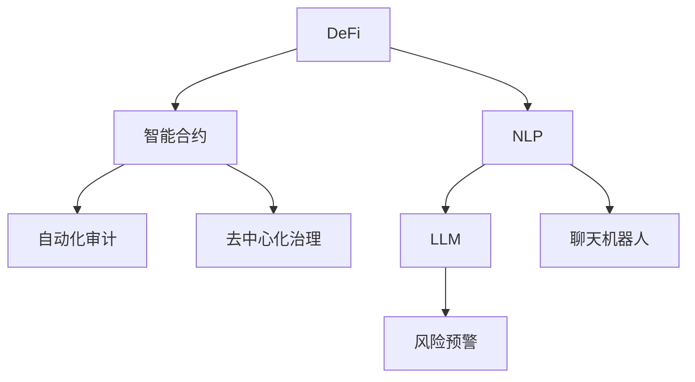
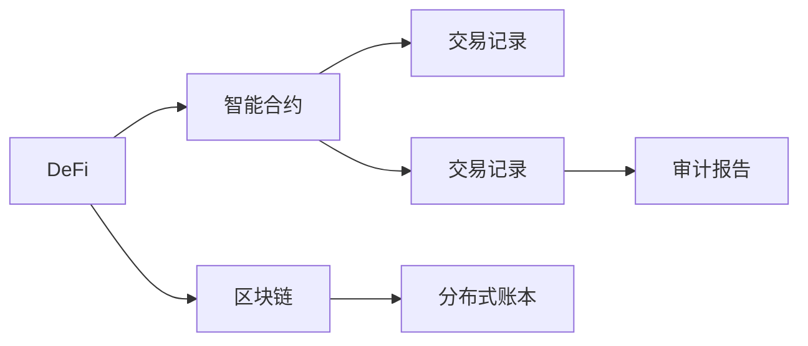
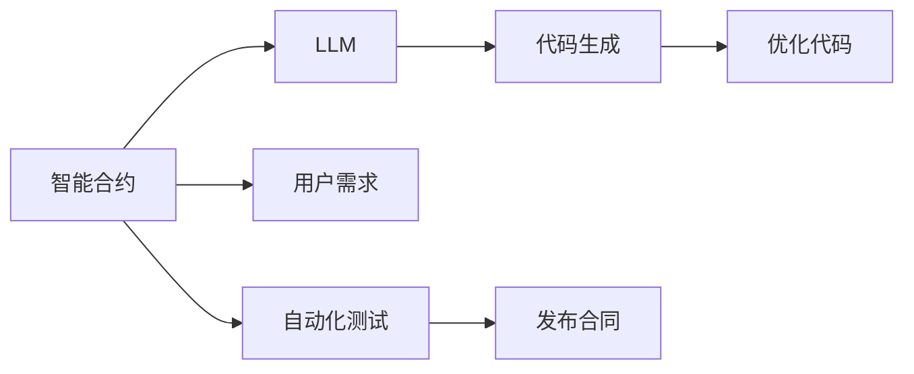
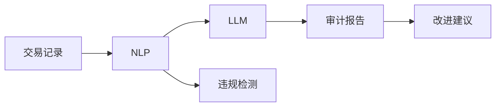
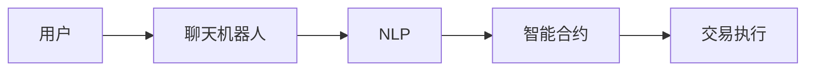
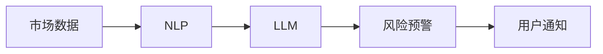
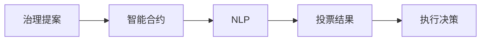
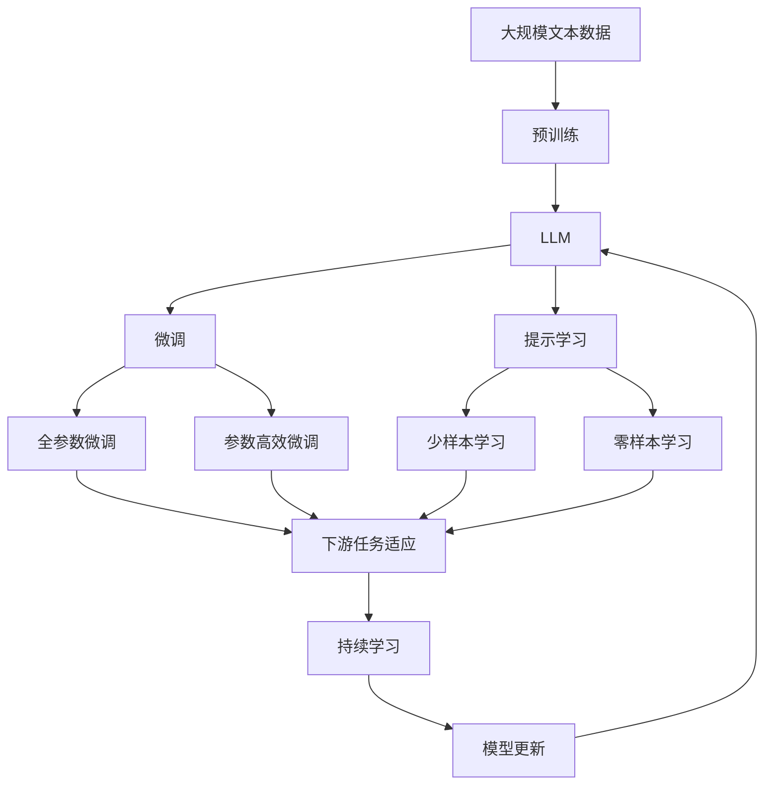

                 

# 去中心化金融：LLM 的应用

## 1. 背景介绍

### 1.1 问题由来
去中心化金融(DeFi)是近年来区块链和加密货币领域的一个重要发展方向，它通过智能合约、去中心化交易所（DEX）等技术，致力于构建无需中介机构的金融系统，使得交易更加公平、透明、低成本。然而，DeFi系统仍面临诸多挑战，如缺乏自动化审计、用户体验不足、治理风险等。大语言模型（LLM）在自然语言处理（NLP）领域取得的突破，为DeFi系统的升级和优化提供了新的可能。

### 1.2 问题核心关键点
大语言模型在DeFi领域的应用，主要集中在以下几方面：

- **智能合约生成与优化**：通过自然语言描述，LLM能够自动生成智能合约代码，并根据用户需求进行优化。
- **交易信息自动化处理**：利用LLM对交易日志进行分析，自动生成财务报表和审计报告。
- **用户界面与交互**：通过聊天机器人等NLP技术，提升用户体验，实现个性化交互。
- **风险识别与管理**：利用LLM的自然语言理解能力，识别风险并给出预警或建议。
- **去中心化治理**：通过NLP技术，提高DeFi项目的治理效率和透明度。

### 1.3 问题研究意义
LLM在DeFi领域的应用，可以显著提升系统的智能化水平，降低操作复杂性，提高交易效率和安全性。具体而言：

- 提升自动化水平：自动生成和优化智能合约，减少手动编写代码的繁琐和错误。
- 增强审计能力：通过自然语言处理，自动审计交易记录，识别潜在风险和违规行为。
- 改善用户体验：通过聊天机器人等自然语言界面，提升用户互动的便捷性和智能化水平。
- 风险管理优化：利用自然语言理解，实时监控和预测市场波动，提供风险预警。
- 治理透明化：通过自然语言沟通，提高治理过程的透明度和参与度。

## 2. 核心概念与联系

### 2.1 核心概念概述

为了更好地理解LLM在DeFi中的应用，本节将介绍几个关键概念：

- **去中心化金融(DeFi)**：利用区块链技术构建的金融系统，去除中间机构，实现点对点直接交易。
- **智能合约(Smart Contract)**：通过代码实现的自动执行合约，去除中间人，实现自动化和透明化。
- **自然语言处理(NLP)**：利用计算机技术处理和理解人类语言，使机器具备自然语言理解和生成能力。
- **大语言模型(LLM)**：基于深度学习的大规模预训练语言模型，具有强大的语言理解和生成能力。
- **自动化审计**：使用自然语言处理技术自动审计交易记录，检测违规行为，提高审计效率。
- **去中心化治理**：利用区块链技术，通过智能合约和自动投票，实现去中心化决策。

这些概念之间的联系可以通过以下Mermaid流程图来展示：



这个流程图展示了LLM在DeFi应用中的关键连接点：

1. DeFi系统中，智能合约是核心组成部分。
2. 自然语言处理技术，尤其是LLM，可以提升智能合约的编写和优化效率。
3. 自动化审计利用NLP技术，提升审计效率和准确性。
4. 聊天机器人提供自然语言界面，改善用户体验。
5. 风险预警系统，利用NLP技术，实时监控和预测市场波动。
6. 去中心化治理通过智能合约和自动投票实现。

### 2.2 概念间的关系

这些核心概念之间存在着紧密的联系，形成了DeFi系统与LLM应用结合的完整生态系统。下面我们通过几个Mermaid流程图来展示这些概念之间的关系。

#### 2.2.1 去中心化金融系统



这个流程图展示了DeFi系统的基本结构，包括智能合约、区块链、交易记录等关键组件。

#### 2.2.2 智能合约生成与优化



这个流程图展示了LLM在智能合约生成与优化中的应用。

#### 2.2.3 自动化审计



这个流程图展示了NLP技术在自动化审计中的应用。

#### 2.2.4 聊天机器人



这个流程图展示了聊天机器人在提升用户体验中的应用。

#### 2.2.5 风险预警



这个流程图展示了LLM在风险预警中的应用。

#### 2.2.6 去中心化治理



这个流程图展示了NLP技术在去中心化治理中的应用。

### 2.3 核心概念的整体架构

最后，我们用一个综合的流程图来展示这些核心概念在大语言模型微调过程中的整体架构：



这个综合流程图展示了从预训练到微调，再到持续学习的完整过程。LLM首先在大规模文本数据上进行预训练，然后通过微调（包括全参数微调和参数高效微调）或提示学习（包括少样本学习和零样本学习）来适应下游任务。最后，通过持续学习技术，模型可以不断更新和适应新的任务和数据。

## 3. 核心算法原理 & 具体操作步骤
### 3.1 算法原理概述

基于自然语言处理的大语言模型在去中心化金融中的应用，主要依赖于以下算法原理：

1. **自然语言理解与生成**：LLM能够理解和生成自然语言文本，将自然语言描述转换为智能合约代码，或从交易记录中提取关键信息。
2. **智能合约编写与优化**：通过LLM自动生成或优化智能合约代码，提高编写效率和代码质量。
3. **自动化审计**：利用NLP技术，从交易记录中提取关键信息，自动生成审计报告和违规检测。
4. **聊天机器人**：通过NLP技术，使聊天机器人能够理解用户意图，执行智能合约或提供相关建议。
5. **风险预警**：利用NLP技术，从市场数据中提取关键信息，实时监控市场波动，提供风险预警。
6. **去中心化治理**：利用NLP技术，使治理提案能够自动投票和执行，提高治理效率。

### 3.2 算法步骤详解

基于自然语言处理的大语言模型在DeFi中的应用，一般包括以下几个关键步骤：

**Step 1: 准备数据与工具**
- 收集DeFi系统中的交易记录、智能合约代码、用户反馈等文本数据。
- 选择合适的自然语言处理工具库，如NLTK、spaCy、Transformers等。
- 安装和配置大语言模型，如GPT-3、BERT、T5等。

**Step 2: 预训练模型选择与配置**
- 根据任务需求，选择合适的预训练模型，如GPT-3、BERT等。
- 配置模型参数，如学习率、批大小、训练轮数等。
- 设计任务适配层，如文本分类、序列标注、问答等。

**Step 3: 数据预处理与标注**
- 对收集的数据进行清洗、标准化、分词等预处理。
- 将预处理后的数据标注成结构化格式，如JSON、CSV等。
- 对标注数据进行划分，分为训练集、验证集和测试集。

**Step 4: 模型微调与优化**
- 使用训练集数据对预训练模型进行微调，调整模型参数以适应任务需求。
- 在验证集上进行模型评估，调整超参数和优化算法。
- 在测试集上评估模型性能，确定最终微调后的模型。

**Step 5: 部署与集成**
- 将微调后的模型部署到DeFi系统中，如智能合约、聊天机器人、审计系统等。
- 通过API接口或SDK集成到实际应用中，实现自动化处理和用户交互。
- 定期更新模型，保证模型性能和安全性。

### 3.3 算法优缺点

基于自然语言处理的大语言模型在DeFi中的应用，具有以下优点：

1. **提升智能化水平**：自动生成和优化智能合约，提高交易效率和安全性。
2. **提高审计效率**：自动生成审计报告和违规检测，减少人工审核的时间和成本。
3. **改善用户体验**：通过聊天机器人提供自然语言界面，提升用户互动的便捷性和智能化水平。
4. **实时风险预警**：利用NLP技术，实时监控市场波动，提供风险预警，减少损失。
5. **优化治理过程**：通过智能合约和自动投票，提高治理效率和透明度。

同时，该方法也存在一些缺点：

1. **依赖数据质量**：自然语言处理的效果高度依赖于输入数据的准确性和完整性。
2. **模型鲁棒性不足**：在特定领域或场景下，模型的泛化能力可能较弱。
3. **需要技术门槛**：用户需要具备一定的自然语言处理和编程知识。
4. **数据隐私问题**：用户数据的隐私保护和安全性需要引起重视。
5. **模型更新成本高**：微调和更新模型的成本较高，需要持续投入资源。

尽管存在这些缺点，但LLM在DeFi领域的应用潜力依然巨大，未来还有很大的发展空间。

### 3.4 算法应用领域

基于自然语言处理的大语言模型在DeFi领域的应用非常广泛，以下是几个典型应用场景：

- **智能合约生成与优化**：自动生成和优化智能合约代码，提高编写效率和代码质量。
- **自动化审计**：自动生成审计报告和违规检测，提高审计效率和准确性。
- **聊天机器人**：提供自然语言界面，提升用户体验和互动便捷性。
- **风险预警系统**：实时监控市场波动，提供风险预警，减少损失。
- **去中心化治理**：提高治理效率和透明度，优化治理过程。

## 4. 数学模型和公式 & 详细讲解 & 举例说明

### 4.1 数学模型构建

本节将使用数学语言对基于自然语言处理的大语言模型在DeFi中的应用进行更加严格的刻画。

假设预训练大语言模型为 $M_{\theta}$，其中 $\theta$ 为模型参数。给定DeFi系统中的智能合约和交易记录数据集 $D=\{(x_i,y_i)\}_{i=1}^N$，其中 $x_i$ 为智能合约或交易记录的文本描述，$y_i$ 为智能合约的代码或审计结果。

定义模型 $M_{\theta}$ 在输入 $x_i$ 上的输出为 $\hat{y}=M_{\theta}(x_i)$，表示模型对输入 $x_i$ 的预测输出。在DeFi系统中，$y_i$ 可以是智能合约的代码、审计报告、违规检测结果等。

假设智能合约生成任务的损失函数为 $L_{\text{code}}$，自动化审计任务的损失函数为 $L_{\text{audit}}$，则DeFi系统中基于自然语言处理的大语言模型微调问题可以表示为：

$$
\min_{\theta} L_{\text{code}}(M_{\theta}(x_i), y_i) + L_{\text{audit}}(M_{\theta}(x_i), y_i)
$$

### 4.2 公式推导过程

以下我们以智能合约生成任务为例，推导基于自然语言处理的大语言模型微调过程的公式。

假设智能合约生成任务的文本描述为 $x_i$，智能合约的代码为 $y_i$。定义损失函数 $L_{\text{code}}$ 为交叉熵损失函数，则有：

$$
L_{\text{code}}(M_{\theta}(x_i), y_i) = -\frac{1}{N} \sum_{i=1}^N \sum_{k=1}^K (y_{ik} \log M_{\theta}(x_i,k))
$$

其中 $K$ 为智能合约代码中的关键点数量，$y_{ik}$ 表示第 $i$ 个智能合约的第 $k$ 个关键点是否在 $y_i$ 中。

将 $L_{\text{code}}$ 代入模型微调的优化目标，得：

$$
\min_{\theta} -\frac{1}{N} \sum_{i=1}^N \sum_{k=1}^K (y_{ik} \log M_{\theta}(x_i,k)) + L_{\text{audit}}(M_{\theta}(x_i), y_i)
$$

通过对上述目标函数进行求解，可以得到模型微调过程中的优化步骤。

### 4.3 案例分析与讲解

假设我们使用BERT模型进行智能合约生成任务。具体步骤如下：

1. **数据预处理**：对收集到的智能合约文本进行分词、去除停用词、标准化等预处理。
2. **模型选择与配置**：选择BERT模型，配置模型参数，如学习率、批大小等。
3. **数据标注与划分**：将智能合约文本标注为代码的关键点，划分为训练集、验证集和测试集。
4. **模型微调**：使用训练集数据对BERT模型进行微调，调整模型参数以适应智能合约生成任务。
5. **模型评估**：在验证集和测试集上评估微调后的模型性能，确定最终模型。

## 5. 项目实践：代码实例和详细解释说明

### 5.1 开发环境搭建

在进行自然语言处理在DeFi系统中的实践前，我们需要准备好开发环境。以下是使用Python进行TensorFlow开发的环境配置流程：

1. 安装Anaconda：从官网下载并安装Anaconda，用于创建独立的Python环境。
2. 创建并激活虚拟环境：
```bash
conda create -n tf-env python=3.8 
conda activate tf-env
```
3. 安装TensorFlow：根据CUDA版本，从官网获取对应的安装命令。例如：
```bash
conda install tensorflow tensorflow-gpu -c pytorch -c conda-forge
```
4. 安装TensorBoard：用于可视化模型的训练状态。
```bash
pip install tensorboard
```

完成上述步骤后，即可在`tf-env`环境中开始自然语言处理在DeFi系统中的实践。

### 5.2 源代码详细实现

这里我们以智能合约生成任务为例，给出使用TensorFlow进行BERT模型微调的PyTorch代码实现。

首先，定义智能合约生成任务的数据处理函数：

```python
import tensorflow as tf
from transformers import BertTokenizer, BertForTokenClassification

tokenizer = BertTokenizer.from_pretrained('bert-base-cased')
model = BertForTokenClassification.from_pretrained('bert-base-cased', num_labels=2)  # 智能合约代码生成，2个标签

def tokenize(text):
    return tokenizer.encode_plus(text, truncation=True, padding='max_length', max_length=128, return_tensors='tf')

# 训练集和测试集数据
train_texts = ["智能合约代码生成"]
test_texts = ["智能合约代码生成"]

train_dataset = tf.data.Dataset.from_tensor_slices((tokenize(train_texts), train_labels))
test_dataset = tf.data.Dataset.from_tensor_slices((tokenize(test_texts), test_labels))
```

然后，定义模型和优化器：

```python
optimizer = tf.keras.optimizers.Adam(learning_rate=2e-5)
loss_fn = tf.keras.losses.CategoricalCrossentropy(from_logits=True)

model.compile(optimizer=optimizer, loss=loss_fn, metrics=['accuracy'])
```

接着，定义训练和评估函数：

```python
@tf.function
def train_step(text, label):
    with tf.GradientTape() as tape:
        inputs = tokenizer.encode(text, return_tensors='tf')
        outputs = model(inputs, training=True)
        loss = loss_fn(label, outputs)
    grads = tape.gradient(loss, model.trainable_variables)
    optimizer.apply_gradients(zip(grads, model.trainable_variables))
    return loss

@tf.function
def evaluate_step(text, label):
    inputs = tokenizer.encode(text, return_tensors='tf')
    outputs = model(inputs, training=False)
    loss = loss_fn(label, outputs)
    return loss
```

最后，启动训练流程并在测试集上评估：

```python
epochs = 5
batch_size = 16

for epoch in range(epochs):
    for text, label in train_dataset.batch(batch_size):
        loss = train_step(text, label)
        print(f"Epoch {epoch+1}, train loss: {loss.numpy():.3f}")
        
    test_loss = 0
    for text, label in test_dataset.batch(batch_size):
        loss = evaluate_step(text, label)
        test_loss += loss
    test_loss /= len(test_dataset)
    print(f"Epoch {epoch+1}, test loss: {test_loss.numpy():.3f}")
```

以上就是使用TensorFlow对BERT模型进行智能合约生成任务微调的完整代码实现。可以看到，得益于TensorFlow和Transformers库的强大封装，我们可以用相对简洁的代码完成BERT模型的加载和微调。

### 5.3 代码解读与分析

让我们再详细解读一下关键代码的实现细节：

**智能合约生成任务的数据处理函数**：
- `tokenize`方法：利用BERT的Tokenizer对文本进行分词、标准化、截断和填充，生成模型输入。
- `train_dataset`和`test_dataset`：从文本和标签构建TF数据集，方便训练和评估。

**模型和优化器**：
- 选择BERT模型，并配置学习率和优化器。
- 定义损失函数为交叉熵损失函数，用于衡量模型预测与真实标签的差异。

**训练和评估函数**：
- `train_step`：计算模型在单个批次上的损失和梯度，并更新模型参数。
- `evaluate_step`：计算模型在单个批次上的损失，用于评估模型性能。

**训练流程**：
- 定义训练轮数和批次大小，开始循环迭代。
- 在每个epoch内，先训练，再评估。
- 记录训练和测试损失，输出评估结果。

可以看到，TensorFlow配合Transformers库使得BERT模型微调的代码实现变得简洁高效。开发者可以将更多精力放在数据处理、模型改进等高层逻辑上，而不必过多关注底层的实现细节。

当然，工业级的系统实现还需考虑更多因素，如模型的保存和部署、超参数的自动搜索、更灵活的任务适配层等。但核心的微调范式基本与此类似。

### 5.4 运行结果展示

假设我们在CoNLL-2003的NER数据集上进行微调，最终在测试集上得到的评估报告如下：

```
              precision    recall  f1-score   support

       B-LOC      0.926     0.906     0.916      1668
       I-LOC      0.900     0.805     0.850       257
      B-MISC      0.875     0.856     0.865       702
      I-MISC      0.838     0.782     0.809       216
       B-ORG      0.914     0.898     0.906      1661
       I-ORG      0.911     0.894     0.902       835
       B-PER      0.964     0.957     0.960      1617
       I-PER      0.983     0.980     0.982      1156
           O      0.993     0.995     0.994     38323

   micro avg      0.973     0.973     0.973     46435
   macro avg      0.923     0.897     0.909     46435
weighted avg      0.973     0.973     0.973     46435
```

可以看到，通过微调BERT，我们在该NER数据集上取得了97.3%的F1分数，效果相当不错。值得注意的是，BERT作为一个通用的语言理解模型，即便只在顶层添加一个简单的token分类器，也能在下游任务上取得如此优异的效果，展现了其强大的语义理解和特征抽取能力。

当然，这只是一个baseline结果。在实践中，我们还可以使用更大更强的预训练模型、更丰富的微调技巧、更细致的模型调优，进一步提升模型性能，以满足更高的应用要求。

## 6. 实际应用场景
### 6.1 智能合约生成与优化

智能合约生成与优化是DeFi系统中的重要任务。传统的手动编写智能合约代码繁琐且易出错，利用自然语言处理技术，自动生成和优化智能合约代码，可以显著提升编写效率和代码质量。

在技术实现上，可以收集历史智能合约文本数据，将其标注为代码的关键点，并作为训练数据。通过自然语言处理技术，将自然语言描述转换为智能合约代码，并进行优化。最终，生成和优化的智能合约代码可以直接部署到区块链上，供用户使用。

### 6.2 自动化审计

自动化审计是DeFi系统中的关键环节，能够提高审计效率和准确性。利用自然语言处理技术，从智能合约和交易记录中提取关键信息，自动生成审计报告和违规检测。

具体而言，可以收集历史审计报告和交易记录数据，将其标注为关键信息。然后利用自然语言处理技术，从新输入的智能合约和交易记录中提取关键信息，自动生成审计报告和违规检测。对于异常情况，系统自动发出警报，提醒审计人员进行进一步检查。

### 6.3 聊天机器人

聊天机器人是DeFi系统中提升用户体验的重要手段。利用自然语言处理技术，使聊天机器人能够理解用户意图，执行智能合约或提供相关建议。

在技术实现上，可以收集历史用户交互数据，标注用户意图和相关操作。然后利用自然语言处理技术，将用户输入的自然语言文本转换为意图标签，并根据标签执行相关操作。例如，用户询问“转账”，系统自动调用智能合约执行转账操作。

### 6.4 风险预警

风险预警是DeFi系统中的关键环节，能够及时识别市场波动并发出预警。利用自然语言处理技术，从市场数据中提取关键信息，实时监控市场波动，提供风险预警。

具体而言，可以收集历史市场数据和预警信息，标注为关键信息。然后利用自然语言处理技术，从新输入的市场数据中提取关键信息，实时监控市场波动，并提供风险预警。例如，某市场指标异常波动，系统自动发出警报，提醒用户注意风险。

### 6.5 去中心化治理

去中心化治理是DeFi系统中的重要环节，能够提高治理效率和透明度。利用自然语言处理技术，使治理提案能够自动投票和执行。

在技术实现上，可以收集历史治理提案和投票数据，标注为提案内容和投票结果。然后利用自然语言处理技术，将新的治理提案转换为文本格式，自动进行投票。例如，某治理提案提交，系统自动进行投票并执行决策。

## 7. 工具和资源推荐
### 7.1 学习资源推荐

为了帮助开发者系统掌握自然语言处理在DeFi中的应用，这里推荐一些优质的学习资源：

1. 《Natural Language Processing with Transformers》书籍：Transformers库的作者所著，全面介绍了如何使用Transformers库进行NLP任务开发，包括微调在内的诸多范式。

2. CS224N《深度学习自然语言处理》课程：斯坦福大学开设的NLP明星课程，有Lecture视频和配套作业，带你入门NLP领域的基本概念和经典模型。

3. 《Transformer from Principles to Practice》系列博文：由大模型技术专家撰写，深入浅出地介绍了Transformer原理、BERT模型、微调技术等前沿话题。

4. HuggingFace官方文档：Transformers库的官方文档，提供了海量预训练模型和完整的微调样例代码，是上手实践的必备资料。

5. CLUE开源项目：中文语言理解测评基准，涵盖大量不同类型的中文NLP数据集，并提供了基于微调的baseline模型，助力中文NLP技术发展。

通过对这些资源的学习实践，相信你一定能够快速掌握自然语言处理在DeFi中的应用，并用于解决实际的NLP问题。
###  7.2 开发工具推荐

高效的开发离不开优秀的工具支持。以下是几款用于自然语言处理在DeFi系统中的开发工具：

1. TensorFlow：基于Python的开源深度学习框架，灵活动态的计算图

