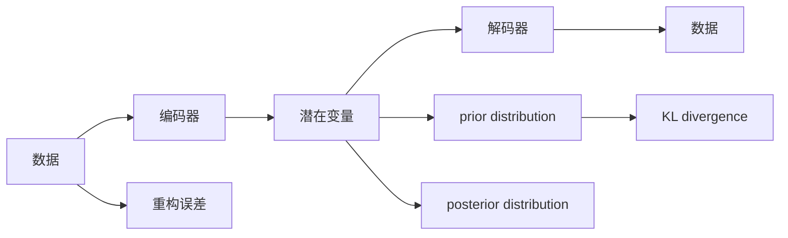
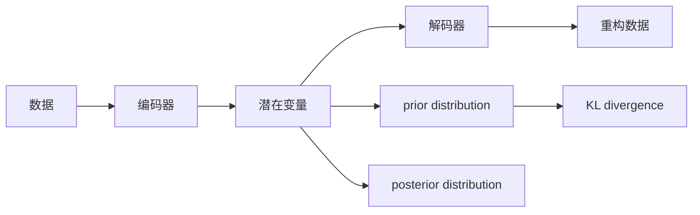
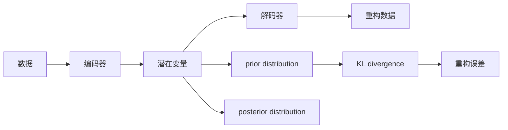

                 

# 变分自编码器VAE原理与代码实例讲解

> 关键词：变分自编码器,VAE,生成模型,自编码器,潜在变量,密度估计,降维,隐变量,生成模型,图像生成,深度学习

## 1. 背景介绍

### 1.1 问题由来
生成模型（Generative Models）在机器学习和深度学习领域有着广泛的应用。传统的生成模型，如隐马尔可夫模型（Hidden Markov Model, HMM）和条件随机场（Conditional Random Field, CRF），往往只能处理线性结构或树状结构的数据。随着深度学习的发展，变分自编码器（Variational Autoencoder, VAE）应运而生，成为处理非线性结构数据的有力工具。

变分自编码器VAE是一种生成模型，能够学习数据的潜在分布，并将数据映射回潜在空间。VAE的生成过程与解码器类似，但与之不同的是，VAE使用变分方法来学习潜在分布的参数，从而避免了复杂的反向传播。在VAE的训练过程中，我们不仅关注模型的生成性能，还关注了潜在变量的分布。这使得VAE在降维、数据生成和异常检测等任务上表现出色。

### 1.2 问题核心关键点
VAE的核心思想是通过潜在变量来捕捉数据的分布特征。其基本思路是：首先构建一个潜在变量的先验分布（prior distribution），然后通过训练一个编码器将数据映射到潜在空间，再训练一个解码器将潜在变量映射回原始数据空间。在训练过程中，我们利用KL散度（Kullback-Leibler divergence）来约束潜在变量的分布，以减少模型的自由度。

具体来说，VAE的目标是最大化数据的似然（likelihood），并通过重构误差（reconstruction error）和潜在变量分布的约束来优化模型参数。VAE的训练过程可以总结为以下步骤：

1. 构建潜在变量的先验分布，如高斯分布。
2. 训练编码器，将数据映射到潜在空间。
3. 训练解码器，将潜在变量映射回原始数据空间。
4. 利用KL散度约束潜在变量的分布，并最小化重构误差。
5. 使用梯度下降等优化算法更新模型参数。

VAE的训练过程可以看作是对潜在变量分布的推断过程，从而能够在保持数据生成能力的同时，进行数据的降维和异常检测等任务。

### 1.3 问题研究意义
VAE作为一种生成模型，具有重要的研究意义：

1. 数据生成与降维：VAE能够学习数据的潜在分布，生成新的样本，同时将高维数据映射到低维空间，降低数据的维度。
2. 数据可视化：通过VAE，我们可以将高维数据映射到低维空间，并进行可视化，帮助我们理解数据的分布特征。
3. 异常检测：VAE能够检测数据中的异常点，并根据潜在变量的分布来进行分类。
4. 强化学习：VAE在强化学习中也有广泛应用，如将VAE用于模型训练中的噪声注入，提高模型的鲁棒性。
5. 数据增强：VAE可以用于数据增强，通过生成新的样本来增加训练集的多样性。

VAE的应用领域不仅限于图像生成和降维，还可以应用于自然语言处理、语音识别等领域，为相关任务提供了新的思路和方法。

## 2. 核心概念与联系

### 2.1 核心概念概述

为了更好地理解VAE的原理和应用，本节将介绍几个密切相关的核心概念：

- 自编码器（Autoencoder）：是一种无监督学习模型，用于降维和特征提取。自编码器由一个编码器和一个解码器组成，其中编码器将输入映射到潜在空间，解码器将潜在变量映射回原始数据空间。

- 潜在变量（Latent Variables）：指自编码器中编码器所学习的中间变量，用于捕捉数据的分布特征。在VAE中，潜在变量通常服从高斯分布。

- 编码器（Encoder）：用于将输入数据映射到潜在空间的神经网络。编码器的输出通常是一个向量，代表潜在变量的值。

- 解码器（Decoder）：用于将潜在变量映射回原始数据空间的神经网络。解码器的输出通常是对输入数据的重构。

- 生成模型（Generative Model）：能够生成数据的概率模型，用于数据生成和分布估计。VAE就是一种生成模型，能够学习数据的潜在分布，并将数据映射回潜在空间。

这些概念之间的逻辑关系可以通过以下Mermaid流程图来展示：



这个流程图展示了一个VAE的基本架构和训练过程：

1. 数据输入到编码器，编码器将数据映射到潜在变量。
2. 潜在变量通过解码器映射回原始数据空间，生成数据的重构。
3. 潜在变量服从先验分布，解码器输出的重构数据服从后验分布。
4. 通过KL散度约束潜在变量的分布，并最小化重构误差。

### 2.2 概念间的关系

这些核心概念之间存在着紧密的联系，形成了VAE的完整生态系统。下面我们通过几个Mermaid流程图来展示这些概念之间的关系。

#### 2.2.1 自编码器与VAE的关系


这个流程图展示了自编码器的基本架构和训练过程：

1. 数据输入到编码器，编码器将数据映射到潜在空间。
2. 潜在变量通过解码器映射回原始数据空间，生成数据的重构。
3. 重构误差用于衡量模型的性能，训练编码器和解码器。

#### 2.2.2 VAE的生成过程


这个流程图展示了VAE的生成过程：

1. 数据输入到编码器，编码器将数据映射到潜在空间。
2. 潜在变量通过解码器映射回原始数据空间，生成数据的重构。
3. 重构误差用于衡量模型的性能，训练编码器和解码器。
4. 潜在变量服从先验分布，通过KL散度约束潜在变量的分布，并最小化重构误差。

#### 2.2.3 VAE的训练过程



这个流程图展示了VAE的训练过程：

1. 数据输入到编码器，编码器将数据映射到潜在空间。
2. 潜在变量通过解码器映射回原始数据空间，生成数据的重构。
3. 重构误差用于衡量模型的性能，训练编码器和解码器。
4. 潜在变量服从先验分布，通过KL散度约束潜在变量的分布，并最小化重构误差。

### 2.3 核心概念的整体架构

最后，我们用一个综合的流程图来展示这些核心概念在大语言模型微调过程中的整体架构：



这个综合流程图展示了VAE的基本架构和训练过程：

1. 数据输入到编码器，编码器将数据映射到潜在空间。
2. 潜在变量通过解码器映射回原始数据空间，生成数据的重构。
3. 重构误差用于衡量模型的性能，训练编码器和解码器。
4. 潜在变量服从先验分布，通过KL散度约束潜在变量的分布，并最小化重构误差。

通过这些流程图，我们可以更清晰地理解VAE的各个组成部分及其之间的关系，为后续深入讨论具体的VAE实现和应用提供基础。

## 3. 核心算法原理 & 具体操作步骤
### 3.1 算法原理概述

变分自编码器（VAE）的基本原理是通过潜在变量来学习数据的潜在分布，并通过KL散度约束潜在变量的分布，从而最大化数据的似然（likelihood）。VAE的生成过程与解码器类似，但与之不同的是，VAE使用变分方法来学习潜在分布的参数，从而避免了复杂的反向传播。

具体来说，VAE的目标是最大化数据的似然（likelihood），并通过重构误差（reconstruction error）和潜在变量分布的约束来优化模型参数。VAE的训练过程可以总结为以下步骤：

1. 构建潜在变量的先验分布，如高斯分布。
2. 训练编码器，将数据映射到潜在空间。
3. 训练解码器，将潜在变量映射回原始数据空间。
4. 利用KL散度约束潜在变量的分布，并最小化重构误差。
5. 使用梯度下降等优化算法更新模型参数。

### 3.2 算法步骤详解

VAE的训练过程可以分为两个阶段：

1. 编码器训练：将数据映射到潜在空间。
2. 解码器训练：将潜在变量映射回原始数据空间。

具体步骤如下：

1. 构建潜在变量的先验分布，如高斯分布。
2. 训练编码器，将数据映射到潜在空间。
3. 训练解码器，将潜在变量映射回原始数据空间。
4. 利用KL散度约束潜在变量的分布，并最小化重构误差。
5. 使用梯度下降等优化算法更新模型参数。

#### 3.2.1 编码器训练

编码器训练的目标是将数据映射到潜在空间。假设潜在变量服从高斯分布 $z \sim \mathcal{N}(0, I)$，编码器的输出为潜在变量的均值 $\mu$ 和方差 $\sigma^2$，即 $z = \mu + \sigma \odot \epsilon$，其中 $\epsilon \sim \mathcal{N}(0, I)$。

编码器训练的损失函数可以表示为：

$$
\mathcal{L}_{\text{encoder}} = \mathbb{E}_{x \sim \mathcal{D}}[\frac{1}{2}\|\mu_x - \mu\|^2 + \frac{1}{2}\sigma_x^2 + \log \sigma_x]
$$

其中 $\mu_x$ 和 $\sigma_x^2$ 分别是数据 $x$ 的潜在变量的均值和方差。

#### 3.2.2 解码器训练

解码器训练的目标是将潜在变量映射回原始数据空间。假设解码器的输出为 $x'$，解码器的输出可以表示为：

$$
x' = \mu + \sigma \odot \epsilon'
$$

其中 $\mu$ 和 $\sigma$ 分别是潜在变量的均值和方差，$\epsilon'$ 服从标准高斯分布 $\mathcal{N}(0, I)$。

解码器训练的损失函数可以表示为：

$$
\mathcal{L}_{\text{decoder}} = \mathbb{E}_{z \sim q(z|x)}[\frac{1}{2}\|x' - x\|^2 + \log \sigma_x']
$$

其中 $q(z|x)$ 是潜在变量的后验分布，$\sigma_x'$ 是解码器输出 $x'$ 的方差。

#### 3.2.3 总损失函数

VAE的总损失函数可以表示为重构误差和KL散度损失函数的和：

$$
\mathcal{L}_{\text{VAE}} = \mathcal{L}_{\text{encoder}} + \mathcal{L}_{\text{decoder}} + \mathbb{E}_{z \sim q(z|x)}[\log p(z)] - \mathbb{E}_{z \sim q(z|x)}[\log q(z)]
$$

其中 $p(z)$ 是潜在变量的先验分布，$q(z|x)$ 是潜在变量的后验分布。

### 3.3 算法优缺点

VAE具有以下优点：

1. 能够学习数据的潜在分布，生成新的样本。
2. 能够进行数据的降维和可视化。
3. 能够检测数据中的异常点，并进行分类。

VAE也存在一些缺点：

1. 潜在变量的分布难以确定，需要通过优化算法进行学习。
2. 重构误差和KL散度约束需要同时最小化，可能出现梯度消失问题。
3. 模型参数较多，训练复杂度较高。
4. 生成的样本可能存在模式崩溃（mode collapse）问题，即生成器输出集中在少数几个模式上。

尽管存在这些局限性，但VAE仍是一种强大的生成模型，广泛应用于图像生成、降维、数据增强等领域。未来研究将继续优化VAE，以解决其存在的问题。

### 3.4 算法应用领域

VAE在多个领域有着广泛的应用，例如：

- 图像生成：VAE可以生成新的图像样本，用于数据增强和生成对抗网络（GAN）。
- 数据降维：VAE可以将高维数据映射到低维空间，进行数据可视化和降维。
- 异常检测：VAE可以检测数据中的异常点，并进行分类。
- 强化学习：VAE可以用于模型训练中的噪声注入，提高模型的鲁棒性。
- 自然语言处理：VAE可以用于生成自然语言文本，如机器翻译、文本生成等。

## 4. 数学模型和公式 & 详细讲解  
### 4.1 数学模型构建

VAE的数学模型构建可以总结为以下几步：

1. 构建潜在变量的先验分布，如高斯分布。
2. 训练编码器，将数据映射到潜在空间。
3. 训练解码器，将潜在变量映射回原始数据空间。
4. 利用KL散度约束潜在变量的分布，并最小化重构误差。

#### 4.1.1 编码器训练

假设编码器的输出为潜在变量的均值 $\mu_x$ 和方差 $\sigma_x^2$，其中 $\mu_x = (\mu_x^1, \mu_x^2, \ldots, \mu_x^n)$，$\sigma_x^2 = (\sigma_x^{1,2}, \sigma_x^{2,2}, \ldots, \sigma_x^{n,n})$。

编码器的训练损失函数可以表示为：

$$
\mathcal{L}_{\text{encoder}} = \frac{1}{2}\sum_{i=1}^n (\mu_x^i - \mu)^2 + \frac{1}{2}\sum_{i=1}^n (\sigma_x^i)^2 + \log \sigma_x^i
$$

其中 $\mu$ 是潜在变量的均值，$\sigma_x^i$ 是潜在变量的方差。

#### 4.1.2 解码器训练

假设解码器的输出为 $x'$，其中 $x' = (x'^1, x'^2, \ldots, x'^n)$。

解码器的训练损失函数可以表示为：

$$
\mathcal{L}_{\text{decoder}} = \frac{1}{2}\sum_{i=1}^n (x'^i - x)^2 + \log \sigma_x'^i
$$

其中 $\sigma_x'^i$ 是解码器输出 $x'$ 的方差。

#### 4.1.3 总损失函数

VAE的总损失函数可以表示为重构误差和KL散度损失函数的和：

$$
\mathcal{L}_{\text{VAE}} = \mathcal{L}_{\text{encoder}} + \mathcal{L}_{\text{decoder}} + \mathbb{E}_{z \sim q(z|x)}[\log p(z)] - \mathbb{E}_{z \sim q(z|x)}[\log q(z)]
$$

其中 $p(z)$ 是潜在变量的先验分布，$q(z|x)$ 是潜在变量的后验分布。

### 4.2 公式推导过程

VAE的公式推导主要涉及潜在变量的先验分布和后验分布。假设潜在变量服从高斯分布 $z \sim \mathcal{N}(0, I)$，则潜在变量的后验分布可以表示为：

$$
q(z|x) = \mathcal{N}(\mu_x, \sigma_x^2)
$$

其中 $\mu_x$ 和 $\sigma_x^2$ 是编码器的输出。

VAE的训练目标是最大化数据的似然（likelihood），即：

$$
\mathcal{L} = \mathbb{E}_{x \sim \mathcal{D}}[\log p(x|z)] = \mathbb{E}_{z \sim q(z|x)}[\log p(x|z)]
$$

其中 $p(x|z)$ 是条件概率分布。

利用KL散度约束潜在变量的分布，VAE的训练目标可以表示为：

$$
\mathcal{L}_{\text{VAE}} = \mathcal{L}_{\text{encoder}} + \mathcal{L}_{\text{decoder}} + \mathbb{E}_{z \sim q(z|x)}[\log p(z)] - \mathbb{E}_{z \sim q(z|x)}[\log q(z)]
$$

其中 $\mathcal{L}_{\text{encoder}}$ 和 $\mathcal{L}_{\text{decoder}}$ 分别是编码器和解码器的训练损失函数，$q(z|x)$ 是潜在变量的后验分布，$p(z)$ 是潜在变量的先验分布。

### 4.3 案例分析与讲解

下面以MNIST手写数字数据集为例，展示VAE的训练过程。

首先，使用PyTorch库实现编码器和解码器：

```python
import torch
import torch.nn as nn
import torch.nn.functional as F

class Encoder(nn.Module):
    def __init__(self):
        super(Encoder, self).__init__()
        self.fc1 = nn.Linear(784, 512)
        self.fc21 = nn.Linear(512, 2)
        self.fc22 = nn.Linear(512, 2)

    def forward(self, x):
        x = F.relu(self.fc1(x))
        mu = self.fc21(x)
        logvar = self.fc22(x)
        return mu, logvar

class Decoder(nn.Module):
    def __init__(self):
        super(Decoder, self).__init__()
        self.fc3 = nn.Linear(2, 512)
        self.fc4 = nn.Linear(512, 784)

    def forward(self, x):
        x = F.relu(self.fc3(x))
        x = F.sigmoid(self.fc4(x))
        return x
```

然后，定义VAE的训练函数：

```python
class VAE(nn.Module):
    def __init__(self, encoder, decoder):
        super(VAE, self).__init__()
        self.encoder = encoder
        self.decoder = decoder

    def reparameterize(self, mu, logvar):
        std = torch.exp(logvar / 2)
        epsilon = torch.randn_like(std)
        return mu + epsilon * std

    def forward(self, x):
        mu, logvar = self.encoder(x)
        z = self.reparameterize(mu, logvar)
        x_recon = self.decoder(z)
        return x_recon, mu, logvar

    def loss_function(self, x_recon, x, mu, logvar):
        BCE = F.binary_cross_entropy(x_recon, x, reduction='sum')
        KLD = -0.5 * torch.mean(1 + logvar - mu.pow(2) - logvar.exp())
        return BCE + KLD
```

最后，进行训练：

```python
import torch.optim as optim

x_train = train_data.view(-1, 784)
x_test = test_data.view(-1, 784)

n_epochs = 100
batch_size = 256
learning_rate = 0.001

device = torch.device("cuda" if torch.cuda.is_available() else "cpu")

encoder = Encoder().to(device)
decoder = Decoder().to(device)
vae = VAE(encoder, decoder).to(device)

optimizer = optim.Adam(vae.parameters(), lr=learning_rate)

for epoch in range(n_epochs):
    for i in range(0, len(x_train), batch_size):
        batch_x = x_train[i:i+batch_size].to(device)
        x_recon, mu, logvar = vae(batch_x)

        loss = vae.loss_function(x_recon, batch_x, mu, logvar)
        optimizer.zero_grad()
        loss.backward()
        optimizer.step()

    if epoch % 10 == 0:
        print(f"Epoch {epoch+1}/{n_epochs}, Loss: {loss.item():.4f}")
```

通过训练，我们得到了VAE的编码器和解码器，可以进行图像生成和数据降维等任务。

## 5. 项目实践：代码实例和详细解释说明
### 5.1 开发环境搭建

在进行VAE的实践前，我们需要准备好开发环境。以下是使用Python进行PyTorch开发的环境配置流程：

1. 安装Anaconda：从官网下载并安装Anaconda，用于创建独立的Python环境。

2. 创建并激活虚拟环境：
```bash
conda create -n pytorch-env python=3.8 
conda activate pytorch-env
```

3. 安装PyTorch：根据CUDA版本，从官网获取对应的安装命令。例如：
```bash
conda install pytorch torchvision torchaudio cudatoolkit=11.1 -c pytorch -c conda-forge
```

4. 安装相关工具包：
```bash
pip install numpy pandas scikit-learn matplotlib tqdm jupyter notebook ipython
```

完成上述步骤后，即可在`pytorch-env`环境中开始VAE的实践。

### 5.2 源代码详细实现

下面以MNIST手写数字数据集为例，给出使用PyTorch库对VAE模型进行训练的代码实现。

首先，定义VAE的编码器和解码器：

```python
import torch
import torch.nn as nn
import torch.nn.functional as F

class Encoder(nn.Module):
    def __init__(self):
        super(Encoder, self).__init__()
        self.fc1 = nn.Linear(784, 512)
        self.fc21 = nn.Linear(512, 2)
        self.fc22 = nn.Linear(512, 2)

    def forward(self, x):
        x = F.relu(self.fc1(x))
        mu = self.fc21(x)
        logvar = self.fc22(x)
        return mu, logvar

class Decoder(nn.Module):
    def __init__(self):
        super(Decoder, self).__init__()
        self.fc3 = nn.Linear(2, 512)
        self.fc4 = nn.Linear(512, 784)

    def forward(self, x):
        x = F.relu(self.fc3(x))
        x = F.sigmoid(self.fc4(x))
        return x
```

然后，定义VAE的训练函数：

```python
import torch.optim as optim

class VAE(nn.Module):
    def __init__(self, encoder, decoder):
        super(VAE, self).__init__()
        self.encoder = encoder
        self.decoder = decoder

    def reparameterize(self, mu, logvar):
        std = torch.exp(logvar / 2)
        epsilon = torch.randn_like(std)
        return mu + epsilon * std

    def forward(self, x):
        mu, logvar = self.encoder(x)
        z = self.reparameterize(mu, logvar)
        x_recon = self.decoder(z)
        return x_recon, mu, logvar

    def loss_function(self, x_recon, x, mu, logvar):
        BCE = F.binary_cross_entropy(x_recon, x, reduction='sum')
        KLD = -0.5 * torch.mean(1 + logvar - mu.pow(2) - logvar.exp())
        return BCE + KLD
```

最后，进行训练：

```python
import torch.optim as optim

x_train = train_data.view(-1, 784)
x_test = test_data.view(-1, 784)

n_epochs = 100
batch_size = 256
learning_rate = 0.001

device = torch.device("cuda" if torch.cuda.is_available() else "cpu")

encoder = Encoder().to(device)
decoder = Decoder().to(device)
vae = VAE(encoder, decoder).to(device)

optimizer = optim.Adam(vae.parameters(), lr=learning_rate)

for epoch in range(n_epochs):
    for i in range(0, len(x_train), batch_size):
        batch_x = x_train[i:i+batch_size].to(device)
        x_recon, mu, logvar = vae(batch_x)

        loss = vae.loss_function(x_recon, batch_x, mu, logvar)
        optimizer.zero_grad()
        loss.backward()
        optimizer.step()

    if epoch % 10 == 0:
        print(f"Epoch {epoch+1}/{n_epochs}, Loss: {loss.item():.4f}")
```

以上就是使用PyTorch库对VAE模型进行训练的完整代码实现。可以看到，利用PyTorch库的强大封装，我们可以用相对简洁的代码完成VAE模型的训练。

### 5.3 代码解读与分析

让我们再详细解读一下关键代码的实现细节：

**Encoder类**：
- `__init__`方法：定义编码器的神经网络结构。
- `forward`方法：实现编码器的前向

