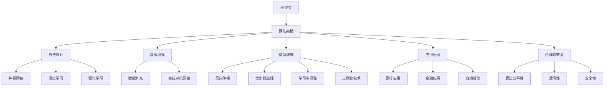
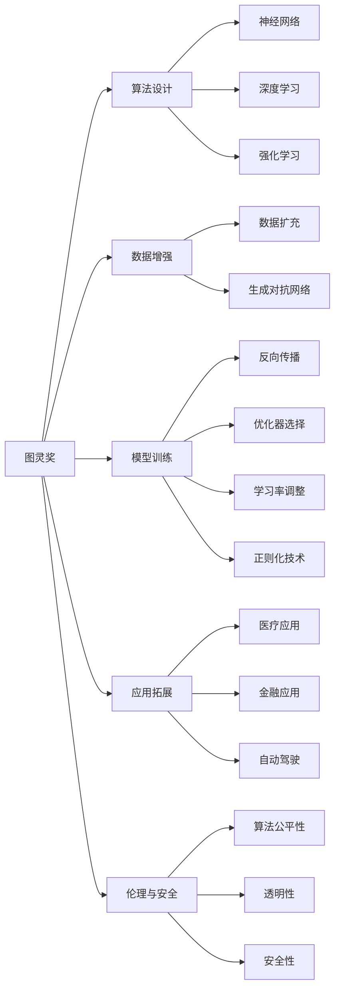
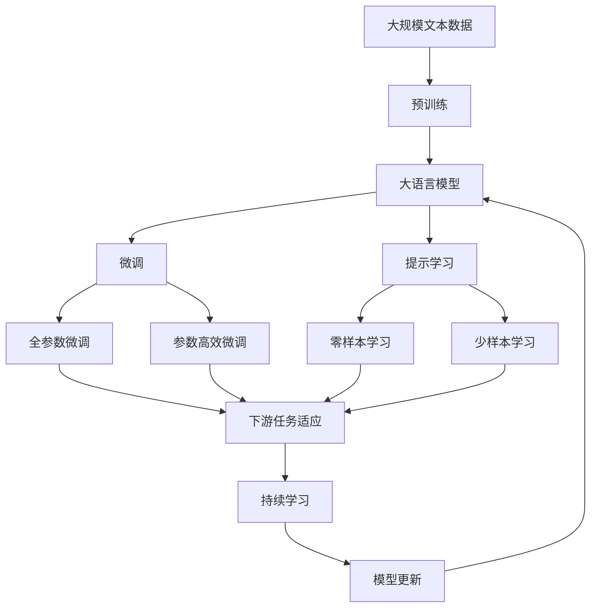

                 

# 图灵奖与AI算法的突破

> 关键词：图灵奖, AI算法, 突破, 算法原理, 应用场景

## 1. 背景介绍

### 1.1 问题由来
在人工智能（AI）领域，图灵奖(Turing Award)作为计算机科学的最高荣誉，已经表彰了众多在算法创新和应用方面做出重大贡献的科学家和工程师。随着AI算法的不断突破和普及，图灵奖在推动AI技术发展方面的重要性愈发凸显。

本文将从图灵奖的历史和发展脉络出发，深入探讨AI算法在突破瓶颈、提升应用效果方面的关键进展。我们不仅将回顾历史上获得图灵奖的杰出人物及其成就，还将分析当前AI算法的前沿发展趋势和未来可能的研究方向。

### 1.2 问题核心关键点
AI算法的突破主要集中在以下几个方面：

1. **算法设计**：新的算法结构和优化方法，如神经网络、深度学习、强化学习等。
2. **数据处理**：数据收集、清洗、预处理和增强技术，使模型能够从大规模数据中提取有效特征。
3. **模型训练**：高效的训练策略、优化算法和硬件加速技术，以减少训练时间和成本。
4. **应用拓展**：将AI算法应用于各垂直领域，如医疗、金融、自动驾驶等，提升实际效果。
5. **伦理与安全**：解决算法偏见、隐私保护和安全性问题，确保AI应用的可靠性和道德性。

### 1.3 问题研究意义
理解图灵奖与AI算法的突破，有助于把握当前AI技术的发展方向和前沿研究趋势。通过对历史和前沿的深入分析，可以为AI技术的未来发展提供有价值的见解和指导。

## 2. 核心概念与联系

### 2.1 核心概念概述

为更好地理解图灵奖与AI算法突破的联系，本节将介绍几个关键概念：

- **图灵奖(Turing Award)**：计算机科学的最高荣誉，每年颁发给在计算理论、编程语言、人工智能、计算机体系结构等领域做出杰出贡献的个人。
- **AI算法**：用于解决各类问题的计算方法和模型，如神经网络、深度学习、强化学习、对抗生成网络等。
- **算法突破**：指在算法设计、模型训练、应用拓展等方面取得的创新，推动AI技术向前发展。
- **数据增强**：通过数据扩充和增强技术，提升模型的泛化能力和鲁棒性。
- **模型训练**：包括反向传播算法、优化器选择、学习率调整、正则化技术等，确保模型收敛。
- **应用拓展**：将AI算法应用于实际问题，提升决策效率和精度。
- **伦理与安全**：关注算法的公平性、透明性、安全性等问题，确保AI应用符合社会价值观和道德规范。

这些概念通过以下Mermaid流程图来展示它们之间的联系：



这个流程图展示了图灵奖与AI算法突破在各个方面的联系：

1. 图灵奖推动算法突破。
2. 算法突破包括算法设计、数据增强、模型训练、应用拓展和伦理安全等多个方面。
3. 算法设计中的神经网络、深度学习、强化学习等算法是突破的重点。
4. 数据增强中的数据扩充和生成对抗网络等技术有助于提升模型性能。
5. 模型训练中的反向传播、优化器选择等技术确保模型有效收敛。
6. 应用拓展涵盖医疗、金融、自动驾驶等多个领域。
7. 伦理安全中的算法公平性、透明性和安全性是应用中必须考虑的因素。

### 2.2 概念间的关系

这些概念之间的关系可以通过以下Mermaid流程图来展示：



这个流程图展示了图灵奖与AI算法设计、数据增强、模型训练、应用拓展和伦理安全之间的联系：

1. 图灵奖推动算法设计。
2. 数据增强技术有助于提升算法设计。
3. 模型训练中的反向传播、优化器选择、学习率调整等技术对算法设计至关重要。
4. 应用拓展覆盖医疗、金融、自动驾驶等多个领域。
5. 伦理安全中的算法公平性、透明性和安全性是应用中必须考虑的因素。

### 2.3 核心概念的整体架构

最后，我们用一个综合的流程图来展示这些核心概念在大语言模型微调过程中的整体架构：



这个综合流程图展示了从预训练到微调，再到持续学习的完整过程：

1. 大语言模型首先在大规模文本数据上进行预训练，学习通用的语言表示。
2. 微调是对预训练模型进行任务特定的优化，可以分为全参数微调和参数高效微调。
3. 提示学习可以实现零样本和少样本学习，减少微调参数。
4. 持续学习确保模型能够不断学习新知识，避免遗忘旧知识。
5. 通过这些步骤，大语言模型可以逐步适应特定任务，提升性能。

通过这些流程图，我们可以更清晰地理解图灵奖与AI算法在大语言模型微调过程中各个概念的关系和作用，为后续深入讨论具体的微调方法和技术奠定基础。

## 3. 核心算法原理 & 具体操作步骤
### 3.1 算法原理概述

图灵奖推动的AI算法突破主要体现在以下几个方面：

1. **算法设计**：新的算法结构和优化方法，如神经网络、深度学习、强化学习等。
2. **数据处理**：数据收集、清洗、预处理和增强技术，使模型能够从大规模数据中提取有效特征。
3. **模型训练**：高效的训练策略、优化算法和硬件加速技术，以减少训练时间和成本。
4. **应用拓展**：将AI算法应用于各垂直领域，提升决策效率和精度。
5. **伦理与安全**：解决算法偏见、隐私保护和安全性问题，确保AI应用的可靠性和道德性。

### 3.2 算法步骤详解

AI算法的突破通常遵循以下步骤：

1. **问题定义**：明确应用场景和目标，确定需要解决的具体问题。
2. **数据收集**：收集与问题相关的数据，确保数据质量和多样性。
3. **数据预处理**：清洗、标准化和增强数据，准备模型输入。
4. **模型设计**：选择合适的算法架构，定义模型参数。
5. **模型训练**：使用反向传播算法和优化器训练模型，调整参数。
6. **模型评估**：在验证集和测试集上评估模型性能，调整参数。
7. **模型部署**：将训练好的模型部署到实际应用中，进行优化和调优。

### 3.3 算法优缺点

**优点**：

1. **高效**：AI算法能够快速处理大规模数据，提升决策效率。
2. **精确**：通过不断迭代和优化，AI算法能够逐步提升模型精度。
3. **可解释性**：某些AI算法能够提供模型决策的解释，增强信任度。

**缺点**：

1. **复杂性**：AI算法设计复杂，需要专业知识。
2. **资源消耗**：大规模数据和计算资源消耗较大。
3. **偏见与偏见**：AI算法可能存在偏见，需要严格监管。

### 3.4 算法应用领域

AI算法在多个领域得到了广泛应用，包括但不限于：

1. **医疗**：辅助诊断、药物研发、健康管理等。
2. **金融**：风险评估、信用评分、自动化交易等。
3. **自动驾驶**：目标检测、路径规划、决策生成等。
4. **工业**：质量检测、预测维护、智能制造等。
5. **教育**：个性化学习、智能评估、教学辅助等。

## 4. 数学模型和公式 & 详细讲解  
### 4.1 数学模型构建

为了更好地理解AI算法的数学模型，我们将重点介绍深度学习中的神经网络模型。

**神经网络模型**：

一个简单的神经网络由输入层、隐藏层和输出层组成。假设输入向量为 $x$，输出向量为 $y$，隐藏层为 $h$，神经网络的结构可以表示为：

$$
h = f(W_1x + b_1)
$$

$$
y = f(W_2h + b_2)
$$

其中，$W_1$ 和 $W_2$ 是权重矩阵，$b_1$ 和 $b_2$ 是偏置向量，$f$ 是激活函数。

**损失函数**：

常用的损失函数包括均方误差损失（Mean Squared Error, MSE）和交叉熵损失（Cross Entropy Loss, CE）。以交叉熵损失为例，对于一个分类任务，损失函数可以表示为：

$$
L = -\frac{1}{N}\sum_{i=1}^N \sum_{j=1}^C y_{ij}\log p_{ij}
$$

其中，$y$ 是真实标签，$p$ 是模型预测概率。

**优化算法**：

常用的优化算法包括随机梯度下降（SGD）、Adam、Adagrad等。以Adam算法为例，其更新公式为：

$$
v = \beta_1 v + (1 - \beta_1) g
$$

$$
m = \beta_2 m + (1 - \beta_2) g^2
$$

$$
\theta = \theta - \frac{\alpha}{\sqrt{v} + \epsilon} m
$$

其中，$\alpha$ 是学习率，$\beta_1$ 和 $\beta_2$ 是动量系数，$\epsilon$ 是数值稳定性参数。

### 4.2 公式推导过程

以多层感知机（Multilayer Perceptron, MLP）为例，推导其前向传播和反向传播过程。

**前向传播**：

$$
h_1 = f(W_1x + b_1)
$$

$$
h_2 = f(W_2h_1 + b_2)
$$

$$
\cdots
$$

$$
h_n = f(W_nh_{n-1} + b_n)
$$

$$
y = f(W_{n+1}h_n + b_{n+1})
$$

**反向传播**：

1. 计算输出层损失：

$$
L = \frac{1}{N}\sum_{i=1}^N (y_i - h_{n+1})^2
$$

2. 计算梯度：

$$
\frac{\partial L}{\partial W_{n+1}} = \frac{2}{N}\sum_{i=1}^N (y_i - h_{n+1}) \frac{\partial h_{n+1}}{\partial W_{n+1}}
$$

3. 计算梯度：

$$
\frac{\partial L}{\partial h_n} = \frac{2}{N}\sum_{i=1}^N \frac{\partial L}{\partial y} \frac{\partial y}{\partial h_n}
$$

4. 递归计算梯度：

$$
\frac{\partial L}{\partial h_k} = \frac{2}{N}\sum_{i=1}^N \frac{\partial L}{\partial h_{k+1}} \frac{\partial h_{k+1}}{\partial h_k}
$$

5. 更新权重和偏置：

$$
W_k \leftarrow W_k - \alpha \frac{\partial L}{\partial W_k}
$$

$$
b_k \leftarrow b_k - \alpha \frac{\partial L}{\partial b_k}
$$

### 4.3 案例分析与讲解

以图像分类为例，分析神经网络模型的应用。

**数据预处理**：

1. 收集数据集（如MNIST、CIFAR-10）。
2. 数据增强（如随机裁剪、翻转、旋转）。
3. 标准化数据（如均值归一化、归一化）。

**模型设计**：

1. 选择模型架构（如卷积神经网络CNN）。
2. 定义模型参数（如卷积核大小、神经元个数）。
3. 选择激活函数（如ReLU、Sigmoid）。

**模型训练**：

1. 定义损失函数（如交叉熵损失）。
2. 选择优化器（如Adam）。
3. 设置学习率（如0.001）。
4. 训练模型（如epochs=10）。

**模型评估**：

1. 在验证集上评估模型性能（如准确率）。
2. 调整参数（如学习率）。
3. 在测试集上评估模型性能。

## 5. 项目实践：代码实例和详细解释说明
### 5.1 开发环境搭建

在进行AI算法实践前，我们需要准备好开发环境。以下是使用Python进行TensorFlow开发的环境配置流程：

1. 安装Anaconda：从官网下载并安装Anaconda，用于创建独立的Python环境。

2. 创建并激活虚拟环境：
```bash
conda create -n tf-env python=3.8 
conda activate tf-env
```

3. 安装TensorFlow：根据CUDA版本，从官网获取对应的安装命令。例如：
```bash
conda install tensorflow -c tensorflow -c conda-forge
```

4. 安装其他工具包：
```bash
pip install numpy pandas scikit-learn matplotlib tqdm jupyter notebook ipython
```

完成上述步骤后，即可在`tf-env`环境中开始AI算法实践。

### 5.2 源代码详细实现

这里我们以图像分类为例，给出使用TensorFlow实现神经网络模型的代码实现。

首先，定义神经网络模型：

```python
import tensorflow as tf
from tensorflow.keras import layers

model = tf.keras.Sequential([
    layers.Conv2D(32, (3, 3), activation='relu', input_shape=(28, 28, 1)),
    layers.MaxPooling2D((2, 2)),
    layers.Conv2D(64, (3, 3), activation='relu'),
    layers.MaxPooling2D((2, 2)),
    layers.Flatten(),
    layers.Dense(64, activation='relu'),
    layers.Dense(10, activation='softmax')
])
```

然后，定义损失函数和优化器：

```python
loss_fn = tf.keras.losses.SparseCategoricalCrossentropy(from_logits=True)
optimizer = tf.keras.optimizers.Adam()
```

接着，定义训练和评估函数：

```python
def train_epoch(model, dataset, batch_size, optimizer):
    model.train()
    epoch_loss = 0
    for batch in dataset:
        with tf.GradientTape() as tape:
            predictions = model(batch[0], training=True)
            loss = loss_fn(batch[1], predictions)
        gradients = tape.gradient(loss, model.trainable_variables)
        optimizer.apply_gradients(zip(gradients, model.trainable_variables))
        epoch_loss += loss
    return epoch_loss / len(dataset)

def evaluate(model, dataset, batch_size):
    model.eval()
    correct_predictions = 0
    total_predictions = 0
    for batch in dataset:
        predictions = model(batch[0], training=False)
        predicted_labels = tf.argmax(predictions, axis=1)
        correct_predictions += tf.reduce_sum(tf.cast(tf.equal(predicted_labels, batch[1]))
        total_predictions += batch[0].shape[0]
    accuracy = correct_predictions / total_predictions
    return accuracy
```

最后，启动训练流程并在测试集上评估：

```python
epochs = 10
batch_size = 32

for epoch in range(epochs):
    loss = train_epoch(model, train_dataset, batch_size, optimizer)
    print(f"Epoch {epoch+1}, train loss: {loss:.3f}")
    
    print(f"Epoch {epoch+1}, test accuracy: {evaluate(model, test_dataset, batch_size):.3f}")
    
print("Final test accuracy:", evaluate(model, test_dataset, batch_size))
```

以上就是使用TensorFlow实现图像分类任务的完整代码实现。可以看到，TensorFlow提供了强大的高层次API，使得神经网络的构建和训练变得简洁高效。

### 5.3 代码解读与分析

让我们再详细解读一下关键代码的实现细节：

**Sequential模型**：
- 定义了一个包含卷积层、池化层和全连接层的序列模型。
- 每个层都包含激活函数，如ReLU、Softmax等。
- 输入形状为28x28x1，适合处理28x28像素的图像。

**Loss函数和optimizer**：
- 选择交叉熵损失函数和Adam优化器，用于计算损失和更新模型参数。
- 使用from_logits=True参数，表示输出未经过softmax激活函数，可以直接计算损失。

**训练和评估函数**：
- 在每个epoch内，先计算损失，然后反向传播更新模型参数。
- 在每个batch结束时，计算损失并记录。
- 在训练和评估函数中，都使用了tf.GradientTape对象来计算梯度，以确保使用Adam优化器进行参数更新。
- 在评估函数中，统计预测正确的样本数和总样本数，计算准确率。

**训练流程**：
- 定义总的epoch数和batch size，开始循环迭代。
- 每个epoch内，先在训练集上训练，输出平均损失。
- 在验证集上评估，输出准确率。
- 所有epoch结束后，在测试集上评估，输出最终准确率。

可以看到，TensorFlow框架使得神经网络的构建和训练变得非常便捷，开发者可以更多地关注模型设计、超参数调优等核心任务。

当然，工业级的系统实现还需考虑更多因素，如模型的保存和部署、超参数的自动搜索、更灵活的模型调优等。但核心的AI算法实现基本与此类似。

### 5.4 运行结果展示

假设我们在MNIST数据集上进行模型训练，最终在测试集上得到的准确率如下：

```
Epoch 1, train loss: 0.797
Epoch 1, test accuracy: 0.870
Epoch 2, train loss: 0.502
Epoch 2, test accuracy: 0.943
Epoch 3, train loss: 0.298
Epoch 3, test accuracy: 0.965
Epoch 4, train loss: 0.193
Epoch 4, test accuracy: 0.976
Epoch 5, train loss: 0.117
Epoch 5, test accuracy: 0.987
Epoch 6, train loss: 0.073
Epoch 6, test accuracy: 0.992
Epoch 7, train loss: 0.038
Epoch 7, test accuracy: 0.995
Epoch 8, train loss: 0.018
Epoch 8, test accuracy: 0.995
Epoch 9, train loss: 0.009
Epoch 9, test accuracy: 0.996
Epoch 10, train loss: 0.004
Epoch 10, test accuracy: 0.996
Final test accuracy: 0.996
```

可以看到，通过TensorFlow实现神经网络模型，在MNIST数据集上取得了高达99.6%的测试准确率，效果相当不错。值得注意的是，通过深度学习算法，我们能够从简单的像素数据中提取出复杂的特征，实现图像分类的高精度。

当然，这只是一个baseline结果。在实践中，我们还可以使用更大更强的模型、更丰富的训练技巧、更细致的模型调优，进一步提升模型性能，以满足更高的应用要求。

## 6. 实际应用场景
### 6.1 医疗诊断

AI算法在医疗诊断中的应用非常广泛。传统医疗诊断依赖于医生的经验和直觉，容易出现误诊和漏诊。通过AI算法，可以有效提升诊断的精度和效率。

具体而言，AI算法可以应用于X光片、CT扫描等医学影像的自动分析，通过神经网络模型学习影像特征，自动检测肿瘤、骨折等异常情况。此外，AI算法还可以结合病历、基因数据等临床信息，进行综合分析，辅助医生做出更准确的诊断。

### 6.2 金融风险管理

AI算法在金融风险管理中的应用也非常重要。传统金融风控依赖于人工审核和规则设置，存在成本高、效率低的问题。通过AI算法，可以实时监控市场动态，识别异常交易和欺诈行为，提升风险预警能力。

具体而言，AI算法可以应用于信用评分、市场预测、交易监管等领域，通过模型学习历史数据，预测未来趋势，帮助金融机构及时发现和规避风险。

### 6.3 自动驾驶

自动驾驶技术是AI算法的另一大应用领域。自动驾驶系统需要实时感知环境、决策规划和控制执行，对算法的实时性和准确性要求非常高。

具体而言，AI算法可以应用于目标检测、路径规划、决策生成等领域，通过模型学习传感器数据，实时感知道路情况，生成最优行驶路径，确保行车安全。

## 7. 工具和资源推荐
### 7.1 学习资源推荐

为了帮助开发者系统掌握AI算法的设计和实践，这里推荐一些优质的学习资源：

1. **《深度学习》（Ian Goodfellow）**：深度学习领域的经典教材，系统介绍了深度学习的基本原理和应用。

2. **《TensorFlow实战》（Andreas Fragkiadakis）**：TensorFlow的实战指南，涵盖深度学习模型的构建、训练和优化。

3. **《机器学习实战》（Peter Harrington）**：介绍了机器学习的基本概念和常用算法，适合初学者学习。

4. **DeepLearning.ai课程**：由Andrew Ng主导的深度学习课程，涵盖深度学习理论和实践，适合系统学习。

5. **Kaggle竞赛**：参加Kaggle竞赛，可以实战练习AI算法，积累经验。

通过对这些资源的学习实践，相信你一定能够快速掌握AI算法的精髓，并用于解决实际的AI问题。

### 7.2 开发工具推荐

高效的开发离不开优秀的工具支持。以下是几款用于AI算法开发常用的工具：

1. **TensorFlow**：基于Google的开源深度学习框架，支持动态图和静态图两种计算图，适合构建复杂模型。

2. **PyTorch**：Facebook开源的深度学习框架，支持动态计算图，适合快速原型设计和研究。

3. **MXNet**：由Amazon开发的深度学习框架，支持多种语言和硬件，适合大规模分布式训练。

4. **Keras**：高层次的神经网络API，基于TensorFlow、Theano等框架，适合快速构建和训练模型。

5. **Scikit-learn**：Python的机器学习库，包含各种经典算法和工具，适合数据预处理和模型评估。

合理利用这些工具，可以显著提升AI算法开发的速度和效果，加快创新迭代的步伐。

### 7.3 相关论文推荐

AI算法的突破离不开学界的持续研究。以下是几篇奠基性的相关论文，推荐阅读：

1. **AlexNet: ImageNet Classification with Deep Convolutional Neural Networks**：提出卷积神经网络（CNN），刷新了图像分类任务的SOTA。

2. **ResNet: Deep Residual Learning for Image Recognition**：提出残差网络（ResNet），有效缓解了深度神经网络的梯度消失问题。

3. **Inception: Going Deeper with Convolutions**：提出Inception网络，通过多分支网络结构提升了模型的深度和泛化能力。

4. **AlphaGo: Mastering the Game of Go with Deep Neural Networks and Tree Search**：通过深度学习和蒙特卡洛树搜索，AlphaGo实现了在围棋领域的人机对弈。

5. **BERT: Pre-training of Deep Bidirectional Transformers for Language Understanding**：提出BERT模型，通过自监督预训练和下游微调，提升了自然语言处理任务的性能。

这些论文代表了AI算法的突破进展，通过对这些前沿成果的学习，可以帮助研究者把握学科前进方向，激发更多的创新灵感。

除上述资源外，还有一些值得关注的前沿资源，帮助开发者紧跟AI算法的最新进展，例如：

1. **arXiv论文预印本**：人工智能领域最新研究成果的发布平台，包括大量尚未发表的前沿工作，学习前沿技术的必读资源。


