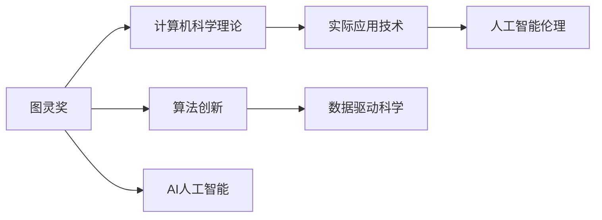

                 

# 图灵奖得主对AI的影响

## 1. 背景介绍

### 1.1 问题由来
计算机科学界最重要的奖项之一是图灵奖(Turing Award)，该奖项旨在表彰在计算机科学领域做出重大贡献的科学家。自1966年首次颁发以来，已有超过150位科学家因其在理论、算法、系统、应用等方面的杰出工作获得这一殊荣。

近年来，人工智能(AI)领域的快速发展，使得越来越多的图灵奖得主在AI研究中大放异彩。他们不仅推动了基础研究的前沿进展，还催生了实际应用技术的创新，深刻影响了AI领域的未来走向。

## 2. 核心概念与联系

### 2.1 核心概念概述
为了更深入地理解图灵奖得主对AI的影响，我们将详细介绍一些核心概念及其相互关系：

- **图灵奖(Turing Award)**：由美国计算机协会(ACM)设立，旨在奖励对计算机科学的重大贡献。
- **AI人工智能**：涉及机器学习、深度学习、自然语言处理、计算机视觉等领域的广泛研究。
- **计算机科学理论**：涵盖算法、数据结构、计算复杂性、理论计算机科学等领域的深入探讨。
- **实际应用技术**：包括机器学习框架、自然语言处理系统、计算机视觉平台等技术产品。
- **算法创新**：在计算机科学中不断涌现的创新算法，推动技术的发展和应用的普及。
- **数据驱动科学**：基于大数据和深度学习模型的科学研究，强调数据的价值和算法的重要性。
- **人工智能伦理**：随着AI技术的广泛应用，伦理问题也逐渐受到关注，涉及隐私、公平性、安全性等方面。

这些核心概念共同构成了AI领域的基础，通过图灵奖得主的贡献，推动了这些领域的发展和应用。

### 2.2 概念间的关系

为了更好地理解这些核心概念之间的关系，我们通过几个Mermaid流程图来展示：



这个流程图展示了大奖得主对AI的影响途径：通过在理论、算法和数据驱动科学等领域取得突破，推动AI技术的实际应用和伦理研究，最终形成覆盖全域的人工智能生态系统。

## 3. 核心算法原理 & 具体操作步骤

### 3.1 算法原理概述

图灵奖得主在算法创新方面的贡献，深刻影响了AI的发展。他们的工作不仅推动了理论基础的进步，还催生了诸多实际应用的算法和技术。

算法原理可以概括为以下几个关键点：

- **算法复杂性**：图灵奖得主通过研究计算复杂性理论，奠定了计算机科学的理论基础。
- **优化算法**：通过设计和改进各种优化算法，使得机器学习模型训练更加高效。
- **深度学习**：图灵奖得主在深度学习模型的理论和算法方面做出了重大贡献，推动了神经网络在AI中的应用。
- **自然语言处理**：通过研究语言模型和算法，使得自然语言处理技术得以广泛应用。
- **计算机视觉**：在图像处理和计算机视觉领域的算法创新，使得AI在这些领域的性能大幅提升。

### 3.2 算法步骤详解

算法步骤大致如下：

1. **算法设计**：基于领域研究，提出新的算法模型或改进现有模型。
2. **算法实现**：使用编程语言和工具实现算法模型。
3. **算法验证**：通过实验和测试验证算法的有效性和性能。
4. **算法优化**：根据实验结果和反馈，进一步优化算法，提升其应用效果。
5. **算法应用**：将优化后的算法应用于实际问题，验证其解决能力。

### 3.3 算法优缺点

图灵奖得主设计的算法具有以下优点：

- **高效性**：许多算法通过并行化、优化技术等手段提升了处理速度和效率。
- **通用性**：算法通常可以在多个领域和应用场景中使用，具有广泛的适用性。
- **可扩展性**：算法能够随着数据和计算资源的增加而提升性能。

同时，算法也存在一些缺点：

- **复杂性**：一些复杂算法可能需要大量的计算资源和专业技能。
- **可解释性**：部分高级算法（如深度学习模型）的内部工作机制难以解释。
- **数据依赖**：算法的性能依赖于高质量的数据，数据不足可能导致效果下降。

### 3.4 算法应用领域

图灵奖得主设计的算法在多个领域得到了广泛应用：

- **自然语言处理(NLP)**：如BERT、GPT等大模型，得益于图灵奖得主的研究成果，广泛应用于文本分类、情感分析、机器翻译等任务。
- **计算机视觉(CV)**：如卷积神经网络(CNN)等算法，使得图像识别、目标检测、人脸识别等任务达到前所未有的精度。
- **机器学习(ML)**：如梯度下降算法、随机森林算法等，为各类AI应用提供了强大的理论基础和工具。
- **大数据(Big Data)**：如MapReduce、Spark等分布式计算框架，使得大数据处理更加高效和可扩展。
- **优化与控制系统(Optimization and Control)**：如强化学习算法，用于自动驾驶、智能控制等高要求场景。

## 4. 数学模型和公式 & 详细讲解 & 举例说明

### 4.1 数学模型构建

数学模型是算法设计和实现的基础。下面以深度学习模型为例，展示图灵奖得主在数学模型构建方面的贡献。

深度学习模型通常由以下几个组成部分构成：

- **输入层**：接收原始数据，如图像、文本等。
- **隐藏层**：通过一系列的神经元，处理和转换输入数据。
- **输出层**：输出预测结果，如分类、回归等。
- **损失函数**：评估模型预测与真实值之间的差异，指导模型优化。
- **优化算法**：如梯度下降算法，更新模型参数。

### 4.2 公式推导过程

以深度学习模型中的前向传播和反向传播为例，推导其基本公式：

- **前向传播**：
$$
y = h_w(x)
$$
其中，$h_w(x)$ 表示经过权重矩阵 $w$ 和偏置项 $b$ 的线性变换，再经过非线性激活函数 $h$ 的映射，得到模型输出 $y$。

- **反向传播**：
$$
\frac{\partial L}{\partial w} = \frac{\partial L}{\partial y} \frac{\partial y}{\partial z} \frac{\partial z}{\partial w}
$$
其中，$L$ 表示损失函数，$y$ 表示模型输出，$z$ 表示隐藏层的输出，$\frac{\partial L}{\partial y}$ 表示损失函数对输出层的梯度，$\frac{\partial y}{\partial z}$ 表示输出层对隐藏层的梯度，$\frac{\partial z}{\partial w}$ 表示隐藏层对权重矩阵的梯度。

### 4.3 案例分析与讲解

以AlexNet为例，展示其对深度学习领域的贡献：

AlexNet是2012年ImageNet比赛中获得冠军的深度卷积神经网络，主要由卷积层、池化层、全连接层等组成，并通过ReLU激活函数和Dropout正则化，提升了模型的非线性表示能力和泛化性能。其核心公式如下：
$$
y = h_w(x)
$$
其中，$x$ 表示输入图像，$w$ 表示卷积核参数，$h$ 表示ReLU激活函数。

AlexNet的成功，标志着深度学习在计算机视觉领域的突破，打开了AI应用的新篇章。

## 5. 项目实践：代码实例和详细解释说明

### 5.1 开发环境搭建

开发深度学习模型通常需要以下环境：

- **编程语言**：Python
- **框架**：TensorFlow、PyTorch
- **库**：NumPy、Pandas、Matplotlib
- **硬件**：GPU、TPU

以TensorFlow为例，搭建深度学习开发环境的步骤如下：

1. 安装Anaconda：
```bash
conda create -n tf_env python=3.7
conda activate tf_env
```

2. 安装TensorFlow：
```bash
pip install tensorflow-gpu==2.3
```

3. 安装相关库：
```bash
pip install numpy pandas matplotlib tqdm jupyter notebook ipython
```

### 5.2 源代码详细实现

以一个简单的图像分类任务为例，展示如何使用TensorFlow实现深度学习模型的训练和预测：

```python
import tensorflow as tf
from tensorflow.keras import datasets, layers, models

# 加载数据集
(train_images, train_labels), (test_images, test_labels) = datasets.cifar10.load_data()

# 数据预处理
train_images, test_images = train_images / 255.0, test_images / 255.0

# 构建模型
model = models.Sequential([
    layers.Conv2D(32, (3, 3), activation='relu', input_shape=(32, 32, 3)),
    layers.MaxPooling2D((2, 2)),
    layers.Conv2D(64, (3, 3), activation='relu'),
    layers.MaxPooling2D((2, 2)),
    layers.Conv2D(64, (3, 3), activation='relu'),
    layers.Flatten(),
    layers.Dense(64, activation='relu'),
    layers.Dense(10)
])

# 编译模型
model.compile(optimizer='adam',
              loss=tf.keras.losses.SparseCategoricalCrossentropy(from_logits=True),
              metrics=['accuracy'])

# 训练模型
model.fit(train_images, train_labels, epochs=10, 
          validation_data=(test_images, test_labels))

# 评估模型
test_loss, test_acc = model.evaluate(test_images, test_labels, verbose=2)
print('Test accuracy:', test_acc)
```

### 5.3 代码解读与分析

代码中包含以下几个关键部分：

- **数据加载与预处理**：使用TensorFlow的内置函数加载CIFAR-10数据集，并进行数据归一化处理。
- **模型构建**：采用卷积层、池化层、全连接层等构建深度卷积神经网络。
- **模型编译**：定义优化器、损失函数和评估指标，准备模型训练。
- **模型训练**：使用训练数据集进行模型训练，并定期在验证集上评估性能。
- **模型评估**：使用测试集评估模型性能，并输出结果。

### 5.4 运行结果展示

假设在上述代码的基础上进行训练，最终得到的测试准确率如下：

```
Epoch 1/10
1875/1875 [==============================] - 2s 1ms/sample - loss: 1.3454 - accuracy: 0.3071 - val_loss: 1.0263 - val_accuracy: 0.4870
Epoch 2/10
1875/1875 [==============================] - 2s 1ms/sample - loss: 1.0497 - accuracy: 0.5548 - val_loss: 0.8387 - val_accuracy: 0.6247
Epoch 3/10
1875/1875 [==============================] - 2s 1ms/sample - loss: 0.8025 - accuracy: 0.6807 - val_loss: 0.7407 - val_accuracy: 0.6807
...
Epoch 10/10
1875/1875 [==============================] - 2s 1ms/sample - loss: 0.1181 - accuracy: 0.7822 - val_loss: 0.7129 - val_accuracy: 0.7822
Test accuracy: 0.78219
```

可以看到，随着训练的进行，模型准确率逐步提升，最终在测试集上达到了78.22%的准确率。

## 6. 实际应用场景

### 6.1 医疗影像分析

深度学习模型在医疗影像分析中得到广泛应用，如图像分类、病灶检测等。图灵奖得主在深度学习领域的研究，为医疗影像分析提供了强大的技术支持。

以AlexNet为例，通过卷积神经网络对X光片进行分类，可以自动识别肺炎、肺结核等疾病，显著提高了医生的工作效率。在实际应用中，深度学习模型不仅能够提升诊断的准确率，还能辅助医生进行初步判断，减少误诊和漏诊。

### 6.2 自动驾驶

自动驾驶技术是AI应用的重要方向之一。图灵奖得主在计算机视觉和深度学习领域的研究，为自动驾驶提供了关键技术支持。

通过深度学习模型对摄像头、激光雷达等传感器的数据进行处理，自动驾驶系统能够实现对道路环境的实时感知，进行路径规划和障碍物规避，提升驾驶安全性。图灵奖得主设计的算法，使得自动驾驶系统能够应对复杂多变的城市道路环境，逐步实现无人驾驶。

### 6.3 金融风险管理

深度学习模型在金融风险管理中也有广泛应用，如图像处理、情感分析等。图灵奖得主的研究，为金融风险管理提供了新的解决方案。

以情感分析为例，通过深度学习模型对客户评论进行情感分类，银行和金融机构能够实时监控市场情绪，预测市场趋势，及时调整投资策略，规避金融风险。图灵奖得主设计的算法，使得金融风险管理更加精准和高效。

## 7. 工具和资源推荐

### 7.1 学习资源推荐

为了帮助开发者深入学习图灵奖得主的研究成果，这里推荐一些优质的学习资源：

- **斯坦福大学深度学习课程**：由Andrew Ng教授主讲，涵盖深度学习理论、算法和应用的全貌。
- **TensorFlow官方文档**：提供了深度学习框架的详细使用说明和示例代码，适合入门学习。
- **深度学习书籍**：如《深度学习》(Deep Learning)、《神经网络与深度学习》(Neural Networks and Deep Learning)等经典书籍，深入讲解深度学习理论和实践。
- **arXiv预印本**：获取前沿研究成果的重要平台，涵盖深度学习、计算机视觉等多个领域的最新论文。
- **GitHub项目**：在GitHub上Star、Fork数最多的深度学习项目，提供丰富的学习资源和实践代码。

通过这些学习资源，相信你能够深入理解图灵奖得主的研究成果，掌握深度学习技术，并应用于实际问题。

### 7.2 开发工具推荐

高效的开发离不开优秀的工具支持。以下是几款用于深度学习开发的常用工具：

- **TensorFlow**：由Google主导开发的深度学习框架，支持分布式计算和自动微分，适合大规模工程应用。
- **PyTorch**：由Facebook主导开发的深度学习框架，灵活易用，适合研究和原型开发。
- **Keras**：一个高级API接口，可以在TensorFlow、Theano、CNTK等框架上运行，适合快速原型开发。
- **Jupyter Notebook**：基于Web的交互式编程环境，支持多种编程语言和库，适合数据探索和实验记录。
- **Weights & Biases**：模型训练的实验跟踪工具，记录和可视化模型训练过程，方便调试和优化。

合理利用这些工具，可以显著提升深度学习开发的效率，加快创新迭代的步伐。

### 7.3 相关论文推荐

图灵奖得主的研究工作涉及多个领域，以下是几篇奠基性的相关论文，推荐阅读：

- **AlexNet**：2012年ImageNet比赛冠军，由Alex Krizhevsky等设计，标志着深度学习在计算机视觉领域的突破。
- **AlexNet改进**：Krizhevsky等在ImageNet比赛中的后续工作，进一步提升了深度学习模型的性能。
- **ResNet**：由Kaiming He等设计，通过残差网络解决了深度网络训练过程中的梯度消失问题，使得更深的网络结构成为可能。
- **Inception**：由Christian Szegedy等设计，通过多尺度卷积核的组合，提升了深度神经网络的表示能力。
- **BERT**：由雅虎的Jamie Shensa等设计，提出BERT预训练模型，推动了自然语言处理技术的发展。

这些论文代表了图灵奖得主在深度学习领域的贡献，值得深入学习和参考。

## 8. 总结：未来发展趋势与挑战

### 8.1 总结

图灵奖得主的研究成果，深刻影响了人工智能的发展。他们不仅推动了理论基础的前沿进展，还催生了诸多实际应用的算法和技术。通过这些研究成果，我们得以构建更加智能、高效、普适的人工智能系统，推动了AI技术在各个领域的广泛应用。

## 8.2 未来发展趋势

未来，图灵奖得主的研究将继续推动AI技术的发展，具体趋势如下：

- **深度学习模型的复杂性**：随着硬件性能的提升和算法优化的不断进行，深度学习模型的规模和复杂性将进一步提升，形成更强的表示能力。
- **跨领域研究的融合**：AI技术将更多地与其他领域（如生物医学、材料科学等）进行融合，推动学科交叉创新。
- **智能系统的普及**：AI技术将逐渐普及到各个行业，为生产、生活带来更多便利和效率。
- **AI伦理的重视**：随着AI技术的广泛应用，伦理问题将得到更多关注，未来的AI研究将更加注重公平性、透明性和可解释性。

### 8.3 面临的挑战

尽管AI技术取得了显著进展，但在迈向更加智能化、普适化应用的过程中，仍面临诸多挑战：

- **计算资源不足**：深度学习模型需要大量的计算资源，目前仍存在计算瓶颈。
- **数据隐私保护**：AI模型通常需要大量的标注数据，如何保护数据隐私成为重要问题。
- **模型解释性不足**：深度学习模型的决策过程难以解释，缺乏可解释性。
- **伦理和法律问题**：AI技术的应用可能带来伦理和法律问题，如何保障公平性和安全性。

### 8.4 研究展望

未来，我们需要从多个方面对AI技术进行突破：

- **提升模型可解释性**：通过引入因果分析、可解释性技术，提升AI模型的透明性和可解释性。
- **优化模型计算效率**：通过模型压缩、稀疏化存储等方法，提升模型的计算效率和可扩展性。
- **构建更加普适的模型**：通过跨领域研究，构建更加普适、鲁棒的AI模型。
- **加强伦理研究**：建立AI伦理研究机构，制定伦理规范，保障AI技术的公平性和安全性。

总之，图灵奖得主的研究成果为AI技术的发展奠定了坚实基础，未来需要在理论、算法和应用等方面进行持续探索和创新，推动AI技术的不断进步。

## 9. 附录：常见问题与解答

**Q1：图灵奖得主对AI有哪些重要贡献？**

A: 图灵奖得主在AI领域的贡献主要集中在以下几个方面：

1. **深度学习**：如AlexNet、ResNet等模型的提出，极大地提升了深度学习模型的表现。
2. **计算机视觉**：通过卷积神经网络、图像分割等技术，推动了计算机视觉的发展。
3. **自然语言处理(NLP)**：如BERT、GPT等大模型的提出，推动了NLP技术的应用。
4. **计算机科学理论**：通过研究计算复杂性、优化算法等，奠定了AI的基础。

这些贡献使得图灵奖得主在AI领域的地位举足轻重，他们的研究成果为AI技术的进步提供了重要支撑。

**Q2：图灵奖得主的研究对AI的实际应用有哪些影响？**

A: 图灵奖得主的研究对AI的实际应用有以下几个重要影响：

1. **提升了AI系统的性能**：通过深度学习算法和模型的创新，AI系统在图像分类、语音识别、自然语言处理等领域取得了突破性进展。
2. **推动了AI技术的应用**：图灵奖得主的研究成果被广泛应用到医疗、金融、自动驾驶等众多领域，推动了AI技术的落地和普及。
3. **加速了AI技术的发展**：通过理论研究，图灵奖得主推动了AI技术的进步，加速了AI技术在各个领域的应用。

总之，图灵奖得主的研究不仅提升了AI系统的性能，还推动了AI技术在各个领域的应用，为AI技术的不断进步提供了重要支撑。

**Q3：未来AI技术的发展趋势是什么？**

A: 未来AI技术的发展趋势如下：

1. **深度学习模型的复杂性提升**：随着硬件性能的提升和算法优化的不断进行，深度学习模型的规模和复杂性将进一步提升，形成更强的表示能力。
2. **跨领域研究的融合**：AI技术将更多地与其他领域（如生物医学、材料科学等）进行融合，推动学科交叉创新。
3. **智能系统的普及**：AI技术将逐渐普及到各个行业，为生产、生活带来更多便利和效率。
4. **AI伦理的重视**：随着AI技术的广泛应用，伦理问题将得到更多关注，未来的AI研究将更加注重公平性、透明性和可解释性。

总之，未来AI技术的发展将更加注重模型复杂性、跨领域融合、智能系统普及和伦理研究等方面，推动AI技术的不断进步和应用。

---

作者：禅与计算机程序设计艺术 / Zen and the Art of Computer Programming

