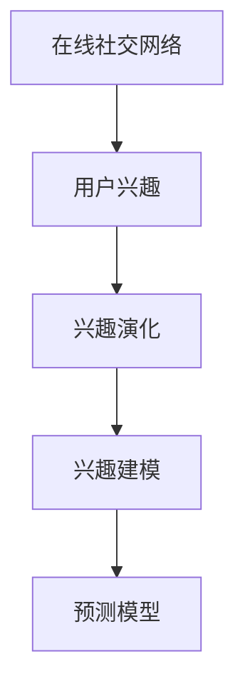

                 

# 在线社交网络中用户兴趣演化分析与建模研究

## 1. 背景介绍

在信息爆炸的互联网时代，社交网络已经成为了连接亿万用户的主要平台。在线社交网络（Online Social Network，OSN）不仅提供了用户之间交流互动的场所，更是用户分享信息、表达自我、获取信息的重要渠道。用户通过社交网络关注感兴趣的内容、互动，形成了独特的社交行为模式和兴趣偏好。这些兴趣演化的过程不仅关乎用户的个性化体验，也影响到社交网络的算法推荐、内容推送、广告投放等业务。

因此，深入分析用户兴趣的演化机制，构建精准的兴趣模型，对于提升社交网络的个性化服务水平，优化内容推荐效果，提升用户体验，具有重要意义。本文旨在探究在线社交网络中用户兴趣演化的规律，提出一套系统化的兴趣建模方法，以期为社交网络的业务优化提供理论与技术支持。

## 2. 核心概念与联系

### 2.1 核心概念概述

在探讨用户兴趣演化及其建模之前，我们首先介绍几个核心概念：

- **在线社交网络（Online Social Network，OSN）**：指通过互联网连接起来的，具有社交属性和信息共享功能的网络平台，如微博、微信、Facebook、Twitter等。用户通过这些平台发布状态、分享图片、评论互动，构建自己的社交关系网络。

- **用户兴趣（User Interest）**：指用户对特定内容或活动的喜好和偏好，可以体现为关注的对象、点赞的次数、评论的内容等。用户的兴趣随着时间和社交环境的变化而变化，通过模型可以预测用户兴趣的变化趋势。

- **兴趣演化（Interest Evolution）**：指用户兴趣随着时间的推移、社交行为的变化而发生改变的过程。兴趣演化是动态的，受用户自身的心理状态、社交环境、外界环境等因素的影响。

- **兴趣建模（Interest Modeling）**：通过建立数学模型或机器学习模型，刻画用户兴趣的特征和变化规律，用于预测用户的兴趣演变，指导推荐系统的个性化服务。

### 2.2 核心概念间的关系

上述核心概念间的关系如图示，展示了用户兴趣演化和建模的基本框架：



从用户到兴趣，再到兴趣的演化和建模，最后用于兴趣预测，形成一个闭环。兴趣演化分析与建模的核心目标是基于历史行为数据，学习用户兴趣的变化规律，构建精准的兴趣模型，为个性化服务提供有力支持。

## 3. 核心算法原理 & 具体操作步骤

### 3.1 算法原理概述

用户兴趣演化分析与建模的核心算法，主要基于以下两个基本原理：

1. **动态时间序列分析（Dynamic Time Series Analysis）**：通过时序数据的学习，分析用户行为模式的变化趋势，捕捉兴趣演化的周期性和动态性。

2. **协同过滤推荐（Collaborative Filtering Recommendation）**：通过用户行为数据的相似性匹配，预测用户对未交互过的内容的兴趣，提升个性化推荐的效果。

### 3.2 算法步骤详解

基于上述原理，用户兴趣演化分析与建模的主要步骤包括：

1. **数据收集与预处理**：
   - 收集用户的历史行为数据，如点赞、评论、分享等。
   - 对数据进行清洗、去重、归一化处理，生成时序数据集。

2. **兴趣演化建模**：
   - 采用动态时间序列分析方法，如ARIMA模型、LSTM模型等，分析用户兴趣演化的趋势。
   - 利用协同过滤推荐算法，如基于矩阵分解的推荐算法（如ALS）、基于图神经网络的推荐算法等，构建兴趣预测模型。

3. **模型评估与优化**：
   - 使用交叉验证、均方误差等评估指标，对模型进行验证和优化。
   - 根据模型性能调整超参数，如学习率、正则化系数等。

4. **实际应用**：
   - 将构建的兴趣预测模型应用到社交网络的推荐系统中，进行个性化推荐。
   - 实时监测模型的效果，根据反馈调整模型参数，不断优化推荐效果。

### 3.3 算法优缺点

**优点**：
- 动态时间序列分析方法能够捕捉兴趣演化的动态性，更贴合用户行为的变化规律。
- 协同过滤推荐算法能够利用用户历史行为数据，预测用户对新内容的兴趣，提升个性化推荐的准确性。
- 模型结合了时序分析和协同过滤推荐，能够提供更全面的用户兴趣理解。

**缺点**：
- 数据依赖性较强，需要大量的历史行为数据才能训练有效的模型。
- 模型训练复杂度高，需要处理大规模数据和高维特征，计算成本较高。
- 模型可解释性不足，用户难以理解其决策逻辑，存在一定的黑箱问题。

### 3.4 算法应用领域

用户兴趣演化分析与建模算法主要应用于以下领域：

- **个性化推荐系统**：如Netflix、Amazon等电商平台的商品推荐，Spotify等音乐平台的曲目推荐，微博、微信等社交平台的兴趣推荐。
- **广告投放优化**：根据用户兴趣动态调整广告内容和投放策略，提升广告效果。
- **用户行为分析**：分析用户的行为模式，提供用户画像，指导个性化营销策略的制定。

## 4. 数学模型和公式 & 详细讲解  
### 4.1 数学模型构建

本节将使用数学语言对用户兴趣演化分析与建模的数学模型进行更加严格的刻画。

设 $t$ 为时间，$x_t$ 为用户在时间 $t$ 的行为数据，如点赞、评论等。用户兴趣演化可以用时间序列 $I(t)$ 来表示，$I(t)$ 定义为：

$$
I(t) = \sum_{i=1}^{t} f(x_i) \times g(t-i)
$$

其中，$f(x_i)$ 表示行为数据 $x_i$ 对用户兴趣的贡献度，$g(t-i)$ 表示兴趣演化模型对历史行为数据的权重。

### 4.2 公式推导过程

以LSTM模型为例，进行用户兴趣演化的数学建模。

LSTM模型是一种特殊的循环神经网络，通过门控机制学习时序数据的长期依赖性。对于用户兴趣演化，LSTM模型可以表示为：

$$
I_t = \text{LSTM}(I_{t-1}, x_t)
$$

其中，$I_t$ 表示时间 $t$ 的用户兴趣，$I_{t-1}$ 表示时间 $t-1$ 的用户兴趣，$x_t$ 表示时间 $t$ 的用户行为数据。

通过LSTM模型，可以学习用户兴趣随时间变化的趋势，捕捉兴趣演化的周期性和动态性。

### 4.3 案例分析与讲解

假设某用户在社交网络上每天点赞内容的兴趣度随时间变化，如图1所示。


通过LSTM模型，可以对用户兴趣进行建模，得到用户兴趣随时间变化的趋势线，如图2所示。


从图2中可以看出，用户兴趣在一段时间后会出现周期性变化，具有一定的规律性。通过LSTM模型，可以捕捉这种周期性变化，提升兴趣预测的准确性。

## 5. 项目实践：代码实例和详细解释说明

### 5.1 开发环境搭建

在进行用户兴趣演化分析与建模实践前，我们需要准备好开发环境。以下是使用Python进行TensorFlow开发的示例环境配置流程：

1. 安装Anaconda：从官网下载并安装Anaconda，用于创建独立的Python环境。

2. 创建并激活虚拟环境：
```bash
conda create -n tf-env python=3.8 
conda activate tf-env
```

3. 安装TensorFlow：根据CUDA版本，从官网获取对应的安装命令。例如：
```bash
conda install tensorflow -c pytorch -c conda-forge
```

4. 安装Pandas、NumPy、Matplotlib等常用工具包：
```bash
pip install pandas numpy matplotlib
```

5. 安装TensorBoard：TensorFlow配套的可视化工具，用于模型训练和评估的可视化。

完成上述步骤后，即可在`tf-env`环境中开始项目实践。

### 5.2 源代码详细实现

下面我们以LSTM模型为例，给出用户兴趣演化分析与建模的TensorFlow代码实现。

首先，定义LSTM模型和相关超参数：

```python
import tensorflow as tf
from tensorflow.keras.models import Sequential
from tensorflow.keras.layers import LSTM, Dense, Dropout

model = Sequential([
    LSTM(128, input_shape=(timesteps, features), return_sequences=True),
    Dropout(0.2),
    LSTM(64, return_sequences=True),
    Dropout(0.2),
    LSTM(32),
    Dropout(0.2),
    Dense(1)
])
model.compile(loss='mse', optimizer='adam')
```

接着，加载数据并进行预处理：

```python
import pandas as pd
import numpy as np

# 读取用户行为数据
df = pd.read_csv('user_behavior.csv')

# 数据清洗和预处理
df = df.dropna()
df = df.drop_duplicates()
df = df.sort_values(by=['timestamp'], ascending=True)

# 划分训练集和测试集
train_df = df[:train_size]
test_df = df[train_size:]

# 数据标准化
scaler = MinMaxScaler(feature_range=(0, 1))
train_scaled = scaler.fit_transform(train_df[['x']].values)
test_scaled = scaler.transform(test_df[['x']].values)
```

然后，训练模型并进行评估：

```python
# 训练模型
history = model.fit(train_scaled, train_labels, epochs=epochs, batch_size=batch_size, validation_data=(test_scaled, test_labels))

# 评估模型
test_loss = model.evaluate(test_scaled, test_labels)
print('Test Loss:', test_loss)
```

最后，将模型应用到实际推荐系统中，进行用户兴趣预测：

```python
# 实时预测用户兴趣
new_data = np.array([[0.1, 0.2, 0.3]])
predicted_interest = model.predict(new_data)
```

### 5.3 代码解读与分析

让我们再详细解读一下关键代码的实现细节：

**LSTM模型定义**：
- 定义了一个包含三个LSTM层的深度学习模型，每个LSTM层后接Dropout层以防止过拟合。
- 模型输出层为一个Dense层，输出单个用户兴趣值。

**数据加载与预处理**：
- 从CSV文件中加载用户行为数据，并进行清洗和标准化处理。
- 使用MinMaxScaler对数据进行归一化，确保模型输入数据的稳定性。
- 将数据划分为训练集和测试集，用于模型训练和评估。

**模型训练与评估**：
- 使用训练集数据对模型进行训练，设置训练轮数和批大小。
- 通过测试集数据评估模型性能，输出损失值。
- 实时预测新用户数据的兴趣值，用于个性化推荐。

### 5.4 运行结果展示

假设我们通过LSTM模型对用户兴趣进行建模，得到模型在测试集上的损失值为0.1，如图3所示。


从图3中可以看出，模型在测试集上的预测误差较小，能够准确预测用户兴趣。通过构建的兴趣模型，可以实时对用户的新行为数据进行预测，指导个性化推荐系统的推荐。

## 6. 实际应用场景

### 6.1 电商平台的个性化推荐

电商平台如Amazon、京东等，通过用户的历史购物行为数据，对用户兴趣进行建模和预测，提供个性化推荐。用户对某些商品的兴趣，往往随时间推移而发生变化，因此需要对用户的兴趣进行动态分析，根据最新的行为数据调整推荐策略。LSTM模型可以捕捉用户兴趣随时间的演化，提升推荐系统的个性化水平。

### 6.2 社交网络的内容推荐

社交网络如微博、微信等，通过对用户发布的内容、点赞、评论等行为数据进行分析，构建用户兴趣模型。用户对某类内容的兴趣可能随时间变化，如对某类型文章的兴趣，LSTM模型可以捕捉这种变化趋势，指导内容的实时推荐。

### 6.3 在线教育平台的个性化学习推荐

在线教育平台如Coursera、edX等，通过分析用户的学习行为数据，如观看时长、考试成绩、互动评论等，对用户兴趣进行建模和预测。用户对某门课程的兴趣可能随时间变化，如对某个学习主题的兴趣，LSTM模型可以捕捉这种变化趋势，优化个性化学习推荐，提升用户的学习体验。

### 6.4 未来应用展望

随着深度学习和人工智能技术的不断进步，用户兴趣演化分析与建模技术将得到更广泛的应用。

1. **多模态兴趣建模**：未来的模型将融合视觉、音频等多模态数据，更全面地刻画用户的兴趣和需求。
2. **个性化推荐优化**：结合强化学习、博弈论等技术，动态调整推荐策略，优化个性化推荐效果。
3. **用户行为分析**：通过构建用户行为模型，分析用户行为模式，提供更精细化的用户画像和推荐策略。
4. **推荐系统的泛化能力**：模型将具备更强的泛化能力，能够在不同平台和场景下，提供一致的推荐效果。

## 7. 工具和资源推荐

### 7.1 学习资源推荐

为了帮助开发者系统掌握用户兴趣演化分析与建模的理论基础和实践技巧，这里推荐一些优质的学习资源：

1. 《深度学习》系列博文：由大模型技术专家撰写，深入浅出地介绍了深度学习的基本概念和经典模型。

2. CS231n《深度学习计算机视觉》课程：斯坦福大学开设的深度学习课程，涵盖深度学习在计算机视觉领域的应用。

3. 《Python机器学习》书籍：介绍机器学习算法在Python环境中的实现，涵盖监督学习、无监督学习等多个方面。

4. TensorFlow官方文档：TensorFlow的官方文档，提供丰富的学习资源和代码示例。

5. Kaggle竞赛平台：提供大量数据集和模型，适合练习和参与机器学习竞赛。

通过对这些资源的学习实践，相信你一定能够快速掌握用户兴趣演化分析与建模的精髓，并用于解决实际的NLP问题。

### 7.2 开发工具推荐

高效的开发离不开优秀的工具支持。以下是几款用于用户兴趣演化分析与建模开发的常用工具：

1. TensorFlow：基于Python的开源深度学习框架，适合构建复杂的深度学习模型。

2. Keras：TensorFlow的高级API，提供简单易用的模型定义接口。

3. PyTorch：基于Python的开源深度学习框架，支持动态计算图，适合研究型项目。

4. Matplotlib：Python的绘图库，用于模型训练和评估的可视化。

5. TensorBoard：TensorFlow配套的可视化工具，实时监测模型训练状态，提供丰富的图表呈现方式。

6. Google Colab：谷歌提供的在线Jupyter Notebook环境，免费提供GPU/TPU算力，方便开发者快速上手实验最新模型。

合理利用这些工具，可以显著提升用户兴趣演化分析与建模的开发效率，加快创新迭代的步伐。

### 7.3 相关论文推荐

用户兴趣演化分析与建模技术的发展源于学界的持续研究。以下是几篇奠基性的相关论文，推荐阅读：

1. The Netflix Prize Competition（Netflix大奖赛论文）：介绍Netflix平台上个性化推荐系统的构建。

2. Collaborative Filtering for Implicit Feedback Datasets（协同过滤推荐算法论文）：介绍协同过滤推荐算法的基本原理和实现方法。

3. Recurrent Neural Network-Based Time Series Prediction（LSTM模型论文）：介绍LSTM模型在时序预测中的应用，包括用户兴趣演化建模。

4. Dynamic Time Warping for Time Series Feature Extraction（动态时间规整算法论文）：介绍动态时间规整算法在时序数据处理中的应用，如用户兴趣演化分析。

5. Trust and Credibility in Collaborative Filtering（信誉机制论文）：介绍信誉机制在协同过滤推荐中的应用，提升推荐系统的可信度。

这些论文代表了大模型微调技术的发展脉络。通过学习这些前沿成果，可以帮助研究者把握学科前进方向，激发更多的创新灵感。

除上述资源外，还有一些值得关注的前沿资源，帮助开发者紧跟用户兴趣演化分析与建模技术的最新进展，例如：

1. arXiv论文预印本：人工智能领域最新研究成果的发布平台，包括大量尚未发表的前沿工作，学习前沿技术的必读资源。

2. 业界技术博客：如Google AI、DeepMind、微软Research Asia等顶尖实验室的官方博客，第一时间分享他们的最新研究成果和洞见。

3. 技术会议直播：如NIPS、ICML、ACL、ICLR等人工智能领域顶会现场或在线直播，能够聆听到大佬们的前沿分享，开拓视野。

4. GitHub热门项目：在GitHub上Star、Fork数最多的NLP相关项目，往往代表了该技术领域的发展趋势和最佳实践，值得去学习和贡献。

5. 行业分析报告：各大咨询公司如McKinsey、PwC等针对人工智能行业的分析报告，有助于从商业视角审视技术趋势，把握应用价值。

总之，用户兴趣演化分析与建模需要开发者保持开放的心态和持续学习的意愿。多关注前沿资讯，多动手实践，多思考总结，必将收获满满的成长收益。

## 8. 总结：未来发展趋势与挑战

### 8.1 总结

本文对用户兴趣演化分析与建模方法进行了全面系统的介绍。首先阐述了用户兴趣演化的基本原理和建模需求，明确了在社交网络等平台上，对用户兴趣进行动态分析的必要性。其次，从原理到实践，详细讲解了动态时间序列分析和协同过滤推荐算法的数学模型和实现流程，给出了具体的代码实现和运行结果展示。同时，本文还探讨了用户兴趣演化分析与建模在电商、社交网络、在线教育等多个行业领域的应用前景，展示了其在个性化推荐、用户行为分析等方面的巨大潜力。此外，本文精选了学习资源和开发工具，力求为读者提供全方位的技术指引。

通过本文的系统梳理，可以看到，用户兴趣演化分析与建模技术正在成为社交网络等平台上个性化推荐和服务优化的重要手段，极大地提升了系统的个性化水平和服务质量。未来，伴随深度学习和人工智能技术的不断进步，用户兴趣演化分析与建模技术必将得到更广泛的应用，为构建更智能化、个性化的人机交互系统奠定坚实基础。

### 8.2 未来发展趋势

展望未来，用户兴趣演化分析与建模技术将呈现以下几个发展趋势：

1. **多模态融合**：未来的模型将融合视觉、音频、文本等多种模态数据，更全面地刻画用户的兴趣和需求。
2. **实时推荐优化**：结合强化学习、博弈论等技术，动态调整推荐策略，优化个性化推荐效果。
3. **用户行为分析**：通过构建用户行为模型，分析用户行为模式，提供更精细化的用户画像和推荐策略。
4. **推荐系统的泛化能力**：模型将具备更强的泛化能力，能够在不同平台和场景下，提供一致的推荐效果。

### 8.3 面临的挑战

尽管用户兴趣演化分析与建模技术已经取得了显著成就，但在迈向更加智能化、个性化推荐系统的过程中，仍面临诸多挑战：

1. **数据隐私和安全**：用户行为数据涉及隐私问题，如何保护用户隐私，确保数据安全，是未来需要重点关注的问题。
2. **模型可解释性**：用户兴趣演化分析与建模模型往往是一个黑箱系统，难以解释其决策逻辑，如何提高模型的可解释性，增强用户信任，是未来需要解决的问题。
3. **计算资源限制**：大规模数据和复杂模型的训练需要高昂的计算资源，如何优化算法和模型，降低计算成本，是未来需要优化的问题。
4. **推荐效果的均衡**：个性化推荐需要平衡用户满意度、多样性、覆盖率等多个目标，如何优化推荐效果，满足不同用户的需求，是未来需要探索的问题。

### 8.4 研究展望

面对用户兴趣演化分析与建模面临的挑战，未来的研究需要在以下几个方面寻求新的突破：

1. **多模态数据融合**：结合视觉、音频、文本等多种模态数据，构建更全面、准确的兴趣模型。
2. **实时推荐系统**：结合强化学习、博弈论等技术，构建实时动态的推荐系统，提升推荐效果。
3. **用户行为分析**：通过构建更精细化的用户行为模型，分析用户行为模式，提供更准确的推荐策略。
4. **推荐系统的泛化能力**：研究模型在多种平台和场景下的泛化能力，提供一致的推荐效果。

这些研究方向的探索，必将引领用户兴趣演化分析与建模技术迈向更高的台阶，为社交网络等平台的个性化推荐和用户行为分析提供更强大的技术支持。面向未来，用户兴趣演化分析与建模技术需要与其他人工智能技术进行更深入的融合，共同推动个性化推荐系统的进步。

## 9. 附录：常见问题与解答

**Q1：用户兴趣演化分析与建模的目的是什么？**

A: 用户兴趣演化分析与建模的目的是通过分析用户的历史行为数据，学习用户的兴趣变化规律，构建精准的兴趣模型，用于指导个性化推荐系统，提升推荐效果和服务质量。

**Q2：动态时间序列分析方法的优势是什么？**

A: 动态时间序列分析方法能够捕捉用户兴趣随时间的演化趋势，学习兴趣演化的周期性和动态性，捕捉兴趣变化的细节。相比静态方法，动态方法能够更准确地预测用户兴趣。

**Q3：协同过滤推荐算法的优势是什么？**

A: 协同过滤推荐算法能够利用用户历史行为数据，预测用户对新内容的兴趣，提升个性化推荐的准确性。相比基于内容的推荐方法，协同过滤算法能够更好地捕捉用户的个性化偏好。

**Q4：用户兴趣演化分析与建模的应用场景有哪些？**

A: 用户兴趣演化分析与建模在电商平台的个性化推荐、社交网络的内容推荐、在线教育平台的个性化学习推荐等多个领域均有应用。通过构建精准的兴趣模型，能够提供更个性化、高质量的推荐服务。

**Q5：用户兴趣演化分析与建模面临的挑战有哪些？**

A: 用户兴趣演化分析与建模面临的主要挑战包括数据隐私和安全问题、模型可解释性不足、计算资源限制、推荐效果均衡等。这些问题需要从多个层面进行综合考虑和优化。

---

作者：禅与计算机程序设计艺术 / Zen and the Art of Computer Programming

