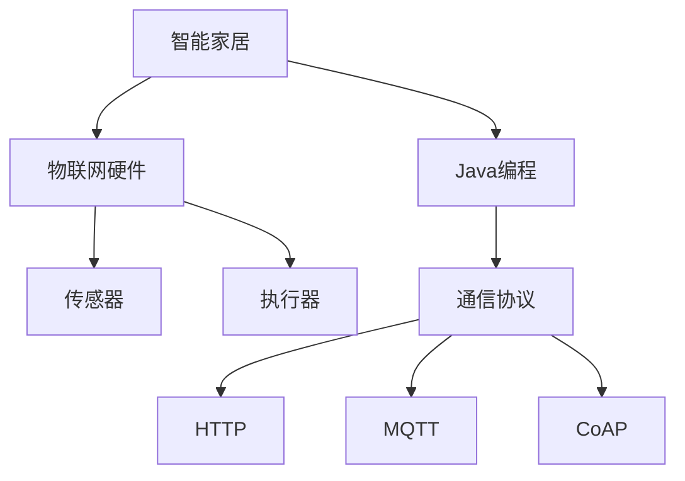
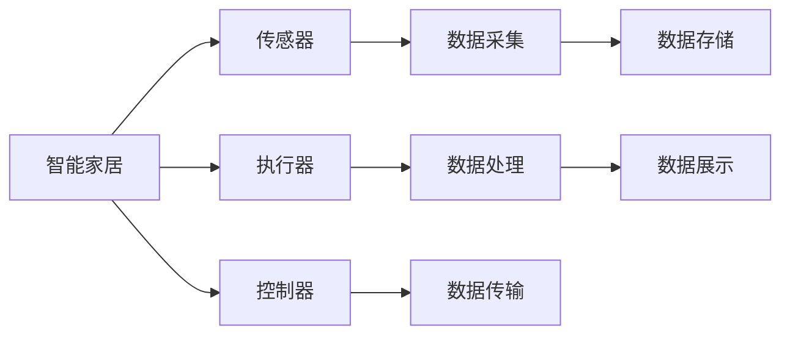
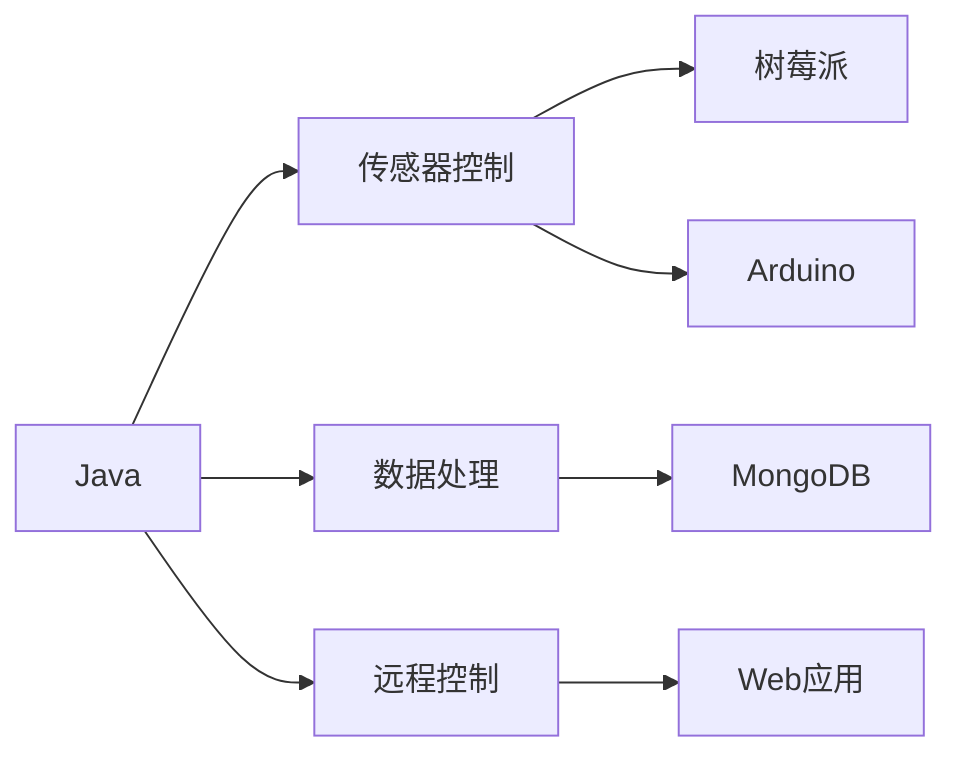
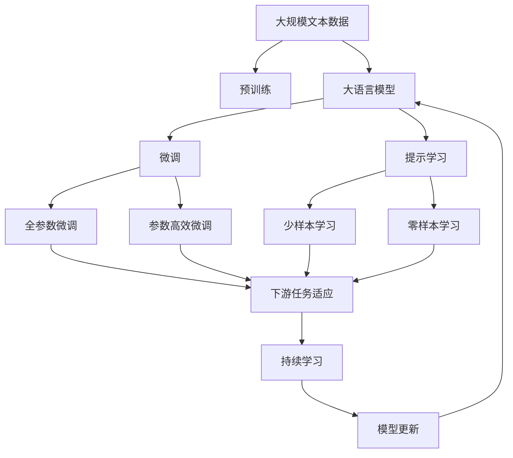

                 

# 基于Java的智能家居设计：Java程序员的物联网硬件入门指南

## 1. 背景介绍

### 1.1 问题由来
随着物联网(IoT)技术的迅猛发展，智能家居成为智能生活的重要组成部分。然而，构建智能家居系统不仅仅需要强大的软件支撑，还需要对硬件有深入的了解。对于Java程序员而言，传统的物联网硬件开发往往需要使用C++、Python等语言，这对他们来说是一个挑战。因此，本文旨在通过Java这一熟悉的技术栈，探讨智能家居硬件开发的入门指南。

### 1.2 问题核心关键点
智能家居硬件开发的核心关键点在于理解硬件原理、选择适合的硬件平台和通信协议，以及利用Java技术实现与硬件的互操作。具体来说，包括：
- 硬件原理：了解智能家居硬件的组成、功能和工作原理。
- 硬件平台选择：选择合适的硬件平台，如树莓派、Arduino等。
- 通信协议：掌握常用的通信协议，如HTTP、MQTT等，以便进行数据传输。
- Java编程：学习如何在Java环境中实现硬件控制、数据采集和处理。

### 1.3 问题研究意义
掌握基于Java的智能家居硬件开发技能，对于Java程序员来说，能够拓宽其技术栈，提升跨领域能力。对于智能家居系统开发者而言，利用Java这一成熟、广泛使用的语言，可以降低开发门槛，提高开发效率，加速产品迭代。

## 2. 核心概念与联系

### 2.1 核心概念概述

为了更好地理解基于Java的智能家居硬件开发，我们需要了解以下几个核心概念：

- **智能家居**：通过物联网技术，将家居中的各种设备和设施互联，实现远程控制、自动化管理等功能。
- **物联网硬件**：包括传感器、执行器、控制器等硬件设备，负责数据采集、处理和控制。
- **Java**：一种面向对象的编程语言，广泛应用于企业级应用开发、移动开发和物联网硬件开发等领域。
- **通信协议**：用于设备之间数据传输的标准，如HTTP、MQTT、CoAP等。

这些概念之间的联系可以通过以下Mermaid流程图来展示：



这个流程图展示了大语言模型微调过程中各个核心概念之间的关系：

1. 智能家居通过物联网硬件实现各项功能。
2. Java编程语言用于实现与物联网硬件的互操作。
3. 通信协议用于设备之间的数据传输。

### 2.2 概念间的关系

这些核心概念之间存在着紧密的联系，形成了智能家居硬件开发的完整生态系统。下面我们通过几个Mermaid流程图来展示这些概念之间的关系。

#### 2.2.1 智能家居硬件开发范式



这个流程图展示了大语言模型的三种主要学习范式：

1. 智能家居系统通过传感器、执行器和控制器实现各项功能。
2. 传感器负责数据采集，执行器负责数据处理，控制器负责数据传输。
3. 数据存储和展示是大语言模型应用的具体环节。

#### 2.2.2 Java在智能家居硬件开发中的应用



这个流程图展示了Java在智能家居硬件开发中的应用：

1. Java用于传感器控制、数据处理和远程控制。
2. 常用的硬件平台如树莓派、Arduino等，支持Java开发。
3. 数据存储和展示通常使用Java编程语言实现。

### 2.3 核心概念的整体架构

最后，我们用一个综合的流程图来展示这些核心概念在大语言模型微调过程中的整体架构：



这个综合流程图展示了从预训练到微调，再到持续学习的完整过程。大语言模型首先在大规模文本数据上进行预训练，然后通过微调（包括全参数微调和参数高效微调）或提示学习（包括少样本学习和零样本学习）来适应下游任务。最后，通过持续学习技术，模型可以不断更新和适应新的任务和数据。

## 3. 核心算法原理 & 具体操作步骤
### 3.1 算法原理概述

基于Java的智能家居硬件开发，其核心算法原理与传统的大语言模型微调相似。主要包括以下几个步骤：

1. **硬件选择与配置**：选择合适的硬件平台，进行必要的配置。
2. **数据采集与预处理**：使用传感器采集家居数据，并对数据进行预处理。
3. **通信协议设置**：选择合适的通信协议，进行数据传输。
4. **Java编程实现**：利用Java编程语言实现与硬件的互操作，实现数据采集、处理和控制。
5. **测试与优化**：对系统进行测试，不断优化性能。

### 3.2 算法步骤详解

以下是基于Java的智能家居硬件开发的具体步骤：

**Step 1: 硬件选择与配置**

- 选择适合的硬件平台，如树莓派、Arduino等。
- 配置必要的硬件设备，如传感器、执行器、控制器等。
- 配置通信协议，如HTTP、MQTT等。

**Step 2: 数据采集与预处理**

- 使用传感器采集家居环境数据，如温度、湿度、光照等。
- 将采集到的数据进行预处理，如去噪、归一化等。
- 将处理后的数据存储到数据库中，以便后续分析。

**Step 3: 通信协议设置**

- 选择合适的通信协议，如HTTP、MQTT等。
- 配置协议参数，如端口号、消息格式等。
- 在硬件和服务器之间搭建通信链路，实现数据传输。

**Step 4: Java编程实现**

- 编写Java程序，实现与硬件的互操作。
- 利用Java编程语言处理采集到的数据，如存储、分析等。
- 通过Web应用实现远程控制，如设置温度、开关灯光等。

**Step 5: 测试与优化**

- 对系统进行测试，检查数据采集、处理和控制功能是否正常。
- 根据测试结果，不断优化程序性能，提高系统稳定性。

### 3.3 算法优缺点

基于Java的智能家居硬件开发具有以下优点：

- 数据处理能力强：Java作为一种高级语言，具有强大的数据处理能力，能够高效处理传感器数据。
- 跨平台性强：Java具有良好的跨平台性，可以在不同的硬件平台上运行。
- 开发者资源丰富：Java有着丰富的开发者社区和资源，便于快速开发和调试。

但同时也存在一些缺点：

- 性能瓶颈：Java在处理大规模数据时，可能会出现性能瓶颈，需要优化算法和架构。
- 内存占用高：Java程序通常需要较大的内存空间，需要合理管理内存资源。
- 学习曲线陡峭：对于Java新手来说，可能需要一定时间学习和适应Java编程。

### 3.4 算法应用领域

基于Java的智能家居硬件开发，可以在多个领域得到应用，例如：

- 智能安防系统：利用传感器采集环境数据，实现安防监控、入侵检测等功能。
- 智能照明系统：通过传感器和执行器，实现智能调光、自动开关等功能。
- 智能温控系统：利用传感器采集温度数据，实现智能温控、节能减排等功能。
- 智能家电系统：通过传感器和执行器，实现智能家电控制、节能管理等功能。

除了上述这些经典应用外，Java技术还可以应用于更多场景中，如智能家居控制中心、智能家居数据分析等，为智能家居技术带来全新的突破。

## 4. 数学模型和公式 & 详细讲解  
### 4.1 数学模型构建

本节将使用数学语言对基于Java的智能家居硬件开发过程进行更加严格的刻画。

假设智能家居系统中有N个传感器，每个传感器采集的数据为x_i，则采集到的数据集为X = {x_1, x_2, ..., x_N}。数据集的前向传播模型为y = f(X)，其中f为数据处理函数。

定义模型在数据集X上的经验风险为：

$$
\mathcal{L}(y, X) = \frac{1}{N} \sum_{i=1}^N \ell(y_i, x_i)
$$

其中 $\ell$ 为损失函数，用于衡量预测值与真实值之间的差异。常见的损失函数包括均方误差损失、交叉熵损失等。

微调的目标是最小化经验风险，即找到最优参数：

$$
\theta^* = \mathop{\arg\min}_{\theta} \mathcal{L}(y, X)
$$

在实践中，我们通常使用基于梯度的优化算法（如SGD、Adam等）来近似求解上述最优化问题。设 $\eta$ 为学习率，则参数的更新公式为：

$$
\theta \leftarrow \theta - \eta \nabla_{\theta}\mathcal{L}(y, X) - \eta\lambda\theta
$$

其中 $\nabla_{\theta}\mathcal{L}(y, X)$ 为损失函数对参数 $\theta$ 的梯度，可通过反向传播算法高效计算。

### 4.2 公式推导过程

以下我们以智能安防系统为例，推导均方误差损失函数的计算公式。

假设系统中有N个传感器，每个传感器采集的数据为x_i，真实标签为y_i，则均方误差损失函数定义为：

$$
\ell(y, x) = \frac{1}{N} \sum_{i=1}^N (y_i - f(x_i))^2
$$

将其代入经验风险公式，得：

$$
\mathcal{L}(y, X) = \frac{1}{N} \sum_{i=1}^N (y_i - f(x_i))^2
$$

根据链式法则，损失函数对参数 $\theta_k$ 的梯度为：

$$
\frac{\partial \mathcal{L}(y, X)}{\partial \theta_k} = -\frac{2}{N} \sum_{i=1}^N (y_i - f(x_i)) \frac{\partial f(x_i)}{\partial \theta_k}
$$

其中 $\frac{\partial f(x_i)}{\partial \theta_k}$ 可进一步递归展开，利用自动微分技术完成计算。

在得到损失函数的梯度后，即可带入参数更新公式，完成模型的迭代优化。重复上述过程直至收敛，最终得到适应智能安防系统的最优模型参数 $\theta^*$。

## 5. 项目实践：代码实例和详细解释说明
### 5.1 开发环境搭建

在进行智能家居硬件开发前，我们需要准备好开发环境。以下是使用Java和树莓派进行智能家居系统开发的配置流程：

1. 安装Anaconda：从官网下载并安装Anaconda，用于创建独立的Java环境。

2. 创建并激活虚拟环境：
```bash
conda create -n java-env python=3.8 
conda activate java-env
```

3. 安装Java：根据CUDA版本，从官网获取对应的安装命令。例如：
```bash
conda install java
```

4. 安装必要的软件包：
```bash
conda install numpy pandas scikit-learn matplotlib tqdm jupyter notebook ipython
```

5. 安装树莓派操作系统：
```bash
sudo apt-get update
sudo apt-get install raspbian-ua-netcfg
sudo u-boot-netcfg
```

完成上述步骤后，即可在`java-env`环境中开始智能家居系统开发。

### 5.2 源代码详细实现

下面我们以智能安防系统为例，给出使用Java和树莓派进行开发的全过程。

首先，定义智能安防系统中的数据采集和处理模块：

```java
import org.apache.commons.io.FileUtils;
import java.io.File;
import java.io.IOException;
import java.util.ArrayList;
import java.util.List;

public class DataProcessor {
    private List<Integer> sensorData = new ArrayList<>();

    public void readData(File dataFile) throws IOException {
        List<String> lines = FileUtils.readLines(dataFile);
        for (String line : lines) {
            int sensorValue = Integer.parseInt(line);
            sensorData.add(sensorValue);
        }
    }

    public List<Integer> getSensorData() {
        return sensorData;
    }
}
```

然后，定义智能安防系统的数据传输模块：

```java
import com.sun.net.httpserver.HttpExchange;
import com.sun.net.httpserver.HttpHandler;
import java.io.OutputStream;
import java.io.PrintWriter;
import java.net.HttpURLConnection;
import java.net.URL;

public class DataTransport {
    private String serverUrl;

    public DataTransport(String serverUrl) {
        this.serverUrl = serverUrl;
    }

    public void sendData(List<Integer> sensorData) {
        try {
            URL url = new URL(serverUrl);
            HttpURLConnection connection = (HttpURLConnection) url.openConnection();
            connection.setRequestMethod("POST");
            connection.setRequestProperty("Content-Type", "application/json");
            connection.setDoOutput(true);
            OutputStream os = connection.getOutputStream();
            PrintWriter writer = new PrintWriter(os);
            writer.println("{\"data\": [" + sensorData + "]}");
            writer.flush();
            os.close();
        } catch (Exception e) {
            e.printStackTrace();
        }
    }
}
```

接着，定义智能安防系统的Web应用模块：

```java
import java.io.IOException;
import java.io.PrintWriter;
import java.net.HttpURLConnection;
import java.net.URL;
import javax.servlet.ServletException;
import javax.servlet.annotation.WebServlet;
import javax.servlet.http.HttpServlet;
import javax.servlet.http.HttpServletRequest;
import javax.servlet.http.HttpServletResponse;

@WebServlet("/setTemperature")
public class SetTemperatureServlet extends HttpServlet {
    private static final long serialVersionUID = 1L;

    protected void doGet(HttpServletRequest request, HttpServletResponse response) throws ServletException, IOException {
        List<Integer> sensorData = request.getParameter("data");
        String url = "http://<server-url>/api/temperature";
        DataTransport dataTransport = new DataTransport(url);
        dataTransport.sendData(sensorData);
        response.setContentType("text/html");
        PrintWriter out = response.getWriter();
        out.println("<html><body><h1>Temperature set successfully!</h1></body></html>");
    }
}
```

最后，启动智能安防系统：

```java
public class Main {
    public static void main(String[] args) {
        String dataFile = "sensor_data.txt";
        String serverUrl = "http://<server-url>/api/data";

        DataProcessor dataProcessor = new DataProcessor();
        try {
            dataProcessor.readData(new File(dataFile));
            List<Integer> sensorData = dataProcessor.getSensorData();
            DataTransport dataTransport = new DataTransport(serverUrl);
            dataTransport.sendData(sensorData);
        } catch (IOException e) {
            e.printStackTrace();
        }
    }
}
```

以上代码实现了一个基本的智能安防系统，包括数据采集、数据处理、数据传输和Web应用。在实际应用中，还需要进行更多的优化和扩展，如添加数据存储、异常处理等环节。

### 5.3 代码解读与分析

让我们再详细解读一下关键代码的实现细节：

**DataProcessor类**：
- `readData`方法：读取传感器数据文件，并将其存储到List中。
- `getSensorData`方法：获取传感器数据，返回List。

**DataTransport类**：
- `sendData`方法：将传感器数据通过POST请求发送到服务器。

**SetTemperatureServlet类**：
- `doGet`方法：处理HTTP请求，接收传感器数据，并将数据发送到服务器。

**Main类**：
- `main`方法：启动智能安防系统，读取传感器数据并发送到服务器。

在代码实现中，我们使用了Java的面向对象特性，实现了数据处理、数据传输和Web应用模块。通过组合使用这些模块，实现了智能安防系统的基本功能。需要注意的是，实际应用中可能需要进一步优化和扩展，以满足具体需求。

### 5.4 运行结果展示

假设我们在树莓派上运行智能安防系统，传感器数据采集后，系统将数据发送到服务器，并进行相应的处理。最终，服务器将处理结果返回给Web应用，用户可以通过Web界面对安防系统进行远程控制。例如，可以通过网页界面设置温度，系统将传感器数据发送到服务器，服务器将温度设置命令发送到安防设备，实现温度调节功能。

## 6. 实际应用场景
### 6.1 智能安防系统

基于Java的智能安防系统，可以广泛应用于智能家居领域。传统安防系统往往需要配备大量人力，高峰期响应缓慢，且无法实现远程控制。而使用智能安防系统，能够实现24小时不间断监控，快速响应报警，提升家庭安全性。

在技术实现上，可以收集家庭环境数据，如温度、湿度、门窗开关状态等，将数据发送到服务器进行分析。服务器根据分析结果，自动触发警报或控制设备。用户可以通过Web应用远程控制安防系统，如设置温度、调整灯光等。

### 6.2 智能照明系统

基于Java的智能照明系统，可以广泛应用于智能家居领域。传统照明系统往往需要手动控制，无法实现自动化调节。而使用智能照明系统，能够实现智能调光、自动开关等功能。

在技术实现上，可以收集环境数据，如光线强度、室内人数等，将数据发送到服务器进行分析。服务器根据分析结果，自动调节灯光亮度和开关状态。用户可以通过Web应用远程控制照明系统，如设置亮度、调整场景等。

### 6.3 智能温控系统

基于Java的智能温控系统，可以广泛应用于智能家居领域。传统温控系统往往无法实现个性化调节，无法满足不同场景的需求。而使用智能温控系统，能够实现个性化调节，提升家居舒适度。

在技术实现上，可以收集室内温度、湿度、人体活动数据，将数据发送到服务器进行分析。服务器根据分析结果，自动调节室内温度和湿度。用户可以通过Web应用远程控制温控系统，如设置温度、湿度等。

### 6.4 未来应用展望

随着Java技术的发展和智能家居领域的不断成熟，基于Java的智能家居硬件开发将具有广阔的应用前景。

在智慧城市领域，基于Java的智能家居硬件开发技术，可以应用于城市安防、公共设施管理等领域，提升城市管理的智能化水平。

在智慧农业领域，智能家居硬件开发技术，可以应用于温室控制、智能灌溉等领域，提高农业生产效率。

在智能医疗领域，基于Java的智能家居硬件开发技术，可以应用于家庭医疗监测、智能康复等领域，提升医疗服务质量。

除了上述这些应用领域外，Java技术还可以应用于更多场景中，如智能教育、智能办公等，为人类生产生活带来更多便利和智能化体验。

## 7. 工具和资源推荐
### 7.1 学习资源推荐

为了帮助开发者系统掌握基于Java的智能家居硬件开发，这里推荐一些优质的学习资源：

1. 《Java物联网开发实战》书籍：全面介绍了Java在物联网硬件开发中的应用，包括传感器控制、数据传输、Web应用等。

2. 《Java编程思想》书籍：经典Java编程教材，深入浅出地讲解了Java编程的各个方面，适合Java新手入门。

3. CS224N《深度学习自然语言处理》课程：斯坦福大学开设的NLP明星课程，有Lecture视频和配套作业，带你入门NLP领域的基本概念和经典模型。

4. 《物联网原理与技术》书籍：详细介绍物联网的基本原理和技术，适合了解物联网硬件开发的初学者。

5. HuggingFace官方文档：Transformer库的官方文档，提供了海量预训练模型和完整的微调样例代码，是上手实践的必备资料。

通过对这些资源的学习实践，相信你一定能够快速掌握基于Java的智能家居硬件开发的精髓，并用于解决实际的NLP问题。

### 7.2 开发工具推荐

高效的开发离不开优秀的工具支持。以下是几款用于Java编程和智能家居硬件开发的常用工具：

1. Eclipse：一款流行的Java集成开发环境，提供丰富的插件和工具，支持Java编程和智能家居硬件开发。

2. IntelliJ IDEA：另一款流行的Java集成开发环境，提供智能代码补全、重构、调试等功能，适合Java编程。

3. NetBeans：开源的Java集成开发环境，支持Java编程和智能家居硬件开发，适合Java新手入门。

4. Linux操作系统：智能家居硬件开发往往需要在Linux环境下进行，如树莓派、Arduino等。

5. Git版本控制系统：版本控制系统的使用，有助于协作开发、代码管理等。

6. JUnit测试框架：Java测试框架，用于编写单元测试，确保代码质量。

合理利用这些工具，可以显著提升Java编程和智能家居硬件开发的开发效率，加快创新迭代的步伐。

### 7.3 相关论文推荐

大语言模型和微调技术的发展源于学界的持续研究。以下是几篇奠基性的相关论文，推荐阅读：

1. Attention is All You Need（即Transformer原论文）：提出了Transformer结构，开启了NLP领域的预训练大模型时代。

2. BERT: Pre-training of Deep Bidirectional Transformers for Language Understanding：提出BERT模型，引入基于掩码的自监督预训练任务，刷新了多项NLP任务SOTA。

3. Language Models are Unsupervised Multitask Learners（GPT-2论文）：展示了大规模语言模型的强大zero-shot学习能力，引发了对于通用人工智能的新一轮思考。

4. Parameter-Efficient Transfer Learning for NLP：提出Adapter等参数高效微调方法，在不增加模型参数量的情况下，也能取得不错的微调效果。

5. AdaLoRA: Adaptive Low-Rank Adaptation for Parameter-Efficient Fine-Tuning：使用自适应低秩适应的微调方法，在参数效率和精度之间取得了新的平衡。

这些论文代表了大语言模型微调技术的发展脉络。通过学习这些前沿成果，可以帮助研究者把握学科前进方向，激发更多的创新灵感。

除上述资源外，还有一些值得关注的前沿资源，帮助开发者紧跟Java技术的发展，例如：

1. arXiv论文预印本：人工智能领域最新研究成果的发布平台，包括大量尚未发表的前沿工作，学习前沿技术的必读资源。

2. 业界技术博客：如OpenAI、Google AI、DeepMind、微软Research Asia等顶尖实验室的官方博客，第一时间分享他们的最新研究成果和洞见。

3. 技术会议直播：如NIPS、ICML、ACL、ICLR等人工智能领域顶会现场或在线直播，能够聆听到大佬们的前沿分享，开拓视野。

4. GitHub热门项目：在GitHub上Star、Fork数最多的Java相关项目，往往代表了该技术领域的发展趋势和最佳实践，值得去学习和贡献。

5. 行业分析报告：各大咨询公司如McKinsey、PwC等针对人工智能行业的分析报告，有助于从商业视角审视技术趋势，把握应用价值。

总之，对于Java程序员来说，掌握基于Java的智能家居硬件开发技能，将大大拓展其技术栈，提升跨领域能力。通过学习上述资源，相信你一定能够快速掌握基于Java的智能家居硬件开发的精髓，并用于解决实际的NLP问题。

## 8. 总结：未来发展趋势与挑战
### 8.1 总结

本文对基于Java的智能家居硬件开发进行全面系统的介绍。首先阐述了智能家居硬件开发的背景和意义，明确了Java在智能家居硬件开发中的独特价值。其次，从原理到实践，详细讲解了Java在智能家居硬件开发中的应用，包括数据采集、数据处理、数据传输等关键环节。同时，本文还探讨了Java技术在智能家居硬件开发中的应用场景，展示了Java技术在智能家居领域的广阔前景。

通过本文的系统梳理，可以看到，基于Java的智能家居硬件开发不仅具有强大的数据处理能力，而且具有跨平台强、开发者资源丰富等优点。Java技术在智能家居硬件开发中的应用，有望实现智能家居系统的智能化、自动化、个性化，为智能家居技术带来新的突破。

### 8.2 未来发展趋势

展望未来，Java在智能家居硬件开发中的应用将呈现以下几个发展趋势：

1. 智能化水平提升：随着物联网技术的不断成熟，智能家居系统的智能化水平将不断提高。Java技术在智能家居硬件开发中的应用，将更加深入和广泛。

2. 实时性增强：Java技术具有高效的数据处理能力，未来将进一步优化算法和架构，提升智能家居系统的实时性，实现更快速响应的功能。

3. 跨平台扩展：Java技术的跨平台性，使得智能家居系统可以运行在不同的硬件平台上，如树莓派、Arduino等，进一步拓展应用范围。

4. 云计算整合：Java技术在云计算领域的应用广泛，未来将进一步整合云平台资源，实现更高效、更稳定的智能家居系统。

5. 安全性加强：随着智能家居系统的普及，安全性问题将更加突出。Java技术的安全性保证机制，将为智能家居系统提供更强的安全保障。

### 8.3 面临的挑战

尽管Java技术在智能家居硬件开发中具有诸多优势，但在实际应用中仍面临以下挑战：

1. 数据传输瓶颈：智能家居系统需要频繁的数据传输，

