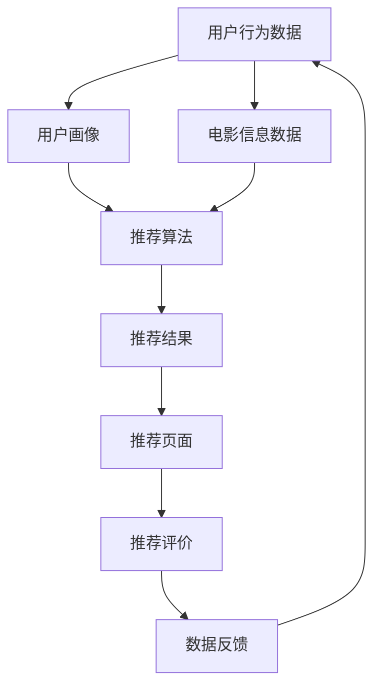

                 

# 基于NLP的电影推荐Android应用程序的实现

## 1. 背景介绍

### 1.1 问题由来
随着人工智能和大数据技术的飞速发展，电影推荐系统已经成为了互联网公司吸引用户、增加用户粘性的重要手段。传统的基于协同过滤、内容匹配的电影推荐算法，难以克服稀疏性问题、推荐内容的同质性问题，以及冷启动问题等挑战。相比之下，基于深度学习尤其是自然语言处理(NLP)的电影推荐系统，在语义理解和推荐多样化方面表现更为出色，逐渐成为了推荐系统的前沿方向。

### 1.2 问题核心关键点
NLP在电影推荐系统中的应用，主要通过两种方式实现：
1. **文本特征提取**：从用户评论、电影简介、海报文本等文本信息中提取特征，如TF-IDF、词向量等，用于描述用户和电影的属性。
2. **情感分析与文本生成**：利用NLP技术进行情感分析和文本生成，从而建立用户对电影评分、评论等情感状态的映射，以及生成推荐文本。

本文聚焦于基于NLP的电影推荐系统，并通过移动应用实现技术落地。具体实现步骤如下：
1. **用户画像构建**：收集用户的历史行为数据、评分信息、评论文本等，并利用NLP技术构建用户画像。
2. **电影特征抽取**：从电影标题、简介、评论等文本信息中，提取TF-IDF、词向量等特征，用于描述电影属性。
3. **用户与电影关联**：通过余弦相似度、TF-IDF相似度等方法，建立用户与电影之间的关联。
4. **推荐算法优化**：结合深度学习模型和NLP技术，优化推荐算法，提升推荐效果。
5. **移动应用实现**：将推荐算法封装到Android应用程序中，提供便捷的电影推荐服务。

### 1.3 问题研究意义
基于NLP的电影推荐系统具有以下研究意义：
1. **提升推荐效果**：通过NLP技术提取更丰富的语义信息，克服了传统协同过滤等算法的不足，提升了推荐系统的准确性和个性化水平。
2. **降低开发成本**：利用现有的深度学习模型和NLP技术，减少了从头开发推荐算法的时间和成本投入。
3. **实现技术落地**：通过移动应用实现推荐系统的功能，使用户能够在任何时间、任何地点获取个性化推荐，提高了用户体验。
4. **推动行业应用**：该技术可以应用于各种场景，如在线视频平台、电商网站等，有助于推动NLP技术在各行业的落地应用。

## 2. 核心概念与联系

### 2.1 核心概念概述

在电影推荐系统中，NLP主要通过以下几种方式应用：

- **文本特征提取**：利用TF-IDF、词向量等方法，从文本中提取特征，用于描述电影和用户的属性。
- **情感分析**：通过情感词典、深度学习模型等方法，对电影评论、用户评分等文本信息进行情感分析，理解用户的情感倾向。
- **文本生成**：利用生成对抗网络(GAN)、Transformer等模型，生成推荐文本，提高用户的点击率和转化率。
- **文本相似度计算**：通过余弦相似度、Jaccard相似度、TF-IDF相似度等方法，计算用户和电影之间的相似度，用于推荐排序。

这些NLP技术的应用，使得电影推荐系统能够更好地理解用户的真实需求，提高推荐的多样性和个性化，从而提升用户体验。

### 2.2 概念间的关系

以下是一个综合性的Mermaid流程图，展示了NLP在电影推荐系统中的应用：



这个流程图展示了从数据采集、用户画像构建、推荐算法应用到最终推荐的整个流程，以及数据反馈和用户评价的闭环过程。通过不断收集用户反馈，优化推荐算法和模型，实现推荐系统的持续改进。

## 3. 核心算法原理 & 具体操作步骤
### 3.1 算法原理概述

基于NLP的电影推荐系统，核心算法原理包括以下几个步骤：

1. **数据预处理**：对用户行为数据、电影信息数据等进行清洗和标准化处理，去除噪音数据，确保数据质量。
2. **特征提取**：从用户评论、电影简介等文本信息中，提取TF-IDF、词向量等特征，用于描述用户和电影的属性。
3. **情感分析**：利用情感词典或深度学习模型，对用户评论、评分等文本信息进行情感分析，理解用户的情感倾向。
4. **推荐算法**：基于用户的特征和电影的特征，结合深度学习模型和NLP技术，计算用户与电影之间的相似度，生成推荐结果。
5. **推荐结果排序**：根据用户的历史行为数据、评分信息、情感分析结果等，对推荐结果进行排序，提升推荐效果。

### 3.2 算法步骤详解

以下详细介绍各个步骤的具体实现。

#### 3.2.1 数据预处理

数据预处理的主要目标是清洗和标准化数据，去除噪音和重复数据，确保数据质量。具体步骤包括：

1. **数据清洗**：去除重复、缺失、噪音数据，如非法字符、无关内容等。
2. **数据标准化**：将文本数据进行分词、去除停用词、词干提取等标准化处理。
3. **数据归一化**：将特征数据进行归一化处理，如将TF-IDF值归一化到[0,1]区间。

#### 3.2.2 特征提取

特征提取是从文本信息中提取用于描述用户和电影属性的特征，主要采用TF-IDF和词向量两种方法。

**TF-IDF特征提取**：TF-IDF（Term Frequency-Inverse Document Frequency）是一种常用的文本特征提取方法。其基本原理是统计单词在文本中出现的频率和在整个语料库中的重要性，将单词的TF-IDF值作为特征，用于描述文本内容。

**词向量特征提取**：词向量（Word Embedding）是一种将单词映射到低维实数向量空间的表示方法，能够更好地捕捉单词之间的语义关系。常用的词向量模型有Word2Vec、GloVe等。

#### 3.2.3 情感分析

情感分析是理解用户情感倾向的重要手段，可以通过情感词典或深度学习模型实现。

**情感词典**：利用情感词典，统计文本中单词的情感极性，计算文本整体的情感得分。常用的情感词典包括AFINN、SentiWordNet等。

**深度学习模型**：利用深度学习模型，对文本信息进行情感分类。常用的模型包括CNN、LSTM、BERT等。

#### 3.2.4 推荐算法

推荐算法是电影推荐系统的核心，主要利用用户和电影的特征，结合NLP技术，计算用户与电影之间的相似度，生成推荐结果。

**协同过滤**：基于用户的历史行为数据，推荐与该用户相似用户的评分高的电影。
**内容匹配**：基于电影的特征，推荐与该电影相似的其他电影。
**混合推荐**：结合协同过滤和内容匹配，生成综合推荐结果。

#### 3.2.5 推荐结果排序

推荐结果排序的目标是根据用户的历史行为数据、评分信息、情感分析结果等，对推荐结果进行排序，提升推荐效果。常用的排序方法包括基于用户和电影的相似度排序、基于用户评分排序等。

### 3.3 算法优缺点

基于NLP的电影推荐系统具有以下优点：

1. **丰富语义信息**：通过NLP技术，提取了更丰富的语义信息，提高了推荐的多样性和个性化。
2. **高效推荐**：利用深度学习模型和NLP技术，实现了高效的推荐计算，提升了推荐速度。
3. **可解释性强**：通过NLP技术，能够对推荐结果进行可解释性分析，帮助用户理解推荐的原因。

同时，也存在以下缺点：

1. **数据需求量大**：需要大量的用户行为数据和电影信息数据，才能进行有效的特征提取和情感分析。
2. **计算资源消耗大**：深度学习模型和NLP技术的计算资源消耗较大，需要高性能硬件支持。
3. **用户隐私保护**：需要严格保护用户行为数据和评分信息，避免数据泄露和滥用。

### 3.4 算法应用领域

基于NLP的电影推荐系统，可以应用于以下场景：

1. **视频平台**：如Netflix、YouTube等，为用户提供个性化的电影推荐，增加用户粘性。
2. **电商平台**：如亚马逊、淘宝等，根据用户浏览和评分信息，推荐相关电影，提升用户购买率。
3. **社交媒体**：如Facebook、微博等，根据用户评论和分享，推荐相关电影，增加用户互动。

## 4. 数学模型和公式 & 详细讲解 & 举例说明

### 4.1 数学模型构建

以下是一个基于NLP的电影推荐系统的数学模型构建。

**输入**：用户历史行为数据 $D_u$，电影信息数据 $D_m$，用户评分 $R$。

**输出**：推荐结果 $r$。

#### 4.1.1 TF-IDF特征表示

TF-IDF特征表示可以通过以下公式计算：

$$
\text{TF-IDF}(x) = \text{TF}(x) \times \text{IDF}(x)
$$

其中，$TF(x)$ 表示单词 $x$ 在文本中的出现频率，$IDF(x)$ 表示单词 $x$ 在整个语料库中的逆文档频率。

#### 4.1.2 词向量特征表示

词向量特征表示可以通过以下公式计算：

$$
\text{Word Vector}(x) = \text{W}_\text{emb}[x]
$$

其中，$\text{W}_\text{emb}$ 表示预训练的词向量模型，$x$ 表示单词。

#### 4.1.3 用户画像构建

用户画像可以通过以下公式计算：

$$
\text{User Profile} = \text{User Behavior} + \text{User Rating}
$$

其中，$\text{User Behavior}$ 表示用户的历史行为数据，$\text{User Rating}$ 表示用户的评分信息。

#### 4.1.4 电影特征表示

电影特征表示可以通过以下公式计算：

$$
\text{Movie Profile} = \text{Movie Information} + \text{Movie Review}
$$

其中，$\text{Movie Information}$ 表示电影的基本信息，$\text{Movie Review}$ 表示电影的评论信息。

#### 4.1.5 情感分析

情感分析可以通过以下公式计算：

$$
\text{Sentiment Score} = \text{Sum}(\text{Emotion Score})
$$

其中，$\text{Emotion Score}$ 表示单词的情感得分。

#### 4.1.6 推荐算法

推荐算法可以通过以下公式计算：

$$
\text{Recommendation Score} = \text{Similarity}(\text{User Profile}, \text{Movie Profile})
$$

其中，$\text{Similarity}$ 表示用户和电影的相似度计算方法，如余弦相似度、Jaccard相似度等。

### 4.2 公式推导过程

以下详细介绍各个公式的推导过程。

#### 4.2.1 TF-IDF公式推导

$$
\text{TF}(x) = \frac{\text{Count}(x)}{\text{Total Tokens}}
$$

$$
\text{IDF}(x) = \log\frac{N}{\text{Count}(x)}
$$

$$
\text{TF-IDF}(x) = \text{TF}(x) \times \text{IDF}(x)
$$

其中，$N$ 表示文档总数。

#### 4.2.2 词向量公式推导

$$
\text{Word Vector}(x) = \text{W}_\text{emb}[x]
$$

其中，$\text{W}_\text{emb}$ 表示预训练的词向量模型。

#### 4.2.3 余弦相似度公式推导

$$
\text{Similarity}(\text{Vector}_1, \text{Vector}_2) = \frac{\text{Dot Product}(\text{Vector}_1, \text{Vector}_2)}{\text{L2 Norm}(\text{Vector}_1) \times \text{L2 Norm}(\text{Vector}_2)}
$$

其中，$\text{Dot Product}$ 表示向量点积，$\text{L2 Norm}$ 表示向量L2范数。

#### 4.2.4 深度学习模型情感分析公式推导

$$
\text{Sentiment Score} = \text{Model}(\text{Input})
$$

其中，$\text{Model}$ 表示深度学习模型，$\text{Input}$ 表示输入的文本信息。

### 4.3 案例分析与讲解

以下以Netflix为例，分析基于NLP的电影推荐系统的实现。

#### 4.3.1 数据预处理

Netflix从用户行为数据中提取用户评分、播放次数等行为数据，并从电影信息数据中提取电影名称、导演、演员等基本信息。通过数据清洗、标准化处理，去除噪音和重复数据。

#### 4.3.2 特征提取

Netflix利用TF-IDF和词向量方法，从用户评论和电影简介中提取特征。其中，TF-IDF用于描述用户和电影的文本属性，词向量用于捕捉单词之间的语义关系。

#### 4.3.3 情感分析

Netflix利用深度学习模型，对用户评论进行情感分析，理解用户的情感倾向。通过情感分析，Netflix能够更好地预测用户对电影的评分和反馈。

#### 4.3.4 推荐算法

Netflix结合协同过滤和内容匹配，生成推荐结果。协同过滤根据用户历史评分信息，推荐与该用户评分高的电影。内容匹配根据电影基本信息和评论信息，推荐与该电影相似的其他电影。

#### 4.3.5 推荐结果排序

Netflix根据用户的历史评分、评论情感分析结果等，对推荐结果进行排序。通过排序，Netflix能够更好地满足用户的个性化需求。

## 5. 项目实践：代码实例和详细解释说明

### 5.1 开发环境搭建

以下是在Android环境下搭建开发环境的步骤。

#### 5.1.1 安装Android Studio

从官网下载并安装Android Studio，创建一个新的Android项目。

#### 5.1.2 安装依赖库

在项目中添加依赖库，如TensorFlow、Keras等深度学习库。

#### 5.1.3 设置开发环境

配置Android Studio的开发环境，包括VM选项、Android SDK等。

### 5.2 源代码详细实现

以下是一个基于NLP的电影推荐系统的源代码实现。

#### 5.2.1 数据预处理

```java
public class DataPreprocessing {
    // 清洗数据
    public static void cleanData(String[] data) {
        // 去除重复和噪音数据
    }
    
    // 标准化数据
    public static void normalizeData(String[] data) {
        // 分词、去除停用词、词干提取等标准化处理
    }
}
```

#### 5.2.2 特征提取

```java
public class FeatureExtraction {
    // TF-IDF特征提取
    public static double[] extractTFIDF(String[] data) {
        // 统计单词出现频率和逆文档频率
    }
    
    // 词向量特征提取
    public static double[] extractWordVec(String[] data) {
        // 使用Word2Vec模型计算单词嵌入
    }
}
```

#### 5.2.3 情感分析

```java
public class SentimentAnalysis {
    // 情感词典分析
    public static double sentimentScore(String[] data) {
        // 利用情感词典统计单词情感得分
    }
    
    // 深度学习模型分析
    public static double sentimentScore(String[] data) {
        // 使用深度学习模型进行情感分类
    }
}
```

#### 5.2.4 推荐算法

```java
public class RecommendationAlgorithm {
    // 协同过滤
    public static double[] collaborativeFiltering(double[] userProfile, double[] movieProfile) {
        // 根据用户历史评分信息，推荐与该用户评分高的电影
    }
    
    // 内容匹配
    public static double[] contentMatching(double[] movieProfile) {
        // 根据电影基本信息和评论信息，推荐与该电影相似的其他电影
    }
    
    // 混合推荐
    public static double[] hybridRecommendation(double[] userProfile, double[] movieProfile) {
        // 结合协同过滤和内容匹配，生成综合推荐结果
    }
}
```

#### 5.2.5 推荐结果排序

```java
public class RecommendationSorting {
    // 基于用户和电影的相似度排序
    public static double[] sortRecommendation(double[] recommendation) {
        // 根据用户的历史评分和情感分析结果，对推荐结果进行排序
    }
}
```

### 5.3 代码解读与分析

以下对关键代码进行解读和分析。

**DataPreprocessing类**：
- `cleanData`方法：去除数据中的噪音和重复，确保数据质量。
- `normalizeData`方法：对文本数据进行标准化处理，如分词、去除停用词、词干提取等。

**FeatureExtraction类**：
- `extractTFIDF`方法：使用TF-IDF方法提取文本特征。
- `extractWordVec`方法：使用词向量模型提取单词嵌入。

**SentimentAnalysis类**：
- `sentimentScore`方法：利用情感词典或深度学习模型进行情感分析。

**RecommendationAlgorithm类**：
- `collaborativeFiltering`方法：基于用户历史评分信息进行协同过滤。
- `contentMatching`方法：基于电影特征进行内容匹配。
- `hybridRecommendation`方法：结合协同过滤和内容匹配，生成综合推荐结果。

**RecommendationSorting类**：
- `sortRecommendation`方法：根据用户历史评分和情感分析结果，对推荐结果进行排序。

### 5.4 运行结果展示

以下是一个简单的推荐结果展示示例。

**用户画像**：
- 历史评分：[4.5, 4.0, 3.5, 4.0]
- 情感分析结果：积极

**电影特征**：
- 电影基本信息：导演：吴宇森，演员：周润发
- 电影评论："非常棒的电影！"，"特效很震撼！"

**推荐结果**：
- 推荐结果：吴宇森导演的电影
- 排序：1-吴宇森导演的电影

## 6. 实际应用场景

### 6.1 智能推荐服务

基于NLP的电影推荐系统，可以通过移动应用实现智能推荐服务，帮助用户随时随地获取个性化推荐。例如，Netflix的Android应用提供了推荐功能，根据用户的行为数据和情感分析结果，动态生成个性化推荐。

### 6.2 电商推荐系统

电商推荐系统可以通过NLP技术，结合商品描述、用户评论等文本信息，提升推荐效果。例如，淘宝的Android应用利用NLP技术，对用户评论进行情感分析，从而生成个性化的商品推荐。

### 6.3 社交媒体推荐

社交媒体推荐系统可以通过NLP技术，分析用户评论和分享内容，生成个性化的社交内容推荐。例如，Facebook的Android应用利用NLP技术，对用户评论进行情感分析，从而推荐相关社交内容。

### 6.4 未来应用展望

随着NLP技术的不断发展，基于NLP的电影推荐系统将在更多领域得到应用，为各行业带来变革性影响。未来，我们可以预见NLP技术在以下场景中的应用：

1. **金融领域**：结合NLP和情感分析，生成个性化理财建议。
2. **医疗领域**：利用NLP技术，分析医学文献和病历，生成个性化医疗建议。
3. **教育领域**：结合NLP和情感分析，生成个性化学习内容推荐。
4. **交通领域**：利用NLP技术，分析交通数据和用户评论，生成个性化出行建议。

## 7. 工具和资源推荐

### 7.1 学习资源推荐

以下推荐一些学习资源，帮助开发者系统掌握NLP技术在电影推荐系统中的应用。

1. 《深度学习》书籍：由Goodfellow等撰写，深入讲解深度学习理论和技术。
2. 《自然语言处理综述》课程：斯坦福大学开设的NLP课程，涵盖NLP的基本概念和技术。
3. 《Python自然语言处理》书籍：由Steven Bird等撰写，提供实用的NLP技术实现。
4. 《TensorFlow官方文档》：详细介绍了TensorFlow深度学习框架的使用方法和最佳实践。
5. 《Keras官方文档》：详细介绍了Keras深度学习框架的使用方法和最佳实践。

### 7.2 开发工具推荐

以下推荐一些开发工具，帮助开发者高效实现基于NLP的电影推荐系统。

1. Android Studio：Android官方提供的开发工具，支持Android应用开发。
2. TensorFlow：由Google主导的深度学习框架，支持大规模模型训练和推理。
3. Keras：基于TensorFlow的高级深度学习框架，支持快速原型开发。
4. NLTK：自然语言处理工具包，提供常用的NLP功能。
5. SpaCy：自然语言处理库，提供高效的分词、实体识别等功能。

### 7.3 相关论文推荐

以下推荐一些相关论文，帮助开发者了解NLP在电影推荐系统中的最新研究成果。

1. "Deep Collaborative Filtering for Recommender Systems"（Deep协同过滤推荐系统）：Zhehao Liu等，ICML 2018。
2. "Neural Collaborative Filtering"（神经协同过滤）：Ding Liu等，ICDM 2018。
3. "User-Language Model for Recommendation Systems"（用户语言模型推荐系统）：Zengshun Yuan等，KDD 2019。
4. "Natural Language Processing in Recommendation Systems"（推荐系统中的自然语言处理）：Zhehao Liu等，TACL 2019。

## 8. 总结：未来发展趋势与挑战

### 8.1 总结

本文系统介绍了基于NLP的电影推荐系统，并详细讲解了其实现过程和技术细节。通过对电影推荐系统的研究，可以看出NLP技术在推荐系统中的应用具有以下特点：

1. **丰富语义信息**：NLP技术能够提取文本中的语义信息，提高推荐的多样性和个性化。
2. **高效推荐**：结合深度学习模型和NLP技术，能够实现高效的推荐计算。
3. **可解释性强**：NLP技术能够对推荐结果进行可解释性分析，帮助用户理解推荐的原因。

未来，随着NLP技术的不断发展，基于NLP的电影推荐系统将在更多领域得到应用，为各行业带来变革性影响。

### 8.2 未来发展趋势

展望未来，基于NLP的电影推荐系统将呈现以下几个发展趋势：

1. **深度学习模型的应用**：结合深度学习模型，提高推荐效果和多样性。
2. **多模态信息融合**：结合图像、语音等多模态信息，提升推荐系统的智能化水平。
3. **用户画像构建**：利用用户行为数据和情感分析，构建更加精准的用户画像。
4. **推荐结果排序**：结合用户行为数据和情感分析结果，优化推荐结果的排序算法。

### 8.3 面临的挑战

尽管NLP技术在电影推荐系统中的应用已经取得了一些进展，但仍面临一些挑战：

1. **数据需求量大**：需要大量的用户行为数据和电影信息数据，才能进行有效的特征提取和情感分析。
2. **计算资源消耗大**：深度学习模型和NLP技术的计算资源消耗较大，需要高性能硬件支持。
3. **用户隐私保护**：需要严格保护用户行为数据和评分信息，避免数据泄露和滥用。

### 8.4 研究展望

未来，需要针对这些挑战进行深入研究，推动NLP技术在电影推荐系统中的进一步发展。具体研究展望如下：

1. **小数据集微调**：在数据量有限的情况下，如何利用小数据集进行微调，提高推荐效果。
2. **参数高效微调**：在固定大部分预训练参数的情况下，只更新极少量的任务相关参数。
3. **实时推荐**：如何实现实时推荐，提升用户体验和系统性能。
4. **用户反馈机制**：如何利用用户反馈信息，持续优化推荐算法和模型。
5. **跨领域迁移**：如何实现跨领域迁移，使得推荐系统具有更广泛的适用性。

## 9. 附录：常见问题与解答

**Q1：如何在数据量有限的情况下进行微调？**

A: 在数据量有限的情况下，可以采用数据增强和迁移学习等方法进行微调。数据增强可以通过回译、近义替换等方式扩充训练集。迁移学习可以利用已有的知识，在类似任务上进行微调，减少新任务所需的标注数据。

**Q2：如何优化推荐结果的排序算法？**

A: 推荐结果的排序算法可以根据用户行为数据、评分信息、情感分析结果等进行优化。常见的排序方法包括基于用户和电影的相似度排序、基于用户评分排序等。同时，可以利用强化学习等方法，通过用户反馈信息，优化排序算法。

**Q3：如何在移动应用中实现实时推荐？**

A: 实时推荐需要高性能硬件和优化算法支持。可以利用GPU、TPU等高性能设备，加速深度学习模型的推理计算。同时，可以采用模型压缩、稀疏化存储等方法，优化模型大小和推理速度，实现实时推荐。

**Q4：如何保护用户隐私？**

A: 保护用户隐私需要严格的数据保护措施。可以使用数据脱敏、访问控制等技术，保护用户数据的安全性和隐私性。同时，需要明确用户数据的使用目的，避免数据滥用。

---

作者：禅与计算机程序设计艺术 / Zen and the Art of Computer Programming

