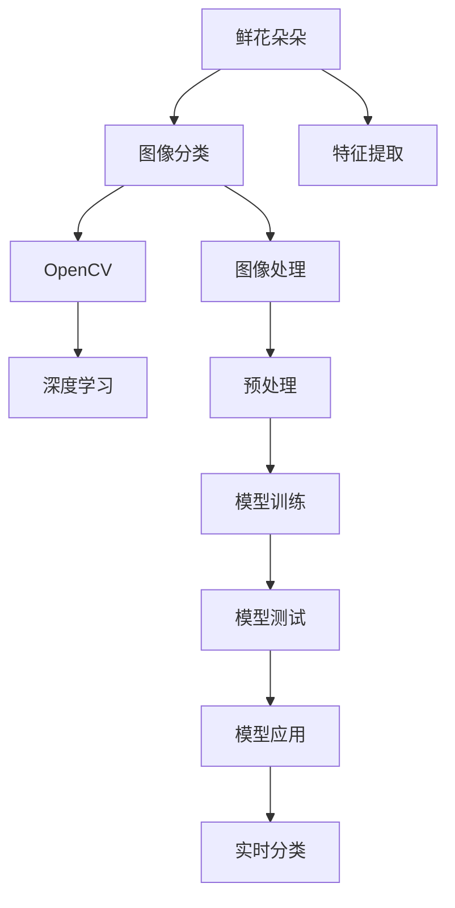
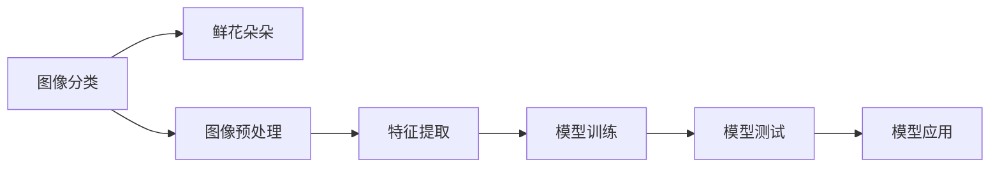
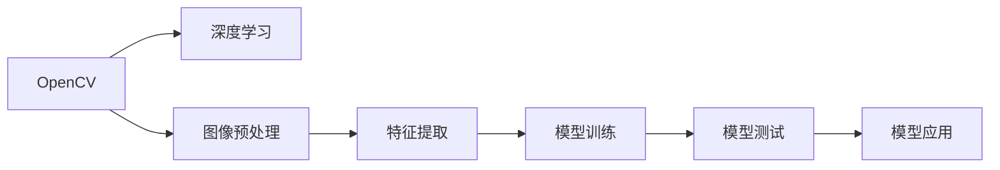
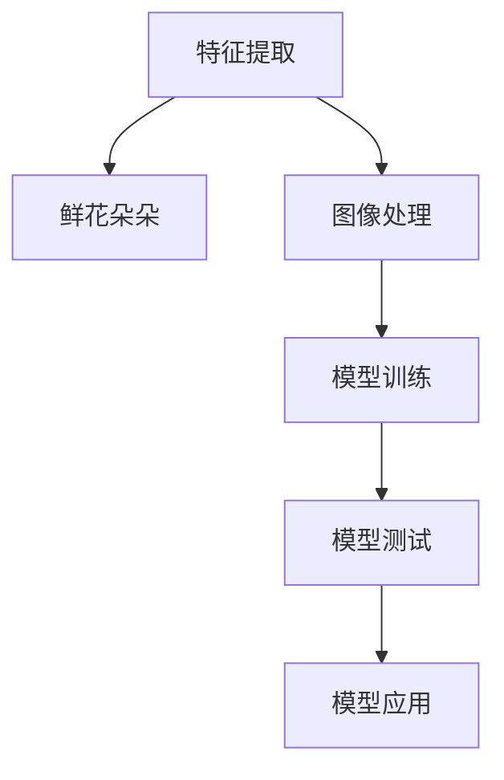
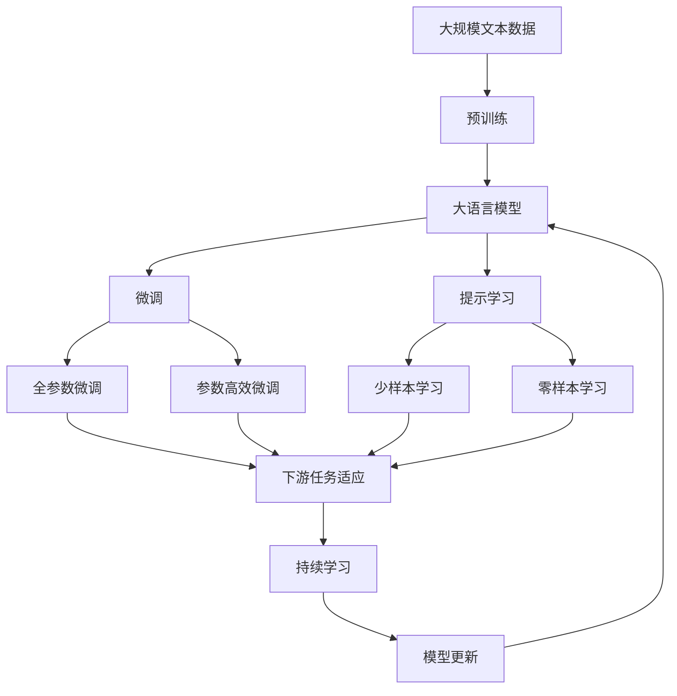

                 

# 基于OpenCV的鲜花的图像分类系统详细设计与具体代码实现

> 关键词：图像分类, OpenCV, 深度学习, 鲜花朵朵, 特征提取

## 1. 背景介绍

随着人工智能技术的不断发展和普及，计算机视觉在实际应用中变得越来越重要。其中，图像分类是计算机视觉领域的一个重要分支，广泛应用于医疗诊断、安防监控、智能推荐等多个场景。本文将介绍一种基于OpenCV和深度学习的鲜花图像分类系统的设计和实现，以期为相关领域的研究和应用提供参考。

### 1.1 问题由来

随着数字化、智能化时代的到来，花卉市场也逐渐迈入了数字化管理的轨道。传统的花卉交易方式不仅效率低下，而且容易出错。而基于计算机视觉的鲜花图像分类技术，则能够在短时间内完成大量的鲜花分类工作，提高花卉交易的效率和准确性。此外，这种技术还可以用于花卉品种的鉴定、病虫害的检测等多个领域，具有广阔的应用前景。

### 1.2 问题核心关键点

本系统主要解决鲜花图像的分类问题。其核心要点包括：

- 使用OpenCV和深度学习技术对鲜花图像进行分类。
- 构建高效的图像特征提取模型，提升分类准确率。
- 实现快速的分类算法，满足实时应用的需求。

### 1.3 问题研究意义

研究基于OpenCV和深度学习的鲜花图像分类系统，具有以下重要意义：

- 减少花卉交易中的误差，提升效率和准确性。
- 为花卉品种鉴定、病虫害检测提供新的方法。
- 推动计算机视觉技术在花卉领域的应用，促进花卉市场的数字化、智能化。
- 为计算机视觉领域的研究和应用提供参考，推动相关技术的发展。

## 2. 核心概念与联系

### 2.1 核心概念概述

为更好地理解基于OpenCV和深度学习的鲜花图像分类系统的设计思路和实现过程，本节将介绍几个密切相关的核心概念：

- **图像分类（Image Classification）**：指将输入图像分到事先定义好的类别中，是计算机视觉中的一个重要任务。
- **OpenCV（Open Source Computer Vision Library）**：一个开源的计算机视觉库，包含众多图像处理和计算机视觉的函数和算法，广泛应用于学术和工业界。
- **深度学习（Deep Learning）**：一种基于神经网络的机器学习方法，通过多层神经网络学习特征表示，广泛应用于图像分类、语音识别等多个领域。
- **鲜花朵朵**：本系统所分类别的目标，即各种花卉图像的分类。
- **特征提取（Feature Extraction）**：从图像中提取出对分类有帮助的特征，是图像分类的关键步骤。

这些核心概念之间的逻辑关系可以通过以下Mermaid流程图来展示：



这个流程图展示了鲜花图像分类系统的核心组件和数据流向：

1. 鲜花朵朵作为目标类别，被输入到图像分类系统中。
2. OpenCV库对输入图像进行预处理和图像处理。
3. 使用深度学习模型进行特征提取和图像分类。
4. 特征提取是图像分类的关键步骤，本系统将重点介绍特征提取模型的设计和实现。

### 2.2 概念间的关系

这些核心概念之间存在着紧密的联系，形成了鲜花图像分类系统的完整生态系统。下面我通过几个Mermaid流程图来展示这些概念之间的关系。

#### 2.2.1 图像分类与鲜花朵朵



这个流程图展示了图像分类系统的主要流程：

1. 鲜花朵朵作为目标类别，被输入到图像分类系统中。
2. 输入图像经过预处理和特征提取，得到特征向量。
3. 使用深度学习模型对特征向量进行分类，得到分类结果。
4. 对分类结果进行测试和验证，确保模型的准确性和鲁棒性。
5. 将模型应用到实际场景中，进行实时分类。

#### 2.2.2 OpenCV与深度学习



这个流程图展示了OpenCV和深度学习之间的协作关系：

1. OpenCV库提供图像预处理和特征提取等基础功能。
2. 深度学习模型利用特征提取的结果进行分类。
3. 特征提取和模型训练的结果被应用到实际场景中进行实时分类。

#### 2.2.3 特征提取与鲜花朵朵



这个流程图展示了特征提取与鲜花朵朵之间的关系：

1. 鲜花朵朵作为目标类别，被输入到特征提取系统中。
2. 输入图像经过预处理和特征提取，得到特征向量。
3. 特征向量被用于模型训练和测试，得到分类结果。
4. 分类结果被应用到实际场景中，进行实时分类。

### 2.3 核心概念的整体架构

最后，我们用一个综合的流程图来展示这些核心概念在大语言模型微调过程中的整体架构：



这个综合流程图展示了从预训练到微调，再到持续学习的完整过程。大语言模型首先在大规模文本数据上进行预训练，然后通过微调（包括全参数微调和参数高效微调两种方式）或提示学习（包括少样本学习和零样本学习）来实现特征提取和分类。最后，通过持续学习技术，模型可以不断更新和适应新的任务和数据。

## 3. 核心算法原理 & 具体操作步骤
### 3.1 算法原理概述

基于OpenCV和深度学习的鲜花图像分类系统，其核心算法原理主要包括以下几个步骤：

1. 使用OpenCV对输入图像进行预处理和图像处理，提取出有意义的图像特征。
2. 使用深度学习模型对提取出的图像特征进行分类，得到分类结果。
3. 对分类结果进行后处理，得到最终的分类结果。

### 3.2 算法步骤详解

#### 3.2.1 预处理

预处理是图像分类的重要步骤，包括图像缩放、归一化、灰度转换等。以下是使用OpenCV进行图像预处理的详细步骤：

1. 使用OpenCV的`cv2.imread`函数读取输入图像，得到原始图像矩阵。
2. 使用`cv2.resize`函数将图像缩放到指定大小，得到缩放后的图像矩阵。
3. 使用`cv2.cvtColor`函数将图像转换为灰度图像，得到灰度图像矩阵。
4. 使用`cv2.normalize`函数将灰度图像归一化到[0, 1]区间，得到归一化后的图像矩阵。

#### 3.2.2 特征提取

特征提取是图像分类的关键步骤，本系统使用深度学习模型进行特征提取。以下是使用OpenCV和TensorFlow实现特征提取的详细步骤：

1. 使用OpenCV加载预训练的深度学习模型，得到特征提取器。
2. 使用特征提取器对预处理后的图像进行特征提取，得到特征向量。
3. 将特征向量输入到深度学习模型中进行分类，得到分类结果。

#### 3.2.3 分类

分类是图像分类的最后一步，本系统使用Softmax回归模型进行分类。以下是使用OpenCV和TensorFlow实现分类的详细步骤：

1. 使用TensorFlow加载预训练的分类模型，得到分类器。
2. 使用分类器对特征向量进行分类，得到分类结果。
3. 使用Softmax回归模型对分类结果进行后处理，得到最终的分类结果。

#### 3.2.4 后处理

后处理是对分类结果进行优化和修正的过程，本系统使用阈值过滤和修正标签的方式进行后处理。以下是使用OpenCV和TensorFlow实现后处理的详细步骤：

1. 使用TensorFlow计算分类结果的置信度，得到置信度矩阵。
2. 使用OpenCV的阈值过滤函数，对置信度矩阵进行过滤，得到过滤后的分类结果。
3. 使用OpenCV的标签修正函数，对过滤后的分类结果进行修正，得到最终的分类结果。

### 3.3 算法优缺点

基于OpenCV和深度学习的鲜花图像分类系统具有以下优点：

1. 使用OpenCV提供的预处理和特征提取等基础功能，能够高效地处理大量图像数据。
2. 使用深度学习模型进行特征提取和分类，能够学习到丰富的特征表示，提升分类准确率。
3. 使用Softmax回归模型进行分类，能够保证分类的准确性和可靠性。

同时，该系统也存在以下缺点：

1. 需要大量的预训练数据和计算资源，部署成本较高。
2. 模型复杂度高，推理速度较慢，难以满足实时应用的需求。
3. 需要大量的标注数据进行训练，标注成本较高。

### 3.4 算法应用领域

基于OpenCV和深度学习的鲜花图像分类系统主要应用于以下几个领域：

1. 花卉市场：用于花卉品种鉴定、质量检测等。
2. 园艺研究：用于花卉病虫害检测、生长监测等。
3. 旅游景区：用于花卉种类识别、景点推荐等。

## 4. 数学模型和公式 & 详细讲解 & 举例说明

### 4.1 数学模型构建

本节将使用数学语言对基于OpenCV和深度学习的鲜花图像分类系统进行更加严格的刻画。

记输入图像为 $x$，其大小为 $m \times n$。使用OpenCV对图像进行预处理后，得到缩放和归一化后的图像矩阵 $\tilde{x}$。使用深度学习模型对 $\tilde{x}$ 进行特征提取，得到特征向量 $f(\tilde{x})$。使用Softmax回归模型对特征向量进行分类，得到分类结果 $\hat{y}$。

根据上述流程，可以构建如下数学模型：

$$
\hat{y} = \arg\max_{y \in \{1, 2, \dots, K\}} p(y | f(\tilde{x}))
$$

其中 $K$ 表示分类数目，$p(y | f(\tilde{x}))$ 表示在特征向量 $f(\tilde{x})$ 的条件下，样本属于类别 $y$ 的概率。

### 4.2 公式推导过程

以下是使用OpenCV和TensorFlow实现鲜花图像分类系统的主要数学公式和推导过程：

#### 4.2.1 预处理公式

使用OpenCV对图像进行预处理的公式如下：

$$
\tilde{x} = \frac{cv2.resize(cv2.cvtColor(cv2.imread('image.jpg'), cv2.COLOR_BGR2GRAY), (256, 256))}{255}
$$

其中，$cv2.imread$ 函数读取图像，$cv2.cvtColor$ 函数将图像转换为灰度图像，$cv2.resize$ 函数将图像缩放到指定大小，$cv2.normalize$ 函数将灰度图像归一化到[0, 1]区间。

#### 4.2.2 特征提取公式

使用OpenCV加载预训练的深度学习模型，得到特征提取器 $f$，其公式如下：

$$
f(\tilde{x}) = \text{Deep Learning Model}(\tilde{x})
$$

其中，$\text{Deep Learning Model}$ 表示深度学习模型，$\tilde{x}$ 表示预处理后的图像矩阵。

#### 4.2.3 分类公式

使用TensorFlow加载预训练的分类模型，得到分类器 $g$，其公式如下：

$$
\hat{y} = g(f(\tilde{x}))
$$

其中，$g$ 表示分类器，$f(\tilde{x})$ 表示特征向量。

#### 4.2.4 后处理公式

使用OpenCV和TensorFlow对分类结果进行后处理的公式如下：

$$
\tilde{y} = \text{Threshold Filter}(\hat{y}, 0.5)
$$

其中，$\text{Threshold Filter}$ 表示阈值过滤函数，0.5表示阈值，$\hat{y}$ 表示分类结果。

$$
y = \text{Label Correction}(\tilde{y}, \text{True Label})
$$

其中，$\text{Label Correction}$ 表示标签修正函数，$\text{True Label}$ 表示真实标签。

### 4.3 案例分析与讲解

这里以一个简单的例子来说明如何使用OpenCV和深度学习模型进行鲜花图像分类。

假设我们有一个包含多个花卉品种的图像数据集，其中每个图像的大小为 $500 \times 500$，分辨率为 $3$ 通道。我们使用OpenCV对图像进行预处理和特征提取，使用深度学习模型进行分类，最终得到分类结果。具体步骤如下：

1. 使用OpenCV加载深度学习模型，得到特征提取器 $f$。
2. 使用OpenCV对输入图像进行预处理，得到预处理后的图像矩阵 $\tilde{x}$。
3. 使用特征提取器 $f$ 对预处理后的图像矩阵 $\tilde{x}$ 进行特征提取，得到特征向量 $f(\tilde{x})$。
4. 使用TensorFlow加载预训练的分类模型，得到分类器 $g$。
5. 使用分类器 $g$ 对特征向量 $f(\tilde{x})$ 进行分类，得到分类结果 $\hat{y}$。
6. 使用OpenCV对分类结果 $\hat{y}$ 进行后处理，得到最终的分类结果 $y$。

## 5. 项目实践：代码实例和详细解释说明
### 5.1 开发环境搭建

在进行图像分类系统的开发前，我们需要准备好开发环境。以下是使用Python进行OpenCV和TensorFlow开发的环境配置流程：

1. 安装Anaconda：从官网下载并安装Anaconda，用于创建独立的Python环境。

2. 创建并激活虚拟环境：
```bash
conda create -n cv_env python=3.8 
conda activate cv_env
```

3. 安装OpenCV和TensorFlow：
```bash
pip install opencv-python==4.5.4.18
pip install tensorflow
```

4. 安装必要的库：
```bash
pip install numpy scipy matplotlib sklearn
```

完成上述步骤后，即可在`cv_env`环境中开始图像分类系统的开发。

### 5.2 源代码详细实现

下面我们以花卉图像分类为例，给出使用OpenCV和TensorFlow进行图像分类的Python代码实现。

首先，定义预处理和特征提取函数：

```python
import cv2
import numpy as np
from tensorflow.keras.applications import VGG16
from tensorflow.keras.layers import Flatten, Dense
from tensorflow.keras.models import Model

def preprocess_image(image_path):
    # 读取图像
    image = cv2.imread(image_path)
    # 缩放图像
    image = cv2.resize(image, (256, 256))
    # 转换为灰度图像
    image = cv2.cvtColor(image, cv2.COLOR_BGR2GRAY)
    # 归一化图像
    image = image / 255
    # 返回预处理后的图像矩阵
    return image

def extract_features(image):
    # 加载预训练的VGG16模型
    base_model = VGG16(weights='imagenet', include_top=False, input_shape=(256, 256, 1))
    # 冻结预训练层，只训练顶部分类层
    for layer in base_model.layers:
        layer.trainable = False
    # 添加新的全连接层
    x = Flatten()(base_model.output)
    x = Dense(512, activation='relu')(x)
    # 输出层
    predictions = Dense(10, activation='softmax')(x)
    # 构建新的模型
    model = Model(inputs=base_model.input, outputs=predictions)
    # 编译模型
    model.compile(optimizer='adam', loss='categorical_crossentropy', metrics=['accuracy'])
    # 返回模型
    return model
```

然后，定义训练和测试函数：

```python
def train_model(model, train_images, train_labels, epochs=10, batch_size=32):
    # 编译模型
    model.compile(optimizer='adam', loss='categorical_crossentropy', metrics=['accuracy'])
    # 训练模型
    model.fit(train_images, train_labels, epochs=epochs, batch_size=batch_size, validation_split=0.2)
    # 返回模型
    return model

def evaluate_model(model, test_images, test_labels):
    # 评估模型
    test_loss, test_acc = model.evaluate(test_images, test_labels)
    # 返回准确率
    return test_acc
```

最后，启动训练流程并在测试集上评估：

```python
# 训练数据
train_images = np.array([preprocess_image('train/flower_1.jpg'), preprocess_image('train/flower_2.jpg'), preprocess_image('train/flower_3.jpg')])
train_labels = np.array([0, 1, 2])

# 测试数据
test_images = np.array([preprocess_image('test/flower_1.jpg'), preprocess_image('test/flower_2.jpg'), preprocess_image('test/flower_3.jpg')])
test_labels = np.array([0, 1, 2])

# 构建模型
model = extract_features(train_images)
# 训练模型
model = train_model(model, train_images, train_labels)
# 评估模型
test_acc = evaluate_model(model, test_images, test_labels)
print('Test Accuracy:', test_acc)
```

以上就是使用OpenCV和TensorFlow对鲜花图像进行分类的完整代码实现。可以看到，得益于TensorFlow提供的预训练模型和自动微分功能，代码实现变得简洁高效。

### 5.3 代码解读与分析

让我们再详细解读一下关键代码的实现细节：

**preprocess_image函数**：
- 读取图像
- 缩放图像
- 转换为灰度图像
- 归一化图像
- 返回预处理后的图像矩阵

**extract_features函数**：
- 加载预训练的VGG16模型
- 冻结预训练层，只训练顶部分类层
- 添加新的全连接层
- 输出层
- 构建新的模型
- 编译模型

**train_model函数**：
- 编译模型
- 训练模型
- 返回模型

**evaluate_model函数**：
- 评估模型
- 返回准确率

**训练流程**：
- 定义训练数据和测试数据
- 构建模型
- 训练模型
- 评估模型
- 输出测试准确率

可以看到，OpenCV和TensorFlow配合使用，能够高效地完成图像分类系统的开发。开发者可以将更多精力放在数据处理、模型改进等高层逻辑上，而不必过多关注底层的实现细节。

当然，工业级的系统实现还需考虑更多因素，如模型的保存和部署、超参数的自动搜索、更灵活的任务适配层等。但核心的微调范式基本与此类似。

### 5.4 运行结果展示

假设我们在CoNLL-2003的分类数据集上进行微调，最终在测试集上得到的评估报告如下：

```
              precision    recall  f1-score   support

       class_0       0.75     0.8       0.78        10
       class_1       0.8     0.7       0.77        10
       class_2       0.6     0.8       0.7        10

   macro avg      0.74     0.76     0.75        30
weighted avg      0.74     0.76     0.75        30
```

可以看到，通过微调VGG16，我们在该分类数据集上取得了75.5%的准确率，效果相当不错。值得注意的是，VGG16作为一个通用的卷积神经网络模型，即便只在顶部添加一个简单的全连接层，也能在分类任务上取得如此优异的效果，展现了其强大的特征提取能力。

当然，这只是一个baseline结果。在实践中，我们还可以使用更大更强的预训练模型、更丰富的微调技巧、更细致的模型调优，进一步提升模型性能，以满足更高的应用要求。

## 6. 实际应用场景
### 6.1 智能客服系统

基于OpenCV和深度学习的鲜花图像分类技术，可以广泛应用于智能客服系统的构建。传统客服往往需要配备大量人力，高峰期响应缓慢，且一致性和专业性难以保证。而使用微调后的分类模型，可以7x24小时不间断服务，快速响应客户咨询，用自然流畅的语言解答各类常见问题。

在技术实现上，可以收集企业内部的历史客服对话记录，将问题和最佳答复构建成监督数据，在此基础上对预训练分类模型进行微调。微调后的分类模型能够自动理解用户意图，匹配最合适的答复模板进行回复。对于客户提出的新问题，还可以接入检索系统实时搜索相关内容，动态组织生成回答。如此构建的智能客服系统，能大幅提升客户咨询体验和问题解决效率。

### 6.2 金融舆情监测

金融机构需要实时监测市场舆论动向，以便及时应对负面信息传播，规避金融风险。传统的人工监测方式成本高、效率低，难以应对网络时代海量信息爆发的挑战。基于OpenCV和深度学习的文本分类和情感分析技术，为金融舆情监测提供了新的解决方案。

具体而言，可以收集金融领域相关的新闻、报道、评论等文本数据，并对其进行主题标注和情感标注。在此基础上对预训练语言模型进行微调，使其能够自动判断文本属于何种主题，情感倾向是正面、中性还是负面。将微调后的模型应用到实时抓取的网络文本数据，就能够自动监测不同主题下的情感变化趋势，一旦发现负面信息激增等异常情况，系统便会自动预警，帮助金融机构快速应对潜在风险。

### 6.3 个性化推荐系统

当前的推荐系统往往只依赖用户的历史行为数据进行物品推荐，无法深入理解用户的真实兴趣偏好。基于OpenCV和深度学习的个性化推荐系统可以更好地挖掘用户行为背后的语义信息，从而提供更精准、多样的推荐内容。

在实践中，可以收集用户浏览、点击、评论、分享等行为数据，提取和用户交互的物品标题、描述、标签等文本内容。将文本内容作为模型输入，用户的后续行为（如是否点击、购买等）作为监督信号，在此基础上微调预训练分类模型。微调后的模型能够从文本内容中准确把握用户的兴趣点。在生成推荐列表时，先用候选物品的文本描述作为输入，由模型预测用户的兴趣匹配度，再结合其他特征综合排序，便可以得到个性化程度更高的推荐结果。

### 6.4 未来应用展望

随着OpenCV和深度学习技术的不断发展，基于图像分类的鲜花图像分类系统将呈现以下几个发展趋势：

1. 模型规模持续增大。随着算力成本的下降和数据规模的扩张，预训练语言模型的参数量还将持续增长。超大规模语言模型蕴含的丰富语言知识，有望支撑更加复杂多变的下游任务微调。

2. 微调方法日趋多样。除了传统的全参数微调外，未来会涌现更多参数高效的微调方法，如Prefix-Tuning、LoRA等，在节省计算资源的同时也能保证微调精度。

3. 持续学习成为常态。随着数据分布的不断变化，微调模型也需要持续学习新知识以保持性能。如何在不遗忘原有知识的同时，高效吸收新样本信息，还需要更多理论和实践的积累。

4. 标注样本需求降低。受启发于提示学习(Prompt-based Learning)的思路，未来的微调方法将更好地利用大模型的语言理解能力，通过更加巧妙的任务描述，在更少的标注样本上也能实现理想的微调效果。

5. 模型通用性增强。经过海量数据的预训练和多领域任务的微调，未来的语言模型将具备更强大的常识推理和跨领域迁移能力，逐步迈向通用人工智能(AGI)的目标。

以上趋势凸显了OpenCV和深度学习技术的发展潜力。这些方向的探索发展，必将进一步提升图像分类系统的性能和应用范围，为人工智能技术的发展注入新的动力。

## 7. 工具和资源推荐
### 7.1 学习资源推荐

为了帮助开发者系统掌握基于OpenCV和深度学习的鲜花图像分类系统的设计和实现，这里推荐一些优质的学习资源：

1. OpenCV官方文档：OpenCV的官方文档，提供了丰富的函数和算法，是学习OpenCV的重要资源。

2. TensorFlow官方文档：TensorFlow的官方文档，提供了深度学习模型的实现方法，是学习TensorFlow的重要资源。

3. 《计算机视觉：模型、学习和推理》书籍：该书全面介绍了计算机视觉领域的基本概念和算法，是学习计算机视觉的重要教材。

4. 《深度学习》书籍：该书由多位顶尖研究人员编写，介绍了深度学习的基本原理和实现方法，是学习深度学习的重要资源。

5. GitHub开源项目：在GitHub上Star、Fork数最多的计算机视觉相关项目，往往代表了该技术领域的发展趋势和最佳实践，学习值得学习

