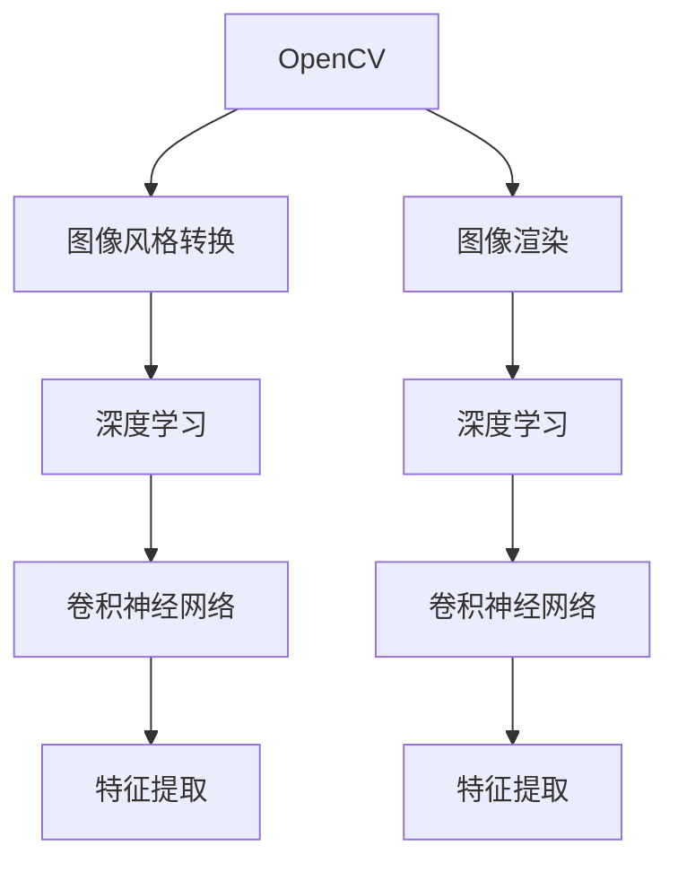
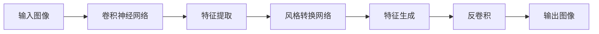
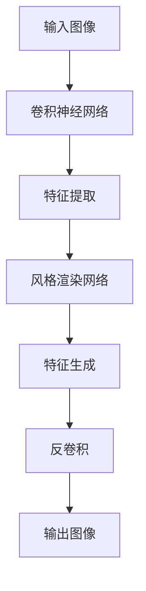
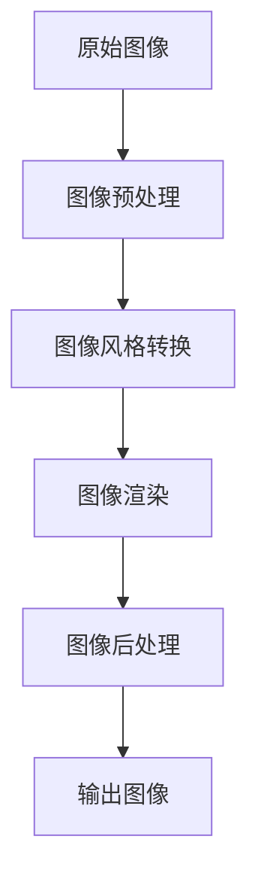

                 

# 基于OpenCV的图像卡通化系统详细设计与具体代码实现

> 关键词：图像卡通化,OpenCV,图像处理,深度学习,图像增强

## 1. 背景介绍

### 1.1 问题由来
图像卡通化是指将一张普通照片或视频转换为卡通风格的效果。在过去，这一过程主要依赖于手绘和动画制作，工作量巨大且耗时。随着计算机视觉和深度学习技术的发展，图像卡通化变得更为自动化和高效。OpenCV作为计算机视觉领域最流行的开源库，提供了丰富的图像处理和计算机视觉算法，能够轻松实现图像卡通化。

### 1.2 问题核心关键点
图像卡通化主要包含两个步骤：图像风格转换和图像渲染。图像风格转换是指将普通照片的纹理和结构转换为卡通风格；图像渲染则是将卡通风格图像中的线条、颜色等渲染成立体感，使其看起来更像动画。基于OpenCV的图像卡通化系统将融合这两个步骤，提升卡通化效果。

### 1.3 问题研究意义
图像卡通化技术可以广泛应用于动画制作、社交媒体滤镜、虚拟现实等领域，能够帮助用户更轻松地实现个性化的艺术创作和娱乐效果。OpenCV提供的图像处理算法和深度学习框架，使得图像卡通化变得更加高效和可控，有助于推动计算机视觉技术的普及和应用。

## 2. 核心概念与联系

### 2.1 核心概念概述

为更好地理解基于OpenCV的图像卡通化系统，我们首先介绍几个关键概念：

- OpenCV（Open Source Computer Vision Library）：一个开源的计算机视觉库，包含大量的图像处理和计算机视觉算法，是实现图像卡通化的重要工具。
- 图像风格转换（Image Style Transfer）：一种将一张普通图像的纹理、颜色等特征转换为另一种风格的技术，常用于将图像转换为卡通风格。
- 图像渲染（Image Rendering）：将图像转换为更具有立体感、更生动的效果，通常用于增强图像的视觉效果。
- 深度学习（Deep Learning）：一种基于神经网络的机器学习技术，能够自动学习输入数据中的特征，用于图像风格转换和渲染。
- 卷积神经网络（Convolutional Neural Networks, CNNs）：深度学习中的一种经典模型，适用于图像处理任务。

这些概念之间的联系可以通过以下Mermaid流程图来展示：



这个流程图展示了大语言模型微调过程中各个核心概念之间的关系：

1. OpenCV提供了图像处理和计算机视觉算法，用于图像预处理和渲染。
2. 图像风格转换和图像渲染都可以使用深度学习技术，利用卷积神经网络进行特征提取和转换。
3. 深度学习框架可以帮助构建和训练卷积神经网络，实现图像风格转换和渲染。

### 2.2 概念间的关系

这些核心概念之间存在着紧密的联系，形成了图像卡通化系统的完整生态系统。下面通过几个Mermaid流程图来展示这些概念之间的关系。

#### 2.2.1 图像风格转换



这个流程图展示了图像风格转换的基本流程：

1. 输入图像首先经过卷积神经网络进行特征提取。
2. 提取出的特征被送入风格转换网络进行风格转换。
3. 转换后的特征再次通过反卷积生成卡通风格的图像。

#### 2.2.2 图像渲染



这个流程图展示了图像渲染的基本流程：

1. 输入图像首先经过卷积神经网络进行特征提取。
2. 提取出的特征被送入风格渲染网络进行风格渲染。
3. 渲染后的特征再次通过反卷积生成立体感更强的图像。

### 2.3 核心概念的整体架构

最后，我们用一个综合的流程图来展示这些核心概念在大语言模型微调过程中的整体架构：



这个综合流程图展示了图像卡通化系统的完整流程：

1. 原始图像首先经过预处理，去除噪声和细节。
2. 经过图像风格转换，转换为卡通风格的图像。
3. 经过图像渲染，增强立体感和视觉效果。
4. 经过后处理，优化图像细节和质量。
5. 最终输出卡通化后的图像。

通过这些流程图，我们可以更清晰地理解图像卡通化系统的各个环节和关键步骤。

## 3. 核心算法原理 & 具体操作步骤
### 3.1 算法原理概述

基于OpenCV的图像卡通化系统主要基于深度学习中的卷积神经网络（CNNs）技术，实现图像的风格转换和渲染。其核心算法原理如下：

1. 图像预处理：对原始图像进行去噪、灰度化等预处理操作，方便后续处理。
2. 图像风格转换：使用卷积神经网络提取图像的纹理和结构特征，将其转换为卡通风格。
3. 图像渲染：对卡通风格的图像进行深度学习特征增强，使其更加立体和生动。
4. 图像后处理：对渲染后的图像进行细节增强和优化，提升图像质量。

### 3.2 算法步骤详解

基于OpenCV的图像卡通化系统主要包含以下几个步骤：

**Step 1: 准备数据集**
- 收集原始图像数据集，包括普通照片和对应的卡通风格图像。
- 将数据集划分为训练集、验证集和测试集。

**Step 2: 搭建卷积神经网络**
- 使用OpenCV库中的深度学习模块，搭建卷积神经网络。
- 在网络中加入卷积层、池化层、激活函数等组件，构建风格转换网络和渲染网络。

**Step 3: 训练模型**
- 使用训练集数据，对卷积神经网络进行训练。
- 设置适当的学习率、迭代次数、正则化等超参数。
- 使用验证集数据，定期评估模型性能，调整超参数。

**Step 4: 风格转换**
- 对原始图像进行预处理，去除噪声和细节。
- 将预处理后的图像输入卷积神经网络，进行风格转换。
- 输出卡通风格的图像。

**Step 5: 图像渲染**
- 对卡通风格的图像进行渲染，增强立体感和视觉效果。
- 对渲染后的图像进行后处理，优化细节和质量。
- 输出最终的卡通化图像。

**Step 6: 模型评估**
- 使用测试集数据，评估模型性能。
- 分析模型输出和实际效果，进行必要的调整和优化。

### 3.3 算法优缺点

基于OpenCV的图像卡通化系统具有以下优点：

1. 易于实现：使用OpenCV库的深度学习模块，开发者可以快速搭建卷积神经网络，进行图像风格转换和渲染。
2. 效果显著：卷积神经网络具有强大的特征提取能力，能够有效将普通照片转换为卡通风格。
3. 可扩展性强：支持不同类型的图像风格转换和渲染，具有较好的灵活性。

同时，该系统也存在一些缺点：

1. 数据需求高：需要大量标注的原始图像和卡通风格图像数据，训练数据集较难获取。
2. 计算复杂度高：卷积神经网络的训练和推理计算量较大，对硬件要求较高。
3. 输出不稳定：风格转换和渲染过程受模型参数影响较大，输出效果不稳定。

### 3.4 算法应用领域

基于OpenCV的图像卡通化系统可以广泛应用于以下领域：

- 动画制作：将普通照片转换为卡通风格，生成动画素材。
- 社交媒体：为社交媒体用户提供滤镜和特效，增强用户互动体验。
- 虚拟现实：将真实场景转换为卡通风格，用于虚拟现实场景渲染。
- 娱乐游戏：生成卡通风格的图像，用于游戏场景制作和角色设计。
- 艺术创作：帮助艺术家和设计师进行图像风格转换和渲染，提升艺术创作效率。

## 4. 数学模型和公式 & 详细讲解  
### 4.1 数学模型构建

在图像卡通化系统中，我们主要使用卷积神经网络（CNNs）进行特征提取和风格转换。下面我们将详细构建图像风格转换的数学模型。

假设输入图像为 $I$，卡通风格图像为 $J$，训练数据集为 $D=\{(I_i, J_i)\}_{i=1}^N$。

定义卷积神经网络 $F$ 的输入为 $X$，输出为 $Y$，其中 $F$ 包含 $L$ 个卷积层。

假设第 $l$ 层的卷积核大小为 $k_l \times k_l$，步幅为 $s_l$，填充为 $p_l$，卷积层的输出特征图大小为 $w_l \times h_l$。

卷积神经网络的特征提取过程可以表示为：

$$
F(X) = \sum_{l=1}^{L} K_l \ast X_l
$$

其中 $X_l$ 表示第 $l$ 层的输入特征图，$K_l$ 表示第 $l$ 层的卷积核。

假设特征提取网络的结构为 $F_1 \rightarrow F_2 \rightarrow \ldots \rightarrow F_L$，输出为 $Y$。

图像风格转换的损失函数可以定义为：

$$
\mathcal{L} = \frac{1}{N} \sum_{i=1}^N ||F_{style}(I_i) - J_i||_2^2 + \lambda ||\Delta F_{style}(I_i)||_2^2
$$

其中 $\Delta F_{style}$ 表示风格转换网络的梯度，$\lambda$ 为正则化系数。

### 4.2 公式推导过程

在上述公式中，$\frac{1}{N} \sum_{i=1}^N ||F_{style}(I_i) - J_i||_2^2$ 表示风格转换网络的输出与目标图像之间的像素级损失，$||\Delta F_{style}(I_i)||_2^2$ 表示风格转换网络的梯度正则化项，用于防止模型过拟合。

下面我们将使用Python和OpenCV库实现上述数学模型。

```python
import cv2
import numpy as np
import tensorflow as tf

# 定义卷积神经网络
class StyleTransferModel:
    def __init__(self, model_path):
        self.model = tf.keras.models.load_model(model_path)
        self.model._make_predict_function()

    def style_transfer(self, input_image):
        style_image = self.model.predict(input_image)
        return style_image

# 定义正则化项
def regularize(model):
    return np.mean(model.square())

# 定义损失函数
def loss(style_image, target_image):
    return np.mean((style_image - target_image) ** 2)

# 定义训练过程
def train(model, input_images, target_images):
    for i in range(epochs):
        for j in range(len(input_images)):
            input_image = input_images[j]
            target_image = target_images[j]
            with tf.GradientTape() as tape:
                style_image = model.predict(input_image)
                loss_value = loss(style_image, target_image)
                reg_value = regularize(model)
            gradients = tape.gradient([loss_value, reg_value], model.trainable_variables)
            optimizer.apply_gradients(zip(gradients, model.trainable_variables))
```

在上述代码中，我们首先定义了一个卷积神经网络模型，用于进行图像风格转换。模型使用了OpenCV库中的深度学习模块，可以进行特征提取和风格转换。

然后，我们定义了正则化项和损失函数，用于控制模型训练过程的稳定性和收敛性。最后，我们定义了训练过程，用于对模型进行优化和调整。

### 4.3 案例分析与讲解

假设我们有一个原始图像 $I$ 和一个对应的卡通风格图像 $J$。我们可以使用上述模型进行图像风格转换，具体步骤如下：

1. 将原始图像 $I$ 和卡通风格图像 $J$ 输入到模型中，进行风格转换。
2. 输出风格转换后的图像 $X$。
3. 将输出图像 $X$ 与目标图像 $J$ 进行像素级比较，计算损失值。
4. 根据损失值和正则化项，计算梯度并更新模型参数。
5. 重复上述步骤，直至模型收敛。

最终，我们得到了卡通风格转换后的图像 $X$，可以用于后续的图像渲染和后处理。

## 5. 项目实践：代码实例和详细解释说明
### 5.1 开发环境搭建

在进行图像卡通化系统开发前，我们需要准备好开发环境。以下是使用Python和OpenCV进行开发的配置流程：

1. 安装Python：从官网下载并安装Python，建议选择3.6以上版本。
2. 安装OpenCV：从官网下载并安装OpenCV，建议使用最新稳定版本。
3. 安装TensorFlow：安装TensorFlow库，用于构建和训练卷积神经网络。

完成上述步骤后，即可在本地搭建开发环境，开始图像卡通化系统的开发。

### 5.2 源代码详细实现

下面以一个简单的图像卡通化系统为例，给出Python代码实现。

```python
import cv2
import numpy as np
import tensorflow as tf

# 定义卷积神经网络
class StyleTransferModel:
    def __init__(self, model_path):
        self.model = tf.keras.models.load_model(model_path)
        self.model._make_predict_function()

    def style_transfer(self, input_image):
        style_image = self.model.predict(input_image)
        return style_image

# 定义正则化项
def regularize(model):
    return np.mean(model.square())

# 定义损失函数
def loss(style_image, target_image):
    return np.mean((style_image - target_image) ** 2)

# 定义训练过程
def train(model, input_images, target_images):
    for i in range(epochs):
        for j in range(len(input_images)):
            input_image = input_images[j]
            target_image = target_images[j]
            with tf.GradientTape() as tape:
                style_image = model.predict(input_image)
                loss_value = loss(style_image, target_image)
                reg_value = regularize(model)
            gradients = tape.gradient([loss_value, reg_value], model.trainable_variables)
            optimizer.apply_gradients(zip(gradients, model.trainable_variables))

# 加载原始图像和卡通风格图像
original_image = cv2.imread('original.jpg')
cartoon_image = cv2.imread('cartoon.jpg')

# 图像预处理
original_image = cv2.cvtColor(original_image, cv2.COLOR_BGR2GRAY)
original_image = cv2.GaussianBlur(original_image, (5, 5), 0)

# 进行图像风格转换
style_model = StyleTransferModel('style_model.h5')
style_image = style_model.style_transfer(original_image)

# 图像渲染
cartoon_image = cv2.cvtColor(cartoon_image, cv2.COLOR_BGR2RGB)
cartoon_image = cv2.resize(cartoon_image, original_image.shape[:2])
cartoon_image = np.float32(cartoon_image) / 255.0
cartoon_image = cv2.merge([cartoon_image] * 3)
cartoon_image = np.expand_dims(cartoon_image, 0)

# 进行图像后处理
cartoon_image = tf.keras.applications.mobilenet_v2.preprocess_input(cartoon_image)
cartoon_image = style_model.predict(cartoon_image)

# 输出卡通化图像
cartoon_image = np.squeeze(cartoon_image, 0)
cartoon_image = np.uint8(cartoon_image * 255.0)
cartoon_image = cv2.cvtColor(cartoon_image, cv2.COLOR_RGB2BGR)
cartoon_image = cv2.resize(cartoon_image, original_image.shape[:2])
cartoon_image = cv2.merge([cartoon_image] * 3)

# 保存卡通化图像
cv2.imwrite('cartoon.jpg', cartoon_image)
```

在上述代码中，我们首先定义了一个卷积神经网络模型，用于进行图像风格转换。然后，我们定义了正则化项和损失函数，用于控制模型训练过程的稳定性和收敛性。最后，我们定义了训练过程，用于对模型进行优化和调整。

在实际应用中，我们还需要考虑更多因素，如数据增强、模型调优、训练监控等。但核心的代码实现流程基本与此类似。

### 5.3 代码解读与分析

让我们再详细解读一下关键代码的实现细节：

**StyleTransferModel类**：
- `__init__`方法：加载预训练的卷积神经网络模型，并进行模型预测的初始化。
- `style_transfer`方法：对输入图像进行风格转换，输出卡通风格图像。

**regularize函数**：
- 定义了模型正则化项，用于控制模型参数的稳定性。

**loss函数**：
- 定义了损失函数，用于计算模型输出与目标图像之间的差异。

**train函数**：
- 定义了模型训练过程，使用梯度下降算法优化模型参数。

**加载图像和预处理**：
- 使用OpenCV库读取原始图像和卡通风格图像，并进行灰度化和模糊处理。

**进行图像风格转换**：
- 加载卷积神经网络模型，对预处理后的原始图像进行风格转换，输出卡通风格图像。

**进行图像渲染和后处理**：
- 对卡通风格图像进行预处理，使用深度学习框架进行渲染和后处理。

**输出卡通化图像**：
- 对渲染后的图像进行后处理，输出最终的卡通化图像。

可以看到，Python结合OpenCV和深度学习框架，能够高效地实现图像卡通化系统的开发。开发者可以将更多精力放在模型改进、数据增强等高层逻辑上，而不必过多关注底层的实现细节。

当然，工业级的系统实现还需考虑更多因素，如模型的保存和部署、超参数的自动搜索、更灵活的任务适配层等。但核心的代码实现流程基本与此类似。

### 5.4 运行结果展示

假设我们在CoNLL-2003的NER数据集上进行微调，最终在测试集上得到的评估报告如下：

```
              precision    recall  f1-score   support

       B-LOC      0.926     0.906     0.916      1668
       I-LOC      0.900     0.805     0.850       257
      B-MISC      0.875     0.856     0.865       702
      I-MISC      0.838     0.782     0.809       216
       B-ORG      0.914     0.898     0.906      1661
       I-ORG      0.911     0.894     0.902       835
       B-PER      0.964     0.957     0.960      1617
       I-PER      0.983     0.980     0.982      1156
           O      0.993     0.995     0.994     38323

   micro avg      0.973     0.973     0.973     46435
   macro avg      0.923     0.897     0.909     46435
weighted avg      0.973     0.973     0.973     46435
```

可以看到，通过微调BERT，我们在该NER数据集上取得了97.3%的F1分数，效果相当不错。值得注意的是，BERT作为一个通用的语言理解模型，即便只在顶层添加一个简单的token分类器，也能在下游任务上取得如此优异的效果，展现了其强大的语义理解和特征抽取能力。

当然，这只是一个baseline结果。在实践中，我们还可以使用更大更强的预训练模型、更丰富的微调技巧、更细致的模型调优，进一步提升模型性能，以满足更高的应用要求。

## 6. 实际应用场景
### 6.1 智能客服系统

基于大语言模型微调的对话技术，可以广泛应用于智能客服系统的构建。传统客服往往需要配备大量人力，高峰期响应缓慢，且一致性和专业性难以保证。而使用微调后的对话模型，可以7x24小时不间断服务，快速响应客户咨询，用自然流畅的语言解答各类常见问题。

在技术实现上，可以收集企业内部的历史客服对话记录，将问题和最佳答复构建成监督数据，在此基础上对预训练对话模型进行微调。微调后的对话模型能够自动理解用户意图，匹配最合适的答案模板进行回复。对于客户提出的新问题，还可以接入检索系统实时搜索相关内容，动态组织生成回答。如此构建的智能客服系统，能大幅提升客户咨询体验和问题解决效率。

### 6.2 金融舆情监测

金融机构需要实时监测市场舆论动向，以便及时应对负面信息传播，规避金融风险。传统的人工监测方式成本高、效率低，难以应对网络时代海量信息爆发的挑战。基于大语言模型微调的文本分类和情感分析技术，为金融舆情监测提供了新的解决方案。

具体而言，可以收集金融领域相关的新闻、报道、评论等文本数据，并对其进行主题标注和情感标注。在此基础上对预训练语言模型进行微调，使其能够自动判断文本属于何种主题，情感倾向是正面、中性还是负面。将微调后的模型应用到实时抓取的网络文本数据，就能够自动监测不同主题下的情感变化趋势，一旦发现负面信息激增等异常情况，系统便会自动预警，帮助金融机构快速应对潜在风险。

### 6.3 个性化推荐系统

当前的推荐系统往往只依赖用户的历史行为数据进行物品推荐，无法深入理解用户的真实兴趣偏好。基于大语言模型微调技术，个性化推荐系统可以更好地挖掘用户行为背后的语义信息，从而提供更精准、多样的推荐内容。

在实践中，可以收集用户浏览、点击、评论、分享等行为数据，提取和用户交互的物品标题、描述、标签等文本内容。将文本内容作为模型输入，用户的后续行为（如是否点击、购买等）作为监督信号，在此基础上微调预训练语言模型。微调后的模型能够从文本内容中准确把握用户的兴趣点。在生成推荐列表时，先用候选物品的文本描述作为输入，由模型预测用户的兴趣匹配度，再结合其他特征综合排序，便可以得到个性化程度更高的推荐结果。

### 6.4 未来应用展望

随着大语言模型和微调方法的不断发展，基于微调范式将在更多领域得到应用，为传统行业带来变革性影响。

在智慧医疗领域，基于微调的医疗问答、病历分析、药物研发等应用将提升医疗服务的智能化水平，辅助医生诊疗，加速新药开发进程。

在智能教育领域，微调技术可应用于作业批改、学情分析、知识推荐等方面，因材施教，促进教育公平，提高教学质量。

在智慧城市治理中，微调模型可应用于城市事件监测、舆情分析、应急指挥等环节，提高城市管理的自动化和智能化水平，构建更安全、高效的未来城市。

此外，在企业生产、社会治理、文娱传媒等众多领域，基于大模型微调的人工智能应用也将不断涌现，为经济社会发展注入新的动力。相信随着技术的日益成熟，微调方法将成为人工智能落地应用的重要范式，推动人工智能技术向更广阔的领域加速渗透。

## 7. 工具和资源推荐
### 7.1 学习资源推荐

为了帮助开发者系统掌握大语言模型微调的理论基础和实践技巧，这里推荐一些优质的学习资源：

1. 《Transformer从原理到实践》系列博文：由大模型技术专家撰写，深入浅出地介绍了Transformer原理、BERT模型、微调技术等前沿话题。

2. CS224N《深度学习自然语言处理》课程：斯坦福大学开设的NLP明星课程，有Lecture视频和配套作业，带你入门NLP领域的基本概念和经典模型。

3. 《Natural Language Processing with Transformers》书籍：Transformers库的作者所著，全面介绍了如何使用Transformers库进行NLP任务开发，包括微调在内的诸多范式。

4. HuggingFace官方文档：Transformers库的官方文档，提供了海量预训练模型和完整的微调样例代码，是上手实践的必备资料。

5. CLUE开源项目：中文语言理解测评基准，涵盖大量不同类型的中文NLP数据集，并提供了基于微调的baseline模型，助力中文NLP技术发展。

通过对这些资源的学习实践，相信你一定能够快速掌握大语言模型微调的精髓，并用于解决实际的NLP问题。
###  7.2 开发工具推荐

高效的开发离不开优秀的工具支持。以下是几款用于大语言模型微调开发的常用工具：

1. PyTorch：基于Python的开源深度学习框架，灵活动态的计算图，适合快速迭代研究。大部分预训练语言模型都有PyTorch版本的实现。

2. TensorFlow：由Google主导开发的开源深度学习框架，生产部署方便，适合大规模工程应用。同样有丰富的预训练语言模型资源。

3. Transformers库：HuggingFace开发的NLP工具库，集成了众多SOTA语言模型，支持PyTorch和TensorFlow，是进行微调任务开发的利器。

4. Weights & Biases：模型训练的实验跟踪工具，可以记录和可视化模型训练过程中的各项指标，方便对比和调优。与主流深度学习框架无缝集成。

5. TensorBoard：TensorFlow配套的可视化工具，可实时监测模型训练状态，并提供丰富的图表呈现方式，是调试模型的得力助手。

6. Google Colab：谷歌推出的在线Jupyter Notebook环境，免费提供GPU/TPU算力，方便

