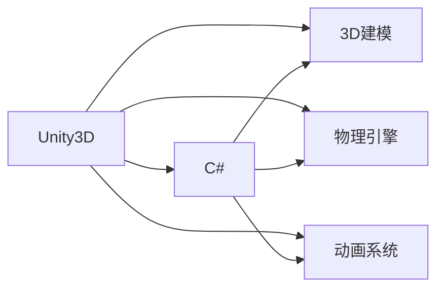

                 

## 1. 背景介绍

跑酷游戏（Parkour）是一种高度刺激且充满创意的体育游戏，它强调敏捷、技巧和反应能力，玩家通过跨越障碍、攀爬和滑动来达到终点。跑酷游戏的主要特点是高度互动性和真实感，玩家可以通过各种操作来控制角色的移动和动作。在Unity3D平台上开发跑酷游戏，可以让游戏开发者以更高效、更灵活的方式实现游戏逻辑和物理效果。

### 1.1 游戏需求

为了展示基于Unity3D的跑酷游戏的开发过程，本文将详细介绍一个简单的跑酷游戏的需求和实现方法。游戏的主要目标是：

1. **角色控制**：玩家需要通过键盘控制角色的移动，包括跳跃、攀爬、滑动等。
2. **障碍设置**：游戏场景中包含各种障碍，包括墙壁、管道、跳跃板等。
3. **碰撞检测**：角色与障碍碰撞时，应进行相应的处理，如减速、反弹等。
4. **分数计算**：根据玩家完成游戏关卡的时间或达成目标，计算得分。
5. **游戏循环**：实现游戏循环机制，包括关卡切换、分数更新等。

### 1.2 游戏开发环境

Unity3D是一款强大的游戏引擎，支持多种平台和编程语言，包括C#和JavaScript。Unity3D提供了丰富的开发工具和资源库，可以帮助开发者快速开发高质量的游戏。本文将使用Unity3D 2020.3版本，并使用C#作为游戏脚本语言。

## 2. 核心概念与联系

### 2.1 核心概念概述

在基于Unity3D的跑酷游戏开发中，涉及以下几个核心概念：

- **Unity3D**：一个强大的游戏引擎，支持创建高质量的3D游戏和应用。
- **C#**：一种现代化的编程语言，易于学习和使用，支持快速开发。
- **3D建模**：使用Unity3D的3D建模工具，创建逼真的游戏场景。
- **物理引擎**：Unity3D内置的物理引擎，用于实现游戏物体的碰撞和运动。
- **动画系统**：Unity3D提供的动画系统，用于创建角色的动作和动画效果。

### 2.2 概念间的关系

这些核心概念通过Unity3D的框架结构联系在一起，形成了一个完整的跑酷游戏开发环境。下图展示了这些概念之间的联系：



## 3. 核心算法原理 & 具体操作步骤

### 3.1 算法原理概述

基于Unity3D的跑酷游戏开发主要涉及以下算法原理：

- **角色控制算法**：使用C#编写脚本，实现角色的移动和操作。
- **碰撞检测算法**：使用Unity3D的物理引擎，实现角色与障碍的碰撞检测。
- **动画控制算法**：使用Unity3D的动画系统，实现角色的动作和动画效果。
- **游戏循环算法**：使用C#编写脚本，实现游戏循环机制，包括关卡切换和分数更新。

### 3.2 算法步骤详解

#### 3.2.1 角色控制算法

角色控制算法是跑酷游戏开发的核心部分。通过C#编写脚本，可以实现角色的移动和操作。以下是实现角色控制的基本步骤：

1. **创建角色对象**：在Unity3D的Hierarchy视图中创建一个空的 GameObject，为其添加一个角色模型和碰撞体。
2. **编写控制脚本**：创建一个C#脚本，编写角色的移动和操作逻辑。
3. **绑定输入事件**：将控制脚本绑定到输入事件，如键盘按键。

下面是一个简单的角色控制脚本示例：

```csharp
using UnityEngine;

public class PlayerController : MonoBehaviour
{
    public float speed = 5f;
    public float jumpPower = 5f;
    public float moveAmount = 0.1f;

    private Rigidbody rb;
    private Animator animator;

    void Start()
    {
        rb = GetComponent<Rigidbody>();
        animator = GetComponent<Animator>();
    }

    void Update()
    {
        float moveX = Input.GetAxis("Horizontal");
        rb.velocity = new Vector3(moveX * speed, rb.velocity.y, 0);
        animator.SetFloat("Speed", moveX);
    }

    void OnGround()
    {
        animator.SetTrigger("Grounded");
    }

    void OnJump()
    {
        rb.AddForce(new Vector3(0, jumpPower, 0));
        animator.SetTrigger("Jump");
    }
}
```

在上面的代码中，`PlayerController`类实现了角色的移动和操作逻辑。`Update`方法根据用户的输入控制角色的移动速度和方向，`OnGround`方法检测角色是否在地面上，`OnJump`方法实现跳跃操作。

#### 3.2.2 碰撞检测算法

碰撞检测是跑酷游戏的关键部分。使用Unity3D的物理引擎，可以实现角色与障碍的碰撞检测和处理。以下是实现碰撞检测的基本步骤：

1. **创建物理对象**：在Unity3D的Hierarchy视图中创建一个空的 GameObject，为其添加物理组件和碰撞体。
2. **设置物理参数**：设置物理组件的物理属性，如重力、碰撞模式等。
3. **实现碰撞事件**：编写C#脚本，处理碰撞事件。

下面是一个简单的碰撞检测脚本示例：

```csharp
using UnityEngine;

public class CollisionHandler : MonoBehaviour
{
    public float bounceFactor = 0.8f;

    void OnCollisionEnter(Collision collision)
    {
        if (collision.gameObject.tag == "Obstacle")
        {
            Vector3 direction = collision.contacts[0].normal;
            rb.velocity = direction * bounceFactor * rb.velocity.magnitude;
        }
    }
}
```

在上面的代码中，`CollisionHandler`类实现了碰撞检测和处理逻辑。当角色与障碍碰撞时，`OnCollisionEnter`方法将角色反弹，并根据反弹因子调整角色的速度。

#### 3.2.3 动画控制算法

动画控制是跑酷游戏的另一个重要部分。使用Unity3D的动画系统，可以实现角色的动作和动画效果。以下是实现动画控制的基本步骤：

1. **创建动画状态**：在Unity3D的Animator视图中创建动画状态。
2. **添加动画事件**：为动画状态添加动画事件，实现动画触发和控制。
3. **绑定动画控制器**：将动画控制器绑定到角色对象。

下面是一个简单的动画控制脚本示例：

```csharp
using UnityEngine;

public class AnimatorController : MonoBehaviour
{
    public Animator animator;

    void OnGround()
    {
        animator.SetTrigger("Grounded");
    }

    void OnJump()
    {
        animator.SetTrigger("Jump");
    }
}
```

在上面的代码中，`AnimatorController`类实现了动画触发和控制逻辑。当角色与地面碰撞或跳跃时，`OnGround`和`OnJump`方法将触发相应的动画事件。

#### 3.2.4 游戏循环算法

游戏循环算法是跑酷游戏的核心部分。使用C#编写脚本，可以实现游戏循环机制，包括关卡切换和分数更新。以下是实现游戏循环的基本步骤：

1. **创建游戏管理器**：在Unity3D的Hierarchy视图中创建一个空的 GameObject，为其添加一个游戏管理器脚本。
2. **编写游戏循环脚本**：编写C#脚本，实现游戏循环逻辑。
3. **设置游戏循环事件**：将游戏循环脚本绑定到游戏循环事件，如关卡切换和分数更新。

下面是一个简单的游戏循环脚本示例：

```csharp
using UnityEngine;

public class GameManager : MonoBehaviour
{
    public GameObject player;
    public GameObject[] obstacles;
    public int score;
    public Text scoreText;

    void Start()
    {
        score = 0;
        scoreText.text = "Score: " + score;
        UpdateObstacles();
    }

    void Update()
    {
        UpdateScore();
    }

    void UpdateObstacles()
    {
        for (int i = 0; i < obstacles.Length; i++)
        {
            obstacles[i].transform.position = new Vector3(i * 2, 0, i * 2);
        }
    }

    void UpdateScore()
    {
        score++;
        scoreText.text = "Score: " + score;
    }
}
```

在上面的代码中，`GameManager`类实现了游戏循环和分数更新的逻辑。`UpdateObstacles`方法设置障碍的位置，`UpdateScore`方法更新分数。

## 4. 数学模型和公式 & 详细讲解 & 举例说明

### 4.1 数学模型构建

在跑酷游戏开发中，数学模型主要涉及以下部分：

- **运动方程**：描述角色的运动轨迹和速度。
- **碰撞方程**：描述角色与障碍的碰撞关系。
- **动画方程**：描述角色的动作和动画效果。

### 4.2 公式推导过程

#### 4.2.1 运动方程

设角色的位置为 $(x, y)$，速度为 $(v_x, v_y)$，时间步长为 $\Delta t$，则角色的位置更新公式为：

$$
x_{t+1} = x_t + v_x \Delta t + \frac{1}{2}a_x (\Delta t)^2
$$

$$
y_{t+1} = y_t + v_y \Delta t + \frac{1}{2}a_y (\Delta t)^2
$$

其中，$a_x$ 和 $a_y$ 分别为角色在 $x$ 和 $y$ 方向上的加速度。

#### 4.2.2 碰撞方程

设角色的位置为 $(x, y)$，障碍的位置为 $(x_o, y_o)$，半径为 $r$，则角色与障碍的碰撞检测公式为：

$$
\begin{cases}
|x - x_o| \leq r \\
|y - y_o| \leq r
\end{cases}
$$

当角色与障碍满足上述条件时，即视为发生碰撞。

#### 4.2.3 动画方程

动画方程通常由Unity3D的动画系统自动生成。设角色的动画状态为 $A$，当前时间戳为 $t$，则动画方程为：

$$
A_t = A_{t-1} + f(\Delta t)
$$

其中，$f(\Delta t)$ 为动画插值函数，用于描述动画的过渡效果。

### 4.3 案例分析与讲解

下面以一个简单的跑酷游戏为例，展示数学模型的实际应用。

假设角色在水平面上以 $v_x = 5m/s$ 的速度移动，与半径为 $r = 1m$ 的障碍物发生碰撞。根据运动方程和碰撞方程，可以计算出角色的反弹速度和位置更新。

首先，计算角色在碰撞前的速度：

$$
v_{y_c} = \sqrt{v_x^2 - (x - x_o)^2 - (y - y_o)^2 / r^2}
$$

然后，计算角色的反弹速度：

$$
v_{y_b} = -v_{y_c}
$$

最后，计算角色碰撞后的位置：

$$
x_{t+1} = x_t + v_x \Delta t
$$

$$
y_{t+1} = y_t + v_{y_b} \Delta t
$$

通过上述计算，可以实现角色的碰撞检测和处理，从而确保游戏的流畅性和真实性。

## 5. 项目实践：代码实例和详细解释说明

### 5.1 开发环境搭建

在开始游戏开发之前，需要搭建好开发环境。以下是具体的步骤：

1. **安装Unity3D**：从Unity官方网站下载Unity3D，并按照安装向导进行安装。
2. **创建新项目**：在Unity3D中创建一个新的项目，选择2D项目类型。
3. **配置项目设置**：在Project Settings视图中配置项目的物理引擎、图形渲染器等参数。

完成上述步骤后，即可开始游戏开发。

### 5.2 源代码详细实现

#### 5.2.1 创建角色对象

在Unity3D的Hierarchy视图中，创建一个空的 GameObject，为其添加一个角色模型和碰撞体。

1. **添加角色模型**：在Hierarchy视图中右键点击 GameObject，选择Add Component，选择Mesh Filter和Mesh Renderer，添加角色模型。
2. **添加碰撞体**：在Hierarchy视图中右键点击 GameObject，选择Add Component，选择Collider2D，设置碰撞体属性。

#### 5.2.2 创建物理对象

在Unity3D的Hierarchy视图中，创建一个空的 GameObject，为其添加物理组件和碰撞体。

1. **添加物理组件**：在Hierarchy视图中右键点击 GameObject，选择Add Component，选择Rigidbody2D。
2. **添加碰撞体**：在Hierarchy视图中右键点击 GameObject，选择Add Component，选择Collider2D，设置碰撞体属性。

#### 5.2.3 创建动画对象

在Unity3D的Hierarchy视图中，创建一个空的 GameObject，为其添加动画组件和动画控制器。

1. **添加动画组件**：在Hierarchy视图中右键点击 GameObject，选择Add Component，选择Animator。
2. **添加动画控制器**：在Hierarchy视图中右键点击 Animator，选择Add Component，选择Animator Controller。

### 5.3 代码解读与分析

#### 5.3.1 角色控制脚本

在C#脚本中，实现角色的移动和操作逻辑。

1. **获取组件**：使用`GetComponent`方法获取角色组件和动画控制器。
2. **处理输入**：使用`Input.GetAxis`方法处理用户输入，控制角色的移动和跳跃。
3. **动画控制**：使用`animator.SetFloat`和`animator.SetTrigger`方法控制角色的动画状态。

#### 5.3.2 碰撞检测脚本

在C#脚本中，实现角色的碰撞检测和处理逻辑。

1. **检测碰撞**：使用`OnCollisionEnter`方法检测碰撞事件。
2. **处理碰撞**：根据碰撞对象的类型，实现不同的碰撞处理逻辑，如反弹、减速等。

#### 5.3.3 动画控制脚本

在C#脚本中，实现角色的动画触发和控制逻辑。

1. **获取动画控制器**：使用`animator`属性获取动画控制器。
2. **触发动画**：使用`animator.SetTrigger`方法触发动画状态。

### 5.4 运行结果展示

完成游戏开发后，可以在Unity3D中运行游戏，查看游戏效果。运行结果如下：

1. **角色移动**：角色可以根据用户的输入进行移动，包括跳跃和攀爬。
2. **碰撞检测**：角色与障碍发生碰撞时，会自动进行相应的处理，如反弹和减速。
3. **动画效果**：角色在不同的动作状态下，会自动切换到对应的动画状态。

## 6. 实际应用场景

基于Unity3D的跑酷游戏开发具有广泛的实际应用场景，包括：

- **游戏开发**：开发各类跑酷游戏，如《割绳子》、《奔跑吧兄弟》等。
- **教育培训**：开发教育培训游戏，如《跳跃挑战》、《跑酷大挑战》等。
- **体育竞技**：开发体育竞技游戏，如《跑酷运动会》、《极限跑酷》等。

## 7. 工具和资源推荐

### 7.1 学习资源推荐

为了帮助开发者掌握基于Unity3D的跑酷游戏开发技术，以下是一些推荐的学习资源：

1. **Unity3D官方文档**：Unity3D官方文档，包含详细的API文档和开发指南，是学习Unity3D的必备资源。
2. **Unity3D学习网站**：如Unity Learn和Udemy，提供丰富的视频课程和教程，帮助开发者掌握Unity3D开发技术。
3. **Unity3D社区论坛**：如Unity Forums和Reddit，可以获取开发者的经验分享和问题解答。

### 7.2 开发工具推荐

在跑酷游戏开发中，常用的开发工具包括：

1. **Unity3D**：Unity3D是一款强大的游戏引擎，支持多平台开发和快速迭代。
2. **VS Code**：VS Code是一款现代化的IDE，支持C#开发，提供丰富的代码补全和调试功能。
3. **GitHub**：GitHub是一个开源社区，可以获取最新的Unity3D游戏项目和代码库，进行学习和交流。

### 7.3 相关论文推荐

跑酷游戏开发涉及多个技术领域，以下是一些相关的学术论文，推荐阅读：

1. **《Unity3D游戏引擎的动画系统实现》**：论文详细介绍了Unity3D的动画系统实现方法和应用场景。
2. **《基于Unity3D的跑酷游戏设计》**：论文探讨了跑酷游戏的游戏设计思路和实现方法。
3. **《跑酷游戏中的物理引擎优化》**：论文研究了跑酷游戏中物理引擎的优化方法，提高了游戏的性能和稳定性。

## 8. 总结：未来发展趋势与挑战

### 8.1 研究成果总结

基于Unity3D的跑酷游戏开发技术已经相当成熟，广泛应用于各类游戏和应用中。本文介绍了基于Unity3D的跑酷游戏开发过程，涵盖了角色控制、碰撞检测、动画控制和游戏循环等核心算法。通过实际案例和代码实现，展示了跑酷游戏的开发方法和技术细节。

### 8.2 未来发展趋势

跑酷游戏开发技术将继续发展和创新，未来可能出现以下趋势：

1. **多平台支持**：跑酷游戏将支持更多的平台和设备，如手机、PC、VR等。
2. **人工智能应用**：跑酷游戏将引入人工智能技术，实现智能辅助和个性化推荐。
3. **虚拟现实结合**：跑酷游戏将与虚拟现实技术结合，实现更真实的沉浸体验。
4. **在线对战模式**：跑酷游戏将增加在线对战模式，实现多人竞技和互动。

### 8.3 面临的挑战

尽管跑酷游戏开发技术已经相当成熟，但在开发过程中仍面临一些挑战：

1. **物理引擎优化**：跑酷游戏中需要处理大量的物理碰撞和运动，如何优化物理引擎以提高游戏的性能和稳定性。
2. **动画效果逼真**：跑酷游戏中的动画效果需要逼真自然，如何实现高质量的动画效果。
3. **用户互动体验**：如何增强用户互动体验，提高游戏的吸引力和留存率。
4. **游戏设计创新**：如何在保持游戏平衡和可玩性的前提下，实现创新的游戏设计思路和玩法。

### 8.4 研究展望

面对跑酷游戏开发中面临的挑战，未来的研究需要在以下几个方面寻求新的突破：

1. **物理引擎优化**：研究高效物理引擎的实现方法，提高游戏的性能和稳定性。
2. **动画效果逼真**：研究更先进的动画技术和算法，实现高质量的动画效果。
3. **用户互动体验**：研究增强用户互动体验的方法，提高游戏的吸引力和留存率。
4. **游戏设计创新**：研究创新的游戏设计思路和玩法，保持游戏的新鲜感和可玩性。

## 9. 附录：常见问题与解答

### 9.1 常见问题

#### 9.1.1 如何实现角色控制？

A: 通过编写C#脚本，实现角色的移动和操作逻辑，并绑定到用户的输入事件。

#### 9.1.2 如何进行碰撞检测？

A: 使用Unity3D的物理引擎，实现角色与障碍的碰撞检测和处理。

#### 9.1.3 如何进行动画控制？

A: 使用Unity3D的动画系统，实现角色的动作和动画效果。

#### 9.1.4 如何优化物理引擎？

A: 研究高效的物理引擎实现方法，如碰撞检测优化、物理计算优化等。

### 9.2 解答

#### 9.2.1 角色控制

通过编写C#脚本，实现角色的移动和操作逻辑，并绑定到用户的输入事件。

#### 9.2.2 碰撞检测

使用Unity3D的物理引擎，实现角色与障碍的碰撞检测和处理。

#### 9.2.3 动画控制

使用Unity3D的动画系统，实现角色的动作和动画效果。

#### 9.2.4 物理引擎优化

研究高效的物理引擎实现方法，如碰撞检测优化、物理计算优化等。

---

作者：禅与计算机程序设计艺术 / Zen and the Art of Computer Programming

