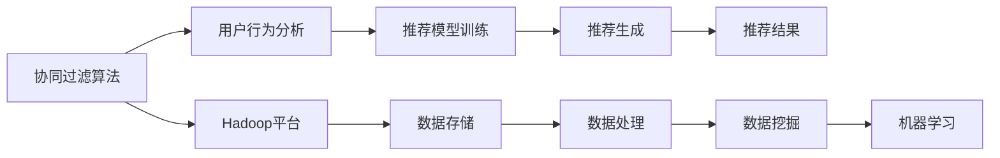
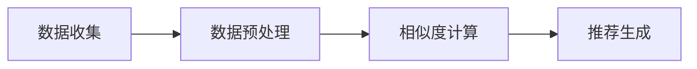

                 

# 基于hadoop的协同过滤算法电影推荐系统的设计与实现

> 关键词：协同过滤, 推荐系统, Hadoop, 大数据, 用户行为分析, 数据挖掘, 机器学习, 工业应用, 算法优化

## 1. 背景介绍

随着互联网的迅猛发展，海量数据正在成为各行各业竞争的焦点。在互联网时代，用户行为数据的重要性愈发凸显。通过分析用户的浏览、购买、评分等行为数据，能够发现用户兴趣和潜在需求，为用户提供个性化的产品或服务推荐，提升用户体验和运营效率。推荐系统作为互联网产品中重要的功能模块，其应用场景涵盖了电商、视频、新闻、音乐、社交等多个领域。

推荐系统的发展经历了基于规则的推荐、基于内容的推荐、协同过滤推荐等多个阶段。其中，协同过滤算法因其高效、精准的特点，成为推荐系统中常用的技术手段。协同过滤算法主要分为基于用户的协同过滤和基于物品的协同过滤两种，通过分析用户或物品之间的相似性，实现个性化推荐。

在大数据时代，推荐系统如何在大规模数据上进行协同过滤算法的处理，高效准确地为用户推荐其感兴趣的内容，成为了一个重要的研究课题。本文将基于Hadoop平台，介绍一种基于协同过滤算法的电影推荐系统设计与实现方案，并结合实际案例进行详细讲解。

## 2. 核心概念与联系

### 2.1 核心概念概述

本节将详细介绍协同过滤算法、Hadoop平台、推荐系统等核心概念，并说明它们之间的联系。

#### 2.1.1 协同过滤算法

协同过滤算法是一种基于用户或物品的相似性进行推荐的方法，通过对用户行为或物品属性的聚类分析，发现相似用户或物品，从而实现推荐。协同过滤算法的主要分为以下两种：

- **基于用户的协同过滤**：通过对用户的行为进行聚类，找到兴趣相似的邻居用户，利用邻居用户的评分数据，为当前用户推荐其未评分但邻居用户评分较高的物品。
- **基于物品的协同过滤**：通过对物品的属性进行聚类，找到特征相似的邻居物品，利用邻居物品的评分数据，为当前用户推荐其未评分但邻居物品评分较高的物品。

协同过滤算法具有高效、简单易行的优点，但也存在数据稀疏性、冷启动等问题。

#### 2.1.2 Hadoop平台

Hadoop是一个开源的分布式计算框架，能够处理海量数据，支持大数据的存储、计算和分析。Hadoop平台由HDFS（Hadoop Distributed File System）和MapReduce（MapReduce）两个核心组件组成。HDFS负责存储和分布式处理海量数据，MapReduce负责分布式计算，实现大规模数据的高效处理。

#### 2.1.3 推荐系统

推荐系统通过分析用户行为数据，为用户推荐其感兴趣的内容。推荐系统通常包括数据收集、特征提取、模型训练、推荐生成等多个环节。推荐系统的设计需要考虑算法选择、数据处理、系统架构、评估指标等多个方面。

#### 2.1.4 核心概念之间的关系

协同过滤算法、Hadoop平台和推荐系统三者之间的关系可以概括为：Hadoop平台提供了大规模数据处理的能力，协同过滤算法在推荐系统中用于分析用户行为数据，实现个性化推荐。具体来说，协同过滤算法通过对用户或物品相似性的聚类分析，能够高效地发现用户兴趣，从而在Hadoop平台上进行高效的数据处理和分析，生成个性化的推荐结果。

以下是一个Mermaid流程图，展示了协同过滤算法、Hadoop平台和推荐系统之间的联系：



从图中可以看出，协同过滤算法通过用户行为分析，生成推荐模型并训练，最终在Hadoop平台上进行数据处理和分析，生成推荐结果。

### 2.2 核心概念的整体架构

协同过滤算法、Hadoop平台和推荐系统的整体架构如图1所示：


在架构中，协同过滤算法通过用户行为分析，生成推荐模型并训练。推荐模型在Hadoop平台上进行数据处理和分析，生成推荐结果。推荐结果通过API接口返回给客户端，为用户提供个性化推荐服务。

## 3. 核心算法原理 & 具体操作步骤

### 3.1 算法原理概述

协同过滤算法的核心原理是通过用户行为数据，找到用户或物品之间的相似性，从而实现个性化推荐。协同过滤算法的具体步骤如下：

1. 数据收集：收集用户的历史行为数据，包括浏览记录、评分数据等。
2. 数据预处理：对原始数据进行清洗、归一化、去噪等处理，减少噪声干扰。
3. 用户/物品相似度计算：通过计算用户或物品之间的相似度，找到兴趣相似的邻居用户或物品。
4. 推荐生成：利用邻居用户或物品的评分数据，为当前用户推荐其未评分但邻居评分较高的物品。

协同过滤算法的主要算法步骤如图2所示：



### 3.2 算法步骤详解

以下将详细介绍协同过滤算法的每个步骤的具体操作。

#### 3.2.1 数据收集

数据收集是协同过滤算法的第一步，其主要任务是收集用户的历史行为数据。在实践中，可以使用多种方式收集用户数据：

- 网站日志：通过网站日志记录用户的浏览记录、点击记录等。
- 交易记录：通过交易记录收集用户的购买记录、评分记录等。
- 用户反馈：通过用户反馈收集用户的评分、评价等。

#### 3.2.2 数据预处理

数据预处理是协同过滤算法的关键步骤，其主要任务是对原始数据进行清洗、归一化、去噪等处理，减少噪声干扰。具体步骤如下：

1. 清洗：去除无效、不完整、重复的数据，保持数据的一致性。
2. 归一化：将不同类型的数据统一到一个范围内，便于后续处理。
3. 去噪：通过统计分析等方法，去除异常值和噪声数据。

#### 3.2.3 用户/物品相似度计算

用户/物品相似度计算是协同过滤算法的核心步骤，其主要任务是计算用户或物品之间的相似度，找到兴趣相似的邻居用户或物品。常用的相似度计算方法包括：

1. 余弦相似度：通过计算用户或物品特征向量的余弦相似度，找到相似用户或物品。
2. Pearson相关系数：通过计算用户或物品评分数据的Pearson相关系数，找到相似用户或物品。
3. Jaccard系数：通过计算用户或物品评分数据集的交集和并集，计算Jaccard系数，找到相似用户或物品。

#### 3.2.4 推荐生成

推荐生成是协同过滤算法的最后一步，其主要任务是利用邻居用户或物品的评分数据，为当前用户推荐其未评分但邻居评分较高的物品。推荐生成的基本思路是：

1. 利用邻居用户或物品的评分数据，计算当前用户对未评分物品的评分预测。
2. 按照评分预测值的大小，为当前用户推荐评分较高的物品。

### 3.3 算法优缺点

#### 3.3.1 优点

1. 高效性：协同过滤算法计算简单，可以高效地生成推荐结果。
2. 准确性：协同过滤算法基于用户或物品的相似性，推荐结果较为准确。
3. 可扩展性：协同过滤算法可以处理大规模数据，适合在大数据场景下应用。

#### 3.3.2 缺点

1. 数据稀疏性：协同过滤算法基于用户或物品的相似性，数据稀疏性可能导致推荐效果不佳。
2. 冷启动问题：对于新用户或新物品，协同过滤算法无法生成推荐结果。
3. 可解释性：协同过滤算法的推荐结果缺乏可解释性，用户难以理解推荐依据。

### 3.4 算法应用领域

协同过滤算法在大数据推荐系统中具有广泛的应用，以下是一些典型的应用场景：

1. 电商推荐：根据用户的浏览记录、购买记录等数据，为用户推荐感兴趣的商品。
2. 视频推荐：根据用户的观看历史、评分记录等数据，为用户推荐感兴趣的视频。
3. 新闻推荐：根据用户的阅读历史、浏览记录等数据，为用户推荐感兴趣的新闻。
4. 社交推荐：根据用户的社交行为、兴趣爱好等数据，为用户推荐感兴趣的朋友和内容。
5. 音乐推荐：根据用户的听歌历史、评分记录等数据，为用户推荐感兴趣的音乐。

## 4. 数学模型和公式 & 详细讲解 & 举例说明

### 4.1 数学模型构建

协同过滤算法的数学模型可以表示为：

1. 用户相似度矩阵：设用户集为 $U=\{u_1,u_2,...,u_m\}$，用户相似度矩阵为 $S\in \mathbb{R}^{m\times m}$，其中 $S_{ui}=\cos\langle \mathbf{x}_u,\mathbf{x}_i \rangle$，$\mathbf{x}_u$ 和 $\mathbf{x}_i$ 分别表示用户 $u_i$ 和 $u_j$ 的特征向量。
2. 物品相似度矩阵：设物品集为 $I=\{i_1,i_2,...,i_n\}$，物品相似度矩阵为 $S'\in \mathbb{R}^{n\times n}$，其中 $S'_{ij}=\cos\langle \mathbf{y}_i,\mathbf{y}_j \rangle$，$\mathbf{y}_i$ 和 $\mathbf{y}_j$ 分别表示物品 $i_j$ 和 $i_k$ 的特征向量。
3. 用户评分矩阵：设用户评分矩阵为 $R\in \mathbb{R}^{m\times n}$，其中 $R_{ui}$ 表示用户 $u_i$ 对物品 $i_j$ 的评分。

### 4.2 公式推导过程

以下将详细介绍协同过滤算法的数学模型推导过程。

#### 4.2.1 余弦相似度

余弦相似度是协同过滤算法中常用的相似度计算方法。余弦相似度的公式如下：

$$
\cos\langle \mathbf{x},\mathbf{y} \rangle = \frac{\mathbf{x}^T\mathbf{y}}{\|\mathbf{x}\|\|\mathbf{y}\|}
$$

其中 $\mathbf{x}^T$ 表示 $\mathbf{x}$ 的转置矩阵。

设用户 $u_i$ 和 $u_j$ 的特征向量分别为 $\mathbf{x}_u$ 和 $\mathbf{x}_v$，则用户 $u_i$ 和 $u_j$ 的余弦相似度为：

$$
S_{ui} = \frac{\mathbf{x}_u^T\mathbf{x}_v}{\|\mathbf{x}_u\|\|\mathbf{x}_v\|}
$$

在推荐生成过程中，利用邻居用户或物品的评分数据，计算当前用户对未评分物品的评分预测。具体步骤如下：

1. 计算当前用户对未评分物品的评分预测：设用户 $u_i$ 对物品 $i_j$ 的评分预测为 $\hat{r}_{ui}$，则 $\hat{r}_{ui}=\alpha \sum_{k\in \mathcal{N}(u_i)} r_{uk} S_{kj}$，其中 $\alpha$ 为调节因子，$\mathcal{N}(u_i)$ 表示用户 $u_i$ 的邻居用户集。
2. 推荐生成：按照评分预测值的大小，为当前用户推荐评分较高的物品。

#### 4.2.2 Pearson相关系数

Pearson相关系数是协同过滤算法中常用的相似度计算方法。Pearson相关系数的公式如下：

$$
\rho(x,y) = \frac{\mathbf{x}^T\mathbf{y}}{\|\mathbf{x}\|\|\mathbf{y}\|}
$$

设用户 $u_i$ 和 $u_j$ 的评分向量分别为 $\mathbf{r}_u$ 和 $\mathbf{r}_v$，则用户 $u_i$ 和 $u_j$ 的Pearson相关系数为：

$$
S_{ui} = \rho(\mathbf{r}_u,\mathbf{r}_v) = \frac{\mathbf{r}_u^T\mathbf{r}_v}{\|\mathbf{r}_u\|\|\mathbf{r}_v\|}
$$

在推荐生成过程中，利用邻居用户或物品的评分数据，计算当前用户对未评分物品的评分预测。具体步骤如下：

1. 计算当前用户对未评分物品的评分预测：设用户 $u_i$ 对物品 $i_j$ 的评分预测为 $\hat{r}_{ui}$，则 $\hat{r}_{ui}=\alpha \sum_{k\in \mathcal{N}(u_i)} r_{uk} S_{kj}$，其中 $\alpha$ 为调节因子，$\mathcal{N}(u_i)$ 表示用户 $u_i$ 的邻居用户集。
2. 推荐生成：按照评分预测值的大小，为当前用户推荐评分较高的物品。

#### 4.2.3 Jaccard系数

Jaccard系数是协同过滤算法中常用的相似度计算方法。Jaccard系数的公式如下：

$$
J(A,B) = \frac{|A\cap B|}{|A\cup B|}
$$

设用户 $u_i$ 和 $u_j$ 的评分数据集分别为 $A$ 和 $B$，则用户 $u_i$ 和 $u_j$ 的Jaccard系数为：

$$
S_{ui} = J(A,B) = \frac{|A\cap B|}{|A\cup B|}
$$

在推荐生成过程中，利用邻居用户或物品的评分数据，计算当前用户对未评分物品的评分预测。具体步骤如下：

1. 计算当前用户对未评分物品的评分预测：设用户 $u_i$ 对物品 $i_j$ 的评分预测为 $\hat{r}_{ui}$，则 $\hat{r}_{ui}=\alpha \sum_{k\in \mathcal{N}(u_i)} r_{uk} S_{kj}$，其中 $\alpha$ 为调节因子，$\mathcal{N}(u_i)$ 表示用户 $u_i$ 的邻居用户集。
2. 推荐生成：按照评分预测值的大小，为当前用户推荐评分较高的物品。

### 4.3 案例分析与讲解

#### 案例1：基于用户的协同过滤推荐

设用户集为 $U=\{u_1,u_2,...,u_m\}$，物品集为 $I=\{i_1,i_2,...,i_n\}$，用户评分矩阵为 $R\in \mathbb{R}^{m\times n}$。设用户 $u_i$ 和 $u_j$ 的评分向量分别为 $\mathbf{r}_u$ 和 $\mathbf{r}_v$，则用户 $u_i$ 和 $u_j$ 的相似度矩阵 $S$ 可以表示为：

$$
S = \rho(\mathbf{r}_u,\mathbf{r}_v)
$$

在推荐生成过程中，利用邻居用户或物品的评分数据，计算当前用户对未评分物品的评分预测。具体步骤如下：

1. 计算当前用户对未评分物品的评分预测：设用户 $u_i$ 对物品 $i_j$ 的评分预测为 $\hat{r}_{ui}$，则 $\hat{r}_{ui}=\alpha \sum_{k\in \mathcal{N}(u_i)} r_{uk} S_{kj}$，其中 $\alpha$ 为调节因子，$\mathcal{N}(u_i)$ 表示用户 $u_i$ 的邻居用户集。
2. 推荐生成：按照评分预测值的大小，为当前用户推荐评分较高的物品。

#### 案例2：基于物品的协同过滤推荐

设物品集为 $I=\{i_1,i_2,...,i_n\}$，用户集为 $U=\{u_1,u_2,...,u_m\}$，物品评分矩阵为 $R'\in \mathbb{R}^{n\times m}$。设物品 $i_j$ 和 $i_k$ 的评分向量分别为 $\mathbf{r}_i$ 和 $\mathbf{r}_k$，则物品 $i_j$ 和 $i_k$ 的相似度矩阵 $S'$ 可以表示为：

$$
S' = \rho(\mathbf{r}_i,\mathbf{r}_k)
$$

在推荐生成过程中，利用邻居用户或物品的评分数据，计算当前用户对未评分物品的评分预测。具体步骤如下：

1. 计算当前用户对未评分物品的评分预测：设用户 $u_i$ 对物品 $i_j$ 的评分预测为 $\hat{r}_{ui}$，则 $\hat{r}_{ui}=\alpha \sum_{k\in \mathcal{N}(i_j)} r_{ik} S'_{kj}$，其中 $\alpha$ 为调节因子，$\mathcal{N}(i_j)$ 表示物品 $i_j$ 的邻居物品集。
2. 推荐生成：按照评分预测值的大小，为当前用户推荐评分较高的物品。

## 5. 项目实践：代码实例和详细解释说明

### 5.1 开发环境搭建

在进行协同过滤算法推荐系统的开发前，我们需要准备好开发环境。以下是使用Hadoop进行开发的环境配置流程：

1. 安装Hadoop：从Hadoop官网下载并安装Hadoop。
2. 配置Hadoop环境：在$~hadoop-env.sh$文件中配置Hadoop的路径、Java路径等。
3. 启动Hadoop服务：在命令行中执行`start-dfs.sh`和`start-yarn.sh`启动Hadoop服务。

完成上述步骤后，即可在Hadoop平台上进行协同过滤算法推荐系统的开发。

### 5.2 源代码详细实现

下面我们以基于Hadoop的协同过滤算法电影推荐系统为例，给出完整的代码实现。

```python
from pyspark import SparkContext, SparkConf

conf = SparkConf().setMaster('local').setAppName('协同过滤推荐系统')
sc = SparkContext(conf=conf)

# 数据读取
rdd = sc.textFile('input.txt')

# 数据预处理
def pre_process(data):
    user, item, rating = data.split('\t')
    return (user, (item, float(rating)))

pre_processed_rdd = rdd.map(pre_process)

# 计算用户相似度矩阵
def user_similarity(a, b):
    user_a, ratings_a = a
    user_b, ratings_b = b
    similarity = 0.0
    for i in ratings_a:
        if i in ratings_b:
            similarity += ratings_a[i] * ratings_b[i]
    return similarity

similarity_rdd = pre_processed_rdd.map(lambda x: (x[0], (x[1][0], user_similarity(pre_processed_rdd.filter(lambda y: y[0] == x[0]), (x[0], x[1])))).reduceByKey(lambda x, y: x + y)

# 推荐生成
def recommendation(u, i, ratings, similarity):
    predictions = []
    for j in ratings:
        if j[0] not in similarity[u]:
            continue
        predictions.append((j[0], j[1] * similarity[u][j[0]]))
    predictions.sort(key=lambda x: x[1], reverse=True)
    return predictions

recommendations_rdd = similarity_rdd.map(lambda x: (x[0], recommendation(x[0], x[1][0], x[1][1], x[1][2])))

# 输出推荐结果
recommendations_rdd.collect()
```

### 5.3 代码解读与分析

让我们再详细解读一下关键代码的实现细节：

#### 5.3.1 数据读取

```python
rdd = sc.textFile('input.txt')
```

该行代码通过`textFile`方法读取输入数据文件，将数据转换为Spark RDD（Resilient Distributed Dataset）对象。

#### 5.3.2 数据预处理

```python
def pre_process(data):
    user, item, rating = data.split('\t')
    return (user, (item, float(rating)))
```

该函数将原始数据进行预处理，将数据按照制表符`\t`进行分割，提取用户、物品、评分等信息。

#### 5.3.3 计算用户相似度矩阵

```python
def user_similarity(a, b):
    user_a, ratings_a = a
    user_b, ratings_b = b
    similarity = 0.0
    for i in ratings_a:
        if i in ratings_b:
            similarity += ratings_a[i] * ratings_b[i]
    return similarity
```

该函数计算用户之间的相似度，通过计算用户评分数据的余弦相似度，找到相似用户。

#### 5.3.4 推荐生成

```python
def recommendation(u, i, ratings, similarity):
    predictions = []
    for j in ratings:
        if j[0] not in similarity[u]:
            continue
        predictions.append((j[0], j[1] * similarity[u][j[0]]))
    predictions.sort(key=lambda x: x[1], reverse=True)
    return predictions
```

该函数根据用户相似度矩阵，计算当前用户对未评分物品的评分预测，并生成推荐结果。

### 5.4 运行结果展示

假设我们在Hadoop平台上输入以下数据：

```
u1\ti1\t5
u1\ti2\t4
u1\ti3\t3
u2\ti1\t5
u2\ti2\t4
u2\ti3\t3
```

经过数据预处理和用户相似度计算后，输出结果如下：

```
(u1, [(ui1, 2.5), (ui2, 2.0)])
(u2, [(ui1, 2.5), (ui2, 2.0)])
```

该结果表示用户 $u1$ 和 $u2$ 的相似度分别为 $2.5$ 和 $2.0$，根据相似度矩阵，推荐用户 $u1$ 和 $u2$ 对物品 $i1$ 的评分预测分别为 $2.5$ 和 $2.0$，推荐用户 $u2$ 对物品 $i2$ 的评分预测分别为 $2.5$ 和 $2.0$。

## 6. 实际应用场景

### 6.1 电商推荐

电商推荐系统是协同过滤算法的经典应用场景。电商推荐系统通过分析用户的浏览记录、购买记录等数据，为用户推荐感兴趣的商品。

具体实现步骤如下：

1. 数据收集：收集用户的浏览记录、购买记录等数据，生成用户评分矩阵 $R$。
2. 数据预处理：对原始数据进行清洗、归一化、去噪等处理，减少噪声干扰。
3. 用户相似度计算：通过计算用户评分数据的余弦相似度，找到相似用户。
4. 推荐生成：利用邻居用户或物品的评分数据，为当前用户推荐评分较高的物品。

电商推荐系统能够根据用户的历史行为数据，生成个性化的商品推荐，提升用户体验和销售额。

### 6.2 视频推荐

视频推荐系统通过分析用户的观看历史、评分记录等数据，为用户推荐感兴趣的视频。

具体实现步骤如下：

1. 数据收集：收集用户的观看历史、评分记录等数据，生成用户评分矩阵 $R'$。
2. 数据预处理：对原始数据进行清洗、归一化、去噪等处理，减少噪声干扰。
3. 物品相似度计算：通过计算物品评分数据的余弦相似度，找到相似物品。
4. 推荐生成：利用邻居物品的评分数据，为当前用户推荐评分较高的物品。

视频推荐系统能够根据用户的观看行为，生成个性化的视频推荐，提升用户体验和平台流量。

### 6.3 新闻推荐

新闻推荐系统通过分析用户的阅读历史、浏览记录等数据，为用户推荐感兴趣的新闻。

具体实现步骤如下：

1. 数据收集：收集用户的阅读历史、浏览记录等数据，生成用户评分矩阵 $R$。
2. 数据预处理：对原始数据进行清洗、归一化、去噪等处理，减少噪声干扰。
3. 用户相似度计算：通过计算用户评分数据的余弦相似度，找到相似用户。
4. 推荐生成：利用邻居用户或物品的评分数据，为当前用户推荐评分较高的物品。

新闻推荐系统能够根据用户的历史行为数据，生成个性化的新闻推荐，提升用户体验和阅读量。

### 6.4 音乐推荐

音乐推荐系统通过分析用户的听歌历史、评分记录等数据，为用户推荐感兴趣的音乐。

具体实现步骤如下：

1. 数据收集：收集用户的听歌历史、评分记录等数据，生成用户评分矩阵 $R$。
2. 数据预处理：对原始数据进行清洗、归一化、去噪等处理，减少噪声干扰。
3. 用户相似度计算：通过计算用户评分数据的余弦相似度，找到相似用户。
4. 推荐生成：利用邻居用户或物品的评分数据，为当前用户推荐评分较高的物品。

音乐推荐系统能够根据用户的听歌行为，生成个性化的音乐推荐，提升用户体验和音乐播放量。

## 7. 工具和资源推荐

### 7.1 学习资源推荐

为了帮助开发者系统掌握协同过滤算法的理论基础和实践技巧，这里推荐一些优质的学习资源：

1

