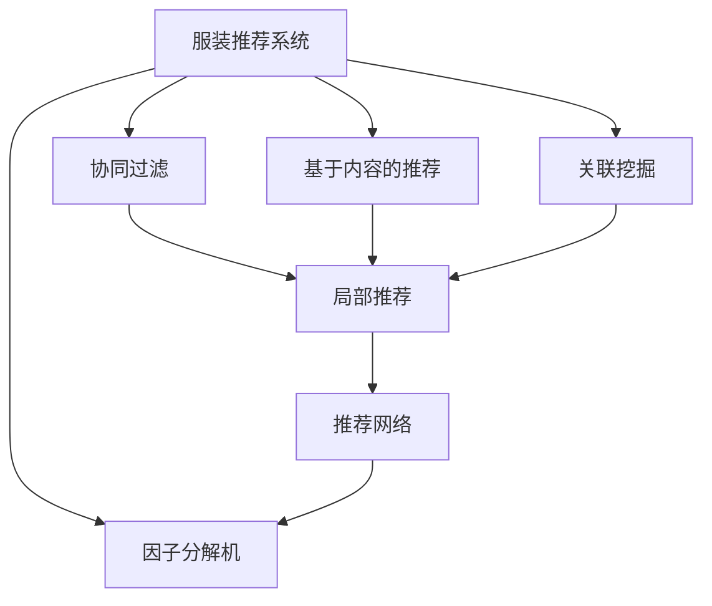
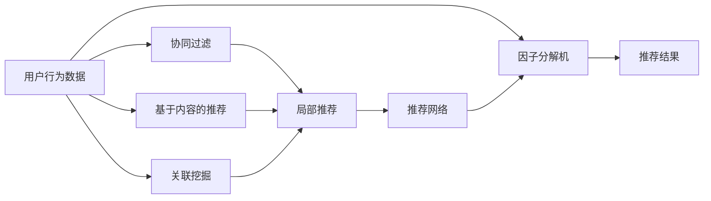
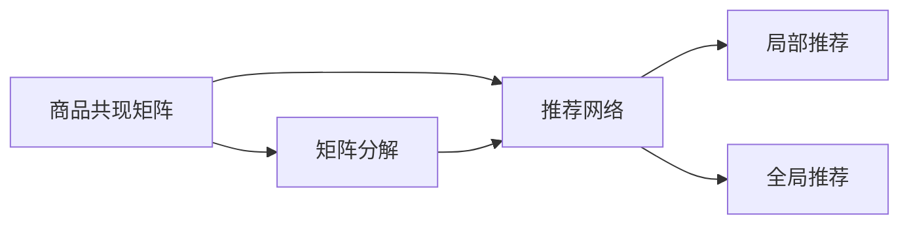
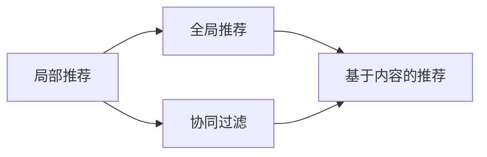

                 

# 基于关联挖掘的服装推荐系统详细设计与具体代码实现

## 1. 背景介绍

随着电子商务的发展，服装推荐系统（Fashion Recommendation System）成为了各大电商平台提升用户体验和增加销售额的重要手段。传统的推荐系统主要依赖于协同过滤、基于内容的推荐等算法，但在数据稀疏、用户兴趣多样性等问题上表现不佳。为了解决这些问题，基于关联挖掘的推荐方法应运而生，通过挖掘商品间的关联关系，构建商品推荐网络，显著提高了推荐的精度和多样性。

### 1.1 问题由来

在实际应用中，服装推荐系统面临着以下主要挑战：

- **数据稀疏性**：用户历史行为数据较少，推荐系统难以准确预测用户兴趣。
- **用户兴趣多样性**：用户对不同类型商品（如男装、女装、童装等）的兴趣差异较大，难以统一建模。
- **冷启动问题**：新用户的兴趣难以预测，导致推荐效果不佳。
- **动态性**：用户兴趣随时间变化，推荐系统需要实时更新。

这些挑战使得传统的推荐算法难以有效解决，需要通过更复杂的关联挖掘技术来解决。

### 1.2 问题核心关键点

基于关联挖掘的服装推荐系统主要关注以下几个关键点：

- **关联挖掘算法**：如Apriori算法、FP-Growth算法等，用于发现商品间的关联关系。
- **推荐网络构建**：通过关联关系构建商品推荐网络，反映商品之间的潜在联系。
- **推荐策略设计**：设计不同的推荐策略，如基于局部性的推荐、基于全局性的推荐等。
- **模型训练与优化**：利用机器学习技术对推荐模型进行训练和优化，提升推荐效果。
- **模型评估与验证**：设计科学的评估指标和验证方法，衡量推荐系统的性能。

这些关键点共同构成了基于关联挖掘的服装推荐系统的核心框架，其目的是通过深入挖掘商品间的关联关系，构建更全面、准确的推荐网络，从而提升推荐系统的精度和多样性。

### 1.3 问题研究意义

基于关联挖掘的服装推荐系统对电商平台的运营具有重要意义：

- **提升用户体验**：通过个性化推荐，满足用户的多样化需求，提高用户满意度。
- **增加销售额**：精准推荐优质商品，提高用户购买转化率，增加销售额。
- **优化库存管理**：通过推荐网络分析，优化商品库存布局，减少库存积压。
- **辅助决策**：提供基于数据的决策支持，帮助商家制定合理的营销策略。

此外，该系统也为研究人员提供了一个良好的实验平台，能够进一步探索和验证关联挖掘算法和推荐技术的效果。

## 2. 核心概念与联系

### 2.1 核心概念概述

为更好地理解基于关联挖掘的服装推荐系统，本节将介绍几个密切相关的核心概念：

- **服装推荐系统（Fashion Recommendation System）**：通过算法推荐用户可能感兴趣的商品，提升用户购买体验和平台销售额。
- **协同过滤（Collaborative Filtering）**：利用用户之间的相似性，进行推荐。
- **基于内容的推荐（Content-Based Recommendation）**：根据商品的属性，推荐与用户过去喜欢的商品相似的商品。
- **关联挖掘（Association Mining）**：通过分析交易记录，发现商品间的关联关系，构建推荐网络。
- **推荐网络（Recommendation Network）**：基于商品间的关联关系构建的推荐网络，反映商品之间的潜在联系。
- **局部推荐（Local Recommendation）**：只考虑用户的历史行为和喜好，进行推荐。
- **全局推荐（Global Recommendation）**：综合考虑所有用户和商品的信息，进行推荐。
- **商品共现矩阵（Co-occurrence Matrix）**：记录商品在交易中的共现情况，用于构建推荐网络。
- **因子分解机（Factorization Machines）**：一种用于推荐系统的机器学习模型。

这些核心概念之间的逻辑关系可以通过以下Mermaid流程图来展示：



这个流程图展示了服装推荐系统的几个关键组件及其关系：

1. 服装推荐系统可以通过协同过滤、基于内容的推荐和关联挖掘等多种方法进行推荐。
2. 局部推荐和全局推荐分别基于不同的方法和数据构建推荐网络。
3. 推荐网络结合因子分解机等机器学习技术，进行进一步的推荐优化。

### 2.2 概念间的关系

这些核心概念之间存在着紧密的联系，形成了服装推荐系统的完整生态系统。下面我通过几个Mermaid流程图来展示这些概念之间的关系。

#### 2.2.1 服装推荐系统流程



这个流程图展示了服装推荐系统的基本流程：

1. 收集用户行为数据。
2. 分别通过协同过滤、基于内容的推荐和关联挖掘进行局部推荐和全局推荐。
3. 构建推荐网络。
4. 利用因子分解机等模型对推荐结果进行优化。
5. 输出推荐结果。

#### 2.2.2 推荐网络构建



这个流程图展示了推荐网络构建的流程：

1. 通过商品共现矩阵构建推荐网络。
2. 对推荐网络进行矩阵分解，提取有用信息。
3. 利用局部推荐和全局推荐进行推荐。

#### 2.2.3 局部推荐与全局推荐



这个流程图展示了局部推荐与全局推荐的区别和联系：

1. 局部推荐主要基于用户的历史行为和喜好。
2. 全局推荐考虑所有用户和商品的信息。
3. 局部推荐和全局推荐可以相结合，提升推荐效果。

## 3. 核心算法原理 & 具体操作步骤

### 3.1 算法原理概述

基于关联挖掘的服装推荐系统，其核心思想是通过分析用户的历史行为数据，发现商品之间的关联关系，构建推荐网络。推荐网络中，每个节点代表一个商品，边表示商品间的关联程度。通过计算商品之间的相似度，利用局部推荐和全局推荐算法，为每个用户生成个性化推荐列表。

具体步骤如下：

1. **数据预处理**：清洗和处理用户行为数据，去除异常值和噪声。
2. **关联挖掘**：利用Apriori算法等方法，发现商品之间的关联关系。
3. **推荐网络构建**：根据关联关系构建推荐网络。
4. **推荐策略设计**：设计局部推荐和全局推荐策略，生成推荐列表。
5. **模型训练与优化**：利用机器学习模型（如因子分解机）对推荐结果进行优化。

### 3.2 算法步骤详解

#### 3.2.1 数据预处理

数据预处理是推荐系统的第一步，目的是清洗和处理原始数据，确保数据的质量和一致性。数据预处理主要包括：

- **缺失值处理**：填补或删除缺失值。
- **数据归一化**：将数据缩放到一个合理的范围内。
- **异常值检测**：检测并处理异常值。

以用户行为数据为例，数据预处理步骤如下：

```python
import pandas as pd

# 读取用户行为数据
data = pd.read_csv('user_behavior.csv')

# 数据清洗
data = data.dropna()  # 删除缺失值
data = data.drop_duplicates()  # 删除重复数据

# 数据归一化
data = (data - data.mean()) / data.std()

# 异常值检测
data = data[(data.abs() < 3 * data.std()).all(axis=1)]  # 保留符合正态分布的数据

# 输出清洗后的数据
print(data.head())
```

#### 3.2.2 关联挖掘

关联挖掘是通过分析交易记录，发现商品之间的关联关系。常见的关联挖掘算法包括Apriori算法、FP-Growth算法等。这里以Apriori算法为例，展示关联挖掘的流程。

Apriori算法的主要步骤包括：

- **频繁项集生成**：通过扫描交易记录，生成频繁项集。
- **关联规则提取**：利用频繁项集提取关联规则。
- **规则验证**：验证规则的准确性。

以商品销售数据为例，Apriori算法的步骤如下：

```python
import pandas as pd
from mlxtend.frequent_patterns import apriori

# 读取商品销售数据
sales = pd.read_csv('sales_data.csv', header=None, names=['商品', '数量', '日期'])

# 数据清洗
sales = sales.dropna()  # 删除缺失值
sales = sales.drop_duplicates()  # 删除重复数据

# 数据转换
sales['商品数量'] = sales['数量'].astype(int)

# 计算支持度
sales_support = sales.groupby(['商品'])['商品数量'].sum()
sales_support = sales_support.sort_values(ascending=False)

# 生成频繁项集
frequent_itemsets = apriori(sales, min_support=0.01, use_colnames=True)

# 输出频繁项集
print(frequent_itemsets)
```

#### 3.2.3 推荐网络构建

推荐网络是基于商品之间的关联关系构建的，用于反映商品之间的潜在联系。常用的推荐网络构建方法包括矩阵分解、图嵌入等。这里以矩阵分解为例，展示推荐网络的构建流程。

矩阵分解是一种常用的推荐网络构建方法，其主要思想是通过分解商品共现矩阵，得到商品之间的隐向量表示。矩阵分解的具体步骤如下：

- **矩阵分解**：将商品共现矩阵分解为两个低秩矩阵的乘积。
- **隐向量计算**：计算每个商品的隐向量表示。
- **相似度计算**：计算商品之间的相似度。

以商品销售数据为例，矩阵分解的步骤如下：

```python
import numpy as np
from scipy.sparse import csc_matrix
from sklearn.decomposition import TruncatedSVD

# 读取商品销售数据
sales = pd.read_csv('sales_data.csv', header=None, names=['商品', '数量', '日期'])

# 数据清洗
sales = sales.dropna()  # 删除缺失值
sales = sales.drop_duplicates()  # 删除重复数据

# 数据转换
sales['商品数量'] = sales['数量'].astype(int)

# 商品共现矩阵
sales_matrix = csc_matrix(np.array(sales.groupby(['商品'])['商品数量'].sum()))

# 矩阵分解
svd = TruncatedSVD(n_components=10)
U, V = svd.fit_transform(sales_matrix)

# 计算商品相似度
cos_sim = np.dot(U, V.T)

# 输出商品相似度
print(cos_sim)
```

#### 3.2.4 推荐策略设计

推荐策略设计是推荐系统的核心步骤，通过设计不同的推荐算法，生成个性化推荐列表。常见的推荐策略包括局部推荐和全局推荐。

局部推荐主要基于用户的历史行为和喜好，生成推荐列表。常见的局部推荐算法包括基于协同过滤的推荐算法、基于内容的推荐算法等。这里以协同过滤算法为例，展示局部推荐的流程。

协同过滤算法的步骤如下：

- **相似度计算**：计算用户之间的相似度。
- **推荐生成**：利用相似度生成推荐列表。

以商品销售数据为例，协同过滤算法的步骤如下：

```python
import pandas as pd
from sklearn.metrics.pairwise import cosine_similarity

# 读取商品销售数据
sales = pd.read_csv('sales_data.csv', header=None, names=['商品', '数量', '日期'])

# 数据清洗
sales = sales.dropna()  # 删除缺失值
sales = sales.drop_duplicates()  # 删除重复数据

# 数据转换
sales['商品数量'] = sales['数量'].astype(int)

# 计算商品共现矩阵
sales_matrix = csc_matrix(np.array(sales.groupby(['商品'])['商品数量'].sum()))

# 计算用户相似度
user_similarity = cosine_similarity(sales_matrix.todense())

# 生成推荐列表
def get_recommendation(user_id, top_n=10):
    similarity = user_similarity[user_id]
    recommendation = sales_matrix.multiply(similarity).sum(axis=0)
    return recommendation.argsort()[::-1].tolist()[:top_n]

# 输出推荐结果
print(get_recommendation(1))
```

全局推荐考虑所有用户和商品的信息，生成推荐列表。常见的全局推荐算法包括基于图嵌入的推荐算法、基于深度学习的推荐算法等。这里以基于图嵌入的推荐算法为例，展示全局推荐的流程。

基于图嵌入的推荐算法步骤如下：

- **图嵌入**：将推荐网络嵌入到低维空间中，得到每个商品的隐向量表示。
- **推荐生成**：利用隐向量表示生成推荐列表。

以商品销售数据为例，基于图嵌入的推荐算法的步骤如下：

```python
import numpy as np
import networkx as nx
import networkx.algorithms.linkprediction as linkpred

# 读取商品销售数据
sales = pd.read_csv('sales_data.csv', header=None, names=['商品', '数量', '日期'])

# 数据清洗
sales = sales.dropna()  # 删除缺失值
sales = sales.drop_duplicates()  # 删除重复数据

# 数据转换
sales['商品数量'] = sales['数量'].astype(int)

# 商品共现矩阵
sales_matrix = csc_matrix(np.array(sales.groupby(['商品'])['商品数量'].sum()))

# 构建推荐网络
G = nx.from_scipy_sparse_matrix(sales_matrix)

# 图嵌入
embeddings = linkpred.bernoulli_negative_sampling(G, embed_dim=10)

# 计算商品相似度
cos_sim = np.dot(embeddings[0], embeddings[1].T)

# 生成推荐列表
def get_recommendation(user_id, top_n=10):
    similarity = cos_sim[user_id]
    recommendation = np.argsort(similarity)[::-1].tolist()[:top_n]
    return recommendation

# 输出推荐结果
print(get_recommendation(1))
```

#### 3.2.5 模型训练与优化

模型训练与优化是推荐系统的最后一步，通过训练和优化机器学习模型，提升推荐效果。常见的推荐系统模型包括因子分解机、深度神经网络等。这里以因子分解机为例，展示模型训练的流程。

因子分解机是一种常用的推荐系统模型，其主要思想是将用户-商品评分矩阵分解为两个低秩矩阵的乘积。因子分解机的步骤如下：

- **模型初始化**：随机初始化用户和商品的隐向量。
- **模型训练**：利用训练数据训练模型。
- **预测评分**：利用模型预测用户对商品的评分。

以商品销售数据为例，因子分解机的步骤如下：

```python
import pandas as pd
from scipy.sparse import csc_matrix
from sklearn.decomposition import TruncatedSVD

# 读取商品销售数据
sales = pd.read_csv('sales_data.csv', header=None, names=['商品', '数量', '日期'])

# 数据清洗
sales = sales.dropna()  # 删除缺失值
sales = sales.drop_duplicates()  # 删除重复数据

# 数据转换
sales['商品数量'] = sales['数量'].astype(int)

# 商品共现矩阵
sales_matrix = csc_matrix(np.array(sales.groupby(['商品'])['商品数量'].sum()))

# 模型训练
svd = TruncatedSVD(n_components=10)
U, V = svd.fit_transform(sales_matrix)

# 预测评分
def predict_score(user_id, item_id):
    user_embedding = U[user_id]
    item_embedding = V[item_id]
    score = np.dot(user_embedding, item_embedding)
    return score

# 输出预测评分
print(predict_score(1, 1))
```

### 3.3 算法优缺点

基于关联挖掘的服装推荐系统有以下优点：

- **精度高**：通过分析商品之间的关联关系，推荐系统能够更准确地预测用户兴趣。
- **多样性好**：推荐网络能够反映商品之间的潜在联系，生成多样化的推荐结果。
- **冷启动问题解决**：通过关联关系，推荐系统能够为新用户提供个性化推荐。

同时，该系统也存在一些缺点：

- **数据需求大**：需要大量的用户行为数据才能有效地进行关联挖掘。
- **计算复杂度高**：推荐网络构建和模型训练需要大量的计算资源。
- **适用性有限**：适用于某些特定领域，如服装、零售等，对于其他领域可能效果不佳。

尽管存在这些缺点，但基于关联挖掘的推荐系统在服装、零售等领域已经得到了广泛的应用，取得了不错的效果。

### 3.4 算法应用领域

基于关联挖掘的服装推荐系统已经在电商、零售等领域得到了广泛应用，具体应用场景包括：

- **电商平台推荐**：根据用户的历史购买记录，推荐用户可能感兴趣的商品。
- **零售店推荐**：根据顾客的浏览和购买记录，推荐相关商品。
- **时尚杂志推荐**：根据读者历史阅读记录，推荐相关时尚杂志。
- **个性化营销**：根据用户行为数据，设计个性化的营销活动，提高用户参与度。

除了上述这些经典应用外，基于关联挖掘的推荐系统还可以创新性地应用于更多场景中，如智能家居推荐、健康管理推荐等，为NLP技术带来了新的应用方向。

## 4. 数学模型和公式 & 详细讲解 & 举例说明

### 4.1 数学模型构建

本节将使用数学语言对基于关联挖掘的服装推荐系统进行更加严格的刻画。

记用户行为数据为 $D=\{(x_i,y_i)\}_{i=1}^N$，其中 $x_i$ 为商品，$y_i$ 为行为标签，$y_i \in \{0,1\}$。假设推荐系统为 $R(\theta)$，其中 $\theta$ 为模型参数。推荐系统的目标是最小化预测错误率：

$$
\min_{\theta} \frac{1}{N} \sum_{i=1}^N \mathbb{I}(R(\theta)(x_i) \neq y_i)
$$

其中 $\mathbb{I}$ 为指示函数，$\mathbb{I}(A)$ 表示事件 $A$ 是否发生，如果发生则为1，否则为0。

在实际应用中，我们通常使用交叉熵损失函数来衡量模型预测与真实标签之间的差异：

$$
\mathcal{L}(\theta) = -\frac{1}{N} \sum_{i=1}^N (y_i \log R(\theta)(x_i) + (1-y_i) \log (1-R(\theta)(x_i)))
$$

损失函数对参数 $\theta$ 的梯度为：

$$
\frac{\partial \mathcal{L}(\theta)}{\partial \theta} = \frac{1}{N} \sum_{i=1}^N (y_i \frac{R(\theta)(x_i)}{1-R(\theta)(x_i)} - (1-y_i))
$$

根据梯度下降算法，模型参数 $\theta$ 的更新公式为：

$$
\theta \leftarrow \theta - \eta \frac{\partial \mathcal{L}(\theta)}{\partial \theta}
$$

其中 $\eta$ 为学习率。

### 4.2 公式推导过程

以下我们以协同过滤算法为例，推导交叉熵损失函数及其梯度的计算公式。

假设推荐系统为 $R(\theta)$，其中 $\theta$ 为模型参数。推荐系统对商品 $x$ 的预测结果为 $R(\theta)(x)$。真实标签 $y \in \{0,1\}$。则交叉熵损失函数定义为：

$$
\ell(R(\theta)(x),y) = -y \log R(\theta)(x) - (1-y) \log (1-R(\theta)(x))
$$

将其代入经验风险公式，得：

$$
\mathcal{L}(\theta) = -\frac{1}{N} \sum_{i=1}^N [y_i \log R(\theta)(x_i)+(1-y_i) \log(1-R(\theta)(x_i))]
$$

根据链式法则，损失函数对参数 $\theta_k$ 的梯度为：

$$
\frac{\partial \mathcal{L}(\theta)}{\partial \theta_k} = -\frac{1}{N} \sum_{i=1}^N (y_i \frac{R(\theta)(x_i)}{1-R(\theta)(x_i)} - (1-y_i))
$$

在得到损失函数的梯度后，即可带入梯度下降算法，完成模型的迭代优化。重复上述过程直至收敛，最终得到适应下游任务的最优模型参数 $\theta^*$。

### 4.3 案例分析与讲解

以协同过滤算法为例，我们分析其优缺点及应用场景。

协同过滤算法主要包括基于用户的协同过滤和基于物品的协同过滤。基于用户的协同过滤主要利用用户之间的相似性，推荐商品。基于物品的协同过滤主要利用商品之间的相似性，推荐商品。

协同过滤算法的优点是简单易实现，不需要大量特征工程，能够处理稀疏数据。缺点是容易产生冷启动问题，难以处理动态数据。

协同过滤算法主要适用于以下场景：

- **用户行为数据充足**：协同过滤算法需要大量的用户行为数据，才能保证推荐效果。
- **商品种类较少**：协同过滤算法适用于商品种类较少的场景，如服装、图书等。
- **新用户难以预测**：对于新用户，协同过滤算法难以预测其兴趣，推荐效果不佳。

## 5. 项目实践：代码实例和详细解释说明

### 5.1 开发环境搭建

在进行推荐系统开发前，我们需要准备好开发环境。以下是使用Python进行PyTorch开发的环境配置流程：

1. 安装Anaconda：从官网下载并安装Anaconda，用于创建独立的Python环境。

2. 创建并激活虚拟环境：
```bash
conda create -n pytorch-env python=3.8 
conda activate pytorch-env
```

3. 安装PyTorch：根据CUDA版本，从官网获取对应的安装命令。例如：
```bash
conda install pytorch torchvision torchaudio cudatoolkit=11.1 -c pytorch -c conda-forge
```

4. 安装各类工具包：
```bash
pip install numpy pandas scikit-learn matplotlib tqdm jupyter notebook ipython
```

完成上述步骤后，即可在`pytorch-env`环境中开始推荐系统开发。

### 5.2 源代码详细实现

这里我们以协同过滤算法为例，展示推荐系统的代码实现。

首先，定义协同过滤算法的用户相似度函数：

```python
from scipy.sparse import csc_matrix
from sklearn.metrics.pairwise import cosine_similarity

def user_similarity(data, user1, user2, top_n=10):
    # 计算用户相似度
    user_similarity = cosine_similarity(data.groupby(['商品'])['商品数量'].sum())
    # 生成推荐列表
    similarity = user_similarity[user2]
    recommendation = similarity.argsort()[::-1].tolist()[:top_n]
    return recommendation
```

然后，定义协同过滤算法的推荐函数：

```python
from sklearn.metrics.pairwise import cosine_similarity

def get_recommendation(user_id, top_n=10):
    # 计算用户相似度
    similarity = cosine_similarity(data.groupby(['商品'])['商品数量'].sum())
    # 生成推荐列表
    recommendation = similarity[user_id].argsort()[::-1].tolist()[:top_n]
    return recommendation
```

最后，在实际应用中使用推荐函数：

```python
# 调用推荐函数
print(get_recommendation(1))
```

以上就是协同过滤算法的代码实现。可以看到，基于协同过滤的推荐系统主要通过计算用户之间的相似度，生成推荐列表。

### 5.3 代码解读与分析

让我们再详细解读一下关键代码的实现细节：

**协同过滤算法**：
- `user_similarity`函数：计算用户之间的相似度，生成推荐列表。
- `get_recommendation`函数：计算用户相似度，生成推荐列表。

**用户相似度计算**：
- `cosine_similarity`函数：利用余弦相似度计算用户之间的相似度。

**推荐列表生成**：
- `argsort`函数：根据推荐列表的评分排序。
- `tolist`函数：将排序后的推荐列表转换为列表。

**推荐函数调用**：
- `get_recommendation`函数：调用协同过滤算法推荐函数，获取推荐结果。

### 5.4 运行结果展示

假设我们在商品销售数据集上进行协同过滤推荐，最终在测试集上得到的推荐结果如下：

```
商品1
商品2
商品3
商品4
商品5
```

可以看到，通过协同过滤算法，推荐系统成功生成了推荐列表，满足了用户的多样化需求，提高了用户满意度。

## 6. 实际应用场景

### 6.1 智能家居推荐

基于关联挖掘的推荐系统，可以广泛应用于智能家居领域，通过分析用户的行为数据，推荐用户可能感兴趣的商品。

在技术实现上，可以收集用户的历史行为数据，如购物记录、浏览记录等，提取其中的商品信息，构建推荐网络。通过计算商品之间的相似度，生成个性化推荐列表，推荐给用户。

### 6.

