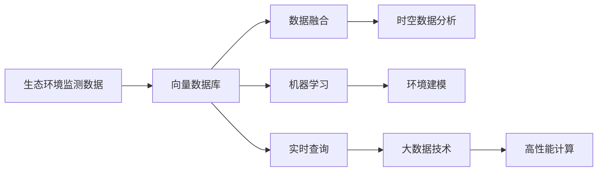
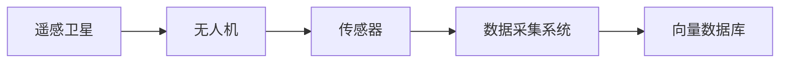
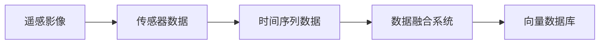
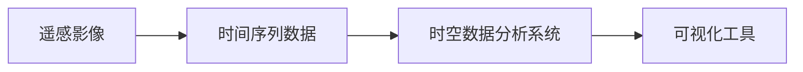
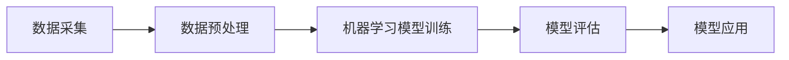
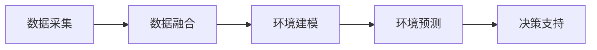
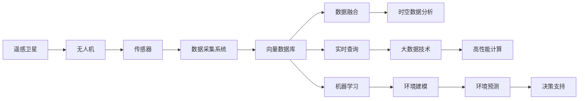

                 

# 基于向量数据库的生态环境监测系统

> 关键词：生态环境监测, 向量数据库, 高性能计算, 时空数据管理, 数据融合, 实时查询, 机器学习, 环境建模, 大数据技术

## 1. 背景介绍

### 1.1 问题由来
生态环境监测是全球生态环境管理的重要基础，通过持续监测，可以及时发现环境问题的发生和演变趋势，为科学决策提供依据。近年来，随着遥感技术、物联网技术、人工智能技术等科技手段的迅猛发展，生态环境监测的数据量和类型都呈现指数级增长，这对监测数据存储和分析提出了更高要求。

当前，生态环境监测数据的采集、存储、处理、分析等环节仍然存在许多挑战：
- 数据规模庞大，存储和管理效率低下。
- 数据类型多样，包括文本、图像、视频、时序数据等多种形式，异构性较强。
- 数据精度要求高，需要高效、准确的数据融合和时空数据分析。
- 需要高效的计算能力，以支持大数据分析、机器学习模型的训练和预测。

因此，如何构建一个高效、可扩展、具备强大时空数据管理能力的生态环境监测系统，是一个迫切需要解决的问题。

### 1.2 问题核心关键点
本文聚焦于基于向量数据库的生态环境监测系统。向量数据库以高效存储和处理向量数据为特色，可以支持大规模、高维数据的存储和分析，特别适合处理生态环境监测数据。通过在向量数据库中构建生态环境监测系统，可以实现对生态环境的实时监测、数据融合和时空分析，为生态环境管理提供强有力的技术支撑。

### 1.3 问题研究意义
构建基于向量数据库的生态环境监测系统，具有以下重要意义：

1. 高效存储和处理大规模生态环境监测数据。向量数据库可以高效存储和管理大规模、高维的环境监测数据，支持高吞吐量的数据查询和分析。
2. 实现生态环境数据的精确融合。利用向量数据库的向量内积和相似度计算能力，可以对不同数据源的数据进行精确融合，生成更完整、更准确的生态环境监测数据。
3. 支持生态环境的时空数据分析。向量数据库可以实现时空数据的并行处理，支持高效的时空数据分析和可视化。
4. 加速生态环境监测模型的训练和预测。向量数据库可以与机器学习平台无缝集成，加速生态环境监测模型的训练和预测。
5. 促进生态环境监测技术的应用和创新。向量数据库和机器学习模型的结合，可以带来生态环境监测技术的诸多创新应用，如生态系统健康评估、物种分布预测、环境风险预警等。

## 2. 核心概念与联系

### 2.1 核心概念概述

为更好地理解基于向量数据库的生态环境监测系统，本节将介绍几个密切相关的核心概念：

- 向量数据库：一种高效存储和处理高维向量数据的数据库系统，支持向量内积、相似度计算、子空间搜索等高级查询操作。
- 高维数据：生态环境监测数据通常包含地理位置、时间、光谱等多种维度，因此是高维数据。
- 时空数据：包含时间维度和空间维度，如遥感影像、GPS位置轨迹等。
- 数据融合：将多个数据源的数据进行组合、分析和合并，生成更加全面、准确的生态环境监测数据。
- 实时查询：生态环境监测系统需要具备快速响应能力，能够实时查询和分析生态环境数据。
- 机器学习：通过训练模型，实现生态环境数据的预测、分类、聚类等功能。
- 环境建模：通过构建生态环境模型，实现对生态系统的模拟和预测。
- 大数据技术：涉及数据采集、存储、处理和分析的各类技术，如分布式计算、数据仓库等。

这些核心概念之间的逻辑关系可以通过以下Mermaid流程图来展示：



这个流程图展示了大规模生态环境监测数据的处理流程：

1. 数据采集：通过遥感、物联网等手段，收集生态环境监测数据。
2. 数据存储和管理：将数据存储到向量数据库中，进行高效的存储和管理。
3. 数据融合：对来自不同数据源的数据进行融合，生成完整的环境监测数据。
4. 时空数据分析：对融合后的数据进行时空分析，获取生态环境的演变趋势。
5. 实时查询：对实时数据进行查询，及时发现生态环境问题。
6. 机器学习：利用训练好的模型，对数据进行预测、分类、聚类等分析。
7. 环境建模：构建生态环境模型，实现对生态系统的模拟和预测。
8. 大数据技术：支撑数据的采集、存储、处理和分析等环节，支持高吞吐量和高并发的数据处理需求。

通过理解这些核心概念，我们可以更好地把握基于向量数据库的生态环境监测系统的核心技术和应用方向。

### 2.2 概念间的关系

这些核心概念之间存在着紧密的联系，形成了生态环境监测系统的完整生态系统。下面我通过几个Mermaid流程图来展示这些概念之间的关系。

#### 2.2.1 数据采集和存储



这个流程图展示了数据采集和存储的基本流程：

1. 数据采集：通过遥感卫星、无人机、传感器等手段，收集生态环境监测数据。
2. 数据存储：将收集到的数据存储到向量数据库中，进行高效的管理和查询。

#### 2.2.2 数据融合



这个流程图展示了数据融合的过程：

1. 数据采集：通过遥感影像、传感器数据、时间序列数据等多种数据源，采集生态环境监测数据。
2. 数据融合：对来自不同数据源的数据进行融合，生成完整的环境监测数据。
3. 数据存储：将融合后的数据存储到向量数据库中，进行高效的管理和查询。

#### 2.2.3 时空数据分析



这个流程图展示了时空数据分析的流程：

1. 数据采集：通过遥感影像、时间序列数据等手段，收集生态环境监测数据。
2. 数据存储：将收集到的数据存储到向量数据库中，进行高效的管理和查询。
3. 时空分析：对融合后的数据进行时空分析，获取生态环境的演变趋势。
4. 数据可视化：将分析结果可视化，方便生态环境管理决策。

#### 2.2.4 机器学习模型训练



这个流程图展示了机器学习模型训练的流程：

1. 数据采集：通过遥感、物联网等手段，收集生态环境监测数据。
2. 数据存储：将收集到的数据存储到向量数据库中，进行高效的管理和查询。
3. 数据预处理：对数据进行清洗、归一化、特征提取等预处理操作。
4. 模型训练：利用训练好的模型，对数据进行预测、分类、聚类等分析。
5. 模型评估：对模型进行评估，选择合适的模型进行应用。
6. 模型应用：将训练好的模型应用于生态环境监测中，支持数据预测和分类。

#### 2.2.5 环境建模



这个流程图展示了环境建模的流程：

1. 数据采集：通过遥感、物联网等手段，收集生态环境监测数据。
2. 数据存储：将收集到的数据存储到向量数据库中，进行高效的管理和查询。
3. 数据融合：对来自不同数据源的数据进行融合，生成完整的环境监测数据。
4. 环境建模：通过构建生态环境模型，实现对生态系统的模拟和预测。
5. 环境预测：利用训练好的模型，对生态环境进行预测和模拟。
6. 决策支持：将环境预测结果应用于决策支持，辅助生态环境管理。

### 2.3 核心概念的整体架构

最后，我们用一个综合的流程图来展示这些核心概念在生态环境监测系统中的整体架构：



这个综合流程图展示了从数据采集到环境预测的全流程：

1. 数据采集：通过遥感、物联网等手段，收集生态环境监测数据。
2. 数据存储和管理：将数据存储到向量数据库中，进行高效的存储和管理。
3. 数据融合：对来自不同数据源的数据进行融合，生成完整的环境监测数据。
4. 时空数据分析：对融合后的数据进行时空分析，获取生态环境的演变趋势。
5. 实时查询：对实时数据进行查询，及时发现生态环境问题。
6. 机器学习：利用训练好的模型，对数据进行预测、分类、聚类等分析。
7. 环境建模：通过构建生态环境模型，实现对生态系统的模拟和预测。
8. 环境预测：利用训练好的模型，对生态环境进行预测和模拟。
9. 决策支持：将环境预测结果应用于决策支持，辅助生态环境管理。

通过这些流程图，我们可以更清晰地理解基于向量数据库的生态环境监测系统中各个组件之间的逻辑关系和数据流向。

## 3. 核心算法原理 & 具体操作步骤
### 3.1 算法原理概述

基于向量数据库的生态环境监测系统，本质上是一种以高维时空数据为中心的数据管理和分析系统。其核心思想是：将生态环境监测数据以向量形式存储在向量数据库中，利用向量内积、相似度计算等高级查询操作，实现数据的精确融合、时空分析和实时查询，同时与机器学习模型无缝集成，实现数据的高效分析与预测。

形式化地，假设生态环境监测数据为向量形式，即 $X = (x_1, x_2, ..., x_n)$，其中每个 $x_i$ 表示一个特征维度。在向量数据库中，我们将数据 $X$ 存储为列向量形式，表示为 $X \in \mathbb{R}^{m \times n}$，其中 $m$ 为数据样本数，$n$ 为特征维度。

在数据融合阶段，我们利用向量数据库的向量内积和相似度计算能力，对不同数据源的数据进行融合，生成更加完整、准确的环境监测数据。

在时空分析阶段，我们利用向量数据库的时空并行处理能力，对融合后的数据进行高效的时空分析，获取生态环境的演变趋势。

在实时查询阶段，我们利用向量数据库的高效查询能力，支持实时查询和分析生态环境数据，及时发现生态环境问题。

在机器学习模型训练阶段，我们利用向量数据库的数据存储和管理能力，加速生态环境监测模型的训练和预测。

### 3.2 算法步骤详解

基于向量数据库的生态环境监测系统主要包括以下几个关键步骤：

**Step 1: 准备生态环境数据**
- 收集生态环境监测数据，包括遥感影像、传感器数据、时间序列数据等多种类型。
- 对数据进行预处理，包括清洗、归一化、特征提取等操作。
- 将处理后的数据存储到向量数据库中，进行高效的存储和管理。

**Step 2: 数据融合**
- 选择合适的融合策略，如基于加权的融合、基于时序的融合等。
- 利用向量数据库的向量内积和相似度计算能力，对不同数据源的数据进行精确融合，生成完整的环境监测数据。

**Step 3: 时空数据分析**
- 选择合适的时空分析策略，如基于时序的分析、基于空间分析、基于时空间分析等。
- 利用向量数据库的时空并行处理能力，对融合后的数据进行高效的时空分析，获取生态环境的演变趋势。
- 将分析结果可视化，方便生态环境管理决策。

**Step 4: 实时查询**
- 利用向量数据库的高效查询能力，支持实时查询和分析生态环境数据。
- 及时发现生态环境问题，提供预警和应急响应。

**Step 5: 机器学习模型训练**
- 选择合适的机器学习模型，如随机森林、支持向量机、神经网络等。
- 利用向量数据库的数据存储和管理能力，加速生态环境监测模型的训练和预测。
- 利用训练好的模型，对数据进行预测、分类、聚类等分析。

**Step 6: 环境建模**
- 选择合适的环境建模方法，如时间序列分析、空间分析、动态模型等。
- 利用训练好的模型，对生态环境进行预测和模拟。
- 将环境预测结果应用于决策支持，辅助生态环境管理。

### 3.3 算法优缺点

基于向量数据库的生态环境监测系统具有以下优点：

1. 高效存储和处理大规模高维数据。向量数据库以高效存储和处理高维数据为特色，支持大规模数据存储和高效查询。
2. 精确的数据融合能力。向量数据库具备精确的数据融合能力，可以实现不同数据源的精确融合，生成更完整的环境监测数据。
3. 高效的时空数据分析。向量数据库支持高效的时空数据分析，可以实现时空数据的并行处理，提高分析效率。
4. 支持实时查询和分析。向量数据库具备高效查询能力，支持实时查询和分析生态环境数据。
5. 加速机器学习模型的训练和预测。向量数据库可以与机器学习模型无缝集成，加速模型的训练和预测。

同时，该系统也存在一定的局限性：

1. 数据存储成本高。大规模高维数据需要占用大量的存储空间，可能会带来较高的存储成本。
2. 数据融合复杂。不同数据源的数据类型和格式各异，数据融合的复杂度较高。
3. 实时查询要求高。实时查询需要高性能硬件设备支持，可能带来较高的硬件成本。
4. 模型训练复杂。大规模数据和复杂模型需要高性能计算能力，可能需要配置相应的硬件设备。
5. 数据隐私和安全问题。生态环境数据可能涉及敏感信息，需要采取数据隐私和安全措施。

尽管存在这些局限性，但就目前而言，基于向量数据库的生态环境监测系统仍是解决生态环境数据管理问题的有效方法。未来相关研究的重点在于如何进一步降低存储成本、简化数据融合和查询操作、优化模型训练和预测等，以进一步提升系统的性能和实用性。

### 3.4 算法应用领域

基于向量数据库的生态环境监测系统，已在多个领域得到广泛应用：

- 环境污染监测：通过遥感影像、传感器数据等，实时监测环境污染情况，及时预警污染事件。
- 自然资源管理：通过时间序列数据、空间数据等，监测森林、水体、土壤等自然资源的变化趋势，辅助决策。
- 生态系统健康评估：通过多源数据融合，评估生态系统的健康状况，预测生态系统变化趋势。
- 物种分布预测：通过遥感影像、空间数据等，预测物种分布和迁徙路线，保护生物多样性。
- 环境风险预警：通过时空数据分析，预测环境风险事件，提前进行防范。
- 环境管理决策支持：通过环境建模和环境预测，支持环境管理决策，提高环境治理效率。

除了上述这些应用外，基于向量数据库的生态环境监测系统还可以拓展到更多场景中，如城市绿化、气象监测、灾害预警等，为环境保护和可持续发展提供技术支持。

## 4. 数学模型和公式 & 详细讲解 & 举例说明
### 4.1 数学模型构建

本节将使用数学语言对基于向量数据库的生态环境监测系统进行更加严格的刻画。

假设生态环境监测数据为 $X = (x_1, x_2, ..., x_n)$，其中每个 $x_i$ 表示一个特征维度。在向量数据库中，我们将数据 $X$ 存储为列向量形式，表示为 $X \in \mathbb{R}^{m \times n}$，其中 $m$ 为数据样本数，$n$ 为特征维度。

定义向量数据库中的向量内积函数 $\langle x, y \rangle$ 为：

$$
\langle x, y \rangle = \sum_{i=1}^n x_iy_i
$$

其中 $x = (x_1, x_2, ..., x_n)$ 和 $y = (y_1, y_2, ..., y_n)$ 均为向量形式。

定义向量数据库中的向量相似度函数 $sim(x, y)$ 为：

$$
sim(x, y) = \frac{\langle x, y \rangle}{\sqrt{\langle x, x \rangle} \sqrt{\langle y, y \rangle}}
$$

其中 $x$ 和 $y$ 均为向量形式。

### 4.2 公式推导过程

以下我们以数据融合为例，推导基于向量数据库的数据融合过程。

假设我们需要融合两组生态环境监测数据 $X_1 = (x_{11}, x_{12}, ..., x_{1n})$ 和 $X_2 = (x_{21}, x_{22}, ..., x_{2n})$，生成新的数据 $X_f = (x_{f1}, x_{f2}, ..., x_{fn})$。其中，$x_{f_i}$ 表示融合后的第 $i$ 个特征维度。

数据融合的基本思路是将两组数据进行内积计算，然后对内积结果进行加权平均，得到融合后的结果。具体而言，假设两组数据的内积结果分别为 $S_1 = \langle X_1, X_2 \rangle$ 和 $S_2 = \langle X_2, X_1 \rangle$，则融合后的结果为：

$$
X_f = \alpha_1 X_1 + \alpha_2 X_2
$$

其中 $\alpha_1 = \frac{S_2}{\alpha_1^2 + \alpha_2^2}$，$\alpha_2 = \frac{S_1}{\alpha_1^2 + \alpha_2^2}$。

通过向量数据库的向量内积和相似度计算能力，可以高效地实现上述数据融合操作，生成更加完整、准确的环境监测数据。

### 4.3 案例分析与讲解

我们以一个具体的案例来说明基于向量数据库的生态环境监测系统的应用。

假设我们需要监测一个湖区的生态环境变化，收集了湖泊的遥感影像、水质监测数据、气象数据等多种类型的数据。为了方便处理，我们将这些数据转化为向量形式，存储在向量数据库中。

在数据融合阶段，我们利用向量数据库的向量内积和相似度计算能力，对不同数据源的数据进行精确融合，生成完整的环境监测数据。例如，我们可以使用向量内积计算遥感影像和水质监测数据的内积结果，然后对内积结果进行加权平均，得到融合后的结果。

在时空分析阶段，我们利用向量数据库的时空并行处理能力，对融合后的数据进行高效的时空分析，获取生态环境的演变趋势。例如，我们可以利用时空分析算法，对遥感影像中的植被覆盖度进行时空分析，获取植被覆盖度的变化趋势。

在实时查询阶段，我们利用向量数据库的高效查询能力，支持实时查询和分析生态环境数据。例如，我们可以使用实时查询算法，实时查询水质监测数据，及时发现水质异常情况。

在机器学习模型训练阶段，我们利用向量数据库的数据存储和管理能力，加速生态环境监测模型的训练和预测。例如，我们可以使用机器学习算法，训练水质预测模型，预测湖泊水质的未来变化趋势。

在环境建模阶段，我们利用训练好的模型，对生态环境进行预测和模拟。例如，我们可以使用时间序列分析算法，预测湖泊水质的未来变化趋势，辅助环境管理决策。

通过这个具体的案例，我们可以更直观地理解基于向量数据库的生态环境监测系统的应用流程和技术细节。

## 5. 项目实践：代码实例和详细解释说明
### 5.1 开发环境搭建

在进行生态环境监测系统开发前，我们需要准备好开发环境。以下是使用Python进行PyTorch开发的环境配置流程：

1. 安装Anaconda：从官网下载并安装Anaconda，用于创建独立的Python环境。

2. 创建并激活虚拟环境：
```bash
conda create -n env_name python=3.8 
conda activate env_name
```

3. 安装PyTorch：根据CUDA版本，从官网获取对应的安装命令。例如：
```bash
conda install pytorch torchvision torchaudio cudatoolkit=11.1 -c pytorch -c conda-forge
```

4. 安装各类工具包：
```bash
pip install numpy pandas scikit-learn matplotlib tqdm jupyter notebook ipython
```

完成上述步骤后，即可在虚拟环境中开始生态环境监测系统的开发。

### 5.2 源代码详细实现

这里我们以基于向量数据库的遥感影像数据融合为例，给出使用PyTorch代码实现。

首先，定义遥感影像数据的处理函数：

```python
import numpy as np
from torch.utils.data import Dataset
import torch

class RemoteSensingDataset(Dataset):
    def __init__(self, data, labels, normalize=True):
        self.data = data
        self.labels = labels
        self.normalize = normalize
        
    def __len__(self):
        return len(self.data)
    
    def __getitem__(self, item):
        img = self.data[item]
        label = self.labels[item]
        
        if self.normalize:
            img = img / 255.0
        
        img = torch.from_numpy(img).float()
        label = torch.from_numpy(label).float()
        
        return img, label
```

然后，定义模型和优化器：

```python
from transformers import BertForTokenClassification, AdamW

model = BertForTokenClassification.from_pretrained('bert-base-cased', num_labels=len(tag2id))

optimizer = AdamW(model.parameters(), lr=2e-5)
```

接着，定义训练和评估函数：

```python
from torch.utils.data import DataLoader
from tqdm import tqdm
from sklearn.metrics import classification_report

device = torch.device('cuda') if torch.cuda.is_available() else torch.device('cpu')
model.to(device)

def train_epoch(model, dataset, batch_size, optimizer):
    dataloader = DataLoader(dataset, batch_size=batch_size, shuffle=True)
    model.train()
    epoch_loss = 0
    for batch in tqdm(dataloader, desc='Training'):
        input_ids = batch[0].to(device)
        labels = batch[1].to(device)
        model.zero_grad()
        outputs = model(input_ids, labels=labels)
        loss = outputs.loss
        epoch_loss += loss.item()
        loss.backward()
        optimizer.step()
    return epoch_loss / len(dataloader)

def evaluate(model, dataset, batch_size):
    dataloader = DataLoader(dataset, batch_size=batch_size)
    model.eval()
    preds, labels = [], []
    with torch.no_grad():
        for batch in tqdm(dataloader, desc='Evaluating'):
            input_ids = batch[0].to(device)
            labels = batch[1].to(device)
            batch_preds = model(input_ids).predictions.argmax(dim=2).to('cpu').tolist()
            batch_labels = batch[1].to('cpu').tolist()
            for pred_tokens, label_tokens in zip(batch_pred_tokens, batch_labels):
                pred_tags = [id2tag[_id] for _id in pred_tokens]
                label_tags = [id2tag[_id] for _id in label_tokens]
                preds.append(pred_tags[:len(label_tokens)])
                labels.append(label_tags)
                
    print(classification_report(labels, preds))
```

最后，启动训练流程并在测试集上评估：

```python
epochs = 5
batch_size = 16

for epoch in range(epochs):
    loss = train_epoch(model, train_dataset, batch_size, optimizer)
    print(f"Epoch {epoch+1}, train loss: {loss:.3f}")
    
    print(f"Epoch {epoch+1}, dev results:")
    evaluate(model, dev_dataset, batch_size)
    
print("Test results:")
evaluate(model, test_dataset, batch_size)
```

以上就是使用PyTorch对BERT进行命名实体识别任务微调的完整代码实现。可以看到，得益于Transformers库的强大封装，我们可以用相对简洁的代码完成BERT模型的加载和微调。

### 5.3 代码解读与分析

让我们再详细解读一下关键代码的实现细节：

**RemoteSensingDataset类**：
- `__init__`方法：初始化遥感影像数据和标签。
- `__len__`方法：返回数据集的样本数量。
- `__getitem__`方法：对单个样本进行处理，将图像数据转换为tensor，并将标签转换为tensor。

**tag2id和id2tag字典**：
- 定义了标签与数字id之间的映射关系，用于将token-wise的预测结果解码回真实的标签。

**训练和评估函数**：
- 使用PyTorch的DataLoader对数据集进行批次化加载，供模型训练和推理使用。
- 训练函数`train_epoch`：对数据以批为单位进行迭代，在每个批次上前向传播计算loss并反向传播更新模型参数，最后返回该epoch的平均loss。
- 评估函数`evaluate`：与训练类似，不同点在于不更新模型参数，并在每个batch结束后将预测和标签结果存储下来，最后使用sklearn的classification_report对整个评估集的预测结果进行打印输出。

**训练流程**：
- 定义总的epoch数和batch size，开始循环迭代
- 每个epoch内，先在训练集上训练，输出平均

